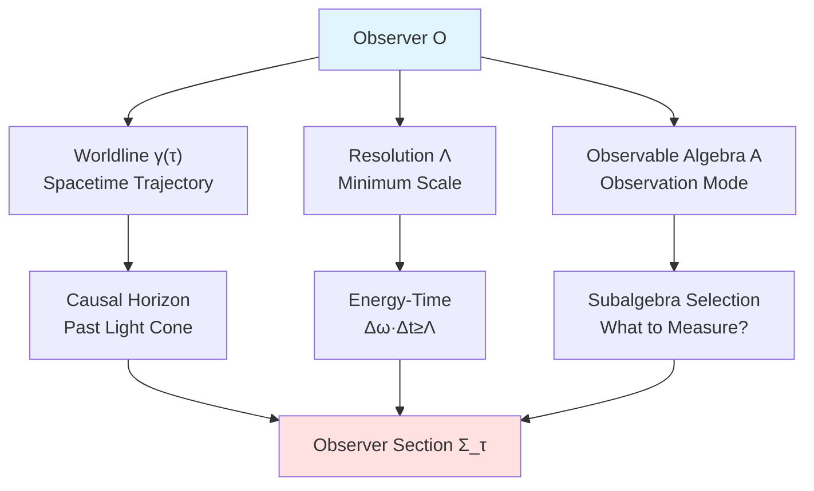
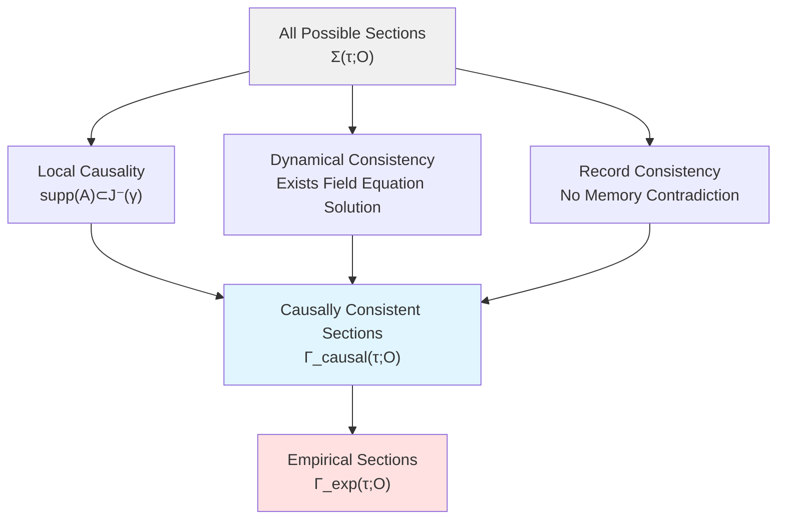
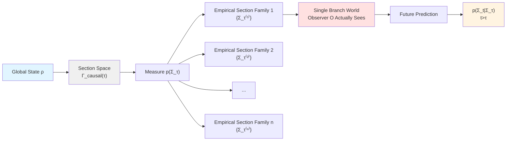
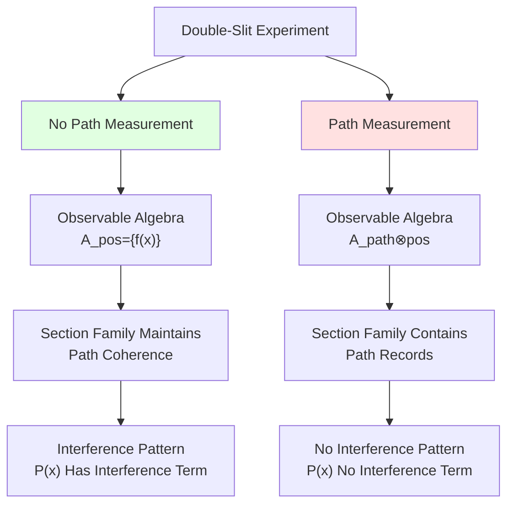
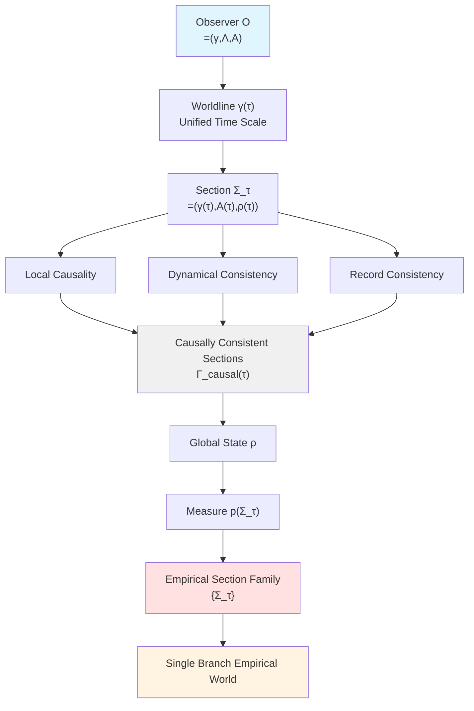

# Observer Worldline Sections—"Now" in Causal Structure

## Introduction: What is "Now"?

When you read this sentence, you say "this is **now**". But in relativistic 4-dimensional spacetime, there is no absolute "now"—different reference frames have different simultaneity. So what is the "now" observer experiences?

This chapter gives precise answer: **Observer's "now" is a section** $\Sigma_\tau$ **of their worldline on unified time scale** $\tau$. This section is not arbitrary, but subject to three constraints:
1. **Local Causality**: Can only see past light cone
2. **Dynamical Consistency**: Must exist local solution satisfying field equations
3. **Record Consistency**: Cannot contradict existing memory

Let us start from most basic structure, gradually construct this theory.

## Section One: Triplet Structure of Observer

### 1.1 Observer as Internal Object in Spacetime

In classical physics, observer often viewed as "external perspective". But in unified framework, **observer itself is part of spacetime**.

**Definition** (Observer):
Observer is triplet:
$$
\mathcal{O} = (\gamma,\ \Lambda,\ \mathcal{A}_{\gamma,\Lambda})
$$

where:
- **$\gamma: I \to M$**: Timelike worldline, parameterized by eigen time $\tau \in I \subset \mathbb{R}$
- **$\Lambda > 0$**: Resolution parameter, characterizes minimum resolvable scale of energy-time, space-momentum
- **$\mathcal{A}_{\gamma,\Lambda} \subset \mathcal{A}_\partial$**: Observable subalgebra, corresponding to channels and resolution

**Popular Understanding—Three Elements of Telescope**:
1. Worldline $\gamma$: Telescope's **position and trajectory**
2. Resolution $\Lambda$: Telescope's **lens precision** (how clearly can see)
3. Observable algebra $\mathcal{A}_{\gamma,\Lambda}$: Telescope's **observation mode** (visible light? Infrared? X-ray?)

Different telescopes (observers) in same spacetime, but see different "worlds"!

### 1.2 Unified Time Scale and Eigen Time

Parameterization of observer worldline uses **unified time scale** $[\tau]$. Recall its definition:

**Scale Identity**:
$$
\frac{\varphi'(\omega)}{\pi} = \rho_{\mathrm{rel}}(\omega) = \frac{1}{2\pi}\mathrm{tr}\ Q(\omega)
$$

where:
- $\varphi(\omega)$: Total scattering half-phase
- $\rho_{\mathrm{rel}}(\omega)$: Relative density of states
- $Q(\omega) = -i S(\omega)^\dagger \partial_\omega S(\omega)$: Wigner-Smith group delay matrix

In Boundary Time Geometry (BTG) framework, equivalence of three time scales proven:
1. **Scattering Time**: From trace of group delay matrix
2. **Modular Time**: From Tomita-Takesaki modular flow
3. **Geometric Time**: From Brown-York boundary Hamiltonian

**Observer's eigen time** $\tau_{\mathrm{prop}}$ defined along worldline $\gamma$, belongs to this equivalence class:
$$
\tau_{\mathrm{prop}} \in [\tau]
$$

**Popular Analogy—Three Readings of Watch**:
- Mechanical watch: Gear rotation (corresponds to scattering group delay)
- Electronic watch: Crystal frequency (corresponds to modular flow)
- Sundial: Sun position (corresponds to geometric time)

They read differently, but **conversion relation fixed** (affine transformation)—this is "equivalence class"!

### 1.3 Precise Definition of World Section

Now we can give core definition.

**Definition** (World Section):
On unified time scale $\tau$, world section of observer $\mathcal{O}$ is triplet:
$$
\Sigma_\tau = \bigl(\gamma(\tau),\ \mathcal{A}_{\gamma,\Lambda}(\tau),\ \rho_{\gamma,\Lambda}(\tau)\bigr)
$$

where:
1. **$\gamma(\tau) \in M$**: Observer's spacetime position at scale $\tau$
2. **$\mathcal{A}_{\gamma,\Lambda}(\tau) \subset \mathcal{A}_{\gamma,\Lambda}$**: Observable subalgebra readable or activatable at time $\tau$
3. **$\rho_{\gamma,\Lambda}(\tau)$**: Effective state on this subalgebra, obtained by conditioning and coarse-graining global state $\omega$

**Physical Meaning**:
Section $\Sigma_\tau$ is a **snapshot of world** observer can access at "now" $\tau$. But this snapshot not omniscient—limited by:
- **Causal Horizon**: Can only see past light cone of $\gamma(\tau)$
- **Resolution**: Details below energy $\Lambda$ cannot see
- **Observation Mode**: Can only measure operators in $\mathcal{A}_{\gamma,\Lambda}(\tau)$

**Popular Analogy—Limitations of Camera Photography**:
- Causal horizon: Camera can only photograph objects light has reached (cannot see "now" of Andromeda galaxy)
- Resolution: Lens pixels limited, cannot photograph atomic scale
- Observation mode: Only photograph visible light, cannot photograph infrared or ultraviolet

All sections $\Sigma_\tau$ constitute **section space**:
$$
\Sigma(\tau;\ \mathcal{O}) = \{\text{All sections satisfying basic measurability}\}
$$

But not all sections are "physically allowed"!

## Section Two: Causal Consistency—Physically Allowed Sections

### 2.1 Three Consistency Constraints

Simply giving triplet $(\gamma(\tau),\ \mathcal{A},\ \rho)$ not enough, must satisfy physical constraints.

**Definition** (Causally Consistent Section):
Section $\Sigma_\tau \in \Sigma(\tau;\ \mathcal{O})$ called **causally consistent**, if satisfies:

**Constraint 1: Local Causality**
For any $A \in \mathcal{A}_{\gamma,\Lambda}(\tau)$, its support located in **past causal region** of $\gamma(\tau)$:
$$
\mathrm{supp}(A) \subset J^-(\gamma(\tau))
$$

And any operator depending on future region has action on state invisible on $\mathcal{A}_{\gamma,\Lambda}(\tau)$.

**Popular Understanding**: Cannot "see future"!

**Constraint 2: Dynamical Consistency**
Exists family of local solutions $(g_{ab},\ \Phi)$ (including geometry and matter fields) defined on $(\tau-\epsilon,\ \tau+\epsilon)$, such that:
- For all $t \in (\tau-\epsilon,\ \tau+\epsilon)$, this solution satisfies Einstein equations and matter field equations
- Boundary algebra state induced by this solution, when restricted to $\mathcal{A}_{\gamma,\Lambda}(t)$, consistent with some $\rho_{\gamma,\Lambda}(t)$
- $\rho_{\gamma,\Lambda}(\tau)$ is one member

**Popular Understanding**: Must "evolve self-consistently"—adjacent moments connectable via field equations!

**Constraint 3: Record Consistency**
On subalgebra $\mathcal{A}_{\mathrm{mem}} \subset \mathcal{A}_{\gamma,\Lambda}(\tau)$ containing observer internal degrees of freedom and memory, $\rho_{\gamma,\Lambda}(\tau)$ consistent with previous sections at $\tau' < \tau$ via unitary evolution or CPTP map, **no configuration contradicting existing records**.

**Popular Understanding**: Cannot "memory confusion"—things remembered today cannot contradict yesterday!

Set of sections satisfying these three denoted:
$$
\Gamma_{\mathrm{causal}}^{\mathrm{dyn}}(\tau;\ \mathcal{O}) \subset \Sigma(\tau;\ \mathcal{O})
$$

### 2.2 Causal Diamonds and Existence of Local Solutions

**Key Question**: How to guarantee existence of causally consistent sections?

Answer comes from **Jacobson's entanglement equilibrium hypothesis**!

**Theorem** (Local Causally Consistent Extension):
Under assumptions:
1. $(M,\ g)$ stably causal and locally hyperbolic
2. State $\omega$ locally Hadamard state
3. On each small causal diamond satisfies generalized entropy extremum condition

Then for any $p \in M$, exists small causal diamond $D_{p,r}$ containing $p$, and family of local solutions $(g_{ab},\ \Phi)$ satisfying Einstein equations and matter field equations, such that:
- This solution exists and unique in $D_{p,r}$ (up to local diffeomorphism)
- Induced generalized entropy on boundary satisfies Jacobson-type extremum condition and QNEC/QFC constraints

**Proof Strategy**:
1. IBVP (initial-boundary value problem) on small causal diamond well-posed in appropriate function space
2. Energy conditions and QNEC/QFC guarantee no pathological focusing
3. Jacobson entanglement equilibrium: $\delta S_{\mathrm{gen}} = 0 \Leftrightarrow G_{ab} + \Lambda g_{ab} = 8\pi G T_{ab}$

**Popular Understanding—Jigsaw Puzzle Game**:
- Each small causal diamond is a "puzzle piece"
- Jacobson condition guarantees each piece "edges match"
- Take covering $\{D_{\gamma(\tau_i),r_i}\}$ along worldline $\gamma$, piece together local solutions, obtain complete picture

This guarantees in finite time interval $I = [\tau_0,\ \tau_1]$, at least exists one causally consistent section extension family!

### 2.3 Selection of Observable Subalgebra—Physical Meaning of Observation Mode

Different observation modes correspond to different $\mathcal{A}_{\gamma,\Lambda}(\tau)$. This not "subjective choice", but has **objective physical meaning**!

**Example 1: Position Measurement vs Momentum Measurement**
- Position mode: $\mathcal{A}_{\mathrm{pos}} = \{f(\hat{x})\}$
- Momentum mode: $\mathcal{A}_{\mathrm{mom}} = \{g(\hat{p})\}$

By Heisenberg uncertainty, cannot simultaneously measure precisely:
$$
[\hat{x},\ \hat{p}] = i\hbar \Rightarrow \mathcal{A}_{\mathrm{pos}} \not\subset \mathcal{A}_{\mathrm{mom}}
$$

**Example 2: Single Slit vs Double Slit**
- No path measurement: $\mathcal{A}_{\mathrm{screen}} = \{f(\hat{x}_{\mathrm{screen}})\}$
- Path measurement: $\mathcal{A}_{\mathrm{path \otimes screen}} = \{P_L,\ P_R,\ f(\hat{x}_{\mathrm{screen}})\}$

Introducing path detector **extends** observable subalgebra, causes decoherence!

**Example 3: Time-Domain Double Slit**
- Continuous observation: $\mathcal{A}_{\mathrm{cont}} = \{O(t)\ |\ t \in \mathbb{R}\}$
- Time window: $\mathcal{A}_{\mathrm{window}} = \{O(t)\ |\ t \in [t_1,\ t_1+\delta t] \cup [t_2,\ t_2+\delta t]\}$

Time window selects two "slits" on unified scale, interference appears in energy spectrum!

**Popular Analogy—Camera with Different Filters**:
- Black-white filter: Only see brightness (low-dimensional observable algebra)
- RGB filter: See three primary colors (medium-dimensional)
- Full spectrometer: See all wavelengths (high-dimensional)

Choosing different filters, photograph different "worlds"—but all are **different projections of same world**!

## Section Three: Global State and Measure on Section Space

### 3.1 From Hilbert Space to Section Space

In standard quantum mechanics, global state is density operator $\rho$ on Hilbert space. But observer cannot directly "see" $\rho$—can only see some section $\Sigma_\tau$!

How to "project" $\rho$ to section space?

**Key Idea**: Each section $\Sigma_\tau$ corresponds to an **effect operator** $E_{\Sigma_\tau}$.

**Definition** (Section Effect Operator Family):
For each $\tau$, exists mapping:
$$
\Sigma_\tau \mapsto E_{\Sigma_\tau}
$$

such that:
1. $E_{\Sigma_\tau} \ge 0$ (positive operator)
2. $\int_{\Gamma_{\mathrm{causal}}^{\mathrm{dyn}}(\tau;\ \mathcal{O})} E_{\Sigma_\tau}\ \mu(\mathrm{d}\Sigma_\tau) = \mathbb{I}$ (normalization)

**Probability Weight**:
$$
p(\Sigma_\tau) = \mathrm{Tr}(\rho\ E_{\Sigma_\tau})
$$

Thus obtain measure $p_\tau$ on section space.

**Popular Understanding—Voting System**:
- Global state $\rho$: "Total opinion" of all voters
- Section $\Sigma_\tau$: One specific "election result"
- Effect operator $E_{\Sigma_\tau}$: "Vote counting rule"
- Probability $p(\Sigma_\tau)$: "Vote share of this result"

Different vote counting rules (observable subalgebra), get different result distributions!

### 3.2 Consistent Histories Framework and Decoherence

Measure structure on section space closely related to **consistent histories** framework.

**Consistent Histories Review**:
Take finite time sequence $\tau_0 < \tau_1 < \cdots < \tau_n \subset I$, at each $\tau_k$ select POVM decomposition $\{E_{\alpha_k}^{(k)}\}$, define **history operator**:
$$
C_{\boldsymbol{\alpha}} = E_{\alpha_n}^{(n)} \cdots E_{\alpha_1}^{(1)} E_{\alpha_0}^{(0)}
$$

**Decoherence Condition**:
If for $\boldsymbol{\alpha} \ne \boldsymbol{\beta}$ have:
$$
\omega(C_{\boldsymbol{\alpha}} C_{\boldsymbol{\beta}}^\dagger) \approx 0
$$

Then interference terms negligible, history probability well-defined:
$$
p(\boldsymbol{\alpha}) = \omega(C_{\boldsymbol{\alpha}} C_{\boldsymbol{\alpha}}^\dagger)
$$

**Connection with Section Theory**:
- History $\boldsymbol{\alpha}$ corresponds to section family $\{\Sigma_{\tau_k}\}_{k=0}^n$
- Decoherence condition guarantees different histories "orthogonal" on observable subalgebra
- Conditionalization $p(\Sigma_t | \Sigma_\tau)$ defines prediction of future sections

**Popular Analogy—Multiple Parallel Universes vs Single Branch Movie**:
- Global state $\rho$: "Superposition" of all parallel universes
- Decoherence: Different universes "lose connection"
- Observer experience: In one of universe lines (single branch)

## Section Four: Empirical Section Family—World Observer Actually "Sees"

### 4.1 Definition of Empirical Section

Observer cannot simultaneously "see" all sections—can only see one **single branch path** among them.

**Definition** (Empirical Section):
Given observer $\mathcal{O}$ and scale $\tau$, if $\Sigma_\tau \in \Gamma_{\mathrm{causal}}^{\mathrm{dyn}}(\tau;\ \mathcal{O})$ satisfies:
1. $p(\Sigma_\tau) > 0$ (non-zero probability)
2. On memory subalgebra $\mathcal{A}_{\mathrm{mem}}$, $\rho_{\gamma,\Lambda}(\tau)$ consistent with actual observer's memory
3. Exists at least one causally consistent section extension family defined on $t \ge \tau$

Then $\Sigma_\tau$ called observer's **empirical section** at scale $\tau$.

All such sections constitute:
$$
\Gamma^{\mathrm{exp}}(\tau;\ \mathcal{O}) \subset \Gamma_{\mathrm{causal}}^{\mathrm{dyn}}(\tau;\ \mathcal{O})
$$

**Conditional State**:
$$
\omega_{\Sigma_\tau}(A) = \frac{\omega(E_{\Sigma_\tau} A E_{\Sigma_\tau})}{\omega(E_{\Sigma_\tau})},\quad A \in \mathcal{A}_{\gamma,\Lambda}(\tau)
$$

This is observer's **empirical world** at this section!

**Definition** (Empirical Section Family):
If exists mapping $\tau \mapsto \Sigma_\tau \in \Gamma^{\mathrm{exp}}(\tau;\ \mathcal{O})$, such that holds for almost all $\tau$ (relative to some natural measure), then $\{\Sigma_\tau\}_{\tau \in I}$ called observer's **empirical section family**.

**Popular Analogy—"Choose Your Own Adventure" Game Book**:
- Each page: One section $\Sigma_\tau$
- All possible paths: Section space $\Gamma_{\mathrm{causal}}$
- Path you actually flip: Empirical section family $\{\Sigma_\tau\}$
- Probability $p(\Sigma_\tau)$: "Plot reasonableness" of reaching this page

You can only play along **one path**, but all paths "exist" in book!

### 4.2 Core Theorem: Existence of Empirical Section Family

This is most important theorem of this chapter!

**Theorem** (Existence of Empirical Section Family):
Under assumptions:
1. Geometry-entropy consistency (stably causal, Hadamard state, generalized entropy extremum)
2. Section effect operator family well-defined

For any observer $\mathcal{O}$ and bounded interval $I = [\tau_0,\ \tau_1]$, exists non-empty empirical section family $\{\Sigma_\tau\}_{\tau \in I}$, satisfying:
1. For almost all $\tau \in I$, $\Sigma_\tau \in \Gamma^{\mathrm{exp}}(\tau;\ \mathcal{O})$
2. For any finite time sequence $\tau_0 < \cdots < \tau_n \subset I$, conditional states induced by $\{\Sigma_{\tau_k}\}$ consistent with consistent history probabilities
3. Any two empirical section families if consistent on $\mathcal{A}_{\mathrm{mem}}$ at some moment $\tau_\ast$, then on $[\tau_\ast,\ \tau_1]$ almost everywhere give same observable probability predictions

**Proof Outline**:
1. **Geometry Part**: Use small causal diamond covering and Jacobson entanglement equilibrium, obtain local solution family
2. **Probability Part**: Use consistent history decoherence condition, construct conditional measure on section space
3. **Memory Part**: Record consistency guarantees when different empirical families consistent on memory, predictions also consistent

**Physical Meaning**:
This theorem precisely expresses core claim: **Observer's empirical world can be characterized as single branch conditionalization path of causally consistent section family, while global superposition only manifests in probability distribution of future sections**!

### 4.3 Re-understanding Superposition and "Collapse"

**Theorem** (Superposition Only Manifests in Probability of Future Sections):
For any $\tau \in I$ and empirical section $\Sigma_\tau \in \Gamma^{\mathrm{exp}}(\tau;\ \mathcal{O})$, exists conditional measure $p(\cdot | \Sigma_\tau)$ defined on future section space $\Gamma_{\mathrm{causal}}^{\mathrm{dyn}}(>\tau;\ \mathcal{O})$, such that:
1. Observer's experience at moment $\tau$ determined by **single state** $\omega_{\Sigma_\tau}$, independent of other sections
2. So-called "superposition" only appears in conditional probabilities $p(\Sigma_t | \Sigma_\tau)$ for $t > \tau$ section predictions
3. If for some future event $F$ have $p(F | \Sigma_\tau) = 1$, then for all empirical section families consistent with $\Sigma_\tau$ records, $F$ necessarily occurs in experience

**Popular Understanding—Weather Forecast vs Actual Weather**:
- Global superposition: Weather model gives "tomorrow 60% sunny, 40% rainy"
- Observer's experience today: Single state (e.g., "today cloudy")
- "Collapse": When tomorrow arrives, from probability distribution becomes single result
- But this not "true collapse"—just from "prediction distribution" to "actual experience"

In section theory:
- **"Now"**: Single section $\Sigma_\tau$
- **"Future"**: Probability distribution $p(\Sigma_t | \Sigma_\tau),\ t > \tau$
- **"Collapse"**: When $\Sigma_t$ becomes "new now", other possibilities no longer "future", but "unrealized possibilities"

## Section Five: Section Reformulation of Double-Slit Experiment

Now let us re-understand classic experiments of quantum mechanics using section language.

### 5.1 Spatial Double Slit: No Path Measurement Case

**Experimental Setup**:
- Single particle incident state: $|\psi\rangle = \frac{1}{\sqrt{2}}(|L\rangle + |R\rangle)$
- Observer observable subalgebra: $\mathcal{A}_{\gamma,\Lambda}^{\mathrm{pos}} = \{f(\hat{x}_{\mathrm{screen}})\}$ (only screen position)

**Section Analysis**:
1. At each moment $\tau_k$, observer's section $\Sigma_{\tau_k}$ contains:
   - Position $\gamma(\tau_k)$
   - Observable algebra $\mathcal{A}^{\mathrm{pos}}$ (does not contain path information)
   - Effective state: $\rho_{\gamma,\Lambda}(\tau_k)$ on $\mathcal{A}^{\mathrm{pos}}$ maintains path coherence

2. Single click event corresponds to effect operator: $E_x \approx |x\rangle\langle x|$

3. After many repetitions, click point cloud density:
   $$
   P(x) = |\psi_L(x) + \psi_R(x)|^2 = |\psi_L(x)|^2 + |\psi_R(x)|^2 + 2\mathrm{Re}[\psi_L^\ast(x)\psi_R(x)]
   $$
   **Has interference term**!

**Understanding from Section Perspective**:
- Each click: One point in empirical section family
- Interference pattern: Result of statistical accumulation of empirical sections
- **Key**: Because $\mathcal{A}^{\mathrm{pos}}$ does not contain path operators, section family inherits global coherence!

**Popular Analogy—Projector Focus Mode**:
- No path measurement: Projector focuses on "screen" (position)
- Pattern seen: Interference fringes (coherence information preserved)

### 5.2 Spatial Double Slit: Path Detection Case

**Experimental Setup**:
- System-environment joint state: $|\Psi\rangle = \frac{1}{\sqrt{2}}(|L\rangle \otimes |E_L\rangle + |R\rangle \otimes |E_R\rangle)$
- Environment pointer states $|E_L\rangle,\ |E_R\rangle$ approximately orthogonal
- Observable subalgebra extended: $\mathcal{A}_{\gamma,\Lambda}^{\mathrm{path \otimes pos}} = \{f(\hat{x}),\ P_L \otimes \mathbb{I},\ P_R \otimes \mathbb{I}\}$

**Section Analysis**:
1. Section $\Sigma_{\tau_k}$ now contains path record
2. After partial trace over environment:
   $$
   \rho_{\mathrm{screen}} \approx \frac{1}{2}(|L\rangle\langle L| + |R\rangle\langle R|)
   $$
   **No interference term**! (decoherence)

3. Click point cloud density:
   $$
   P_{\mathrm{decoh}}(x) \propto |\psi_L(x)|^2 + |\psi_R(x)|^2
   $$

**Understanding from Section Perspective**:
- Introducing path detector → Extends $\mathcal{A}_{\gamma,\Lambda}$
- Extended section family contains path records
- Different path histories "orthogonal" on $\mathcal{A}_{\mathrm{mem}}$ → Decoherence
- Interference terms suppressed to negligible

**Popular Analogy—Labeled Projector**:
- Path measurement: Projector simultaneously displays "path label" and "position"
- Label information "contaminates" coherence
- Pattern seen: Two independent Gaussian peaks (no interference)

### 5.3 Wheeler Delayed Choice Experiment

**Experimental Setup**:
After particle passes first beam splitter (BS1), decide whether to insert second beam splitter (BS2) in spatially separated region.

**Two Configurations**:
1. **Insert BS2**: Observe interference, observable algebra $\mathcal{A}_{\mathrm{interference}}$
2. **No BS2**: Observe path, observable algebra $\mathcal{A}_{\mathrm{path}}$

**"Paradox"**:
Decision made after particle "already passed BS1", seems to "backwardly influence past"?

**Section Theory Answer**:
1. Decision event $D$ occurs at moment $\tau_D$
2. Detection event $E$ occurs at moment $\tau_E > \tau_D$
3. **Local Causality** requires: $D$ must be in **past light cone** of $E$

**Key Insight**:
- "Delayed choice" changes structure of **future section space** $\Gamma_{\mathrm{causal}}(>\tau_D)$
- Different configurations correspond to different $\mathcal{A}_{\gamma,\Lambda}(\tau_E)$
- But this does not violate causality: Decision $D$ in past of $E$, completely conforms to $\mathrm{supp}(A) \subset J^-(E)$!

**Popular Analogy—Plot Branch in Game**:
- At level 5 (BS1) choose "left path" or "right path"
- But at level 6 (decision point) can choose "watch plot" or "skip plot"
- This does not change "what you chose at level 5", only changes "what you see at level 7 (detection)"

**Mathematical Formulation**:
- Insert BS2: Section family $\{\Sigma_\tau^{\mathrm{int}}\}$, where $\mathcal{A}_{\gamma,\Lambda}^{\mathrm{int}}(\tau_E)$ contains phase information
- No BS2: Section family $\{\Sigma_\tau^{\mathrm{path}}\}$, where $\mathcal{A}_{\gamma,\Lambda}^{\mathrm{path}}(\tau_E)$ contains path information

Two agree on $\tau < \tau_D$, differ on $\tau \ge \tau_E$—this is **selection of future sections**, not change of past!

### 5.4 Time-Domain Double Slit Experiment

**Experimental Setup**:
Open two "windows" in time $[\tau_1,\ \tau_1+\delta\tau]$, $[\tau_2,\ \tau_2+\delta\tau]$ via pump pulses, detect optical field energy spectrum.

**Section Analysis**:
1. Observable subalgebra selects time windows:
   $$
   \mathcal{A}_{\gamma,\Lambda}^{\mathrm{window}} = \{O(\omega)\ |\ \omega \in \text{frequency domain}\}
   $$

2. Interval between two windows on unified time scale $\tau$: $\Delta\tau = \tau_2 - \tau_1$

3. Energy spectrum interference fringe spacing:
   $$
   \Delta\omega \cdot \Delta\tau \sim 2\pi
   $$

**Understanding from Section Perspective**:
- Time windows: "Sampling" of unified scale $[\tau]$
- Two windows: Two section families $\{\Sigma_\tau^{(1)}\}$, $\{\Sigma_\tau^{(2)}\}$
- Energy spectrum interference: Coherent superposition of two section families on frequency reading subalgebra

**Popular Analogy—Shutter Time Control**:
- Spatial double slit: Two spatial positions' "slits"
- Time double slit: Two time positions' "slits"
- Spatial interference: Fringes in position
- Time interference: Fringes in frequency (Fourier dual)

**Key Role of Unified Time Scale**:
Whether measure $\Delta\tau$ by eigen time, group delay, or modular time, its relationship with $\Delta\omega$ consistent within equivalence class! This makes time double slit **direct physical realization of boundary time geometry**.

## Section Six: Engineering Implementation Schemes

How to test section theory in laboratory?

### 6.1 Section Engineering in Microwave Scattering Network

**Goal**: Explicitly construct different observable subalgebras in controllable scattering network, observe effects of section selection.

**Experimental Steps**:
1. **Design Dual-Path Network**:
   - Left path $\mathcal{N}_L$, right path $\mathcal{N}_R$
   - Tunable scattering phases $\phi_L(\omega),\ \phi_R(\omega)$

2. **Configuration 1: No Path Measurement**
   - Only measure output port power $P_{\mathrm{out}}(\omega)$
   - Corresponds to $\mathcal{A}_{\gamma,\Lambda}^{\mathrm{pos}} = \{P_{\mathrm{out}}\}$

3. **Configuration 2: Path Detection**
   - Insert absorber/amplifier in each path, introduce path markers
   - Corresponds to $\mathcal{A}_{\gamma,\Lambda}^{\mathrm{path \otimes pos}} = \{P_L,\ P_R,\ P_{\mathrm{out}}\}$

4. **Measurement**:
   - Compare $P_{\mathrm{out}}(\omega)$ under two configurations
   - Verify configuration 1 has interference, configuration 2 no interference

5. **Group Delay Consistency**:
   - Measure Wigner-Smith group delay $Q(\omega)$
   - Verify $\frac{1}{2\pi}\mathrm{tr}\ Q(\omega) = \frac{\varphi'(\omega)}{\pi}$
   - Confirm connection between section selection and unified time scale

**Prediction**:
Changes in group delay scale, interference visibility can be unified explained under scale identity, no super-causality needed!

### 6.2 ITO Optical Time Double Slit

**Goal**: Realize double slit in time domain, test role of unified time scale in time double slit.

**Experimental Steps**:
1. Use ITO thin film, induce two refractive index jumps via pump pulses
2. Time interval $\Delta\tau$ tunable
3. Measure probe light energy spectrum $S(\omega)$
4. Observe energy spectrum interference fringes, verify $\Delta\omega \propto 1/\Delta\tau$

**Section Theory Prediction**:
- Energy spectrum fringe spacing and time window interval satisfy Fourier relation
- Whether measure $\Delta\tau$ by eigen time, group delay, or modular time, relation consistent within equivalence class

### 6.3 Time-Frequency Interference in Atomic Quantum Memory

**Goal**: Realize time-frequency double slit in quantum memory, directly test memory sections.

**Experimental Steps**:
1. Couple two time-separated tunable write pulses to cold atom ensemble
2. Generate two coherent collective spin-wave modes
3. During readout, measure time distribution and energy spectrum
4. Incorporate storage-readout process into $\mathcal{A}_{\mathrm{mem}}$, analyze "memory sections"

**Section Theory Prediction**:
- Long-lived memory degrees of freedom correspond to extension of $\mathcal{A}_{\mathrm{mem}}$
- Consistency of empirical section family on memory subalgebra can be tested via readout statistics

## Chapter Summary

This chapter established complete theory of **observer worldline sections**:

**Core Concepts**:
1. **Observer**: Triplet $(\gamma,\ \Lambda,\ \mathcal{A}_{\gamma,\Lambda})$
2. **World Section**: $\Sigma_\tau = (\gamma(\tau),\ \mathcal{A}_{\gamma,\Lambda}(\tau),\ \rho_{\gamma,\Lambda}(\tau))$
3. **Causal Consistency**: Local causality, dynamical consistency, record consistency
4. **Empirical Section Family**: Single branch path observer actually sees

**Core Theorems**:
1. **Existence**: Under Jacobson entanglement equilibrium hypothesis, causally consistent section family necessarily exists
2. **Uniqueness (mod memory)**: Two empirical families if memory consistent, then predictions consistent
3. **Superposition Reformulation**: Superposition only manifests in probability of future sections $p(\Sigma_t | \Sigma_\tau)$

**Experimental Applications**:
- Double-slit experiment: Different $\mathcal{A}_{\gamma,\Lambda}$ correspond to different section families
- Delayed choice: Changes future section structure, does not violate causality
- Time double slit: Direct verification of unified time scale

**Philosophical Implications**:
- "Now" not absolute, but section on observer worldline
- "Collapse" not physical process, but cognitive transition from probability distribution to single experience
- "Many worlds" and "single branch" not contradictory: Measure exists on section space, experience exists on single branch

**Poetic Ending**:

Observer not bystander outside spacetime,
But a **worldline** inside spacetime.
Each "now" not absolute time slice,
But **section** under causal-dynamical-memory constraints.
Global superposition not disappeared,
Just retreated to **probability cloud of future**.
We proceed along empirical section family,
On unified time scale,
Physics and experience finally reconcile.

---

**Quick Reference of Core Formulas**:

**Observer**:
$$
\mathcal{O} = (\gamma: I \to M,\ \Lambda,\ \mathcal{A}_{\gamma,\Lambda})
$$

**World Section**:
$$
\Sigma_\tau = (\gamma(\tau),\ \mathcal{A}_{\gamma,\Lambda}(\tau),\ \rho_{\gamma,\Lambda}(\tau))
$$

**Causally Consistent Conditions**:
1. $\mathrm{supp}(A) \subset J^-(\gamma(\tau))$
2. Exists local solution $(g_{ab},\ \Phi)$ satisfying Einstein equations
3. $\rho_{\gamma,\Lambda}(\tau)$ consistent with previous states on $\mathcal{A}_{\mathrm{mem}}$

**Conditional State**:
$$
\omega_{\Sigma_\tau}(A) = \frac{\omega(E_{\Sigma_\tau} A E_{\Sigma_\tau})}{\omega(E_{\Sigma_\tau})}
$$

**Future Prediction**:
$$
p(\Sigma_t | \Sigma_\tau) = \frac{p(\Sigma_t \cap \Sigma_\tau)}{p(\Sigma_\tau)},\quad t > \tau
$$

**Theoretical Sources**:
- `observer-world-section-structure-causality-conditionalization.md`
- Jacobson entanglement equilibrium: `arxiv.org/abs/1505.04753`
- QNEC/QFC: `arxiv.org/abs/1509.02542`

---

Next chapter we will deeply explore **mathematical definition of consciousness**, giving five structural criteria of consciousness using quantum Fisher information, mutual information, and causal controllability!

