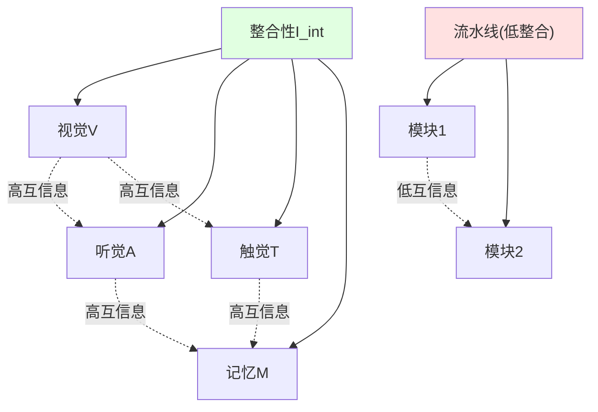
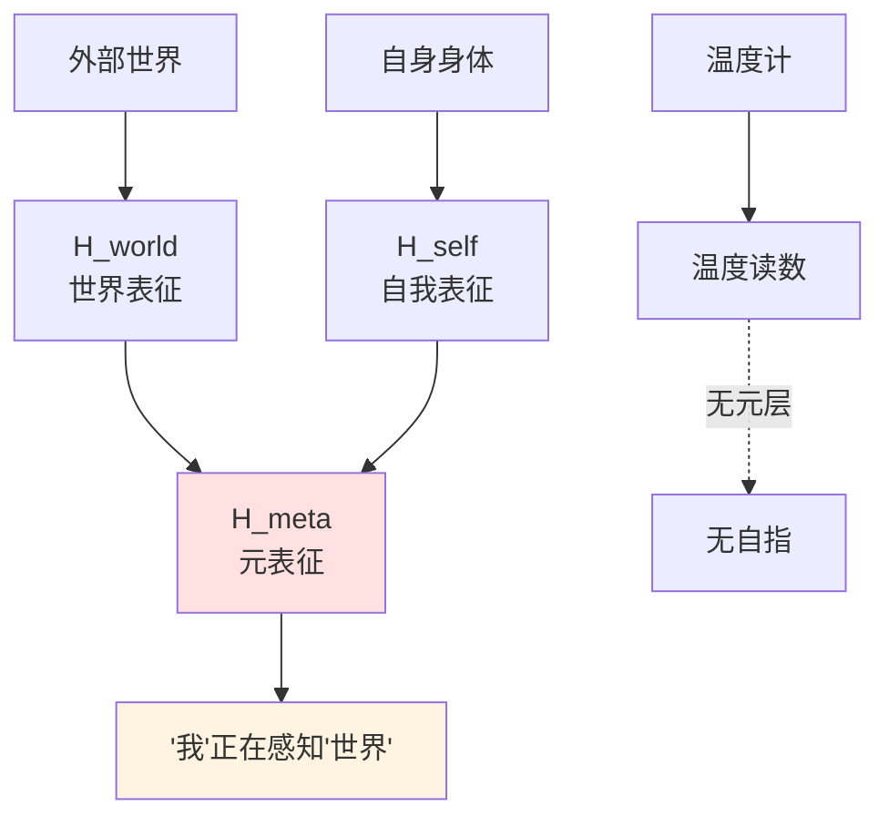
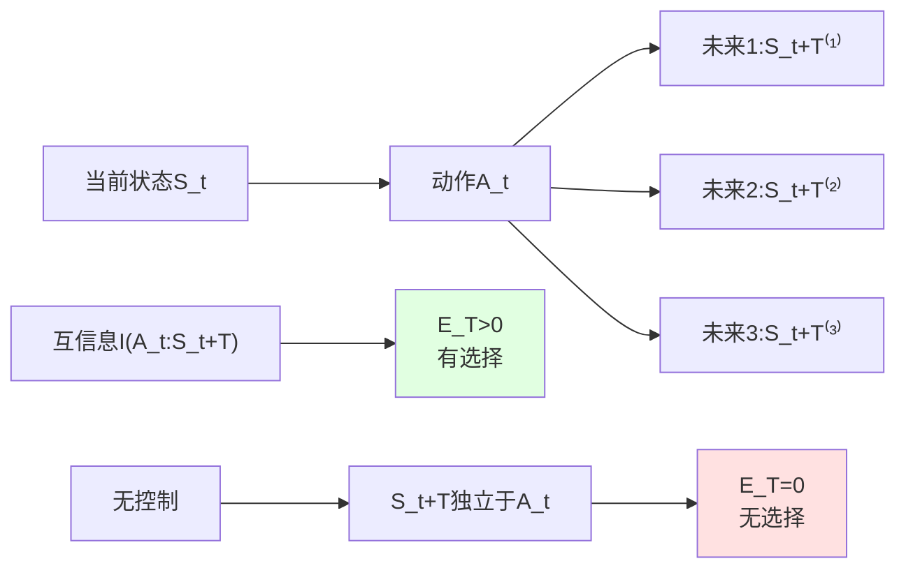
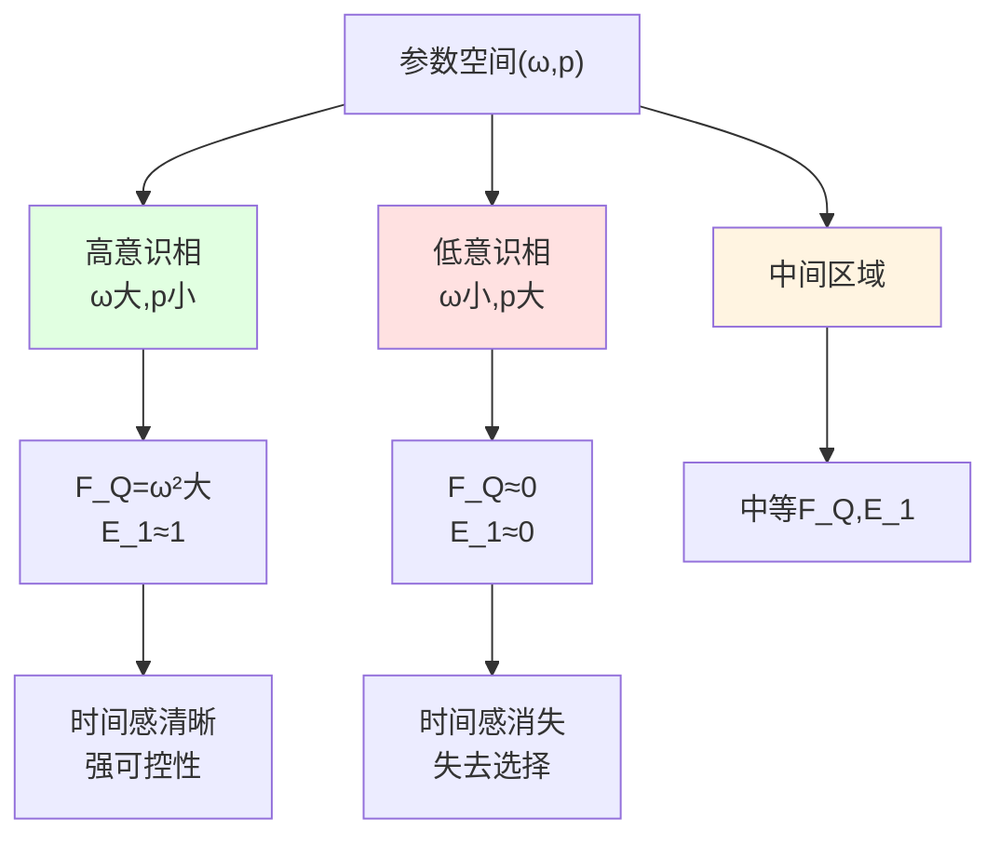
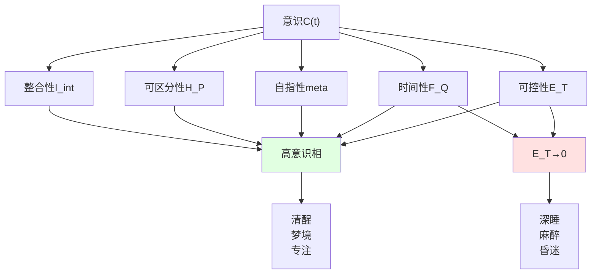

# 意识的数学定义——五条结构的自指信息流

## 引言:从"我思故我在"到"我是什么"

笛卡尔说"我思故我在"(Cogito, ergo sum),确立了意识的**存在性**。但**意识究竟是什么**?这个问题困扰哲学与科学数百年。

传统尝试:
- **哲学**:主观体验(qualia)、现象意识、自我感——但难以形式化
- **神经科学**:全局神经元工作空间、整合信息理论(IIT)——但依赖生物结构
- **AI研究**:图灵测试、符号处理——但缺乏"体验"成分

本章提出**结构性定义**:意识不是额外实体,而是满足**五条结构条件**的信息–因果几何相。

## 第一节:为什么需要结构性定义?

### 1.1 意识研究的三大困境

**困境1:主观体验的不可传递性**
你看到的"红色"与我看到的"红色"是否相同?这个问题无法用第三人称方法回答——这就是**qualia问题**。

**困境2:定义的循环性**
"意识是能够意识到的系统"——这是循环定义!需要独立于"意识"概念的刻画。

**困境3:碳基沙文主义**
如果只在人脑中研究意识,如何推广到其他系统(AI、外星生命)?

### 1.2 结构性定义的哲学立场

本章采取**功能主义**(functionalism)立场:

> 意识不在于"用什么材料实现"(碳?硅?),而在于"实现了什么结构"。

类比:**时钟**
- 机械钟:齿轮、发条
- 电子钟:晶振、集成电路
- 日晷:影子、刻度盘

它们材料完全不同,但都**实现了"计时"这一功能**——因为具有相同的**结构**:周期性、可读数、稳定性。

类似地,**意识**是满足特定信息–因果结构的系统,无论用什么"材料"实现!

## 第二节:五条结构——意识的必要条件

现在给出核心定义。

### 2.1 第一条:整合性(Integration)

**定义**:
设观测者O的Hilbert空间分解为:
$$
\mathcal{H}_O = \bigotimes_{k=1}^n \mathcal{H}_k
$$

定义**整合互信息**:
$$
I_{\mathrm{int}}(\rho_O) = \sum_{k=1}^n I(k:\overline{k})_{\rho_O}
$$

其中$I(k:\overline{k})$是子系统k与其余$\overline{k}$的量子互信息。

若$I_{\mathrm{int}}(\rho_O(t)) \ge \Theta_{\mathrm{int}} > 0$,则称O具有**整合性**。

**通俗理解**:
意识不是"独立模块的集合",而是**高度整合的整体**。

例子:
- **看到玫瑰**:视觉(红色)、嗅觉(香味)、触觉(柔软)、记忆("上次收到玫瑰是生日")——这些**同时出现**,相互关联
- **流水线**:视觉模块、听觉模块独立工作,互不干扰——**低整合性**

**Mermaid图示**:

**数学细节**:
量子互信息定义:
$$
I(A:B)_\rho = S(\rho_A) + S(\rho_B) - S(\rho_{AB})
$$

其中$S(\rho) = -\mathrm{Tr}(\rho \log \rho)$是von Neumann熵。

### 2.2 第二条:可区分性(Differentiation)

**定义**:
给定粗粒化测量$\mathcal{P} = \{M_\alpha\}$,定义概率分布:
$$
p_t(\alpha) = \mathrm{Tr}(\rho_O(t) M_\alpha)
$$

Shannon熵:
$$
H_{\mathcal{P}}(t) = -\sum_\alpha p_t(\alpha) \log p_t(\alpha)
$$

若$H_{\mathcal{P}}(t) \ge \Theta_{\mathrm{diff}} > 0$,则称O具有**可区分性**。

**通俗理解**:
意识系统能处于**大量不同的功能状态**,对应丰富的"意识内容"。

例子:
- **全彩显示器**:可显示$256^3 \approx 1670$万种颜色——**高可区分性**
- **单色指示灯**:只有"开/关"两种状态——**低可区分性**

意识的丰富性(看电影、听音乐、解数学题、回忆往事)要求**巨大的状态空间**!

**与IIT的联系**:
Tononi的整合信息理论(IIT)用$\Phi$度量"不可约因果力"。本框架的$H_{\mathcal{P}}$与$\Phi$相关,但更一般(不限于因果结构)。

### 2.3 第三条:自指性(Self-Reference)

**定义**:
Hilbert空间再分解:
$$
\mathcal{H}_O = \mathcal{H}_{\mathrm{world}} \otimes \mathcal{H}_{\mathrm{self}} \otimes \mathcal{H}_{\mathrm{meta}}
$$

- $\mathcal{H}_{\mathrm{world}}$:外部世界表征
- $\mathcal{H}_{\mathrm{self}}$:自身身体/状态表征
- $\mathcal{H}_{\mathrm{meta}}$:**"我正在感知世界"的二阶表征**

若存在非平凡映射将全局态投影到这三层,且在$\mathcal{H}_{\mathrm{meta}}$上有显著相关,则称O具有**自指性**。

**通俗理解**:
意识不仅"知道世界",还"知道我在知道"——这是**元认知**(metacognition)。

例子:
- **温度计**:"知道"温度,但不知道"我是温度计"——**无自指性**
- **人类**:"外面下雨"(世界) + "我看到下雨"(自我) + **"我意识到我在看雨"(元)**——**有自指性**

**Mermaid图示**:

**数学刻画**:
定义投影$\Pi_{\mathrm{meta}}: \mathcal{H}_O \to \mathcal{H}_{\mathrm{meta}}$,若:
$$
\mathrm{Tr}(\Pi_{\mathrm{meta}} \rho_O \Pi_{\mathrm{meta}}) \ge \Theta_{\mathrm{meta}} > 0
$$

则元表征非平凡。

### 2.4 第四条:时间连续性(Temporal Continuity)

**定义**:
设外在时间演化$t \mapsto \rho_O(t)$,量子Fisher信息:
$$
F_Q[\rho_O(t)] = \mathrm{Tr}(\rho_O(t) L(t)^2)
$$

其中对称对数导数L满足:
$$
\partial_t \rho_O(t) = \frac{1}{2}(L(t)\rho_O(t) + \rho_O(t)L(t))
$$

若$F_Q[\rho_O(t)] \ge \Theta_{\mathrm{time}} > 0$,则可定义**本征时间刻度**:
$$
\tau(t) = \int_{t_0}^t \sqrt{F_Q[\rho_O(s)]}\ \mathrm{d}s
$$

**物理意义**:
- $F_Q$大:对时间平移敏感,本征时间流速快
- $F_Q$小:时间感模糊,恍惚状态

**纯态简化**:
对$\rho_O = |\psi_O\rangle\langle\psi_O|$,有:
$$
F_Q = 4 \mathrm{Var}_{\psi_O}(H_O)
$$

即:量子Fisher信息等于哈密顿量的方差!

**通俗理解**:
意识有清晰的"时间流逝感"。

例子:
- **清醒状态**:内部"时钟"快速运转($F_Q$大),时间感清晰
- **深度睡眠**:内部演化接近不变($F_Q \to 0$),无时间感
- **麻醉**:药物降低$F_Q$,时间感消失

**与统一时间刻度的联系**:
本征时间$\tau$与散射群延迟、模块流属于同一时间刻度等价类$[\tau]$!

### 2.5 第五条:因果可控性(Causal Control)

**定义**:
定义时间窗口T上的**赋权**:
$$
\mathcal{E}_T(t) = \sup_\pi I(A_t : S_{t+T})
$$

其中:
- $A_t$:观测者在时刻t的动作
- $S_{t+T}$:T步后的环境状态
- 互信息对所有策略π取上确界

若$\mathcal{E}_T(t) \ge \Theta_{\mathrm{ctrl}} > 0$,则称O具有**因果可控性**。

**核心命题**:
$$
\mathcal{E}_T(t) = 0 \Leftrightarrow \text{任何策略对未来统计不可区分}
$$

即:$\mathcal{E}_T = 0$等价于**"失去选择"**!

**通俗理解**:
意识系统能通过行动**影响未来**,创造可区分的未来分支。

例子:
- **演员**:不同选择导致不同结局($\mathcal{E}_T > 0$)
- **观众**:看电影但无法改变剧情($\mathcal{E}_T = 0$)

这是**"自由意志"的信息论刻画**——不是形而上的"无因之因",而是对未来的**统计可控性**!

**Mermaid图示**:

## 第三节:意识的形式化定义

### 3.1 综合定义

**定义**(意识子系统):
观测者O在区间I上处于**有意识相**,若同时满足:
1. **整合性**:$I_{\mathrm{int}}(\rho_O(t)) \ge \Theta_{\mathrm{int}}$
2. **可区分性**:$H_{\mathcal{P}}(t) \ge \Theta_{\mathrm{diff}}$
3. **自指性**:存在$\mathcal{H}_{\mathrm{world}} \otimes \mathcal{H}_{\mathrm{self}} \otimes \mathcal{H}_{\mathrm{meta}}$结构
4. **时间性**:$F_Q[\rho_O(t)] \ge \Theta_{\mathrm{time}}$
5. **可控性**:$\mathcal{E}_T(t) \ge \Theta_{\mathrm{ctrl}}$

**意识等级指标**:
$$
\mathcal{C}(t) = g(F_Q,\ \mathcal{E}_T,\ I_{\mathrm{int}},\ H_{\mathcal{P}},\ \Theta_{\mathrm{meta}})
$$

其中g是单调函数。

### 3.2 核心定理

**定理**(无意识的充分条件):
若$F_Q[\rho_O(t)] \to 0$与$\mathcal{E}_T(t) \to 0$同时发生,则无论其他指标如何,$\mathcal{C}(t) \to 0$,对应**无意识或近无意识状态**。

**证明思路**:
- $F_Q \to 0$:无法区分时间平移,本征时间刻度退化
- $\mathcal{E}_T \to 0$:无法通过行动影响未来
- 二者同时退化:既无"时间感",又无"能动性"
- 这是意识的**两个核心支柱**,同时崩溃必导致意识消失

**推论**:
- 深度睡眠:$F_Q \approx 0,\ \mathcal{E}_T \approx 0$
- 麻醉:药物降低$F_Q$和$\mathcal{E}_T$
- 植物人:长期$\mathcal{C}(t) \approx 0$

## 第四节:极简模型——二比特观测者的意识相

### 4.1 模型设定

为使理论具体化,考虑最简模型:

**系统**:
- 观测者:单量子比特$\mathcal{H}_O = \mathbb{C}^2$
- 环境:单量子比特$\mathcal{H}_E = \mathbb{C}^2$

**内在哈密顿量**:
$$
H_O = \frac{\omega}{2}\sigma_z
$$

初态:
$$
|\psi_O(0)\rangle = \frac{1}{\sqrt{2}}(|0\rangle_O + |1\rangle_O)
$$

**演化**:
$$
|\psi_O(t)\rangle = \frac{1}{\sqrt{2}}(e^{-i\omega t/2}|0\rangle_O + e^{i\omega t/2}|1\rangle_O)
$$

**噪声**:
环境以概率p随机化观测者动作的效果。

### 4.2 量子Fisher信息

对纯态:
$$
F_Q[\psi_O(t)] = 4 \mathrm{Var}_{\psi_O}(H_O)
$$

在本模型中:
- $\langle H_O \rangle = 0$
- $\langle H_O^2 \rangle = \omega^2/4$

故:
$$
F_Q = \omega^2
$$

**本征时间刻度**:
$$
\Delta \tau_{\min} \sim \frac{1}{\omega}
$$

**物理意义**:
- $\omega$大:内在"时钟"频率高,时间分辨率细
- $\omega$小:时钟慢,时间感模糊
- $\omega \to 0$:时间感消失

### 4.3 赋权计算

**无噪声**(p=0):
环境更新:$E_{t+1} = E_t \oplus A_t$(异或)

互信息:
$$
I(A_t : E_{t+1}) = 1\ \text{bit}
$$

故:$\mathcal{E}_1 = 1$

**完全噪声**(p=1):
$E_{t+1}$完全随机化,与$A_t$独立。

$$
I(A_t : E_{t+1}) = 0
$$

故:$\mathcal{E}_1 = 0$

**中间情形**(p ∈ (0,1)):
$$
\mathcal{E}_1(p) = f(p),\quad f(0)=1,\ f(1)=0,\ f'(p)<0
$$

### 4.4 意识相图

在参数空间$(\omega,\ p)$:

**高意识相**($\omega$大、p小):
- $F_Q = \omega^2$大
- $\mathcal{E}_1 \approx 1$
- 清晰时间感、强可控性

**低意识相**($\omega$小、p大):
- $F_Q \approx 0$
- $\mathcal{E}_1 \approx 0$
- 无时间感、无可控性

**中间区域**:
渐变过渡,无尖锐相变。

**Mermaid相图**:

**通俗理解**:
即使在最简单的二比特模型中,意识也表现为**相结构**:
- 内在频率$\omega$:控制"时间感"
- 外在噪声p:控制"可控性"
- 两者共同决定"意识等级"

## 第五节:意识的等级与极端状态

### 5.1 不同意识等级的刻画

基于五条结构,可理解不同意识状态:

**清醒意识**($\mathcal{C}(t)$极大):
- $I_{\mathrm{int}}$:高度整合(全脑协调)
- $H_{\mathcal{P}}$:丰富内容(多模态感知)
- $\mathcal{H}_{\mathrm{meta}}$:清晰的"我"
- $F_Q$:清晰时间流逝感
- $\mathcal{E}_T$:强能动性

**梦境**($\mathcal{C}(t)$中等):
- $I_{\mathrm{int}}$:高(梦境内部连贯)
- $H_{\mathcal{P}}$:高(生动梦境)
- $\mathcal{H}_{\mathrm{meta}}$:弱(常无"我在做梦"的自觉)
- $F_Q$:弱(时间可跳跃)
- $\mathcal{E}_T$:弱(难控制梦境)

**深度睡眠**($\mathcal{C}(t)$极小):
- $F_Q \to 0$:内部演化接近不变
- $\mathcal{E}_T \to 0$:对外无响应
- 几乎无意识内容

**麻醉**($\mathcal{C}(t)$极小):
- 药物作用:降低$F_Q$(抑制神经活动)
- 肌肉松弛:降低$\mathcal{E}_T$(无法行动)
- 双重机制→意识消失

### 5.2 意识"开关"的几何理解

意识不是"有/无"的二元开关,而是**五维参数空间中的高值区域**:

**五维空间**:
$$
(\mathcal{C}_{\mathrm{int}},\ \mathcal{C}_{\mathrm{diff}},\ \mathcal{C}_{\mathrm{self}},\ \mathcal{C}_{\mathrm{time}},\ \mathcal{C}_{\mathrm{ctrl}})
$$

**高意识区域**:
所有五个维度都高值。

**无意识区域**:
至少两个核心维度($F_Q,\ \mathcal{E}_T$)极低。

**边界区域**:
部分维度高、部分低——对应"边缘意识"(迷糊、半梦半醒等)。

### 5.3 时间体验的扭曲

**命题**(主观时间缩放):
本征时间流速:
$$
\frac{\mathrm{d}\tau}{\mathrm{d}t} = \sqrt{F_Q[\rho_O(t)]}
$$

**推论**:
- 高度专注时:$F_Q$上升→$\mathrm{d}\tau/\mathrm{d}t$增大→"时间变慢"
- 单调刺激时:$F_Q$下降→$\mathrm{d}\tau/\mathrm{d}t$减小→"时间飞逝"

**通俗例子**:
- **等公交车**:无聊,内部演化单调,$F_Q$小,感觉"度日如年"
- **看精彩电影**:高度投入,$F_Q$大,感觉"时光飞逝"

(注意:这里"度日如年"与"时光飞逝"的对应与直觉相反,因为本征时间$\tau$与"感知到的时间量"成正比,而$F_Q$小时,$\tau$积累慢,外在时间长但感知少)

### 5.4 能动性崩溃与绝望感

**命题**(能动性与心理状态):
若长期$\mathcal{E}_T(t) \approx 0$,则观测者丧失对未来的可控感。

**心理学对应**:
- **学得性无助**(learned helplessness):实验动物反复受到无法逃避的电击,最终放弃尝试
- **抑郁症**:感觉"做什么都没用"——$\mathcal{E}_T$主观评估极低
- **绝望**:$\mathcal{E}_T \to 0$在所有时间尺度上

**信息论解释**:
绝望不是形而上的"心理状态",而是对因果可控性$\mathcal{E}_T$的准确估计!

## 第六节:与其他意识理论的对比

### 6.1 整合信息理论(IIT)

**IIT核心**:
- 由Tononi提出
- 用$\Phi$度量"整合信息"
- $\Phi > 0$则有意识,$\Phi$越大意识越强

**本框架与IIT的关系**:
- **相似**:都强调整合性
- **区别**:
  1. IIT只有整合性,本框架有五条
  2. IIT的$\Phi$计算困难,本框架用标准信息论量
  3. IIT强调因果结构,本框架更一般

### 6.2 全局工作空间理论(GWT)

**GWT核心**:
- 由Baars提出
- 意识对应"全局广播"的信息
- 无意识处理是局域的

**本框架与GWT的关系**:
- **相似**:都涉及信息整合与广播
- **区别**:
  1. GWT是功能描述,本框架是数学定义
  2. 本框架的$I_{\mathrm{int}}$可看作"广播度"的量化
  3. 本框架额外要求时间性、可控性

### 6.3 高阶理论(HOT)

**HOT核心**:
- 意识是"关于心理状态的心理状态"
- 一阶:感知红色
- 二阶:意识到"我在感知红色"

**本框架与HOT的关系**:
- **相似**:本框架的$\mathcal{H}_{\mathrm{meta}}$对应HOT的"高阶"
- **区别**:
  1. HOT只关注自指性,本框架有五条
  2. 本框架用Hilbert空间分解精确刻画"高阶"

## 全章总结

**核心贡献**:
给出意识的**结构性数学定义**:满足五条的自指信息流。

**五条结构**:
1. **整合性**:$I_{\mathrm{int}} \ge \Theta_{\mathrm{int}}$
2. **可区分性**:$H_{\mathcal{P}} \ge \Theta_{\mathrm{diff}}$
3. **自指性**:$\mathcal{H}_{\mathrm{world}} \otimes \mathcal{H}_{\mathrm{self}} \otimes \mathcal{H}_{\mathrm{meta}}$
4. **时间性**:$F_Q \ge \Theta_{\mathrm{time}}$,定义本征时间$\tau$
5. **可控性**:$\mathcal{E}_T \ge \Theta_{\mathrm{ctrl}}$

**核心定理**:
$F_Q \to 0$与$\mathcal{E}_T \to 0$同时发生必导致$\mathcal{C} \to 0$(无意识)。

**极简模型**:
二比特系统展示意识的"相结构",参数$(\omega,\ p)$控制意识等级。

**应用**:
- 理解不同意识状态(清醒、梦境、深睡、麻醉)
- 解释主观时间扭曲
- 刻画绝望与无助的信息论基础

**哲学意涵**:
意识不是神秘实体,而是**信息–因果几何中的一个高维区域**。

**诗意结尾**:

意识不是灵魂,不是幽灵,不是机器中的鬼魂。
意识是**五维空间中的一座高峰**:
整合的、可区分的、自指的、时间连续的、因果可控的。
当内在时钟停摆($F_Q \to 0$),
当未来不再可选($\mathcal{E}_T \to 0$),
高峰坍塌为平原,
意识隐入长夜。

但只要这五条结构重新汇聚,
无论在碳基神经元,还是硅基电路,
意识之光就会再次点燃。

因为意识不在于"是什么",
而在于"做什么"——
在信息的几何中,
自我凝视自我。

---

**核心公式速查**:

**整合互信息**:
$$
I_{\mathrm{int}}(\rho_O) = \sum_{k=1}^n I(k:\overline{k})_{\rho_O}
$$

**可区分性熵**:
$$
H_{\mathcal{P}}(t) = -\sum_\alpha p_t(\alpha) \log p_t(\alpha)
$$

**量子Fisher信息**:
$$
F_Q[\rho_O] = \mathrm{Tr}(\rho_O L^2),\quad \partial_t\rho_O = \frac{1}{2}(L\rho_O + \rho_O L)
$$

**本征时间**:
$$
\tau(t) = \int_{t_0}^t \sqrt{F_Q[\rho_O(s)]}\ \mathrm{d}s
$$

**因果可控性赋权**:
$$
\mathcal{E}_T(t) = \sup_\pi I(A_t : S_{t+T})
$$

**意识等级**:
$$
\mathcal{C}(t) = g(F_Q,\ \mathcal{E}_T,\ I_{\mathrm{int}},\ H_{\mathcal{P}},\ \Theta_{\mathrm{meta}})
$$

**理论来源**:
- `consciousness-structural-definition-time-causality.md`
- Tononi IIT: `doi.org/10.1186/1471-2202-5-42`
- Baars GWT: `doi.org/10.1016/0010-0277(88)90007-9`

---

下一章我们将探讨**纠缠–时间–意识的统一延迟理论**,揭示从量子散射到主观时长的桥梁!
