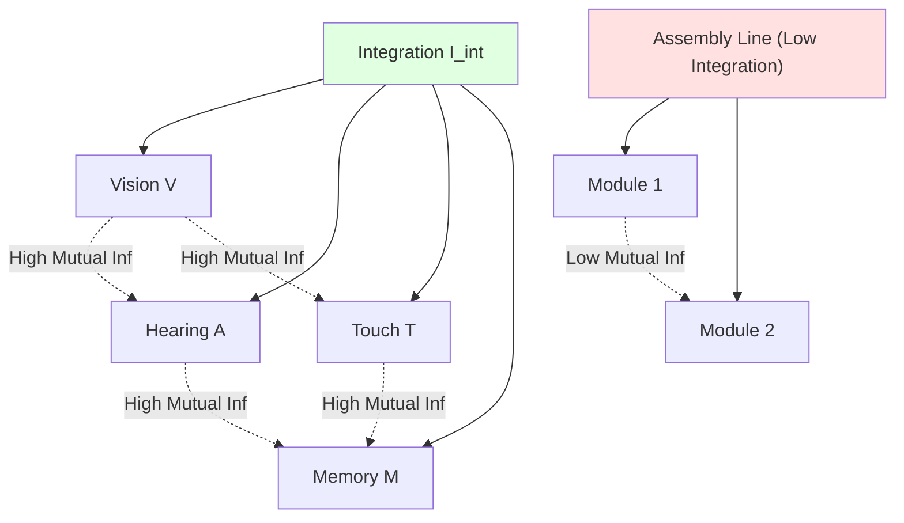
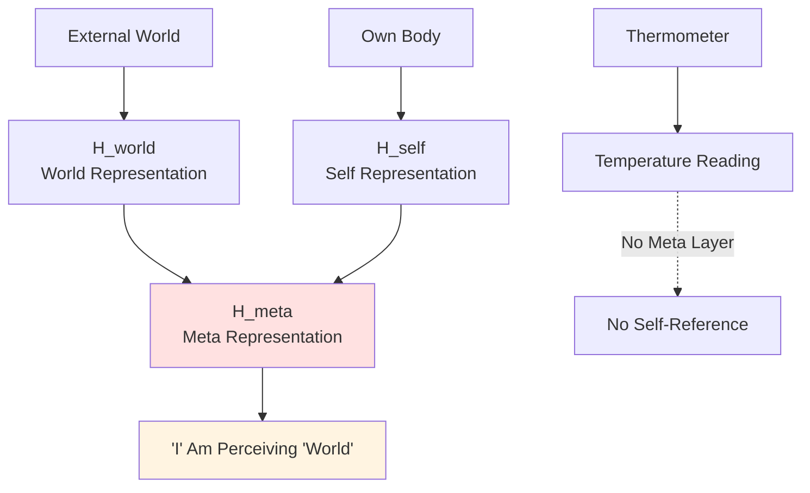
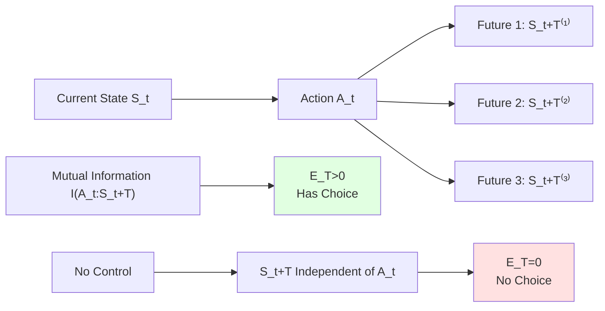
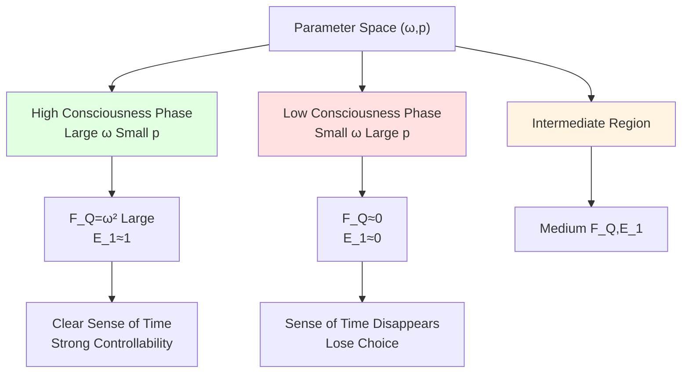
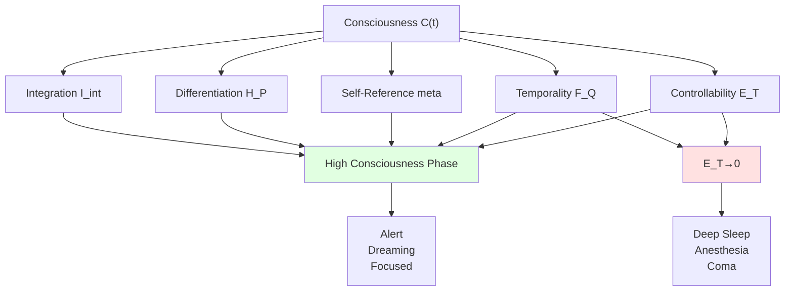

# Mathematical Definition of Consciousness—Self-Referential Information Flow with Five Structures

## Introduction: From "I Think, Therefore I Am" to "What Am I"

Descartes said "I think, therefore I am" (Cogito, ergo sum), establishing **existence** of consciousness. But **what exactly is consciousness**? This question has troubled philosophy and science for centuries.

Traditional attempts:
- **Philosophy**: Subjective experience (qualia), phenomenal consciousness, sense of self—but hard to formalize
- **Neuroscience**: Global neuronal workspace, integrated information theory (IIT)—but depends on biological structure
- **AI Research**: Turing test, symbolic processing—but lacks "experience" component

This chapter proposes **structural definition**: Consciousness is not additional entity, but information-causal geometric phase satisfying **five structural conditions**.

## Section One: Why Need Structural Definition?

### 1.1 Three Dilemmas in Consciousness Research

**Dilemma 1: Non-Transferability of Subjective Experience**
Is the "red" you see the same as the "red" I see? This question cannot be answered by third-person methods—this is the **qualia problem**.

**Dilemma 2: Circularity of Definition**
"Consciousness is system capable of being conscious"—this is circular definition! Need characterization independent of "consciousness" concept.

**Dilemma 3: Carbon Chauvinism**
If only study consciousness in human brain, how to generalize to other systems (AI, alien life)?

### 1.2 Philosophical Stance of Structural Definition

This chapter adopts **functionalism** stance:

> Consciousness does not lie in "what material implements it" (carbon? silicon?), but in "what structure is implemented".

Analogy: **Clock**
- Mechanical clock: Gears, springs
- Electronic clock: Crystal oscillator, integrated circuit
- Sundial: Shadow, dial

They have completely different materials, but all **implement "timekeeping" function**—because have same **structure**: Periodicity, readability, stability.

Similarly, **consciousness** is system satisfying specific information-causal structure, regardless of what "material" implements it!

## Section Two: Five Structures—Necessary Conditions for Consciousness

Now give core definitions.

### 2.1 First: Integration

**Definition**:
Let observer $O$'s Hilbert space decompose as:
$$
\mathcal{H}_O = \bigotimes_{k=1}^n \mathcal{H}_k
$$

Define **integrated mutual information**:
$$
I_{\mathrm{int}}(\rho_O) = \sum_{k=1}^n I(k:\overline{k})_{\rho_O}
$$

where $I(k:\overline{k})$ is quantum mutual information between subsystem $k$ and rest $\overline{k}$.

If $I_{\mathrm{int}}(\rho_O(t)) \ge \Theta_{\mathrm{int}} > 0$, then $O$ said to have **integration**.

**Popular Understanding**:
Consciousness not "collection of independent modules", but **highly integrated whole**.

Examples:
- **Seeing rose**: Vision (red), smell (fragrance), touch (soft), memory ("last received rose on birthday")—these **simultaneously appear**, mutually correlated
- **Assembly line**: Vision module, hearing module work independently, no interference—**low integration**

**Mermaid Diagram**:

**Mathematical Details**:
Quantum mutual information definition:
$$
I(A:B)_\rho = S(\rho_A) + S(\rho_B) - S(\rho_{AB})
$$

where $S(\rho) = -\mathrm{Tr}(\rho \log \rho)$ is von Neumann entropy.

### 2.2 Second: Differentiation

**Definition**:
Given coarse-grained measurement $\mathcal{P} = \{M_\alpha\}$, define probability distribution:
$$
p_t(\alpha) = \mathrm{Tr}(\rho_O(t) M_\alpha)
$$

Shannon entropy:
$$
H_{\mathcal{P}}(t) = -\sum_\alpha p_t(\alpha) \log p_t(\alpha)
$$

If $H_{\mathcal{P}}(t) \ge \Theta_{\mathrm{diff}} > 0$, then $O$ said to have **differentiation**.

**Popular Understanding**:
Conscious system can be in **large number of different functional states**, corresponding to rich "conscious content".

Examples:
- **Full-color display**: Can display $256^3 \approx 16.7$ million colors—**high differentiation**
- **Monochrome indicator**: Only "on/off" two states—**low differentiation**

Richness of consciousness (watching movies, listening to music, solving math, recalling past) requires **huge state space**!

**Connection with IIT**:
Tononi's integrated information theory (IIT) uses $\Phi$ to measure "irreducible causal power". This framework's $H_{\mathcal{P}}$ related to $\Phi$, but more general (not limited to causal structure).

### 2.3 Third: Self-Reference

**Definition**:
Hilbert space further decomposes:
$$
\mathcal{H}_O = \mathcal{H}_{\mathrm{world}} \otimes \mathcal{H}_{\mathrm{self}} \otimes \mathcal{H}_{\mathrm{meta}}
$$

- $\mathcal{H}_{\mathrm{world}}$: External world representation
- $\mathcal{H}_{\mathrm{self}}$: Own body/state representation
- $\mathcal{H}_{\mathrm{meta}}$: **Second-order representation of "I am perceiving world"**

If exists non-trivial mapping projecting global state to these three layers, and on $\mathcal{H}_{\mathrm{meta}}$ has significant correlation, then $O$ said to have **self-reference**.

**Popular Understanding**:
Consciousness not only "knows world", but also "knows I am knowing"—this is **metacognition**.

Examples:
- **Thermometer**: "Knows" temperature, but doesn't know "I am thermometer"—**no self-reference**
- **Human**: "It's raining outside" (world) + "I see it's raining" (self) + **"I am aware I am seeing rain" (meta)**—**has self-reference**

**Mermaid Diagram**:

**Mathematical Characterization**:
Define projection $\Pi_{\mathrm{meta}}: \mathcal{H}_O \to \mathcal{H}_{\mathrm{meta}}$, if:
$$
\mathrm{Tr}(\Pi_{\mathrm{meta}} \rho_O \Pi_{\mathrm{meta}}) \ge \Theta_{\mathrm{meta}} > 0
$$

Then meta representation non-trivial.

### 2.4 Fourth: Temporal Continuity

**Definition**:
Let external time evolution $t \mapsto \rho_O(t)$, quantum Fisher information:
$$
F_Q[\rho_O(t)] = \mathrm{Tr}(\rho_O(t) L(t)^2)
$$

where symmetric logarithmic derivative $L$ satisfies:
$$
\partial_t \rho_O(t) = \frac{1}{2}(L(t)\rho_O(t) + \rho_O(t)L(t))
$$

If $F_Q[\rho_O(t)] \ge \Theta_{\mathrm{time}} > 0$, then can define **eigen time scale**:
$$
\tau(t) = \int_{t_0}^t \sqrt{F_Q[\rho_O(s)]}\ \mathrm{d}s
$$

**Physical Meaning**:
- Large $F_Q$: Sensitive to time translation, fast eigen time flow
- Small $F_Q$: Blurred sense of time, trance state

**Pure State Simplification**:
For $\rho_O = |\psi_O\rangle\langle\psi_O|$, have:
$$
F_Q = 4 \mathrm{Var}_{\psi_O}(H_O)
$$

That is: Quantum Fisher information equals variance of Hamiltonian!

**Popular Understanding**:
Consciousness has clear "sense of time passing".

Examples:
- **Alert state**: Internal "clock" runs fast (large $F_Q$), clear sense of time
- **Deep sleep**: Internal evolution nearly constant ($F_Q \to 0$), no sense of time
- **Anesthesia**: Drugs reduce $F_Q$, sense of time disappears

**Connection with Unified Time Scale**:
Eigen time $\tau$ belongs to same time scale equivalence class $[\tau]$ as scattering group delay and modular flow!

### 2.5 Fifth: Causal Controllability

**Definition**:
Define **empowerment** on time window $T$:
$$
\mathcal{E}_T(t) = \sup_\pi I(A_t : S_{t+T})
$$

where:
- $A_t$: Observer's action at time $t$
- $S_{t+T}$: Environment state $T$ steps later
- Mutual information takes supremum over all strategies $\pi$

If $\mathcal{E}_T(t) \ge \Theta_{\mathrm{ctrl}} > 0$, then $O$ said to have **causal controllability**.

**Core Proposition**:
$$
\mathcal{E}_T(t) = 0 \Leftrightarrow \text{Any strategy statistically indistinguishable for future}
$$

That is: $\mathcal{E}_T = 0$ equivalent to **"losing choice"**!

**Popular Understanding**:
Conscious system can **influence future** through actions, create distinguishable future branches.

Examples:
- **Actor**: Different choices lead to different endings ($\mathcal{E}_T > 0$)
- **Audience**: Watch movie but cannot change plot ($\mathcal{E}_T = 0$)

This is **information-theoretic characterization of "free will"**—not metaphysical "uncaused cause", but **statistical controllability** of future!

**Mermaid Diagram**:

## Section Three: Formal Definition of Consciousness

### 3.1 Comprehensive Definition

**Definition** (Conscious Subsystem):
Observer $O$ on interval $I$ in **conscious phase**, if simultaneously satisfies:
1. **Integration**: $I_{\mathrm{int}}(\rho_O(t)) \ge \Theta_{\mathrm{int}}$
2. **Differentiation**: $H_{\mathcal{P}}(t) \ge \Theta_{\mathrm{diff}}$
3. **Self-Reference**: Exists $\mathcal{H}_{\mathrm{world}} \otimes \mathcal{H}_{\mathrm{self}} \otimes \mathcal{H}_{\mathrm{meta}}$ structure
4. **Temporality**: $F_Q[\rho_O(t)] \ge \Theta_{\mathrm{time}}$
5. **Controllability**: $\mathcal{E}_T(t) \ge \Theta_{\mathrm{ctrl}}$

**Consciousness Level Index**:
$$
\mathcal{C}(t) = g(F_Q,\ \mathcal{E}_T,\ I_{\mathrm{int}},\ H_{\mathcal{P}},\ \Theta_{\mathrm{meta}})
$$

where $g$ is monotonic function.

### 3.2 Core Theorem

**Theorem** (Sufficient Condition for Unconsciousness):
If $F_Q[\rho_O(t)] \to 0$ and $\mathcal{E}_T(t) \to 0$ occur simultaneously, then regardless of other indices, $\mathcal{C}(t) \to 0$, corresponding to **unconscious or near-unconscious state**.

**Proof Strategy**:
- $F_Q \to 0$: Cannot distinguish time translation, eigen time scale degenerates
- $\mathcal{E}_T \to 0$: Cannot influence future through actions
- Both degenerate simultaneously: Neither "sense of time" nor "agency"
- These are **two core pillars** of consciousness, simultaneous collapse necessarily causes consciousness loss

**Corollaries**:
- Deep sleep: $F_Q \approx 0,\ \mathcal{E}_T \approx 0$
- Anesthesia: Drugs reduce $F_Q$ and $\mathcal{E}_T$
- Vegetative state: Long-term $\mathcal{C}(t) \approx 0$

## Section Four: Minimal Model—Consciousness Phase of Two-Qubit Observer

### 4.1 Model Setup

To make theory concrete, consider minimal model:

**System**:
- Observer: Single qubit $\mathcal{H}_O = \mathbb{C}^2$
- Environment: Single qubit $\mathcal{H}_E = \mathbb{C}^2$

**Intrinsic Hamiltonian**:
$$
H_O = \frac{\omega}{2}\sigma_z
$$

Initial state:
$$
|\psi_O(0)\rangle = \frac{1}{\sqrt{2}}(|0\rangle_O + |1\rangle_O)
$$

**Evolution**:
$$
|\psi_O(t)\rangle = \frac{1}{\sqrt{2}}(e^{-i\omega t/2}|0\rangle_O + e^{i\omega t/2}|1\rangle_O)
$$

**Noise**:
Environment randomizes observer action effect with probability $p$.

### 4.2 Quantum Fisher Information

For pure state:
$$
F_Q[\psi_O(t)] = 4 \mathrm{Var}_{\psi_O}(H_O)
$$

In this model:
- $\langle H_O \rangle = 0$
- $\langle H_O^2 \rangle = \omega^2/4$

Therefore:
$$
F_Q = \omega^2
$$

**Eigen Time Scale**:
$$
\Delta \tau_{\min} \sim \frac{1}{\omega}
$$

**Physical Meaning**:
- Large $\omega$: Intrinsic "clock" frequency high, fine time resolution
- Small $\omega$: Clock slow, blurred sense of time
- $\omega \to 0$: Sense of time disappears

### 4.3 Empowerment Calculation

**No Noise** ($p=0$):
Environment update: $E_{t+1} = E_t \oplus A_t$ (XOR)

Mutual information:
$$
I(A_t : E_{t+1}) = 1\ \text{bit}
$$

Therefore: $\mathcal{E}_1 = 1$

**Complete Noise** ($p=1$):
$E_{t+1}$ completely randomized, independent of $A_t$.

$$
I(A_t : E_{t+1}) = 0
$$

Therefore: $\mathcal{E}_1 = 0$

**Intermediate Case** ($p \in (0,1)$):
$$
\mathcal{E}_1(p) = f(p),\quad f(0)=1,\ f(1)=0,\ f'(p)<0
$$

### 4.4 Consciousness Phase Diagram

On parameter space $(\omega,\ p)$:

**High Consciousness Phase** (large $\omega$, small $p$):
- $F_Q = \omega^2$ large
- $\mathcal{E}_1 \approx 1$
- Clear sense of time, strong controllability

**Low Consciousness Phase** (small $\omega$, large $p$):
- $F_Q \approx 0$
- $\mathcal{E}_1 \approx 0$
- No sense of time, no controllability

**Intermediate Region**:
Gradual transition, no sharp phase transition.

**Mermaid Phase Diagram**:

**Popular Understanding**:
Even in simplest two-qubit model, consciousness manifests as **phase structure**:
- Intrinsic frequency $\omega$: Controls "sense of time"
- External noise $p$: Controls "controllability"
- Together determine "consciousness level"

## Section Five: Levels of Consciousness and Extreme States

### 5.1 Characterization of Different Consciousness Levels

Based on five structures, can understand different consciousness states:

**Alert Consciousness** ($\mathcal{C}(t)$ maximum):
- $I_{\mathrm{int}}$: High integration (whole-brain coordination)
- $H_{\mathcal{P}}$: Rich content (multimodal perception)
- $\mathcal{H}_{\mathrm{meta}}$: Clear "I"
- $F_Q$: Clear sense of time passing
- $\mathcal{E}_T$: Strong agency

**Dreaming** ($\mathcal{C}(t)$ intermediate):
- $I_{\mathrm{int}}$: High (dream internally coherent)
- $H_{\mathcal{P}}$: High (vivid dreams)
- $\mathcal{H}_{\mathrm{meta}}$: Weak (often no "I am dreaming" awareness)
- $F_Q$: Weak (time can jump)
- $\mathcal{E}_T$: Weak (hard to control dreams)

**Deep Sleep** ($\mathcal{C}(t)$ minimal):
- $F_Q \to 0$: Internal evolution nearly constant
- $\mathcal{E}_T \to 0$: No response to external
- Almost no conscious content

**Anesthesia** ($\mathcal{C}(t)$ minimal):
- Drug action: Reduces $F_Q$ (inhibits neural activity)
- Muscle relaxation: Reduces $\mathcal{E}_T$ (cannot act)
- Dual mechanism → Consciousness loss

### 5.2 Geometric Understanding of Consciousness "Switch"

Consciousness not "on/off" binary switch, but **high-value region in five-dimensional parameter space**:

**Five-Dimensional Space**:
$$
(\mathcal{C}_{\mathrm{int}},\ \mathcal{C}_{\mathrm{diff}},\ \mathcal{C}_{\mathrm{self}},\ \mathcal{C}_{\mathrm{time}},\ \mathcal{C}_{\mathrm{ctrl}})
$$

**High Consciousness Region**:
All five dimensions high values.

**Unconscious Region**:
At least two core dimensions ($F_Q,\ \mathcal{E}_T$) extremely low.

**Boundary Region**:
Some dimensions high, some low—corresponds to "marginal consciousness" (drowsy, half-asleep, etc.).

### 5.3 Distortion of Time Experience

**Proposition** (Subjective Time Scaling):
Eigen time flow rate:
$$
\frac{\mathrm{d}\tau}{\mathrm{d}t} = \sqrt{F_Q[\rho_O(t)]}
$$

**Corollaries**:
- Highly focused: $F_Q$ increases → $\mathrm{d}\tau/\mathrm{d}t$ increases → "Time slows"
- Monotonous stimulation: $F_Q$ decreases → $\mathrm{d}\tau/\mathrm{d}t$ decreases → "Time flies"

**Popular Examples**:
- **Waiting for bus**: Boring, internal evolution monotonous, small $F_Q$, feels "days like years"
- **Watching exciting movie**: Highly engaged, large $F_Q$, feels "time flies"

(Note: Correspondence between "days like years" and "time flies" counterintuitive here, because eigen time $\tau$ proportional to "perceived time amount", and when $F_Q$ small, $\tau$ accumulates slowly, external time long but perception little)

### 5.4 Agency Collapse and Sense of Despair

**Proposition** (Agency and Psychological State):
If long-term $\mathcal{E}_T(t) \approx 0$, then observer loses sense of controllability of future.

**Psychological Correspondences**:
- **Learned helplessness**: Experimental animals repeatedly receive unavoidable electric shocks, eventually give up trying
- **Depression**: Feels "nothing works"—subjective assessment of $\mathcal{E}_T$ extremely low
- **Despair**: $\mathcal{E}_T \to 0$ on all time scales

**Information-Theoretic Explanation**:
Despair not metaphysical "psychological state", but accurate estimate of causal controllability $\mathcal{E}_T$!

## Section Six: Comparison with Other Consciousness Theories

### 6.1 Integrated Information Theory (IIT)

**IIT Core**:
- Proposed by Tononi
- Uses $\Phi$ to measure "integrated information"
- $\Phi > 0$ then conscious, larger $\Phi$ stronger consciousness

**Relationship Between This Framework and IIT**:
- **Similar**: Both emphasize integration
- **Differences**:
  1. IIT only has integration, this framework has five
  2. IIT's $\Phi$ hard to compute, this framework uses standard information-theoretic quantities
  3. IIT emphasizes causal structure, this framework more general

### 6.2 Global Workspace Theory (GWT)

**GWT Core**:
- Proposed by Baars
- Consciousness corresponds to "globally broadcast" information
- Unconscious processing is local

**Relationship Between This Framework and GWT**:
- **Similar**: Both involve information integration and broadcasting
- **Differences**:
  1. GWT is functional description, this framework is mathematical definition
  2. This framework's $I_{\mathrm{int}}$ can be seen as quantification of "broadcast degree"
  3. This framework additionally requires temporality, controllability

### 6.3 Higher-Order Theory (HOT)

**HOT Core**:
- Consciousness is "mental state about mental state"
- First-order: Perceive red
- Second-order: Aware "I am perceiving red"

**Relationship Between This Framework and HOT**:
- **Similar**: This framework's $\mathcal{H}_{\mathrm{meta}}$ corresponds to HOT's "higher-order"
- **Differences**:
  1. HOT only focuses on self-reference, this framework has five
  2. This framework uses Hilbert space decomposition to precisely characterize "higher-order"

## Chapter Summary

**Core Contribution**:
Gives **structural mathematical definition of consciousness**: Self-referential information flow satisfying five structures.

**Five Structures**:
1. **Integration**: $I_{\mathrm{int}} \ge \Theta_{\mathrm{int}}$
2. **Differentiation**: $H_{\mathcal{P}} \ge \Theta_{\mathrm{diff}}$
3. **Self-Reference**: $\mathcal{H}_{\mathrm{world}} \otimes \mathcal{H}_{\mathrm{self}} \otimes \mathcal{H}_{\mathrm{meta}}$
4. **Temporality**: $F_Q \ge \Theta_{\mathrm{time}}$, defines eigen time $\tau$
5. **Controllability**: $\mathcal{E}_T \ge \Theta_{\mathrm{ctrl}}$

**Core Theorem**:
Simultaneous $F_Q \to 0$ and $\mathcal{E}_T \to 0$ necessarily causes $\mathcal{C} \to 0$ (unconsciousness).

**Minimal Model**:
Two-qubit system demonstrates "phase structure" of consciousness, parameters $(\omega,\ p)$ control consciousness level.

**Applications**:
- Understand different consciousness states (alert, dreaming, deep sleep, anesthesia)
- Explain subjective time distortion
- Characterize information-theoretic basis of despair and helplessness

**Philosophical Implications**:
Consciousness not mysterious entity, but **high-dimensional region in information-causal geometry**.

**Poetic Ending**:

Consciousness is not soul, not ghost, not ghost in machine.
Consciousness is **a peak in five-dimensional space**:
Integrated, differentiated, self-referential, temporally continuous, causally controllable.
When internal clock stops ($F_Q \to 0$),
When future no longer optional ($\mathcal{E}_T \to 0$),
Peak collapses to plain,
Consciousness fades into long night.

But as long as these five structures reconverge,
Whether in carbon-based neurons, or silicon-based circuits,
Light of consciousness will ignite again.

Because consciousness does not lie in "what it is",
But in "what it does"—
In geometry of information,
Self gazing at self.

---

**Quick Reference of Core Formulas**:

**Integrated Mutual Information**:
$$
I_{\mathrm{int}}(\rho_O) = \sum_{k=1}^n I(k:\overline{k})_{\rho_O}
$$

**Differentiation Entropy**:
$$
H_{\mathcal{P}}(t) = -\sum_\alpha p_t(\alpha) \log p_t(\alpha)
$$

**Quantum Fisher Information**:
$$
F_Q[\rho_O] = \mathrm{Tr}(\rho_O L^2),\quad \partial_t\rho_O = \frac{1}{2}(L\rho_O + \rho_O L)
$$

**Eigen Time**:
$$
\tau(t) = \int_{t_0}^t \sqrt{F_Q[\rho_O(s)]}\ \mathrm{d}s
$$

**Causal Controllability Empowerment**:
$$
\mathcal{E}_T(t) = \sup_\pi I(A_t : S_{t+T})
$$

**Consciousness Level**:
$$
\mathcal{C}(t) = g(F_Q,\ \mathcal{E}_T,\ I_{\mathrm{int}},\ H_{\mathcal{P}},\ \Theta_{\mathrm{meta}})
$$

**Theoretical Sources**:
- `consciousness-structural-definition-time-causality.md`
- Tononi IIT: `doi.org/10.1186/1471-2202-5-42`
- Baars GWT: `doi.org/10.1016/0010-0277(88)90007-9`

---

Next chapter we will explore **unified delay theory of entanglement-time-consciousness**, revealing bridge from quantum scattering to subjective duration!
