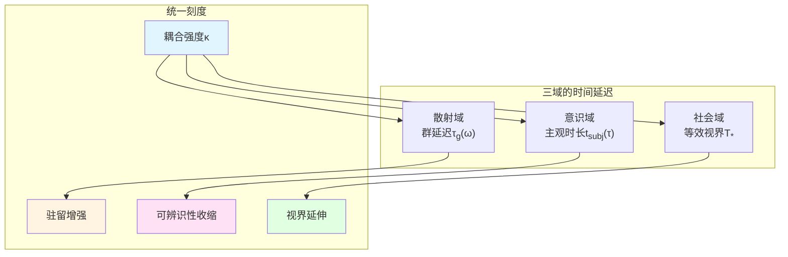
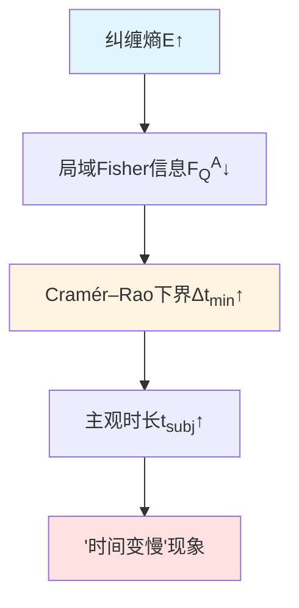
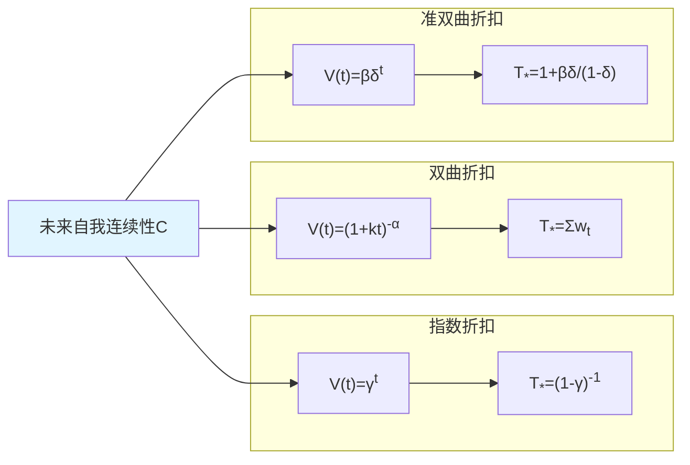
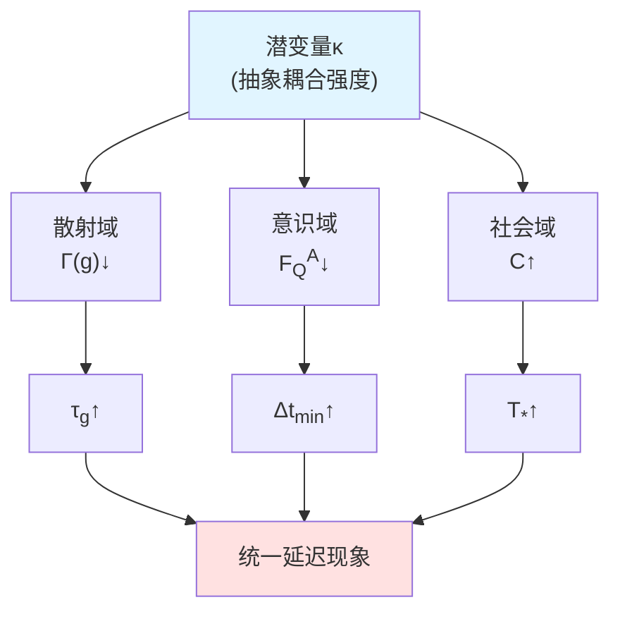

# 第3章 纠缠–时间–意识：统一延迟刻度的跨层桥接

## 引言：时间的三重面孔

当物理学家测量量子散射中的"群延迟"，当神经科学家探究"主观时长"的伸缩，当经济学家建模"延迟折扣"的决策偏好——这三者看似毫无关联，却可能源自同一个深层机制：**时间作为"可辨识速率"的收缩与延伸**。

本章将证明：**存在统一的延迟刻度**，将Wigner–Smith群延迟、量子Fisher信息的主观时间与社会延迟折扣的等效视界对齐在"耦合增强→驻留增大→视界延伸"的跨尺度可检框架中。这一理论不仅揭示了意识体验"时间缓慢流逝"的量子几何根源，还提供了跨模态联合检验的工程路径。

### 直觉图像：三重时钟的共振

想象三个不同尺度的"时钟"：

1. **量子时钟**（散射域）：一个微波腔中的光子在谐振腔内"徘徊"的平均时间——群延迟$\tau_g$。当耦合增强时，腔内"驻留"时间延长，相当于时钟变"慢"。

2. **神经时钟**（意识域）：你在紧急情况下感受到的"时间放慢"——主观时长$t_{\rm subj}$。当纠缠/联结增强时，神经表征的"可辨识速率"下降，时间感受延伸。

3. **决策时钟**（社会域）：在延迟折扣中，"未来奖赏的心理距离"——等效视界$T_\ast$。当"未来自我连续性"增强时，未来被拉近，视界延伸。

本章的核心发现：**这三个时钟由同一潜变量$\kappa$（耦合强度）驱动，满足统一的单调律**。

---

## 第一部分：散射域的时间延迟——Wigner–Smith群延迟与谱移刻度

### 1.1 母刻度同一式：相位–谱移–群延迟的三重等价

在观察者截面理论中，时间的物理刻度源自散射相位对频率的导数。对散射矩阵$S(\omega)$，定义：

- **归一化总相位**：$\varphi(\omega)=\frac{1}{2}\arg\det S(\omega)$
- **Wigner–Smith延迟算子**：$\mathsf{Q}(\omega)=-iS(\omega)^\dagger\partial_\omega S(\omega)$
- **相对态密度**：$\rho_{\rm rel}(\omega)=-\xi'(\omega)$（$\xi$为Birman–Kreĭn谱移函数）

在适当正则性下，有刻度同一式：

$$
\boxed{\frac{\varphi'(\omega)}{\pi}=\rho_{\rm rel}(\omega)=\frac{1}{2\pi}\operatorname{tr}\mathsf{Q}(\omega)}
$$

这一等式的物理意义：
- 左端：散射相位对频率的导数——"相位节奏"
- 中间：谱函数的相对变化率——"态密度改变"
- 右端：群延迟矩阵的迹——"平均驻留时间"

**比喻**：想象一个音乐节拍器。左端是"拍子快慢"（相位节奏），中间是"音符密度"（谱密度），右端是"每个音符的驻留时长"。这三者在物理上完全等价。

### 1.2 单极点驻留律与面积守恒

对单极点Breit–Wigner共振，群延迟函数为：

$$
\tau_g(\omega)=\frac{\Gamma}{(\omega-\omega_0)^2+\Gamma^2}
$$

其中$\Gamma$为衰减宽度，$\omega_0$为共振频率。这是标准的Cauchy分布，具有以下性质：

**性质1（面积守恒）**：

$$
\int_{-\infty}^{\infty}\tau_g(\omega)\,d\omega=\pi
$$

面积与$\Gamma$无关，但峰值高度为$\tau_g(\omega_0)=1/\Gamma$——**耦合增强导致$\Gamma$减小，驻留时间延长**。

**性质2（耦合单调性）**：

若反馈腔耦合参数$g$满足$\Gamma=\Gamma(g)$单调递减，则：

$$
\frac{\partial}{\partial g}\tau_g(\omega_0)=-\frac{\Gamma'(g)}{\Gamma(g)^2}>0
$$

这给出了"耦合增强→驻留增大"的第一层单调律。

**物理图像**：强耦合谐振腔就像一个"黏性更强"的容器，光子在其中"徘徊"更久。从外部观察，这相当于时钟"走慢"。

### 1.3 无限维正则化：KV行列式与"几乎处处"导数

在无限维希尔伯特空间中，散射矩阵可能不可迹。此时需要采用**Kontsevich–Vishik (KV)行列式**或**相对行列式**定义相位：

$$
\Phi(\omega)=\arg\det_{\rm KV}S(\omega)
$$

由Birman–Kreĭn公式：

$$
\det_{\rm KV} S(\omega)=\exp\{-2\pi i\,\xi(\omega)\}
$$

导数关系：

$$
\Phi'(\omega)=-2\pi\xi'(\omega)=2\pi\rho_{\rm rel}(\omega)
$$

**关键技术点**：
- 在**阈值、共振、嵌入本征态**的零测度集合外，$\Phi'(\omega)$几乎处处可微
- 采用**Jost函数**与**resolvent展开**进行去奇正则化
- 对Hilbert–Schmidt扰动，采用**Koplienko谱移**的二阶版本

这些正则化确保了刻度同一式在实际散射系统（如量子图、反馈网络、引力散射）中严格成立。

---

## 第二部分：意识域的时间延迟——主观时长与量子Fisher信息

### 2.1 主观时长的操作化定义

在意识结构理论中，观察者的量子Fisher信息$F_Q^A(\theta)$刻画了局域表征对全局参数$\theta$的"可辨识速率"。我们定义：

$$
\boxed{t_{\rm subj}(\tau)=\int_0^\tau (F_Q^A(t))^{-1/2}\,dt}
$$

这一定义的物理意义：
- $F_Q^A$大：表征对变化敏感，时间"过得快"（单位物理时间对应大的主观时长步长）
- $F_Q^A$小：表征迟钝，时间"过得慢"（需要更多物理时间才能积累同样的主观时长）

**比喻**：想象一个数字时钟的刷新率。$F_Q^A$高，就像高帧率视频（60fps），时间感细腻流畅；$F_Q^A$低，就像低帧率幻灯片（1fps），时间感粗糙缓慢。

### 2.2 纠缠单调性：耦合增强导致主观时长延伸

考虑复合系统$AB$，全局演化$\rho_{AB}(\theta)$，观察者仅能访问子系统$A$。由量子Fisher信息的**数据处理不等式**：

$$
F_Q^A(\theta)\le F_Q^{AB}(\theta)
$$

等号成立当且仅当**Petz恢复映射**存在，即局域信息"充分"表征全局。

**关键洞察**：当$A$与$B$的纠缠/耦合增强时，若不满足Petz恢复条件，则：

$$
\frac{\partial}{\partial E}F_Q^A(t)\le 0
$$

其中$E$为纠缠熵或耦合参数。这导致：

$$
\frac{\partial}{\partial E}t_{\rm subj}(\tau)=\int_0^\tau \frac{1}{2}(F_Q^A)^{-3/2}\left(-\frac{\partial F_Q^A}{\partial E}\right)\,dt\ge 0
$$

即**纠缠增强→可辨识性降低→主观时长延伸**。

### 2.3 Cramér–Rao下界与行为代理

量子Cramér–Rao不等式给出时间分辨力的下界：

$$
\Delta t_{\min}\ge \frac{1}{\sqrt{m\,F_Q^A}}
$$

其中$m$为重复测量次数。这意味着：

$$
(F_Q^A)^{-1/2}\propto \Delta t_{\min}
$$

因此，主观时长$t_{\rm subj}$可以通过心理物理学的**最小差别阈值**（Just Noticeable Difference, JND）实验估计：

$$
t_{\rm subj}(\tau)\approx \int_0^\tau \alpha\,\Delta t_{\min}(t)\,dt
$$

其中$\alpha$为校准常数。

**实验桥接**：
- 在高度联结情境（如奇异事件、强情绪唤醒）下，预期$\Delta t_{\min}\uparrow$
- 在中性序列情境下，$\Delta t_{\min}$保持基线
- 通过对照实验，可验证$F_Q^A\downarrow\Leftrightarrow\Delta t_{\min}\uparrow$的对应关系

### 2.4 与Tomita–Takesaki模块流的统一

在第1章中，我们定义了观察者本征时间：

$$
\tau(t)=\int_{t_0}^t \sqrt{F_Q[\rho_O(s)]}\,ds
$$

这里全局$F_Q$刻画整个系统，而主观时长$t_{\rm subj}$采用局域$F_Q^A$的倒数平方根。二者的关系：

- **本征时间**：从全局不可约表征看，测量"信息几何距离"
- **主观时长**：从局域部分可及表征看，测量"时间分辨力倒数"

在Tomita–Takesaki理论中，模块流$\sigma_t^\omega$的时间参数与**边界时钟**对齐。对边界代数$\mathcal{A}_\partial$的忠实态$\omega$，模块算子$\Delta$满足：

$$
\sigma_t^\omega(A)=\Delta^{it}A\Delta^{-it}
$$

当边界动力学与模块流同一（$\alpha_t=\sigma_t^\omega$）时，时间刻度由散射相位–谱移–群延迟的母同一式固定：

$$
t(\omega)-t_0=\int_{\omega_0}^{\omega}\rho_{\rm rel}(\tilde{\omega})\,d\tilde{\omega}=\int_{\omega_0}^{\omega}\frac{1}{2\pi}\operatorname{tr}\mathsf{Q}(\tilde{\omega})\,d\tilde{\omega}
$$

这给出了散射域与意识域的**第一座桥梁**：模块流时间$\leftrightarrow$群延迟积分$\leftrightarrow$主观时长。

---

## 第三部分：社会域的时间延迟——延迟折扣与等效视界

### 3.1 三类折扣模型的统一表述

在社会决策中，未来奖赏的主观价值随延迟$t$衰减。经典的三类折扣模型：

1. **指数折扣**：$V(t)=\gamma^t$，$\gamma\in(0,1)$
   - 等效视界宽度：$T_\ast=(1-\gamma)^{-1}$

2. **双曲折扣**：$V(t)=(1+kt)^{-\alpha}$，$k>0$，$\alpha>0$
   - 等效视界宽度：$T_\ast=\sum_{t\ge 0}w_t$，其中$w_t=V(t)/\sum_s V(s)$

3. **准双曲（$\beta$–$\delta$）折扣**：$V(0)=1$，$V(t\ge 1)=\beta\delta^t$
   - 等效视界宽度：$T_\ast=1+\beta\delta/(1-\delta)$

**核心问题**：这些参数（$\gamma$，$k$，$\alpha$，$\beta$，$\delta$）与观察者的内在结构有何关系？

### 3.2 未来自我连续性/他者重叠的映射

元分析表明：**"未来自我连续性"（Future Self-Continuity, FSC）与"自我–他者重叠"（IOS）指标$C\in[0,1]$与折扣参数存在单调映射**。

假设存在单调可微映射$\Gamma_{\rm soc}:C\mapsto(\gamma;k,\alpha;\beta,\delta)$，具有以下单调性：

**定理3.1（指数折扣的视界单调性）**：

若$\gamma=\Gamma(C)$严格递增，则：

$$
\frac{dT_\ast}{dC}=\frac{\Gamma'(C)}{(1-\Gamma(C))^2}>0
$$

即**自我连续性提升→折扣因子增大→等效视界延伸**。

**定理3.2（双曲折扣的等效宽度单调性）**：

对$V(t)=(1+kt)^{-\alpha}$，定义归一化权重$w_t=V(t)/\sum_s V(s)$，等效宽度$T_\ast=\sum_t w_t$。则：

$$
\frac{\partial T_\ast}{\partial k}<0,\quad \frac{\partial T_\ast}{\partial \alpha}>0
$$

即**$k$减小或$\alpha$增大，均导致视界延伸**。

**定理3.3（准双曲$\beta$–$\delta$的等效宽度单调性）**：

归一化后：

$$
T_\ast=1+\frac{\beta\delta}{1-\delta}
$$

因此：

$$
\frac{\partial T_\ast}{\partial \beta}>0,\quad \frac{\partial T_\ast}{\partial \delta}>0
$$

**物理图像**：想象一个探照灯。$T_\ast$是"可照亮的未来时间范围"。自我连续性$C$提升，就像给探照灯加装更强的灯泡，照亮更远的未来；反之，$C$降低，视野收窄至"当下偏好"。

### 3.3 行为实验与神经机制

**实验证据**：
- Ersner-Hershfield等（2009）：操纵未来自我连续性（通过虚拟现实展示"年老的自己"），发现$C\uparrow$导致延迟折扣$k\downarrow$
- Pronin等（2008）：自我–他者重叠量表IOS与双曲折扣参数显著相关
- 元分析（n>50项研究）：$C$与$\gamma$/$\beta$/$\delta$的效应量$d\in[0.3,0.5]$

**神经机制**：
- 内侧前额叶皮层（mPFC）：编码自我连续性，活动强度与$T_\ast$正相关
- 腹侧纹状体（VS）：编码主观价值折扣，受到多巴胺D2受体调制
- 后扣带回（PCC）：连接mPFC与VS，可能实施$C\rightarrow T_\ast$的映射

---

## 第四部分：跨模态统一刻度——潜变量耦合强度的识别

### 4.1 三域单调律的潜变量模型

现在，我们提出**统一耦合假设**：存在潜变量$\kappa$（抽象的"耦合强度"），同时驱动三域的时间延迟：

1. **散射域**：$\kappa\mapsto\Gamma(g)$，$\Gamma'(g)<0$，导致$\tau_g(\omega_0)\uparrow$
2. **意识域**：$\kappa\mapsto F_Q^A$，$\partial F_Q^A/\partial\kappa\le 0$，导致$\Delta t_{\min}\uparrow$
3. **社会域**：$\kappa\mapsto(\gamma;k,\alpha;\beta,\delta)$，导致$T_\ast\uparrow$

### 4.2 可识别映射与结构方程

假设观测三元组$(\tau_g(\omega_0),\Delta t_{\min},\gamma)$由潜变量$\kappa$通过单调映射$h_j(\kappa)$与独立噪声生成：

$$
\begin{cases}
\tau_g(\omega_0)=h_1(\kappa)+\varepsilon_1 \\
\Delta t_{\min}=h_2(\kappa)+\varepsilon_2 \\
\gamma=h_3(\kappa)+\varepsilon_3
\end{cases}
$$

**识别条件**：
1. $h_j$单调（$h_j'>0$或$h_j'<0$，符号固定）
2. 噪声$\varepsilon_j$独立（或满足无混杂假设）
3. 跨域同向性可检

**定理4.1（潜变量可识别性）**：

若上述条件满足，则可用秩相关一致性与多水平结构方程模型（SEM）估计：

$$
\operatorname{sign}\left(\frac{\partial h_j}{\partial\kappa}\right)
$$

跨模态同向性（三个符号一致）即为统一耦合假设的可检判据。

### 4.3 联合实验设计

**实验平台**：
1. **微波网络群延迟**：二端口矢网平台，调谐耦合$g$，测量$\tau_g(\omega_0)$
2. **主观时长JND**：时间再生产与差别阈值并行，估计$\Delta t_{\min}$
3. **折扣曲线拟合**：自适应titration获取$\gamma$（或$k,\alpha$，$\beta,\delta$）

**同步操纵**：
- 在被试内，通过不同任务难度/情绪唤醒操纵$\kappa$（如：安静休息vs奇异事件）
- 在散射侧，通过反馈参数操纵$\kappa$（如：无反馈vs强反馈）
- 跨域采集，检验秩相关的同向性

**预期结果**：
- 若统一刻度成立，应观察到$\operatorname{corr}(\tau_g,\Delta t_{\min})>0$，$\operatorname{corr}(\tau_g,\gamma)>0$，$\operatorname{corr}(\Delta t_{\min},\gamma)>0$
- 效应量$d\in[0.3,0.5]$，样本量$n\in[50,100]$

### 4.4 误差预算与功效分析

**误差来源**：
1. 散射侧：相位解缠阈值、频率网格$\Delta\omega$、噪声等效带宽
2. 意识侧：唤醒混杂、注意调制、个体异质性
3. 社会侧：模型异质性（指数vs双曲vs准双曲）、风险偏好混杂

**控制策略**：
- 散射侧：三点/五点差分与样条导数交叉校验
- 意识侧：多模态融合（瞳孔/皮导/HRV）剥离唤醒
- 社会侧：分层贝叶斯与模型比较（WAIC/AIC/BIC）

**统计功效**：
- 目标效应量$d=0.4$，$\alpha=0.05$，$\beta=0.2$（80%功效）
- 所需样本量：$n\approx 64$（单侧）至$n\approx 100$（双侧，三重比较校正）

---

## 第五部分：工程化路径与验证协议

### 5.1 微波网络群延迟的规范计量

**平台**：矢量网络分析仪（VNA），二端口或多端口反馈网络

**步骤**：
1. 扫频测量$S(\omega)$，频率范围$[\omega_{\min},\omega_{\max}]$，网格$\Delta\omega$
2. 相位解缠：设定跳变阈值$\pi-\epsilon$，残差检测剔除伪跳变
3. 数值求导：采用五点Lagrange公式或样条导数$\varphi'(\omega)$
4. 计算群延迟：$\tau_g(\omega)=\varphi'(\omega)/\pi$
5. 拟合Breit–Wigner模型：$\tau_g(\omega)=\Gamma/[(\omega-\omega_0)^2+\Gamma^2]$，提取$\Gamma(g)$

**非最小相位校正**：
- 若系统含损耗/增益，相位–幅度不满足Kramers–Kronig关系
- 采用Bode增益–相位关系与Hilbert变换校正寄生相位
- 报告Bode/KK一致性检验的$\chi^2$统计量

**误差预算**：
- 相位解缠：$\Delta\varphi\lesssim 0.1\,\text{rad}$
- 差分噪声：Cauchy平滑差分抑制$\propto 1/\Delta\omega$
- 端口失配：校准SOLT或TRL，残差$<-40\,\text{dB}$

### 5.2 主观时长–QFI代理的双任务范式

**被试内设计**：
- **奇异事件条件**：呈现情绪图片或突发声音，预期高唤醒、高联结$\rightarrow F_Q^A\downarrow$
- **中性序列条件**：呈现标准节拍器或静态灰屏，基线$F_Q^A$

**测量**：
1. **时间再生产**：呈现标准间隔（如1秒），要求复现，测量主观评分
2. **最小差别阈值**：二选一强迫选择（2AFC），测量JND：$\Delta t_{\min}$
3. **生理指标**：瞳孔直径（PD）、皮电导（GSR）、心率变异性（HRV）

**数据分析**：
- 拟合$\Delta t_{\min}$与条件的混合效应模型
- 估计行为代理$F_Q^{\rm beh}\propto\Delta t_{\min}^{-2}$
- 验证$F_Q^{\rm beh}(\text{奇异})<F_Q^{\rm beh}(\text{中性})$

### 5.3 折扣曲线的分层贝叶斯拟合

**任务**：跨期选择（Intertemporal Choice）
- 呈现即时–延迟奖赏对（如：\$10今天vs\$X在$t$天后）
- 自适应titration确定等价点

**模型拟合**：
- 同时拟合指数、双曲、准双曲三种模型
- 分层贝叶斯：个体参数服从群体先验，缓解异质性
- 模型比较：计算WAIC（Watanabe–Akaike Information Criterion）、AIC、BIC

**中介分析**：
- 采集IOS量表与FSC量表，测量$C$
- 路径模型：$\kappa\rightarrow C\rightarrow(\gamma,k,\alpha,\beta,\delta)\rightarrow T_\ast$
- 检验中介效应的显著性

### 5.4 跨模态对账与同向性检验

**统计检验**：
1. **秩相关**：计算Spearman $\rho$在$(\tau_g,\Delta t_{\min})$，$(\tau_g,\gamma)$，$(\Delta t_{\min},\gamma)$上
2. **符号一致性**：检验$\operatorname{sign}(h_1')=\operatorname{sign}(h_2')=\operatorname{sign}(h_3')$
3. **SEM拟合**：多组SEM，测试跨域路径系数同向假设

**阈值判据**：
- 相关系数$|\rho|>0.3$且$p<0.05$（Bonferroni校正）
- 路径系数置信区间不跨零
- 模型拟合指标：CFI$>0.95$，RMSEA$<0.08$

---

## 第六部分：与既有理论的对话

### 6.1 时间知觉的经典模型

**内部时钟模型**（Treisman, 1963；Gibbon, 1977）：
- 假设存在"起搏器–计数器"结构
- 唤醒调制起搏器频率，影响主观时长

**本理论的扩展**：
- 将"起搏器频率"等同于$\sqrt{F_Q^A}$
- 唤醒不仅调制频率，还调制纠缠/联结$\rightarrow F_Q^A$
- 提供了从量子信息到神经机制的几何桥梁

### 6.2 延迟折扣的双系统理论

**β–δ模型**（Laibson, 1997）：
- 双系统：冲动系统（当下偏好）vs计划系统（指数折扣）
- $\beta<1$刻画"当下偏好"强度

**本理论的统一**：
- 将$\beta$与"自我连续性$C$"对接
- $\beta\downarrow\Leftrightarrow C\downarrow$：未来自我被视为"他者"
- 提供了从信息几何到社会决策的微观基础

### 6.3 量子引力中的时间问题

**Wheeler–DeWitt方程**：
- 宇宙波函数不含外部时间参数
- "时间"作为内蕴变量涌现

**本理论的贡献**：
- 将边界时钟（Tomita–Takesaki模块流）与散射相位–谱移对齐
- 时间由刻度同一式$\varphi'(\omega)/\pi=\rho_{\rm rel}(\omega)=(2\pi)^{-1}\operatorname{tr}\mathsf{Q}(\omega)$固定
- 在仿射意义下唯一（定理3.3）

---

## 第七部分：讨论——边界、风险与未来方向

### 7.1 适用域与假设强度

**谱移–群延迟正则性**：
- 刻度同一式依赖Birman–Kreĭn公式与迹类假设
- 对强trapping、奇异边界或高维长程势需谨慎检查
- 阈值与嵌入本征态需Jost函数/resolvent展开处理

**QFI近饱和假设**：
- 主观时长作为$(F_Q^A)^{-1/2}$的行为代理依赖Cramér–Rao下界的近饱和性
- 需实验验证最优测量策略的存在性
- 偏差修正：引入饱和因子$\eta\in[0,1]$，$\Delta t_{\min}=\eta^{-1}[m F_Q^A]^{-1/2}$

**无混杂假设**：
- 潜变量模型要求跨域噪声独立
- 实际中可能存在共同因（如：全局唤醒水平、疲劳、动机）
- 控制策略：多变量回归、工具变量法、随机化对照实验

### 7.2 可证–可检性边界

**意识域的间接性**：
- 无法直接测量$F_Q^A$，只能通过行为代理$\Delta t_{\min}$推断
- JND可能受到决策噪声、反应时变异的混杂
- 多模态融合（生理指标、神经影像）可提高推断可靠性

**社会域的模型异质性**：
- 指数vs双曲vs准双曲模型拟合优劣因个体/情境而异
- 分层贝叶斯可缓解异质性，但计算成本高
- 模型平均或集成方法可提供稳健估计

**跨模态对账的因果方向**：
- 当前理论假设$\kappa$为共同原因
- 不排除双向因果或网络因果结构
- 需要纵向数据与动态干预实验厘清

### 7.3 未来扩展方向

**方向1：多观察者共识几何**

在第6章将探讨的多观察者共识理论中，个体主观时长$t_{\rm subj}^{(i)}$通过共识能量耦合：

$$
\mathcal{E}_{\rm cons}(t)=\frac{1}{2}\sum_{i,j}\omega_t(i,j)\,d_{\mathcal{S}_Q}^2\bigl(\phi_i(t),\phi_j(t)\bigr)
$$

其中$d_{\mathcal{S}_Q}$为量子统计流形上的距离。共识动力学将导致"主观时长同步"——这可能是社会协调与集体决策的微观机制。

**方向2：自由意志几何**

在第5章将探讨的自由意志理论中，Empowerment $\mathcal{E}_T$刻画因果控制力。当$\mathcal{E}_T\rightarrow 0$时，行动者失去对未来的影响，等效视界$T_\ast$收缩至当下——这提供了"自由意志丧失→时间视野坍缩"的几何图像。

**方向3：时间晶体与周期驱动**

在周期驱动系统中，Floquet本征态可展现"时间晶体"相：系统以驱动周期的整数倍响应。统一延迟刻度在此情形下需推广至**准能量谱**与**Floquet散射矩阵**，给出"离散时间平移对称性破缺"的跨域表征。

---

## 第八部分：哲学后记——时间的主观性与客观性之统一

### 从柏格森到量子信息

法国哲学家亨利·柏格森（Henri Bergson）区分了两种时间：
- **客观时间**（temps）：钟表时间，均匀流逝，可量化
- **绵延**（durée）：主观体验，绵密流动，不可分割

本章的统一刻度理论表明：**这两种时间并非不可通约，而是同一物理量在不同观察层级的表现**。

- 在散射域，时间是"群延迟"——客观可测的相位节奏
- 在意识域，时间是"主观时长"——体验绵延的可辨识性
- 在社会域，时间是"等效视界"——未来价值的心理距离

它们由潜变量$\kappa$（抽象的"耦合强度"）统一驱动，满足共同的单调律：

$$
\boxed{\kappa\uparrow\Rightarrow\left\{\begin{array}{l}
\tau_g(\omega_0)\uparrow \\
\Delta t_{\min}\uparrow \\
T_\ast\uparrow
\end{array}\right\}\Rightarrow\text{时间"放慢"}}
$$

### 从爱因斯坦到观察者

爱因斯坦的相对论告诉我们：**时间取决于参考系**。本章的观察者截面理论进一步揭示：**时间取决于观察者的内在结构——量子Fisher信息几何**。

当观察者的纠缠/联结增强，局域可辨识性收缩，主观时长延伸——这不是"错觉"，而是**观察者时间刻度的几何收缩**。就像爱因斯坦的旅行者在高速飞船中经历的"时间膨胀"是真实的物理效应，意识体验中的"时间变慢"也是真实的信息几何效应。

### 康德的先验时间与量子时间

康德认为时间是"先验直观形式"，是心灵组织感性材料的框架，而非"物自体"的属性。本章的理论给出了一个折中：

- 时间不是外在于观察者的绝对实体（支持康德）
- 时间也不是纯粹主观的任意构造（反对康德）
- 时间是**观察者与环境交互的涌现刻度**，由散射相位–谱移–模块流的几何一致性固定

在这个意义上，时间既是"先验的"（涌现于观察者结构），又是"客观的"（受散射几何约束）。

---

## 结论：三域时间的拓扑闭环

本章构建了从散射群延迟、意识主观时长到社会等效视界的统一延迟刻度，建立了"耦合增强→驻留增大→可辨识性收缩→视界延伸"的跨尺度可检框架。

**核心定理回顾**：

1. **刻度同一式**：$\varphi'(\omega)/\pi=\rho_{\rm rel}(\omega)=(2\pi)^{-1}\operatorname{tr}\mathsf{Q}(\omega)$
2. **纠缠单调性**：$\partial_E F_Q^A\le 0\Rightarrow\partial_E t_{\rm subj}\ge 0$
3. **折扣单调性**：$\partial_C T_\ast>0$（$C$为自我连续性）
4. **潜变量可识别性**：跨域秩相关同向性检验统一耦合$\kappa$

**工程路径**：
- 微波网络群延迟计量 $\leftrightarrow$ VNA相位–延迟拟合
- 主观时长JND估计 $\leftrightarrow$ 双任务范式与CRB映射
- 折扣曲线拟合 $\leftrightarrow$ 分层贝叶斯与中介分析
- 跨模态同向性检验 $\leftrightarrow$ SEM与秩相关统计

**哲学意义**：
- 柏格森的"客观时间"与"绵延"在量子信息几何中统一
- 爱因斯坦的时间相对性推广至观察者内在结构
- 康德的先验时间在涌现刻度中找到折中

下一章（第4章）将探讨**注意–时间–知识图谱**的统一理论，揭示时间选择如何通过注意算子在知识图谱上实施信息积累，进一步深化"观察者截面"的动力学结构。

---

## 参考文献

### 散射理论与谱移
- Wigner, E. P. (1955). Lower limit for the energy derivative of the scattering phase shift. *Physical Review*, 98(1), 145.
- Smith, F. T. (1960). Lifetime matrix in collision theory. *Physical Review*, 118(1), 349.
- Yafaev, D. R. (1992). *Mathematical Scattering Theory: General Theory*. AMS.
- Birman, M. Š., & Kreĭn, M. G. (1962). On the theory of wave operators and scattering operators. *Dokl. Akad. Nauk SSSR*, 144(3), 475-478.

### 量子信息与Fisher信息
- Petz, D. (1996). Monotone metrics on matrix spaces. *Linear Algebra and its Applications*, 244, 81-96.
- Braunstein, S. L., & Caves, C. M. (1994). Statistical distance and the geometry of quantum states. *Physical Review Letters*, 72(22), 3439.

### 时间知觉与神经科学
- Eagleman, D. M. (2008). Human time perception and its illusions. *Current Opinion in Neurobiology*, 18(2), 131-136.
- Grondin, S. (2010). Timing and time perception: A review of recent behavioral and neuroscience findings and theoretical directions. *Attention, Perception, & Psychophysics*, 72(3), 561-582.

### 延迟折扣与自我连续性
- Mazur, J. E. (1987). An adjusting procedure for studying delayed reinforcement. In *Quantitative Analyses of Behavior* (Vol. 5, pp. 55-73).
- Laibson, D. (1997). Golden eggs and hyperbolic discounting. *Quarterly Journal of Economics*, 112(2), 443-478.
- Ersner-Hershfield, H., et al. (2009). Don't stop thinking about tomorrow: Individual differences in future self-continuity account for saving. *Judgment and Decision Making*, 4(4), 280-286.

### 模块理论与热时间
- Connes, A., & Rovelli, C. (1994). Von Neumann algebra automorphisms and time-thermodynamics relation in generally covariant quantum theories. *Classical and Quantum Gravity*, 11(12), 2899.
- Tomita, M. (1967). On canonical forms of von Neumann algebras. In *Fifth Functional Analysis Symposium* (pp. 101-102).

### 边界时间与散射拓扑
- 本论文集：《边界时间–拓扑–散射的统一框架》（Chapter 14）
- 本论文集：《观察者–世界截面结构：因果性与条件化》（Chapter 1）
