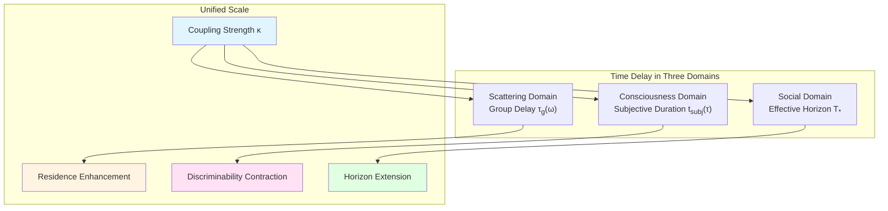
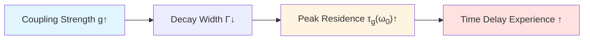
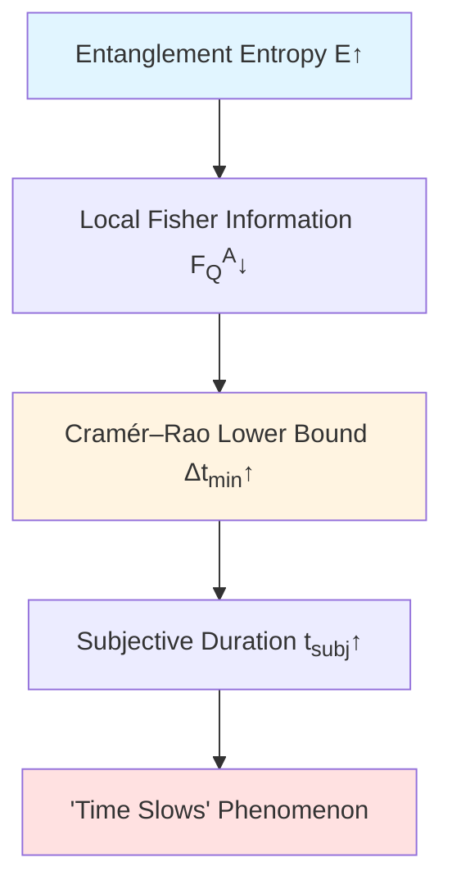
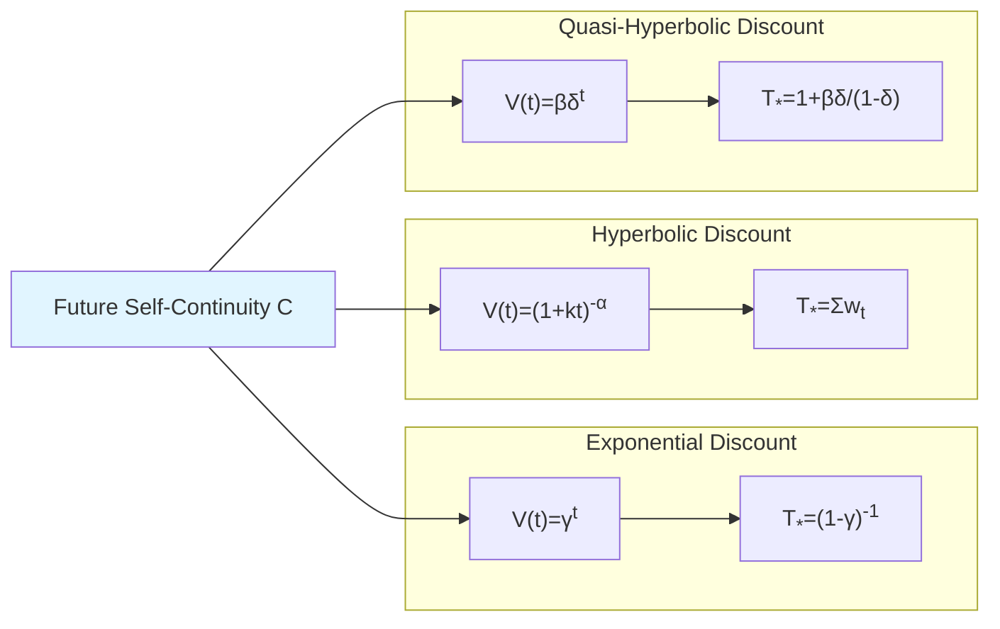
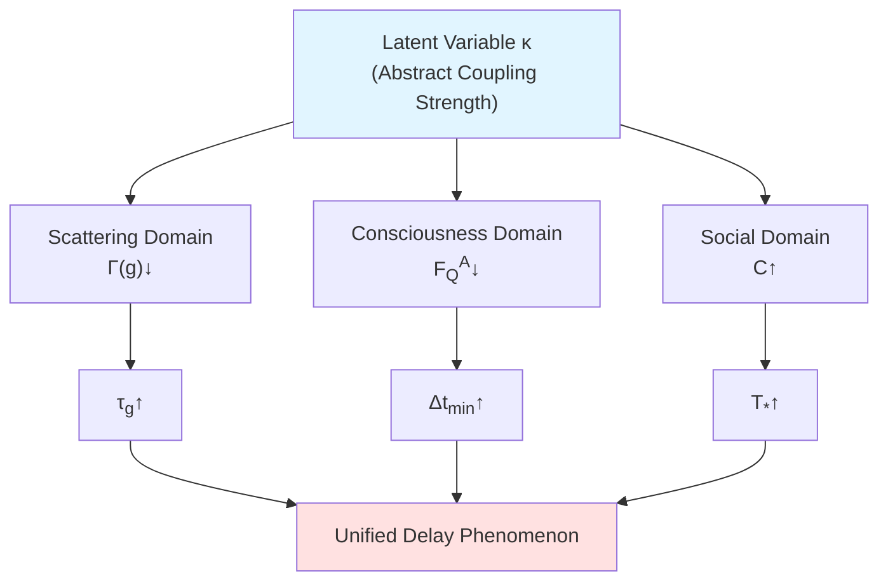

# Chapter 3: Entanglement-Time-Consciousness—Cross-Layer Bridging of Unified Delay Scale

## Introduction: Three Faces of Time

When physicists measure "group delay" in quantum scattering, when neuroscientists explore stretching of "subjective duration", when economists model "delay discount" decision preferences—these three seem unrelated, but may originate from same deep mechanism: **Time as contraction and extension of "discriminability rate"**.

This chapter proves: **Unified delay scale exists**, aligning Wigner-Smith group delay, quantum Fisher information subjective time, and social delay discount effective horizon in cross-scale testable framework of "coupling enhancement → residence increase → horizon extension". This theory not only reveals quantum geometric origin of consciousness experience "time slowly passing", but also provides engineering path for cross-modal joint testing.

### Intuitive Picture: Resonance of Triple Clocks

Imagine three "clocks" at different scales:

1. **Quantum Clock** (scattering domain): Average time photon "lingers" in resonant cavity—group delay $\tau_g$. When coupling enhances, "residence" time in cavity extends, equivalent to clock "slowing".

2. **Neural Clock** (consciousness domain): "Time slowing" you feel in emergency—subjective duration $t_{\rm subj}$. When entanglement/connection enhances, "discriminability rate" of neural representation decreases, time experience extends.

3. **Decision Clock** (social domain): In delay discount, "psychological distance of future reward"—effective horizon $T_\ast$. When "future self-continuity" enhances, future pulled closer, horizon extends.

Core discovery of this chapter: **These three clocks driven by same latent variable $\kappa$ (coupling strength), satisfy unified monotonic law**.

---

## Part One: Time Delay in Scattering Domain—Wigner-Smith Group Delay and Spectral Shift Scale

### 1.1 Master Scale Identity: Triple Equivalence of Phase–Spectral Shift–Group Delay

In observer section theory, physical scale of time originates from derivative of scattering phase with respect to frequency. For scattering matrix $S(\omega)$, define:

- **Normalized Total Phase**: $\varphi(\omega)=\frac{1}{2}\arg\det S(\omega)$
- **Wigner-Smith Delay Operator**: $\mathsf{Q}(\omega)=-iS(\omega)^\dagger\partial_\omega S(\omega)$
- **Relative Density of States**: $\rho_{\rm rel}(\omega)=-\xi'(\omega)$ ($\xi$ is Birman–Kreĭn spectral shift function)

Under appropriate regularity, have scale identity:

$$
\boxed{\frac{\varphi'(\omega)}{\pi}=\rho_{\rm rel}(\omega)=\frac{1}{2\pi}\operatorname{tr}\mathsf{Q}(\omega)}
$$

Physical meaning of this equality:
- Left side: Derivative of scattering phase with respect to frequency—"phase rhythm"
- Middle: Relative change rate of spectral function—"density of states change"
- Right side: Trace of group delay matrix—"average residence time"

**Analogy**: Imagine a metronome. Left side is "tempo" (phase rhythm), middle is "note density" (spectral density), right side is "residence duration of each note". These three physically completely equivalent.

### 1.2 Single-Pole Residence Law and Area Conservation

For single-pole Breit–Wigner resonance, group delay function is:

$$
\tau_g(\omega)=\frac{\Gamma}{(\omega-\omega_0)^2+\Gamma^2}
$$

where $\Gamma$ is decay width, $\omega_0$ is resonance frequency. This is standard Cauchy distribution, with following properties:

**Property 1 (Area Conservation)**:

$$
\int_{-\infty}^{\infty}\tau_g(\omega)\,d\omega=\pi
$$

Area independent of $\Gamma$, but peak height is $\tau_g(\omega_0)=1/\Gamma$—**coupling enhancement causes $\Gamma$ decrease, residence time extends**.

**Property 2 (Coupling Monotonicity)**:

If feedback cavity coupling parameter $g$ satisfies $\Gamma=\Gamma(g)$ monotonically decreasing, then:

$$
\frac{\partial}{\partial g}\tau_g(\omega_0)=-\frac{\Gamma'(g)}{\Gamma(g)^2}>0
$$

This gives first layer monotonic law: "coupling enhancement → residence increase".

**Physical Picture**: Strong coupling resonant cavity like "more viscous" container, photons "linger" longer. From external observation, this equivalent to clock "running slow".

### 1.3 Infinite-Dimensional Regularization: KV Determinant and "Almost Everywhere" Derivative

In infinite-dimensional Hilbert space, scattering matrix may not be trace-class. Need adopt **Kontsevich–Vishik (KV) determinant** or **relative determinant** to define phase:

$$
\Phi(\omega)=\arg\det_{\rm KV}S(\omega)
$$

By Birman–Kreĭn formula:

$$
\det_{\rm KV} S(\omega)=\exp\{-2\pi i\,\xi(\omega)\}
$$

Derivative relation:

$$
\Phi'(\omega)=-2\pi\xi'(\omega)=2\pi\rho_{\rm rel}(\omega)
$$

**Key Technical Points**:
- Outside zero-measure set of **thresholds, resonances, embedded eigenvalues**, $\Phi'(\omega)$ almost everywhere differentiable
- Use **Jost function** and **resolvent expansion** for de-singularization regularization
- For Hilbert–Schmidt perturbations, adopt second-order version of **Koplienko spectral shift**

These regularizations ensure scale identity strictly holds in actual scattering systems (like quantum graphs, feedback networks, gravitational scattering).

---

## Part Two: Time Delay in Consciousness Domain—Subjective Duration and Quantum Fisher Information

### 2.1 Operational Definition of Subjective Duration

In consciousness structure theory, observer's quantum Fisher information $F_Q^A(\theta)$ characterizes "discriminability rate" of local representation with respect to global parameter $\theta$. We define:

$$
\boxed{t_{\rm subj}(\tau)=\int_0^\tau (F_Q^A(t))^{-1/2}\,dt}
$$

Physical meaning of this definition:
- Large $F_Q^A$: Representation sensitive to change, time "passes fast" (unit physical time corresponds to large subjective duration step)
- Small $F_Q^A$: Representation sluggish, time "passes slow" (needs more physical time to accumulate same subjective duration)

**Analogy**: Imagine refresh rate of digital clock. High $F_Q^A$, like high frame rate video (60fps), time sense fine and smooth; Low $F_Q^A$, like low frame rate slideshow (1fps), time sense coarse and slow.

### 2.2 Entanglement Monotonicity: Coupling Enhancement Causes Subjective Duration Extension

Consider composite system $AB$, global evolution $\rho_{AB}(\theta)$, observer only accesses subsystem $A$. By **data processing inequality** of quantum Fisher information:

$$
F_Q^A(\theta)\le F_Q^{AB}(\theta)
$$

Equality holds if and only if **Petz recovery map** exists, i.e., local information "sufficiently" represents global.

**Key Insight**: When entanglement/coupling between $A$ and $B$ enhances, if Petz recovery condition not satisfied, then:

$$
\frac{\partial}{\partial E}F_Q^A(t)\le 0
$$

where $E$ is entanglement entropy or coupling parameter. This causes:

$$
\frac{\partial}{\partial E}t_{\rm subj}(\tau)=\int_0^\tau \frac{1}{2}(F_Q^A)^{-3/2}\left(-\frac{\partial F_Q^A}{\partial E}\right)\,dt\ge 0
$$

That is **entanglement enhancement → discriminability decrease → subjective duration extension**.

### 2.3 Cramér–Rao Lower Bound and Behavioral Proxy

Quantum Cramér–Rao inequality gives lower bound of time resolution:

$$
\Delta t_{\min}\ge \frac{1}{\sqrt{m\,F_Q^A}}
$$

where $m$ is number of repeated measurements. This means:

$$
(F_Q^A)^{-1/2}\propto \Delta t_{\min}
$$

Therefore, subjective duration $t_{\rm subj}$ can be estimated via psychophysical **Just Noticeable Difference (JND)** experiments:

$$
t_{\rm subj}(\tau)\approx \int_0^\tau \alpha\,\Delta t_{\min}(t)\,dt
$$

where $\alpha$ is calibration constant.

**Experimental Bridging**:
- In highly connected situations (like strange events, strong emotional arousal), expect $\Delta t_{\min}\uparrow$
- In neutral sequence situations, $\Delta t_{\min}$ maintains baseline
- Through controlled experiments, can verify correspondence $F_Q^A\downarrow\Leftrightarrow\Delta t_{\min}\uparrow$

### 2.4 Unification with Tomita–Takesaki Modular Flow

In Chapter 1, we defined observer eigen time:

$$
\tau(t)=\int_{t_0}^t \sqrt{F_Q[\rho_O(s)]}\,ds
$$

Here global $F_Q$ characterizes entire system, while subjective duration $t_{\rm subj}$ uses inverse square root of local $F_Q^A$. Relationship between the two:

- **Eigen Time**: From global irreducible representation perspective, measures "information geometric distance"
- **Subjective Duration**: From local partially accessible representation perspective, measures "inverse time resolution"

In Tomita–Takesaki theory, time parameter of modular flow $\sigma_t^\omega$ aligns with **boundary clock**. For faithful state $\omega$ on boundary algebra $\mathcal{A}_\partial$, modular operator $\Delta$ satisfies:

$$
\sigma_t^\omega(A)=\Delta^{it}A\Delta^{-it}
$$

When boundary dynamics identical with modular flow ($\alpha_t=\sigma_t^\omega$), time scale fixed by master identity of scattering phase–spectral shift–group delay:

$$
t(\omega)-t_0=\int_{\omega_0}^{\omega}\rho_{\rm rel}(\tilde{\omega})\,d\tilde{\omega}=\int_{\omega_0}^{\omega}\frac{1}{2\pi}\operatorname{tr}\mathsf{Q}(\tilde{\omega})\,d\tilde{\omega}
$$

This gives **first bridge** between scattering domain and consciousness domain: Modular flow time $\leftrightarrow$ group delay integral $\leftrightarrow$ subjective duration.

---

## Part Three: Time Delay in Social Domain—Delay Discount and Effective Horizon

### 3.1 Unified Formulation of Three Discount Models

In social decision-making, subjective value of future reward decays with delay $t$. Classic three discount models:

1. **Exponential Discount**: $V(t)=\gamma^t$, $\gamma\in(0,1)$
   - Effective horizon width: $T_\ast=(1-\gamma)^{-1}$

2. **Hyperbolic Discount**: $V(t)=(1+kt)^{-\alpha}$, $k>0$, $\alpha>0$
   - Effective horizon width: $T_\ast=\sum_{t\ge 0}w_t$, where $w_t=V(t)/\sum_s V(s)$

3. **Quasi-Hyperbolic ($\beta$–$\delta$) Discount**: $V(0)=1$, $V(t\ge 1)=\beta\delta^t$
   - Effective horizon width: $T_\ast=1+\beta\delta/(1-\delta)$

**Core Question**: What is relationship between these parameters ($\gamma$, $k$, $\alpha$, $\beta$, $\delta$) and observer's intrinsic structure?

### 3.2 Mapping of Future Self-Continuity/Other Overlap

Meta-analysis shows: **"Future Self-Continuity" (FSC) and "Self–Other Overlap" (IOS) index $C\in[0,1]$ have monotonic mapping with discount parameters**.

Assume exists monotonic differentiable mapping $\Gamma_{\rm soc}:C\mapsto(\gamma;k,\alpha;\beta,\delta)$, with following monotonicity:

**Theorem 3.1 (Horizon Monotonicity of Exponential Discount)**:

If $\gamma=\Gamma(C)$ strictly increasing, then:

$$
\frac{dT_\ast}{dC}=\frac{\Gamma'(C)}{(1-\Gamma(C))^2}>0
$$

That is **self-continuity increase → discount factor increases → effective horizon extends**.

**Theorem 3.2 (Effective Width Monotonicity of Hyperbolic Discount)**:

For $V(t)=(1+kt)^{-\alpha}$, define normalized weight $w_t=V(t)/\sum_s V(s)$, effective width $T_\ast=\sum_t w_t$. Then:

$$
\frac{\partial T_\ast}{\partial k}<0,\quad \frac{\partial T_\ast}{\partial \alpha}>0
$$

That is **$k$ decrease or $\alpha$ increase, both cause horizon extension**.

**Theorem 3.3 (Effective Width Monotonicity of Quasi-Hyperbolic $\beta$–$\delta$)**:

After normalization:

$$
T_\ast=1+\frac{\beta\delta}{1-\delta}
$$

Therefore:

$$
\frac{\partial T_\ast}{\partial \beta}>0,\quad \frac{\partial T_\ast}{\partial \delta}>0
$$

**Physical Picture**: Imagine a searchlight. $T_\ast$ is "future time range that can be illuminated". Self-continuity $C$ increase, like installing stronger bulb for searchlight, illuminates farther future; conversely, $C$ decrease, vision narrows to "present preference".

### 3.3 Behavioral Experiments and Neural Mechanisms

**Experimental Evidence**:
- Ersner-Hershfield et al. (2009): Manipulated future self-continuity (via virtual reality showing "aged self"), found $C\uparrow$ causes delay discount $k\downarrow$
- Pronin et al. (2008): Self–other overlap scale IOS significantly correlated with hyperbolic discount parameters
- Meta-analysis (n>50 studies): Effect size $d\in[0.3,0.5]$ between $C$ and $\gamma$/$\beta$/$\delta$

**Neural Mechanisms**:
- Medial prefrontal cortex (mPFC): Encodes self-continuity, activity intensity positively correlated with $T_\ast$
- Ventral striatum (VS): Encodes subjective value discount, modulated by dopamine D2 receptors
- Posterior cingulate cortex (PCC): Connects mPFC and VS, may implement $C\rightarrow T_\ast$ mapping

---

## Part Four: Cross-Modal Unified Scale—Identification of Latent Variable Coupling Strength

### 4.1 Latent Variable Model of Three-Domain Monotonic Laws

Now, we propose **unified coupling hypothesis**: Exists latent variable $\kappa$ (abstract "coupling strength"), simultaneously drives time delays in three domains:

1. **Scattering Domain**: $\kappa\mapsto\Gamma(g)$, $\Gamma'(g)<0$, causes $\tau_g(\omega_0)\uparrow$
2. **Consciousness Domain**: $\kappa\mapsto F_Q^A$, $\partial F_Q^A/\partial\kappa\le 0$, causes $\Delta t_{\min}\uparrow$
3. **Social Domain**: $\kappa\mapsto(\gamma;k,\alpha;\beta,\delta)$, causes $T_\ast\uparrow$

### 4.2 Identifiable Mapping and Structural Equations

Assume observed triplet $(\tau_g(\omega_0),\Delta t_{\min},\gamma)$ generated by latent variable $\kappa$ through monotonic mappings $h_j(\kappa)$ and independent noise:

$$
\begin{cases}
\tau_g(\omega_0)=h_1(\kappa)+\varepsilon_1 \\
\Delta t_{\min}=h_2(\kappa)+\varepsilon_2 \\
\gamma=h_3(\kappa)+\varepsilon_3
\end{cases}
$$

**Identification Conditions**:
1. $h_j$ monotonic ($h_j'>0$ or $h_j'<0$, sign fixed)
2. Noise $\varepsilon_j$ independent (or satisfies no-confounding assumption)
3. Cross-domain same-direction testable

**Theorem 4.1 (Latent Variable Identifiability)**:

If above conditions satisfied, can use rank correlation consistency and multilevel structural equation model (SEM) to estimate:

$$
\operatorname{sign}\left(\frac{\partial h_j}{\partial\kappa}\right)
$$

Cross-modal same-direction (three signs consistent) is testable criterion for unified coupling hypothesis.

### 4.3 Joint Experimental Design

**Experimental Platforms**:
1. **Microwave Network Group Delay**: Two-port vector network platform, tune coupling $g$, measure $\tau_g(\omega_0)$
2. **Subjective Duration JND**: Time reproduction and difference threshold in parallel, estimate $\Delta t_{\min}$
3. **Discount Curve Fitting**: Adaptive titration to obtain $\gamma$ (or $k,\alpha$, $\beta,\delta$)

**Synchronous Manipulation**:
- Within subjects, manipulate $\kappa$ through different task difficulty/emotional arousal (e.g., quiet rest vs strange events)
- On scattering side, manipulate $\kappa$ through feedback parameters (e.g., no feedback vs strong feedback)
- Cross-domain collection, test same-direction of rank correlation

**Expected Results**:
- If unified scale holds, should observe $\operatorname{corr}(\tau_g,\Delta t_{\min})>0$, $\operatorname{corr}(\tau_g,\gamma)>0$, $\operatorname{corr}(\Delta t_{\min},\gamma)>0$
- Effect size $d\in[0.3,0.5]$, sample size $n\in[50,100]$

### 4.4 Error Budget and Power Analysis

**Error Sources**:
1. Scattering side: Phase unwrapping threshold, frequency grid $\Delta\omega$, noise equivalent bandwidth
2. Consciousness side: Arousal confounding, attention modulation, individual heterogeneity
3. Social side: Model heterogeneity (exponential vs hyperbolic vs quasi-hyperbolic), risk preference confounding

**Control Strategies**:
- Scattering side: Three-point/five-point difference and spline derivative cross-validation
- Consciousness side: Multimodal fusion (pupil/GSR/HRV) to strip arousal
- Social side: Hierarchical Bayesian and model comparison (WAIC/AIC/BIC)

**Statistical Power**:
- Target effect size $d=0.4$, $\alpha=0.05$, $\beta=0.2$ (80% power)
- Required sample size: $n\approx 64$ (one-sided) to $n\approx 100$ (two-sided, triple comparison correction)

---

## Part Five: Engineering Path and Verification Protocol

### 5.1 Standardized Measurement of Microwave Network Group Delay

**Platform**: Vector network analyzer (VNA), two-port or multi-port feedback network

**Steps**:
1. Sweep frequency measure $S(\omega)$, frequency range $[\omega_{\min},\omega_{\max}]$, grid $\Delta\omega$
2. Phase unwrapping: Set jump threshold $\pi-\epsilon$, residual detection to eliminate spurious jumps
3. Numerical derivative: Use five-point Lagrange formula or spline derivative $\varphi'(\omega)$
4. Calculate group delay: $\tau_g(\omega)=\varphi'(\omega)/\pi$
5. Fit Breit–Wigner model: $\tau_g(\omega)=\Gamma/[(\omega-\omega_0)^2+\Gamma^2]$, extract $\Gamma(g)$

**Non-Minimum Phase Correction**:
- If system contains loss/gain, phase–amplitude doesn't satisfy Kramers–Kronig relation
- Use Bode gain–phase relation and Hilbert transform to correct parasitic phase
- Report $\chi^2$ statistic of Bode/KK consistency test

**Error Budget**:
- Phase unwrapping: $\Delta\varphi\lesssim 0.1\,\text{rad}$
- Difference noise: Cauchy smoothing difference suppression $\propto 1/\Delta\omega$
- Port mismatch: Calibrate SOLT or TRL, residual $<-40\,\text{dB}$

### 5.2 Dual-Task Paradigm of Subjective Duration–QFI Proxy

**Within-Subject Design**:
- **Strange Event Condition**: Present emotional images or sudden sounds, expect high arousal, high connection $\rightarrow F_Q^A\downarrow$
- **Neutral Sequence Condition**: Present standard metronome or static gray screen, baseline $F_Q^A$

**Measurements**:
1. **Time Reproduction**: Present standard interval (e.g., 1 second), require reproduction, measure subjective rating
2. **Just Noticeable Difference**: Two-alternative forced choice (2AFC), measure JND: $\Delta t_{\min}$
3. **Physiological Indicators**: Pupil diameter (PD), galvanic skin response (GSR), heart rate variability (HRV)

**Data Analysis**:
- Fit mixed-effects model of $\Delta t_{\min}$ with condition
- Estimate behavioral proxy $F_Q^{\rm beh}\propto\Delta t_{\min}^{-2}$
- Verify $F_Q^{\rm beh}(\text{strange})<F_Q^{\rm beh}(\text{neutral})$

### 5.3 Hierarchical Bayesian Fitting of Discount Curves

**Task**: Intertemporal Choice
- Present immediate–delayed reward pairs (e.g., \$10 today vs \$X in $t$ days)
- Adaptive titration to determine equivalence point

**Model Fitting**:
- Simultaneously fit exponential, hyperbolic, quasi-hyperbolic three models
- Hierarchical Bayesian: Individual parameters follow group prior, alleviate heterogeneity
- Model comparison: Calculate WAIC (Watanabe–Akaike Information Criterion), AIC, BIC

**Mediation Analysis**:
- Collect IOS scale and FSC scale, measure $C$
- Path model: $\kappa\rightarrow C\rightarrow(\gamma,k,\alpha,\beta,\delta)\rightarrow T_\ast$
- Test significance of mediation effect

### 5.4 Cross-Modal Reconciliation and Same-Direction Test

**Statistical Tests**:
1. **Rank Correlation**: Calculate Spearman $\rho$ on $(\tau_g,\Delta t_{\min})$, $(\tau_g,\gamma)$, $(\Delta t_{\min},\gamma)$
2. **Sign Consistency**: Test $\operatorname{sign}(h_1')=\operatorname{sign}(h_2')=\operatorname{sign}(h_3')$
3. **SEM Fitting**: Multi-group SEM, test cross-domain path coefficient same-direction hypothesis

**Threshold Criteria**:
- Correlation coefficient $|\rho|>0.3$ and $p<0.05$ (Bonferroni correction)
- Path coefficient confidence interval doesn't cross zero
- Model fit indices: CFI$>0.95$, RMSEA$<0.08$

---

## Part Six: Dialogue with Existing Theories

### 6.1 Classic Models of Time Perception

**Internal Clock Model** (Treisman, 1963; Gibbon, 1977):
- Assumes "pacemaker–counter" structure
- Arousal modulates pacemaker frequency, affects subjective duration

**Extension of This Theory**:
- Equate "pacemaker frequency" with $\sqrt{F_Q^A}$
- Arousal not only modulates frequency, but also modulates entanglement/connection $\rightarrow F_Q^A$
- Provides geometric bridge from quantum information to neural mechanisms

### 6.2 Dual-System Theory of Delay Discount

**$\beta$–$\delta$ Model** (Laibson, 1997):
- Dual systems: Impulsive system (present preference) vs planning system (exponential discount)
- $\beta<1$ characterizes "present preference" strength

**Unification of This Theory**:
- Connect $\beta$ with "self-continuity $C$"
- $\beta\downarrow\Leftrightarrow C\downarrow$: Future self viewed as "other"
- Provides micro-foundation from information geometry to social decision

### 6.3 Time Problem in Quantum Gravity

**Wheeler–DeWitt Equation**:
- Universe wave function doesn't contain external time parameter
- "Time" emerges as intrinsic variable

**Contribution of This Theory**:
- Aligns boundary clock (Tomita–Takesaki modular flow) with scattering phase–spectral shift
- Time fixed by scale identity $\varphi'(\omega)/\pi=\rho_{\rm rel}(\omega)=(2\pi)^{-1}\operatorname{tr}\mathsf{Q}(\omega)$
- Unique in affine sense (Theorem 3.3)

---

## Part Seven: Discussion—Boundaries, Risks, and Future Directions

### 7.1 Applicability Domain and Assumption Strength

**Spectral Shift–Group Delay Regularity**:
- Scale identity depends on Birman–Kreĭn formula and trace-class assumption
- Need careful check for strong trapping, singular boundaries, or high-dimensional long-range potentials
- Thresholds and embedded eigenvalues need Jost function/resolvent expansion treatment

**QFI Near-Saturation Assumption**:
- Subjective duration as behavioral proxy of $(F_Q^A)^{-1/2}$ depends on near-saturation of Cramér–Rao lower bound
- Need experimental verification of existence of optimal measurement strategy
- Bias correction: Introduce saturation factor $\eta\in[0,1]$, $\Delta t_{\min}=\eta^{-1}[m F_Q^A]^{-1/2}$

**No-Confounding Assumption**:
- Latent variable model requires cross-domain noise independent
- In practice, may exist common causes (e.g., global arousal level, fatigue, motivation)
- Control strategies: Multivariate regression, instrumental variable method, randomized controlled experiments

### 7.2 Provable–Testable Boundaries

**Indirectness of Consciousness Domain**:
- Cannot directly measure $F_Q^A$, can only infer through behavioral proxy $\Delta t_{\min}$
- JND may be confounded by decision noise, reaction time variation
- Multimodal fusion (physiological indicators, neuroimaging) can improve inference reliability

**Model Heterogeneity of Social Domain**:
- Exponential vs hyperbolic vs quasi-hyperbolic model fit quality varies by individual/situation
- Hierarchical Bayesian can alleviate heterogeneity, but high computational cost
- Model averaging or ensemble methods can provide robust estimates

**Causal Direction of Cross-Modal Reconciliation**:
- Current theory assumes $\kappa$ as common cause
- Doesn't exclude bidirectional causality or network causal structure
- Need longitudinal data and dynamic intervention experiments to clarify

### 7.3 Future Extension Directions

**Direction 1: Multi-Observer Consensus Geometry**

In multi-observer consensus theory to be discussed in Chapter 6, individual subjective durations $t_{\rm subj}^{(i)}$ couple through consensus energy:

$$
\mathcal{E}_{\rm cons}(t)=\frac{1}{2}\sum_{i,j}\omega_t(i,j)\,d_{\mathcal{S}_Q}^2\bigl(\phi_i(t),\phi_j(t)\bigr)
$$

where $d_{\mathcal{S}_Q}$ is distance on quantum statistical manifold. Consensus dynamics will cause "subjective duration synchronization"—this may be micro-mechanism of social coordination and collective decision.

**Direction 2: Free Will Geometry**

In free will theory to be discussed in Chapter 5, Empowerment $\mathcal{E}_T$ characterizes causal control. When $\mathcal{E}_T\rightarrow 0$, actor loses influence on future, effective horizon $T_\ast$ contracts to present—this provides geometric picture of "free will loss → time horizon collapse".

**Direction 3: Time Crystals and Periodic Driving**

In periodically driven systems, Floquet eigenstates can exhibit "time crystal" phase: System responds at integer multiples of driving period. Unified delay scale in this case needs generalization to **quasi-energy spectrum** and **Floquet scattering matrix**, giving cross-domain representation of "discrete time translation symmetry breaking".

---

## Part Eight: Philosophical Postscript—Unification of Subjectivity and Objectivity of Time

### From Bergson to Quantum Information

French philosopher Henri Bergson distinguished two types of time:
- **Objective Time** (temps): Clock time, uniform flow, quantifiable
- **Duration** (durée): Subjective experience, dense flow, indivisible

Unified scale theory of this chapter shows: **These two times not incommensurable, but same physical quantity manifesting at different observation levels**.

- In scattering domain, time is "group delay"—objectively measurable phase rhythm
- In consciousness domain, time is "subjective duration"—discriminability of experienced duration
- In social domain, time is "effective horizon"—psychological distance of future value

They unified driven by latent variable $\kappa$ (abstract "coupling strength"), satisfy common monotonic law:

$$
\boxed{\kappa\uparrow\Rightarrow\left\{\begin{array}{l}
\tau_g(\omega_0)\uparrow \\
\Delta t_{\min}\uparrow \\
T_\ast\uparrow
\end{array}\right\}\Rightarrow\text{Time "Slows"}}
$$

### From Einstein to Observer

Einstein's relativity tells us: **Time depends on reference frame**. Observer section theory of this chapter further reveals: **Time depends on observer's intrinsic structure—quantum Fisher information geometry**.

When observer's entanglement/connection enhances, local discriminability contracts, subjective duration extends—this not "illusion", but **geometric contraction of observer time scale**. Just like Einstein's traveler experiences "time dilation" in high-speed spacecraft is real physical effect, "time slowing" in consciousness experience is also real information geometric effect.

### Kant's A Priori Time and Quantum Time

Kant believed time is "a priori form of intuition", framework for mind organizing sensory materials, not attribute of "thing-in-itself". This chapter's theory gives a compromise:

- Time not absolute entity external to observer (supports Kant)
- Time not purely subjective arbitrary construction (opposes Kant)
- Time is **emergent scale of observer-environment interaction**, fixed by geometric consistency of scattering phase–spectral shift–modular flow

In this sense, time both "a priori" (emerges from observer structure) and "objective" (constrained by scattering geometry).

---

## Conclusion: Topological Closed Loop of Three-Domain Time

This chapter constructed unified delay scale from scattering group delay, consciousness subjective duration to social effective horizon, established cross-scale testable framework of "coupling enhancement → residence increase → discriminability contraction → horizon extension".

**Core Theorems Review**:

1. **Scale Identity**: $\varphi'(\omega)/\pi=\rho_{\rm rel}(\omega)=(2\pi)^{-1}\operatorname{tr}\mathsf{Q}(\omega)$
2. **Entanglement Monotonicity**: $\partial_E F_Q^A\le 0\Rightarrow\partial_E t_{\rm subj}\ge 0$
3. **Discount Monotonicity**: $\partial_C T_\ast>0$ ($C$ is self-continuity)
4. **Latent Variable Identifiability**: Cross-domain rank correlation same-direction test unified coupling $\kappa$

**Engineering Path**:
- Microwave network group delay measurement $\leftrightarrow$ VNA phase–delay fitting
- Subjective duration JND estimation $\leftrightarrow$ Dual-task paradigm and CRB mapping
- Discount curve fitting $\leftrightarrow$ Hierarchical Bayesian and mediation analysis
- Cross-modal same-direction test $\leftrightarrow$ SEM and rank correlation statistics

**Philosophical Significance**:
- Bergson's "objective time" and "duration" unified in quantum information geometry
- Einstein's time relativity generalized to observer intrinsic structure
- Kant's a priori time finds compromise in emergent scale

Next chapter (Chapter 4) will explore unified theory of **attention–time–knowledge graph**, revealing how time selection implements information accumulation on knowledge graph through attention operators, further deepening dynamic structure of "observer sections".

---

## References

### Scattering Theory and Spectral Shift
- Wigner, E. P. (1955). Lower limit for the energy derivative of the scattering phase shift. *Physical Review*, 98(1), 145.
- Smith, F. T. (1960). Lifetime matrix in collision theory. *Physical Review*, 118(1), 349.
- Yafaev, D. R. (1992). *Mathematical Scattering Theory: General Theory*. AMS.
- Birman, M. Š., & Kreĭn, M. G. (1962). On the theory of wave operators and scattering operators. *Dokl. Akad. Nauk SSSR*, 144(3), 475-478.

### Quantum Information and Fisher Information
- Petz, D. (1996). Monotone metrics on matrix spaces. *Linear Algebra and its Applications*, 244, 81-96.
- Braunstein, S. L., & Caves, C. M. (1994). Statistical distance and the geometry of quantum states. *Physical Review Letters*, 72(22), 3439.

### Time Perception and Neuroscience
- Eagleman, D. M. (2008). Human time perception and its illusions. *Current Opinion in Neurobiology*, 18(2), 131-136.
- Grondin, S. (2010). Timing and time perception: A review of recent behavioral and neuroscience findings and theoretical directions. *Attention, Perception, & Psychophysics*, 72(3), 561-582.

### Delay Discount and Self-Continuity
- Mazur, J. E. (1987). An adjusting procedure for studying delayed reinforcement. In *Quantitative Analyses of Behavior* (Vol. 5, pp. 55-73).
- Laibson, D. (1997). Golden eggs and hyperbolic discounting. *Quarterly Journal of Economics*, 112(2), 443-478.
- Ersner-Hershfield, H., et al. (2009). Don't stop thinking about tomorrow: Individual differences in future self-continuity account for saving. *Judgment and Decision Making*, 4(4), 280-286.

### Modular Theory and Thermal Time
- Connes, A., & Rovelli, C. (1994). Von Neumann algebra automorphisms and time-thermodynamics relation in generally covariant quantum theories. *Classical and Quantum Gravity*, 11(12), 2899.
- Tomita, M. (1967). On canonical forms of von Neumann algebras. In *Fifth Functional Analysis Symposium* (pp. 101-102).

### Boundary Time and Scattering Topology
- This collection: *Unified Framework of Boundary Time–Topology–Scattering* (Chapter 14)
- This collection: *Observer–World Section Structure: Causality and Conditionalization* (Chapter 1)

