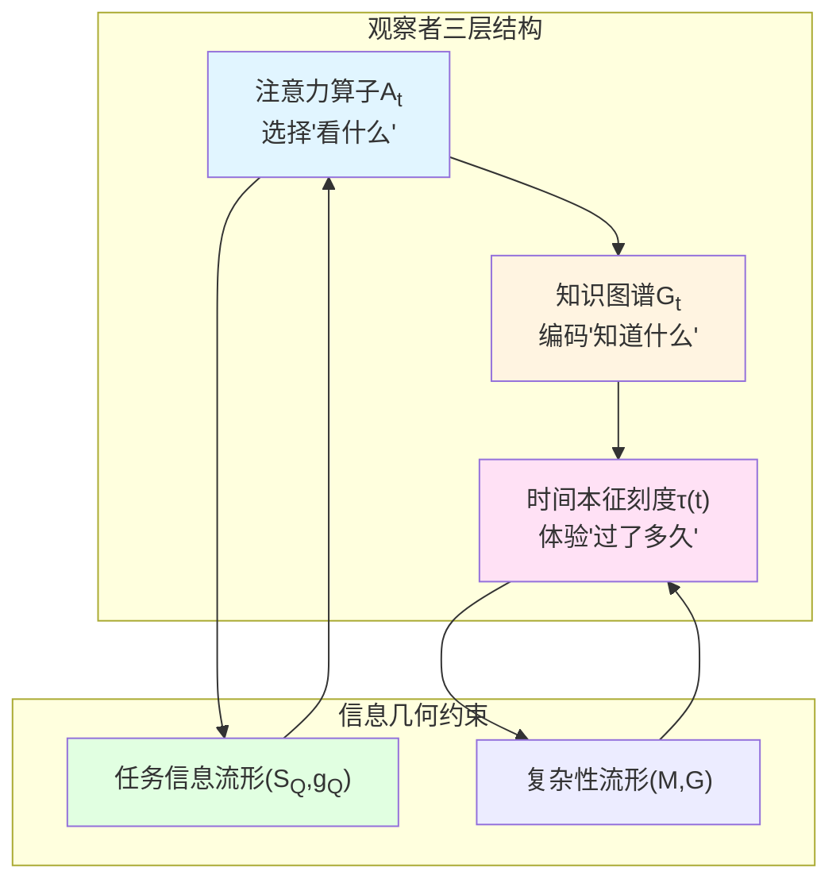
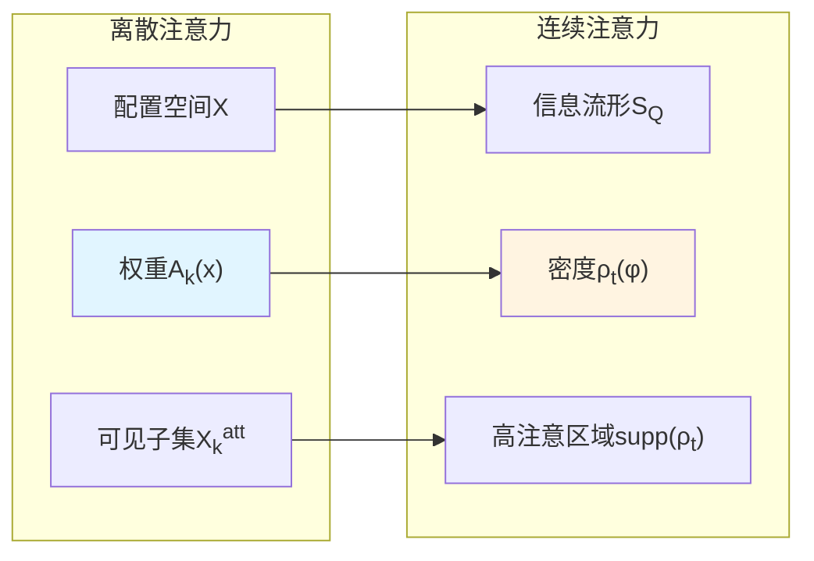
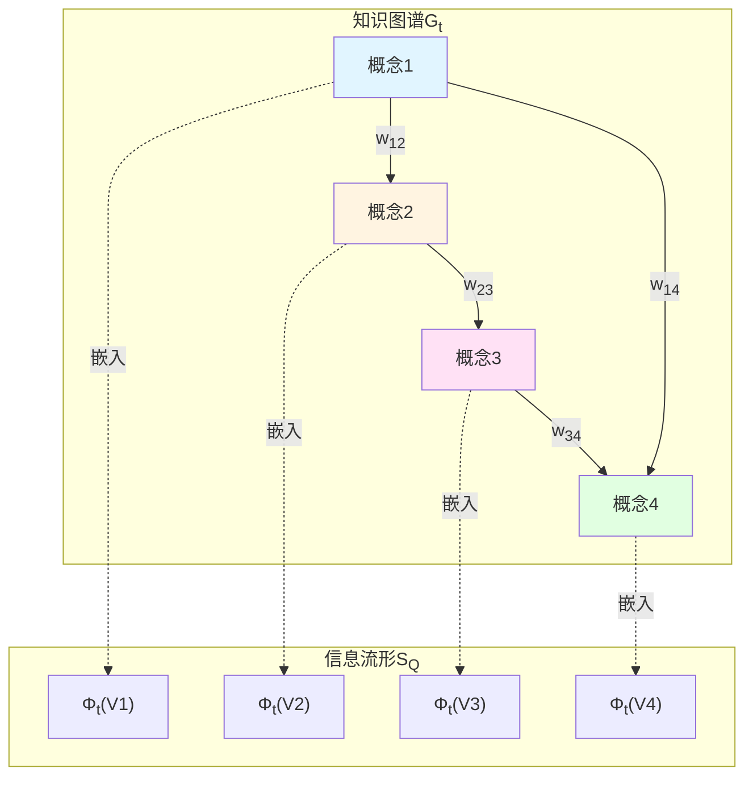
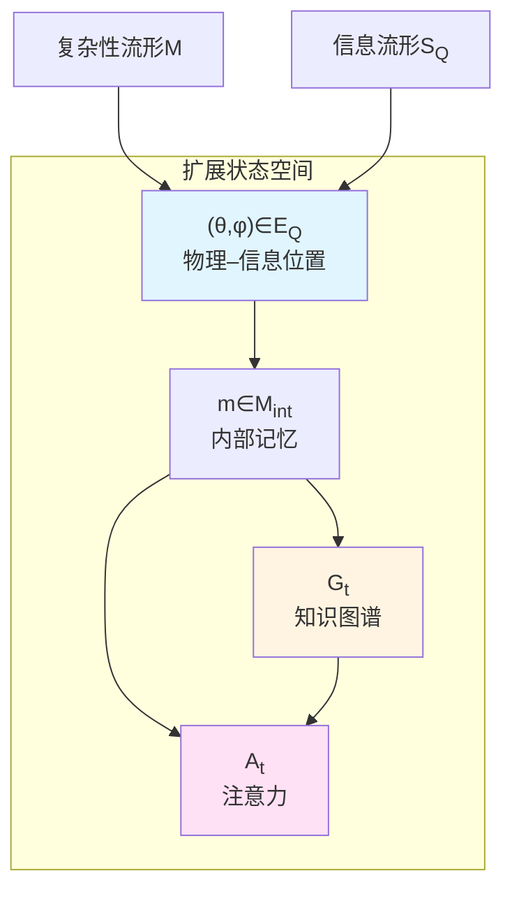
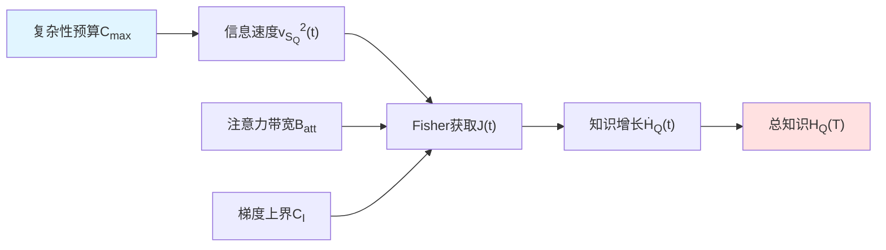
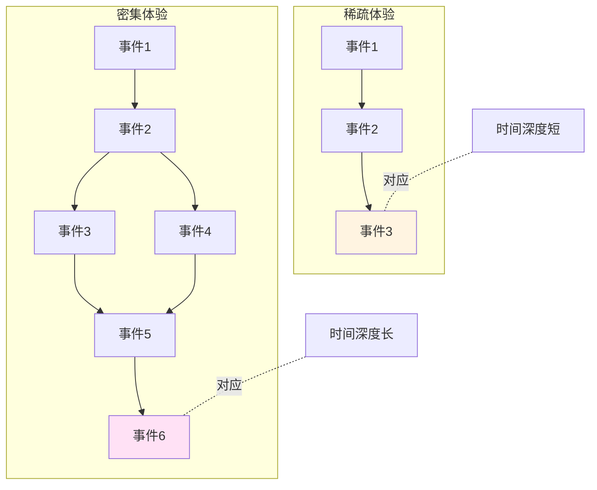

# 第4章 注意–时间–知识图谱：时间选择的信息积累几何

## 引言：注意力的时间刻度

当你在拥挤的咖啡馆中专注阅读，周围的嘈杂声"消失"了；当你在紧急情况下高度警觉，时间似乎"放慢"了——这两种现象都涉及**注意力如何塑造时间体验**。

在前几章中，我们建立了观察者截面的数学框架：观察者通过世界线的"切片"$(γ(τ), \mathcal{A}_{γ,Λ}(τ), ρ_{γ,Λ}(τ))$访问宇宙的局部信息。但一个关键问题尚未回答：**观察者如何选择"看什么"？**

本章将构建**注意力–时间–知识图谱**的统一理论，揭示：
- 注意力是观察者在信息流形上的**时间依赖权重分布**
- 时间选择通过注意力算子实施**信息积累的几何约束**
- 知识图谱是信息流形的**离散骨架**，在长时间极限下谱收敛到真实几何

这一理论将"注意力经济学"中的稀缺资源分配问题，转化为**信息几何上的变分最优化问题**。

### 核心洞察：信息积累的三重约束

想象一个探险家在未知地形中绘制地图：
1. **注意力带宽**：他每天只能探索有限区域（注意力算子$A_t$的支撑）
2. **复杂性预算**：行走路径的总长度受体力限制（复杂性流形上的世界线长度$C_{\max}$）
3. **知识图谱**：他绘制的地图是离散采样点（节点$V_t$）与路径（边$E_t$），逐渐逼近真实地形

本章将证明：**在这三重约束下，观察者可积累的信息量$H_Q(T)$与复杂性预算$C_{\max}$成线性上界**，并且**知识图谱的谱维数在长时间极限下收敛到信息流形的真实维数**。

---

## 第一部分：注意力算子——观察者的"聚光灯"

### 1.1 注意力的双重形式化

在计算宇宙框架$(X, \mathsf{T}, \mathsf{C}, \mathsf{I})$中，观察者无法同时访问所有配置$x\in X$。**注意力**刻画了观察者在每个时刻的"可见窗口"。

**定义1.1（离散注意力算子）**

在时间步$k$，观察者的注意力算子是函数：

$$
A_k : X \to [0,1]
$$

满足归一化：

$$
\sum_{x\in X} A_k(x) = 1
$$

或弱约束$\sum_{x\in X} A_k(x) \le B_{\mathrm{att}}$（总注意力带宽）。

可见配置子集定义为：

$$
X_k^{\mathrm{att}} = \{ x\in X : A_k(x) > 0 \}
$$

**物理图像**：$A_k(x)$是观察者将"认知资源"分配给配置$x$的权重。就像舞台上的聚光灯，高亮某些区域，其他区域则处于"阴影"中。

**定义1.2（连续注意力密度）**

在任务信息流形$(\mathcal{S}_Q, g_Q)$上，注意力可表示为概率密度：

$$
\rho_t(\phi) \ge 0, \quad \int_{\mathcal{S}_Q} \rho_t(\phi)\,d\mu_{g_Q}(\phi) = 1
$$

其中$d\mu_{g_Q}=\sqrt{\det g_Q}\,d\phi$为体积元。

### 1.2 注意力与观察者内部状态

观察者的注意力由其**内部记忆状态**$m_k\in M_{\mathrm{int}}$决定。形式化为：

**观察者对象**：

$$
O = (M_{\mathrm{int}}, \Sigma_{\mathrm{obs}}, \Sigma_{\mathrm{act}}, \mathcal{P}, \mathcal{U})
$$

其中：
- $M_{\mathrm{int}}$：内部记忆状态空间（有限或可数）
- $\Sigma_{\mathrm{obs}}$：观测符号空间
- $\Sigma_{\mathrm{act}}$：动作空间
- $\mathcal{P}: M_{\mathrm{int}} \to \Delta(\Sigma_{\mathrm{act}})$：注意力–观测策略
- $\mathcal{U}: M_{\mathrm{int}} \times \Sigma_{\mathrm{obs}} \to M_{\mathrm{int}}$：内部更新算子

**动力学循环**：

1. 观察者处于内部状态$m_k$，宇宙处于配置$x_k$
2. 根据策略$\mathcal{P}(m_k)$选择动作$a_k$（决定"看哪里"）
3. 宇宙返回观测符号$o_k\sim p(o|x_k, a_k)$
4. 更新内部状态$m_{k+1} = \mathcal{U}(m_k, o_k)$

注意力算子$A_k$由$\mathcal{P}(m_k)$与当前轨道位置$(x_k, \phi_k)$联合确定。

**比喻**：想象一个带有头灯的矿工在黑暗洞穴中探索。他的"记忆地图"$m_k$告诉他"已经探索过哪里"，他的"决策策略"$\mathcal{P}$告诉他"接下来朝哪个方向照射头灯"，每次观测$o_k$更新地图$m_{k+1}$。

### 1.3 注意力的资源约束

**约束1（带宽约束）**：

$$
\int_{\mathcal{S}_Q} \rho_t(\phi)\,d\mu_{g_Q}(\phi) = 1
$$

归一化条件意味着注意力总量守恒——专注于某处必然忽略其他地方。

**约束2（二阶矩约束）**：

$$
\int_{\mathcal{S}_Q} \rho_t(\phi)\,d_{\mathcal{S}_Q}^2(\phi, \bar{\phi})\,d\mu_{g_Q}(\phi) \le B_{\mathrm{att}}
$$

对某固定参考点$\bar{\phi}$，注意力的"空间分散度"有界。这防止注意力过度分散（无法聚焦）或过度集中（视野狭窄）。

**物理类比**：在量子力学中，波函数归一化$\int|\psi|^2=1$对应概率守恒；这里$\rho_t$的归一化对应"认知资源总量守恒"。二阶矩约束类似海森堡不确定性原理：无法同时实现"聚焦度高"与"覆盖范围广"。

---

## 第二部分：知识图谱——信息流形的离散骨架

### 2.1 知识图谱的四元组定义

观察者通过有限时间的探索，无法访问信息流形$\mathcal{S}_Q$的所有点。他构建的知识表征是**离散图**：

**定义2.1（时刻$t$的知识图谱）**

$$
\mathcal{G}_t = (V_t, E_t, w_t, \Phi_t)
$$

其中：
1. $V_t$：有限节点集合，每个节点代表一个"概念"或"抽象状态"
2. $E_t \subset V_t \times V_t$：有向或无向边集，表示概念之间的关系（因果、蕴含、相似等）
3. $w_t: E_t \to (0, \infty)$：边权，表示关系强度
4. 嵌入映射$\Phi_t: V_t \to \mathcal{S}_Q$：将每个节点嵌入信息流形中的点

**物理图像**：知识图谱就像"地图上的采样点"。探险家无法测量每一寸地形，只能在关键位置打桩（节点$V_t$），标注路径（边$E_t$），记录相对位置（嵌入$\Phi_t$）。

### 2.2 图Laplace算子与谱结构

在知识图谱上定义**图Laplace算子**：

$$
(\Delta_t f)(v) = \sum_{u\sim v} w_t(v,u)\big(f(u) - f(v)\big)
$$

对任意函数$f: V_t \to \mathbb{R}$。这是离散版本的Laplace–Beltrami算子。

**谱性质**：
- 特征值$0 = \lambda_1^{(t)} \le \lambda_2^{(t)} \le \cdots \le \lambda_{|V_t|}^{(t)}$
- 最小非零特征值$\lambda_2^{(t)}$（Fiedler值）刻画图的"连通性"
- 大特征值的分布刻画图的"局部几何"

**定义2.2（知识图谱的谱维数）**

$$
d_{\mathrm{spec}}(t) = -2 \lim_{\varepsilon\downarrow 0} \frac{\log \mathrm{Tr}\,\exp(\varepsilon\Delta_t)}{\log\varepsilon}
$$

若该极限存在。$d_{\mathrm{spec}}(t)$描述图在小尺度下的"有效维数"。

### 2.3 谱逼近：从离散到连续

**关键问题**：知识图谱$\mathcal{G}_t$在多大程度上"忠实"表征信息流形$\mathcal{S}_Q$？

**定义2.3（谱逼近条件）**

称$\mathcal{G}_t$在$(\mathcal{S}_Q, g_Q)$上谱逼近，若：
1. 嵌入点$\Phi_t(V_t)$在$\mathcal{S}_Q$中随$t\to\infty$变得稠密
2. 以嵌入构造的核权重：

$$
w_t(v,u) = \eta_t^{-d} K\left(\frac{d_{\mathcal{S}_Q}(\Phi_t(v), \Phi_t(u))}{\eta_t}\right)
$$

使得图Laplace $\Delta_t$在适当缩放下$\Gamma$-收敛到连续Laplace–Beltrami算子$\Delta_{g_Q}$。

**定理2.1（谱维数收敛）**

若$\mathcal{G}_t$谱逼近$(\mathcal{S}_Q, g_Q)$，且信息流形的局部信息维数$d_{\mathrm{info},Q}$在紧致区域$K$上为常数，则：

$$
\lim_{t\to\infty} d_{\mathrm{spec}}(t) = d_{\mathrm{info},Q}
$$

**意义**：在长期学习过程中，观察者的知识图谱谱维数趋向信息流形的真实维数，意味着**知识图谱在几何上逐渐成为信息流形的高保真骨架**。

**比喻**：想象用三角网格逼近球面。网格节点数增加、间距缩小时，离散Laplace算子的谱逼近球面上连续Laplace算子的谱（与球谐函数对应）。这里，观察者的知识图谱扮演"三角网格"的角色。

---

## 第三部分：扩展世界线——注意力与知识的联合动力学

### 3.1 观察者–宇宙的联合状态空间

在之前章节中，我们定义了观察者在联合流形$\mathcal{E}_Q = \mathcal{M} \times \mathcal{S}_Q$上的世界线：

$$
z(t) = (\theta(t), \phi(t))
$$

其中$\theta(t)\in\mathcal{M}$为控制流形坐标，$\phi(t)\in\mathcal{S}_Q$为信息流形坐标。

现在引入**扩展世界线**，包含内部状态、知识图谱与注意力：

**定义3.1（扩展世界线）**

$$
\widehat{z}(t) = (\theta(t), \phi(t), m(t), \mathcal{G}_t, A_t)
$$

其中：
- $(\theta(t), \phi(t))\in\mathcal{E}_Q$：控制–信息状态
- $m(t)\in M_{\mathrm{int}}$：内部记忆状态
- $\mathcal{G}_t = (V_t, E_t, w_t, \Phi_t)$：知识图谱
- $A_t$或$\rho_t$：注意力算子

### 3.2 观测–计算作用量

在时间–信息–复杂性联合作用量$\mathcal{A}_Q$的基础上，加入观察者内部代价：

**定义3.2（观察者–计算联合作用量）**

$$
\widehat{\mathcal{A}}_Q[\widehat{z}(\cdot)] = \int_0^T \Big( K_{\mathrm{comp}}(t) + K_{\mathrm{info}}(t) - \gamma U_Q(\phi(t)) + R_{\mathrm{KG}}(t) + R_{\mathrm{att}}(t) \Big)\,dt
$$

其中：

1. **复杂性动能**：

$$
K_{\mathrm{comp}}(t) = \tfrac{1}{2}\alpha^2 G_{ab}(\theta)\dot{\theta}^a\dot{\theta}^b
$$

2. **信息动能**：

$$
K_{\mathrm{info}}(t) = \tfrac{1}{2}\beta^2 g_{ij}(\phi)\dot{\phi}^i\dot{\phi}^j
$$

3. **知识势能**：

$$
U_Q(\phi) = I_Q(\phi)
$$

其中$I_Q(\phi)$为任务信息质量函数（如相对熵、互信息）。

4. **知识图谱更新代价**：

$$
R_{\mathrm{KG}}(t) = \lambda_{\mathrm{KG}}\,\mathsf{D}(\mathcal{G}_{t+dt}, \mathcal{G}_t)
$$

其中$\mathsf{D}$为图之间的距离（如谱距离、Gromov–Wasserstein距离）。

5. **注意力配置代价**：

$$
R_{\mathrm{att}}(t) = \lambda_{\mathrm{att}}\,\mathsf{C}_{\mathrm{att}}(A_t)
$$

例如熵正则$\mathsf{C}_{\mathrm{att}}(\rho_t) = -\int \rho_t\log\rho_t\,d\mu_{g_Q}$，或带宽约束。

**物理解释**：
- 前三项：之前的时间–信息–复杂性变分
- $R_{\mathrm{KG}}$：频繁更新知识图谱（加入新节点、调整边权）需要"认知成本"
- $R_{\mathrm{att}}$：改变注意力配置（如切换聚焦区域）需要"切换成本"

### 3.3 Euler–Lagrange条件与最优策略

极小化$\widehat{\mathcal{A}}_Q$给出最优的观测–计算–学习策略。形式上：

$$
\frac{\delta \widehat{\mathcal{A}}_Q}{\delta \theta} = 0, \quad \frac{\delta \widehat{\mathcal{A}}_Q}{\delta \phi} = 0, \quad \frac{\delta \widehat{\mathcal{A}}_Q}{\delta \mathcal{G}_t} = 0, \quad \frac{\delta \widehat{\mathcal{A}}_Q}{\delta A_t} = 0
$$

前两式给出控制–信息坐标的测地方程；后两式给出：

**最优知识图谱更新**：在每个时刻，平衡"信息收益"与"图更新代价"，选择最优的节点添加/边调整策略。

**最优注意力配置**：在给定带宽约束下，选择最大化短期信息增益的注意力分布$\rho_t^*$。

**比喻**：就像登山者在有限体力与时间下规划路线。他需要权衡：
- 走得快（复杂性动能小）vs 到达高价值区域（信息势能低）
- 频繁更新地图（$R_{\mathrm{KG}}$高）vs 使用粗糙地图（$R_{\mathrm{KG}}$低）
- 宽广扫视（$R_{\mathrm{att}}$高）vs 聚焦局部（$R_{\mathrm{att}}$低）

---

## 第四部分：信息积累不等式——资源约束下的上界

### 4.1 知识量的度量

定义观察者在任务$Q$下的**知识量**：

$$
H_Q(t) = \sum_{v\in V_t} \pi_t(v)\,I_Q(\Phi_t(v))
$$

其中$\pi_t$为知识图谱节点上的权重分布（如访问频率、重要性评分）。

**信息积累速率**：

$$
\dot{H}_Q(t) = \frac{d}{dt} H_Q(t)
$$

**物理意义**：$H_Q(t)$测量观察者"知道多少"关于任务$Q$的信息。$\dot{H}_Q(t)$测量"学习速度"。

### 4.2 Fisher信息获取速率

假设观察者通过注意力密度$\rho_t(\phi)$对信息流形采样，其单步**Fisher信息获取速率**：

$$
J(t) = \int_{\mathcal{S}_Q} \rho_t(\phi)\,|\nabla I_Q(\phi)|_{g_Q}^2\,d\mu_{g_Q}(\phi)
$$

**意义**：$J(t)$刻画"在当前注意力配置下，信息质量函数$I_Q$的梯度平方期望"——相当于"当前学习方向的陡峭程度"。

在复杂性–信息联合几何中，$J(t)$与信息动能$v_{\mathcal{S}_Q}^2(t)$通过Lipschitz关系联系：

$$
J(t) \lesssim L_I^2 v_{\mathcal{S}_Q}^2(t)
$$

其中$L_I$为$I_Q$的Lipschitz常数。

### 4.3 信息积累不等式

**定理4.1（观察者信息积累上界）**

假设：
1. 任务信息质量函数$I_Q$在$\mathcal{S}_Q$上Lipschitz，梯度有界：

$$
|\nabla I_Q(\phi)|_{g_Q} \le C_I, \quad \forall \phi\in\mathcal{S}_Q
$$

2. 注意力密度$\rho_t$的二阶矩有界：

$$
\int_{\mathcal{S}_Q} \rho_t(\phi)\,d_{\mathcal{S}_Q}^2(\phi, \bar{\phi})\,d\mu_{g_Q}(\phi) \le B_{\mathrm{att}}
$$

3. 观察者的复杂性预算为：

$$
C_{\max} = \int_0^T \sqrt{G_{ab}(\theta(t))\dot{\theta}^a\dot{\theta}^b}\,dt
$$

则存在常数$K>0$（仅依赖于$C_I, B_{\mathrm{att}}$与几何结构），使得：

$$
\boxed{H_Q(T) - H_Q(0) \le K\,C_{\max}}
$$

**证明梗概**：

对$H_Q(t)$求导：

$$
\dot{H}_Q(t) = \sum_{v\in V_t} \dot{\pi}_t(v)\,I_Q(\Phi_t(v)) + \sum_{v\in V_t} \pi_t(v)\,\nabla I_Q(\Phi_t(v))\cdot\dot{\Phi}_t(v)
$$

第二项用Cauchy–Schwarz不等式估计：

$$
\left|\sum_{v} \pi_t(v)\,\nabla I_Q(\Phi_t(v))\cdot\dot{\Phi}_t(v)\right| \le C_I \sqrt{B_{\mathrm{att}}} \sqrt{v_{\mathcal{S}_Q}^2(t)}
$$

在联合作用量中，$v_{\mathcal{S}_Q}^2(t)$与$v_{\mathcal{M}}^2(t)$通过权重$\alpha, \beta$耦合。利用变分最优性，可证：

$$
\int_0^T \sqrt{v_{\mathcal{S}_Q}^2(t)}\,dt \le K_2 C_{\max}
$$

从而：

$$
H_Q(T) - H_Q(0) \le \int_0^T |\dot{H}_Q(t)|\,dt \le K\,C_{\max}
$$

**物理意义**：
- 信息积累量与复杂性资源成**线性上界**
- 注意力带宽$B_{\mathrm{att}}$与梯度界$C_I$仅改变比例常数$K$，不改变线性形式
- 这是"认知资源稀缺性"的几何表达：**无限制学习不可能，信息获取速率受物理约束**

**比喻**：就像用水桶从河里打水。水桶大小（$B_{\mathrm{att}}$）、河水流速（$C_I$）、行走速度（$v_{\mathcal{M}}$）共同决定单位时间的打水量。但无论如何优化，总打水量不可能超过"行走总距离"（$C_{\max}$）乘以某个常数。

### 4.4 时间选择的最优性条件

从信息积累不等式可以推导**时间选择的最优策略**：

**推论4.2（注意力最优配置）**

在固定复杂性预算$C_{\max}$与时间窗口$[0,T]$下，最大化$H_Q(T)$的注意力策略$\rho_t^*$满足：

$$
\rho_t^*(\phi) \propto |\nabla I_Q(\phi)|_{g_Q}^2 \exp\left(-\frac{d_{\mathcal{S}_Q}^2(\phi, \phi_t^*)}{2\sigma_t^2}\right)
$$

其中$\phi_t^*=\phi(t)$为当前轨道位置，$\sigma_t^2$为温度参数（由带宽约束$B_{\mathrm{att}}$确定）。

**意义**：最优注意力是"梯度平方加权"与"距离惩罚"的组合：
- 优先关注信息梯度大的区域（"学习边界"）
- 但不能离当前位置太远（受注意力带宽限制）

**物理类比**：在量子力学中，测量算子的选择影响信息获取速率（Cramér–Rao下界）；在经典信息论中，通信信道的容量限制信息传输速率。这里，注意力算子扮演"测量算子"或"信道"的角色，在几何约束下优化信息流。

---

## 第五部分：时间感与注意力调制

### 5.1 从Fisher信息到主观时长

回顾第3章的主观时长定义：

$$
t_{\mathrm{subj}}(\tau) = \int_0^\tau (F_Q^A(t))^{-1/2}\,dt
$$

其中$F_Q^A$为局域量子Fisher信息。现在，我们将其与注意力算子联系：

**命题5.1（注意力调制的主观时长）**

若观察者的量子Fisher信息与注意力带宽满足：

$$
F_Q^A(t) \propto \frac{1}{B_{\mathrm{att}}(t)}
$$

（带宽越大，可辨识性越低），则主观时长可写为：

$$
t_{\mathrm{subj}}(\tau) \approx \int_0^\tau \sqrt{B_{\mathrm{att}}(t)}\,dt
$$

**意义**：**注意力分散（$B_{\mathrm{att}}$大）导致主观时长延伸**。

**实验预测**：
- 在多任务情境下（注意力分散于多个对象），时间感受"变慢"
- 在单一聚焦任务下（注意力集中于单个对象），时间感受"变快"

这与经典的"注意力–时间扭曲"现象一致：复杂任务让时间"过得慢"，简单重复任务让时间"过得快"。

### 5.2 知识图谱与时间深度

**时间深度**的概念：观察者对"过去有多远"的感知，可以用知识图谱的**路径长度**刻画。

**定义5.1（时间深度）**

在知识图谱$\mathcal{G}_t$上，从当前概念节点$v_{\mathrm{now}}$回溯到"起源"节点$v_0$的最短路径长度：

$$
D_{\mathrm{time}}(t) = \min_{v_0\in V_0} d_{\mathcal{G}_t}(v_{\mathrm{now}}, v_0)
$$

其中$d_{\mathcal{G}_t}$为图上的测地距离。

**命题5.2（时间深度增长律）**

在谱逼近条件下，时间深度的增长率与信息流形上的测地距离增长率一致：

$$
\frac{dD_{\mathrm{time}}}{dt} \sim \sqrt{v_{\mathcal{S}_Q}^2(t)}
$$

**意义**：**在信息流形上"走得快"的观察者，其知识图谱的时间深度增长也快**——这对应于"信息密集体验导致时间感受延伸"的现象。

**比喻**：想象一本回忆录。每个章节（节点）之间的关系（边）构成"记忆图谱"。回忆"起点"到"现在"的路径长度，就是"感觉过了多久"的心理度量。密集的经历（高$v_{\mathcal{S}_Q}$）让回忆录"篇幅"增长更快。

---

## 第六部分：工程化路径——注意力追踪与知识图谱可视化

### 6.1 眼动追踪与注意力估计

**实验设计**：
1. 呈现视觉刺激（如复杂图像、文本段落）
2. 记录眼动轨迹$(x_{\mathrm{gaze}}(t), y_{\mathrm{gaze}}(t))$与注视时长$t_{\mathrm{fixation}}$
3. 构建**空间注意力热图**：

$$
A_{\mathrm{spatial}}(x,y) = \sum_{i} t_{\mathrm{fixation},i}\,\delta(x - x_i, y - y_i)
$$

4. 映射到信息流形：若图像像素$(x,y)$对应特征向量$\phi(x,y)\in\mathcal{S}_Q$，则：

$$
\rho_t(\phi) = \int A_{\mathrm{spatial}}(x,y)\,\delta(\phi - \phi(x,y))\,dxdy
$$

**验证预测**：
- 检验$\rho_t^*$是否集中在$|\nabla I_Q|$大的区域（高信息梯度）
- 检验注意力带宽$B_{\mathrm{att}}$与任务复杂度的关系

### 6.2 概念图谱的神经嵌入

**方法**：
1. 采集被试的**语义联想网络**：给定概念词$v_i$，要求列举相关概念$v_j$，赋予相似度评分$w_{ij}$
2. 构建知识图谱$\mathcal{G} = (V, E, w, \Phi)$，其中$V$为概念集，$E$为联想关系
3. 用**图嵌入算法**（如Node2Vec、GCN）学习嵌入$\Phi: V \to \mathbb{R}^d$
4. 计算图Laplace谱$\{\lambda_i\}$与热核迹$\mathrm{Tr}\,\exp(\varepsilon\Delta)$
5. 估计谱维数$d_{\mathrm{spec}}$

**验证定理2.1**：
- 比较被试（不同学习阶段）的$d_{\mathrm{spec}}(t)$
- 预期：长期学习后，$d_{\mathrm{spec}}(t)$趋向任务信息流形的真实维数

### 6.3 主动学习与信息积累

**算法框架**：
1. 初始化知识图谱$\mathcal{G}_0$与注意力$\rho_0$
2. 在每个时间步$t$：
   - 根据当前$\mathcal{G}_t, \rho_t$选择查询动作$a_t$（主动采样）
   - 观测结果$o_t$，更新内部状态$m_{t+1} = \mathcal{U}(m_t, o_t)$
   - 更新知识图谱$\mathcal{G}_{t+1}$（添加节点/调整边权）
   - 更新注意力$\rho_{t+1}$（根据信息增益重新分配）
3. 记录信息积累曲线$H_Q(t)$与复杂性消耗$C(t)$

**验证定理4.1**：
- 检验$H_Q(T)$是否与$C(T)$成线性关系
- 估计比例常数$K$与注意力带宽$B_{\mathrm{att}}$的依赖

### 6.4 跨模态知识图谱

**扩展**：在多模态任务中（视觉+语言+听觉），知识图谱的节点来自不同模态：

$$
V_t = V_t^{\mathrm{vis}} \cup V_t^{\mathrm{lang}} \cup V_t^{\mathrm{aud}}
$$

跨模态边$E_t^{\mathrm{cross}}$连接不同模态的概念（如图像"狗"$\leftrightarrow$词语"dog"）。

**嵌入对齐**：
- 视觉特征$\phi^{\mathrm{vis}}\in\mathcal{S}_Q^{\mathrm{vis}}$
- 语言特征$\phi^{\mathrm{lang}}\in\mathcal{S}_Q^{\mathrm{lang}}$
- 跨模态映射$f: \mathcal{S}_Q^{\mathrm{vis}} \to \mathcal{S}_Q^{\mathrm{lang}}$（如CLIP模型）

**研究问题**：跨模态知识图谱的谱维数如何与各单模态流形的维数关联？

---

## 第七部分：与既有理论的对话

### 7.1 注意力经济学

**经典理论**（Simon, 1971；Kahneman, 1973）：
- 注意力是稀缺资源，需要在多任务间分配
- 双重任务干扰测量注意力容量

**本理论的扩展**：
- 将"注意力容量"几何化为带宽约束$B_{\mathrm{att}}$
- 将"任务干扰"表述为信息流形上多个高梯度区域的空间分离
- 提供从几何约束到行为预测的定量桥梁

### 7.2 流形学习与表征学习

**经典理论**（Tenenbaum, 2000；Belkin & Niyogi, 2003）：
- 高维数据嵌入低维流形
- 图Laplace收敛到流形Laplace

**本理论的创新**：
- 将"数据流形"解释为"任务信息流形"$\mathcal{S}_Q$
- 将"学习者"形式化为带有限记忆的观察者对象
- 图谱收敛定理（定理2.1）给出"认知收敛"的几何保证

### 7.3 主动推理与贝叶斯脑

**经典理论**（Friston, 2010；Active Inference）：
- 大脑最小化"自由能"（变分下界）
- 行动选择最小化预测误差

**本理论的联系**：
- 联合作用量$\widehat{\mathcal{A}}_Q$可视为"广义自由能"
- 注意力算子$\rho_t$对应"精度加权"（precision weighting）
- 知识图谱更新对应"贝叶斯滤波"在离散图上的实现

### 7.4 时间知觉的标量期望理论

**经典理论**（Scalar Expectancy Theory, Gibbon, 1977）：
- 内部时钟模型：起搏器–开关–累加器
- 注意力调制开关

**本理论的几何重构**：
- "起搏器频率"$\leftrightarrow$ $\sqrt{F_Q^A}$（量子Fisher信息平方根）
- "累加器"$\leftrightarrow$主观时长积分$t_{\mathrm{subj}}$
- "注意力开关"$\leftrightarrow$注意力带宽$B_{\mathrm{att}}$调制$F_Q^A$

---

## 第八部分：讨论——认知资源的几何约束与涌现智能

### 8.1 适用域与假设强度

**Lipschitz与有界梯度假设**：
- 信息质量函数$I_Q$的Lipschitz性保证信息积累不等式的线性上界
- 实际中，$I_Q$可能有奇异点（如相变边界）
- 需要局部化处理或正则化

**谱逼近假设**：
- 知识图谱$\mathcal{G}_t$谱逼近信息流形要求长时间极限$t\to\infty$
- 有限时间内，谱维数$d_{\mathrm{spec}}(t)$可能振荡或偏离
- 需要引入"逼近速率"的定量估计

**有限记忆假设**：
- 内部状态空间$M_{\mathrm{int}}$有限限制了观察者的"工作记忆容量"
- 实际认知系统可能有分层记忆（短期vs长期）
- 需要扩展为多尺度记忆模型

### 8.2 信息积累上界的紧性

**问题**：定理4.1给出的上界$H_Q(T)\le K C_{\max}$是否是紧的（tight）？

**分析**：
- 在"均匀探索"策略下（$\rho_t$为常数分布），上界接近达到
- 在"贪婪探索"策略下（$\rho_t$集中在当前最优点），上界可能松弛
- 最优策略（推论4.2）在某些情形下可达到上界的渐近紧性

**工程意义**：紧上界意味着"无法通过优化注意力策略突破线性增长率"——这是认知资源稀缺性的根本限制。

### 8.3 从单观察者到多观察者

本章聚焦单观察者。在第6章将扩展至多观察者共识几何，其中：
- 知识图谱$\mathcal{G}_t^{(i)}$在观察者间异质
- 注意力$\rho_t^{(i)}$受社会网络拓扑影响
- 共识能量$\mathcal{E}_{\mathrm{cons}}$耦合个体知识图谱

**预期现象**：
- 知识图谱的谱收敛速度与社会网络的连通性正相关
- 多观察者的联合信息积累可突破单观察者的线性上界（"集体智能"涌现）

### 8.4 时间选择与自由意志

**哲学问题**：观察者是否"自由选择"注意力配置？

**本理论的回答**：
- 注意力算子$A_t$由内部状态$m_t$与策略$\mathcal{P}$确定——这是"决定论"的
- 但策略$\mathcal{P}$本身可能是"涌现"的（从长期学习中优化得到）
- "自由意志"可以理解为"在几何约束下的最优策略空间中的选择自由度"

在第5章将深入探讨Empowerment（因果控制力）$\mathcal{E}_T$，给出自由意志的几何刻画。

---

## 结论：注意力的几何刻画与时间选择的信息论基础

本章构建了注意力–时间–知识图谱的统一理论，将"认知资源稀缺性"这一经典心理学概念，转化为信息几何上的严格定理。

**核心结果回顾**：

1. **注意力算子形式化**：$A_t: X \to [0,1]$或$\rho_t(\phi)$在信息流形上，受带宽约束$B_{\mathrm{att}}$限制

2. **知识图谱谱收敛**（定理2.1）：

$$
\lim_{t\to\infty} d_{\mathrm{spec}}(t) = d_{\mathrm{info},Q}
$$

观察者的知识图谱在长时间极限下谱逼近信息流形的真实几何。

3. **信息积累上界**（定理4.1）：

$$
H_Q(T) - H_Q(0) \le K\,C_{\max}
$$

在复杂性预算与注意力带宽约束下，信息获取量与物理资源成线性上界。

4. **最优注意力策略**（推论4.2）：

$$
\rho_t^*(\phi) \propto |\nabla I_Q(\phi)|_{g_Q}^2 \exp\left(-\frac{d_{\mathcal{S}_Q}^2(\phi, \phi_t)}{2\sigma_t^2}\right)
$$

最优注意力集中在信息梯度大且距离当前位置近的区域。

**工程路径**：
- 眼动追踪$\rightarrow$空间注意力热图$\rightarrow$信息流形嵌入
- 语义联想网络$\rightarrow$知识图谱$\rightarrow$谱维数估计
- 主动学习算法$\rightarrow$信息积累曲线$\rightarrow$上界验证

**哲学意义**：
- 注意力不是"任意选择"，而是受几何约束的最优化过程
- 时间选择（"看什么"+"看多久"）决定信息积累路径
- 知识图谱在长期学习中"逼近真理"（谱收敛），但受认知资源限制永远无法"完全抵达"

下一章（第5章）将探讨**自由意志的几何刻画**，引入Empowerment $\mathcal{E}_T$作为"因果控制力"的度量，揭示"选择自由"与"信息几何"的深层联系。

---

## 参考文献

### 注意力理论
- Simon, H. A. (1971). Designing organizations for an information-rich world. In *Computers, Communications, and the Public Interest* (pp. 37-72).
- Kahneman, D. (1973). *Attention and Effort*. Prentice-Hall.
- Posner, M. I., & Petersen, S. E. (1990). The attention system of the human brain. *Annual Review of Neuroscience*, 13(1), 25-42.

### 流形学习
- Tenenbaum, J. B., de Silva, V., & Langford, J. C. (2000). A global geometric framework for nonlinear dimensionality reduction. *Science*, 290(5500), 2319-2323.
- Belkin, M., & Niyogi, P. (2003). Laplacian eigenmaps for dimensionality reduction and data representation. *Neural Computation*, 15(6), 1373-1396.

### 图谱几何
- Chung, F. R. (1997). *Spectral Graph Theory*. AMS.
- von Luxburg, U. (2007). A tutorial on spectral clustering. *Statistics and Computing*, 17(4), 395-416.

### 主动推理
- Friston, K. (2010). The free-energy principle: a unified brain theory? *Nature Reviews Neuroscience*, 11(2), 127-138.
- Parr, T., & Friston, K. J. (2019). Generalised free energy and active inference. *Biological Cybernetics*, 113(5-6), 495-513.

### 知识表征
- Collins, A. M., & Loftus, E. F. (1975). A spreading-activation theory of semantic processing. *Psychological Review*, 82(6), 407.
- Borge-Holthoefer, J., & Arenas, A. (2010). Semantic networks: Structure and dynamics. *Entropy*, 12(5), 1264-1302.

### 时间知觉
- Gibbon, J. (1977). Scalar expectancy theory and Weber's law in animal timing. *Psychological Review*, 84(3), 279.
- Block, R. A., & Zakay, D. (1997). Prospective and retrospective duration judgments: A meta-analytic review. *Psychonomic Bulletin & Review*, 4(2), 184-197.

### 本论文集
- 本论文集：《观察者–世界截面结构：因果性与条件化》（Chapter 1）
- 本论文集：《意识的结构化定义：五重条件与时间因果》（Chapter 2）
- 本论文集：《纠缠–时间–意识：统一延迟刻度》（Chapter 3）
- 本论文集：《计算宇宙中的观察者–注意力–知识图谱统一理论》（源理论文档）
