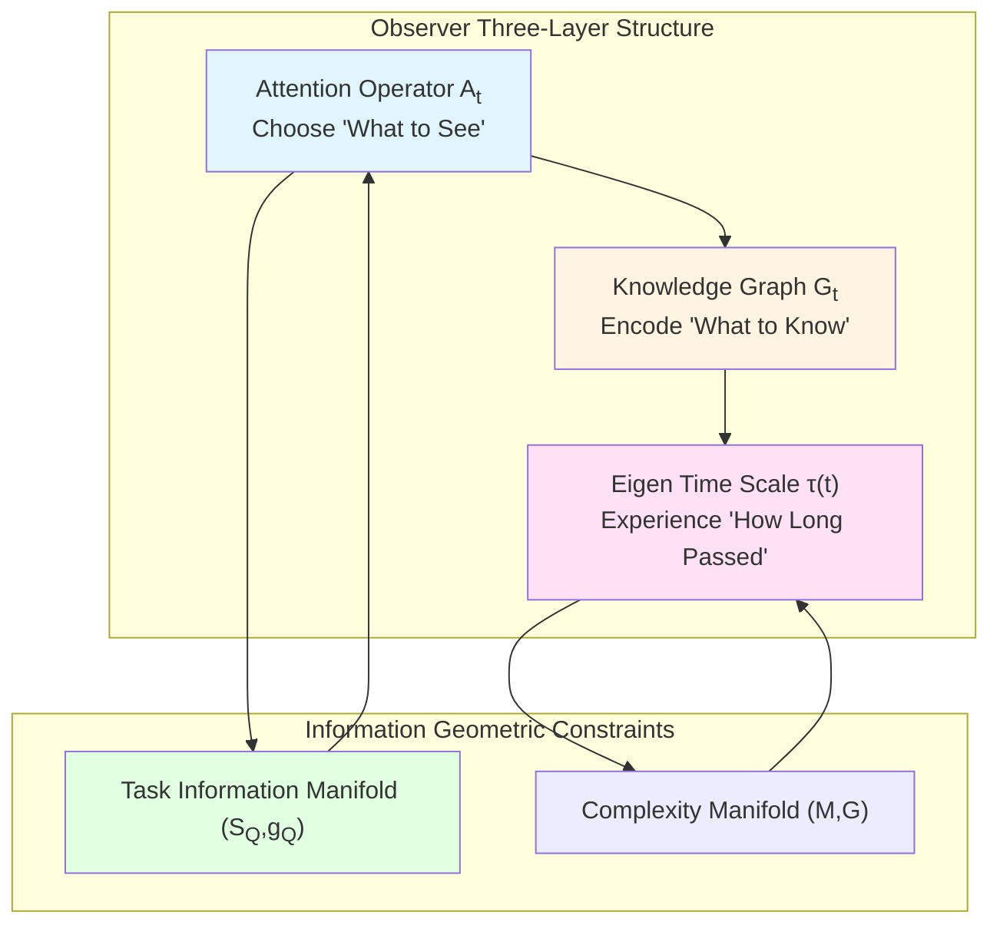
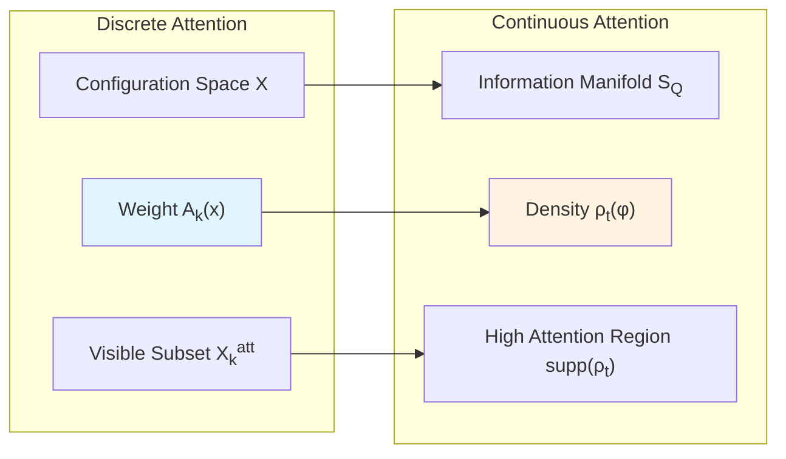
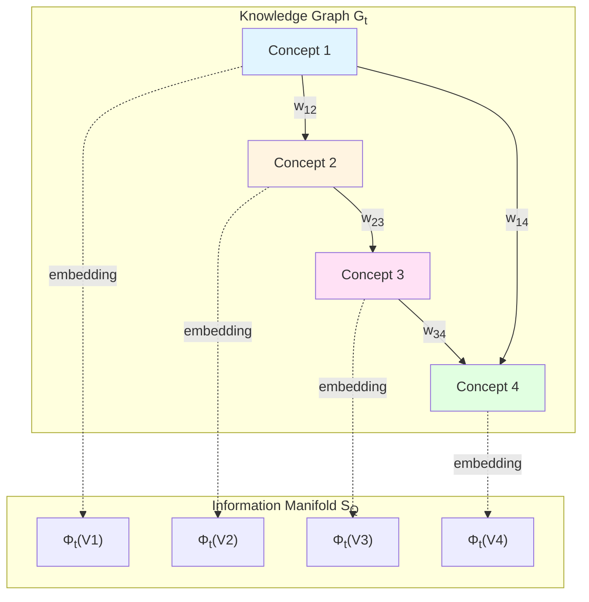
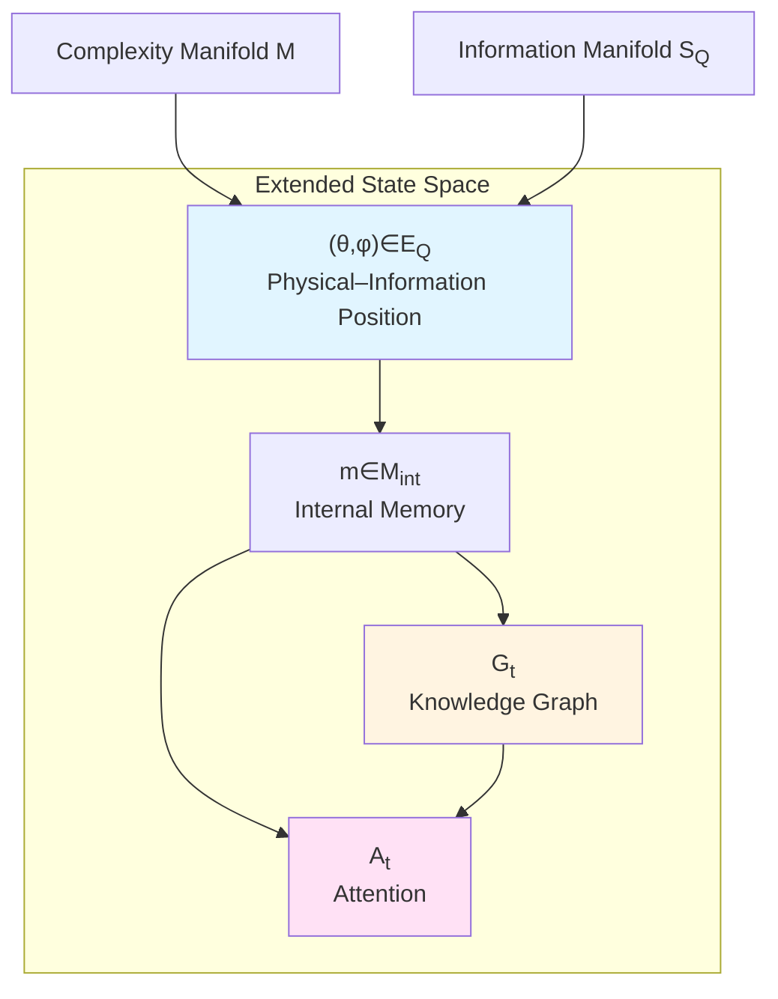
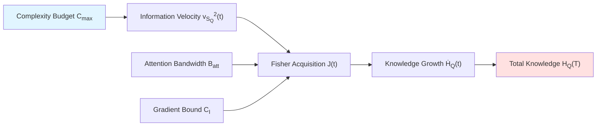
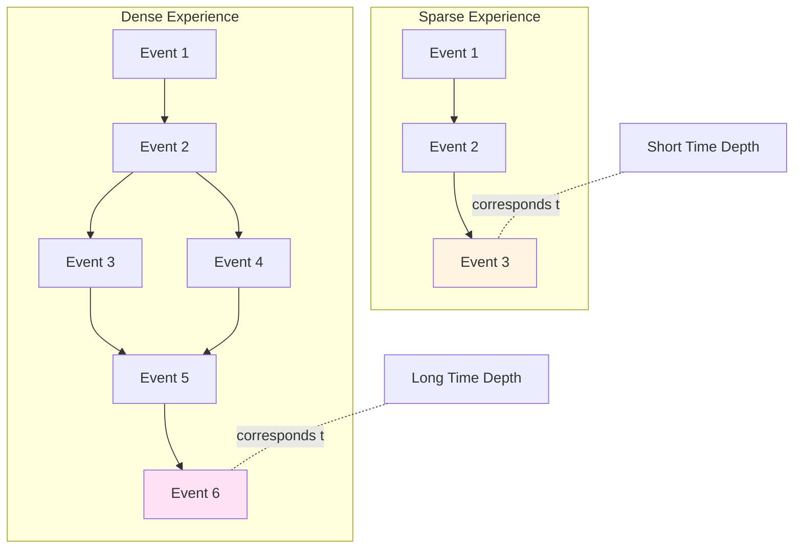

# Chapter 4: Attention–Time–Knowledge Graph—Information Accumulation Geometry of Time Selection

## Introduction: Time Scale of Attention

When you focus on reading in a crowded café, surrounding noise "disappears"; when you are highly alert in an emergency, time seems to "slow down"—both phenomena involve **how attention shapes time experience**.

In previous chapters, we established mathematical framework of observer sections: Observer accesses local information of universe through "slices" of worldline $(γ(τ), \mathcal{A}_{γ,Λ}(τ), ρ_{γ,Λ}(τ))$. But a key question remains unanswered: **How does observer choose "what to look at"?**

This chapter will construct unified theory of **attention–time–knowledge graph**, revealing:
- Attention is observer's **time-dependent weight distribution** on information manifold
- Time selection implements **geometric constraints of information accumulation** through attention operators
- Knowledge graph is **discrete skeleton** of information manifold, spectrally converging to true geometry in long-time limit

This theory transforms scarcity resource allocation problem in "attention economics" into **variational optimization problem on information geometry**.

### Core Insight: Triple Constraints of Information Accumulation

Imagine an explorer mapping unknown terrain:
1. **Attention Bandwidth**: He can only explore limited area each day (support of attention operator $A_t$)
2. **Complexity Budget**: Total length of walking path limited by physical strength (worldline length $C_{\max}$ on complexity manifold)
3. **Knowledge Graph**: Map he draws is discrete sampling points (nodes $V_t$) and paths (edges $E_t$), gradually approximating true terrain

This chapter will prove: **Under these triple constraints, information amount $H_Q(T)$ observer can accumulate has linear upper bound with complexity budget $C_{\max}$**, and **spectral dimension of knowledge graph converges to true dimension of information manifold in long-time limit**.

---

## Part One: Attention Operator—Observer's "Spotlight"

### 1.1 Dual Formalization of Attention

In computational universe framework $(X, \mathsf{T}, \mathsf{C}, \mathsf{I})$, observer cannot simultaneously access all configurations $x\in X$. **Attention** characterizes observer's "visible window" at each moment.

**Definition 1.1 (Discrete Attention Operator)**

At time step $k$, observer's attention operator is function:

$$
A_k : X \to [0,1]
$$

satisfying normalization:

$$
\sum_{x\in X} A_k(x) = 1
$$

or weak constraint $\sum_{x\in X} A_k(x) \le B_{\mathrm{att}}$ (total attention bandwidth).

Visible configuration subset defined as:

$$
X_k^{\mathrm{att}} = \{ x\in X : A_k(x) > 0 \}
$$

**Physical Picture**: $A_k(x)$ is weight observer allocates "cognitive resources" to configuration $x$. Like spotlight on stage, highlights certain regions, other regions in "shadow".

**Definition 1.2 (Continuous Attention Density)**

On task information manifold $(\mathcal{S}_Q, g_Q)$, attention can be represented as probability density:

$$
\rho_t(\phi) \ge 0, \quad \int_{\mathcal{S}_Q} \rho_t(\phi)\,d\mu_{g_Q}(\phi) = 1
$$

where $d\mu_{g_Q}=\sqrt{\det g_Q}\,d\phi$ is volume element.

### 1.2 Attention and Observer Internal State

Observer's attention determined by **internal memory state** $m_k\in M_{\mathrm{int}}$. Formalized as:

**Observer Object**:

$$
O = (M_{\mathrm{int}}, \Sigma_{\mathrm{obs}}, \Sigma_{\mathrm{act}}, \mathcal{P}, \mathcal{U})
$$

where:
- $M_{\mathrm{int}}$: Internal memory state space (finite or countable)
- $\Sigma_{\mathrm{obs}}$: Observation symbol space
- $\Sigma_{\mathrm{act}}$: Action space
- $\mathcal{P}: M_{\mathrm{int}} \to \Delta(\Sigma_{\mathrm{act}})$: Attention–observation strategy
- $\mathcal{U}: M_{\mathrm{int}} \times \Sigma_{\mathrm{obs}} \to M_{\mathrm{int}}$: Internal update operator

**Dynamics Loop**:

1. Observer in internal state $m_k$, universe in configuration $x_k$
2. According to strategy $\mathcal{P}(m_k)$ select action $a_k$ (decide "where to look")
3. Universe returns observation symbol $o_k\sim p(o|x_k, a_k)$
4. Update internal state $m_{k+1} = \mathcal{U}(m_k, o_k)$

Attention operator $A_k$ jointly determined by $\mathcal{P}(m_k)$ and current orbit position $(x_k, \phi_k)$.

**Analogy**: Imagine a miner with headlamp exploring dark cave. His "memory map" $m_k$ tells him "where explored", his "decision strategy" $\mathcal{P}$ tells him "which direction to shine headlamp next", each observation $o_k$ updates map $m_{k+1}$.

### 1.3 Resource Constraints of Attention

**Constraint 1 (Bandwidth Constraint)**:

$$
\int_{\mathcal{S}_Q} \rho_t(\phi)\,d\mu_{g_Q}(\phi) = 1
$$

Normalization condition means total attention conserved—focusing somewhere necessarily ignores elsewhere.

**Constraint 2 (Second Moment Constraint)**:

$$
\int_{\mathcal{S}_Q} \rho_t(\phi)\,d_{\mathcal{S}_Q}^2(\phi, \bar{\phi})\,d\mu_{g_Q}(\phi) \le B_{\mathrm{att}}
$$

For fixed reference point $\bar{\phi}$, "spatial dispersion" of attention bounded. This prevents attention over-dispersed (cannot focus) or over-concentrated (narrow field of view).

**Physical Analogy**: In quantum mechanics, wave function normalization $\int|\psi|^2=1$ corresponds to probability conservation; here normalization of $\rho_t$ corresponds to "total cognitive resource conservation". Second moment constraint similar to Heisenberg uncertainty principle: Cannot simultaneously achieve "high focus" and "wide coverage".

---

## Part Two: Knowledge Graph—Discrete Skeleton of Information Manifold

### 2.1 Four-Tuple Definition of Knowledge Graph

Observer cannot access all points of information manifold $\mathcal{S}_Q$ through finite-time exploration. Knowledge representation he constructs is **discrete graph**:

**Definition 2.1 (Knowledge Graph at Time $t$)**

$$
\mathcal{G}_t = (V_t, E_t, w_t, \Phi_t)
$$

where:
1. $V_t$: Finite node set, each node represents a "concept" or "abstract state"
2. $E_t \subset V_t \times V_t$: Directed or undirected edge set, represents relationships between concepts (causal, implication, similarity, etc.)
3. $w_t: E_t \to (0, \infty)$: Edge weights, represent relationship strength
4. Embedding map $\Phi_t: V_t \to \mathcal{S}_Q$: Embeds each node to point in information manifold

**Physical Picture**: Knowledge graph like "sampling points on map". Explorer cannot measure every inch of terrain, can only stake at key positions (nodes $V_t$), mark paths (edges $E_t$), record relative positions (embedding $\Phi_t$).

### 2.2 Graph Laplace Operator and Spectral Structure

Define **graph Laplace operator** on knowledge graph:

$$
(\Delta_t f)(v) = \sum_{u\sim v} w_t(v,u)\big(f(u) - f(v)\big)
$$

for any function $f: V_t \to \mathbb{R}$. This is discrete version of Laplace–Beltrami operator.

**Spectral Properties**:
- Eigenvalues $0 = \lambda_1^{(t)} \le \lambda_2^{(t)} \le \cdots \le \lambda_{|V_t|}^{(t)}$
- Smallest nonzero eigenvalue $\lambda_2^{(t)}$ (Fiedler value) characterizes graph's "connectivity"
- Distribution of large eigenvalues characterizes graph's "local geometry"

**Definition 2.2 (Spectral Dimension of Knowledge Graph)**

$$
d_{\mathrm{spec}}(t) = -2 \lim_{\varepsilon\downarrow 0} \frac{\log \mathrm{Tr}\,\exp(\varepsilon\Delta_t)}{\log\varepsilon}
$$

if this limit exists. $d_{\mathrm{spec}}(t)$ describes graph's "effective dimension" at small scales.

### 2.3 Spectral Approximation: From Discrete to Continuous

**Key Question**: To what extent does knowledge graph $\mathcal{G}_t$ "faithfully" represent information manifold $\mathcal{S}_Q$?

**Definition 2.3 (Spectral Approximation Condition)**

Say $\mathcal{G}_t$ spectrally approximates $(\mathcal{S}_Q, g_Q)$ if:
1. Embedding points $\Phi_t(V_t)$ become dense in $\mathcal{S}_Q$ as $t\to\infty$
2. Kernel weights constructed from embedding:

$$
w_t(v,u) = \eta_t^{-d} K\left(\frac{d_{\mathcal{S}_Q}(\Phi_t(v), \Phi_t(u))}{\eta_t}\right)
$$

makes graph Laplace $\Delta_t$ $\Gamma$-converge to continuous Laplace–Beltrami operator $\Delta_{g_Q}$ under appropriate scaling.

**Theorem 2.1 (Spectral Dimension Convergence)**

If $\mathcal{G}_t$ spectrally approximates $(\mathcal{S}_Q, g_Q)$, and local information dimension $d_{\mathrm{info},Q}$ of information manifold is constant on compact region $K$, then:

$$
\lim_{t\to\infty} d_{\mathrm{spec}}(t) = d_{\mathrm{info},Q}
$$

**Meaning**: In long-term learning process, spectral dimension of observer's knowledge graph tends to true dimension of information manifold, meaning **knowledge graph gradually becomes high-fidelity skeleton of information manifold geometrically**.

**Analogy**: Imagine approximating sphere with triangular mesh. As number of mesh nodes increases and spacing shrinks, spectrum of discrete Laplace operator approximates spectrum of continuous Laplace operator on sphere (corresponding to spherical harmonics). Here, observer's knowledge graph plays role of "triangular mesh".

---

## Part Three: Extended Worldline—Joint Dynamics of Attention and Knowledge

### 3.1 Joint State Space of Observer–Universe

In previous chapters, we defined observer's worldline on joint manifold $\mathcal{E}_Q = \mathcal{M} \times \mathcal{S}_Q$:

$$
z(t) = (\theta(t), \phi(t))
$$

where $\theta(t)\in\mathcal{M}$ is control manifold coordinate, $\phi(t)\in\mathcal{S}_Q$ is information manifold coordinate.

Now introduce **extended worldline**, including internal state, knowledge graph, and attention:

**Definition 3.1 (Extended Worldline)**

$$
\widehat{z}(t) = (\theta(t), \phi(t), m(t), \mathcal{G}_t, A_t)
$$

where:
- $(\theta(t), \phi(t))\in\mathcal{E}_Q$: Control–information state
- $m(t)\in M_{\mathrm{int}}$: Internal memory state
- $\mathcal{G}_t = (V_t, E_t, w_t, \Phi_t)$: Knowledge graph
- $A_t$ or $\rho_t$: Attention operator

### 3.2 Observation–Computation Action

On basis of time–information–complexity joint action $\mathcal{A}_Q$, add observer internal cost:

**Definition 3.2 (Observer–Computation Joint Action)**

$$
\widehat{\mathcal{A}}_Q[\widehat{z}(\cdot)] = \int_0^T \Big( K_{\mathrm{comp}}(t) + K_{\mathrm{info}}(t) - \gamma U_Q(\phi(t)) + R_{\mathrm{KG}}(t) + R_{\mathrm{att}}(t) \Big)\,dt
$$

where:

1. **Complexity Kinetic Energy**:

$$
K_{\mathrm{comp}}(t) = \tfrac{1}{2}\alpha^2 G_{ab}(\theta)\dot{\theta}^a\dot{\theta}^b
$$

2. **Information Kinetic Energy**:

$$
K_{\mathrm{info}}(t) = \tfrac{1}{2}\beta^2 g_{ij}(\phi)\dot{\phi}^i\dot{\phi}^j
$$

3. **Knowledge Potential Energy**:

$$
U_Q(\phi) = I_Q(\phi)
$$

where $I_Q(\phi)$ is task information quality function (like relative entropy, mutual information).

4. **Knowledge Graph Update Cost**:

$$
R_{\mathrm{KG}}(t) = \lambda_{\mathrm{KG}}\,\mathsf{D}(\mathcal{G}_{t+dt}, \mathcal{G}_t)
$$

where $\mathsf{D}$ is distance between graphs (like spectral distance, Gromov–Wasserstein distance).

5. **Attention Configuration Cost**:

$$
R_{\mathrm{att}}(t) = \lambda_{\mathrm{att}}\,\mathsf{C}_{\mathrm{att}}(A_t)
$$

For example entropy regularization $\mathsf{C}_{\mathrm{att}}(\rho_t) = -\int \rho_t\log\rho_t\,d\mu_{g_Q}$, or bandwidth constraint.

**Physical Interpretation**:
- First three terms: Previous time–information–complexity variational
- $R_{\mathrm{KG}}$: Frequently updating knowledge graph (adding new nodes, adjusting edge weights) requires "cognitive cost"
- $R_{\mathrm{att}}$: Changing attention configuration (like switching focus region) requires "switching cost"

### 3.3 Euler–Lagrange Conditions and Optimal Strategy

Minimizing $\widehat{\mathcal{A}}_Q$ gives optimal observation–computation–learning strategy. Formally:

$$
\frac{\delta \widehat{\mathcal{A}}_Q}{\delta \theta} = 0, \quad \frac{\delta \widehat{\mathcal{A}}_Q}{\delta \phi} = 0, \quad \frac{\delta \widehat{\mathcal{A}}_Q}{\delta \mathcal{G}_t} = 0, \quad \frac{\delta \widehat{\mathcal{A}}_Q}{\delta A_t} = 0
$$

First two equations give geodesic equations for control–information coordinates; last two give:

**Optimal Knowledge Graph Update**: At each moment, balance "information gain" with "graph update cost", choose optimal node addition/edge adjustment strategy.

**Optimal Attention Configuration**: Under given bandwidth constraint, choose attention distribution $\rho_t^*$ maximizing short-term information gain.

**Analogy**: Like mountaineer planning route under limited physical strength and time. He needs to balance:
- Walking fast (small complexity kinetic energy) vs reaching high-value regions (low information potential energy)
- Frequently updating map (high $R_{\mathrm{KG}}$) vs using rough map (low $R_{\mathrm{KG}}$)
- Wide scanning (high $R_{\mathrm{att}}$) vs focusing locally (low $R_{\mathrm{att}}$)

---

## Part Four: Information Accumulation Inequality—Upper Bound Under Resource Constraints

### 4.1 Measure of Knowledge Amount

Define observer's **knowledge amount** for task $Q$:

$$
H_Q(t) = \sum_{v\in V_t} \pi_t(v)\,I_Q(\Phi_t(v))
$$

where $\pi_t$ is weight distribution on knowledge graph nodes (like visit frequency, importance score).

**Information Accumulation Rate**:

$$
\dot{H}_Q(t) = \frac{d}{dt} H_Q(t)
$$

**Physical Meaning**: $H_Q(t)$ measures how much observer "knows" about task $Q$. $\dot{H}_Q(t)$ measures "learning speed".

### 4.2 Fisher Information Acquisition Rate

Assume observer samples information manifold through attention density $\rho_t(\phi)$, its single-step **Fisher information acquisition rate**:

$$
J(t) = \int_{\mathcal{S}_Q} \rho_t(\phi)\,|\nabla I_Q(\phi)|_{g_Q}^2\,d\mu_{g_Q}(\phi)
$$

**Meaning**: $J(t)$ characterizes "expected squared gradient of information quality function $I_Q$ under current attention configuration"—equivalent to "steepness of current learning direction".

In complexity–information joint geometry, $J(t)$ and information kinetic energy $v_{\mathcal{S}_Q}^2(t)$ related through Lipschitz relation:

$$
J(t) \lesssim L_I^2 v_{\mathcal{S}_Q}^2(t)
$$

where $L_I$ is Lipschitz constant of $I_Q$.

### 4.3 Information Accumulation Inequality

**Theorem 4.1 (Observer Information Accumulation Upper Bound)**

Assume:
1. Task information quality function $I_Q$ Lipschitz on $\mathcal{S}_Q$, gradient bounded:

$$
|\nabla I_Q(\phi)|_{g_Q} \le C_I, \quad \forall \phi\in\mathcal{S}_Q
$$

2. Second moment of attention density $\rho_t$ bounded:

$$
\int_{\mathcal{S}_Q} \rho_t(\phi)\,d_{\mathcal{S}_Q}^2(\phi, \bar{\phi})\,d\mu_{g_Q}(\phi) \le B_{\mathrm{att}}
$$

3. Observer's complexity budget:

$$
C_{\max} = \int_0^T \sqrt{G_{ab}(\theta(t))\dot{\theta}^a\dot{\theta}^b}\,dt
$$

Then exists constant $K>0$ (only depends on $C_I, B_{\mathrm{att}}$ and geometric structure), such that:

$$
\boxed{H_Q(T) - H_Q(0) \le K\,C_{\max}}
$$

**Proof Sketch**:

Differentiate $H_Q(t)$:

$$
\dot{H}_Q(t) = \sum_{v\in V_t} \dot{\pi}_t(v)\,I_Q(\Phi_t(v)) + \sum_{v\in V_t} \pi_t(v)\,\nabla I_Q(\Phi_t(v))\cdot\dot{\Phi}_t(v)
$$

Second term estimated using Cauchy–Schwarz inequality:

$$
\left|\sum_{v} \pi_t(v)\,\nabla I_Q(\Phi_t(v))\cdot\dot{\Phi}_t(v)\right| \le C_I \sqrt{B_{\mathrm{att}}} \sqrt{v_{\mathcal{S}_Q}^2(t)}
$$

In joint action, $v_{\mathcal{S}_Q}^2(t)$ and $v_{\mathcal{M}}^2(t)$ coupled through weights $\alpha, \beta$. Using variational optimality, can prove:

$$
\int_0^T \sqrt{v_{\mathcal{S}_Q}^2(t)}\,dt \le K_2 C_{\max}
$$

Thus:

$$
H_Q(T) - H_Q(0) \le \int_0^T |\dot{H}_Q(t)|\,dt \le K\,C_{\max}
$$

**Physical Meaning**:
- Information accumulation amount has **linear upper bound** with complexity resources
- Attention bandwidth $B_{\mathrm{att}}$ and gradient bound $C_I$ only change proportionality constant $K$, don't change linear form
- This is geometric expression of "cognitive resource scarcity": **Unlimited learning impossible, information acquisition rate constrained by physics**

**Analogy**: Like drawing water from river with bucket. Bucket size ($B_{\mathrm{att}}$), river flow speed ($C_I$), walking speed ($v_{\mathcal{M}}$) together determine water amount per unit time. But no matter how optimized, total water amount cannot exceed "total walking distance" ($C_{\max}$) times some constant.

### 4.4 Optimality Conditions for Time Selection

From information accumulation inequality can derive **optimal strategy for time selection**:

**Corollary 4.2 (Optimal Attention Configuration)**

Under fixed complexity budget $C_{\max}$ and time window $[0,T]$, attention strategy $\rho_t^*$ maximizing $H_Q(T)$ satisfies:

$$
\rho_t^*(\phi) \propto |\nabla I_Q(\phi)|_{g_Q}^2 \exp\left(-\frac{d_{\mathcal{S}_Q}^2(\phi, \phi_t^*)}{2\sigma_t^2}\right)
$$

where $\phi_t^*=\phi(t)$ is current orbit position, $\sigma_t^2$ is temperature parameter (determined by bandwidth constraint $B_{\mathrm{att}}$).

**Meaning**: Optimal attention is combination of "squared gradient weighting" and "distance penalty":
- Prioritize regions with large information gradient ("learning boundary")
- But cannot be too far from current position (limited by attention bandwidth)

**Physical Analogy**: In quantum mechanics, choice of measurement operator affects information acquisition rate (Cramér–Rao lower bound); in classical information theory, communication channel capacity limits information transmission rate. Here, attention operator plays role of "measurement operator" or "channel", optimizing information flow under geometric constraints.

---

## Part Five: Time Sense and Attention Modulation

### 5.1 From Fisher Information to Subjective Duration

Recall subjective duration definition from Chapter 3:

$$
t_{\mathrm{subj}}(\tau) = \int_0^\tau (F_Q^A(t))^{-1/2}\,dt
$$

where $F_Q^A$ is local quantum Fisher information. Now, connect it with attention operator:

**Proposition 5.1 (Attention-Modulated Subjective Duration)**

If observer's quantum Fisher information and attention bandwidth satisfy:

$$
F_Q^A(t) \propto \frac{1}{B_{\mathrm{att}}(t)}
$$

(larger bandwidth, lower discriminability), then subjective duration can be written as:

$$
t_{\mathrm{subj}}(\tau) \approx \int_0^\tau \sqrt{B_{\mathrm{att}}(t)}\,dt
$$

**Meaning**: **Attention dispersion ($B_{\mathrm{att}}$ large) causes subjective duration extension**.

**Experimental Prediction**:
- In multi-task situations (attention dispersed across multiple objects), time experience "slows"
- In single-focus tasks (attention concentrated on single object), time experience "speeds"

This consistent with classic "attention–time distortion" phenomenon: Complex tasks make time "pass slow", simple repetitive tasks make time "pass fast".

### 5.2 Knowledge Graph and Time Depth

**Time depth** concept: Observer's perception of "how far past", can be characterized by **path length** of knowledge graph.

**Definition 5.1 (Time Depth)**

On knowledge graph $\mathcal{G}_t$, shortest path length from current concept node $v_{\mathrm{now}}$ back to "origin" node $v_0$:

$$
D_{\mathrm{time}}(t) = \min_{v_0\in V_0} d_{\mathcal{G}_t}(v_{\mathrm{now}}, v_0)
$$

where $d_{\mathcal{G}_t}$ is geodesic distance on graph.

**Proposition 5.2 (Time Depth Growth Law)**

Under spectral approximation condition, growth rate of time depth consistent with growth rate of geodesic distance on information manifold:

$$
\frac{dD_{\mathrm{time}}}{dt} \sim \sqrt{v_{\mathcal{S}_Q}^2(t)}
$$

**Meaning**: **Observer "walking fast" on information manifold, time depth of knowledge graph also grows fast**—this corresponds to phenomenon "information-dense experience causes time experience extension".

**Analogy**: Imagine a memoir. Relationships between chapters (nodes) (edges) constitute "memory graph". Path length from "starting point" to "now" is psychological measure of "feeling how long passed". Dense experiences (high $v_{\mathcal{S}_Q}$) make memoir "length" grow faster.

---

## Part Six: Engineering Path—Attention Tracking and Knowledge Graph Visualization

### 6.1 Eye Movement Tracking and Attention Estimation

**Experimental Design**:
1. Present visual stimuli (like complex images, text paragraphs)
2. Record eye movement trajectory $(x_{\mathrm{gaze}}(t), y_{\mathrm{gaze}}(t))$ and fixation duration $t_{\mathrm{fixation}}$
3. Construct **spatial attention heatmap**:

$$
A_{\mathrm{spatial}}(x,y) = \sum_{i} t_{\mathrm{fixation},i}\,\delta(x - x_i, y - y_i)
$$

4. Map to information manifold: If image pixel $(x,y)$ corresponds to feature vector $\phi(x,y)\in\mathcal{S}_Q$, then:

$$
\rho_t(\phi) = \int A_{\mathrm{spatial}}(x,y)\,\delta(\phi - \phi(x,y))\,dxdy
$$

**Verify Predictions**:
- Test if $\rho_t^*$ concentrates on regions with large $|\nabla I_Q|$ (high information gradient)
- Test relationship between attention bandwidth $B_{\mathrm{att}}$ and task complexity

### 6.2 Neural Embedding of Concept Graph

**Method**:
1. Collect subject's **semantic association network**: Given concept word $v_i$, require listing related concepts $v_j$, assign similarity score $w_{ij}$
2. Construct knowledge graph $\mathcal{G} = (V, E, w, \Phi)$, where $V$ is concept set, $E$ is association relations
3. Use **graph embedding algorithms** (like Node2Vec, GCN) to learn embedding $\Phi: V \to \mathbb{R}^d$
4. Calculate graph Laplace spectrum $\{\lambda_i\}$ and heat kernel trace $\mathrm{Tr}\,\exp(\varepsilon\Delta)$
5. Estimate spectral dimension $d_{\mathrm{spec}}$

**Verify Theorem 2.1**:
- Compare $d_{\mathrm{spec}}(t)$ of subjects (different learning stages)
- Expectation: After long-term learning, $d_{\mathrm{spec}}(t)$ tends to true dimension of task information manifold

### 6.3 Active Learning and Information Accumulation

**Algorithm Framework**:
1. Initialize knowledge graph $\mathcal{G}_0$ and attention $\rho_0$
2. At each time step $t$:
   - According to current $\mathcal{G}_t, \rho_t$ select query action $a_t$ (active sampling)
   - Observe result $o_t$, update internal state $m_{t+1} = \mathcal{U}(m_t, o_t)$
   - Update knowledge graph $\mathcal{G}_{t+1}$ (add nodes/adjust edge weights)
   - Update attention $\rho_{t+1}$ (reallocate according to information gain)
3. Record information accumulation curve $H_Q(t)$ and complexity consumption $C(t)$

**Verify Theorem 4.1**:
- Test if $H_Q(T)$ has linear relationship with $C(T)$
- Estimate proportionality constant $K$ and dependence on attention bandwidth $B_{\mathrm{att}}$

### 6.4 Cross-Modal Knowledge Graph

**Extension**: In multi-modal tasks (vision+language+auditory), nodes of knowledge graph from different modalities:

$$
V_t = V_t^{\mathrm{vis}} \cup V_t^{\mathrm{lang}} \cup V_t^{\mathrm{aud}}
$$

Cross-modal edges $E_t^{\mathrm{cross}}$ connect concepts from different modalities (like image "dog"$\leftrightarrow$ word "dog").

**Embedding Alignment**:
- Visual features $\phi^{\mathrm{vis}}\in\mathcal{S}_Q^{\mathrm{vis}}$
- Language features $\phi^{\mathrm{lang}}\in\mathcal{S}_Q^{\mathrm{lang}}$
- Cross-modal mapping $f: \mathcal{S}_Q^{\mathrm{vis}} \to \mathcal{S}_Q^{\mathrm{lang}}$ (like CLIP model)

**Research Question**: How does spectral dimension of cross-modal knowledge graph relate to dimensions of individual single-modal manifolds?

---

## Part Seven: Dialogue with Existing Theories

### 7.1 Attention Economics

**Classic Theory** (Simon, 1971; Kahneman, 1973):
- Attention is scarce resource, needs allocation across multiple tasks
- Dual-task interference measures attention capacity

**Extension of This Theory**:
- Geometricize "attention capacity" as bandwidth constraint $B_{\mathrm{att}}$
- Express "task interference" as spatial separation of multiple high-gradient regions on information manifold
- Provide quantitative bridge from geometric constraints to behavioral predictions

### 7.2 Manifold Learning and Representation Learning

**Classic Theory** (Tenenbaum, 2000; Belkin & Niyogi, 2003):
- High-dimensional data embedded in low-dimensional manifold
- Graph Laplace converges to manifold Laplace

**Innovation of This Theory**:
- Interpret "data manifold" as "task information manifold" $\mathcal{S}_Q$
- Formalize "learner" as observer object with limited memory
- Graph convergence theorem (Theorem 2.1) gives geometric guarantee of "cognitive convergence"

### 7.3 Active Inference and Bayesian Brain

**Classic Theory** (Friston, 2010; Active Inference):
- Brain minimizes "free energy" (variational lower bound)
- Action selection minimizes prediction error

**Connection of This Theory**:
- Joint action $\widehat{\mathcal{A}}_Q$ can be viewed as "generalized free energy"
- Attention operator $\rho_t$ corresponds to "precision weighting"
- Knowledge graph update corresponds to implementation of "Bayesian filtering" on discrete graph

### 7.4 Scalar Expectancy Theory of Time Perception

**Classic Theory** (Scalar Expectancy Theory, Gibbon, 1977):
- Internal clock model: Pacemaker–switch–accumulator
- Attention modulates switch

**Geometric Reconstruction of This Theory**:
- "Pacemaker frequency"$\leftrightarrow$ $\sqrt{F_Q^A}$ (square root of quantum Fisher information)
- "Accumulator"$\leftrightarrow$ subjective duration integral $t_{\mathrm{subj}}$
- "Attention switch"$\leftrightarrow$ attention bandwidth $B_{\mathrm{att}}$ modulates $F_Q^A$

---

## Part Eight: Discussion—Geometric Constraints of Cognitive Resources and Emergent Intelligence

### 8.1 Applicability Domain and Assumption Strength

**Lipschitz and Bounded Gradient Assumption**:
- Lipschitz property of information quality function $I_Q$ guarantees linear upper bound of information accumulation inequality
- In practice, $I_Q$ may have singular points (like phase transition boundaries)
- Need localization or regularization

**Spectral Approximation Assumption**:
- Knowledge graph $\mathcal{G}_t$ spectrally approximating information manifold requires long-time limit $t\to\infty$
- In finite time, spectral dimension $d_{\mathrm{spec}}(t)$ may oscillate or deviate
- Need introduce quantitative estimate of "approximation rate"

**Finite Memory Assumption**:
- Finite internal state space $M_{\mathrm{int}}$ limits observer's "working memory capacity"
- Actual cognitive systems may have hierarchical memory (short-term vs long-term)
- Need extend to multi-scale memory model

### 8.2 Tightness of Information Accumulation Upper Bound

**Question**: Is upper bound $H_Q(T)\le K C_{\max}$ given by Theorem 4.1 tight?

**Analysis**:
- Under "uniform exploration" strategy ($\rho_t$ constant distribution), upper bound nearly achieved
- Under "greedy exploration" strategy ($\rho_t$ concentrated on current optimum), upper bound may be loose
- Optimal strategy (Corollary 4.2) can achieve asymptotic tightness of upper bound in some cases

**Engineering Meaning**: Tight upper bound means "cannot break through linear growth rate by optimizing attention strategy"—this is fundamental limitation of cognitive resource scarcity.

### 8.3 From Single Observer to Multi-Observer

This chapter focuses on single observer. In Chapter 6 will extend to multi-observer consensus geometry, where:
- Knowledge graphs $\mathcal{G}_t^{(i)}$ heterogeneous across observers
- Attention $\rho_t^{(i)}$ influenced by social network topology
- Consensus energy $\mathcal{E}_{\mathrm{cons}}$ couples individual knowledge graphs

**Expected Phenomena**:
- Spectral convergence speed of knowledge graph positively correlated with connectivity of social network
- Joint information accumulation of multi-observer can break through linear upper bound of single observer ("collective intelligence" emergence)

### 8.4 Time Selection and Free Will

**Philosophical Question**: Does observer "freely choose" attention configuration?

**Answer of This Theory**:
- Attention operator $A_t$ determined by internal state $m_t$ and strategy $\mathcal{P}$—this is "deterministic"
- But strategy $\mathcal{P}$ itself may be "emergent" (optimized from long-term learning)
- "Free will" can be understood as "freedom of choice in optimal strategy space under geometric constraints"

In Chapter 5 will deeply explore Empowerment (causal control) $\mathcal{E}_T$, giving geometric characterization of free will.

---

## Conclusion: Geometric Characterization of Attention and Information-Theoretic Foundation of Time Selection

This chapter constructed unified theory of attention–time–knowledge graph, transforming classic psychological concept of "cognitive resource scarcity" into strict theorem on information geometry.

**Core Results Review**:

1. **Attention Operator Formalization**: $A_t: X \to [0,1]$ or $\rho_t(\phi)$ on information manifold, limited by bandwidth constraint $B_{\mathrm{att}}$

2. **Knowledge Graph Spectral Convergence** (Theorem 2.1):

$$
\lim_{t\to\infty} d_{\mathrm{spec}}(t) = d_{\mathrm{info},Q}
$$

Observer's knowledge graph spectrally approximates true geometry of information manifold in long-time limit.

3. **Information Accumulation Upper Bound** (Theorem 4.1):

$$
H_Q(T) - H_Q(0) \le K\,C_{\max}
$$

Under complexity budget and attention bandwidth constraints, information acquisition amount has linear upper bound with physical resources.

4. **Optimal Attention Strategy** (Corollary 4.2):

$$
\rho_t^*(\phi) \propto |\nabla I_Q(\phi)|_{g_Q}^2 \exp\left(-\frac{d_{\mathcal{S}_Q}^2(\phi, \phi_t)}{2\sigma_t^2}\right)
$$

Optimal attention concentrates on regions with large information gradient and close to current position.

**Engineering Path**:
- Eye movement tracking$\rightarrow$ spatial attention heatmap$\rightarrow$ information manifold embedding
- Semantic association network$\rightarrow$ knowledge graph$\rightarrow$ spectral dimension estimation
- Active learning algorithm$\rightarrow$ information accumulation curve$\rightarrow$ upper bound verification

**Philosophical Significance**:
- Attention not "arbitrary choice", but optimization process under geometric constraints
- Time selection ("what to look at"+"how long to look") determines information accumulation path
- Knowledge graph "approximates truth" (spectral convergence) in long-term learning, but can never "fully arrive" due to cognitive resource limitations

Next chapter (Chapter 5) will explore **geometric characterization of free will**, introducing Empowerment $\mathcal{E}_T$ as measure of "causal control", revealing deep connection between "freedom of choice" and "information geometry".

---

## References

### Attention Theory
- Simon, H. A. (1971). Designing organizations for an information-rich world. In *Computers, Communications, and the Public Interest* (pp. 37-72).
- Kahneman, D. (1973). *Attention and Effort*. Prentice-Hall.
- Posner, M. I., & Petersen, S. E. (1990). The attention system of the human brain. *Annual Review of Neuroscience*, 13(1), 25-42.

### Manifold Learning
- Tenenbaum, J. B., de Silva, V., & Langford, J. C. (2000). A global geometric framework for nonlinear dimensionality reduction. *Science*, 290(5500), 2319-2323.
- Belkin, M., & Niyogi, P. (2003). Laplacian eigenmaps for dimensionality reduction and data representation. *Neural Computation*, 15(6), 1373-1396.

### Graph Geometry
- Chung, F. R. (1997). *Spectral Graph Theory*. AMS.
- von Luxburg, U. (2007). A tutorial on spectral clustering. *Statistics and Computing*, 17(4), 395-416.

### Active Inference
- Friston, K. (2010). The free-energy principle: a unified brain theory? *Nature Reviews Neuroscience*, 11(2), 127-138.
- Parr, T., & Friston, K. J. (2019). Generalised free energy and active inference. *Biological Cybernetics*, 113(5-6), 495-513.

### Knowledge Representation
- Collins, A. M., & Loftus, E. F. (1975). A spreading-activation theory of semantic processing. *Psychological Review*, 82(6), 407.
- Borge-Holthoefer, J., & Arenas, A. (2010). Semantic networks: Structure and dynamics. *Entropy*, 12(5), 1264-1302.

### Time Perception
- Gibbon, J. (1977). Scalar expectancy theory and Weber's law in animal timing. *Psychological Review*, 84(3), 279.
- Block, R. A., & Zakay, D. (1997). Prospective and retrospective duration judgments: A meta-analytic review. *Psychonomic Bulletin & Review*, 4(2), 184-197.

### This Collection
- This collection: *Observer–World Section Structure: Causality and Conditionalization* (Chapter 1)
- This collection: *Structural Definition of Consciousness: Five Conditions and Temporal Causality* (Chapter 2)
- This collection: *Entanglement–Time–Consciousness: Unified Delay Scale* (Chapter 3)
- This collection: *Unified Theory of Observer–Attention–Knowledge Graph in Computational Universe* (Source theory document)

