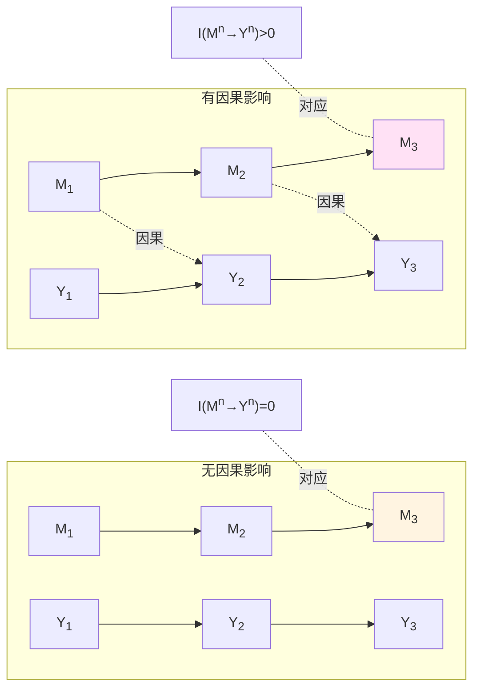
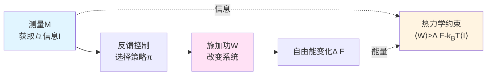
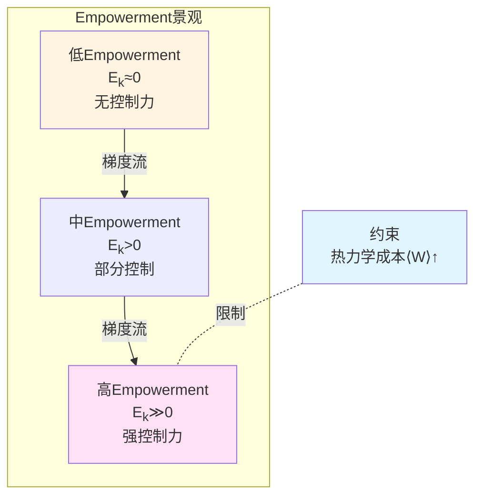
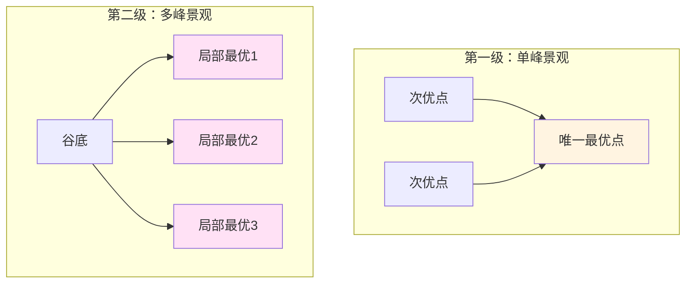

# 第5章 自由意志的几何刻画：Empowerment与因果控制力的信息论基础

## 引言：自由意志的千年困惑

**"我真的拥有自由意志吗？"**

这个问题困扰哲学家数千年。决定论者认为：宇宙是因果锁链，每个"选择"只是过去状态的必然结果——自由意志是幻觉。非决定论者反驳：量子不确定性、混沌动力学证明未来未定——自由意志有空间。

但这场辩论陷入僵局，因为缺少**可操作定义**：什么是"自由"？如何度量？如何检验？

本章将从信息几何与因果理论出发，给出自由意志的**可操作几何刻画**：

$$
\boxed{\text{自由意志} \equiv \text{因果控制力} \equiv \text{Empowerment\ } \mathcal{E}_T}
$$

其中$\mathcal{E}_T$定义为：

$$
\mathcal{E}_T(t) = \sup_\pi I(A_t : S_{t+T} \mid S_t)
$$

即"通过动作$A_t$对未来状态$S_{t+T}$施加因果影响的最大互信息"。

这一定义将抽象的"自由"概念，转化为**可测量、可优化、受物理约束**的几何量。

### 核心洞察：自由意志的三重约束

**物理基础定理**：观察者拥有可操作自由，当且仅当同时满足：

1. **可控性**：存在非退化干预通道$P(S'|do(A))$
2. **非平衡供给**：存在稳态自由能流$\langle W\rangle \ge \Delta F - k_BT\langle I\rangle$
3. **屏障分离**：存在马尔可夫毯$(M, A, S_{\mathrm{int}}, S_{\mathrm{ext}})$，使内部态对结果的影响可分辨

**意义**：自由意志不是"无因之因"，而是在**物理约束下的因果介入能力**——它需要能量、需要通道、需要信息，但在这些约束内，它是真实的、可测的。

---

## 第一部分：Empowerment——因果控制力的信息度量

### 1.1 从互信息到有向信息

**经典互信息**：

$$
I(X:Y) = H(Y) - H(Y|X) = D_{\mathrm{KL}}(p(x,y) \| p(x)p(y))
$$

度量两个随机变量的"相关性"，但**不区分因果方向**：$I(X:Y)=I(Y:X)$。

**有向信息**（Massey, 1990）：

对序列$M^n=(M_1,\ldots,M_n)$与$Y^n=(Y_1,\ldots,Y_n)$，定义：

$$
I(M^n\to Y^n) = \sum_{t=1}^{n} I(M^t : Y_t \mid Y^{t-1})
$$

其中$M^t=(M_1,\ldots,M_t)$，$Y^{t-1}=(Y_1,\ldots,Y_{t-1})$。

**意义**：$I(M^n\to Y^n)$度量"$M$对$Y$的因果影响累积量"——它**考虑时序**，区分因果方向。

**性质**：
- $I(M^n\to Y^n) \ne I(Y^n\to M^n)$（非对称）
- $I(M^n\to Y^n) = 0$当且仅当$Y_t \perp M^t \mid Y^{t-1}$对所有$t$成立（无因果影响）

### 1.2 Empowerment的定义与物理意义

**定义1.1（$k$-步Empowerment）**（Klyubin, Polani, Nehaniv, 2005）

在时刻$t$，观察者的$k$-步Empowerment定义为：

$$
\mathcal{E}_k(t) = \sup_{\pi} I(A_{t:t+k-1} : S_{t+k} \mid S_t)
$$

其中：
- $A_{t:t+k-1}=(A_t, A_{t+1},\ldots,A_{t+k-1})$为动作序列
- $S_t, S_{t+k}$为初始和终止感知状态
- $\sup_\pi$表示对所有可能的策略$\pi$取上确界

**物理意义**：
- $\mathcal{E}_k$度量"观察者通过$k$步动作，对未来状态施加可分辨影响的最大能力"
- 等价于"动作—传感通道容量"的上确界
- 当$\mathcal{E}_k=0$时，观察者的动作对未来状态无任何可检测影响——**完全无自由**

**比喻**：想象一个被关在密室的人。如果他推墙、喊叫、敲门都无法改变任何可观测的结果（墙不动、无人听到），则$\mathcal{E}_k=0$——他"无自由"。反之，若他推门能打开、喊叫能引来救援，则$\mathcal{E}_k>0$——他"有自由"。

### 1.3 Empowerment与因果干预

在Pearl因果框架中，**干预算子$do(A)$**表示"外部强制$A$取某值"，不同于条件化$p(Y|A)$。

**命题1.1（Empowerment与干预可分辨性）**

若存在$a, a'\in\mathcal{A}$使得：

$$
p(S_{t+k} \mid do(A_t=a), S_t) \ne p(S_{t+k} \mid do(A_t=a'), S_t)
$$

则$\mathcal{E}_k(t) > 0$。反之，若对所有$a, a'$上式均相等，则$\mathcal{E}_k(t)=0$。

**证明梗概**：干预可分辨$\Rightarrow$动作携带因果信息$\Rightarrow$ $I(A:S_{t+k}|S_t)>0$。$\square$

**意义**：**Empowerment正值是因果干预可检测的充要条件**。这将"自由意志"与Pearl因果理论桥接。

### 1.4 Empowerment的几何刻画

在控制流形$(\mathcal{M}, G)$上，Empowerment可以表示为信息几何上的曲率量：

**命题1.2（Empowerment的Fisher度量表示）**

在局部线性化近似下，$k$-步Empowerment可表为：

$$
\mathcal{E}_k(t) \approx \frac{1}{2}\log\det\left(I + \Sigma_A^{-1} J_T^\top J_T\right)
$$

其中：
- $J_T = \frac{\partial S_{t+T}}{\partial A_t}$为雅可比矩阵（因果敏感度）
- $\Sigma_A$为动作空间的协方差
- $I$为单位矩阵

**意义**：Empowerment与"因果敏感度矩阵"的行列式对数成正比——**几何上，它测量"动作空间到状态空间的局域体积放大率"**。

**比喻**：想象一个操纵杆控制机器人。若轻微移动操纵杆，机器人位置大幅变化，则雅可比$J_T$的奇异值大，Empowerment $\mathcal{E}_k$高——操纵者"有力量"。反之，若使劲推动操纵杆，机器人纹丝不动，则$J_T\approx 0$，$\mathcal{E}_k\approx 0$——操纵者"无力"。

---

## 第二部分：物理基础定理——自由意志的热力学约束

### 2.1 反馈热力学与信息—功对偶

**经典热力学第二定律**：

$$
\langle W\rangle \ge \Delta F
$$

即平均功至少等于自由能变化。

**带测量—反馈的广义第二定律**（Sagawa–Ueda, 2008）：

$$
\langle W\rangle \ge \Delta F - k_BT\langle I\rangle
$$

其中$I$为测量获取的互信息。

**意义**：**信息可以转化为功**——Maxwell妖不违反第二定律，但需要付出"擦除信息"的熵成本（Landauer原理）。

**反馈Jarzynski等式**：

$$
\left\langle \exp\left(-\beta W + \beta\Delta F - I\right)\right\rangle = 1
$$

这是概率1的恒等式，比不等式更强。

### 2.2 马尔可夫毯与屏障分离

**定义2.1（马尔可夫毯）**（Pearl, 2000; Friston, 2010）

对随机变量集合$(S_{\mathrm{int}}, S_{\mathrm{ext}}, A, M)$，称$(A, M)$为$S_{\mathrm{int}}$相对于$S_{\mathrm{ext}}$的马尔可夫毯，若：

$$
S_{\mathrm{int}} \perp S_{\mathrm{ext}} \mid (A, M)
$$

即内部态与外部态在毯上条件独立。

**物理意义**：
- $S_{\mathrm{int}}$：观察者内部状态（如神经活动、记忆）
- $S_{\mathrm{ext}}$：外部环境状态
- $A$：动作（输出）
- $M$：观测（输入）

马尔可夫毯$(A, M)$是"系统边界"——内外交互必须通过这一边界。

**命题2.1（屏障分离条件）**

若存在马尔可夫毯，且：

$$
I(S_{\mathrm{int}} : S_{\mathrm{ext}} \mid A) > 0
$$

则动作$A$携带内部态对外部态的可分辨因果信息。

**意义**：马尔可夫毯不能"完全阻断"因果流——否则内部态的变化对外部态无任何影响，Empowerment为零。

### 2.3 物理基础定理

**定理2.1（自由意志的物理基础）**

观察者在时域$[0,T]$上拥有可操作自由，当且仅当同时满足：

**(i) 可控性**：存在非退化干预通道$P(S_{t+1} \mid A_t, S_t)$，即：

$$
\exists a, a' \in \mathcal{A},\quad P(S_{t+1} \mid do(A_t=a), S_t) \ne P(S_{t+1} \mid do(A_t=a'), S_t)
$$

**(ii) 非平衡供给**：存在持续的自由能流或熵流，满足：

$$
\langle W\rangle \ge \Delta F - k_BT\langle I\rangle > 0
$$

即系统非处于热平衡态。

**(iii) 屏障分离**：存在马尔可夫毯$(A, M, S_{\mathrm{int}}, S_{\mathrm{ext}})$，使内部态对外部态的因果影响可通过动作$A$检测：

$$
I(S_{\mathrm{int}} : S_{\mathrm{ext}} \mid A, M) > 0
$$

则存在策略$\pi$使：

$$
I(M^T \to S^T) > 0, \quad \mathcal{E}_k > 0
$$

并受热力学不等式$\langle W\rangle \ge \Delta F - k_BT\langle I\rangle$约束。

**证明思路**：

1. **可控性 $\Rightarrow$ Empowerment正**：非退化通道保证$\sup_\pi I(A:S_{t+k}|S_t)>0$（通道容量非零）

2. **屏障分离 $\Rightarrow$ 有向信息正**：马尔可夫毯允许$P(S_{\mathrm{ext}}|do(A))\ne P(S_{\mathrm{ext}})$，因此$I(M^T\to S^T)>0$（Massey有向信息）

3. **非平衡供给 $\Rightarrow$ 热力学可行**：Sagawa–Ueda反馈Jarzynski等式保证功—信息对偶一致性

$\square$

**意义**：这一定理将"自由意志"从哲学概念，转化为**三个可操作物理条件的合取**。每个条件都可以实验检验。

### 2.4 自由意志的热力学成本

**推论2.2（自由的能量下界）**

若观察者在时间$T$内维持Empowerment $\mathcal{E}_k>\epsilon>0$，则必须消耗最小平均功：

$$
\langle W\rangle_{\min} \ge k_BT\,\epsilon
$$

**意义**：**维持自由意志需要持续能量供给**。当能量耗尽（如疲劳、睡眠、昏迷），Empowerment趋零，自由意志丧失。

**生物学例证**：
- 大脑占体重2%，但消耗20%基础代谢——维持神经可塑性与动作控制
- 葡萄糖供给中断（低血糖）导致意识模糊、决策能力下降——$\mathcal{E}_k\downarrow$
- 睡眠剥夺降低前额叶活动，冲动控制减弱——因果控制力受损

---

## 第三部分：自由意志的几何结构——控制流形与变分原理

### 3.1 控制流形的定义

回顾第0章，观察者在联合流形$\mathcal{E}_Q = \mathcal{M} \times \mathcal{S}_Q$上运动。现在，我们将Empowerment $\mathcal{E}_k$视为控制流形$\mathcal{M}$上的**标量场**：

$$
\mathcal{E}_k : \mathcal{M} \to \mathbb{R}_{\ge 0}
$$

**定义3.1（因果控制流形）**

控制流形$(\mathcal{M}, G, \mathcal{E}_k)$是三元组：
- $\mathcal{M}$：参数空间（如策略参数、控制参数）
- $G$：复杂性度量（如Fisher度量）
- $\mathcal{E}_k$：Empowerment标量场

在$\mathcal{M}$上，定义**Empowerment梯度流**：

$$
\dot{\theta}(t) = \eta\,\nabla_G \mathcal{E}_k(\theta(t))
$$

其中$\nabla_G$为关于度量$G$的梯度算子，$\eta>0$为学习率。

**物理意义**：观察者通过梯度上升，最大化因果控制力$\mathcal{E}_k$——这是一种**本能驱动**：生物系统倾向于增强对环境的控制能力。

### 3.2 最大Empowerment原理

**假设3.1（最大Empowerment假设）**

生物系统的策略$\pi$倾向于最大化长期平均Empowerment：

$$
\pi^* = \arg\max_\pi \mathbb{E}_{s\sim p_\pi}\left[\mathcal{E}_k(s)\right]
$$

在约束条件：
- 资源约束：$\mathbb{E}_\pi[c(a)] \le C_{\max}$
- 热力学约束：$\langle W\rangle \ge \Delta F - k_BT\langle I\rangle$

**理论依据**：
- Empowerment最大化可以从"最大熵强化学习"推导（Salge et al., 2014）
- 进化压力偏好高Empowerment策略（更强生存能力）
- 神经科学证据：多巴胺系统编码"预期控制力"（Sharot & Sunstein, 2020）

**工程应用**：
- 机器人导航：最大化未来可达位置熵——Empowerment引导探索
- 游戏AI：学习"控制关键资源"的策略——提升战略选择空间
- 神经假体：设计"赋予患者最大控制自由"的接口

### 3.3 变分自由能与Empowerment的对偶

在自由能原理（Friston, 2010）中，观察者最小化**变分自由能**：

$$
\mathcal{F}(\phi, \theta) = \mathbb{E}_{q_\phi}[\log q_\phi(s|o) - \log p_\theta(s,o)]
$$

其中$q_\phi$为内部生成模型，$p_\theta$为真实分布。

**命题3.1（自由能与Empowerment的对偶）**

在马尔可夫毯设定下，最小化变分自由能$\mathcal{F}$等价于最大化预期Empowerment：

$$
\min_{\phi, \pi} \mathcal{F}(\phi, \theta) \Leftrightarrow \max_\pi \mathbb{E}_{q_\phi}\left[\mathcal{E}_k(s)\right]
$$

在适当正则化与时间折扣下。

**意义**：自由能原理与Empowerment最大化是**同一优化目标的不同表述**——前者从"预测误差最小化"视角，后者从"因果控制力最大化"视角。

---

## 第四部分：自由意志的分级结构——从确定性到创造性

### 4.1 第零级：无自由（$\mathcal{E}_k=0$）

**特征**：
- 观察者的动作对未来状态无任何可检测影响
- 例子：完全被动的观测者、处于昏迷或深度麻醉状态的患者

**极端情形**：
- 物理死亡：$\mathcal{E}_k=0$，$I(M^T\to S^T)=0$
- 完全决定论系统：虽然有"动作"，但结果完全由初始条件决定，无真正选择

### 4.2 第一级：被动选择（$\mathcal{E}_k>0$，单峰）

**特征**：
- Empowerment为正但小，选择空间有限
- Empowerment景观只有一个全局最优点——"唯一正确选择"

**例子**：
- 紧急逃生：火灾中唯一的安全出口——有"自由"（可以不跑），但理性选择唯一
- 国际象棋残局：高手面对"必胜着法"——有"自由"选择其他走法，但只有一个最优解

**几何图像**：Empowerment景观如下图，只有一个尖峰。

### 4.3 第二级：主动选择（$\mathcal{E}_k\gg 0$，多峰）

**特征**：
- Empowerment为正且大，选择空间丰富
- Empowerment景观有多个局部最优点——"多条路径皆可"

**例子**：
- 职业选择：多种职业路径均可达成"掌控人生"的目标
- 艺术创作：多种风格均可表达主题——创造性选择

**几何图像**：Empowerment景观有多个峰值，观察者可以在不同峰之间"探索"。

### 4.4 第三级：元自由（$\partial\mathcal{E}_k/\partial\theta\ne 0$）

**特征**：
- 不仅选择动作$a$，还选择"如何修改自己的控制流形$\mathcal{M}$"
- 观察者改变自身策略空间、价值函数、目标——"重塑自我"

**例子**：
- 学习新技能：扩展动作空间$\mathcal{A}$，从而提升Empowerment
- 价值重估：改变目标函数$u(s,a)$，从而改变Empowerment景观
- 自我改造：通过训练、教育、治疗改变神经回路——修改$\pi_\theta$的参数空间$\Theta$

**哲学意义**：**元自由是"自由的自由"——选择成为什么样的选择者**。这是人类自由意志的最高形式。

---

## 第五部分：自由意志的实验检验——可操作协议

### 5.1 Empowerment的行为估计

**协议E1（二选一强迫选择任务）**

1. 呈现两个选项$a_1, a_2\in\mathcal{A}$
2. 观察者选择其一
3. 记录后续状态$S_{t+k}$
4. 重复$N$次试验，估计条件分布$p(S_{t+k}|a_i, S_t)$
5. 计算Empowerment：

$$
\widehat{\mathcal{E}}_k = I(A:S_{t+k}|S_t) = D_{\mathrm{KL}}(p(a,s'|s) \| p(a|s)p(s'|s))
$$

**预期结果**：
- 若$\widehat{\mathcal{E}}_k\approx 0$：动作对结果无影响——无自由
- 若$\widehat{\mathcal{E}}_k>0$：动作对结果有可分辨影响——有自由

### 5.2 因果干预的检测

**协议E2（do-演算实验）**

1. 随机指派动作$a\sim p(a)$（外部干预，而非被试选择）
2. 观察结果$S_{t+k}$
3. 估计干预分布$p(S_{t+k}|do(a), S_t)$
4. 与观察分布$p(S_{t+k}|a, S_t)$比较

**判据**：
- 若$p(S'|do(a)) \ne p(S'|a)$：存在混杂因子，非因果效应
- 若$p(S'|do(a)) = p(S'|a)$：观察分布已捕捉因果效应

**实验例证**：
- 药物临床试验：随机对照试验（RCT）vs观察性研究
- 神经调控：经颅磁刺激（TMS）vs自然运动

### 5.3 热力学成本的测量

**协议E3（功—信息鞅检验）**

在连续监测下，构造鞅：

$$
\Gamma_t = \exp\left(-\beta W_t + \beta\Delta F_t - I_t\right)
$$

其中：
- $W_t$：累积功（可通过能量监测或代谢率估计）
- $\Delta F_t$：自由能变化
- $I_t$：累积互信息

**判据**：反馈Jarzynski等式要求$\mathbb{E}[\Gamma_t]=1$。

**验证**：
- 检验$\Gamma_t$是否为鞅（条件期望$\mathbb{E}[\Gamma_{t+1}|\mathcal{F}_t]=\Gamma_t$）
- 估计Jensen下界$\langle W\rangle \ge \Delta F - k_BT\langle I\rangle$是否成立

**生物应用**：
- 测量神经活动的ATP消耗（如fMRI BOLD信号）
- 估计决策过程的能量成本
- 验证"高Empowerment策略需要更高能量"假设

### 5.4 马尔可夫毯的识别

**协议E4（条件独立性检验）**

1. 定义候选毯$(A, M)$（如：感觉器官输入+运动器官输出）
2. 测试条件独立性：$S_{\mathrm{int}} \perp S_{\mathrm{ext}} \mid (A, M)$
3. 使用核独立性检验（如HSIC）或贝叶斯网络推断

**预期**：
- 若独立性成立：$(A, M)$是有效马尔可夫毯
- 若独立性不成立：需要扩展毯（加入更多中介变量）

**神经科学应用**：
- 识别"自我—世界边界"的神经表征
- 验证自由能原理的马尔可夫毯假设

---

## 第六部分：自由意志的哲学后记——决定论与自由的调和

### 6.1 相容论的几何重建

**经典相容论**（Hume, Ayer）：自由意志与决定论可以相容，因为"自由"意味着"根据自己的意愿行动"，而非"无因之因"。

**本理论的扩展**：自由意志 $\equiv$ Empowerment $\mathcal{E}_k>0$，这与决定论**完全相容**，因为：

1. **因果链未断**：Empowerment依然在因果网络中——动作$A$由内部状态$S_{\mathrm{int}}$决定
2. **自由是相对的**：$\mathcal{E}_k$度量"相对于约束的选择空间"，而非"绝对无约束"
3. **可操作可检**：不依赖形而上学"自由"概念，只依赖可测的信息量

**几何图像**：决定论系统是$\mathcal{M}$上的测地流，但Empowerment景观的"多峰结构"允许"分叉路径"——在决定论框架内，仍有"选择自由度"。

### 6.2 从自由意志到道德责任

**传统论证**：若无自由意志，则无道德责任——因为"无法选择"就"无需负责"。

**本理论的回应**：道德责任不需要"绝对自由"，只需要：

1. **因果介入能力**：$\mathcal{E}_k>0$，行动者对结果有可分辨影响
2. **可预见性**：行动者的内部模型$q_\phi$能预测动作的后果
3. **可调节性**：行动者可以通过学习修改$\pi_\theta$（元自由）

**推论**：
- 婴儿或严重精神障碍患者：$\mathcal{E}_k\approx 0$或$q_\phi$缺失——免除责任
- 正常成年人：$\mathcal{E}_k>0$且$q_\phi$成熟——承担责任
- 边界案例（如轻度认知障碍）：$\mathcal{E}_k$与责任程度成正比——部分责任

### 6.3 自由意志的涌现性

**问题**：Empowerment $\mathcal{E}_k$是在宏观层级定义的（动作$A$、状态$S$是粗粒化变量）。微观粒子层面是否有"自由"？

**回答**：自由意志是**涌现现象**：

1. **宏观因果有效性**：粗粒化变量$(A,S)$可以有更高的因果有效信息（Tononi, Hoel, 2013）
2. **尺度依赖**：Empowerment $\mathcal{E}_k$在适当粗粒化尺度最大——这是"自由意志"的自然尺度
3. **下行因果**：宏观意图通过神经实现约束微观动力学——虽然微观遵循物理定律，宏观仍有"控制力"

**哲学意义**：**自由意志不在基本粒子层面，而在适当组织层级涌现**——就像"液体"不在单个水分子层面，而在宏观集体行为中涌现。

### 6.4 自由的代价与有限性

**存在主义洞察**（Sartre）："人被判处自由"——自由是负担，因为选择意味着责任。

**本理论的量化**：自由的代价是**热力学成本$\langle W\rangle$与认知负荷**：

$$
\text{自由的代价} = k_BT\,\mathcal{E}_k + \text{决策复杂性}
$$

**推论**：
- 当能量耗尽（疲劳）或认知过载（决策疲劳），观察者倾向于"自动驾驶"——$\mathcal{E}_k\downarrow$
- 高度自由（多选项、高不确定性）导致焦虑、瘫痪——"选择的悖论"
- 适度约束（如习惯、规范）可以降低认知成本，同时保留核心自由

---

## 结论：自由意志的几何真相

本章从信息几何与因果理论出发，给出自由意志的可操作定义：

$$
\boxed{\mathcal{E}_k(t) = \sup_\pi I(A_{t:t+k-1} : S_{t+k} \mid S_t)}
$$

**核心定理回顾**：

1. **物理基础定理**（定理2.1）：自由意志需要三重条件——可控性、非平衡供给、屏障分离

2. **热力学成本**（推论2.2）：$\langle W\rangle \ge k_BT\,\mathcal{E}_k$——自由需要能量

3. **相容论**：Empowerment与决定论相容——自由是"在约束内的选择空间"

4. **分级结构**：无自由（$\mathcal{E}_k=0$）→被动选择→主动选择→元自由

**实验路径**：
- 行为估计：二选一任务 $\rightarrow$ $\widehat{\mathcal{E}}_k$
- 因果检测：随机干预 $\rightarrow$ $p(S'|do(a))$
- 热力学验证：功—信息鞅 $\rightarrow$ Jarzynski等式
- 神经识别：马尔可夫毯 $\rightarrow$ 条件独立性

**哲学意义**：
- 自由意志不是"无因之因"，而是**在物理约束下的因果控制力**
- 它是**可测量的、可优化的、受资源限制的**——但在这些约束内，它是真实的
- 它在适当组织层级**涌现**，不在基本粒子层面

下一章（第6章）将探讨**多观察者共识几何**，揭示个体自由意志如何通过社会网络耦合，形成集体决策与共识涌现。

---

## 参考文献

### Empowerment理论
- Klyubin, A. S., Polani, D., & Nehaniv, C. L. (2005). Empowerment: A universal agent-centric measure of control. *IEEE Congress on Evolutionary Computation*.
- Salge, C., Glackin, C., & Polani, D. (2014). Empowerment–an introduction. In *Guided Self-Organization: Inception* (pp. 67-114).

### 因果理论
- Pearl, J. (2000). *Causality: Models, Reasoning, and Inference*. Cambridge University Press.
- Massey, J. L. (1990). Causality, feedback and directed information. *Proc. Int. Symp. Inf. Theory Applic.*(ISITA-90), 303-305.

### 热力学与信息
- Sagawa, T., & Ueda, M. (2008). Second law of thermodynamics with discrete quantum feedback control. *Physical Review Letters*, 100(8), 080403.
- Jarzynski, C. (1997). Nonequilibrium equality for free energy differences. *Physical Review Letters*, 78(14), 2690.

### 自由能原理
- Friston, K. (2010). The free-energy principle: a unified brain theory? *Nature Reviews Neuroscience*, 11(2), 127-138.
- Parr, T., Pezzulo, G., & Friston, K. J. (2022). *Active Inference: The Free Energy Principle in Mind, Brain, and Behavior*. MIT Press.

### 哲学
- Hume, D. (1748). *An Enquiry Concerning Human Understanding*.
- Sartre, J.-P. (1943). *L'Être et le néant* (*Being and Nothingness*).
- Dennett, D. C. (1984). *Elbow Room: The Varieties of Free Will Worth Wanting*. MIT Press.

### 本论文集
- 本论文集：《观察者–世界截面结构》（Chapter 1）
- 本论文集：《意识的结构化定义》（Chapter 2）
- 本论文集：《注意–时间–知识图谱》（Chapter 4）
- 本论文集：《价值—意义统一：伦理价值的最优化几何与自由意志的物理基础》（源理论文档）
