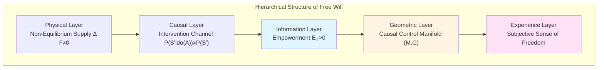
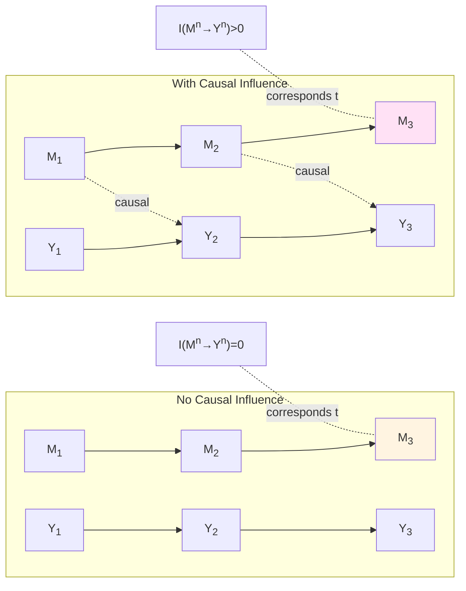
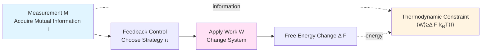
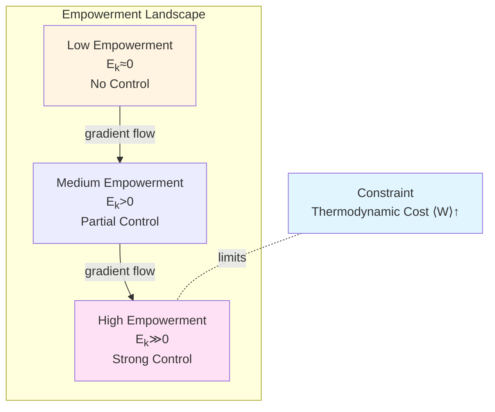
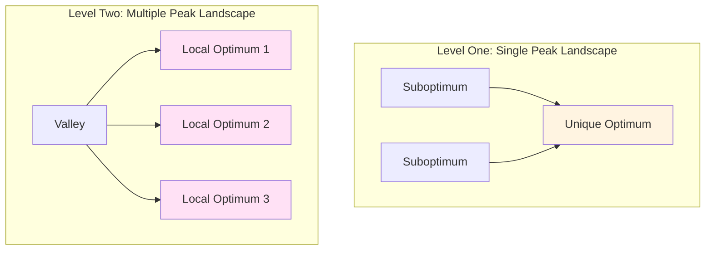

# Chapter 5: Geometric Characterization of Free Will—Information-Theoretic Foundation of Empowerment and Causal Control

## Introduction: Millennia-Long Confusion of Free Will

**"Do I really have free will?"**

This question has troubled philosophers for millennia. Determinists argue: Universe is causal chain, each "choice" is inevitable result of past states—free will is illusion. Non-determinists counter: Quantum uncertainty, chaotic dynamics prove future undetermined—free will has space.

But this debate deadlocked, because lacks **operational definition**: What is "freedom"? How to measure? How to test?

This chapter will start from information geometry and causal theory, give **operational geometric characterization** of free will:

$$
\boxed{\text{Free Will} \equiv \text{Causal Control} \equiv \text{Empowerment\ } \mathcal{E}_T}
$$

where $\mathcal{E}_T$ defined as:

$$
\mathcal{E}_T(t) = \sup_\pi I(A_t : S_{t+T} \mid S_t)
$$

That is "maximum mutual information of causal influence on future state $S_{t+T}$ through action $A_t$".

This definition transforms abstract "freedom" concept into **measurable, optimizable, physically constrained** geometric quantity.

### Core Insight: Triple Constraints of Free Will

**Physical Foundation Theorem**: Observer has operational freedom, if and only if simultaneously satisfies:

1. **Controllability**: Exists non-degenerate intervention channel $P(S'|do(A))$
2. **Non-Equilibrium Supply**: Exists steady-state free energy flow $\langle W\rangle \ge \Delta F - k_BT\langle I\rangle$
3. **Barrier Separation**: Exists Markov blanket $(M, A, S_{\mathrm{int}}, S_{\mathrm{ext}})$, making influence of internal states on outcomes distinguishable

**Meaning**: Free will not "uncaused cause", but **causal intervention ability under physical constraints**—it needs energy, needs channel, needs information, but within these constraints, it is real, measurable.

---

## Part One: Empowerment—Information Measure of Causal Control

### 1.1 From Mutual Information to Directed Information

**Classic Mutual Information**:

$$
I(X:Y) = H(Y) - H(Y|X) = D_{\mathrm{KL}}(p(x,y) \| p(x)p(y))
$$

Measures "correlation" of two random variables, but **doesn't distinguish causal direction**: $I(X:Y)=I(Y:X)$.

**Directed Information** (Massey, 1990):

For sequences $M^n=(M_1,\ldots,M_n)$ and $Y^n=(Y_1,\ldots,Y_n)$, define:

$$
I(M^n\to Y^n) = \sum_{t=1}^{n} I(M^t : Y_t \mid Y^{t-1})
$$

where $M^t=(M_1,\ldots,M_t)$, $Y^{t-1}=(Y_1,\ldots,Y_{t-1})$.

**Meaning**: $I(M^n\to Y^n)$ measures "cumulative causal influence of $M$ on $Y$"—it **considers temporal order**, distinguishes causal direction.

**Properties**:
- $I(M^n\to Y^n) \ne I(Y^n\to M^n)$ (asymmetric)
- $I(M^n\to Y^n) = 0$ if and only if $Y_t \perp M^t \mid Y^{t-1}$ holds for all $t$ (no causal influence)

### 1.2 Definition and Physical Meaning of Empowerment

**Definition 1.1 ($k$-Step Empowerment)** (Klyubin, Polani, Nehaniv, 2005)

At time $t$, observer's $k$-step Empowerment defined as:

$$
\mathcal{E}_k(t) = \sup_{\pi} I(A_{t:t+k-1} : S_{t+k} \mid S_t)
$$

where:
- $A_{t:t+k-1}=(A_t, A_{t+1},\ldots,A_{t+k-1})$ is action sequence
- $S_t, S_{t+k}$ are initial and terminal perceptual states
- $\sup_\pi$ means taking supremum over all possible strategies $\pi$

**Physical Meaning**:
- $\mathcal{E}_k$ measures "maximum ability of observer to exert distinguishable influence on future state through $k$-step actions"
- Equivalent to supremum of "action–sensor channel capacity"
- When $\mathcal{E}_k=0$, observer's actions have no detectable influence on future state—**completely no freedom**

**Analogy**: Imagine person locked in room. If pushing wall, shouting, knocking door cannot change any observable result (wall doesn't move, no one hears), then $\mathcal{E}_k=0$—he "has no freedom". Conversely, if pushing door can open, shouting can attract rescue, then $\mathcal{E}_k>0$—he "has freedom".

### 1.3 Empowerment and Causal Intervention

In Pearl causal framework, **intervention operator $do(A)$** means "externally force $A$ to take certain value", different from conditioning $p(Y|A)$.

**Proposition 1.1 (Empowerment and Intervention Distinguishability)**

If exists $a, a'\in\mathcal{A}$ such that:

$$
p(S_{t+k} \mid do(A_t=a), S_t) \ne p(S_{t+k} \mid do(A_t=a'), S_t)
$$

then $\mathcal{E}_k(t) > 0$. Conversely, if for all $a, a'$ above equality holds, then $\mathcal{E}_k(t)=0$.

**Proof Sketch**: Intervention distinguishable $\Rightarrow$ actions carry causal information $\Rightarrow$ $I(A:S_{t+k}|S_t)>0$. $\square$

**Meaning**: **Positive Empowerment is necessary and sufficient condition for causal intervention detectable**. This bridges "free will" with Pearl causal theory.

### 1.4 Geometric Characterization of Empowerment

On control manifold $(\mathcal{M}, G)$, Empowerment can be represented as curvature quantity on information geometry:

**Proposition 1.2 (Fisher Metric Representation of Empowerment)**

Under local linearization approximation, $k$-step Empowerment can be written as:

$$
\mathcal{E}_k(t) \approx \frac{1}{2}\log\det\left(I + \Sigma_A^{-1} J_T^\top J_T\right)
$$

where:
- $J_T = \frac{\partial S_{t+T}}{\partial A_t}$ is Jacobian matrix (causal sensitivity)
- $\Sigma_A$ is covariance of action space
- $I$ is identity matrix

**Meaning**: Empowerment proportional to log determinant of "causal sensitivity matrix"—**geometrically, it measures "local volume amplification rate from action space to state space"**.

**Analogy**: Imagine joystick controlling robot. If slight movement of joystick causes large change in robot position, then singular values of Jacobian $J_T$ large, Empowerment $\mathcal{E}_k$ high—operator "has power". Conversely, if pushing joystick hard, robot doesn't move, then $J_T\approx 0$, $\mathcal{E}_k\approx 0$—operator "powerless".

---

## Part Two: Physical Foundation Theorem—Thermodynamic Constraints of Free Will

### 2.1 Feedback Thermodynamics and Information–Work Duality

**Classic Second Law of Thermodynamics**:

$$
\langle W\rangle \ge \Delta F
$$

That is average work at least equals free energy change.

**Generalized Second Law with Measurement–Feedback** (Sagawa–Ueda, 2008):

$$
\langle W\rangle \ge \Delta F - k_BT\langle I\rangle
$$

where $I$ is mutual information acquired by measurement.

**Meaning**: **Information can be converted to work**—Maxwell's demon doesn't violate second law, but needs pay entropy cost of "erasing information" (Landauer principle).

**Feedback Jarzynski Equality**:

$$
\left\langle \exp\left(-\beta W + \beta\Delta F - I\right)\right\rangle = 1
$$

This is probability-1 identity, stronger than inequality.

### 2.2 Markov Blanket and Barrier Separation

**Definition 2.1 (Markov Blanket)** (Pearl, 2000; Friston, 2010)

For random variable set $(S_{\mathrm{int}}, S_{\mathrm{ext}}, A, M)$, say $(A, M)$ is Markov blanket of $S_{\mathrm{int}}$ relative to $S_{\mathrm{ext}}$, if:

$$
S_{\mathrm{int}} \perp S_{\mathrm{ext}} \mid (A, M)
$$

That is internal states and external states conditionally independent on blanket.

**Physical Meaning**:
- $S_{\mathrm{int}}$: Observer internal states (like neural activity, memory)
- $S_{\mathrm{ext}}$: External environment states
- $A$: Actions (output)
- $M$: Observations (input)

Markov blanket $(A, M)$ is "system boundary"—internal–external interaction must pass through this boundary.

**Proposition 2.1 (Barrier Separation Condition)**

If exists Markov blanket, and:

$$
I(S_{\mathrm{int}} : S_{\mathrm{ext}} \mid A) > 0
$$

then action $A$ carries distinguishable causal information of internal states on external states.

**Meaning**: Markov blanket cannot "completely block" causal flow—otherwise changes in internal states have no influence on external states, Empowerment zero.

### 2.3 Physical Foundation Theorem

**Theorem 2.1 (Physical Foundation of Free Will)**

Observer has operational freedom on time domain $[0,T]$, if and only if simultaneously satisfies:

**(i) Controllability**: Exists non-degenerate intervention channel $P(S_{t+1} \mid A_t, S_t)$, i.e.:

$$
\exists a, a' \in \mathcal{A},\quad P(S_{t+1} \mid do(A_t=a), S_t) \ne P(S_{t+1} \mid do(A_t=a'), S_t)
$$

**(ii) Non-Equilibrium Supply**: Exists sustained free energy flow or entropy flow, satisfying:

$$
\langle W\rangle \ge \Delta F - k_BT\langle I\rangle > 0
$$

That is system not in thermal equilibrium.

**(iii) Barrier Separation**: Exists Markov blanket $(A, M, S_{\mathrm{int}}, S_{\mathrm{ext}})$, making causal influence of internal states on external states detectable through action $A$:

$$
I(S_{\mathrm{int}} : S_{\mathrm{ext}} \mid A, M) > 0
$$

Then exists strategy $\pi$ such that:

$$
I(M^T \to S^T) > 0, \quad \mathcal{E}_k > 0
$$

And constrained by thermodynamic inequality $\langle W\rangle \ge \Delta F - k_BT\langle I\rangle$.

**Proof Idea**:

1. **Controllability $\Rightarrow$ Empowerment Positive**: Non-degenerate channel guarantees $\sup_\pi I(A:S_{t+k}|S_t)>0$ (channel capacity non-zero)

2. **Barrier Separation $\Rightarrow$ Directed Information Positive**: Markov blanket allows $P(S_{\mathrm{ext}}|do(A))\ne P(S_{\mathrm{ext}})$, therefore $I(M^T\to S^T)>0$ (Massey directed information)

3. **Non-Equilibrium Supply $\Rightarrow$ Thermodynamically Feasible**: Sagawa–Ueda feedback Jarzynski equality guarantees work–information duality consistency

$\square$

**Meaning**: This theorem transforms "free will" from philosophical concept into **conjunction of three operational physical conditions**. Each condition can be experimentally tested.

### 2.4 Thermodynamic Cost of Free Will

**Corollary 2.2 (Energy Lower Bound of Freedom)**

If observer maintains Empowerment $\mathcal{E}_k>\epsilon>0$ within time $T$, must consume minimum average work:

$$
\langle W\rangle_{\min} \ge k_BT\,\epsilon
$$

**Meaning**: **Maintaining free will requires sustained energy supply**. When energy exhausted (like fatigue, sleep, coma), Empowerment tends to zero, free will lost.

**Biological Evidence**:
- Brain accounts for 2% of body weight, but consumes 20% of basal metabolism—maintaining neural plasticity and action control
- Glucose supply interruption (hypoglycemia) causes confusion, decision ability decline—$\mathcal{E}_k\downarrow$
- Sleep deprivation reduces prefrontal activity, impulse control weakened—causal control impaired

---

## Part Three: Geometric Structure of Free Will—Control Manifold and Variational Principle

### 3.1 Definition of Control Manifold

Recall Chapter 0, observer moves on joint manifold $\mathcal{E}_Q = \mathcal{M} \times \mathcal{S}_Q$. Now, we view Empowerment $\mathcal{E}_k$ as **scalar field** on control manifold $\mathcal{M}$:

$$
\mathcal{E}_k : \mathcal{M} \to \mathbb{R}_{\ge 0}
$$

**Definition 3.1 (Causal Control Manifold)**

Control manifold $(\mathcal{M}, G, \mathcal{E}_k)$ is triple:
- $\mathcal{M}$: Parameter space (like strategy parameters, control parameters)
- $G$: Complexity metric (like Fisher metric)
- $\mathcal{E}_k$: Empowerment scalar field

On $\mathcal{M}$, define **Empowerment gradient flow**:

$$
\dot{\theta}(t) = \eta\,\nabla_G \mathcal{E}_k(\theta(t))
$$

where $\nabla_G$ is gradient operator with respect to metric $G$, $\eta>0$ is learning rate.

**Physical Meaning**: Observer through gradient ascent, maximizes causal control $\mathcal{E}_k$—this is **instinctive drive**: Biological systems tend to enhance control ability over environment.

### 3.2 Maximum Empowerment Principle

**Hypothesis 3.1 (Maximum Empowerment Hypothesis)**

Biological system's strategy $\pi$ tends to maximize long-term average Empowerment:

$$
\pi^* = \arg\max_\pi \mathbb{E}_{s\sim p_\pi}\left[\mathcal{E}_k(s)\right]
$$

Under constraints:
- Resource constraint: $\mathbb{E}_\pi[c(a)] \le C_{\max}$
- Thermodynamic constraint: $\langle W\rangle \ge \Delta F - k_BT\langle I\rangle$

**Theoretical Basis**:
- Empowerment maximization can be derived from "maximum entropy reinforcement learning" (Salge et al., 2014)
- Evolutionary pressure favors high-Empowerment strategies (stronger survival ability)
- Neuroscience evidence: Dopamine system encodes "expected control" (Sharot & Sunstein, 2020)

**Engineering Applications**:
- Robot navigation: Maximize entropy of future reachable positions—Empowerment guides exploration
- Game AI: Learn strategies "controlling key resources"—enhance strategic choice space
- Neural prosthetics: Design interfaces "giving patients maximum control freedom"

### 3.3 Duality of Variational Free Energy and Empowerment

In free energy principle (Friston, 2010), observer minimizes **variational free energy**:

$$
\mathcal{F}(\phi, \theta) = \mathbb{E}_{q_\phi}[\log q_\phi(s|o) - \log p_\theta(s,o)]
$$

where $q_\phi$ is internal generative model, $p_\theta$ is true distribution.

**Proposition 3.1 (Duality of Free Energy and Empowerment)**

Under Markov blanket setting, minimizing variational free energy $\mathcal{F}$ equivalent to maximizing expected Empowerment:

$$
\min_{\phi, \pi} \mathcal{F}(\phi, \theta) \Leftrightarrow \max_\pi \mathbb{E}_{q_\phi}\left[\mathcal{E}_k(s)\right]
$$

Under appropriate regularization and time discounting.

**Meaning**: Free energy principle and Empowerment maximization are **different formulations of same optimization objective**—former from "prediction error minimization" perspective, latter from "causal control maximization" perspective.

---

## Part Four: Hierarchical Structure of Free Will—From Determinism to Creativity

### 4.1 Level Zero: No Freedom ($\mathcal{E}_k=0$)

**Characteristics**:
- Observer's actions have no detectable influence on future state
- Examples: Completely passive observer, patients in coma or deep anesthesia

**Extreme Cases**:
- Physical death: $\mathcal{E}_k=0$, $I(M^T\to S^T)=0$
- Completely deterministic system: Although has "actions", results completely determined by initial conditions, no real choice

### 4.2 Level One: Passive Choice ($\mathcal{E}_k>0$, Single Peak)

**Characteristics**:
- Empowerment positive but small, choice space limited
- Empowerment landscape has only one global optimum—"only correct choice"

**Examples**:
- Emergency escape: Only safe exit in fire—has "freedom" (can choose not to run), but rational choice unique
- Chess endgame: Master facing "forced win"—has "freedom" to choose other moves, but only one optimal solution

**Geometric Picture**: Empowerment landscape as below, only one sharp peak.

### 4.3 Level Two: Active Choice ($\mathcal{E}_k\gg 0$, Multiple Peaks)

**Characteristics**:
- Empowerment positive and large, choice space rich
- Empowerment landscape has multiple local optima—"multiple paths all viable"

**Examples**:
- Career choice: Multiple career paths can achieve "controlling life" goal
- Artistic creation: Multiple styles can express theme—creative choice

**Geometric Picture**: Empowerment landscape has multiple peaks, observer can "explore" between different peaks.

### 4.4 Level Three: Meta-Freedom ($\partial\mathcal{E}_k/\partial\theta\ne 0$)

**Characteristics**:
- Not only choose action $a$, but also choose "how to modify own control manifold $\mathcal{M}$"
- Observer changes own strategy space, value function, goals—"reshaping self"

**Examples**:
- Learning new skills: Expand action space $\mathcal{A}$, thus enhance Empowerment
- Value reassessment: Change objective function $u(s,a)$, thus change Empowerment landscape
- Self-transformation: Through training, education, therapy change neural circuits—modify parameter space $\Theta$ of $\pi_\theta$

**Philosophical Meaning**: **Meta-freedom is "freedom of freedom"—choosing what kind of chooser to become**. This is highest form of human free will.

---

## Part Five: Experimental Testing of Free Will—Operational Protocols

### 5.1 Behavioral Estimation of Empowerment

**Protocol E1 (Two-Alternative Forced Choice Task)**

1. Present two options $a_1, a_2\in\mathcal{A}$
2. Observer chooses one
3. Record subsequent state $S_{t+k}$
4. Repeat $N$ trials, estimate conditional distribution $p(S_{t+k}|a_i, S_t)$
5. Calculate Empowerment:

$$
\widehat{\mathcal{E}}_k = I(A:S_{t+k}|S_t) = D_{\mathrm{KL}}(p(a,s'|s) \| p(a|s)p(s'|s))
$$

**Expected Results**:
- If $\widehat{\mathcal{E}}_k\approx 0$: Actions have no influence on results—no freedom
- If $\widehat{\mathcal{E}}_k>0$: Actions have distinguishable influence on results—has freedom

### 5.2 Detection of Causal Intervention

**Protocol E2 (do-Calculus Experiment)**

1. Randomly assign action $a\sim p(a)$ (external intervention, not subject choice)
2. Observe result $S_{t+k}$
3. Estimate intervention distribution $p(S_{t+k}|do(a), S_t)$
4. Compare with observational distribution $p(S_{t+k}|a, S_t)$

**Criterion**:
- If $p(S'|do(a)) \ne p(S'|a)$: Exists confounders, non-causal effect
- If $p(S'|do(a)) = p(S'|a)$: Observational distribution already captures causal effect

**Experimental Evidence**:
- Drug clinical trials: Randomized controlled trials (RCT) vs observational studies
- Neural modulation: Transcranial magnetic stimulation (TMS) vs natural movement

### 5.3 Measurement of Thermodynamic Cost

**Protocol E3 (Work–Information Martingale Test)**

Under continuous monitoring, construct martingale:

$$
\Gamma_t = \exp\left(-\beta W_t + \beta\Delta F_t - I_t\right)
$$

where:
- $W_t$: Cumulative work (can estimate through energy monitoring or metabolic rate)
- $\Delta F_t$: Free energy change
- $I_t$: Cumulative mutual information

**Criterion**: Feedback Jarzynski equality requires $\mathbb{E}[\Gamma_t]=1$.

**Verification**:
- Test if $\Gamma_t$ is martingale (conditional expectation $\mathbb{E}[\Gamma_{t+1}|\mathcal{F}_t]=\Gamma_t$)
- Estimate Jensen lower bound $\langle W\rangle \ge \Delta F - k_BT\langle I\rangle$ whether holds

**Biological Applications**:
- Measure ATP consumption of neural activity (like fMRI BOLD signal)
- Estimate energy cost of decision process
- Verify hypothesis "high-Empowerment strategies need higher energy"

### 5.4 Identification of Markov Blanket

**Protocol E4 (Conditional Independence Test)**

1. Define candidate blanket $(A, M)$ (like: sensory organ input + motor organ output)
2. Test conditional independence: $S_{\mathrm{int}} \perp S_{\mathrm{ext}} \mid (A, M)$
3. Use kernel independence test (like HSIC) or Bayesian network inference

**Expectation**:
- If independence holds: $(A, M)$ is valid Markov blanket
- If independence doesn't hold: Need expand blanket (add more mediator variables)

**Neuroscience Applications**:
- Identify neural representation of "self–world boundary"
- Verify Markov blanket hypothesis of free energy principle

---

## Part Six: Philosophical Postscript of Free Will—Reconciliation of Determinism and Freedom

### 6.1 Geometric Reconstruction of Compatibilism

**Classic Compatibilism** (Hume, Ayer): Free will and determinism can be compatible, because "freedom" means "acting according to own will", not "uncaused cause".

**Extension of This Theory**: Free will $\equiv$ Empowerment $\mathcal{E}_k>0$, this **completely compatible** with determinism, because:

1. **Causal Chain Unbroken**: Empowerment still in causal network—action $A$ determined by internal state $S_{\mathrm{int}}$
2. **Freedom is Relative**: $\mathcal{E}_k$ measures "choice space relative to constraints", not "absolute unconstrained"
3. **Operational Testable**: Doesn't depend on metaphysical "freedom" concept, only depends on measurable information quantity

**Geometric Picture**: Deterministic system is geodesic flow on $\mathcal{M}$, but "multi-peak structure" of Empowerment landscape allows "branching paths"—within deterministic framework, still has "freedom of choice".

### 6.2 From Free Will to Moral Responsibility

**Traditional Argument**: If no free will, then no moral responsibility—because "cannot choose" means "no need to be responsible".

**Response of This Theory**: Moral responsibility doesn't need "absolute freedom", only needs:

1. **Causal Intervention Ability**: $\mathcal{E}_k>0$, actor has distinguishable influence on results
2. **Predictability**: Actor's internal model $q_\phi$ can predict consequences of actions
3. **Adjustability**: Actor can modify $\pi_\theta$ through learning (meta-freedom)

**Corollary**:
- Infants or severe mental disorder patients: $\mathcal{E}_k\approx 0$ or $q_\phi$ missing—exempt from responsibility
- Normal adults: $\mathcal{E}_k>0$ and $q_\phi$ mature—bear responsibility
- Borderline cases (like mild cognitive impairment): $\mathcal{E}_k$ proportional to degree of responsibility—partial responsibility

### 6.3 Emergence of Free Will

**Question**: Empowerment $\mathcal{E}_k$ defined at macroscopic level (actions $A$, states $S$ are coarse-grained variables). Does microscopic particle level have "freedom"?

**Answer**: Free will is **emergent phenomenon**:

1. **Macroscopic Causal Effectiveness**: Coarse-grained variables $(A,S)$ can have higher causal effective information (Tononi, Hoel, 2013)
2. **Scale-Dependent**: Empowerment $\mathcal{E}_k$ maximum at appropriate coarse-graining scale—this is natural scale of "free will"
3. **Downward Causation**: Macroscopic intentions constrain microscopic dynamics through neural implementation—although microscopic follows physical laws, macroscopic still has "control"

**Philosophical Meaning**: **Free will not at fundamental particle level, but emerges at appropriate organizational level**—like "liquid" not at single water molecule level, but emerges in macroscopic collective behavior.

### 6.4 Cost and Finitude of Freedom

**Existentialist Insight** (Sartre): "Man is condemned to freedom"—freedom is burden, because choice means responsibility.

**Quantification of This Theory**: Cost of freedom is **thermodynamic cost $\langle W\rangle$ and cognitive load**:

$$
\text{Cost of Freedom} = k_BT\,\mathcal{E}_k + \text{Decision Complexity}
$$

**Corollary**:
- When energy exhausted (fatigue) or cognitive overload (decision fatigue), observer tends to "autopilot"—$\mathcal{E}_k\downarrow$
- High freedom (multiple options, high uncertainty) causes anxiety, paralysis—"paradox of choice"
- Moderate constraints (like habits, norms) can reduce cognitive cost, while preserving core freedom

---

## Conclusion: Geometric Truth of Free Will

This chapter starts from information geometry and causal theory, gives operational definition of free will:

$$
\boxed{\mathcal{E}_k(t) = \sup_\pi I(A_{t:t+k-1} : S_{t+k} \mid S_t)}
$$

**Core Theorems Review**:

1. **Physical Foundation Theorem** (Theorem 2.1): Free will needs triple conditions—controllability, non-equilibrium supply, barrier separation

2. **Thermodynamic Cost** (Corollary 2.2): $\langle W\rangle \ge k_BT\,\mathcal{E}_k$—freedom needs energy

3. **Compatibilism**: Empowerment compatible with determinism—freedom is "choice space within constraints"

4. **Hierarchical Structure**: No freedom ($\mathcal{E}_k=0$) $\to$ passive choice $\to$ active choice $\to$ meta-freedom

**Experimental Path**:
- Behavioral estimation: Two-alternative task $\rightarrow$ $\widehat{\mathcal{E}}_k$
- Causal detection: Random intervention $\rightarrow$ $p(S'|do(a))$
- Thermodynamic verification: Work–information martingale $\rightarrow$ Jarzynski equality
- Neural identification: Markov blanket $\rightarrow$ conditional independence

**Philosophical Significance**:
- Free will not "uncaused cause", but **causal control under physical constraints**
- It is **measurable, optimizable, resource-limited**—but within these constraints, it is real
- It **emerges** at appropriate organizational level, not at fundamental particle level

Next chapter (Chapter 6) will explore **multi-observer consensus geometry**, revealing how individual free will couples through social networks, forming collective decisions and consensus emergence.

---

## References

### Empowerment Theory
- Klyubin, A. S., Polani, D., & Nehaniv, C. L. (2005). Empowerment: A universal agent-centric measure of control. *IEEE Congress on Evolutionary Computation*.
- Salge, C., Glackin, C., & Polani, D. (2014). Empowerment–an introduction. In *Guided Self-Organization: Inception* (pp. 67-114).

### Causal Theory
- Pearl, J. (2000). *Causality: Models, Reasoning, and Inference*. Cambridge University Press.
- Massey, J. L. (1990). Causality, feedback and directed information. *Proc. Int. Symp. Inf. Theory Applic.*(ISITA-90), 303-305.

### Thermodynamics and Information
- Sagawa, T., & Ueda, M. (2008). Second law of thermodynamics with discrete quantum feedback control. *Physical Review Letters*, 100(8), 080403.
- Jarzynski, C. (1997). Nonequilibrium equality for free energy differences. *Physical Review Letters*, 78(14), 2690.

### Free Energy Principle
- Friston, K. (2010). The free-energy principle: a unified brain theory? *Nature Reviews Neuroscience*, 11(2), 127-138.
- Parr, T., Pezzulo, G., & Friston, K. J. (2022). *Active Inference: The Free Energy Principle in Mind, Brain, and Behavior*. MIT Press.

### Philosophy
- Hume, D. (1748). *An Enquiry Concerning Human Understanding*.
- Sartre, J.-P. (1943). *L'Être et le néant* (*Being and Nothingness*).
- Dennett, D. C. (1984). *Elbow Room: The Varieties of Free Will Worth Wanting*. MIT Press.

### This Collection
- This collection: *Observer–World Section Structure* (Chapter 1)
- This collection: *Structural Definition of Consciousness* (Chapter 2)
- This collection: *Attention–Time–Knowledge Graph* (Chapter 4)
- This collection: *Value–Meaning Unification: Optimal Geometry of Ethical Values and Physical Foundation of Free Will* (Source theory document)

