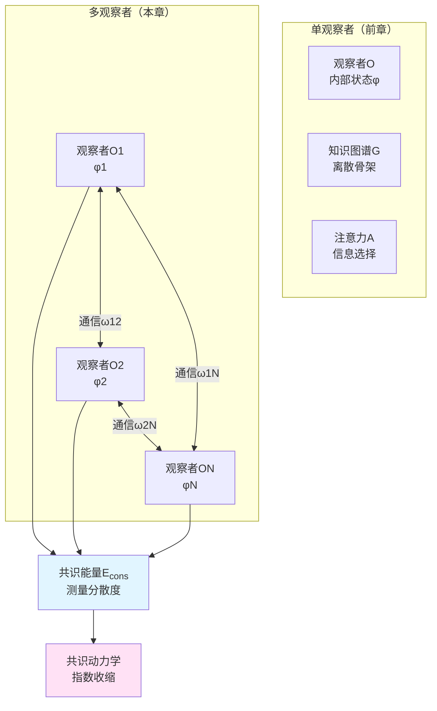
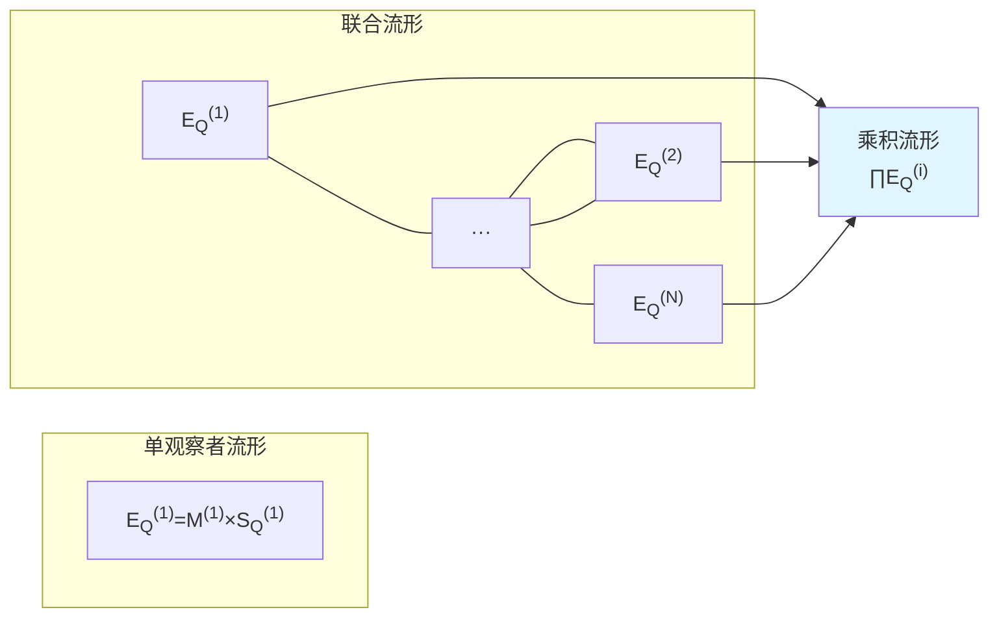
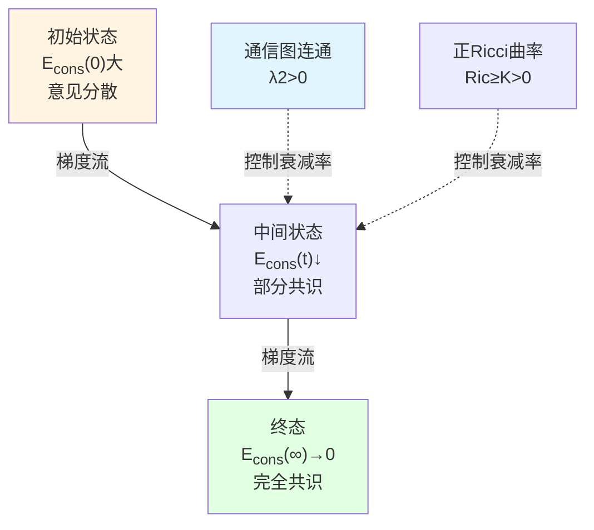

# 第6章 多观察者共识几何：社会意识的信息流形结构

## 引言：从个体意识到集体意识

前五章聚焦**单个观察者**的意识结构。但真实世界中，意识不是孤立的——它在社会网络中**相互作用、交流、达成共识或冲突**。

想象一个会议室里的讨论：
- 每个人有自己的观点（个体信息状态$\phi_i$）
- 通过发言交流（通信图$\mathcal{C}_t$）
- 逐渐形成共识或分裂（共识能量$\mathcal{E}_{\mathrm{cons}}(t)$变化）

本章将构建**多观察者共识几何**理论，揭示：
- 如何在信息流形上度量"共识程度"
- 共识形成的动力学如何受"共识Ricci曲率"控制
- 集体知识图谱如何逼近真实信息几何

### 核心洞察：共识即几何收缩

在信息流形$(\mathcal{S}_Q, g_Q)$上，$N$个观察者的状态$\phi_1,\ldots,\phi_N$形成一个"点云"。定义**共识能量**：

$$
\mathcal{E}_{\mathrm{cons}}(t) = \frac{1}{2}\sum_{i,j} \omega_t(i,j)\,d_{\mathcal{S}_Q}^2(\phi_i(t), \phi_j(t))
$$

其中$\omega_t(i,j)$为通信权重，$d_{\mathcal{S}_Q}$为测地距离。

**主定理**：在对称通信图与正Ricci曲率条件下，共识能量**指数衰减**：

$$
\mathcal{E}_{\mathrm{cons}}(t) \le \mathcal{E}_{\mathrm{cons}}(0)\,e^{-2\kappa_{\mathrm{eff}} t}
$$

其中$\kappa_{\mathrm{eff}}$由通信图的代数连通度与信息流形的Ricci曲率下界决定。

**意义**：**共识形成是信息几何上的"引力收缩"——观察者在信息流形上相互"吸引"，点云收缩至共识点**。

---

## 第一部分：多观察者联合状态空间

### 1.1 观察者族的形式化

**定义1.1（多观察者族）**

在计算宇宙$(X, \mathsf{T}, \mathsf{C}, \mathsf{I})$中，多观察者族为：

$$
\mathcal{O} = \{O_1, O_2, \ldots, O_N\}
$$

其中每个观察者$O_i$包含：
- 内部记忆：$M_{\mathrm{int}}^{(i)}$
- 观测符号空间：$\Sigma_{\mathrm{obs}}^{(i)}$
- 动作空间：$\Sigma_{\mathrm{act}}^{(i)}$
- 注意力策略：$\mathcal{P}^{(i)}$
- 更新算子：$\mathcal{U}^{(i)}$

**关键假设**：
- $N$有限（可数推广需要拓扑）
- 每个$M_{\mathrm{int}}^{(i)}$有限
- 所有观察者访问同一任务信息流形$\mathcal{S}_Q$（共享现实）

### 1.2 联合流形的乘积结构

**定义1.2（多观察者联合流形）**

单观察者在$\mathcal{E}_Q^{(i)} = \mathcal{M}^{(i)} \times \mathcal{S}_Q^{(i)}$上运动。多观察者联合流形为乘积：

$$
\mathfrak{E}_Q^N = \prod_{i=1}^N \mathcal{E}_Q^{(i)} = \prod_{i=1}^N (\mathcal{M}^{(i)} \times \mathcal{S}_Q^{(i)})
$$

联合世界线：

$$
Z(t) = (z_1(t), z_2(t), \ldots, z_N(t))
$$

其中$z_i(t) = (\theta_i(t), \phi_i(t))$。

**几何结构**：在$\mathfrak{E}_Q^N$上装配乘积度量：

$$
\mathbb{G}^{(N)} = \bigoplus_{i=1}^N \big(\alpha_i^2 G^{(i)} \oplus \beta_i^2 g_Q^{(i)}\big)
$$

无交互时，$N$个观察者沿各自测地线独立运动。交互通过**耦合势**引入。

---

## 第二部分：通信图与共识能量

### 2.1 时间依赖通信图

**定义2.1（通信图）**

在时刻$t$，通信结构为有向加权图：

$$
\mathcal{C}_t = (I, E_t, \omega_t)
$$

其中：
- $I = \{1,2,\ldots,N\}$：观察者索引
- $E_t \subset I \times I$：有向边集，$(j\to i)\in E_t$表示$O_j$向$O_i$发送信息
- $\omega_t: E_t \to \mathbb{R}_{\ge 0}$：边权重（通信带宽或强度）

**特例**：对称通信图满足$\omega_t(i,j) = \omega_t(j,i)$（双向对等通信）。

**图Laplace算子**：

$$
(L_t x)_i = \sum_{j} \omega_t(i,j)\,(x_i - x_j)
$$

对向量$x\in\mathbb{R}^N$。当$\omega_t$对称时，$L_t$为对称半正定矩阵。

**代数连通度**：$L_t$的第二小特征值$\lambda_2(L_t)$（Fiedler值）度量图的"连通性"——$\lambda_2$大，图连通性强。

### 2.2 共识能量的定义

**定义2.2（共识能量）**

在时刻$t$，多观察者的共识能量为：

$$
\mathcal{E}_{\mathrm{cons}}(t) = \frac{1}{2}\sum_{i,j\in I} \omega_t(i,j)\,d_{\mathcal{S}_Q}^2(\phi_i(t), \phi_j(t))
$$

其中$d_{\mathcal{S}_Q}(\phi_i, \phi_j)$为信息流形$(\mathcal{S}_Q, g_Q)$上的测地距离。

**物理意义**：
- $\mathcal{E}_{\mathrm{cons}} = 0$：完美共识，所有观察者信息状态重合
- $\mathcal{E}_{\mathrm{cons}}$大：信息分散，观察者意见分歧

**类比**：
- 物理：带电粒子的静电势能$\propto\sum_{i<j} q_i q_j/r_{ij}$
- 图论：图的Dirichlet能量$\sum_{ij} w_{ij}(x_i - x_j)^2$
- 信息几何：观察者点云的"势能"

### 2.3 共识能量的变分表达

在连续极限，共识能量可表为：

$$
\mathcal{E}_{\mathrm{cons}}(t) = \int_{\mathcal{S}_Q \times \mathcal{S}_Q} d_{\mathcal{S}_Q}^2(\phi, \phi')\,\rho_t(\phi)\,\rho_t(\phi')\,W(\phi,\phi')\,d\mu(\phi)d\mu(\phi')
$$

其中$\rho_t$为观察者在$\mathcal{S}_Q$上的经验分布，$W(\phi,\phi')$为连续通信核。

这与Wasserstein几何中的"交互能量"对应，是离散版本的Kantorovich对偶表达。

---

## 第三部分：共识动力学与Ricci曲率

### 3.1 共识梯度流

假设观察者的信息状态$\phi_i(t)$按**共识梯度流**演化：

$$
\frac{d\phi_i}{dt} = -\sum_{j} \omega_t(i,j)\,\nabla_{\phi_i}\left(\frac{1}{2}d_{\mathcal{S}_Q}^2(\phi_i, \phi_j)\right)
$$

在Riemann流形$(\mathcal{S}_Q, g_Q)$上，梯度$\nabla_{\phi_i}$由度量$g_Q$定义。

**物理图像**：每个观察者受到所有相邻观察者的"信息引力"，沿测地线向他们靠近。

**能量耗散**：

$$
\frac{d}{dt}\mathcal{E}_{\mathrm{cons}}(t) = -\sum_{i} \left|\nabla_{\phi_i}\mathcal{E}_{\mathrm{cons}}(t)\right|_{g_Q}^2 \le 0
$$

即共识能量单调递减——**系统自发趋向共识**。

### 3.2 共识Ricci曲率

**定义3.1（共识Ricci曲率下界）**

若存在常数$\kappa_{\mathrm{cons}}(t) > 0$，使得对任意$i, j$：

$$
\frac{d}{d\epsilon}\Big\vert_{\epsilon=0} d_{\mathcal{S}_Q}^2(\phi_i(t+\epsilon), \phi_j(t+\epsilon)) \le -2\kappa_{\mathrm{cons}}(t)\,d_{\mathcal{S}_Q}^2(\phi_i(t), \phi_j(t))
$$

则称$\kappa_{\mathrm{cons}}(t)$为共识Ricci曲率下界。

**几何意义**：
- $\kappa_{\mathrm{cons}} > 0$：正曲率，观察者距离指数收缩（"引力"）
- $\kappa_{\mathrm{cons}} < 0$：负曲率，观察者距离可能发散（"斥力"）
- $\kappa_{\mathrm{cons}} = 0$：平坦，距离线性变化

**与经典Ricci曲率的关系**：
- 信息流形$(\mathcal{S}_Q, g_Q)$的Ricci曲率下界$\mathrm{Ric}_{g_Q} \ge K$
- 通信图的代数连通度$\lambda_2(L_t) \ge \lambda_{\min}$
- 则$\kappa_{\mathrm{cons}} \gtrsim \min(K, \lambda_{\min})$（粗略估计）

### 3.3 指数衰减定理

**定理3.1（共识能量指数衰减）**

假设：
1. 通信图$\mathcal{C}_t$对称且连通，代数连通度$\lambda_2(L_t) \ge \lambda_{\min} > 0$
2. 信息流形$(\mathcal{S}_Q, g_Q)$的Ricci曲率有下界$\mathrm{Ric}_{g_Q} \ge K$
3. 观察者按共识梯度流演化

则存在$\kappa_{\mathrm{eff}} > 0$，使得：

$$
\mathcal{E}_{\mathrm{cons}}(t) \le \mathcal{E}_{\mathrm{cons}}(0)\,e^{-2\kappa_{\mathrm{eff}} t}
$$

其中$\kappa_{\mathrm{eff}} = c\cdot\min(\lambda_{\min}, K)$（$c$为几何常数）。

**证明思路**：
1. 利用Bakry–Émery准则，共识能量的Hessian满足：

$$
\nabla^2 \mathcal{E}_{\mathrm{cons}} \ge 2\kappa_{\mathrm{eff}}\,g_Q
$$

2. 由梯度流方程：

$$
\frac{d}{dt}\mathcal{E}_{\mathrm{cons}} = -\langle \nabla\mathcal{E}_{\mathrm{cons}}, \nabla\mathcal{E}_{\mathrm{cons}}\rangle_{g_Q}
$$

3. 结合Poincaré不等式与曲率下界，得到微分不等式：

$$
\frac{d}{dt}\mathcal{E}_{\mathrm{cons}} \le -2\kappa_{\mathrm{eff}}\,\mathcal{E}_{\mathrm{cons}}
$$

4. Grönwall引理给出指数衰减。$\square$

---

## 第四部分：多观察者联合作用量

### 4.1 联合作用量的构造

单观察者作用量（回顾第0章）：

$$
\widehat{\mathcal{A}}_Q^{(i)} = \int_0^T \left(\frac{1}{2}\alpha_i^2 G_{ab}(\theta_i)\dot{\theta}_i^a\dot{\theta}_i^b + \frac{1}{2}\beta_i^2 g_{jk}(\phi_i)\dot{\phi}_i^j\dot{\phi}_i^k - \gamma_i U_Q(\phi_i)\right)dt
$$

**定义4.1（多观察者联合作用量）**

$$
\widehat{\mathcal{A}}_Q^{\mathrm{multi}} = \sum_{i=1}^N \widehat{\mathcal{A}}_Q^{(i)} + \lambda_{\mathrm{cons}} \int_0^T \mathcal{E}_{\mathrm{cons}}(t)\,dt
$$

其中$\lambda_{\mathrm{cons}} > 0$为共识权重参数。

**变分原理**：极小化$\widehat{\mathcal{A}}_Q^{\mathrm{multi}}$给出最优多观察者策略，在以下目标间权衡：
- 最小化个体复杂性消耗（$\alpha_i^2$项）
- 最大化个体信息质量（$-\gamma_i U_Q$项）
- 最小化集体共识能量（$\lambda_{\mathrm{cons}}\mathcal{E}_{\mathrm{cons}}$项）

### 4.2 Euler–Lagrange方程

对$\theta_i^a$变分：

$$
\frac{d}{dt}\left(\alpha_i^2 G_{ab}(\theta_i)\dot{\theta}_i^b\right) - \frac{1}{2}\alpha_i^2 \partial_a G_{bc}(\theta_i)\dot{\theta}_i^b\dot{\theta}_i^c = 0
$$

即控制坐标沿测地线演化。

对$\phi_i^k$变分：

$$
\frac{d}{dt}\left(\beta_i^2 g_{jk}(\phi_i)\dot{\phi}_i^j\right) - \frac{1}{2}\beta_i^2 \partial_k g_{mn}(\phi_i)\dot{\phi}_i^m\dot{\phi}_i^n = -\gamma_i \nabla_k U_Q(\phi_i) - \lambda_{\mathrm{cons}} \nabla_k \frac{\partial\mathcal{E}_{\mathrm{cons}}}{\partial\phi_i}
$$

展开为：

$$
\ddot{\phi}_i^k + \Gamma^k_{mn}(\phi_i)\dot{\phi}_i^m\dot{\phi}_i^n = -\frac{\gamma_i}{\beta_i^2} g_Q^{kl}(\phi_i)\partial_l U_Q(\phi_i) - \frac{\lambda_{\mathrm{cons}}}{\beta_i^2} \sum_j \omega_t(i,j) g_Q^{kl}(\phi_i) \nabla_l d_{\mathcal{S}_Q}^2(\phi_i, \phi_j)
$$

**物理解释**：
- 第一项（右侧）：个体任务信息势的引力
- 第二项（右侧）：邻居观察者的共识引力
- 左侧：测地加速度（惯性）

**特殊情况**：
- $\lambda_{\mathrm{cons}} \to 0$：无共识压力，观察者独立演化
- $\lambda_{\mathrm{cons}} \to \infty$：强共识压力，所有观察者快速收敛至重心

---

## 第五部分：联合知识图谱与谱收敛

### 5.1 知识图谱的联合

回顾第4章，单观察者知识图谱为$\mathcal{G}_i = (V_i, E_i, w_i, \Phi_i)$。

**定义5.1（联合知识图谱）**

多观察者联合知识图谱为：

$$
\mathcal{G}_t^{\mathrm{union}} = \left(\bigcup_{i=1}^N V_{i,t},\ E_t^{\mathrm{intra}} \cup E_t^{\mathrm{inter}},\ w_t,\ \Phi_t^{\mathrm{union}}\right)
$$

其中：
- 节点：所有观察者知识图谱节点的并集
- 边：$E_t^{\mathrm{intra}}$为单个图谱内部边，$E_t^{\mathrm{inter}}$为跨图谱通信边
- 嵌入：$\Phi_t^{\mathrm{union}}: \bigcup V_{i,t} \to \mathcal{S}_Q$

**通信边的构造**：若观察者$O_i$与$O_j$通信，且节点$v_i\in V_{i,t}$与$v_j\in V_{j,t}$在$\mathcal{S}_Q$上的嵌入距离$d_{\mathcal{S}_Q}(\Phi_i(v_i), \Phi_j(v_j)) < \epsilon$，则添加边$(v_i, v_j)$。

### 5.2 联合图谱的谱维数

**定理5.1（联合谱维数收敛）**

假设：
1. 每个观察者图谱$\mathcal{G}_{i,t}$在$(\mathcal{S}_Q, g_Q)$上谱逼近
2. 通信图连通，观察者达成共识：$\mathcal{E}_{\mathrm{cons}}(t) \to 0$
3. 联合图谱$\mathcal{G}_t^{\mathrm{union}}$的节点在$\mathcal{S}_Q$上稠密

则联合图谱的谱维数收敛：

$$
\lim_{t\to\infty} d_{\mathrm{spec}}(\mathcal{G}_t^{\mathrm{union}}) = d_{\mathrm{info},Q}
$$

其中$d_{\mathrm{info},Q}$为信息流形$(\mathcal{S}_Q, g_Q)$的局部信息维数。

**意义**：**多观察者通过通信共享知识，联合图谱的几何逼近能力超越任何单个图谱**——"集体智能"涌现。

**推论**：在完全共识情形（$\mathcal{E}_{\mathrm{cons}}=0$），联合图谱的信息容量为单个图谱的$N$倍（节点数线性叠加）。

---

## 第六部分：实验与应用

### 6.1 社会网络中的意见动力学

**模型**：
- 观察者：社交网络用户
- 信息状态$\phi_i$：政治立场、产品偏好等
- 通信图$\mathcal{C}_t$：关注关系、互动频率
- 共识能量$\mathcal{E}_{\mathrm{cons}}$：意见极化程度

**预测**：
- 强连通网络（高$\lambda_2$）→快速共识形成
- 社群结构（低$\lambda_2$）→意见极化持续
- 正Ricci曲率（同质性）→回声室效应

**实验检验**：
- 追踪Twitter话题讨论中用户立场演化
- 估计通信图的代数连通度与意见收敛速率
- 验证$\mathcal{E}_{\mathrm{cons}}(t) \propto e^{-\kappa t}$

### 6.2 多智能体强化学习

**应用**：
- 观察者：自主机器人/AI智能体
- 信息状态$\phi_i$：策略参数或价值函数
- 共识目标：协同完成任务（如多机器人搬运）

**算法**：多智能体共识梯度下降

1. 每个智能体独立探索环境，更新本地$\phi_i$
2. 定期通信，计算共识梯度$\nabla_{\phi_i}\mathcal{E}_{\mathrm{cons}}$
3. 更新：$\phi_i \leftarrow \phi_i - \eta(\nabla_{\phi_i} J_i + \lambda_{\mathrm{cons}} \nabla_{\phi_i}\mathcal{E}_{\mathrm{cons}})$

**优势**：
- 收敛速度由定理3.1保证
- 无需中心协调器（分布式）
- 通信开销可控（稀疏通信图）

### 6.3 神经科学：跨脑同步

**现象**：在对话、合作任务中，不同个体的脑活动出现**跨脑同步**（inter-brain synchronization）。

**模型解释**：
- 观察者：两个个体的大脑
- 信息状态$\phi_1, \phi_2$：神经表征（如PFC活动模式）
- 通信：语言、眼神、动作
- 共识能量$\mathcal{E}_{\mathrm{cons}}$：神经表征差异

**实验**：
- 双人fMRI/EEG同步记录
- 计算表征相似性矩阵（RSA）
- 验证：任务协作成功$\Leftrightarrow$ $\mathcal{E}_{\mathrm{cons}}\downarrow$

---

## 第七部分：哲学后记——从个体意识到集体意识

### 7.1 集体意识的涌现

**问题**：集体意识（collective consciousness）是否真实存在？

**本理论的回答**：集体意识不是"超个体灵魂"，而是**多观察者系统在信息流形上的共识态**。

**判据**：
- $\mathcal{E}_{\mathrm{cons}} \approx 0$：强集体意识（如宗教仪式、军队列队）
- $\mathcal{E}_{\mathrm{cons}} \gg 0$：弱集体意识（如陌生人群体）

**涌现层级**：
1. **无意识集体**：$\mathcal{E}_{\mathrm{cons}}$大，无共识，仅物理聚集
2. **隐式共识**：$\mathcal{E}_{\mathrm{cons}}$中等，部分共享信念（如文化共识）
3. **显式共识**：$\mathcal{E}_{\mathrm{cons}}$小，明确协议（如合同、协议）
4. **意识融合**：$\mathcal{E}_{\mathrm{cons}} \to 0$，完全同步（如双生子、极端洗脑）

### 7.2 共识的代价与操纵

**热力学成本**：共识形成需要通信，通信消耗能量。最小通信成本由信息论给出：

$$
W_{\mathrm{comm}} \ge k_BT \sum_{i,j} \omega_t(i,j) I(\phi_i : \phi_j)
$$

其中$I(\phi_i : \phi_j)$为信息传递量。

**操纵脆弱性**：若存在"意见领袖"$O_k$，其$\sum_i \omega(i,k)$很大（高中心度），则操纵$\phi_k$可快速改变整体共识——**独裁者问题**。

**防御**：分布式网络（无中心节点）、批判性思维（降低$\omega$权重）、多样性维持（保持适度$\mathcal{E}_{\mathrm{cons}}$）。

### 7.3 从Durkheim到信息几何

**社会学经典理论**（Durkheim, 1893）：集体意识（conscience collective）是社会成员共享的信念、价值、道德规范。

**本理论的几何重构**：
- "共享信念"$\leftrightarrow$观察者在$\mathcal{S}_Q$上的聚类
- "社会整合"$\leftrightarrow$通信图的代数连通度$\lambda_2$
- "社会分化"$\leftrightarrow$共识能量$\mathcal{E}_{\mathrm{cons}}$增大

**定量预测**：
- 传统社会（高整合）：$\lambda_2$大，$\mathcal{E}_{\mathrm{cons}}$小
- 现代社会（高分化）：$\lambda_2$小（社群分裂），$\mathcal{E}_{\mathrm{cons}}$大

---

## 结论：共识几何的统一刻画

本章构建了多观察者共识几何的完整理论：

**核心结果回顾**：

1. **共识能量定义**：

$$
\mathcal{E}_{\mathrm{cons}}(t) = \frac{1}{2}\sum_{i,j} \omega_t(i,j)\,d_{\mathcal{S}_Q}^2(\phi_i(t), \phi_j(t))
$$

2. **指数衰减定理**（定理3.1）：

$$
\mathcal{E}_{\mathrm{cons}}(t) \le \mathcal{E}_{\mathrm{cons}}(0)\,e^{-2\kappa_{\mathrm{eff}} t}
$$

其中$\kappa_{\mathrm{eff}} \propto \min(\lambda_2, K)$。

3. **联合作用量**：

$$
\widehat{\mathcal{A}}_Q^{\mathrm{multi}} = \sum_i \widehat{\mathcal{A}}_Q^{(i)} + \lambda_{\mathrm{cons}} \int_0^T \mathcal{E}_{\mathrm{cons}}(t)\,dt
$$

4. **联合图谱谱收敛**（定理5.1）：

$$
\lim_{t\to\infty} d_{\mathrm{spec}}(\mathcal{G}_t^{\mathrm{union}}) = d_{\mathrm{info},Q}
$$

**应用领域**：
- 社会网络意见动力学
- 多智能体协同学习
- 神经跨脑同步
- 组织决策优化

**哲学意义**：
- 集体意识是信息几何上的共识态
- 共识形成受拓扑（通信图）与几何（Ricci曲率）双重约束
- 多样性与共识在$\mathcal{E}_{\mathrm{cons}}$的适度值之间权衡

下一章（第7章）将探讨**意识涌现的必要条件**，揭示从无意识到有意识的相变临界点。

---

## 参考文献

### 共识动力学
- Olfati-Saber, R., & Murray, R. M. (2004). Consensus problems in networks of agents with switching topology and time-delays. *IEEE Transactions on Automatic Control*, 49(9), 1520-1533.
- Xiao, L., & Boyd, S. (2004). Fast linear iterations for distributed averaging. *Systems & Control Letters*, 53(1), 65-78.

### 图论与Ricci曲率
- Chung, F. R. (1997). *Spectral Graph Theory*. AMS.
- Ollivier, Y. (2009). Ricci curvature of Markov chains on metric spaces. *Journal of Functional Analysis*, 256(3), 810-864.

### 多智能体学习
- Buşoniu, L., Babuška, R., & De Schutter, B. (2008). A comprehensive survey of multiagent reinforcement learning. *IEEE Transactions on Systems, Man, and Cybernetics*, 38(2), 156-172.

### 跨脑同步
- Hasson, U., Ghazanfar, A. A., Galantucci, B., Garrod, S., & Keysers, C. (2012). Brain-to-brain coupling: a mechanism for creating and sharing a social world. *Trends in Cognitive Sciences*, 16(2), 114-121.

### 社会学经典
- Durkheim, É. (1893). *De la division du travail social* (*The Division of Labor in Society*).

### 本论文集
- 本论文集：《观察者–世界截面结构》（Chapter 1）
- 本论文集：《注意–时间–知识图谱》（Chapter 4）
- 本论文集：《计算宇宙中的多观察者共识几何与因果网》（源理论文档）
