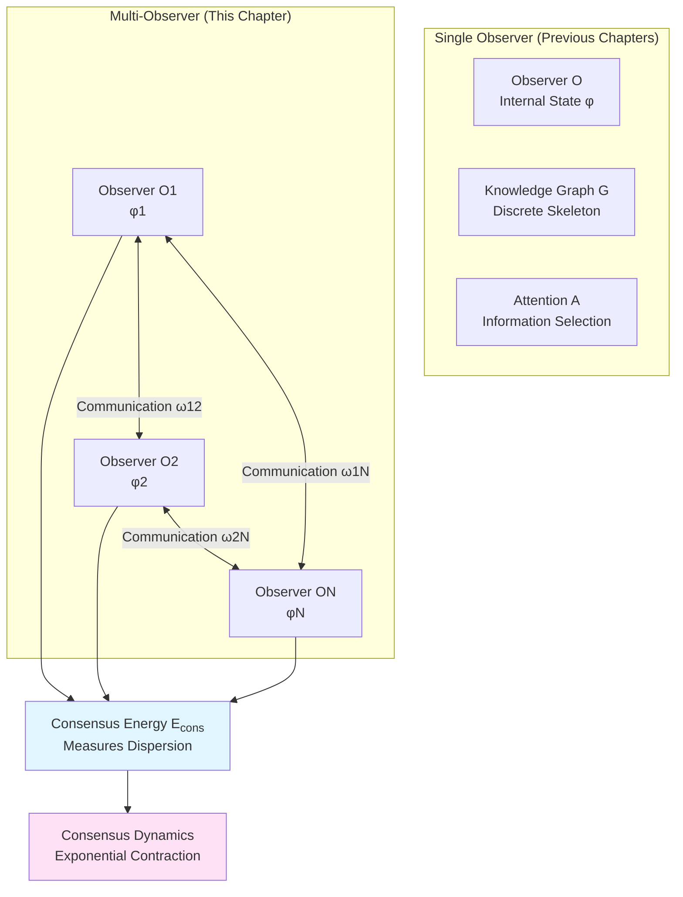
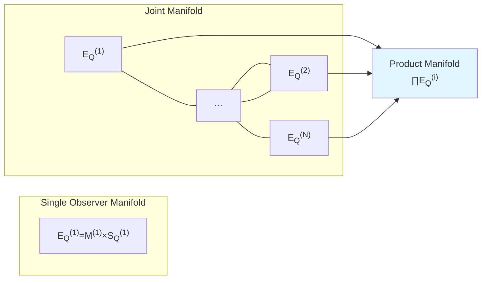
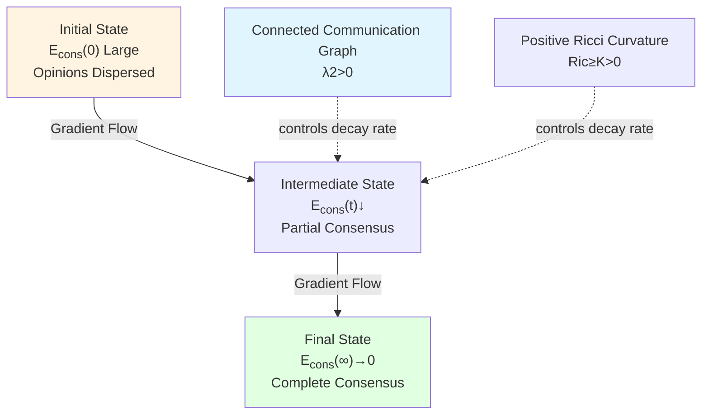

# Chapter 6: Multi-Observer Consensus Geometry—Information Manifold Structure of Social Consciousness

## Introduction: From Individual to Collective Consciousness

The first five chapters focus on consciousness structure of **single observer**. But in real world, consciousness is not isolated—it **interacts, communicates, reaches consensus or conflicts** in social networks.

Imagine a discussion in a conference room:
- Each person has own viewpoint (individual information state $\phi_i$)
- Through speaking and communication (communication graph $\mathcal{C}_t$)
- Gradually forms consensus or splits (consensus energy $\mathcal{E}_{\mathrm{cons}}(t)$ changes)

This chapter will construct theory of **multi-observer consensus geometry**, revealing:
- How to measure "degree of consensus" on information manifold
- How dynamics of consensus formation controlled by "consensus Ricci curvature"
- How collective knowledge graph approximates true information geometry

### Core Insight: Consensus as Geometric Contraction

On information manifold $(\mathcal{S}_Q, g_Q)$, states $\phi_1,\ldots,\phi_N$ of $N$ observers form a "point cloud". Define **consensus energy**:

$$
\mathcal{E}_{\mathrm{cons}}(t) = \frac{1}{2}\sum_{i,j} \omega_t(i,j)\,d_{\mathcal{S}_Q}^2(\phi_i(t), \phi_j(t))
$$

where $\omega_t(i,j)$ is communication weight, $d_{\mathcal{S}_Q}$ is geodesic distance.

**Main Theorem**: Under symmetric communication graph and positive Ricci curvature conditions, consensus energy **exponentially decays**:

$$
\mathcal{E}_{\mathrm{cons}}(t) \le \mathcal{E}_{\mathrm{cons}}(0)\,e^{-2\kappa_{\mathrm{eff}} t}
$$

where $\kappa_{\mathrm{eff}}$ determined by algebraic connectivity of communication graph and Ricci curvature lower bound of information manifold.

**Meaning**: **Consensus formation is "gravitational contraction" on information geometry—observers mutually "attract" on information manifold, point cloud contracts to consensus point**.

---

## Part One: Multi-Observer Joint State Space

### 1.1 Formalization of Observer Family

**Definition 1.1 (Multi-Observer Family)**

In computational universe $(X, \mathsf{T}, \mathsf{C}, \mathsf{I})$, multi-observer family is:

$$
\mathcal{O} = \{O_1, O_2, \ldots, O_N\}
$$

where each observer $O_i$ contains:
- Internal memory: $M_{\mathrm{int}}^{(i)}$
- Observation symbol space: $\Sigma_{\mathrm{obs}}^{(i)}$
- Action space: $\Sigma_{\mathrm{act}}^{(i)}$
- Attention strategy: $\mathcal{P}^{(i)}$
- Update operator: $\mathcal{U}^{(i)}$

**Key Assumptions**:
- $N$ finite (countable extension needs topology)
- Each $M_{\mathrm{int}}^{(i)}$ finite
- All observers access same task information manifold $\mathcal{S}_Q$ (shared reality)

### 1.2 Product Structure of Joint Manifold

**Definition 1.2 (Multi-Observer Joint Manifold)**

Single observer moves on $\mathcal{E}_Q^{(i)} = \mathcal{M}^{(i)} \times \mathcal{S}_Q^{(i)}$. Multi-observer joint manifold is product:

$$
\mathfrak{E}_Q^N = \prod_{i=1}^N \mathcal{E}_Q^{(i)} = \prod_{i=1}^N (\mathcal{M}^{(i)} \times \mathcal{S}_Q^{(i)})
$$

Joint worldline:

$$
Z(t) = (z_1(t), z_2(t), \ldots, z_N(t))
$$

where $z_i(t) = (\theta_i(t), \phi_i(t))$.

**Geometric Structure**: Equip product metric on $\mathfrak{E}_Q^N$:

$$
\mathbb{G}^{(N)} = \bigoplus_{i=1}^N \big(\alpha_i^2 G^{(i)} \oplus \beta_i^2 g_Q^{(i)}\big)
$$

Without interaction, $N$ observers move independently along respective geodesics. Interaction introduced through **coupling potential**.

---

## Part Two: Communication Graph and Consensus Energy

### 2.1 Time-Dependent Communication Graph

**Definition 2.1 (Communication Graph)**

At time $t$, communication structure is directed weighted graph:

$$
\mathcal{C}_t = (I, E_t, \omega_t)
$$

where:
- $I = \{1,2,\ldots,N\}$: Observer indices
- $E_t \subset I \times I$: Directed edge set, $(j\to i)\in E_t$ means $O_j$ sends information to $O_i$
- $\omega_t: E_t \to \mathbb{R}_{\ge 0}$: Edge weights (communication bandwidth or strength)

**Special Case**: Symmetric communication graph satisfies $\omega_t(i,j) = \omega_t(j,i)$ (bidirectional equal communication).

**Graph Laplace Operator**:

$$
(L_t x)_i = \sum_{j} \omega_t(i,j)\,(x_i - x_j)
$$

for vector $x\in\mathbb{R}^N$. When $\omega_t$ symmetric, $L_t$ is symmetric positive semidefinite matrix.

**Algebraic Connectivity**: Second smallest eigenvalue $\lambda_2(L_t)$ of $L_t$ (Fiedler value) measures graph's "connectivity"—large $\lambda_2$, strong graph connectivity.

### 2.2 Definition of Consensus Energy

**Definition 2.2 (Consensus Energy)**

At time $t$, consensus energy of multi-observer is:

$$
\mathcal{E}_{\mathrm{cons}}(t) = \frac{1}{2}\sum_{i,j\in I} \omega_t(i,j)\,d_{\mathcal{S}_Q}^2(\phi_i(t), \phi_j(t))
$$

where $d_{\mathcal{S}_Q}(\phi_i, \phi_j)$ is geodesic distance on information manifold $(\mathcal{S}_Q, g_Q)$.

**Physical Meaning**:
- $\mathcal{E}_{\mathrm{cons}} = 0$: Perfect consensus, all observers' information states coincide
- $\mathcal{E}_{\mathrm{cons}}$ large: Information dispersed, observers' opinions diverge

**Analogy**:
- Physics: Electrostatic potential energy of charged particles $\propto\sum_{i<j} q_i q_j/r_{ij}$
- Graph Theory: Dirichlet energy of graph $\sum_{ij} w_{ij}(x_i - x_j)^2$
- Information Geometry: "Potential energy" of observer point cloud

### 2.3 Variational Expression of Consensus Energy

In continuous limit, consensus energy can be written as:

$$
\mathcal{E}_{\mathrm{cons}}(t) = \int_{\mathcal{S}_Q \times \mathcal{S}_Q} d_{\mathcal{S}_Q}^2(\phi, \phi')\,\rho_t(\phi)\,\rho_t(\phi')\,W(\phi,\phi')\,d\mu(\phi)d\mu(\phi')
$$

where $\rho_t$ is empirical distribution of observers on $\mathcal{S}_Q$, $W(\phi,\phi')$ is continuous communication kernel.

This corresponds to "interaction energy" in Wasserstein geometry, is discrete version's Kantorovich dual expression.

---

## Part Three: Consensus Dynamics and Ricci Curvature

### 3.1 Consensus Gradient Flow

Assume observers' information states $\phi_i(t)$ evolve according to **consensus gradient flow**:

$$
\frac{d\phi_i}{dt} = -\sum_{j} \omega_t(i,j)\,\nabla_{\phi_i}\left(\frac{1}{2}d_{\mathcal{S}_Q}^2(\phi_i, \phi_j)\right)
$$

On Riemann manifold $(\mathcal{S}_Q, g_Q)$, gradient $\nabla_{\phi_i}$ defined by metric $g_Q$.

**Physical Picture**: Each observer subject to "information gravity" from all adjacent observers, approaches them along geodesics.

**Energy Dissipation**:

$$
\frac{d}{dt}\mathcal{E}_{\mathrm{cons}}(t) = -\sum_{i} \left|\nabla_{\phi_i}\mathcal{E}_{\mathrm{cons}}(t)\right|_{g_Q}^2 \le 0
$$

That is consensus energy monotonically decreases—**system spontaneously tends to consensus**.

### 3.2 Consensus Ricci Curvature

**Definition 3.1 (Consensus Ricci Curvature Lower Bound)**

If exists constant $\kappa_{\mathrm{cons}}(t) > 0$, such that for any $i, j$:

$$
\frac{d}{d\epsilon}\Big\vert_{\epsilon=0} d_{\mathcal{S}_Q}^2(\phi_i(t+\epsilon), \phi_j(t+\epsilon)) \le -2\kappa_{\mathrm{cons}}(t)\,d_{\mathcal{S}_Q}^2(\phi_i(t), \phi_j(t))
$$

then $\kappa_{\mathrm{cons}}(t)$ is called consensus Ricci curvature lower bound.

**Geometric Meaning**:
- $\kappa_{\mathrm{cons}} > 0$: Positive curvature, observer distances exponentially contract ("gravity")
- $\kappa_{\mathrm{cons}} < 0$: Negative curvature, observer distances may diverge ("repulsion")
- $\kappa_{\mathrm{cons}} = 0$: Flat, distances change linearly

**Relationship with Classic Ricci Curvature**:
- Ricci curvature lower bound of information manifold $(\mathcal{S}_Q, g_Q)$: $\mathrm{Ric}_{g_Q} \ge K$
- Algebraic connectivity of communication graph: $\lambda_2(L_t) \ge \lambda_{\min}$
- Then $\kappa_{\mathrm{cons}} \gtrsim \min(K, \lambda_{\min})$ (rough estimate)

### 3.3 Exponential Decay Theorem

**Theorem 3.1 (Consensus Energy Exponential Decay)**

Assume:
1. Communication graph $\mathcal{C}_t$ symmetric and connected, algebraic connectivity $\lambda_2(L_t) \ge \lambda_{\min} > 0$
2. Information manifold $(\mathcal{S}_Q, g_Q)$ has Ricci curvature lower bound $\mathrm{Ric}_{g_Q} \ge K$
3. Observers evolve according to consensus gradient flow

Then exists $\kappa_{\mathrm{eff}} > 0$, such that:

$$
\mathcal{E}_{\mathrm{cons}}(t) \le \mathcal{E}_{\mathrm{cons}}(0)\,e^{-2\kappa_{\mathrm{eff}} t}
$$

where $\kappa_{\mathrm{eff}} = c\cdot\min(\lambda_{\min}, K)$ ($c$ is geometric constant).

**Proof Idea**:
1. Using Bakry–Émery criterion, Hessian of consensus energy satisfies:

$$
\nabla^2 \mathcal{E}_{\mathrm{cons}} \ge 2\kappa_{\mathrm{eff}}\,g_Q
$$

2. From gradient flow equation:

$$
\frac{d}{dt}\mathcal{E}_{\mathrm{cons}} = -\langle \nabla\mathcal{E}_{\mathrm{cons}}, \nabla\mathcal{E}_{\mathrm{cons}}\rangle_{g_Q}
$$

3. Combining Poincaré inequality with curvature lower bound, get differential inequality:

$$
\frac{d}{dt}\mathcal{E}_{\mathrm{cons}} \le -2\kappa_{\mathrm{eff}}\,\mathcal{E}_{\mathrm{cons}}
$$

4. Grönwall's lemma gives exponential decay. $\square$

---

## Part Four: Multi-Observer Joint Action

### 4.1 Construction of Joint Action

Single observer action (recall Chapter 0):

$$
\widehat{\mathcal{A}}_Q^{(i)} = \int_0^T \left(\frac{1}{2}\alpha_i^2 G_{ab}(\theta_i)\dot{\theta}_i^a\dot{\theta}_i^b + \frac{1}{2}\beta_i^2 g_{jk}(\phi_i)\dot{\phi}_i^j\dot{\phi}_i^k - \gamma_i U_Q(\phi_i)\right)dt
$$

**Definition 4.1 (Multi-Observer Joint Action)**

$$
\widehat{\mathcal{A}}_Q^{\mathrm{multi}} = \sum_{i=1}^N \widehat{\mathcal{A}}_Q^{(i)} + \lambda_{\mathrm{cons}} \int_0^T \mathcal{E}_{\mathrm{cons}}(t)\,dt
$$

where $\lambda_{\mathrm{cons}} > 0$ is consensus weight parameter.

**Variational Principle**: Minimizing $\widehat{\mathcal{A}}_Q^{\mathrm{multi}}$ gives optimal multi-observer strategy, balancing between:
- Minimizing individual complexity consumption ($\alpha_i^2$ term)
- Maximizing individual information quality ($-\gamma_i U_Q$ term)
- Minimizing collective consensus energy ($\lambda_{\mathrm{cons}}\mathcal{E}_{\mathrm{cons}}$ term)

### 4.2 Euler–Lagrange Equations

Varying with respect to $\theta_i^a$:

$$
\frac{d}{dt}\left(\alpha_i^2 G_{ab}(\theta_i)\dot{\theta}_i^b\right) - \frac{1}{2}\alpha_i^2 \partial_a G_{bc}(\theta_i)\dot{\theta}_i^b\dot{\theta}_i^c = 0
$$

That is control coordinates evolve along geodesics.

Varying with respect to $\phi_i^k$:

$$
\frac{d}{dt}\left(\beta_i^2 g_{jk}(\phi_i)\dot{\phi}_i^j\right) - \frac{1}{2}\beta_i^2 \partial_k g_{mn}(\phi_i)\dot{\phi}_i^m\dot{\phi}_i^n = -\gamma_i \nabla_k U_Q(\phi_i) - \lambda_{\mathrm{cons}} \nabla_k \frac{\partial\mathcal{E}_{\mathrm{cons}}}{\partial\phi_i}
$$

Expanding:

$$
\ddot{\phi}_i^k + \Gamma^k_{mn}(\phi_i)\dot{\phi}_i^m\dot{\phi}_i^n = -\frac{\gamma_i}{\beta_i^2} g_Q^{kl}(\phi_i)\partial_l U_Q(\phi_i) - \frac{\lambda_{\mathrm{cons}}}{\beta_i^2} \sum_j \omega_t(i,j) g_Q^{kl}(\phi_i) \nabla_l d_{\mathcal{S}_Q}^2(\phi_i, \phi_j)
$$

**Physical Interpretation**:
- First term (right side): Gravity of individual task information potential
- Second term (right side): Consensus gravity from neighbor observers
- Left side: Geodesic acceleration (inertia)

**Special Cases**:
- $\lambda_{\mathrm{cons}} \to 0$: No consensus pressure, observers evolve independently
- $\lambda_{\mathrm{cons}} \to \infty$: Strong consensus pressure, all observers quickly converge to centroid

---

## Part Five: Joint Knowledge Graph and Spectral Convergence

### 5.1 Union of Knowledge Graphs

Recall Chapter 4, single observer knowledge graph is $\mathcal{G}_i = (V_i, E_i, w_i, \Phi_i)$.

**Definition 5.1 (Joint Knowledge Graph)**

Multi-observer joint knowledge graph is:

$$
\mathcal{G}_t^{\mathrm{union}} = \left(\bigcup_{i=1}^N V_{i,t},\ E_t^{\mathrm{intra}} \cup E_t^{\mathrm{inter}},\ w_t,\ \Phi_t^{\mathrm{union}}\right)
$$

where:
- Nodes: Union of all observer knowledge graph nodes
- Edges: $E_t^{\mathrm{intra}}$ are intra-graph edges, $E_t^{\mathrm{inter}}$ are inter-graph communication edges
- Embedding: $\Phi_t^{\mathrm{union}}: \bigcup V_{i,t} \to \mathcal{S}_Q$

**Construction of Communication Edges**: If observers $O_i$ and $O_j$ communicate, and nodes $v_i\in V_{i,t}$ and $v_j\in V_{j,t}$ have embedding distance $d_{\mathcal{S}_Q}(\Phi_i(v_i), \Phi_j(v_j)) < \epsilon$ on $\mathcal{S}_Q$, then add edge $(v_i, v_j)$.

### 5.2 Spectral Dimension of Joint Graph

**Theorem 5.1 (Joint Spectral Dimension Convergence)**

Assume:
1. Each observer graph $\mathcal{G}_{i,t}$ spectrally approximates $(\mathcal{S}_Q, g_Q)$
2. Communication graph connected, observers reach consensus: $\mathcal{E}_{\mathrm{cons}}(t) \to 0$
3. Nodes of joint graph $\mathcal{G}_t^{\mathrm{union}}$ dense on $\mathcal{S}_Q$

Then spectral dimension of joint graph converges:

$$
\lim_{t\to\infty} d_{\mathrm{spec}}(\mathcal{G}_t^{\mathrm{union}}) = d_{\mathrm{info},Q}
$$

where $d_{\mathrm{info},Q}$ is local information dimension of information manifold $(\mathcal{S}_Q, g_Q)$.

**Meaning**: **Multi-observer through communication shares knowledge, geometric approximation ability of joint graph exceeds any single graph**—"collective intelligence" emerges.

**Corollary**: In complete consensus case ($\mathcal{E}_{\mathrm{cons}}=0$), information capacity of joint graph is $N$ times that of single graph (node count linear superposition).

---

## Part Six: Experiments and Applications

### 6.1 Opinion Dynamics in Social Networks

**Model**:
- Observers: Social network users
- Information states $\phi_i$: Political stance, product preferences, etc.
- Communication graph $\mathcal{C}_t$: Follow relationships, interaction frequency
- Consensus energy $\mathcal{E}_{\mathrm{cons}}$: Opinion polarization degree

**Predictions**:
- Strongly connected network (high $\lambda_2$) $\to$ fast consensus formation
- Community structure (low $\lambda_2$) $\to$ opinion polarization persists
- Positive Ricci curvature (homophily) $\to$ echo chamber effect

**Experimental Testing**:
- Track user stance evolution in Twitter topic discussions
- Estimate algebraic connectivity of communication graph and opinion convergence rate
- Verify $\mathcal{E}_{\mathrm{cons}}(t) \propto e^{-\kappa t}$

### 6.2 Multi-Agent Reinforcement Learning

**Application**:
- Observers: Autonomous robots/AI agents
- Information states $\phi_i$: Policy parameters or value functions
- Consensus goal: Cooperatively complete tasks (like multi-robot carrying)

**Algorithm**: Multi-agent consensus gradient descent

1. Each agent independently explores environment, updates local $\phi_i$
2. Periodically communicate, compute consensus gradient $\nabla_{\phi_i}\mathcal{E}_{\mathrm{cons}}$
3. Update: $\phi_i \leftarrow \phi_i - \eta(\nabla_{\phi_i} J_i + \lambda_{\mathrm{cons}} \nabla_{\phi_i}\mathcal{E}_{\mathrm{cons}})$

**Advantages**:
- Convergence speed guaranteed by Theorem 3.1
- No central coordinator needed (distributed)
- Communication overhead controllable (sparse communication graph)

### 6.3 Neuroscience: Inter-Brain Synchronization

**Phenomenon**: In dialogue, cooperative tasks, different individuals' brain activities show **inter-brain synchronization**.

**Model Explanation**:
- Observers: Two individuals' brains
- Information states $\phi_1, \phi_2$: Neural representations (like PFC activity patterns)
- Communication: Language, eye contact, actions
- Consensus energy $\mathcal{E}_{\mathrm{cons}}$: Neural representation differences

**Experiments**:
- Dual-person fMRI/EEG synchronized recording
- Compute representation similarity matrix (RSA)
- Verify: Task cooperation success $\Leftrightarrow$ $\mathcal{E}_{\mathrm{cons}}\downarrow$

---

## Part Seven: Philosophical Postscript—From Individual to Collective Consciousness

### 7.1 Emergence of Collective Consciousness

**Question**: Does collective consciousness really exist?

**Answer of This Theory**: Collective consciousness is not "super-individual soul", but **consensus state of multi-observer system on information manifold**.

**Criteria**:
- $\mathcal{E}_{\mathrm{cons}} \approx 0$: Strong collective consciousness (like religious rituals, military formations)
- $\mathcal{E}_{\mathrm{cons}} \gg 0$: Weak collective consciousness (like stranger groups)

**Emergence Levels**:
1. **Unconscious Collective**: $\mathcal{E}_{\mathrm{cons}}$ large, no consensus, only physical aggregation
2. **Implicit Consensus**: $\mathcal{E}_{\mathrm{cons}}$ medium, partially shared beliefs (like cultural consensus)
3. **Explicit Consensus**: $\mathcal{E}_{\mathrm{cons}}$ small, explicit agreements (like contracts, protocols)
4. **Consciousness Fusion**: $\mathcal{E}_{\mathrm{cons}} \to 0$, complete synchronization (like twins, extreme brainwashing)

### 7.2 Cost and Manipulation of Consensus

**Thermodynamic Cost**: Consensus formation requires communication, communication consumes energy. Minimum communication cost given by information theory:

$$
W_{\mathrm{comm}} \ge k_BT \sum_{i,j} \omega_t(i,j) I(\phi_i : \phi_j)
$$

where $I(\phi_i : \phi_j)$ is information transfer amount.

**Manipulation Vulnerability**: If exists "opinion leader" $O_k$, whose $\sum_i \omega(i,k)$ large (high centrality), then manipulating $\phi_k$ can quickly change overall consensus—**dictator problem**.

**Defense**: Distributed network (no central node), critical thinking (reduce $\omega$ weights), diversity maintenance (maintain moderate $\mathcal{E}_{\mathrm{cons}}$).

### 7.3 From Durkheim to Information Geometry

**Classic Sociological Theory** (Durkheim, 1893): Collective consciousness (conscience collective) is shared beliefs, values, moral norms of society members.

**Geometric Reconstruction of This Theory**:
- "Shared beliefs"$\leftrightarrow$ clustering of observers on $\mathcal{S}_Q$
- "Social integration"$\leftrightarrow$ algebraic connectivity $\lambda_2$ of communication graph
- "Social differentiation"$\leftrightarrow$ consensus energy $\mathcal{E}_{\mathrm{cons}}$ increases

**Quantitative Predictions**:
- Traditional society (high integration): $\lambda_2$ large, $\mathcal{E}_{\mathrm{cons}}$ small
- Modern society (high differentiation): $\lambda_2$ small (community fragmentation), $\mathcal{E}_{\mathrm{cons}}$ large

---

## Conclusion: Unified Characterization of Consensus Geometry

This chapter constructed complete theory of multi-observer consensus geometry:

**Core Results Review**:

1. **Consensus Energy Definition**:

$$
\mathcal{E}_{\mathrm{cons}}(t) = \frac{1}{2}\sum_{i,j} \omega_t(i,j)\,d_{\mathcal{S}_Q}^2(\phi_i(t), \phi_j(t))
$$

2. **Exponential Decay Theorem** (Theorem 3.1):

$$
\mathcal{E}_{\mathrm{cons}}(t) \le \mathcal{E}_{\mathrm{cons}}(0)\,e^{-2\kappa_{\mathrm{eff}} t}
$$

where $\kappa_{\mathrm{eff}} \propto \min(\lambda_2, K)$.

3. **Joint Action**:

$$
\widehat{\mathcal{A}}_Q^{\mathrm{multi}} = \sum_i \widehat{\mathcal{A}}_Q^{(i)} + \lambda_{\mathrm{cons}} \int_0^T \mathcal{E}_{\mathrm{cons}}(t)\,dt
$$

4. **Joint Graph Spectral Convergence** (Theorem 5.1):

$$
\lim_{t\to\infty} d_{\mathrm{spec}}(\mathcal{G}_t^{\mathrm{union}}) = d_{\mathrm{info},Q}
$$

**Application Areas**:
- Social network opinion dynamics
- Multi-agent cooperative learning
- Neural inter-brain synchronization
- Organizational decision optimization

**Philosophical Significance**:
- Collective consciousness is consensus state on information geometry
- Consensus formation constrained by topology (communication graph) and geometry (Ricci curvature) dual constraints
- Diversity and consensus balanced at moderate value of $\mathcal{E}_{\mathrm{cons}}$

Next chapter (Chapter 7) will explore **necessary conditions for consciousness emergence**, revealing phase transition critical point from unconsciousness to consciousness.

---

## References

### Consensus Dynamics
- Olfati-Saber, R., & Murray, R. M. (2004). Consensus problems in networks of agents with switching topology and time-delays. *IEEE Transactions on Automatic Control*, 49(9), 1520-1533.
- Xiao, L., & Boyd, S. (2004). Fast linear iterations for distributed averaging. *Systems & Control Letters*, 53(1), 65-78.

### Graph Theory and Ricci Curvature
- Chung, F. R. (1997). *Spectral Graph Theory*. AMS.
- Ollivier, Y. (2009). Ricci curvature of Markov chains on metric spaces. *Journal of Functional Analysis*, 256(3), 810-864.

### Multi-Agent Learning
- Buşoniu, L., Babuška, R., & De Schutter, B. (2008). A comprehensive survey of multiagent reinforcement learning. *IEEE Transactions on Systems, Man, and Cybernetics*, 38(2), 156-172.

### Inter-Brain Synchronization
- Hasson, U., Ghazanfar, A. A., Galantucci, B., Garrod, S., & Keysers, C. (2012). Brain-to-brain coupling: a mechanism for creating and sharing a social world. *Trends in Cognitive Sciences*, 16(2), 114-121.

### Classic Sociology
- Durkheim, É. (1893). *De la division du travail social* (*The Division of Labor in Society*).

### This Collection
- This collection: *Observer–World Section Structure* (Chapter 1)
- This collection: *Attention–Time–Knowledge Graph* (Chapter 4)
- This collection: *Multi-Observer Consensus Geometry and Causal Network in Computational Universe* (Source theory document)

