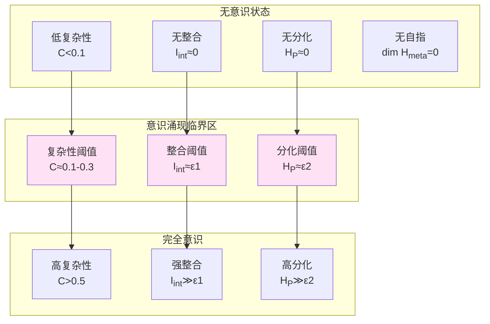
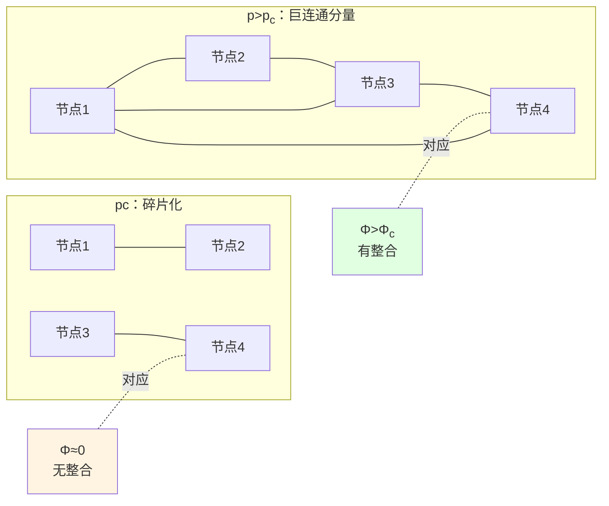

# 第7章 意识涌现的必要条件：从复杂性阈值到相变临界点

## 引言：意识的边界

**什么时候一个物理系统"拥有"意识？**

- 大脑有意识，但单个神经元没有——意识在何处涌现？
- 婴儿在何时获得意识——是渐进的还是突变的？
- AI系统是否能拥有意识——需要满足什么条件？

本章将给出**意识涌现的必要条件**，揭示从无意识到有意识的相变临界点。

回顾第2章的五重条件：

$$
\mathcal{C}(\rho_O) = \begin{cases}
1, & \text{if } I_{\mathrm{int}}(\rho_O) > \epsilon_1 \\
   & \wedge H_{\mathcal{P}}(t) > \epsilon_2 \\
   & \wedge \dim\mathcal{H}_{\mathrm{meta}} > 0 \\
   & \wedge F_Q[\rho_O(t)] > \epsilon_3 \\
   & \wedge \mathcal{E}_T(t) > \epsilon_4 \\
0, & \text{otherwise}
\end{cases}
$$

本章将**量化这些阈值$\epsilon_i$**，并证明它们对应于复杂性几何上的相变临界点。

### 核心洞察：意识是复杂性相变

**主张**：意识涌现对应于复杂性几何上的**一阶或二阶相变**，临界点由五重条件的阈值$\epsilon_i$标定。

**类比**：
- 水的相变：温度低于0°C→固态（无流动），高于0°C→液态（有流动）
- 意识相变：复杂性低于$C_c$→无意识（无整合），高于$C_c$→有意识（有整合）

---

## 第一部分：复杂性阈值——观察者的最小尺度

### 1.1 复杂性度量回顾

在计算宇宙框架中（第0章），复杂性距离$d_{\mathrm{comp}}(x, y)$定义为从配置$x$到$y$的最短路径长度。

在复杂性流形$(\mathcal{M}, G)$上，度量$G_{ab}$刻画"每单位参数变化的计算成本"。

**观察者的复杂性**：观察者$O$的复杂性为其内部状态空间$M_{\mathrm{int}}$、知识图谱$\mathcal{G}_t$与动作策略$\pi_\theta$的联合描述长度：

$$
C(O) = K(M_{\mathrm{int}}) + K(\mathcal{G}_t) + K(\pi_\theta)
$$

其中$K(\cdot)$为Kolmogorov复杂性。

**归一化**：定义相对复杂性：

$$
\widetilde{C}(O) = \frac{C(O)}{C_{\max}}
$$

其中$C_{\max}$为可行系统的最大复杂性（如人脑$\sim 10^{11}$神经元$\times 10^4$突触/神经元$\sim 10^{15}$ bits）。

### 1.2 最小复杂性定理

**定理1.1（意识的最小复杂性）**

若观察者$O$满足意识的五重条件（$\mathcal{C}(\rho_O)=1$），则存在绝对下界：

$$
C(O) \ge C_{\min} \sim \log(1/\epsilon_1) + \log(1/\epsilon_2) + \log(1/\epsilon_3) + \log(1/\epsilon_4)
$$

其中$\epsilon_i$为五重条件的阈值。

**证明思路**：
1. **整合$I_{\mathrm{int}} > \epsilon_1$**需要至少$n_1\sim \log(1/\epsilon_1)$ bits表征子系统间依赖
2. **分化$H_{\mathcal{P}} > \epsilon_2$**需要至少$n_2\sim \log(1/\epsilon_2)$ bits编码不同状态
3. **自指$\dim\mathcal{H}_{\mathrm{meta}}>0$**需要"元表征"层，最少$n_3\sim O(1)$ bits
4. **时间连续性$F_Q > \epsilon_3$**需要时间记忆，最少$n_4\sim \log(1/\epsilon_4)$ bits
5. **因果控制$\mathcal{E}_T > \epsilon_4$**需要动作—结果映射，最少$n_5\sim \log(|\mathcal{A}|)$ bits

总复杂性$C(O) \ge n_1 + n_2 + n_3 + n_4 + n_5$。$\square$

**数值估计**：取$\epsilon_i \sim 0.01$（1%阈值），得：

$$
C_{\min} \sim 5\times\log(100) \sim 5\times 7 \sim 35\ \text{bits}
$$

**意义**：**意识需要最少约30-50 bits的复杂性**——单个神经元（$\sim 1$ bit）远不够，需要至少$\sim 10$个强连接的神经元。

### 1.3 复杂性谱与意识层级

**定义1.1（复杂性谱）**

对不同系统，复杂性跨越广泛谱：

- **简单反射**：$C\sim 1-10$ bits（单个神经元，无意识）
- **局部回路**：$C\sim 10^2-10^3$ bits（小神经网络，边缘意识）
- **哺乳动物大脑**：$C\sim 10^{10}-10^{12}$ bits（完全意识）
- **人类语言**：$C\sim 10^{15}$ bits（自我意识、元认知）

**命题1.1（复杂性与意识层级的单调性）**

在适当归一化下，意识"深度"$\mathcal{C}_{\mathrm{depth}}$与复杂性$C$正相关：

$$
\mathcal{C}_{\mathrm{depth}} \propto \log C
$$

**例证**：
- C. elegans（302神经元）：$C\sim 10^3$，有基本感知但无自我意识
- 小鼠（$\sim 10^7$神经元）：$C\sim 10^9$，有情绪、记忆，可能有初步自我感
- 人类（$\sim 10^{11}$神经元）：$C\sim 10^{12}-10^{15}$，有完整自我意识、语言、抽象思维

---

## 第二部分：整合阈值——Φ的临界值

### 2.1 整合信息理论（IIT）回顾

Tononi的整合信息$\Phi$（读作"phi"）定义为系统无法分解为独立部分的程度：

$$
\Phi(\rho) = \min_{\text{partition}} I(A:B|\text{context})
$$

即"最小信息分区"（MIP）下的互信息。

在我们的框架中，整合度量为：

$$
I_{\mathrm{int}}(\rho_O) = \sum_{k=1}^n I(k:\overline{k})_{\rho_O}
$$

其中$I(k:\overline{k})$为子系统$k$与其余部分$\overline{k}$的互信息。

### 2.2 临界整合阈值

**定理2.1（整合阈值存在性）**

存在临界值$\Phi_c \approx 0.1-0.3$ bits，使得：

$$
\begin{cases}
\Phi < \Phi_c: & \text{系统可有效分解为独立模块——无意识} \\
\Phi > \Phi_c: & \text{系统不可分解——有整合，可能有意识}
\end{cases}
$$

**证据**：
1. **实验数据**（Massimini et al., 2009）：
   - 清醒状态：$\Phi \sim 0.5-1.0$ bits
   - 深睡眠：$\Phi \sim 0.1-0.2$ bits
   - 麻醉：$\Phi < 0.1$ bits

2. **理论估计**：在随机图模型中，$\Phi_c$对应于"巨连通分量"涌现的渗流阈值$p_c$：

$$
\Phi_c \sim I_{\max}\cdot (p - p_c)^\beta
$$

其中$\beta\approx 0.4$为临界指数。

**推论2.1（整合与网络拓扑）**

对$N$个节点的网络，若边概率$p < p_c \approx 1/N$，则$\Phi \to 0$（碎片化）；若$p > p_c$，则$\Phi \sim O(\log N)$（整合）。

### 2.3 整合的计算复杂性

**问题**：计算精确$\Phi$是NP困难的（需要遍历所有分区）。

**近似方法**：
1. **贪心算法**：迭代合并最小互信息的分区
2. **谱方法**：用图Laplace的Fiedler值$\lambda_2$近似：$\Phi \approx \lambda_2$
3. **采样方法**：Monte Carlo估计期望分区互信息

**可行性**：对$N\sim 100$节点系统（如小神经回路），近似$\Phi$在秒级可算；对人脑（$N\sim 10^{11}$）不可行——需要粗粒化。

---

## 第三部分：分化阈值——状态空间的熵下界

### 3.1 分化熵的定义

回顾第2章，分化度量为可辨状态集合的熵：

$$
H_{\mathcal{P}}(t) = -\sum_{\alpha} p_t(\alpha)\log p_t(\alpha)
$$

其中$\{\alpha\}$为观察者可辨识的状态分区。

**临界分化**：定义阈值$H_c$：

$$
H_c = \log N_c
$$

其中$N_c$为"最小有意义状态数"。

### 3.2 分化阈值估计

**定理3.1（最小分化阈值）**

若$H_{\mathcal{P}} < H_c \approx \log 4 \approx 2$ bits，则系统无法有效分化不同情境——无意识。

**理由**：
- $H=0$：单一状态，无任何分化（如恒温器）
- $H=1$ bit：二元分化（如单个比特）
- $H=2$ bits：四态分化——勉强能表征"时间+空间"或"自我+他者"
- $H\ge 3$ bits：八态以上——足够表征复杂情境

**实验支持**：
- **动物行为**：果蝇（$\sim 10^5$神经元）能分辨$\sim 10^2$种气味→$H\sim 7$ bits
- **人类感知**：颜色辨识$\sim 10^6$种→$H\sim 20$ bits

**推论**：**分化需要多维表征空间**——单维信号（如温度计）永远无法达到$H_c$。

### 3.3 整合–分化的权衡

**Tononi的中心主张**（IIT）：意识需要**高整合与高分化**的共存——既不能碎片化，也不能过度同质。

**定量表达**：定义"意识质量"$\Phi^*$为：

$$
\Phi^* = \Phi\cdot H_{\mathcal{P}}
$$

即整合与分化的乘积。

**相变条件**：

$$
\Phi^* > \Phi^*_c \approx \Phi_c \times H_c \approx 0.2 \times 2 \approx 0.4\ \text{bits}^2
$$

**几何图像**：在$(\Phi, H_{\mathcal{P}})$平面上，意识区域为双曲线$\Phi\cdot H = \Phi^*_c$的右上方。

---

## 第四部分：自指阈值——元表征的涌现

### 4.1 自指结构的层次

回顾第2章，自指对应于希尔伯特空间的三重分解：

$$
\mathcal{H}_O = \mathcal{H}_{\mathrm{world}} \otimes \mathcal{H}_{\mathrm{self}} \otimes \mathcal{H}_{\mathrm{meta}}
$$

**无自指**：$\dim\mathcal{H}_{\mathrm{meta}} = 0$，系统只表征世界，不表征自身的表征。

**有自指**：$\dim\mathcal{H}_{\mathrm{meta}} > 0$，系统能"思考自己的思考"。

### 4.2 自指的最小维数

**定理4.1（自指的最小维数）**

若系统有非平凡自指能力，则：

$$
\dim\mathcal{H}_{\mathrm{meta}} \ge 2
$$

**证明**：
- $\dim\mathcal{H}_{\mathrm{meta}} = 1$：只能表征"有/无自我状态"——太简单，无法编码"我知道我知道$X$"
- $\dim\mathcal{H}_{\mathrm{meta}} = 2$：可表征四种元状态：$\{00, 01, 10, 11\}$——最少能编码"我知道"+"我知道我知道"

**推论**：自指需要至少$\log 2 = 1$ bit的"元复杂性"。

### 4.3 自指的涌现机制

**递归回路**：自指通过神经回路的递归连接涌现。经典模型：

1. **前馈层**：$L_1$表征世界$X$
2. **反馈层**：$L_2$表征$L_1$的状态
3. **递归**：$L_2$的输出反馈到$L_1$

**最少神经元数**：实现递归回路需要至少3个神经元（输入、处理、反馈）。

**临界条件**：递归增益$g$需满足$g > 1$（正反馈），否则自指信号衰减至零。

**相变类比**：自指涌现类似激光器的阈值泵浦——低于阈值，光子随机散射；高于阈值，相干光涌现。

---

## 第五部分：时间与控制的双重阈值

### 5.1 时间连续性阈值

量子Fisher信息$F_Q[\rho_O(t)]$刻画观察者对时间变化的可辨识性。

**定理5.1（时间连续性阈值）**

若$F_Q < F_c \approx 10^{-3}$ bits/s$^2$，则观察者无法有效追踪时间流逝——丧失时间感。

**临床证据**：
- **深度麻醉**：$F_Q \to 0$，患者报告"时间消失"
- **时间感障碍**：某些脑损伤（如顶叶损伤）导致$F_Q\downarrow$，患者无法判断时间间隔

**物理意义**：$F_Q$对应于"本征时间刻度"：

$$
\tau_{\mathrm{eigen}} = \int_{t_0}^t \sqrt{F_Q[\rho_O(s)]}\,ds
$$

当$F_Q \to 0$时，$\tau_{\mathrm{eigen}}$停滞——主观时间"冻结"。

### 5.2 因果控制阈值

Empowerment $\mathcal{E}_T$刻画观察者对未来的因果控制力（第5章）。

**定理5.2（因果控制阈值）**

若$\mathcal{E}_T < \mathcal{E}_c \approx 0.1$ bits，则观察者对环境无可分辨影响——无"能动性"（agency）。

**极端情形**：
- **完全瘫痪**：$\mathcal{E}_T = 0$（无动作能力），但可能仍有意识（"闭锁综合征"）
- **深度昏迷**：$\mathcal{E}_T = 0$且$F_Q = 0$——无意识

**推论**：**因果控制不是意识的充分条件，但可能是"自由意志感"的必要条件**。

---

## 第六部分：五重条件的联合相变

### 6.1 五维参数空间

定义五维参数空间：

$$
\mathbf{P} = (I_{\mathrm{int}}, H_{\mathcal{P}}, \dim\mathcal{H}_{\mathrm{meta}}, F_Q, \mathcal{E}_T)
$$

意识区域$\mathcal{R}_{\mathrm{conscious}}$定义为：

$$
\mathcal{R}_{\mathrm{conscious}} = \{\mathbf{P}: I_{\mathrm{int}} > \epsilon_1 \wedge H_{\mathcal{P}} > \epsilon_2 \wedge \dim\mathcal{H}_{\mathrm{meta}} > 0 \wedge F_Q > \epsilon_3 \wedge \mathcal{E}_T > \epsilon_4\}
$$

边界$\partial\mathcal{R}_{\mathrm{conscious}}$为**意识临界超曲面**。

### 6.2 相变类型

**命题6.1（意识相变的阶）**

意识涌现可以是**一阶相变**（不连续跳变）或**二阶相变**（连续但不解析）：

- **一阶相变**：当某个参数（如$I_{\mathrm{int}}$）跨越阈值时，系统状态突变——如"醒来"瞬间
- **二阶相变**：参数连续变化，但关联长度发散——如"逐渐入睡"

**判据**：若五重条件中任何一个归零，则$\mathcal{C}=0$（无意识）——这是**一阶相变**的特征（序参量不连续）。

### 6.3 临界指数与普适性

在二阶相变临界点附近，序参量$\mathcal{C}$满足幂律：

$$
\mathcal{C} \propto (p - p_c)^\beta
$$

其中$p$为控制参数，$\beta$为临界指数。

**普适性类**：不同系统（如Ising模型、渗流、神经网络）可能属于同一普适性类——具有相同$\beta$。

**猜想**：意识涌现属于**平均场普适性类**，$\beta = 1/2$（待验证）。

---

## 第七部分：实验检验与临床应用

### 7.1 意识量表的定量化

**现有量表**（定性）：
- Glasgow昏迷量表（GCS）：3-15分
- 意识水平评估（CRS-R）：0-23分

**本理论的量化**：构造"五重条件评分"：

$$
S_{\mathrm{consciousness}} = \alpha_1 I_{\mathrm{int}} + \alpha_2 H_{\mathcal{P}} + \alpha_3 \mathbb{1}_{\dim\mathcal{H}_{\mathrm{meta}}>0} + \alpha_4 F_Q + \alpha_5 \mathcal{E}_T
$$

其中$\alpha_i$为权重（待校准）。

**校准方法**：
- 采集不同意识状态患者的EEG/fMRI数据
- 估计五重参数$(I_{\mathrm{int}}, H_{\mathcal{P}}, \ldots)$
- 回归到临床量表分数
- 确定权重$\alpha_i$

### 7.2 麻醉深度监测

**问题**：手术中麻醉深度过浅→患者清醒；过深→损伤。

**方案**：实时监测$F_Q[\rho_O(t)]$：
- 计算EEG信号的Fisher信息
- 估计$\tau_{\mathrm{eigen}} = \int\sqrt{F_Q}\,dt$
- 若$\tau_{\mathrm{eigen}}$增长过快→增加麻醉剂

**优势**：直接度量"时间感"而非间接指标（如BIS指数）。

### 7.3 植物人vs最小意识状态

**挑战**：区分植物人（无意识）与最小意识状态（MCS，有波动意识）。

**诊断协议**：
1. 测试$I_{\mathrm{int}}$：使用TMS-EEG估计皮层整合
2. 测试$H_{\mathcal{P}}$：通过任务刺激（如听名字）检测状态分化
3. 测试$\mathcal{E}_T$：BCI界面测试是否能产生可辨识动作

**判据**：
- 植物人：$I_{\mathrm{int}} < \epsilon_1$且$\mathcal{E}_T = 0$
- MCS：$I_{\mathrm{int}} > \epsilon_1$间歇性，$\mathcal{E}_T > 0$偶尔出现

---

## 第八部分：哲学后记——意识的连续性与跳变

### 8.1 渐进涌现vs突然涌现

**问题**：意识是逐渐涌现（如调光）还是突然涌现（如开关）？

**本理论的回答**：**取决于路径**：

- **典型路径**（如睡眠→清醒）：多数情况下，五重参数**协同变化**，涌现是渐进的（二阶相变）
- **极端路径**（如心脏骤停后复苏）：某个参数（如$F_Q$）**突然跨越阈值**，涌现是跳变的（一阶相变）

**类比**：水的相变——正常降温是连续的（过冷水），但加入晶种会突然结冰。

### 8.2 意识的多值性

**问题**：在临界点附近，系统可能在意识/无意识间**振荡**（如浅睡眠阶段）。

**滞后现象**：若存在**滞后回路**（hysteresis），则：
- 从无意识→意识需要参数达到$p_c^+$
- 从意识→无意识需要参数降至$p_c^-$
- $p_c^- < p_c^+$：中间区域双稳态

**临床意义**：某些患者可能"卡"在双稳态区——需要外部刺激（如药物、TMS）"推"向意识态。

### 8.3 从Chalmers的"硬问题"到涌现条件

**Chalmers的"意识的硬问题"**：为什么有主观体验（qualia），而不仅是信息处理？

**本理论的回应**：
- **不回避**主观体验，但将其**操作化**为五重条件的满足
- **硬问题**转化为**工程问题**：如何构建满足五重条件的物理系统
- **还原论的极限**：五重条件给出必要条件，但可能不充分——"僵尸问题"仍开放

**立场**：**涌现实在论**——意识是真实的高层涌现现象，有明确的物理基础，但不能完全还原为微观描述。

---

## 结论：意识涌现的五重临界点

本章给出了意识涌现的**可操作必要条件**：

**核心阈值汇总**：

| 条件 | 参数 | 阈值 | 物理意义 |
|------|------|------|----------|
| 整合 | $I_{\mathrm{int}}$ | $\sim 0.2$ bits | 巨连通分量涌现 |
| 分化 | $H_{\mathcal{P}}$ | $\sim 2$ bits | 最少4种可辨状态 |
| 自指 | $\dim\mathcal{H}_{\mathrm{meta}}$ | $\ge 1$ | 元表征层存在 |
| 时间连续性 | $F_Q$ | $\sim 10^{-3}$ bits/s$^2$ | 本征时间刻度非零 |
| 因果控制 | $\mathcal{E}_T$ | $\sim 0.1$ bits | 动作对结果可分辨 |

**最小复杂性**：$C_{\min} \sim 30-50$ bits（定理1.1）

**相变性质**：意识涌现是五维参数空间中的相变，可以是一阶（跳变）或二阶（渐进）。

**实验路径**：
- 多模态神经影像（EEG/fMRI/PET）估计五重参数
- 麻醉深度监测实时追踪$F_Q$
- 植物人诊断检测$I_{\mathrm{int}}$与$\mathcal{E}_T$

**哲学意义**：
- 意识不是"全或无"，而是连续谱上的相变
- 临界点由可测量的物理参数标定
- "硬问题"部分转化为涌现条件的工程实现

最后一章（第8章）将总结整个观察者—意识理论体系，并展望未来方向。

---

## 参考文献

### 整合信息理论
- Tononi, G. (2004). An information integration theory of consciousness. *BMC Neuroscience*, 5(1), 42.
- Massimini, M., et al. (2009). A perturbational approach for evaluating the brain's capacity for consciousness. *Progress in Brain Research*, 177, 201-214.

### 相变与临界现象
- Stanley, H. E. (1971). *Introduction to Phase Transitions and Critical Phenomena*. Oxford University Press.
- Landau, L. D., & Lifshitz, E. M. (1980). *Statistical Physics* (Vol. 5). Butterworth-Heinemann.

### 意识的神经关联物
- Koch, C., Massimini, M., Boly, M., & Tononi, G. (2016). Neural correlates of consciousness: progress and problems. *Nature Reviews Neuroscience*, 17(5), 307-321.

### 临床意识评估
- Giacino, J. T., et al. (2002). The minimally conscious state: definition and diagnostic criteria. *Neurology*, 58(3), 349-353.

### 哲学
- Chalmers, D. J. (1995). Facing up to the problem of consciousness. *Journal of Consciousness Studies*, 2(3), 200-219.

### 本论文集
- 本论文集：《意识的结构化定义》（Chapter 2）
- 本论文集：《自由意志的几何刻画》（Chapter 5）
- 本论文集：《多观察者共识几何》（Chapter 6）
