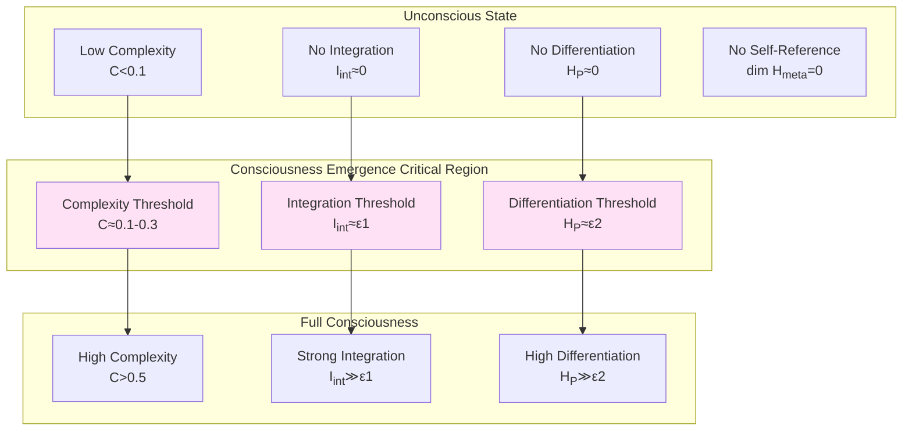
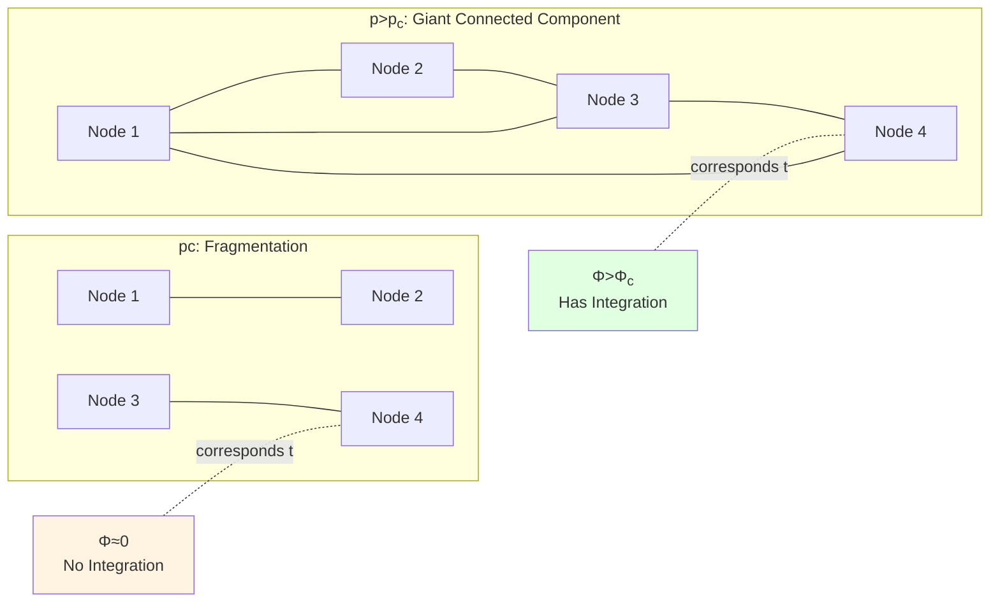

# Chapter 7: Necessary Conditions for Consciousness Emergence—From Complexity Thresholds to Phase Transition Critical Points

## Introduction: Boundaries of Consciousness

**When does a physical system "possess" consciousness?**

- Brain has consciousness, but single neuron doesn't—where does consciousness emerge?
- When does infant acquire consciousness—gradual or sudden?
- Can AI systems possess consciousness—what conditions need to be satisfied?

This chapter will give **necessary conditions for consciousness emergence**, revealing phase transition critical point from unconsciousness to consciousness.

Recall five conditions from Chapter 2:

$$
\mathcal{C}(\rho_O) = \begin{cases}
1, & \text{if } I_{\mathrm{int}}(\rho_O) > \epsilon_1 \\
   & \wedge H_{\mathcal{P}}(t) > \epsilon_2 \\
   & \wedge \dim\mathcal{H}_{\mathrm{meta}} > 0 \\
   & \wedge F_Q[\rho_O(t)] > \epsilon_3 \\
   & \wedge \mathcal{E}_T(t) > \epsilon_4 \\
0, & \text{otherwise}
\end{cases}
$$

This chapter will **quantify these thresholds $\epsilon_i$**, and prove they correspond to phase transition critical points on complexity geometry.

### Core Insight: Consciousness as Complexity Phase Transition

**Claim**: Consciousness emergence corresponds to **first-order or second-order phase transition** on complexity geometry, critical point marked by thresholds $\epsilon_i$ of five conditions.

**Analogy**:
- Water phase transition: Temperature below 0°C$\to$ solid (no flow), above 0°C$\to$ liquid (has flow)
- Consciousness phase transition: Complexity below $C_c$$\to$ unconscious (no integration), above $C_c$$\to$ conscious (has integration)

---

## Part One: Complexity Threshold—Minimum Scale of Observer

### 1.1 Review of Complexity Measure

In computational universe framework (Chapter 0), complexity distance $d_{\mathrm{comp}}(x, y)$ defined as shortest path length from configuration $x$ to $y$.

On complexity manifold $(\mathcal{M}, G)$, metric $G_{ab}$ characterizes "computational cost per unit parameter change".

**Observer's Complexity**: Complexity of observer $O$ is joint description length of its internal state space $M_{\mathrm{int}}$, knowledge graph $\mathcal{G}_t$, and action strategy $\pi_\theta$:

$$
C(O) = K(M_{\mathrm{int}}) + K(\mathcal{G}_t) + K(\pi_\theta)
$$

where $K(\cdot)$ is Kolmogorov complexity.

**Normalization**: Define relative complexity:

$$
\widetilde{C}(O) = \frac{C(O)}{C_{\max}}
$$

where $C_{\max}$ is maximum complexity of feasible systems (like human brain $\sim 10^{11}$ neurons $\times 10^4$ synapses/neuron $\sim 10^{15}$ bits).

### 1.2 Minimum Complexity Theorem

**Theorem 1.1 (Minimum Complexity of Consciousness)**

If observer $O$ satisfies five conditions of consciousness ($\mathcal{C}(\rho_O)=1$), then exists absolute lower bound:

$$
C(O) \ge C_{\min} \sim \log(1/\epsilon_1) + \log(1/\epsilon_2) + \log(1/\epsilon_3) + \log(1/\epsilon_4)
$$

where $\epsilon_i$ are thresholds of five conditions.

**Proof Idea**:
1. **Integration $I_{\mathrm{int}} > \epsilon_1$** needs at least $n_1\sim \log(1/\epsilon_1)$ bits to represent dependencies between subsystems
2. **Differentiation $H_{\mathcal{P}} > \epsilon_2$** needs at least $n_2\sim \log(1/\epsilon_2)$ bits to encode different states
3. **Self-Reference $\dim\mathcal{H}_{\mathrm{meta}}>0$** needs "meta-representation" layer, minimum $n_3\sim O(1)$ bits
4. **Temporal Continuity $F_Q > \epsilon_3$** needs temporal memory, minimum $n_4\sim \log(1/\epsilon_4)$ bits
5. **Causal Control $\mathcal{E}_T > \epsilon_4$** needs action–outcome mapping, minimum $n_5\sim \log(|\mathcal{A}|)$ bits

Total complexity $C(O) \ge n_1 + n_2 + n_3 + n_4 + n_5$. $\square$

**Numerical Estimate**: Taking $\epsilon_i \sim 0.01$ (1% threshold), get:

$$
C_{\min} \sim 5\times\log(100) \sim 5\times 7 \sim 35\ \text{bits}
$$

**Meaning**: **Consciousness needs minimum about 30-50 bits of complexity**—single neuron ($\sim 1$ bit) far insufficient, needs at least $\sim 10$ strongly connected neurons.

### 1.3 Complexity Spectrum and Consciousness Levels

**Definition 1.1 (Complexity Spectrum)**

For different systems, complexity spans wide spectrum:

- **Simple Reflex**: $C\sim 1-10$ bits (single neuron, no consciousness)
- **Local Circuit**: $C\sim 10^2-10^3$ bits (small neural network, marginal consciousness)
- **Mammalian Brain**: $C\sim 10^{10}-10^{12}$ bits (full consciousness)
- **Human Language**: $C\sim 10^{15}$ bits (self-awareness, metacognition)

**Proposition 1.1 (Monotonicity of Complexity and Consciousness Level)**

Under appropriate normalization, consciousness "depth" $\mathcal{C}_{\mathrm{depth}}$ positively correlated with complexity $C$:

$$
\mathcal{C}_{\mathrm{depth}} \propto \log C
$$

**Evidence**:
- C. elegans (302 neurons): $C\sim 10^3$, has basic perception but no self-awareness
- Mouse ($\sim 10^7$ neurons): $C\sim 10^9$, has emotions, memory, may have preliminary self-sense
- Human ($\sim 10^{11}$ neurons): $C\sim 10^{12}-10^{15}$, has complete self-awareness, language, abstract thinking

---

## Part Two: Integration Threshold—Critical Value of Φ

### 2.1 Review of Integrated Information Theory (IIT)

Tononi's integrated information $\Phi$ (read as "phi") defined as degree system cannot be decomposed into independent parts:

$$
\Phi(\rho) = \min_{\text{partition}} I(A:B|\text{context})
$$

That is mutual information under "minimum information partition" (MIP).

In our framework, integration measure is:

$$
I_{\mathrm{int}}(\rho_O) = \sum_{k=1}^n I(k:\overline{k})_{\rho_O}
$$

where $I(k:\overline{k})$ is mutual information between subsystem $k$ and remainder $\overline{k}$.

### 2.2 Critical Integration Threshold

**Theorem 2.1 (Existence of Integration Threshold)**

Exists critical value $\Phi_c \approx 0.1-0.3$ bits, such that:

$$
\begin{cases}
\Phi < \Phi_c: & \text{System can be effectively decomposed into independent modules—no consciousness} \\
\Phi > \Phi_c: & \text{System cannot be decomposed—has integration, may have consciousness}
\end{cases}
$$

**Evidence**:
1. **Experimental Data** (Massimini et al., 2009):
   - Awake state: $\Phi \sim 0.5-1.0$ bits
   - Deep sleep: $\Phi \sim 0.1-0.2$ bits
   - Anesthesia: $\Phi < 0.1$ bits

2. **Theoretical Estimate**: In random graph model, $\Phi_c$ corresponds to percolation threshold $p_c$ of "giant connected component" emergence:

$$
\Phi_c \sim I_{\max}\cdot (p - p_c)^\beta
$$

where $\beta\approx 0.4$ is critical exponent.

**Corollary 2.1 (Integration and Network Topology)**

For network of $N$ nodes, if edge probability $p < p_c \approx 1/N$, then $\Phi \to 0$ (fragmentation); if $p > p_c$, then $\Phi \sim O(\log N)$ (integration).

### 2.3 Computational Complexity of Integration

**Problem**: Computing exact $\Phi$ is NP-hard (needs traverse all partitions).

**Approximation Methods**:
1. **Greedy Algorithm**: Iteratively merge partitions with minimum mutual information
2. **Spectral Method**: Use Fiedler value $\lambda_2$ of graph Laplace to approximate: $\Phi \approx \lambda_2$
3. **Sampling Method**: Monte Carlo estimate expected partition mutual information

**Feasibility**: For $N\sim 100$ node systems (like small neural circuits), approximate $\Phi$ computable in seconds; for human brain ($N\sim 10^{11}$) infeasible—needs coarse-graining.

---

## Part Three: Differentiation Threshold—Entropy Lower Bound of State Space

### 3.1 Definition of Differentiation Entropy

Recall Chapter 2, differentiation measure is entropy of distinguishable state set:

$$
H_{\mathcal{P}}(t) = -\sum_{\alpha} p_t(\alpha)\log p_t(\alpha)
$$

where $\{\alpha\}$ is partition of states observer can distinguish.

**Critical Differentiation**: Define threshold $H_c$:

$$
H_c = \log N_c
$$

where $N_c$ is "minimum meaningful number of states".

### 3.2 Differentiation Threshold Estimate

**Theorem 3.1 (Minimum Differentiation Threshold)**

If $H_{\mathcal{P}} < H_c \approx \log 4 \approx 2$ bits, then system cannot effectively differentiate different situations—no consciousness.

**Reasoning**:
- $H=0$: Single state, no differentiation (like thermostat)
- $H=1$ bit: Binary differentiation (like single bit)
- $H=2$ bits: Four-state differentiation—barely can represent "time+space" or "self+other"
- $H\ge 3$ bits: Eight or more states—sufficient to represent complex situations

**Experimental Support**:
- **Animal Behavior**: Fruit fly ($\sim 10^5$ neurons) can distinguish $\sim 10^2$ odors$\to$$H\sim 7$ bits
- **Human Perception**: Color discrimination $\sim 10^6$ types$\to$$H\sim 20$ bits

**Corollary**: **Differentiation needs multi-dimensional representation space**—single-dimensional signal (like thermometer) can never reach $H_c$.

### 3.3 Integration–Differentiation Trade-off

**Tononi's Central Claim** (IIT): Consciousness needs coexistence of **high integration and high differentiation**—cannot be fragmented, nor overly homogeneous.

**Quantitative Expression**: Define "consciousness quality" $\Phi^*$ as:

$$
\Phi^* = \Phi\cdot H_{\mathcal{P}}
$$

That is product of integration and differentiation.

**Phase Transition Condition**:

$$
\Phi^* > \Phi^*_c \approx \Phi_c \times H_c \approx 0.2 \times 2 \approx 0.4\ \text{bits}^2
$$

**Geometric Picture**: On $(\Phi, H_{\mathcal{P}})$ plane, consciousness region is upper right of hyperbola $\Phi\cdot H = \Phi^*_c$.

---

## Part Four: Self-Reference Threshold—Emergence of Meta-Representation

### 4.1 Hierarchy of Self-Referential Structure

Recall Chapter 2, self-reference corresponds to triple decomposition of Hilbert space:

$$
\mathcal{H}_O = \mathcal{H}_{\mathrm{world}} \otimes \mathcal{H}_{\mathrm{self}} \otimes \mathcal{H}_{\mathrm{meta}}
$$

**No Self-Reference**: $\dim\mathcal{H}_{\mathrm{meta}} = 0$, system only represents world, doesn't represent own representation.

**Has Self-Reference**: $\dim\mathcal{H}_{\mathrm{meta}} > 0$, system can "think about own thinking".

### 4.2 Minimum Dimension of Self-Reference

**Theorem 4.1 (Minimum Dimension of Self-Reference)**

If system has non-trivial self-referential ability, then:

$$
\dim\mathcal{H}_{\mathrm{meta}} \ge 2
$$

**Proof**:
- $\dim\mathcal{H}_{\mathrm{meta}} = 1$: Can only represent "has/no self state"—too simple, cannot encode "I know I know $X$"
- $\dim\mathcal{H}_{\mathrm{meta}} = 2$: Can represent four meta-states: $\{00, 01, 10, 11\}$—minimum can encode "I know"+"I know I know"

**Corollary**: Self-reference needs at least $\log 2 = 1$ bit of "meta-complexity".

### 4.3 Emergence Mechanism of Self-Reference

**Recursive Circuit**: Self-reference emerges through recursive connections of neural circuits. Classic model:

1. **Feedforward Layer**: $L_1$ represents world $X$
2. **Feedback Layer**: $L_2$ represents state of $L_1$
3. **Recursion**: Output of $L_2$ feeds back to $L_1$

**Minimum Neuron Count**: Implementing recursive circuit needs at least 3 neurons (input, processing, feedback).

**Critical Condition**: Recursive gain $g$ must satisfy $g > 1$ (positive feedback), otherwise self-referential signal decays to zero.

**Phase Transition Analogy**: Self-reference emergence similar to laser threshold pumping—below threshold, photons randomly scatter; above threshold, coherent light emerges.

---

## Part Five: Dual Thresholds of Time and Control

### 5.1 Temporal Continuity Threshold

Quantum Fisher information $F_Q[\rho_O(t)]$ characterizes observer's discriminability of temporal changes.

**Theorem 5.1 (Temporal Continuity Threshold)**

If $F_Q < F_c \approx 10^{-3}$ bits/s$^2$, then observer cannot effectively track time passage—loses sense of time.

**Clinical Evidence**:
- **Deep Anesthesia**: $F_Q \to 0$, patients report "time disappears"
- **Time Perception Disorders**: Certain brain injuries (like parietal damage) cause $F_Q\downarrow$, patients cannot judge time intervals

**Physical Meaning**: $F_Q$ corresponds to "eigen time scale":

$$
\tau_{\mathrm{eigen}} = \int_{t_0}^t \sqrt{F_Q[\rho_O(s)]}\,ds
$$

When $F_Q \to 0$, $\tau_{\mathrm{eigen}}$ stagnates—subjective time "freezes".

### 5.2 Causal Control Threshold

Empowerment $\mathcal{E}_T$ characterizes observer's causal control over future (Chapter 5).

**Theorem 5.2 (Causal Control Threshold)**

If $\mathcal{E}_T < \mathcal{E}_c \approx 0.1$ bits, then observer has no distinguishable influence on environment—no "agency".

**Extreme Cases**:
- **Complete Paralysis**: $\mathcal{E}_T = 0$ (no action ability), but may still have consciousness ("locked-in syndrome")
- **Deep Coma**: $\mathcal{E}_T = 0$ and $F_Q = 0$—no consciousness

**Corollary**: **Causal control not sufficient condition for consciousness, but may be necessary condition for "sense of free will"**.

---

## Part Six: Joint Phase Transition of Five Conditions

### 6.1 Five-Dimensional Parameter Space

Define five-dimensional parameter space:

$$
\mathbf{P} = (I_{\mathrm{int}}, H_{\mathcal{P}}, \dim\mathcal{H}_{\mathrm{meta}}, F_Q, \mathcal{E}_T)
$$

Consciousness region $\mathcal{R}_{\mathrm{conscious}}$ defined as:

$$
\mathcal{R}_{\mathrm{conscious}} = \{\mathbf{P}: I_{\mathrm{int}} > \epsilon_1 \wedge H_{\mathcal{P}} > \epsilon_2 \wedge \dim\mathcal{H}_{\mathrm{meta}} > 0 \wedge F_Q > \epsilon_3 \wedge \mathcal{E}_T > \epsilon_4\}
$$

Boundary $\partial\mathcal{R}_{\mathrm{conscious}}$ is **consciousness critical hypersurface**.

### 6.2 Phase Transition Types

**Proposition 6.1 (Order of Consciousness Phase Transition)**

Consciousness emergence can be **first-order phase transition** (discontinuous jump) or **second-order phase transition** (continuous but non-analytic):

- **First-Order Phase Transition**: When some parameter (like $I_{\mathrm{int}}$) crosses threshold, system state suddenly changes—like "awakening" moment
- **Second-Order Phase Transition**: Parameters change continuously, but correlation length diverges—like "gradually falling asleep"

**Criterion**: If any of five conditions goes to zero, then $\mathcal{C}=0$ (no consciousness)—this is characteristic of **first-order phase transition** (order parameter discontinuous).

### 6.3 Critical Exponents and Universality

Near second-order phase transition critical point, order parameter $\mathcal{C}$ satisfies power law:

$$
\mathcal{C} \propto (p - p_c)^\beta
$$

where $p$ is control parameter, $\beta$ is critical exponent.

**Universality Class**: Different systems (like Ising model, percolation, neural networks) may belong to same universality class—have same $\beta$.

**Conjecture**: Consciousness emergence belongs to **mean-field universality class**, $\beta = 1/2$ (to be verified).

---

## Part Seven: Experimental Testing and Clinical Applications

### 7.1 Quantification of Consciousness Scales

**Existing Scales** (qualitative):
- Glasgow Coma Scale (GCS): 3-15 points
- Coma Recovery Scale-Revised (CRS-R): 0-23 points

**Quantification of This Theory**: Construct "five-condition score":

$$
S_{\mathrm{consciousness}} = \alpha_1 I_{\mathrm{int}} + \alpha_2 H_{\mathcal{P}} + \alpha_3 \mathbb{1}_{\dim\mathcal{H}_{\mathrm{meta}}>0} + \alpha_4 F_Q + \alpha_5 \mathcal{E}_T
$$

where $\alpha_i$ are weights (to be calibrated).

**Calibration Method**:
- Collect EEG/fMRI data from patients in different consciousness states
- Estimate five parameters $(I_{\mathrm{int}}, H_{\mathcal{P}}, \ldots)$
- Regress to clinical scale scores
- Determine weights $\alpha_i$

### 7.2 Anesthesia Depth Monitoring

**Problem**: In surgery, anesthesia too shallow$\to$ patient awake; too deep$\to$ damage.

**Solution**: Real-time monitoring of $F_Q[\rho_O(t)]$:
- Compute Fisher information of EEG signal
- Estimate $\tau_{\mathrm{eigen}} = \int\sqrt{F_Q}\,dt$
- If $\tau_{\mathrm{eigen}}$ grows too fast$\to$ increase anesthetic

**Advantage**: Directly measures "sense of time" rather than indirect indicators (like BIS index).

### 7.3 Vegetative State vs Minimally Conscious State

**Challenge**: Distinguish vegetative state (no consciousness) from minimally conscious state (MCS, fluctuating consciousness).

**Diagnostic Protocol**:
1. Test $I_{\mathrm{int}}$: Use TMS-EEG to estimate cortical integration
2. Test $H_{\mathcal{P}}$: Through task stimulation (like hearing name) detect state differentiation
3. Test $\mathcal{E}_T$: BCI interface test whether can produce distinguishable actions

**Criteria**:
- Vegetative state: $I_{\mathrm{int}} < \epsilon_1$ and $\mathcal{E}_T = 0$
- MCS: $I_{\mathrm{int}} > \epsilon_1$ intermittently, $\mathcal{E}_T > 0$ occasionally appears

---

## Part Eight: Philosophical Postscript—Continuity and Jump of Consciousness

### 8.1 Gradual Emergence vs Sudden Emergence

**Question**: Is consciousness gradually emergent (like dimming light) or suddenly emergent (like switch)?

**Answer of This Theory**: **Depends on path**:

- **Typical Path** (like sleep$\to$ awake): In most cases, five parameters **co-vary**, emergence is gradual (second-order phase transition)
- **Extreme Path** (like cardiac arrest recovery): Some parameter (like $F_Q$) **suddenly crosses threshold**, emergence is jump (first-order phase transition)

**Analogy**: Water phase transition—normal cooling is continuous (supercooled water), but adding seed crystal suddenly freezes.

### 8.2 Multi-Valuedness of Consciousness

**Question**: Near critical point, system may **oscillate** between consciousness/unconsciousness (like light sleep stage).

**Hysteresis Phenomenon**: If exists **hysteresis loop**, then:
- From unconsciousness$\to$ consciousness needs parameters reach $p_c^+$
- From consciousness$\to$ unconsciousness needs parameters drop to $p_c^-$
- $p_c^- < p_c^+$: Intermediate region bistable

**Clinical Significance**: Some patients may "stuck" in bistable region—need external stimulation (like drugs, TMS) to "push" toward conscious state.

### 8.3 From Chalmers' "Hard Problem" to Emergence Conditions

**Chalmers' "Hard Problem of Consciousness"**: Why is there subjective experience (qualia), not just information processing?

**Response of This Theory**:
- **Don't avoid** subjective experience, but **operationalize** it as satisfaction of five conditions
- **Hard problem** transforms into **engineering problem**: How to construct physical systems satisfying five conditions
- **Limit of Reductionism**: Five conditions give necessary conditions, but may not be sufficient—"zombie problem" still open

**Position**: **Emergent Realism**—consciousness is real high-level emergent phenomenon, has clear physical foundation, but cannot be completely reduced to microscopic description.

---

## Conclusion: Five Critical Points of Consciousness Emergence

This chapter gives **operational necessary conditions** for consciousness emergence:

**Core Threshold Summary**:

| Condition | Parameter | Threshold | Physical Meaning |
|-----------|-----------|-----------|------------------|
| Integration | $I_{\mathrm{int}}$ | $\sim 0.2$ bits | Giant connected component emergence |
| Differentiation | $H_{\mathcal{P}}$ | $\sim 2$ bits | Minimum 4 distinguishable states |
| Self-Reference | $\dim\mathcal{H}_{\mathrm{meta}}$ | $\ge 1$ | Meta-representation layer exists |
| Temporal Continuity | $F_Q$ | $\sim 10^{-3}$ bits/s$^2$ | Eigen time scale non-zero |
| Causal Control | $\mathcal{E}_T$ | $\sim 0.1$ bits | Actions have distinguishable effect on outcomes |

**Minimum Complexity**: $C_{\min} \sim 30-50$ bits (Theorem 1.1)

**Phase Transition Properties**: Consciousness emergence is phase transition in five-dimensional parameter space, can be first-order (jump) or second-order (gradual).

**Experimental Path**:
- Multimodal neuroimaging (EEG/fMRI/PET) estimate five parameters
- Anesthesia depth monitoring real-time track $F_Q$
- Vegetative state diagnosis test $I_{\mathrm{int}}$ and $\mathcal{E}_T$

**Philosophical Significance**:
- Consciousness not "all or nothing", but phase transition on continuous spectrum
- Critical point marked by measurable physical parameters
- "Hard problem" partially transforms into engineering implementation of emergence conditions

Final chapter (Chapter 8) will summarize entire observer–consciousness theory system, and look forward to future directions.

---

## References

### Integrated Information Theory
- Tononi, G. (2004). An information integration theory of consciousness. *BMC Neuroscience*, 5(1), 42.
- Massimini, M., et al. (2009). A perturbational approach for evaluating the brain's capacity for consciousness. *Progress in Brain Research*, 177, 201-214.

### Phase Transitions and Critical Phenomena
- Stanley, H. E. (1971). *Introduction to Phase Transitions and Critical Phenomena*. Oxford University Press.
- Landau, L. D., & Lifshitz, E. M. (1980). *Statistical Physics* (Vol. 5). Butterworth-Heinemann.

### Neural Correlates of Consciousness
- Koch, C., Massimini, M., Boly, M., & Tononi, G. (2016). Neural correlates of consciousness: progress and problems. *Nature Reviews Neuroscience*, 17(5), 307-321.

### Clinical Consciousness Assessment
- Giacino, J. T., et al. (2002). The minimally conscious state: definition and diagnostic criteria. *Neurology*, 58(3), 349-353.

### Philosophy
- Chalmers, D. J. (1995). Facing up to the problem of consciousness. *Journal of Consciousness Studies*, 2(3), 200-219.

### This Collection
- This collection: *Structural Definition of Consciousness* (Chapter 2)
- This collection: *Geometric Characterization of Free Will* (Chapter 5)
- This collection: *Multi-Observer Consensus Geometry* (Chapter 6)

