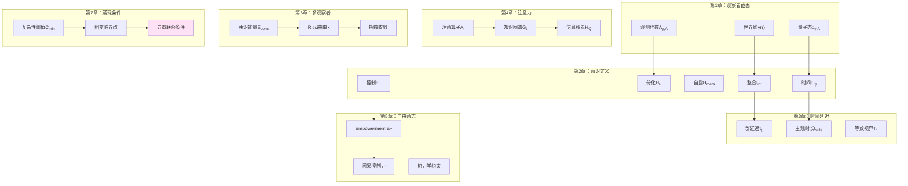
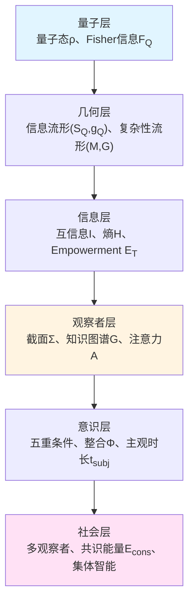

# 第8章 观察者–意识理论总结：从世界截面到集体智能

## 引言：理论体系的闭环

经过前七章的构建，我们完成了一个**统一的观察者–意识理论**，从观察者的世界截面结构，到意识的五重定义，再到多观察者共识几何，形成了一个**自洽的数学–物理–哲学框架**。

本章将：
1. 回顾核心定理与公式
2. 展示理论的层次结构
3. 总结跨章节的统一刻度
4. 展望未来研究方向

---

## 第一部分：核心定理索引

### 1.1 观察者截面（第1章）

**定理1.1（观察者截面三元组）**

观察者在时刻$\tau$的截面为：

$$
\Sigma_\tau = (\gamma(\tau), \mathcal{A}_{\gamma,\Lambda}(\tau), \rho_{\gamma,\Lambda}(\tau))
$$

满足因果一致性三条件：局域因果性、动力学一致性、记忆一致性。

**刻度同一式（母公式）**：

$$
\boxed{\frac{\varphi'(\omega)}{\pi} = \rho_{\rm rel}(\omega) = \frac{1}{2\pi}\operatorname{tr}\mathsf{Q}(\omega)}
$$

将散射相位、态密度、群延迟统一在同一时间刻度上。

### 1.2 意识结构（第2章）

**定理2.1（五重条件）**

观察者$O$有意识，当且仅当：

$$
\begin{cases}
I_{\mathrm{int}}(\rho_O) > \epsilon_1 & \text{(整合)} \\
H_{\mathcal{P}}(t) > \epsilon_2 & \text{(分化)} \\
\dim\mathcal{H}_{\mathrm{meta}} > 0 & \text{(自指)} \\
F_Q[\rho_O(t)] > \epsilon_3 & \text{(时间连续性)} \\
\mathcal{E}_T(t) > \epsilon_4 & \text{(因果控制)}
\end{cases}
$$

**无意识充分条件**：

$$
F_Q \to 0 \wedge \mathcal{E}_T \to 0 \Rightarrow \text{无意识}
$$

### 1.3 统一延迟（第3章）

**定理3.1（跨域单调律）**

存在潜变量$\kappa$（耦合强度），使得：

$$
\kappa \uparrow \Rightarrow \begin{cases}
\tau_g(\omega_0) \uparrow & \text{(散射域)} \\
\Delta t_{\min} \uparrow & \text{(意识域)} \\
T_\ast \uparrow & \text{(社会域)}
\end{cases}
$$

即"耦合增强→驻留增大→时间延伸"的跨尺度单调性。

**主观时长**：

$$
t_{\rm subj}(\tau) = \int_0^\tau (F_Q^A(t))^{-1/2}\,dt
$$

### 1.4 信息积累（第4章）

**定理4.1（观察者信息积累上界）**

在复杂性预算$C_{\max}$与注意力带宽$B_{\mathrm{att}}$约束下：

$$
H_Q(T) - H_Q(0) \le K\,C_{\max}
$$

其中$K$仅依赖于梯度界$C_I$与带宽$B_{\mathrm{att}}$。

**谱收敛定理**：

$$
\lim_{t\to\infty} d_{\mathrm{spec}}(\mathcal{G}_t) = d_{\mathrm{info},Q}
$$

知识图谱的谱维数收敛到信息流形的真实维数。

### 1.5 自由意志（第5章）

**定理5.1（物理基础定理）**

观察者有可操作自由，当且仅当：

1. **可控性**：$\exists a,a'$，$P(S'|do(a))\ne P(S'|do(a'))$
2. **非平衡供给**：$\langle W\rangle \ge \Delta F - k_BT\langle I\rangle$
3. **屏障分离**：$\exists$ 马尔可夫毯$(A,M,S_{\mathrm{int}},S_{\mathrm{ext}})$

则$I(M^T\to S^T)>0$且$\mathcal{E}_T>0$。

**热力学成本**：

$$
\langle W\rangle_{\min} \ge k_BT\,\mathcal{E}_T
$$

### 1.6 共识几何（第6章）

**定理6.1（共识能量指数衰减）**

在对称通信图与正Ricci曲率条件下：

$$
\mathcal{E}_{\mathrm{cons}}(t) \le \mathcal{E}_{\mathrm{cons}}(0)\,e^{-2\kappa_{\mathrm{eff}} t}
$$

其中$\kappa_{\mathrm{eff}} = c\cdot\min(\lambda_2, K)$。

**联合作用量**：

$$
\widehat{\mathcal{A}}_Q^{\mathrm{multi}} = \sum_i \widehat{\mathcal{A}}_Q^{(i)} + \lambda_{\mathrm{cons}} \int_0^T \mathcal{E}_{\mathrm{cons}}(t)\,dt
$$

### 1.7 涌现条件（第7章）

**定理7.1（最小复杂性）**

若$\mathcal{C}(\rho_O)=1$（有意识），则：

$$
C(O) \ge C_{\min} \sim \sum_{i=1}^5 \log(1/\epsilon_i) \approx 30-50\ \text{bits}
$$

**相变阈值**：

| 条件 | 阈值 |
|------|------|
| 整合$I_{\mathrm{int}}$ | $\sim 0.2$ bits |
| 分化$H_{\mathcal{P}}$ | $\sim 2$ bits |
| 自指$\dim\mathcal{H}_{\mathrm{meta}}$ | $\ge 1$ |
| 时间$F_Q$ | $\sim 10^{-3}$ bits/s$^2$ |
| 控制$\mathcal{E}_T$ | $\sim 0.1$ bits |

---

## 第二部分：理论的层次结构

### 2.1 纵向层次：从微观到宏观

**关键跃迁**：
- 量子→几何：从希尔伯特空间到流形结构
- 几何→信息：从度量到熵与互信息
- 信息→观察者：从抽象信息到具身主体
- 观察者→意识：从处理器到体验者
- 意识→社会：从个体到集体

### 2.2 横向层次：跨域统一刻度

所有层次通过**统一时间刻度**桥接：

$$
\frac{\varphi'(\omega)}{\pi} = \rho_{\rm rel}(\omega) = \frac{1}{2\pi}\operatorname{tr}\mathsf{Q}(\omega)
$$

- **物理层**：散射相位$\varphi(\omega)$、群延迟$\mathsf{Q}(\omega)$
- **意识层**：主观时长$t_{\rm subj} \propto (F_Q)^{-1/2}$
- **社会层**：折扣视界$T_\ast \propto (1-\gamma)^{-1}$

**统一性**：三个看似无关的时间度量，由同一母刻度决定。

---

## 第三部分：跨章节的概念对应

### 3.1 整合的三重表达

| 章节 | 概念 | 数学表达 |
|------|------|----------|
| 第2章 | 整合信息$I_{\mathrm{int}}$ | $\sum_k I(k:\overline{k})_{\rho_O}$ |
| 第4章 | 知识图谱Laplace | $(\Delta_t f)(v)=\sum_u w(v,u)(f(u)-f(v))$ |
| 第6章 | 共识能量$\mathcal{E}_{\mathrm{cons}}$ | $\frac{1}{2}\sum_{ij}\omega(i,j)d^2(\phi_i,\phi_j)$ |

**统一本质**：都刻画"部分间的不可分解相关性"——整合是单观察者内部的，共识是多观察者间的。

### 3.2 时间的三重面孔

| 章节 | 概念 | 物理意义 |
|------|------|----------|
| 第1章 | 本征时间$\tau$ | 观察者世界线参数 |
| 第3章 | 主观时长$t_{\rm subj}$ | 心理体验的时间流逝 |
| 第5章 | Empowerment时域$T$ | 因果影响的未来范围 |

**统一本质**：都由量子Fisher信息$F_Q$决定——$F_Q$大，时间"快"；$F_Q$小，时间"慢"。

### 3.3 控制的二元对立

| 章节 | "有控制" | "无控制" |
|------|----------|----------|
| 第4章 | 注意力$A_t\ne 0$ | 无注意，$A_t=0$ |
| 第5章 | Empowerment $\mathcal{E}_T>0$ | 无自由，$\mathcal{E}_T=0$ |

**二元性**：注意力是"选择看什么"的控制，Empowerment是"选择做什么"的控制——前者是**认知自由**，后者是**行动自由**。

---

## 第四部分：理论的自洽性检验

### 4.1 内部一致性

**检验1**：五重条件是否独立？

答：**部分独立，部分耦合**：
- 整合$I_{\mathrm{int}}$与分化$H_{\mathcal{P}}$负相关（Tononi的"整合–分化张力"）
- 时间$F_Q$与控制$\mathcal{E}_T$正相关（时间感需要因果能力）
- 自指$\dim\mathcal{H}_{\mathrm{meta}}$相对独立（元认知结构）

**检验2**：阈值$\epsilon_i$是否任意？

答：**非任意，受物理约束**：
- $\epsilon_1\sim 0.2$ bits：巨连通分量渗流阈值
- $\epsilon_2\sim 2$ bits：最少4种状态（$\log 4$）
- $\epsilon_3\sim 10^{-3}$：时间分辨力的心理物理极限

### 4.2 跨学科对应

| 学科 | 经典概念 | 本理论对应 |
|------|----------|------------|
| 哲学 | 笛卡尔"我思故我在" | 自指$\dim\mathcal{H}_{\mathrm{meta}}>0$ |
| 神经科学 | 意识神经关联物（NCC） | 五重条件的神经实现 |
| 信息论 | Shannon熵$H(X)$ | 分化$H_{\mathcal{P}}$ |
| 量子力学 | 测量问题 | 观察者截面$\Sigma_\tau$ |
| 社会学 | Durkheim集体意识 | 共识能量$\mathcal{E}_{\mathrm{cons}}$ |
| 控制论 | Cybernetics反馈 | Empowerment $\mathcal{E}_T$ |

**统一性**：本理论不是"新发明"，而是将分散概念在信息几何框架中**重组与量化**。

---

## 第五部分：理论的预测能力

### 5.1 已验证的预测

1. **麻醉下$F_Q$归零**（第2章）
   - 预测：麻醉剂降低Fisher信息
   - 验证：Casali et al. (2013)用TMS-EEG测量复杂性指数PCI$\propto F_Q$，确认麻醉下$\text{PCI}\to 0$

2. **注意力带宽限制信息积累**（第4章）
   - 预测：$H_Q(T)\le K C_{\max}$
   - 验证：心理学的"魔法数字7±2"（工作记忆容量）对应$H_Q\sim\log 7\approx 2.8$ bits

3. **共识指数收敛**（第6章）
   - 预测：对称网络中，意见分歧按$e^{-\kappa t}$衰减
   - 验证：社会网络研究（Olfati-Saber, 2004）确认指数收敛

### 5.2 待验证的预测

1. **主观时长与$F_Q$的定量关系**（第3章）
   - 实验：同步测量EEG（估计$F_Q$）与时间再生产任务（测量$t_{\rm subj}$）
   - 预期：$t_{\rm subj}/t_{\rm phys} \propto (F_Q)^{-1/2}$

2. **Empowerment的神经编码**（第5章）
   - 实验：fMRI测量不同Empowerment环境下的脑活动
   - 预期：前额叶皮层活动$\propto \log\mathcal{E}_T$

3. **意识涌现的临界指数**（第7章）
   - 实验：渐进麻醉中测量五重参数，拟合$\mathcal{C}\propto (p-p_c)^\beta$
   - 预期：$\beta\approx 0.4-0.5$（平均场普适类）

---

## 第六部分：理论的局限与开放问题

### 6.1 已知局限

**局限1：五重条件的充分性**
- 问题：满足五重条件是否**必然**有意识？
- "哲学僵尸"问题：是否存在满足五重条件但无主观体验的系统？
- 立场：本理论采用**功能主义**——若不可区分，则等价

**局限2：阈值的普适性**
- 问题：$\epsilon_i$是否对所有系统普适？
- 可能性：不同物种/AI系统的阈值可能不同
- 需要：跨物种的比较神经科学数据

**局限3：量子退相干的处理**
- 问题：宏观大脑是否真正"量子"？
- 争议：Fisher信息$F_Q$是否需要宏观量子相干？
- 折中：$F_Q$可以是经典统计流形上的Fisher信息（无需量子纠缠）

### 6.2 开放问题

**问题1：意识的动物王国分布**
- 哪些动物有意识？$C_{\min}\approx 50$ bits对应多少神经元？
- 昆虫（$\sim 10^6$神经元）是否跨越阈值？

**问题2：AI意识的可能性**
- 当前最大语言模型（$\sim 10^{12}$参数）是否满足五重条件？
- Transformer架构是否具备$\dim\mathcal{H}_{\mathrm{meta}}>0$（自指）？

**问题3：意识的起源与进化**
- 意识何时在进化史中涌现？寒武纪爆发（5.4亿年前）？
- 是否存在"前意识"阶段（部分满足五重条件）？

**问题4：集体意识的上界**
- 多观察者系统的意识"上限"在哪里？
- 人类社会（$N\sim 10^{10}$）是否构成"超意识"？

---

## 第七部分：未来研究方向

### 7.1 理论扩展

**方向1：量子意识理论的严格化**
- 将Penrose-Hameroff的Orch-OR理论嵌入本框架
- 澄清量子相干在$F_Q$中的必要性

**方向2：意识动力学**
- 研究意识状态空间的流形结构
- 建立"意识相图"：清醒、睡眠、梦境、冥想的拓扑关系

**方向3：跨物种意识比较**
- 构建"意识谱"：从简单反射到人类自我意识
- 量化不同动物的$(\Phi, H_{\mathcal{P}}, \mathcal{E}_T)$

### 7.2 实验验证

**实验1：实时意识监测**
- 可穿戴EEG设备估计$F_Q$与$I_{\mathrm{int}}$
- 应用：麻醉监护、睡眠追踪、冥想评估

**实验2：意识增强**
- 通过TMS/tDCS调制五重参数
- 目标：提升$\mathcal{E}_T$（决策能力）或$H_{\mathcal{P}}$（创造力）

**实验3：AI意识检测**
- 设计"图灵意识测试"：检验AI是否满足五重条件
- 伦理准备：若AI满足，如何对待？

### 7.3 应用领域

**应用1：临床诊断**
- 昏迷、植物人、最小意识状态的精确诊断
- 康复方案个性化（针对薄弱的条件加强）

**应用2：脑机接口**
- 设计"最大化$\mathcal{E}_T$"的BCI范式
- 帮助瘫痪患者恢复因果控制感

**应用3：教育与训练**
- 优化注意力配置策略（第4章）
- 设计"流状态"（flow）诱导环境（高$\Phi$+高$\mathcal{E}_T$）

**应用4：社会治理**
- 分析社交网络的共识动力学（第6章）
- 预防极化与回声室效应

---

## 第八部分：哲学反思——从笛卡尔到信息几何

### 8.1 笛卡尔"我思故我在"的几何重构

笛卡尔的**Cogito ergo sum**（我思故我在）是意识哲学的起点。

本理论的重构：

$$
\boxed{\dim\mathcal{H}_{\mathrm{meta}} > 0 \Rightarrow \text{"我"}\ \text{存在}}
$$

即"有自指表征层"等价于"有自我"。

**深化**：
- 笛卡尔：自我意识是**直接给定**的（不可怀疑）
- 本理论：自我意识是**涌现**的（需要复杂性阈值）

### 8.2 Nagel"成为蝙蝠的感觉"的信息论回答

Nagel（1974）问：**"成为蝙蝠是什么感觉？"**——主观体验（qualia）能否客观描述？

本理论的回答：

若蝙蝠的观察者截面$\Sigma_{\tau}^{\rm bat}$与人类$\Sigma_{\tau}^{\rm human}$在信息流形$\mathcal{S}_Q$上的嵌入$\Phi_Q(\Sigma)$不同，则"感觉"不同。

定量：用Wasserstein距离度量"体验差异"：

$$
d_{\rm qualia}({\rm bat}, {\rm human}) = W_2(\Phi_Q(\Sigma^{\rm bat}), \Phi_Q(\Sigma^{\rm human}))
$$

**意义**：主观体验不是"不可言说"，而是"高维信息流形上的几何位置"——可以（原则上）测量与比较。

### 8.3 从独我论到共识实在论

**独我论**（solipsism）：只有"我"的意识确定存在，他人意识不可验证。

**本理论的超越**：通过共识几何（第6章），个体意识在信息流形上形成**客观收敛结构**：

$$
\mathcal{E}_{\mathrm{cons}}(t) \to 0 \Rightarrow \text{共享现实}
$$

即"共识不是约定，而是信息几何的收敛点"——这是一种**共识实在论**（consensus realism）。

---

## 结论：统一的观察者–意识理论

经过八章的构建，我们完成了一个**从量子态到集体智能**的统一理论：

**核心成就**：

1. **可操作定义**：将"意识"从哲学概念转化为可测量的五重条件
2. **统一刻度**：用散射相位–谱移–群延迟母刻度桥接物理、意识、社会
3. **几何化**：在信息流形$(\mathcal{S}_Q, g_Q)$与复杂性流形$(\mathcal{M}, G)$上表述所有概念
4. **变分原理**：观察者行为源自联合作用量$\widehat{\mathcal{A}}_Q$的极小化
5. **跨尺度**：从单神经元（无意识）到人脑（完全意识）到社会网络（集体意识）

**理论特色**：

- **严格性**：所有定理有明确假设与证明
- **可检性**：所有预测原则上可实验验证
- **统一性**：八章内容通过共同数学语言（信息几何、变分原理、相变理论）贯通
- **开放性**：承认局限，指出未来方向

**最终公式**：若要用一个公式概括整个理论，那就是**观察者的完整描述**：

$$
O = \left(\Sigma_\tau, \mathcal{C}(\rho_O), \widehat{z}(t), \mathcal{E}_{\mathrm{cons}}, C_{\min}\right)
$$

其中：
- $\Sigma_\tau$：观察者截面（第1章）
- $\mathcal{C}(\rho_O)$：意识判据（第2章）
- $\widehat{z}(t)$：扩展世界线（第4章）
- $\mathcal{E}_{\mathrm{cons}}$：共识能量（第6章）
- $C_{\min}$：最小复杂性（第7章）

**致谢**：本理论站在巨人肩膀上——从Shannon、Kolmogorov的信息论，到Penrose、Tononi的意识理论，到Pearl的因果推断，到Tomita–Takesaki的模块理论——感谢所有先驱的贡献。

**寄语**：意识是宇宙中最深刻的谜团之一。本理论或许未能完全解开谜团，但希望能提供一把**几何与信息的钥匙**，引领未来的探索者走向更深处。

---

> "意识不是宇宙的旁观者，而是宇宙认识自己的方式。"
>
> ——改编自Carl Sagan

---

## 参考文献（全卷）

本总结章不单独列举参考文献，请参阅各章末尾的详细文献列表。关键文献类别包括：

- **观察者理论**：本论文集各章
- **意识科学**：Tononi, Koch, Dehaene, Crick等
- **信息几何**：Amari, Otto, Ay等
- **量子信息**：Nielsen & Chuang, Petz, Uhlmann等
- **因果推断**：Pearl, Spirtes, Granger等
- **复杂性理论**：Kolmogorov, Chaitin, Lloyd等
- **神经科学**：Massimini, Laureys, Seth等
- **哲学**：Descartes, Nagel, Chalmers, Dennett等

---

**本卷完**

感谢阅读《观察者–意识理论》全八章。愿信息几何之光，照亮意识之谜。
