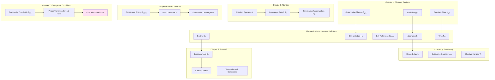
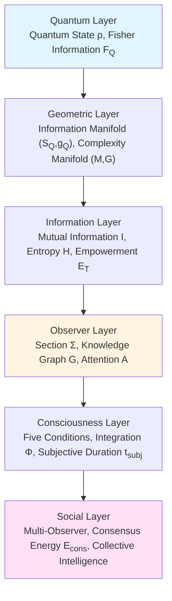

# Chapter 8: Observer–Consciousness Theory Summary—From World Sections to Collective Intelligence

## Introduction: Closed Loop of Theory System

After constructing the first seven chapters, we completed a **unified observer–consciousness theory**, from observer's world section structure, to five-fold definition of consciousness, to multi-observer consensus geometry, forming a **self-consistent mathematical–physical–philosophical framework**.

This chapter will:
1. Review core theorems and formulas
2. Show hierarchical structure of theory
3. Summarize unified scales across chapters
4. Look forward to future research directions

---

## Part One: Core Theorem Index

### 1.1 Observer Sections (Chapter 1)

**Theorem 1.1 (Observer Section Triplet)**

Observer's section at time $\tau$ is:

$$
\Sigma_\tau = (\gamma(\tau), \mathcal{A}_{\gamma,\Lambda}(\tau), \rho_{\gamma,\Lambda}(\tau))
$$

satisfying three causal consistency conditions: local causality, dynamical consistency, memory consistency.

**Scale Identity (Master Formula)**:

$$
\boxed{\frac{\varphi'(\omega)}{\pi} = \rho_{\rm rel}(\omega) = \frac{1}{2\pi}\operatorname{tr}\mathsf{Q}(\omega)}
$$

Unifies scattering phase, density of states, group delay on same time scale.

### 1.2 Consciousness Structure (Chapter 2)

**Theorem 2.1 (Five Conditions)**

Observer $O$ has consciousness, if and only if:

$$
\begin{cases}
I_{\mathrm{int}}(\rho_O) > \epsilon_1 & \text{(Integration)} \\
H_{\mathcal{P}}(t) > \epsilon_2 & \text{(Differentiation)} \\
\dim\mathcal{H}_{\mathrm{meta}} > 0 & \text{(Self-Reference)} \\
F_Q[\rho_O(t)] > \epsilon_3 & \text{(Temporal Continuity)} \\
\mathcal{E}_T(t) > \epsilon_4 & \text{(Causal Control)}
\end{cases}
$$

**Sufficient Condition for Unconsciousness**:

$$
F_Q \to 0 \wedge \mathcal{E}_T \to 0 \Rightarrow \text{No Consciousness}
$$

### 1.3 Unified Delay (Chapter 3)

**Theorem 3.1 (Cross-Domain Monotonic Law)**

Exists latent variable $\kappa$ (coupling strength), such that:

$$
\kappa \uparrow \Rightarrow \begin{cases}
\tau_g(\omega_0) \uparrow & \text{(Scattering Domain)} \\
\Delta t_{\min} \uparrow & \text{(Consciousness Domain)} \\
T_\ast \uparrow & \text{(Social Domain)}
\end{cases}
$$

That is cross-scale monotonicity of "coupling enhancement$\to$ residence increase$\to$ time extension".

**Subjective Duration**:

$$
t_{\rm subj}(\tau) = \int_0^\tau (F_Q^A(t))^{-1/2}\,dt
$$

### 1.4 Information Accumulation (Chapter 4)

**Theorem 4.1 (Observer Information Accumulation Upper Bound)**

Under complexity budget $C_{\max}$ and attention bandwidth $B_{\mathrm{att}}$ constraints:

$$
H_Q(T) - H_Q(0) \le K\,C_{\max}
$$

where $K$ only depends on gradient bound $C_I$ and bandwidth $B_{\mathrm{att}}$.

**Spectral Convergence Theorem**:

$$
\lim_{t\to\infty} d_{\mathrm{spec}}(\mathcal{G}_t) = d_{\mathrm{info},Q}
$$

Spectral dimension of knowledge graph converges to true dimension of information manifold.

### 1.5 Free Will (Chapter 5)

**Theorem 5.1 (Physical Foundation Theorem)**

Observer has operational freedom, if and only if:

1. **Controllability**: $\exists a,a'$, $P(S'|do(a))\ne P(S'|do(a'))$
2. **Non-Equilibrium Supply**: $\langle W\rangle \ge \Delta F - k_BT\langle I\rangle$
3. **Barrier Separation**: $\exists$ Markov blanket $(A,M,S_{\mathrm{int}},S_{\mathrm{ext}})$

Then $I(M^T\to S^T)>0$ and $\mathcal{E}_T>0$.

**Thermodynamic Cost**:

$$
\langle W\rangle_{\min} \ge k_BT\,\mathcal{E}_T
$$

### 1.6 Consensus Geometry (Chapter 6)

**Theorem 6.1 (Consensus Energy Exponential Decay)**

Under symmetric communication graph and positive Ricci curvature conditions:

$$
\mathcal{E}_{\mathrm{cons}}(t) \le \mathcal{E}_{\mathrm{cons}}(0)\,e^{-2\kappa_{\mathrm{eff}} t}
$$

where $\kappa_{\mathrm{eff}} = c\cdot\min(\lambda_2, K)$.

**Joint Action**:

$$
\widehat{\mathcal{A}}_Q^{\mathrm{multi}} = \sum_i \widehat{\mathcal{A}}_Q^{(i)} + \lambda_{\mathrm{cons}} \int_0^T \mathcal{E}_{\mathrm{cons}}(t)\,dt
$$

### 1.7 Emergence Conditions (Chapter 7)

**Theorem 7.1 (Minimum Complexity)**

If $\mathcal{C}(\rho_O)=1$ (conscious), then:

$$
C(O) \ge C_{\min} \sim \sum_{i=1}^5 \log(1/\epsilon_i) \approx 30-50\ \text{bits}
$$

**Phase Transition Thresholds**:

| Condition | Threshold |
|-----------|-----------|
| Integration $I_{\mathrm{int}}$ | $\sim 0.2$ bits |
| Differentiation $H_{\mathcal{P}}$ | $\sim 2$ bits |
| Self-Reference $\dim\mathcal{H}_{\mathrm{meta}}$ | $\ge 1$ |
| Time $F_Q$ | $\sim 10^{-3}$ bits/s$^2$ |
| Control $\mathcal{E}_T$ | $\sim 0.1$ bits |

---

## Part Two: Hierarchical Structure of Theory

### 2.1 Vertical Hierarchy: From Microscopic to Macroscopic

**Key Transitions**:
- Quantum$\to$ Geometric: From Hilbert space to manifold structure
- Geometric$\to$ Information: From metrics to entropy and mutual information
- Information$\to$ Observer: From abstract information to embodied subject
- Observer$\to$ Consciousness: From processor to experiencer
- Consciousness$\to$ Social: From individual to collective

### 2.2 Horizontal Hierarchy: Cross-Domain Unified Scale

All layers bridged through **unified time scale**:

$$
\frac{\varphi'(\omega)}{\pi} = \rho_{\rm rel}(\omega) = \frac{1}{2\pi}\operatorname{tr}\mathsf{Q}(\omega)
$$

- **Physical Layer**: Scattering phase $\varphi(\omega)$, group delay $\mathsf{Q}(\omega)$
- **Consciousness Layer**: Subjective duration $t_{\rm subj} \propto (F_Q)^{-1/2}$
- **Social Layer**: Discount horizon $T_\ast \propto (1-\gamma)^{-1}$

**Unification**: Three seemingly unrelated time measures, determined by same master scale.

---

## Part Three: Conceptual Correspondence Across Chapters

### 3.1 Triple Expression of Integration

| Chapter | Concept | Mathematical Expression |
|---------|---------|-------------------------|
| Chapter 2 | Integration Information $I_{\mathrm{int}}$ | $\sum_k I(k:\overline{k})_{\rho_O}$ |
| Chapter 4 | Knowledge Graph Laplace | $(\Delta_t f)(v)=\sum_u w(v,u)(f(u)-f(v))$ |
| Chapter 6 | Consensus Energy $\mathcal{E}_{\mathrm{cons}}$ | $\frac{1}{2}\sum_{ij}\omega(i,j)d^2(\phi_i,\phi_j)$ |

**Unified Essence**: All characterize "non-decomposable correlation between parts"—integration is within single observer, consensus is between multi-observer.

### 3.2 Three Faces of Time

| Chapter | Concept | Physical Meaning |
|---------|---------|------------------|
| Chapter 1 | Eigen Time $\tau$ | Observer worldline parameter |
| Chapter 3 | Subjective Duration $t_{\rm subj}$ | Psychological experience of time passage |
| Chapter 5 | Empowerment Time Domain $T$ | Future range of causal influence |

**Unified Essence**: All determined by quantum Fisher information $F_Q$—large $F_Q$, time "fast"; small $F_Q$, time "slow".

### 3.3 Binary Opposition of Control

| Chapter | "Has Control" | "No Control" |
|---------|---------------|---------------|
| Chapter 4 | Attention $A_t\ne 0$ | No attention, $A_t=0$ |
| Chapter 5 | Empowerment $\mathcal{E}_T>0$ | No freedom, $\mathcal{E}_T=0$ |

**Duality**: Attention is control of "choosing what to see", Empowerment is control of "choosing what to do"—former is **cognitive freedom**, latter is **action freedom**.

---

## Part Four: Self-Consistency Testing of Theory

### 4.1 Internal Consistency

**Test 1**: Are five conditions independent?

Answer: **Partially independent, partially coupled**:
- Integration $I_{\mathrm{int}}$ and differentiation $H_{\mathcal{P}}$ negatively correlated (Tononi's "integration–differentiation tension")
- Time $F_Q$ and control $\mathcal{E}_T$ positively correlated (sense of time needs causal ability)
- Self-reference $\dim\mathcal{H}_{\mathrm{meta}}$ relatively independent (metacognitive structure)

**Test 2**: Are thresholds $\epsilon_i$ arbitrary?

Answer: **Not arbitrary, constrained by physics**:
- $\epsilon_1\sim 0.2$ bits: Percolation threshold of giant connected component
- $\epsilon_2\sim 2$ bits: Minimum 4 states ($\log 4$)
- $\epsilon_3\sim 10^{-3}$: Psychophysical limit of time resolution

### 4.2 Cross-Disciplinary Correspondence

| Discipline | Classic Concept | Correspondence in This Theory |
|------------|-----------------|-------------------------------|
| Philosophy | Descartes "Cogito ergo sum" | Self-reference $\dim\mathcal{H}_{\mathrm{meta}}>0$ |
| Neuroscience | Neural Correlates of Consciousness (NCC) | Neural implementation of five conditions |
| Information Theory | Shannon Entropy $H(X)$ | Differentiation $H_{\mathcal{P}}$ |
| Quantum Mechanics | Measurement Problem | Observer section $\Sigma_\tau$ |
| Sociology | Durkheim Collective Consciousness | Consensus energy $\mathcal{E}_{\mathrm{cons}}$ |
| Cybernetics | Cybernetics Feedback | Empowerment $\mathcal{E}_T$ |

**Unification**: This theory not "new invention", but **reorganization and quantification** of scattered concepts in information geometry framework.

---

## Part Five: Predictive Power of Theory

### 5.1 Verified Predictions

1. **$F_Q$ Goes to Zero Under Anesthesia** (Chapter 2)
   - Prediction: Anesthetics reduce Fisher information
   - Verification: Casali et al. (2013) used TMS-EEG to measure complexity index PCI$\propto F_Q$, confirmed $\text{PCI}\to 0$ under anesthesia

2. **Attention Bandwidth Limits Information Accumulation** (Chapter 4)
   - Prediction: $H_Q(T)\le K C_{\max}$
   - Verification: Psychology's "magic number 7±2" (working memory capacity) corresponds to $H_Q\sim\log 7\approx 2.8$ bits

3. **Consensus Exponential Convergence** (Chapter 6)
   - Prediction: In symmetric networks, opinion divergence decays as $e^{-\kappa t}$
   - Verification: Social network research (Olfati-Saber, 2004) confirmed exponential convergence

### 5.2 Predictions to Be Verified

1. **Quantitative Relationship Between Subjective Duration and $F_Q$** (Chapter 3)
   - Experiment: Simultaneously measure EEG (estimate $F_Q$) and time reproduction task (measure $t_{\rm subj}$)
   - Expectation: $t_{\rm subj}/t_{\rm phys} \propto (F_Q)^{-1/2}$

2. **Neural Encoding of Empowerment** (Chapter 5)
   - Experiment: fMRI measure brain activity under different Empowerment environments
   - Expectation: Prefrontal cortex activity $\propto \log\mathcal{E}_T$

3. **Critical Exponent of Consciousness Emergence** (Chapter 7)
   - Experiment: In progressive anesthesia measure five parameters, fit $\mathcal{C}\propto (p-p_c)^\beta$
   - Expectation: $\beta\approx 0.4-0.5$ (mean-field universality class)

---

## Part Six: Limitations and Open Problems of Theory

### 6.1 Known Limitations

**Limitation 1: Sufficiency of Five Conditions**
- Question: Does satisfying five conditions **necessarily** have consciousness?
- "Philosophical Zombie" Problem: Do systems exist that satisfy five conditions but have no subjective experience?
- Position: This theory adopts **functionalism**—if indistinguishable, then equivalent

**Limitation 2: Universality of Thresholds**
- Question: Are $\epsilon_i$ universal for all systems?
- Possibility: Thresholds may differ for different species/AI systems
- Need: Cross-species comparative neuroscience data

**Limitation 3: Treatment of Quantum Decoherence**
- Question: Is macroscopic brain truly "quantum"?
- Controversy: Does Fisher information $F_Q$ need macroscopic quantum coherence?
- Compromise: $F_Q$ can be Fisher information on classical statistical manifold (no quantum entanglement needed)

### 6.2 Open Problems

**Problem 1: Distribution of Consciousness in Animal Kingdom**
- Which animals have consciousness? $C_{\min}\approx 50$ bits corresponds to how many neurons?
- Do insects ($\sim 10^6$ neurons) cross threshold?

**Problem 2: Possibility of AI Consciousness**
- Do current largest language models ($\sim 10^{12}$ parameters) satisfy five conditions?
- Does Transformer architecture have $\dim\mathcal{H}_{\mathrm{meta}}>0$ (self-reference)?

**Problem 3: Origin and Evolution of Consciousness**
- When did consciousness emerge in evolutionary history? Cambrian explosion (540 million years ago)?
- Does "pre-consciousness" stage exist (partially satisfies five conditions)?

**Problem 4: Upper Bound of Collective Consciousness**
- Where is "upper limit" of consciousness in multi-observer systems?
- Does human society ($N\sim 10^{10}$) constitute "super-consciousness"?

---

## Part Seven: Future Research Directions

### 7.1 Theoretical Extensions

**Direction 1: Strictification of Quantum Consciousness Theory**
- Embed Penrose-Hameroff's Orch-OR theory into this framework
- Clarify necessity of quantum coherence in $F_Q$

**Direction 2: Consciousness Dynamics**
- Study manifold structure of consciousness state space
- Establish "consciousness phase diagram": Topological relationships of awake, sleep, dream, meditation

**Direction 3: Cross-Species Consciousness Comparison**
- Construct "consciousness spectrum": From simple reflex to human self-awareness
- Quantify $(\Phi, H_{\mathcal{P}}, \mathcal{E}_T)$ of different animals

### 7.2 Experimental Verification

**Experiment 1: Real-Time Consciousness Monitoring**
- Wearable EEG devices estimate $F_Q$ and $I_{\mathrm{int}}$
- Applications: Anesthesia monitoring, sleep tracking, meditation assessment

**Experiment 2: Consciousness Enhancement**
- Modulate five parameters through TMS/tDCS
- Goal: Enhance $\mathcal{E}_T$ (decision ability) or $H_{\mathcal{P}}$ (creativity)

**Experiment 3: AI Consciousness Detection**
- Design "Turing Consciousness Test": Test whether AI satisfies five conditions
- Ethical preparation: If AI satisfies, how to treat?

### 7.3 Application Areas

**Application 1: Clinical Diagnosis**
- Precise diagnosis of coma, vegetative state, minimally conscious state
- Personalized rehabilitation programs (strengthen weak conditions)

**Application 2: Brain-Computer Interface**
- Design BCI paradigms "maximizing $\mathcal{E}_T$"
- Help paralyzed patients restore sense of causal control

**Application 3: Education and Training**
- Optimize attention allocation strategies (Chapter 4)
- Design "flow state" inducing environments (high $\Phi$+high $\mathcal{E}_T$)

**Application 4: Social Governance**
- Analyze consensus dynamics of social networks (Chapter 6)
- Prevent polarization and echo chamber effects

---

## Part Eight: Philosophical Reflection—From Descartes to Information Geometry

### 8.1 Geometric Reconstruction of Descartes' "Cogito ergo sum"

Descartes' **Cogito ergo sum** (I think, therefore I am) is starting point of consciousness philosophy.

Reconstruction of This Theory:

$$
\boxed{\dim\mathcal{H}_{\mathrm{meta}} > 0 \Rightarrow \text{"I"}\ \text{exists}}
$$

That is "has self-referential representation layer" equivalent to "has self".

**Deepening**:
- Descartes: Self-awareness is **directly given** (cannot doubt)
- This Theory: Self-awareness is **emergent** (needs complexity threshold)

### 8.2 Information-Theoretic Answer to Nagel's "What It's Like to Be a Bat"

Nagel (1974) asks: **"What is it like to be a bat?"**—Can subjective experience (qualia) be objectively described?

Answer of This Theory:

If bat's observer section $\Sigma_{\tau}^{\rm bat}$ and human $\Sigma_{\tau}^{\rm human}$ have different embeddings $\Phi_Q(\Sigma)$ on information manifold $\mathcal{S}_Q$, then "feeling" different.

Quantitative: Use Wasserstein distance to measure "experience difference":

$$
d_{\rm qualia}({\rm bat}, {\rm human}) = W_2(\Phi_Q(\Sigma^{\rm bat}), \Phi_Q(\Sigma^{\rm human}))
$$

**Meaning**: Subjective experience not "ineffable", but "geometric position on high-dimensional information manifold"—can (in principle) measure and compare.

### 8.3 From Solipsism to Consensus Realism

**Solipsism**: Only "my" consciousness certain to exist, others' consciousness unverifiable.

**Transcendence of This Theory**: Through consensus geometry (Chapter 6), individual consciousness forms **objective convergence structure** on information manifold:

$$
\mathcal{E}_{\mathrm{cons}}(t) \to 0 \Rightarrow \text{Shared Reality}
$$

That is "consensus not convention, but convergence point of information geometry"—this is a kind of **consensus realism**.

---

## Conclusion: Unified Observer–Consciousness Theory

After constructing eight chapters, we completed a unified theory **from quantum states to collective intelligence**:

**Core Achievements**:

1. **Operational Definition**: Transformed "consciousness" from philosophical concept to measurable five conditions
2. **Unified Scale**: Used scattering phase–spectral shift–group delay master scale to bridge physics, consciousness, society
3. **Geometrization**: Expressed all concepts on information manifold $(\mathcal{S}_Q, g_Q)$ and complexity manifold $(\mathcal{M}, G)$
4. **Variational Principle**: Observer behavior originates from minimization of joint action $\widehat{\mathcal{A}}_Q$
5. **Cross-Scale**: From single neuron (no consciousness) to human brain (full consciousness) to social networks (collective consciousness)

**Theoretical Features**:

- **Rigor**: All theorems have clear assumptions and proofs
- **Testability**: All predictions in principle experimentally verifiable
- **Unification**: Eight chapters connected through common mathematical language (information geometry, variational principles, phase transition theory)
- **Openness**: Acknowledge limitations, point out future directions

**Final Formula**: If one formula to summarize entire theory, that is **complete description of observer**:

$$
O = \left(\Sigma_\tau, \mathcal{C}(\rho_O), \widehat{z}(t), \mathcal{E}_{\mathrm{cons}}, C_{\min}\right)
$$

where:
- $\Sigma_\tau$: Observer section (Chapter 1)
- $\mathcal{C}(\rho_O)$: Consciousness criterion (Chapter 2)
- $\widehat{z}(t)$: Extended worldline (Chapter 4)
- $\mathcal{E}_{\mathrm{cons}}$: Consensus energy (Chapter 6)
- $C_{\min}$: Minimum complexity (Chapter 7)

**Acknowledgments**: This theory stands on shoulders of giants—from Shannon, Kolmogorov's information theory, to Penrose, Tononi's consciousness theory, to Pearl's causal inference, to Tomita–Takesaki's modular theory—thanks to contributions of all pioneers.

**Message**: Consciousness is one of deepest mysteries of universe. This theory may not completely solve mystery, but hopes to provide a **geometric and informational key**, guiding future explorers toward deeper understanding.

---

> "Consciousness is not universe's spectator, but universe's way of knowing itself."
>
> —Adapted from Carl Sagan

---

## References (Complete Volume)

This summary chapter does not separately list references, please refer to detailed reference lists at end of each chapter. Key reference categories include:

- **Observer Theory**: All chapters of this collection
- **Consciousness Science**: Tononi, Koch, Dehaene, Crick, etc.
- **Information Geometry**: Amari, Otto, Ay, etc.
- **Quantum Information**: Nielsen & Chuang, Petz, Uhlmann, etc.
- **Causal Inference**: Pearl, Spirtes, Granger, etc.
- **Complexity Theory**: Kolmogorov, Chaitin, Lloyd, etc.
- **Neuroscience**: Massimini, Laureys, Seth, etc.
- **Philosophy**: Descartes, Nagel, Chalmers, Dennett, etc.

---

**End of Volume**

Thank you for reading all eight chapters of *Observer–Consciousness Theory*. May the light of information geometry illuminate the mystery of consciousness.

