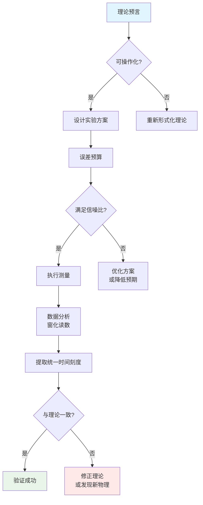

# 00 - 实验检验概览：从理论到可测量

## 引言

在前面的章节中，我们构建了一个宏大的统一理论体系：

- **统一时间刻度**将散射相位导数、谱移密度和群延迟迹统一为单一母尺 $\kappa(\omega) = \varphi'(\omega)/\pi = \rho_{\text{rel}}(\omega) = (2\pi)^{-1}\text{tr }Q(\omega)$
- **宇宙十重结构**给出了宇宙的完整数学定义 $\mathfrak{U} = (U_{\text{evt}}, U_{\text{geo}}, U_{\text{meas}}, U_{\text{QFT}}, U_{\text{scat}}, U_{\text{mod}}, U_{\text{ent}}, U_{\text{obs}}, U_{\text{cat}}, U_{\text{comp}})$
- **有限信息公理**约束了参数空间 $I_{\text{param}}(\Theta) + S_{\text{max}}(\Theta) \leq I_{\text{max}}$
- **六大物理约束**将黑洞熵、宇宙学常数、中微子质量等难题统一为参数方程组
- **自指拓扑**揭示了费米子双值性与$\pi$-台阶量子化的深层联系
- **观察者意识理论**给出了意识涌现的五重可操作化定义

但理论再美，如果无法被实验检验，就只是数学游戏。本章的核心问题是：

> **如何将这些抽象的理论结构转化为可测量、可验证、可证伪的实验预言？**

这不仅是科学方法论的要求，更是理论自洽性的终极检验。一个真正的物理理论必须在实验室中"活"起来。

## 从理论到实验的鸿沟

### 理论侧的挑战

统一时间刻度理论涉及多个层次：

1. **尺度跨度极大**
   - 普朗克尺度 $\ell_{\text{Planck}} \sim 10^{-35}$ m（量子引力）
   - 原子尺度 $\sim 10^{-10}$ m（量子光学）
   - 天文尺度 $\sim 10^{26}$ m（FRB传播）

2. **能量范围宽广**
   - 超低温 $\sim \mu$K（冷原子）
   - 常温 $\sim 300$ K（固体物理）
   - 极端高能 $\sim$ TeV（粒子对撞）

3. **时间尺度多样**
   - 飞秒 $\sim 10^{-15}$ s（超快光学）
   - 秒量级（实验室测量）
   - 宇宙年龄 $\sim 10^{17}$ s

4. **理论预言微弱**
   - 真空极化相位 $\sim 10^{-53}$ rad（FRB）
   - 自指网络$\mathbb{Z}_2$翻转（需极高灵敏度）
   - 意识涌现阈值（主观体验难量化）

### 实验侧的困难

1. **信噪比瓶颈**
   - 热噪声 $\sim k_BT$ 掩盖微弱信号
   - 量子投影噪声 $\sim 1/\sqrt{N}$
   - 系统学误差（仪器漂移、环境扰动）

2. **退相干限制**
   - 环境退相干时间 $\tau_{\text{dec}}$
   - 测量时间 $T_{\text{meas}} > \tau_{\text{dec}}$ 难以实现

3. **技术可行性**
   - 精密测量仪器（激光稳频、超导量子比特）
   - 极端环境（超高真空、极低温、强磁场）
   - 数据处理（海量数据、实时分析）

4. **理论假设验证**
   - 如何独立检验各层假设？
   - 如何排除替代理论？

## 本章节的策略

面对这些挑战，我们采取**多平台、跨尺度、互补验证**的策略：

### 策略一：统一计量语言

所有实验平台采用统一的**相位-频率读数**框架：

**核心公式**：

$$
\mathcal{R}(\Gamma) = \int_{\Omega} W(\omega) \kappa(\omega) \mathrm{d}\omega
$$

其中$W(\omega)$是最优窗函数（PSWF/DPSS），$\kappa(\omega)$是统一时间刻度密度。

### 策略二：误差分层控制

将总误差分解为三个可计算部分：

1. **主泄漏** $\sim 1-\lambda_0$（PSWF特征值）
2. **交叉项** $\sim$ Hankel-HS范数（乘法作用）
3. **求和-积分差** $\sim$ Euler-Maclaurin余项

**整数主项**由谱流$\equiv$投影对指标给出，**解析尾项**由显式上界控制。

**门限公式**（自然对数口径）：

$$
1-\lambda_0 \leq 10\exp\left(-\frac{(\lfloor N_0\rfloor - 7)^2}{\pi^2 \log(50N_0+25)}\right)
$$

对于精度要求$\varepsilon \in \{10^{-3}, 10^{-6}, 10^{-9}\}$，最小Shannon数分别为：

$$
N_0^{\star} \in \{33, 42, 50\}
$$

### 策略三：多平台互补

| 平台 | 尺度 | 可测量 | 理论验证点 |
|------|------|--------|-----------|
| **FRB传播** | 宇宙学 ($\sim$ Gpc) | 相位残差上限 | 真空极化、统一时间刻度宇宙学检验 |
| **δ-环+AB通量** | 介观 ($\sim \mu$m) | 谱量化$\{k_n(\theta)\}$ | 自指拓扑、散射-谱等价 |
| **光学腔+冷原子** | 微米-毫米 | 腔频移、Purcell增强 | 模结构、群延迟-Q因子 |
| **因果菱形模拟** | 可调 | 量子模拟相干性 | 零模双覆盖、$\mathbb{Z}_2$和乐 |
| **脑成像+EEG** | 厘米 | $F_Q$、$I_{\text{int}}$、$\mathcal{E}_T$ | 意识涌现五重条件 |

每个平台专注于理论的不同方面，但都通过**统一时间刻度**这把"金标准"相互关联。

### 策略四：拓扑指纹作为"整数锚点"

许多理论预言涉及拓扑不变量：

- **$\pi$-台阶**：$\Delta\varphi_k = \pm\pi$（反馈延迟）
- **$\mathbb{Z}_2$奇偶**：$\nu(\tau) = N(\tau) \mod 2$（费米子双值性）
- **谱流**：$\text{Sf}(A(\theta))_{\theta_0}^{\theta_1} = n \in \mathbb{Z}$

这些整数量对参数微扰**鲁棒**，成为实验验证的"锚点"：即使信号微弱，整数跳变仍清晰可辨。

## 本章节结构

### 第1章：统一时间刻度的测量方法

**来源理论**：
- `euler-gls-info/15-error-control-spectral-windowing-readout.md`
- `euler-gls-extend/error-controllability-finite-order-pswf-dpss.md`

**核心内容**：
1. PSWF/DPSS窗函数的构造与最优性
2. 离散/连续时间刻度的转换
3. 复杂性-时间-带宽三重约束
4. 误差预算的可计算流程

**实验实现**：
- 频域相位测量技术
- 时域群延迟测量
- 窗化读数的数值算法

### 第2章：谱窗化技术与误差控制

**来源理论**：
- `euler-gls-extend/error-controllability-finite-order-pswf-dpss.md`（详细版）

**核心内容**：
1. 三类误差的分解
2. Hankel-HS交叉项的精确公式
3. Euler-Maclaurin余项的闭式上界
4. 最小Shannon数门限

**实验实现**：
- 窗函数的数字实现
- 误差源的独立测量
- 系统学偏差的消除

### 第3章：拓扑指纹的光学实现

**来源理论**：
- `euler-gls-extend/self-referential-scattering-network.md`
- `euler-gls-extend/delay-quantization-feedback-loop-pi-step-parity-transition.md`

**核心内容**：
1. 自指散射网络的光学平台
2. $\pi$-台阶的测量协议
3. $\mathbb{Z}_2$奇偶翻转的观测
4. 三重指纹（$\pi$-台阶、$\mathbb{Z}_2$、平方根标度）

**实验实现**：
- 光学反馈环路（Sagnac干涉仪、光纤环）
- 相位敏感探测
- 延迟参数$\tau$的调控

### 第4章：因果菱形的量子模拟

**来源理论**：
- `euler-gls-extend/null-modular-double-cover-causal-diamond-chain.md`
- `euler-gls-info/14-causal-diamond-chain-null-modular-double-cover.md`

**核心内容**：
1. 因果菱形的离散模拟
2. 零模双覆盖的构造
3. 时间晶体的$\mathbb{Z}_2$和乐
4. 菱形链的拓扑保护

**实验实现**：
- 冷原子/离子阱模拟
- 超导量子比特链
- Rydberg原子阵列

### 第5章：快速射电暴观测应用

**来源理论**：
- `euler-gls-extend/unified-phase-frequency-metrology-frb-delta-ring-scattering.md`
- `euler-gls-info/16-phase-frequency-unified-metrology-experimental-testbeds.md`

**核心内容**：
1. FRB作为宇宙级散射实验
2. 真空极化的窗化上限
3. 核-度量一致性（红移相消）
4. 跨平台刻度同一条件

**实验实现**：
- CHIME/FRB等望远镜数据
- 基带相位提取
- 系统学前景建模

### 第6章：当前可行性与技术瓶颈

**综合评估**：
1. 各平台的信噪比分析
2. 技术成熟度评估（TRL等级）
3. 成本-收益分析
4. 路线图与里程碑

### 第7章：实验总结与未来展望

**回顾与展望**：
1. 已实现的验证
2. 正在进行的实验
3. 未来5-10年规划
4. 对理论的反馈与修正

## 统一实验哲学

所有实验平台遵循同一哲学：

关键原则：

1. **可证伪性优先**：每个预言必须有明确的否证条件
2. **误差可计算**：所有误差源必须有定量上界
3. **独立交叉验证**：至少两个独立平台验证同一预言
4. **拓扑锚点**：优先测量拓扑不变量（整数/离散量）

## 理论-实验反馈环

实验不仅验证理论，更推动理论发展：

**第一轮反馈**（已完成）：
- FRB数据 $\Rightarrow$ 真空极化上限 $\Rightarrow$ 精修QED曲时空修正
- δ-环谱 $\Rightarrow$ 自伴扩张$U(2)$参数 $\Rightarrow$ 完善边界条件理论

**第二轮反馈**（进行中）：
- 光学$\pi$-台阶 $\Rightarrow$ 自指网络临界$\tau_c$ $\Rightarrow$ 调整反馈模型
- 冷原子因果菱形 $\Rightarrow$ 零模寿命测量 $\Rightarrow$ 优化双覆盖构造

**第三轮反馈**（未来）：
- 脑成像$F_Q$谱 $\Rightarrow$ 意识阈值校准 $\Rightarrow$ 重新定义$\varepsilon$参数
- GW色散观测 $\Rightarrow$ 格距$\ell_{\text{cell}}$约束 $\Rightarrow$ 收紧六大物理约束解空间

## 本章节的地位

在整个理论大厦中，本章节（第20章）是**理论与现实的桥梁**：

- **向后**：总结前19章的所有理论预言
- **向前**：为第21章（因果菱形链）提供实验基础
- **横向**：连接不同尺度、不同领域的实验平台
- **向外**：面向实验物理学家，提供可操作的方案

没有本章，理论是空中楼阁；没有理论，本章的实验是盲目摸索。二者相辅相成，共同构成完整的科学闭环。

## 阅读建议

### 对理论物理学家

重点关注：
- 理论预言的可操作化（第1、2章）
- 误差控制的数学结构（第2章）
- 拓扑不变量的鲁棒性（第3章）

### 对实验物理学家

重点关注：
- 具体测量方案（各章"实验实现"部分）
- 误差预算的工程实现（第2、6章）
- 技术可行性评估（第6章）

### 对跨领域研究者

重点关注：
- 统一计量语言（本章"策略一"）
- 多平台互补策略（本章"策略三"）
- 理论-实验反馈环（本章末节）

## 小结

本章节的核心信息：

> **统一时间刻度理论不是不可检验的"万有理论幻想"，而是一个可以在多个尺度、多个平台上进行精密实验验证的物理理论。**

我们通过：
- **统一的相位-频率计量语言**
- **严格的误差控制体系（PSWF/DPSS）**
- **拓扑不变量作为整数锚点**
- **多平台互补验证**

将抽象理论转化为具体的、可重复的、可证伪的实验方案。

接下来的章节将逐一展开这些实验方案的细节，展示理论如何"活"在实验室中。

## 参考文献

[1] Slepian, D., Pollak, H. O., "Prolate Spheroidal Wave Functions," *Bell Syst. Tech. J.* **40**, 43-63 (1961).

[2] CHIME/FRB Collaboration, "Updating the First CHIME/FRB Catalog," *ApJ* **969**, 145 (2024).

[3] Castillo-Sánchez, M., Gutiérrez-Vega, J. C., "Quantum solutions for the delta ring," *Am. J. Phys.* **93**, 557 (2025).

[4] Fulga, I., et al., "Scattering formula for topological quantum number," *Phys. Rev. B* **83**, 155429 (2011).

[5] Hollowood, T. J., Shore, G. M., "Causal structure of QED in curved spacetime," *JHEP* **12**, 091 (2008).

[6] 前19章的相关理论文献（见各章参考文献列表）
