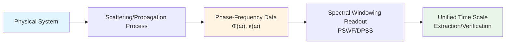
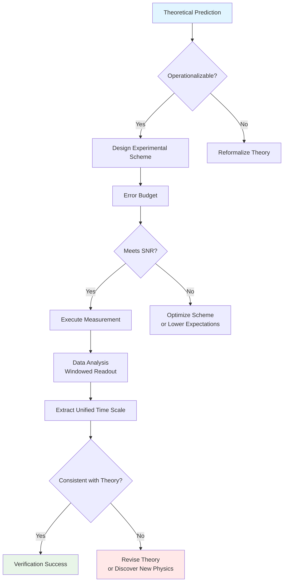

# 00 - Experimental Overview: From Theory to Measurability

## Introduction

In the preceding chapters, we have constructed a grand unified theoretical framework:

- **Unified time scale** unifies scattering phase derivative, spectral shift density, and group delay trace into a single master scale $\kappa(\omega) = \varphi'(\omega)/\pi = \rho_{\text{rel}}(\omega) = (2\pi)^{-1}\text{tr }Q(\omega)$
- **Tenfold cosmic structure** provides a complete mathematical definition of the universe $\mathfrak{U} = (U_{\text{evt}}, U_{\text{geo}}, U_{\text{meas}}, U_{\text{QFT}}, U_{\text{scat}}, U_{\text{mod}}, U_{\text{ent}}, U_{\text{obs}}, U_{\text{cat}}, U_{\text{comp}})$
- **Finite information axiom** constrains the parameter space $I_{\text{param}}(\Theta) + S_{\text{max}}(\Theta) \leq I_{\text{max}}$
- **Six major physical constraints** unify black hole entropy, cosmological constant, neutrino mass, and other puzzles into a system of parametric equations
- **Self-referential topology** reveals the deep connection between fermion double-valuedness and $\pi$-step quantization
- **Observer consciousness theory** provides a fivefold operational definition of consciousness emergence

However beautiful the theory, if it cannot be experimentally tested, it remains mere mathematical play. The core question of this chapter is:

> **How can we transform these abstract theoretical structures into measurable, verifiable, falsifiable experimental predictions?**

This is not only a requirement of scientific methodology, but also the ultimate test of theoretical self-consistency. A true physical theory must "come alive" in the laboratory.

## The Gap from Theory to Experiment

### Challenges on the Theoretical Side

The unified time scale theory involves multiple levels:

1. **Extremely large scale span**
   - Planck scale $\ell_{\text{Planck}} \sim 10^{-35}$ m (quantum gravity)
   - Atomic scale $\sim 10^{-10}$ m (quantum optics)
   - Astronomical scale $\sim 10^{26}$ m (FRB propagation)

2. **Wide energy range**
   - Ultra-low temperature $\sim \mu$K (cold atoms)
   - Room temperature $\sim 300$ K (solid state physics)
   - Extreme high energy $\sim$ TeV (particle collisions)

3. **Diverse time scales**
   - Femtoseconds $\sim 10^{-15}$ s (ultrafast optics)
   - Seconds (laboratory measurements)
   - Age of the universe $\sim 10^{17}$ s

4. **Weak theoretical predictions**
   - Vacuum polarization phase $\sim 10^{-53}$ rad (FRB)
   - Self-referential network $\mathbb{Z}_2$ flip (requires extremely high sensitivity)
   - Consciousness emergence threshold (subjective experience difficult to quantify)

### Difficulties on the Experimental Side

1. **Signal-to-noise ratio bottleneck**
   - Thermal noise $\sim k_BT$ masks weak signals
   - Quantum projection noise $\sim 1/\sqrt{N}$
   - Systematic errors (instrument drift, environmental disturbances)

2. **Decoherence limitations**
   - Environmental decoherence time $\tau_{\text{dec}}$
   - Measurement time $T_{\text{meas}} > \tau_{\text{dec}}$ difficult to achieve

3. **Technical feasibility**
   - Precision measurement instruments (laser frequency stabilization, superconducting qubits)
   - Extreme environments (ultra-high vacuum, ultra-low temperature, strong magnetic fields)
   - Data processing (massive data, real-time analysis)

4. **Theoretical assumption verification**
   - How to independently test each layer of assumptions?
   - How to exclude alternative theories?

## Strategies of This Chapter

Facing these challenges, we adopt a strategy of **multi-platform, cross-scale, complementary verification**:

### Strategy One: Unified Metrological Language

All experimental platforms adopt a unified **phase-frequency readout** framework:

**Core formula**:

$$
\mathcal{R}(\Gamma) = \int_{\Omega} W(\omega) \kappa(\omega) \mathrm{d}\omega
$$

where $W(\omega)$ is the optimal window function (PSWF/DPSS), and $\kappa(\omega)$ is the unified time scale density.

### Strategy Two: Hierarchical Error Control

Decompose total error into three computable parts:

1. **Main leakage** $\sim 1-\lambda_0$ (PSWF eigenvalue)
2. **Cross-term** $\sim$ Hankel-HS norm (multiplicative action)
3. **Sum-integral difference** $\sim$ Euler-Maclaurin remainder

The **integer main term** is given by spectral flow $\equiv$ projection pair index, and the **analytic tail term** is controlled by explicit upper bounds.

**Threshold formula** (natural logarithm convention):

$$
1-\lambda_0 \leq 10\exp\left(-\frac{(\lfloor N_0\rfloor - 7)^2}{\pi^2 \log(50N_0+25)}\right)
$$

For precision requirements $\varepsilon \in \{10^{-3}, 10^{-6}, 10^{-9}\}$, the minimum Shannon numbers are:

$$
N_0^{\star} \in \{33, 42, 50\}
$$

### Strategy Three: Multi-Platform Complementarity

| Platform | Scale | Measurable | Theoretical Verification Point |
|----------|-------|------------|-------------------------------|
| **FRB Propagation** | Cosmological ($\sim$ Gpc) | Phase residual upper bound | Vacuum polarization, unified time scale cosmological test |
| **δ-Ring + AB Flux** | Mesoscopic ($\sim \mu$m) | Spectral quantization $\{k_n(\theta)\}$ | Self-referential topology, scattering-spectrum equivalence |
| **Optical Cavity + Cold Atoms** | Micrometer-millimeter | Cavity frequency shift, Purcell enhancement | Mode structure, group delay-Q factor |
| **Causal Diamond Simulation** | Tunable | Quantum simulation coherence | Zero-mode double cover, $\mathbb{Z}_2$ holonomy |
| **Brain Imaging + EEG** | Centimeter | $F_Q$, $I_{\text{int}}$, $\mathcal{E}_T$ | Fivefold consciousness emergence conditions |

Each platform focuses on different aspects of the theory, but all are interconnected through the **unified time scale** as the "gold standard."

### Strategy Four: Topological Fingerprints as "Integer Anchors"

Many theoretical predictions involve topological invariants:

- **$\pi$-steps**: $\Delta\varphi_k = \pm\pi$ (feedback delay)
- **$\mathbb{Z}_2$ parity**: $\nu(\tau) = N(\tau) \mod 2$ (fermion double-valuedness)
- **Spectral flow**: $\text{Sf}(A(\theta))_{\theta_0}^{\theta_1} = n \in \mathbb{Z}$

These integer quantities are **robust** to parameter perturbations, becoming "anchors" for experimental verification: even if signals are weak, integer jumps remain clearly discernible.

## Structure of This Chapter

### Chapter 1: Measurement Methods for Unified Time Scale

**Source theory**:
- `euler-gls-info/15-error-control-spectral-windowing-readout.md`
- `euler-gls-extend/error-controllability-finite-order-pswf-dpss.md`

**Core content**:
1. Construction and optimality of PSWF/DPSS window functions
2. Discrete/continuous time scale conversion
3. Complexity-time-bandwidth triple constraints
4. Computable error budget workflow

**Experimental implementation**:
- Frequency-domain phase measurement techniques
- Time-domain group delay measurement
- Numerical algorithms for windowed readout

### Chapter 2: Spectral Windowing Techniques and Error Control

**Source theory**:
- `euler-gls-extend/error-controllability-finite-order-pswf-dpss.md` (detailed version)

**Core content**:
1. Decomposition of three types of errors
2. Exact formula for Hankel-HS cross-term
3. Closed-form upper bound for Euler-Maclaurin remainder
4. Minimum Shannon number threshold

**Experimental implementation**:
- Digital implementation of window functions
- Independent measurement of error sources
- Elimination of systematic bias

### Chapter 3: Optical Implementation of Topological Fingerprints

**Source theory**:
- `euler-gls-extend/self-referential-scattering-network.md`
- `euler-gls-extend/delay-quantization-feedback-loop-pi-step-parity-transition.md`

**Core content**:
1. Optical platform for self-referential scattering networks
2. Measurement protocol for $\pi$-steps
3. Observation of $\mathbb{Z}_2$ parity flip
4. Triple fingerprints ($\pi$-step, $\mathbb{Z}_2$, square root scaling)

**Experimental implementation**:
- Optical feedback loops (Sagnac interferometer, fiber ring)
- Phase-sensitive detection
- Control of delay parameter $\tau$

### Chapter 4: Quantum Simulation of Causal Diamonds

**Source theory**:
- `euler-gls-extend/null-modular-double-cover-causal-diamond-chain.md`
- `euler-gls-info/14-causal-diamond-chain-null-modular-double-cover.md`

**Core content**:
1. Discrete simulation of causal diamonds
2. Construction of zero-mode double cover
3. $\mathbb{Z}_2$ holonomy of time crystals
4. Topological protection of diamond chains

**Experimental implementation**:
- Cold atom/ion trap simulation
- Superconducting qubit chains
- Rydberg atom arrays

### Chapter 5: Fast Radio Burst Observation Applications

**Source theory**:
- `euler-gls-extend/unified-phase-frequency-metrology-frb-delta-ring-scattering.md`
- `euler-gls-info/16-phase-frequency-unified-metrology-experimental-testbeds.md`

**Core content**:
1. FRB as cosmological-scale scattering experiment
2. Windowed upper bound for vacuum polarization
3. Kernel-metric consistency (redshift cancellation)
4. Cross-platform scale identity condition

**Experimental implementation**:
- CHIME/FRB telescope data
- Baseband phase extraction
- Systematic foreground modeling

### Chapter 6: Current Feasibility and Technical Bottlenecks

**Comprehensive assessment**:
1. Signal-to-noise ratio analysis for each platform
2. Technology readiness level (TRL) assessment
3. Cost-benefit analysis
4. Roadmap and milestones

### Chapter 7: Experimental Summary and Future Prospects

**Review and prospects**:
1. Achieved verifications
2. Ongoing experiments
3. Future 5-10 year plan
4. Feedback and corrections to theory

## Unified Experimental Philosophy

All experimental platforms follow the same philosophy:

Key principles:

1. **Falsifiability first**: Each prediction must have clear falsification conditions
2. **Computable errors**: All error sources must have quantitative upper bounds
3. **Independent cross-verification**: At least two independent platforms verify the same prediction
4. **Topological anchors**: Prioritize measurement of topological invariants (integer/discrete quantities)

## Theory-Experiment Feedback Loop

Experiments not only verify theory but also drive theoretical development:

**First round feedback** (completed):
- FRB data $\Rightarrow$ vacuum polarization upper bound $\Rightarrow$ refined QED curved spacetime corrections
- δ-ring spectrum $\Rightarrow$ self-adjoint extension $U(2)$ parameters $\Rightarrow$ improved boundary condition theory

**Second round feedback** (ongoing):
- Optical $\pi$-step $\Rightarrow$ self-referential network critical $\tau_c$ $\Rightarrow$ adjusted feedback model
- Cold atom causal diamond $\Rightarrow$ zero-mode lifetime measurement $\Rightarrow$ optimized double cover construction

**Third round feedback** (future):
- Brain imaging $F_Q$ spectrum $\Rightarrow$ consciousness threshold calibration $\Rightarrow$ redefinition of $\varepsilon$ parameter
- GW dispersion observation $\Rightarrow$ lattice spacing $\ell_{\text{cell}}$ constraint $\Rightarrow$ tightened solution space for six major physical constraints

## Status of This Chapter

In the entire theoretical edifice, this chapter (Chapter 20) is the **bridge between theory and reality**:

- **Backward**: Summarizes all theoretical predictions from the previous 19 chapters
- **Forward**: Provides experimental foundation for Chapter 21 (causal diamond chain)
- **Lateral**: Connects experimental platforms at different scales and in different fields
- **Outward**: Faces experimental physicists, providing actionable schemes

Without this chapter, theory is a castle in the air; without theory, the experiments in this chapter are blind exploration. They complement each other, together forming a complete scientific cycle.

## Reading Recommendations

### For Theoretical Physicists

Focus on:
- Operationalization of theoretical predictions (Chapters 1, 2)
- Mathematical structure of error control (Chapter 2)
- Robustness of topological invariants (Chapter 3)

### For Experimental Physicists

Focus on:
- Specific measurement schemes (the "Experimental Implementation" sections of each chapter)
- Engineering implementation of error budgets (Chapters 2, 6)
- Technical feasibility assessment (Chapter 6)

### For Cross-Disciplinary Researchers

Focus on:
- Unified metrological language (Strategy One of this chapter)
- Multi-platform complementarity strategy (Strategy Three of this chapter)
- Theory-experiment feedback loop (end section of this chapter)

## Summary

The core message of this chapter:

> **The unified time scale theory is not an untestable "theory-of-everything fantasy," but a physical theory that can be precisely experimentally verified on multiple scales and multiple platforms.**

We transform abstract theory into concrete, repeatable, falsifiable experimental schemes through:
- **Unified phase-frequency metrological language**
- **Strict error control system (PSWF/DPSS)**
- **Topological invariants as integer anchors**
- **Multi-platform complementary verification**

The following chapters will unfold the details of these experimental schemes one by one, showing how theory "comes alive" in the laboratory.

## References

[1] Slepian, D., Pollak, H. O., "Prolate Spheroidal Wave Functions," *Bell Syst. Tech. J.* **40**, 43-63 (1961).

[2] CHIME/FRB Collaboration, "Updating the First CHIME/FRB Catalog," *ApJ* **969**, 145 (2024).

[3] Castillo-Sánchez, M., Gutiérrez-Vega, J. C., "Quantum solutions for the delta ring," *Am. J. Phys.* **93**, 557 (2025).

[4] Fulga, I., et al., "Scattering formula for topological quantum number," *Phys. Rev. B* **83**, 155429 (2011).

[5] Hollowood, T. J., Shore, G. M., "Causal structure of QED in curved spacetime," *JHEP* **12**, 091 (2008).

[6] Relevant theoretical literature from the previous 19 chapters (see reference lists in each chapter)

