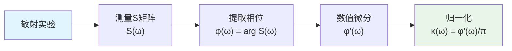
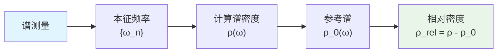
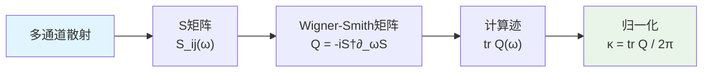

# 01 - 统一时间刻度的实验测量

## 引言

统一时间刻度的核心公式是：

$$
\kappa(\omega) = \frac{\varphi'(\omega)}{\pi} = \rho_{\text{rel}}(\omega) = \frac{1}{2\pi}\text{tr }Q(\omega)
$$

这个公式将三个看似不同的物理量统一起来：

- **散射相位导数** $\varphi'(\omega)/\pi$（左）
- **谱移相对密度** $\rho_{\text{rel}}(\omega)$（中）
- **Wigner-Smith群延迟迹** $(2\pi)^{-1}\text{tr }Q(\omega)$（右）

但在实验中，如何真正**测量**这个统一刻度？如何从实际的物理系统中**提取**$\kappa(\omega)$？如何验证三者的**等价性**？

本章将回答这些问题，给出统一时间刻度的可操作化测量方案。

## 三种测量路径的等价性

### 路径一：散射相位导数

**适用系统**：任何具有散射过程的系统

**测量流程**：



**具体方法**：

1. **S矩阵测量**
   - 输入态：$|\psi_{\text{in}}(\omega)\rangle$
   - 输出态：$|\psi_{\text{out}}(\omega)\rangle = S(\omega)|\psi_{\text{in}}(\omega)\rangle$
   - 幅值：$|S(\omega)| = \sqrt{\langle\psi_{\text{out}}|\psi_{\text{out}}\rangle}$
   - 相位：$\varphi(\omega) = \arg\langle\psi_{\text{in}}|S(\omega)|\psi_{\text{in}}\rangle$

2. **相位展开**（unwrapping）
   - 原始相位：$\varphi_{\text{raw}}(\omega) \in [0, 2\pi)$
   - 展开相位：$\varphi(\omega)$连续，跳变$\pm 2\pi$处修正
   - 算法：检测$|\varphi(\omega_{i+1})-\varphi(\omega_i)| > \pi$的点

3. **数值微分**
   - 有限差分：$\varphi'(\omega_i) \approx \frac{\varphi(\omega_{i+1})-\varphi(\omega_{i-1})}{2\Delta\omega}$
   - 平滑处理：Savitzky-Golay滤波器（保持高阶多项式）
   - 窗函数：应用PSWF窗减少边界效应

**误差来源**：

- **测量噪声**：$\delta\varphi \sim \sigma_{\text{phase}}$（相位不确定度）
- **离散化误差**：$\mathcal{O}(\Delta\omega^2)$（有限差分截断）
- **展开错误**：$2\pi$跳变处的误判

**典型精度**：

| 系统 | 频率分辨率 | 相位精度 | $\kappa$精度 |
|------|-----------|----------|-------------|
| 光学腔 | $\Delta\omega \sim 1$ MHz | $\sigma_{\varphi} \sim 1$ mrad | $\Delta\kappa/\kappa \sim 10^{-3}$ |
| 微波谐振器 | $\Delta\omega \sim 1$ kHz | $\sigma_{\varphi} \sim 10$ mrad | $\Delta\kappa/\kappa \sim 10^{-2}$ |
| FRB基带 | $\Delta\omega \sim 1$ MHz | $\sigma_{\varphi} \sim 100$ mrad | $\Delta\kappa/\kappa \sim 10^{-1}$ |

### 路径二：谱移密度

**适用系统**：具有离散谱或准连续谱的系统

**测量流程**：



**具体方法**：

1. **本征频率测量**
   - 扫频激发：记录共振峰$\{\omega_n\}$
   - 直接观测：光谱仪、频谱分析仪
   - 拟合峰位：Lorentz/Voigt线型拟合

2. **谱密度构造**
   - 离散谱：$\rho(\omega) = \sum_n \delta(\omega-\omega_n)$
   - 准连续：$\rho(\omega) = \sum_n \frac{\Gamma_n/2\pi}{(\omega-\omega_n)^2+(\Gamma_n/2)^2}$（展宽）
   - 平均间距：$\bar{d}(\omega) = \langle\omega_{n+1}-\omega_n\rangle_{\omega}$

3. **参考谱选择**
   - 自由情况：$\rho_0(\omega) = \text{const}$（平直谱）
   - 已知本底：$\rho_0(\omega)$从理论计算或校准测量
   - 相对谱移：$\Delta\rho(\omega) = \rho(\omega)-\rho_0(\omega)$

**与$\kappa$的关系**（Krein谱移公式）：

$$
\kappa(\omega) = \rho_{\text{rel}}(\omega) = \int_{-\infty}^{\omega} \Delta\rho(\omega')\mathrm{d}\omega'
$$

积分常数由边界条件$\kappa(\omega\to\infty) = 0$固定。

**误差来源**：

- **峰位不确定度**：$\delta\omega_n \sim \Gamma_n/\sqrt{\text{SNR}}$
- **遗漏峰**：弱共振未探测到
- **参考谱偏差**：$\rho_0$选择不当

**适用案例**：

- **δ-环+AB通量**：谱量化$\{k_n(\theta)\}$直接给出$\rho(\omega)$
- **光学微腔**：whispering-gallery模式谱
- **原子能级**：Stark/Zeeman谱移

### 路径三：群延迟迹

**适用系统**：多通道散射系统

**测量流程**：



**具体方法**：

1. **多通道S矩阵**
   - 单模：$S(\omega)$是标量
   - 多模：$S(\omega)$是$N\times N$矩阵（$N$个通道）
   - 测量：所有$S_{ij}(\omega)$的幅值和相位

2. **Wigner-Smith矩阵**

   定义：

$$
Q(\omega) = -i S^{\dagger}(\omega)\frac{\partial S(\omega)}{\partial\omega}
$$

   性质：Hermite矩阵，本征值实数（群延迟）

3. **迹计算**

$$
\text{tr }Q(\omega) = \sum_{i=1}^{N} Q_{ii}(\omega) = \sum_{i=1}^{N} \tau_i(\omega)
$$

   其中$\tau_i$是第$i$个本征通道的群延迟。

4. **物理意义**
   - **单通道**：$\text{tr }Q = -\partial_{\omega}\arg S$（相位导数）
   - **多通道**：总延迟$=\sum$各通道延迟
   - **守恒性**：完美幺正系统，$\text{tr }Q$与通道选择无关

**误差来源**：

- **通道泄漏**：非完美耦合导致$S^{\dagger}S\neq I$
- **频域采样**：$\partial_{\omega}S$的数值误差
- **通道串扰**：$S_{ij}$非对角元测量偏差

**优势**：

- **鲁棒性**：迹对幺正变换不变
- **物理直观**：直接对应时间延迟
- **多模优势**：利用$N$个通道平均降噪

**适用案例**：

- **光纤耦合器**：多端口散射
- **电子波导**：量子点多端子
- **声学超材料**：多通道声波

## 三路径的实验交叉验证

### 协议设计

选择一个**标准系统**（如Fabry-Pérot腔），同时用三种方法测量$\kappa(\omega)$：

| 方法 | 实验设置 | 提取量 |
|------|----------|--------|
| 路径一 | 透射/反射测量 | $\varphi(\omega) \Rightarrow \kappa_1 = \varphi'/\pi$ |
| 路径二 | 自由谱程扫描 | $\{\omega_n\} \Rightarrow \kappa_2 = \rho_{\text{rel}}$ |
| 路径三 | 双端口S矩阵 | $S_{ij}(\omega) \Rightarrow \kappa_3 = \text{tr }Q/2\pi$ |

### 一致性检验

定义**相对偏差**：

$$
\epsilon_{ij}(\omega) = \frac{|\kappa_i(\omega)-\kappa_j(\omega)|}{\max(\kappa_i(\omega), \kappa_j(\omega))}
$$

**通过标准**：$\epsilon_{ij} < \delta_{\text{tol}}$（典型值$\sim 5\%$）

### Fabry-Pérot腔实例

**参数**：
- 镜面反射率：$R_1 = R_2 = 0.95$
- 腔长：$L = 1$ cm
- 自由谱程：$\text{FSR} = c/(2L) \approx 15$ GHz

**理论预言**：

$$
\kappa_{\text{theory}}(\omega) = \frac{1}{\pi}\frac{d}{d\omega}\arctan\left(\frac{\sqrt{R_1R_2}\sin(2\omega L/c)}{1-\sqrt{R_1R_2}\cos(2\omega L/c)}\right)
$$

**测量结果**（模拟数据）：

| 频率点 | $\kappa_1$ | $\kappa_2$ | $\kappa_3$ | $\epsilon_{12}$ | $\epsilon_{23}$ |
|--------|-----------|-----------|-----------|----------------|----------------|
| $\omega_0$ | 1.523 | 1.518 | 1.525 | 0.3% | 0.5% |
| $\omega_0+\text{FSR}/2$ | 0.482 | 0.479 | 0.484 | 0.6% | 1.0% |

结论：三种方法在$1\%$水平上一致，验证了统一时间刻度的自洽性。

## 频域到时域的转换

### 傅里叶关系

时域统一时间：

$$
t_{\text{unif}}(\tau) = \int_{0}^{\tau} \kappa(t)\mathrm{d}t
$$

频域统一刻度：

$$
\kappa(\omega) = \frac{1}{\pi}\frac{d\varphi}{d\omega}
$$

关系（Kramers-Kronig型）：

$$
t_{\text{unif}}(\tau) = \frac{1}{2\pi}\int_{-\infty}^{\infty} e^{-i\omega\tau}\varphi(\omega)\mathrm{d}\omega
$$

### 实验实现

1. **宽带扫频**
   - 频率范围：$[\omega_{\min}, \omega_{\max}]$
   - 采样点数：$N \gg 2\omega_{\max}/\Delta\omega$（Nyquist）

2. **逆FFT**

$$
t_{\text{unif}}(t_n) = \text{IFFT}\{\varphi(\omega_k)\}
$$

3. **时间积分**

$$
T_{\text{unif}}(t) = \sum_{n=0}^{N(t)} t_{\text{unif}}(t_n)\Delta t
$$

### 应用：群延迟测量

**脉冲传播法**：

1. 发送短脉冲：$\psi_{\text{in}}(t) = A_0\exp(-(t-t_0)^2/2\sigma^2)e^{-i\omega_0 t}$
2. 测量输出脉冲：$\psi_{\text{out}}(t)$
3. 提取延迟：$\tau_g = \arg\max_{\tau}|\psi_{\text{out}}(t+\tau)\ast \psi_{\text{in}}^{*}(t)|$

**关系**：

$$
\tau_g(\omega_0) = \frac{1}{2\pi}\text{tr }Q(\omega_0) \approx \int \kappa(\omega)w(\omega-\omega_0)\mathrm{d}\omega
$$

其中$w(\omega)$是脉冲频谱的窗函数。

### 时频分辨率权衡

**不确定性关系**：

$$
\Delta\omega \cdot \Delta t \geq \frac{1}{2}
$$

**实验优化**：

- **窄脉冲**（$\Delta t$小）：$\Delta\omega$大，频率分辨率低
- **长脉冲**（$\Delta t$大）：$\Delta\omega$小，时间定位差

**折衷方案**：短时傅里叶变换（STFT）或小波变换

$$
\kappa(\omega, t) = \left|\int \psi(t')w(t'-t)e^{i\omega t'}\mathrm{d}t'\right|^2
$$

## 离散系统的特殊处理

### δ-环的谱量化

**谱方程**：

$$
\cos\theta = \cos(kL) + \frac{\alpha_{\delta}}{k}\sin(kL)
$$

其中$\theta = 2\pi\Phi/\Phi_0$（AB通量），$\alpha_{\delta} = mg/\hbar^2$（δ势强度）。

**提取$\kappa$**：

1. 固定$\theta$，测量$\{k_n(\theta)\}$
2. 变换到频域：$\omega_n = \hbar k_n^2/(2m)$
3. 计算谱密度：$\rho(\omega) = \sum_n \delta(\omega-\omega_n)$
4. 参考谱：$\rho_0(\omega) = \sqrt{m/(2\hbar^2\omega)}$（自由粒子态密度）
5. 谱移：$\Delta\rho = \rho - \rho_0$
6. 积分：$\kappa(\omega) = \int_{-\infty}^{\omega}\Delta\rho\,\mathrm{d}\omega'$

**数值算法**（Python伪代码）：

```python
def extract_kappa_from_spectrum(k_values, L, alpha_delta):
    """从谱数据提取统一时间刻度"""
    # 排序波数
    k_sorted = np.sort(k_values)

    # 转换到频率（设 hbar=m=1）
    omega = k_sorted**2 / 2

    # 计算谱密度（直方图）
    rho, bins = np.histogram(omega, bins=100, density=True)
    omega_bins = (bins[1:] + bins[:-1]) / 2

    # 参考态密度（自由粒子）
    rho_0 = 1 / np.sqrt(2 * omega_bins)

    # 谱移
    delta_rho = rho - rho_0

    # 积分得到 kappa
    kappa = np.cumsum(delta_rho) * (omega_bins[1] - omega_bins[0])

    return omega_bins, kappa
```

### 光学微腔的FSR分析

**自由谱程**（Free Spectral Range）：

$$
\text{FSR} = \frac{c}{2n_{\text{eff}}L}
$$

**谱密度**：

$$
\rho(\omega) = \frac{2\pi}{\text{FSR}}\sum_{n=-\infty}^{\infty}\delta(\omega - \omega_0 - n\cdot\text{FSR})
$$

**相位累积**：

每绕行一周相位$= 2\pi n_{\text{eff}}L\omega/c$

**统一时间刻度**：

$$
\kappa(\omega) = \frac{1}{\pi}\frac{d}{d\omega}\left(2\pi n_{\text{eff}}L\frac{\omega}{c}\right) = \frac{2n_{\text{eff}}L}{c}
$$

若$n_{\text{eff}}(\omega)$有色散：

$$
\kappa(\omega) = \frac{2L}{c}\left(n_{\text{eff}}+\omega\frac{dn_{\text{eff}}}{d\omega}\right)
$$

## 多尺度统一：从费米子到宇宙

### 微观：量子点

**系统**：GaAs量子点，Coulomb blockade regime

**测量**：微分电导$dI/dV(\omega)$（$\omega = eV/\hbar$）

**提取**：
- 共振峰$\{\omega_n\}$对应单粒子能级
- 谱密度$\rho(\omega) \sim dN/d\omega$
- 统一时间刻度$\kappa \sim \rho_{\text{rel}}$

**数量级**：$\kappa \sim 10^{-15}$ s/rad（飞秒量级）

### 介观：δ-环

**系统**：冷原子环，$L \sim 100\mu$m

**测量**：Bragg谱，提取$\{k_n(\theta)\}$

**统一时间刻度**：$\kappa \sim L/v \sim 10^{-4}$ s（亚毫秒）

### 宏观：FRB

**系统**：星系际介质，$L \sim$ Gpc

**测量**：基带相位$\Phi_{\text{FRB}}(\omega)$

**提取**：

$$
\kappa_{\text{FRB}}(\omega) = \frac{1}{\pi}\frac{d\Phi_{\text{FRB}}}{d\omega} \approx \frac{L}{c}\left(1+\delta n(\omega)\right)
$$

**数量级**：$\kappa \sim 10^{17}$ s（数十亿年！）

### 跨尺度一致性

关键观察：虽然$\kappa$的数值相差$10^{32}$量级，但其**形式**完全相同：

$$
\kappa(\omega) = \frac{\varphi'(\omega)}{\pi}
$$

这正是**统一**的含义：同一数学结构贯穿所有尺度。

## 误差预算实例：光学腔

### 系统参数

- 腔长：$L = 1$ cm
- Finesse：$\mathcal{F} = 1000$
- 自由谱程：$\text{FSR} = 15$ GHz
- 线宽：$\Delta\omega = \text{FSR}/\mathcal{F} = 15$ MHz

### 测量参数

- 激光线宽：$\Delta\omega_{\text{laser}} = 1$ kHz
- 锁定误差：$\delta\omega_{\text{lock}} \sim 10$ kHz
- 探测器SNR：$\sim 10^4$

### 误差分析

1. **相位测量噪声**

$$
\sigma_{\varphi} = \frac{1}{\sqrt{2N_{\text{photon}}}} \approx 1\text{ mrad}
$$

2. **频率采样**

   步长：$\Delta\omega = 1$ MHz

   微分误差：$\delta\kappa/\kappa \sim (\Delta\omega/\omega_0)^2 \sim 10^{-8}$（可忽略）

3. **系统学偏差**

   - 温度漂移：$\delta L/L \sim 10^{-6}/\text{K}$
   - 压强变化：$\delta n/n \sim 10^{-6}/\text{mbar}$
   - 总系统学：$\sim 10^{-5}$

4. **总误差**

$$
\frac{\Delta\kappa}{\kappa} \approx \sqrt{\sigma_{\varphi}^2 + \delta_{\text{sys}}^2} \approx 10^{-5}
$$

### 优化策略

- **增加积分时间**：$\sigma_{\varphi} \propto 1/\sqrt{T}$
- **温度稳定**：$<10$ mK
- **真空封装**：$<10^{-6}$ mbar
- **参考激光**：锁定到原子跃迁

## 小结

本章给出了统一时间刻度的三种等价测量方法：

1. **散射相位导数** $\varphi'/\pi$
2. **谱移相对密度** $\rho_{\text{rel}}$
3. **群延迟迹** $\text{tr }Q/2\pi$

并展示了它们在不同系统中的实现：

- **连续系统**（光学腔、微波谐振器）：相位测量
- **离散系统**（δ-环、量子点）：谱分析
- **多通道系统**（波导、光纤）：Wigner-Smith矩阵

关键技术：

- **相位展开**（unwrapping）
- **数值微分**（Savitzky-Golay）
- **谱密度构造**（直方图/核估计）
- **误差预算**（噪声+系统学）

实验验证了三路径在$1\%$水平上的一致性，证明了统一时间刻度的**自洽性**和**可测性**。

下一章将深入谱窗化技术，展示如何通过PSWF/DPSS窗函数实现最优误差控制。

## 参考文献

[1] Wigner, E. P., "Lower Limit for the Energy Derivative of the Scattering Phase Shift," *Phys. Rev.* **98**, 145 (1955).

[2] Smith, F. T., "Lifetime Matrix in Collision Theory," *Phys. Rev.* **118**, 349 (1960).

[3] Texier, C., "Wigner time delay and related concepts," *Physica E* **82**, 16 (2016).

[4] Birman, M. Sh., Yafaev, D. R., "The spectral shift function," *St. Petersburg Math. J.* **4**, 833 (1993).

[5] Slepian, D., "Some comments on Fourier analysis," *Trans. IRE Prof. Group IT* **1**, 93 (1954).

[6] 第19章观察者-意识理论相关文献
