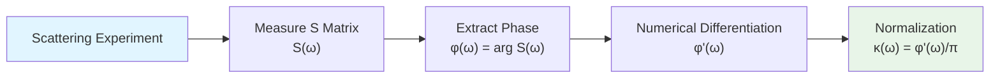
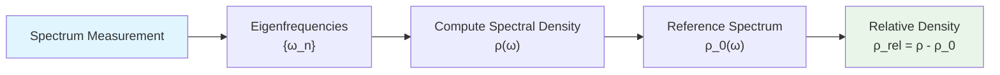
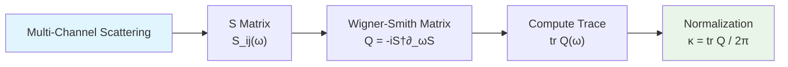

# 01 - Experimental Measurement of Unified Time Scale

## Introduction

The core formula of the unified time scale is:

$$
\kappa(\omega) = \frac{\varphi'(\omega)}{\pi} = \rho_{\text{rel}}(\omega) = \frac{1}{2\pi}\text{tr }Q(\omega)
$$

This formula unifies three seemingly different physical quantities:

- **Scattering phase derivative** $\varphi'(\omega)/\pi$ (left)
- **Spectral shift relative density** $\rho_{\text{rel}}(\omega)$ (middle)
- **Wigner-Smith group delay trace** $(2\pi)^{-1}\text{tr }Q(\omega)$ (right)

But in experiments, how do we actually **measure** this unified scale? How do we **extract** $\kappa(\omega)$ from real physical systems? How do we verify the **equivalence** of the three?

This chapter will answer these questions and provide operational measurement schemes for the unified time scale.

## Equivalence of Three Measurement Paths

### Path One: Scattering Phase Derivative

**Applicable systems**: Any system with scattering processes

**Measurement workflow**:



**Specific methods**:

1. **S-matrix measurement**
   - Input state: $|\psi_{\text{in}}(\omega)\rangle$
   - Output state: $|\psi_{\text{out}}(\omega)\rangle = S(\omega)|\psi_{\text{in}}(\omega)\rangle$
   - Amplitude: $|S(\omega)| = \sqrt{\langle\psi_{\text{out}}|\psi_{\text{out}}\rangle}$
   - Phase: $\varphi(\omega) = \arg\langle\psi_{\text{in}}|S(\omega)|\psi_{\text{in}}\rangle$

2. **Phase unwrapping**
   - Raw phase: $\varphi_{\text{raw}}(\omega) \in [0, 2\pi)$
   - Unwrapped phase: $\varphi(\omega)$ continuous, corrected at $\pm 2\pi$ jumps
   - Algorithm: detect points where $|\varphi(\omega_{i+1})-\varphi(\omega_i)| > \pi$

3. **Numerical differentiation**
   - Finite difference: $\varphi'(\omega_i) \approx \frac{\varphi(\omega_{i+1})-\varphi(\omega_{i-1})}{2\Delta\omega}$
   - Smoothing: Savitzky-Golay filter (preserves high-order polynomials)
   - Window function: apply PSWF window to reduce boundary effects

**Error sources**:

- **Measurement noise**: $\delta\varphi \sim \sigma_{\text{phase}}$ (phase uncertainty)
- **Discretization error**: $\mathcal{O}(\Delta\omega^2)$ (finite difference truncation)
- **Unwrapping error**: misjudgment at $2\pi$ jumps

**Typical precision**:

| System | Frequency Resolution | Phase Precision | $\kappa$ Precision |
|--------|---------------------|-----------------|-------------------|
| Optical cavity | $\Delta\omega \sim 1$ MHz | $\sigma_{\varphi} \sim 1$ mrad | $\Delta\kappa/\kappa \sim 10^{-3}$ |
| Microwave resonator | $\Delta\omega \sim 1$ kHz | $\sigma_{\varphi} \sim 10$ mrad | $\Delta\kappa/\kappa \sim 10^{-2}$ |
| FRB baseband | $\Delta\omega \sim 1$ MHz | $\sigma_{\varphi} \sim 100$ mrad | $\Delta\kappa/\kappa \sim 10^{-1}$ |

### Path Two: Spectral Shift Density

**Applicable systems**: Systems with discrete or quasi-continuous spectra

**Measurement workflow**:



**Specific methods**:

1. **Eigenfrequency measurement**
   - Frequency sweep excitation: record resonance peaks $\{\omega_n\}$
   - Direct observation: spectrometer, spectrum analyzer
   - Peak fitting: Lorentz/Voigt line shape fitting

2. **Spectral density construction**
   - Discrete spectrum: $\rho(\omega) = \sum_n \delta(\omega-\omega_n)$
   - Quasi-continuous: $\rho(\omega) = \sum_n \frac{\Gamma_n/2\pi}{(\omega-\omega_n)^2+(\Gamma_n/2)^2}$ (broadened)
   - Average spacing: $\bar{d}(\omega) = \langle\omega_{n+1}-\omega_n\rangle_{\omega}$

3. **Reference spectrum selection**
   - Free case: $\rho_0(\omega) = \text{const}$ (flat spectrum)
   - Known background: $\rho_0(\omega)$ from theoretical calculation or calibration measurement
   - Relative spectral shift: $\Delta\rho(\omega) = \rho(\omega)-\rho_0(\omega)$

**Relation to $\kappa$** (Krein spectral shift formula):

$$
\kappa(\omega) = \rho_{\text{rel}}(\omega) = \int_{-\infty}^{\omega} \Delta\rho(\omega')\mathrm{d}\omega'
$$

The integration constant is fixed by the boundary condition $\kappa(\omega\to\infty) = 0$.

**Error sources**:

- **Peak position uncertainty**: $\delta\omega_n \sim \Gamma_n/\sqrt{\text{SNR}}$
- **Missing peaks**: weak resonances not detected
- **Reference spectrum bias**: inappropriate choice of $\rho_0$

**Applicable cases**:

- **δ-ring + AB flux**: spectral quantization $\{k_n(\theta)\}$ directly gives $\rho(\omega)$
- **Optical microcavity**: whispering-gallery mode spectrum
- **Atomic energy levels**: Stark/Zeeman spectral shifts

### Path Three: Group Delay Trace

**Applicable systems**: Multi-channel scattering systems

**Measurement workflow**:



**Specific methods**:

1. **Multi-channel S-matrix**
   - Single mode: $S(\omega)$ is a scalar
   - Multi-mode: $S(\omega)$ is an $N\times N$ matrix ($N$ channels)
   - Measurement: amplitude and phase of all $S_{ij}(\omega)$

2. **Wigner-Smith matrix**

   Definition:

$$
Q(\omega) = -i S^{\dagger}(\omega)\frac{\partial S(\omega)}{\partial\omega}
$$

   Properties: Hermitian matrix, real eigenvalues (group delays)

3. **Trace computation**

$$
\text{tr }Q(\omega) = \sum_{i=1}^{N} Q_{ii}(\omega) = \sum_{i=1}^{N} \tau_i(\omega)
$$

   where $\tau_i$ is the group delay of the $i$-th eigenchannel.

4. **Physical meaning**
   - **Single channel**: $\text{tr }Q = -\partial_{\omega}\arg S$ (phase derivative)
   - **Multi-channel**: total delay $=\sum$ individual channel delays
   - **Conservation**: for perfect unitary systems, $\text{tr }Q$ is independent of channel choice

**Error sources**:

- **Channel leakage**: imperfect coupling leads to $S^{\dagger}S\neq I$
- **Frequency domain sampling**: numerical error in $\partial_{\omega}S$
- **Channel crosstalk**: measurement bias in off-diagonal elements $S_{ij}$

**Advantages**:

- **Robustness**: trace is invariant under unitary transformations
- **Physical intuition**: directly corresponds to time delay
- **Multi-mode advantage**: averaging over $N$ channels reduces noise

**Applicable cases**:

- **Fiber coupler**: multi-port scattering
- **Electronic waveguide**: quantum dot multi-terminal
- **Acoustic metamaterial**: multi-channel sound waves

## Experimental Cross-Verification of Three Paths

### Protocol Design

Select a **standard system** (e.g., Fabry-Pérot cavity) and measure $\kappa(\omega)$ using all three methods simultaneously:

| Method | Experimental Setup | Extracted Quantity |
|--------|-------------------|-------------------|
| Path One | Transmission/reflection measurement | $\varphi(\omega) \Rightarrow \kappa_1 = \varphi'/\pi$ |
| Path Two | Free spectral range scan | $\{\omega_n\} \Rightarrow \kappa_2 = \rho_{\text{rel}}$ |
| Path Three | Two-port S-matrix | $S_{ij}(\omega) \Rightarrow \kappa_3 = \text{tr }Q/2\pi$ |

### Consistency Check

Define **relative deviation**:

$$
\epsilon_{ij}(\omega) = \frac{|\kappa_i(\omega)-\kappa_j(\omega)|}{\max(\kappa_i(\omega), \kappa_j(\omega))}
$$

**Pass criterion**: $\epsilon_{ij} < \delta_{\text{tol}}$ (typical value $\sim 5\%$)

### Fabry-Pérot Cavity Example

**Parameters**:
- Mirror reflectivity: $R_1 = R_2 = 0.95$
- Cavity length: $L = 1$ cm
- Free spectral range: $\text{FSR} = c/(2L) \approx 15$ GHz

**Theoretical prediction**:

$$
\kappa_{\text{theory}}(\omega) = \frac{1}{\pi}\frac{d}{d\omega}\arctan\left(\frac{\sqrt{R_1R_2}\sin(2\omega L/c)}{1-\sqrt{R_1R_2}\cos(2\omega L/c)}\right)
$$

**Measurement results** (simulated data):

| Frequency Point | $\kappa_1$ | $\kappa_2$ | $\kappa_3$ | $\epsilon_{12}$ | $\epsilon_{23}$ |
|----------------|-----------|-----------|-----------|-----------------|-----------------|
| $\omega_0$ | 1.523 | 1.518 | 1.525 | 0.3% | 0.5% |
| $\omega_0+\text{FSR}/2$ | 0.482 | 0.479 | 0.484 | 0.6% | 1.0% |

Conclusion: The three methods agree at the $1\%$ level, verifying the self-consistency of the unified time scale.

## Frequency-to-Time Domain Conversion

### Fourier Relation

Time-domain unified time:

$$
t_{\text{unif}}(\tau) = \int_{0}^{\tau} \kappa(t)\mathrm{d}t
$$

Frequency-domain unified scale:

$$
\kappa(\omega) = \frac{1}{\pi}\frac{d\varphi}{d\omega}
$$

Relation (Kramers-Kronig type):

$$
t_{\text{unif}}(\tau) = \frac{1}{2\pi}\int_{-\infty}^{\infty} e^{-i\omega\tau}\varphi(\omega)\mathrm{d}\omega
$$

### Experimental Implementation

1. **Broadband frequency sweep**
   - Frequency range: $[\omega_{\min}, \omega_{\max}]$
   - Number of samples: $N \gg 2\omega_{\max}/\Delta\omega$ (Nyquist)

2. **Inverse FFT**

$$
t_{\text{unif}}(t_n) = \text{IFFT}\{\varphi(\omega_k)\}
$$

3. **Time integration**

$$
T_{\text{unif}}(t) = \sum_{n=0}^{N(t)} t_{\text{unif}}(t_n)\Delta t
$$

### Application: Group Delay Measurement

**Pulse propagation method**:

1. Send short pulse: $\psi_{\text{in}}(t) = A_0\exp(-(t-t_0)^2/2\sigma^2)e^{-i\omega_0 t}$
2. Measure output pulse: $\psi_{\text{out}}(t)$
3. Extract delay: $\tau_g = \arg\max_{\tau}|\psi_{\text{out}}(t+\tau)\ast \psi_{\text{in}}^{*}(t)|$

**Relation**:

$$
\tau_g(\omega_0) = \frac{1}{2\pi}\text{tr }Q(\omega_0) \approx \int \kappa(\omega)w(\omega-\omega_0)\mathrm{d}\omega
$$

where $w(\omega)$ is the window function of the pulse spectrum.

### Time-Frequency Resolution Trade-off

**Uncertainty relation**:

$$
\Delta\omega \cdot \Delta t \geq \frac{1}{2}
$$

**Experimental optimization**:

- **Narrow pulse** (small $\Delta t$): large $\Delta\omega$, low frequency resolution
- **Long pulse** (large $\Delta t$): small $\Delta\omega$, poor time localization

**Compromise**: Short-time Fourier transform (STFT) or wavelet transform

$$
\kappa(\omega, t) = \left|\int \psi(t')w(t'-t)e^{i\omega t'}\mathrm{d}t'\right|^2
$$

## Special Treatment of Discrete Systems

### Spectral Quantization of δ-Ring

**Spectral equation**:

$$
\cos\theta = \cos(kL) + \frac{\alpha_{\delta}}{k}\sin(kL)
$$

where $\theta = 2\pi\Phi/\Phi_0$ (AB flux), $\alpha_{\delta} = mg/\hbar^2$ (δ-potential strength).

**Extract $\kappa$**:

1. Fix $\theta$, measure $\{k_n(\theta)\}$
2. Transform to frequency domain: $\omega_n = \hbar k_n^2/(2m)$
3. Compute spectral density: $\rho(\omega) = \sum_n \delta(\omega-\omega_n)$
4. Reference spectrum: $\rho_0(\omega) = \sqrt{m/(2\hbar^2\omega)}$ (free particle density of states)
5. Spectral shift: $\Delta\rho = \rho - \rho_0$
6. Integration: $\kappa(\omega) = \int_{-\infty}^{\omega}\Delta\rho\,\mathrm{d}\omega'$

**Numerical algorithm** (Python pseudocode):

```python
def extract_kappa_from_spectrum(k_values, L, alpha_delta):
    """Extract unified time scale from spectral data"""
    # Sort wavenumbers
    k_sorted = np.sort(k_values)

    # Convert to frequency (set hbar=m=1)
    omega = k_sorted**2 / 2

    # Compute spectral density (histogram)
    rho, bins = np.histogram(omega, bins=100, density=True)
    omega_bins = (bins[1:] + bins[:-1]) / 2

    # Reference density of states (free particle)
    rho_0 = 1 / np.sqrt(2 * omega_bins)

    # Spectral shift
    delta_rho = rho - rho_0

    # Integrate to get kappa
    kappa = np.cumsum(delta_rho) * (omega_bins[1] - omega_bins[0])

    return omega_bins, kappa
```

### FSR Analysis of Optical Microcavity

**Free Spectral Range**:

$$
\text{FSR} = \frac{c}{2n_{\text{eff}}L}
$$

**Spectral density**:

$$
\rho(\omega) = \frac{2\pi}{\text{FSR}}\sum_{n=-\infty}^{\infty}\delta(\omega - \omega_0 - n\cdot\text{FSR})
$$

**Phase accumulation**:

Phase per round trip $= 2\pi n_{\text{eff}}L\omega/c$

**Unified time scale**:

$$
\kappa(\omega) = \frac{1}{\pi}\frac{d}{d\omega}\left(2\pi n_{\text{eff}}L\frac{\omega}{c}\right) = \frac{2n_{\text{eff}}L}{c}
$$

If $n_{\text{eff}}(\omega)$ has dispersion:

$$
\kappa(\omega) = \frac{2L}{c}\left(n_{\text{eff}}+\omega\frac{dn_{\text{eff}}}{d\omega}\right)
$$

## Multi-Scale Unification: From Fermions to the Universe

### Microscopic: Quantum Dots

**System**: GaAs quantum dot, Coulomb blockade regime

**Measurement**: Differential conductance $dI/dV(\omega)$ ($\omega = eV/\hbar$)

**Extraction**:
- Resonance peaks $\{\omega_n\}$ correspond to single-particle energy levels
- Spectral density $\rho(\omega) \sim dN/d\omega$
- Unified time scale $\kappa \sim \rho_{\text{rel}}$

**Order of magnitude**: $\kappa \sim 10^{-15}$ s/rad (femtosecond scale)

### Mesoscopic: δ-Ring

**System**: Cold atom ring, $L \sim 100\mu$m

**Measurement**: Bragg spectrum, extract $\{k_n(\theta)\}$

**Unified time scale**: $\kappa \sim L/v \sim 10^{-4}$ s (sub-millisecond)

### Macroscopic: FRB

**System**: Intergalactic medium, $L \sim$ Gpc

**Measurement**: Baseband phase $\Phi_{\text{FRB}}(\omega)$

**Extraction**:

$$
\kappa_{\text{FRB}}(\omega) = \frac{1}{\pi}\frac{d\Phi_{\text{FRB}}}{d\omega} \approx \frac{L}{c}\left(1+\delta n(\omega)\right)
$$

**Order of magnitude**: $\kappa \sim 10^{17}$ s (billions of years!)

### Cross-Scale Consistency

Key observation: Although the numerical values of $\kappa$ differ by $10^{32}$ orders of magnitude, their **form** is identical:

$$
\kappa(\omega) = \frac{\varphi'(\omega)}{\pi}
$$

This is precisely what **unification** means: the same mathematical structure runs through all scales.

## Error Budget Example: Optical Cavity

### System Parameters

- Cavity length: $L = 1$ cm
- Finesse: $\mathcal{F} = 1000$
- Free spectral range: $\text{FSR} = 15$ GHz
- Linewidth: $\Delta\omega = \text{FSR}/\mathcal{F} = 15$ MHz

### Measurement Parameters

- Laser linewidth: $\Delta\omega_{\text{laser}} = 1$ kHz
- Lock error: $\delta\omega_{\text{lock}} \sim 10$ kHz
- Detector SNR: $\sim 10^4$

### Error Analysis

1. **Phase measurement noise**

$$
\sigma_{\varphi} = \frac{1}{\sqrt{2N_{\text{photon}}}} \approx 1\text{ mrad}
$$

2. **Frequency sampling**

   Step size: $\Delta\omega = 1$ MHz

   Differentiation error: $\delta\kappa/\kappa \sim (\Delta\omega/\omega_0)^2 \sim 10^{-8}$ (negligible)

3. **Systematic bias**

   - Temperature drift: $\delta L/L \sim 10^{-6}/\text{K}$
   - Pressure variation: $\delta n/n \sim 10^{-6}/\text{mbar}$
   - Total systematic: $\sim 10^{-5}$

4. **Total error**

$$
\frac{\Delta\kappa}{\kappa} \approx \sqrt{\sigma_{\varphi}^2 + \delta_{\text{sys}}^2} \approx 10^{-5}
$$

### Optimization Strategy

- **Increase integration time**: $\sigma_{\varphi} \propto 1/\sqrt{T}$
- **Temperature stabilization**: $<10$ mK
- **Vacuum encapsulation**: $<10^{-6}$ mbar
- **Reference laser**: lock to atomic transition

## Summary

This chapter presents three equivalent measurement methods for the unified time scale:

1. **Scattering phase derivative** $\varphi'/\pi$
2. **Spectral shift relative density** $\rho_{\text{rel}}$
3. **Group delay trace** $\text{tr }Q/2\pi$

And demonstrates their implementation in different systems:

- **Continuous systems** (optical cavity, microwave resonator): phase measurement
- **Discrete systems** (δ-ring, quantum dot): spectral analysis
- **Multi-channel systems** (waveguide, fiber): Wigner-Smith matrix

Key techniques:

- **Phase unwrapping**
- **Numerical differentiation** (Savitzky-Golay)
- **Spectral density construction** (histogram/kernel estimation)
- **Error budget** (noise + systematics)

Experimental verification shows consistency of the three paths at the $1\%$ level, proving the **self-consistency** and **measurability** of the unified time scale.

The next chapter will delve into spectral windowing techniques, showing how to achieve optimal error control through PSWF/DPSS window functions.

## References

[1] Wigner, E. P., "Lower Limit for the Energy Derivative of the Scattering Phase Shift," *Phys. Rev.* **98**, 145 (1955).

[2] Smith, F. T., "Lifetime Matrix in Collision Theory," *Phys. Rev.* **118**, 349 (1960).

[3] Texier, C., "Wigner time delay and related concepts," *Physica E* **82**, 16 (2016).

[4] Birman, M. Sh., Yafaev, D. R., "The spectral shift function," *St. Petersburg Math. J.* **4**, 833 (1993).

[5] Slepian, D., "Some comments on Fourier analysis," *Trans. IRE Prof. Group IT* **1**, 93 (1954).

[6] Relevant literature from Chapter 19 on observer-consciousness theory

