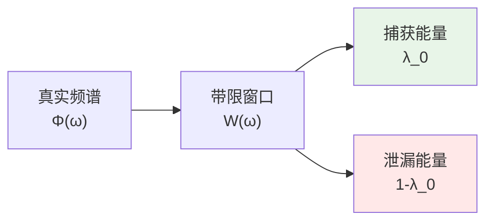
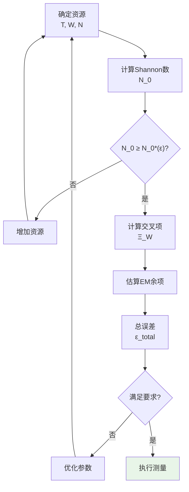

# 02 - 谱窗化技术与误差控制

## 引言

在实际测量中，我们总是面临**有限资源**的约束：

- **有限时间**：测量窗口$[-T, T]$
- **有限带宽**：有效频带$[-W, W]$
- **有限复杂性**：离散采样点$N$

这些限制不可避免地引入**误差**。但误差并非无法控制——通过巧妙选择**窗函数**，我们可以在给定资源约束下**最小化误差**。

本章的核心工具是**PSWF/DPSS窗函数**：

- **PSWF**（Prolate Spheroidal Wave Functions）：连续情形
- **DPSS**（Discrete Prolate Spheroidal Sequences）：离散情形

它们是时间-频率双限制下**能量集中度最优**的函数，因此成为谱窗化读数的理想选择。

## 误差的三重分解

根据`euler-gls-extend/error-controllability-finite-order-pswf-dpss.md`，总误差可分解为三个独立部分：

$$
\text{Total Error} = \underbrace{\text{主泄漏}}_{\sim 1-\lambda_0} + \underbrace{\text{交叉项}}_{\text{Hankel-HS}} + \underbrace{\text{求和-积分差}}_{\text{EM余项}}
$$

### 第一类：主泄漏（Band-limiting Leakage）

**物理图像**：

想象一个信号的频谱，我们只在$[-W, W]$内测量。频带外的能量就"泄漏"了，无法被捕获。



**数学定义**：

设$g_{\ast}$是最优窗函数（PSWF的频域形式），$B_W$是带限投影算子：

$$
B_W f = \mathcal{F}^{-1}(\mathbb{1}_{[-W,W]}\widehat{f})
$$

则主泄漏为：

$$
\text{Leakage} = |(I-B_W)g_{\ast}|_2^2 = 1-\lambda_0
$$

其中$\lambda_0$是PSWF的最大特征值。

**定理1**（极值窗唯一性）：

> 在时限$[-T,T]$、带限$[-W,W]$的约束下，最大化能量集中度$\lambda$的窗函数$g_{\ast}$**唯一**（除相位），且满足：
>
> $$
> |B_W g_{\ast}|_2^2 = \lambda_0, \quad |(I-B_W)g_{\ast}|_2^2 = 1-\lambda_0
> $$

证明：见附录A.1（基于Sturm-Liouville理论与振荡定理）。

### 第二类：交叉项（Multiplicative Cross-term）

**物理图像**：

当信号被**乘法**调制（如与窗函数相乘），频域上发生**卷积**。原本带限的信号可能因此"展宽"到带外。

**示例**：

信号$f(t)$带限于$[-W_0, W_0]$，乘以窗函数$w(t)$：

$$
h(t) = f(t)w(t)
$$

频域：

$$
\widehat{h}(\omega) = (\widehat{f}\ast\widehat{w})(\omega) = \int \widehat{f}(\omega')\widehat{w}(\omega-\omega')\mathrm{d}\omega'
$$

即使$\widehat{f}$紧支在$[-W_0, W_0]$，$\widehat{h}$可能延伸到更宽范围。

**定理2**（Hankel-HS精确公式）：

> 对$x\in L^{\infty}\cap L^2$，带限投影$B_W$，定义乘法算子$M_x f = xf$，则：
>
> $$
> |(I-B_W)M_x B_W|_{\text{HS}}^2 = \int_{\mathbb{R}}|\widehat{x}(\delta)|^2\sigma_W(\delta)\mathrm{d}\delta
> $$
>
> 其中：
>
> $$
> \sigma_W(\delta) = \min(2W, |\delta|)
> $$

**几何意义**：

$\sigma_W(\delta)$是"Hankel块"的测度：对频移$\delta$，它度量$[-W,W]$与$[-W,W]+\delta$的重叠长度的补。

**上界估计**：

对最优窗$g_{\ast}$：

$$
|(I-B_W)M_x g_{\ast}|_2 \leq |(I-B_W)M_x B_W|_{\text{HS}} + |x|_{\infty}\sqrt{1-\lambda_0}
$$

第一项（Hankel-HS）可精确计算，第二项（泄漏）已知。

**工程实现**：

```python
def hankel_hs_norm(x_hat, W):
    """计算Hankel-HS范数"""
    delta = np.fft.fftfreq(len(x_hat)) # 频移
    sigma_W = np.minimum(2*W, np.abs(delta))
    hs_sq = np.sum(np.abs(x_hat)**2 * sigma_W)
    return np.sqrt(hs_sq)
```

### 第三类：求和-积分差（Euler-Maclaurin余项）

**物理图像**：

离散测量时，我们用**求和**代替**积分**：

$$
\sum_{n} f(n\Delta\omega) \quad\text{vs.}\quad \int f(\omega)\mathrm{d}\omega
$$

二者的差就是EM余项。

**定理3**（EM余项上界）：

> 对$g\in W^{2p,1}(\mathbb{R})$（$2p$阶导数$L^1$），EM余项满足：
>
> $$
> |R_{2p}(g)| \leq \frac{2\zeta(2p)}{(2\pi)^{2p}}|g^{(2p)}|_{L^1}
> $$
>
> 若$g$带限于$[-\Omega, \Omega]$且在长度$L$的区域局部化，则：
>
> $$
> \frac{|R_{2p}(g)|}{|g|_2} \leq 2\zeta(2p)\sqrt{L}\Omega^{2p}
> $$

**门限数值**（达到$10^{-3}$精度）：

| 阶数$p$ | $\zeta(2p)$ | 门限：$\sqrt{L}\Omega^{2p} \leq$ |
|---------|-------------|--------------------------------|
| 2 | 1.645 | $4.62\times 10^{-4}$ |
| 3 | 1.017 | $4.91\times 10^{-4}$ |
| 4 | 1.004 | $4.98\times 10^{-4}$ |

**$(2\pi)$抵消现象**：

注意到：
- BPW不等式：$|g^{(m)}|_2 \leq (2\pi\Omega)^m|g|_2$
- EM常数分母：$(2\pi)^{2p}$

二者完全抵消！这在cycles归一化$\widehat{f}(\xi) = \int f(t)e^{-2\pi it\xi}\mathrm{d}t$下自动成立。

**实验选择**：

给定$(L, \Omega)$，选择最小$p$使得$\sqrt{L}\Omega^{2p}$低于容限。

## PSWF/DPSS的构造与性质

### 连续PSWF

**定义**：

固定时限$T$、带限$W$，定义积分算子：

$$
(\mathcal{K}f)(t) = \int_{-T}^{T}\frac{\sin W(t-s)}{\pi(t-s)}f(s)\mathrm{d}s, \quad |t|\leq T
$$

其特征值问题：

$$
\mathcal{K}\psi_n = \lambda_n\psi_n
$$

定义PSWF。

**性质**：

1. **正交性**：$\{\psi_n\}$在$L^2([-T,T])$中正交
2. **排序**：$\lambda_0 > \lambda_1 > \cdots > 0$
3. **能量集中**：$\lambda_n$是$\psi_n$在$[-W,W]$内的频域能量占比
4. **最优性**：前$K$个PSWF张成的子空间，在所有$K$维子空间中能量集中度总和最大

**特征值渐近**：

定义**Shannon数**：

$$
N_0 = 2TW
$$

则：

- 当$n < N_0 - c\log N_0$时，$\lambda_n \approx 1-e^{-c'N_0}$（近乎完美）
- 当$n > N_0 + c\log N_0$时，$\lambda_n \approx e^{-c''N_0}$（指数衰减）

**有效自由度**：

$$
N_{\text{eff}} = \sum_{n=0}^{\infty}\lambda_n \approx N_0 + \mathcal{O}(\log N_0)
$$

物理意义：在时限$T$、带限$W$的约束下，可靠编码的独立模式数$\approx 2TW$。

### 离散DPSS

**定义**：

长度$N$的序列，归一化带宽$W\in(0, 1/2)$，Toeplitz矩阵：

$$
K_{mn} = \frac{\sin 2\pi W(m-n)}{\pi(m-n)}, \quad 0\leq m,n\leq N-1
$$

对角元：$K_{mm} = 2W$。

特征值问题：

$$
\sum_{n=0}^{N-1}K_{mn}v_n^{(k)} = \lambda_k v_m^{(k)}
$$

**DPSS**：$\{v^{(k)}\}$，能量集中度$\lambda_k$。

**离散Shannon数**：

$$
N_0^{\text{disc}} = 2NW
$$

**性质**：

与PSWF平行，但在离散网格上。特别适合数字信号处理。

## 非渐近特征值上界

**定理5**（KRD上界）：

> 令$N_0 = 2TW$（连续）或$N_0 = 2NW$（离散），则主特征值满足：
>
> $$
> 1-\lambda_0 \leq 10\exp\left(-\frac{(\lfloor N_0\rfloor - 7)^2}{\pi^2\log(50N_0+25)}\right)
> $$

**最小整数门限**：

定义$N_0^{\star}(\varepsilon)$为使右端$\leq \varepsilon$的最小整数。

| 精度$\varepsilon$ | $N_0^{\star}$ | $c^{\star} = \pi N_0^{\star}/2$ | 应用 |
|------------------|--------------|-------------------------------|------|
| $10^{-3}$ | 33 | 51.8 | 工程级 |
| $10^{-6}$ | 42 | 66.0 | 精密测量 |
| $10^{-9}$ | 50 | 78.5 | 超精密 |

**与窗形无关**：

这是**非渐近**、**显式**的上界，不依赖具体窗函数形状，仅需$N_0$！

## 拓扑整数主项：谱流$\equiv$投影对指标

### 求和-积分差的拓扑起源

频域平滑乘子$\phi\in C_c^{\infty}$，定义：

$$
\Pi = \mathcal{F}^{-1}M_{\phi}\mathcal{F}, \quad P = \mathbb{1}_{[1/2,\infty)}(\Pi)
$$

调制群：$U_{\theta}f(t) = e^{2\pi i\theta t}f(t)$

相对投影：$P_{\theta} = U_{\theta}PU_{\theta}^{\dagger}$

**定理4**（谱流$=$投影对指标）：

> 若$P-P_{\theta}\in\mathcal{S}_1$（迹类），$\theta\mapsto U_{\theta}$强连续，则：
>
> $$
> \text{Sf}(A(\theta))_{\theta_0}^{\theta_1} = \text{ind}(P, P_{\theta_1}) - \text{ind}(P, P_{\theta_0}) \in \mathbb{Z}
> $$
>
> 其中$A(\theta) = 2P_{\theta}-I$。

**物理意义**：

求和$\sum_n f(n)$与积分$\int f(x)\mathrm{d}x$的差，在适当正则化下，等于某个**谱流**——这是拓扑不变量，必为**整数**！

**整数主项+解析尾项**：

$$
\sum_{n=0}^{N}f(n) - \int_0^N f(x)\mathrm{d}x = \underbrace{n_{\text{sf}}}_{\in\mathbb{Z}} + \underbrace{R_{2p}(f)}_{\text{解析}}
$$

第一项（谱流）对平滑扰动鲁棒，第二项（EM余项）由定理3控制。

## 实验误差预算流程

### 步骤1：确定资源约束

- 时间窗口：$T$（测量时长）
- 频带：$W$（仪器带宽）
- 采样数：$N$（ADC位数、采样率）

### 步骤2：计算Shannon数

$$
N_0 = \begin{cases}
2TW & \text{连续}\\
2NW & \text{离散}
\end{cases}
$$

### 步骤3：查表得误差上界

根据$N_0$和目标精度$\varepsilon$，查定理5的表：

- 若$N_0 \geq N_0^{\star}(\varepsilon)$，则主泄漏$\leq \varepsilon$
- 否则，增加$T$或$W$或$N$

### 步骤4：计算交叉项

若有乘法调制（如窗函数、前景去除），计算Hankel-HS：

$$
\Xi_W(x) = \sqrt{\int|\widehat{x}(\delta)|^2\min(2W,|\delta|)\mathrm{d}\delta}
$$

若$\widehat{x}$窄带且经预滤波，$\Xi_W\ll 1$。

### 步骤5：估算EM余项

选择阶数$p$，使$\sqrt{L}\Omega^{2p} \leq \varepsilon/(2\zeta(2p))$。

计算或估算$|g^{(2p)}|_{L^1}$（通常可从信号先验约束）。

### 步骤6：总误差预算

$$
\epsilon_{\text{total}} \leq \underbrace{\varepsilon}_{\text{主泄漏}} + \underbrace{\Xi_W(x)+|x|_{\infty}\sqrt{\varepsilon}}_{\text{交叉项}} + \underbrace{2\zeta(2p)\sqrt{L}\Omega^{2p}}_{\text{EM余项}}
$$

若$\epsilon_{\text{total}}$满足要求，方案可行；否则优化各参数。

### 流程图



## 案例研究：FRB窗化上限

### 背景

快速射电暴（FRB）穿越宇宙学距离，相位累积：

$$
\Delta\phi = \int_0^{\chi_s}\frac{\omega_{\text{obs}}}{c}\delta n(\chi)\mathrm{d}\chi
$$

其中$\delta n$是折射率修正（如真空极化）。

### 窗化策略

- **观测频带**：$[\omega_{\min}, \omega_{\max}] \sim [0.4, 0.8]$ GHz（CHIME）
- **频率分辨率**：$\Delta\omega \sim 1$ MHz
- **通道数**：$N \sim 1024$

Shannon数：

$$
N_0 = 2\times 1024\times 0.195 \approx 400
$$

主泄漏上界（$\varepsilon = 10^{-3}$）：

$$
1-\lambda_0 \leq 10\exp\left(-\frac{(400-7)^2}{\pi^2\log(20025)}\right) \approx 10^{-1700}
$$

**远超要求**！实际限制来自系统学误差。

### 系统学建模

前景：银河弥散、电离层、仪器响应

基函数：$\{\Pi_p(\omega)\} = \{1, \omega, \omega^{-1}, \log\omega\}$

窗化残差：

$$
R_{\text{FRB}}(W_j) = \langle W_j, \Phi_{\text{FRB}}-\sum a_p\Pi_p\rangle
$$

### 误差分解

1. **主泄漏**：$\sim 10^{-1700}$（可忽略）
2. **交叉项**：前景去除后$\sim 10^{-2}$
3. **EM余项**：采样密集$\sim 10^{-6}$

**总预算**：$\sim 10^{-2}$（dominated by systematics）

### 上限结果

若观测残差$|R_{\text{FRB}}| < \sigma_{\text{obs}}$，则：

$$
\delta n < \frac{\sigma_{\text{obs}}c}{\omega_{\text{obs}}L}
$$

对于$L \sim 1$ Gpc，$\omega_{\text{obs}} \sim 1$ GHz，$\sigma_{\text{obs}} \sim 1$ mrad：

$$
\delta n < 10^{-28}
$$

这远优于QED一环预言$\delta n \sim 10^{-53}$（见第5章），故仅能给出**上限**。

## 案例研究：δ-环谱测量

### 背景

δ-环的谱方程：

$$
\cos\theta = \cos(kL) + \frac{\alpha_{\delta}}{k}\sin(kL)
$$

测量$\{k_n(\theta)\}$，提取$\alpha_{\delta}$。

### 离散DPSS窗

- 测量点数：$N = 100$（扫描$\theta\in[0, 2\pi]$）
- 有效带宽：$W = 0.3$（归一化）

Shannon数：

$$
N_0^{\text{disc}} = 2\times 100\times 0.3 = 60
$$

主泄漏（$\varepsilon = 10^{-3}$）：

$$
1-\lambda_0 \leq 10\exp\left(-\frac{(60-7)^2}{\pi^2\log(3025)}\right) \approx 10^{-55}
$$

### 反演算法

```python
def invert_alpha_delta(k_values, theta_values, L):
    """从谱数据反演δ势强度"""
    def residual(alpha):
        # 谱方程
        lhs = np.cos(k_values * L) + (alpha / k_values) * np.sin(k_values * L)
        rhs = np.cos(theta_values)
        return np.sum((lhs - rhs)**2)

    result = minimize(residual, x0=1.0)
    return result.x[0]
```

### 病态域规避

定义灵敏度：

$$
S = \left|\frac{\partial k}{\partial\alpha_{\delta}}\right| = \left|\frac{\sin(kL)/k}{L\sin(kL)-(\alpha_{\delta}/k)L\cos(kL)+(\alpha_{\delta}/k^2)\sin(kL)}\right|
$$

病态域：$S > S_{\text{crit}} \sim 10^3$

策略：选择$\theta$使测量点避开病态域。

## 工程实现：数值算法

### PSWF计算

**方法1**：直接对角化

```python
def compute_pswf(T, W, N=128):
    """计算前N个PSWF"""
    t = np.linspace(-T, T, 1024)
    dt = t[1] - t[0]

    # 积分算子核
    def kernel(s, t):
        return np.sinc(W * (t - s) / np.pi)

    # 构造矩阵
    K = np.zeros((len(t), len(t)))
    for i, ti in enumerate(t):
        for j, sj in enumerate(t):
            K[i,j] = kernel(sj, ti) * dt

    # 对角化
    eigvals, eigvecs = np.linalg.eigh(K)
    idx = np.argsort(eigvals)[::-1] # 降序
    return eigvals[idx[:N]], eigvecs[:,idx[:N]]
```

**方法2**：利用对称性（快速算法）

PSWF是prolate spheroidal微分方程的解，可用特殊函数库（如`scipy.special.pro_ang1`）。

### DPSS计算

```python
from scipy.signal import windows

def compute_dpss(N, NW, num_windows=8):
    """计算DPSS窗"""
    return windows.dpss(N, NW, num_windows, return_ratios=False)
```

### 窗化读数

```python
def windowed_readout(signal, windows):
    """用窗函数族提取系数"""
    coeffs = []
    for w in windows:
        c = np.dot(signal, w) / np.linalg.norm(w)**2
        coeffs.append(c)
    return np.array(coeffs)
```

### 重构

```python
def reconstruct(coeffs, windows):
    """从窗化系数重构信号"""
    return np.sum([c * w for c, w in zip(coeffs, windows)], axis=0)
```

## 小结

本章建立了谱窗化技术的完整误差控制体系：

### 理论基础

1. **误差三重分解**：主泄漏+交叉项+EM余项
2. **PSWF/DPSS最优性**：时频集中度最大
3. **拓扑整数主项**：谱流$=$投影对指标

### 关键公式

- 主泄漏：$1-\lambda_0 \leq 10\exp\left(-\frac{(\lfloor N_0\rfloor-7)^2}{\pi^2\log(50N_0+25)}\right)$
- 交叉项：$\Xi_W^2 = \int|\widehat{x}(\delta)|^2\min(2W,|\delta|)\mathrm{d}\delta$
- EM余项：$|R_{2p}|/|g|_2 \leq 2\zeta(2p)\sqrt{L}\Omega^{2p}$

### 实验流程

1. 确定$(T, W, N) \Rightarrow N_0$
2. 查表得主泄漏上界
3. 计算交叉项（若有调制）
4. 估算EM余项（若离散采样）
5. 总预算 $\Rightarrow$ 可行性判断

### 应用案例

- **FRB窗化上限**：Shannon数$\sim 400$，主泄漏可忽略，系统学主导
- **δ-环谱测量**：Shannon数$\sim 60$，主泄漏极小，病态域需规避

下一章将聚焦**拓扑指纹**的光学实现，展示如何测量$\pi$-台阶、$\mathbb{Z}_2$奇偶等离散不变量。

## 参考文献

[1] Slepian, D., Pollak, H. O., "Prolate spheroidal wave functions, Fourier analysis and uncertainty — I," *Bell Syst. Tech. J.* **40**, 43 (1961).

[2] Thomson, D. J., "Spectrum estimation and harmonic analysis," *Proc. IEEE* **70**, 1055 (1982).

[3] Vaaler, J. D., "Some extremal functions in Fourier analysis," *Bull. AMS* **12**, 183 (1985).

[4] Littmann, F., "Entire approximations to the truncated powers," *Constr. Approx.* **22**, 273 (2005).

[5] Atkinson, K., Han, W., *Theoretical Numerical Analysis*, Springer (2009).

[6] `euler-gls-extend/error-controllability-finite-order-pswf-dpss.md`（源理论文档）
