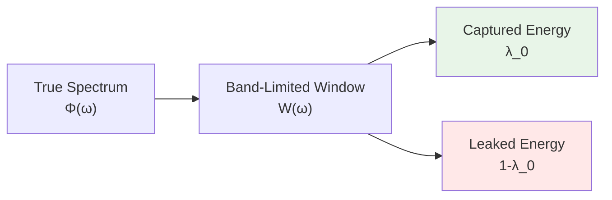
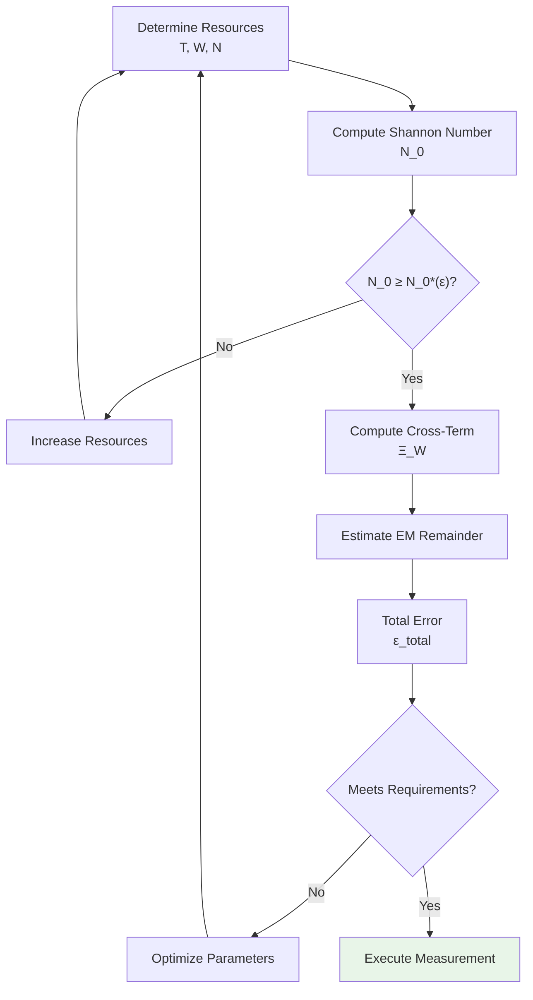

# 02 - Spectral Windowing Techniques and Error Control

## Introduction

In practical measurements, we always face constraints of **finite resources**:

- **Finite time**: measurement window $[-T, T]$
- **Finite bandwidth**: effective frequency band $[-W, W]$
- **Finite complexity**: discrete sampling points $N$

These limitations inevitably introduce **errors**. But errors are not uncontrollable—through clever choice of **window functions**, we can **minimize errors** under given resource constraints.

The core tool of this chapter is **PSWF/DPSS window functions**:

- **PSWF** (Prolate Spheroidal Wave Functions): continuous case
- **DPSS** (Discrete Prolate Spheroidal Sequences): discrete case

They are functions with **optimal energy concentration** under time-frequency dual constraints, making them ideal choices for spectral windowed readout.

## Triple Decomposition of Errors

According to `euler-gls-extend/error-controllability-finite-order-pswf-dpss.md`, the total error can be decomposed into three independent parts:

$$
\text{Total Error} = \underbrace{\text{Main Leakage}}_{\sim 1-\lambda_0} + \underbrace{\text{Cross-Term}}_{\text{Hankel-HS}} + \underbrace{\text{Sum-Integral Difference}}_{\text{EM Remainder}}
$$

### Type One: Main Leakage (Band-limiting Leakage)

**Physical picture**:

Imagine a signal's spectrum; we only measure within $[-W, W]$. Energy outside the band "leaks" and cannot be captured.



**Mathematical definition**:

Let $g_{\ast}$ be the optimal window function (frequency-domain form of PSWF), $B_W$ be the band-limiting projection operator:

$$
B_W f = \mathcal{F}^{-1}(\mathbb{1}_{[-W,W]}\widehat{f})
$$

Then the main leakage is:

$$
\text{Leakage} = |(I-B_W)g_{\ast}|_2^2 = 1-\lambda_0
$$

where $\lambda_0$ is the largest eigenvalue of PSWF.

**Theorem 1** (Extremal Window Uniqueness):

> Under constraints of time limit $[-T,T]$ and band limit $[-W,W]$, the window function $g_{\ast}$ that maximizes energy concentration $\lambda$ is **unique** (up to phase) and satisfies:
>
> $$
> |B_W g_{\ast}|_2^2 = \lambda_0, \quad |(I-B_W)g_{\ast}|_2^2 = 1-\lambda_0
> $$

Proof: See Appendix A.1 (based on Sturm-Liouville theory and oscillation theorem).

### Type Two: Cross-Term (Multiplicative Cross-term)

**Physical picture**:

When a signal is **multiplicatively** modulated (e.g., multiplied by a window function), **convolution** occurs in the frequency domain. A signal originally band-limited may thus "spread" beyond the band.

**Example**:

Signal $f(t)$ band-limited to $[-W_0, W_0]$, multiplied by window function $w(t)$:

$$
h(t) = f(t)w(t)
$$

Frequency domain:

$$
\widehat{h}(\omega) = (\widehat{f}\ast\widehat{w})(\omega) = \int \widehat{f}(\omega')\widehat{w}(\omega-\omega')\mathrm{d}\omega'
$$

Even if $\widehat{f}$ is compactly supported on $[-W_0, W_0]$, $\widehat{h}$ may extend to a wider range.

**Theorem 2** (Hankel-HS Exact Formula):

> For $x\in L^{\infty}\cap L^2$, band-limiting projection $B_W$, define multiplication operator $M_x f = xf$, then:
>
> $$
> |(I-B_W)M_x B_W|_{\text{HS}}^2 = \int_{\mathbb{R}}|\widehat{x}(\delta)|^2\sigma_W(\delta)\mathrm{d}\delta
> $$
>
> where:
>
> $$
> \sigma_W(\delta) = \min(2W, |\delta|)
> $$

**Geometric meaning**:

$\sigma_W(\delta)$ is the measure of the "Hankel block": for frequency shift $\delta$, it measures the complement of the overlap length between $[-W,W]$ and $[-W,W]+\delta$.

**Upper bound estimate**:

For optimal window $g_{\ast}$:

$$
|(I-B_W)M_x g_{\ast}|_2 \leq |(I-B_W)M_x B_W|_{\text{HS}} + |x|_{\infty}\sqrt{1-\lambda_0}
$$

The first term (Hankel-HS) can be computed exactly, the second term (leakage) is known.

**Engineering implementation**:

```python
def hankel_hs_norm(x_hat, W):
    """Compute Hankel-HS norm"""
    delta = np.fft.fftfreq(len(x_hat)) # frequency shift
    sigma_W = np.minimum(2*W, np.abs(delta))
    hs_sq = np.sum(np.abs(x_hat)**2 * sigma_W)
    return np.sqrt(hs_sq)
```

### Type Three: Sum-Integral Difference (Euler-Maclaurin Remainder)

**Physical picture**:

In discrete measurements, we use **summation** instead of **integration**:

$$
\sum_{n} f(n\Delta\omega) \quad\text{vs.}\quad \int f(\omega)\mathrm{d}\omega
$$

The difference is the EM remainder.

**Theorem 3** (EM Remainder Upper Bound):

> For $g\in W^{2p,1}(\mathbb{R})$ ($2p$-th derivative in $L^1$), the EM remainder satisfies:
>
> $$
> |R_{2p}(g)| \leq \frac{2\zeta(2p)}{(2\pi)^{2p}}|g^{(2p)}|_{L^1}
> $$
>
> If $g$ is band-limited to $[-\Omega, \Omega]$ and localized in a region of length $L$, then:
>
> $$
> \frac{|R_{2p}(g)|}{|g|_2} \leq 2\zeta(2p)\sqrt{L}\Omega^{2p}
> $$

**Threshold values** (to achieve $10^{-3}$ precision):

| Order $p$ | $\zeta(2p)$ | Threshold: $\sqrt{L}\Omega^{2p} \leq$ |
|-----------|-------------|--------------------------------------|
| 2 | 1.645 | $4.62\times 10^{-4}$ |
| 3 | 1.017 | $4.91\times 10^{-4}$ |
| 4 | 1.004 | $4.98\times 10^{-4}$ |

**$(2\pi)$ cancellation phenomenon**:

Note that:
- BPW inequality: $|g^{(m)}|_2 \leq (2\pi\Omega)^m|g|_2$
- EM constant denominator: $(2\pi)^{2p}$

They completely cancel! This automatically holds under cycles normalization $\widehat{f}(\xi) = \int f(t)e^{-2\pi it\xi}\mathrm{d}t$.

**Experimental choice**:

Given $(L, \Omega)$, choose the minimum $p$ such that $\sqrt{L}\Omega^{2p}$ is below tolerance.

## Construction and Properties of PSWF/DPSS

### Continuous PSWF

**Definition**:

Fix time limit $T$, band limit $W$, define integral operator:

$$
(\mathcal{K}f)(t) = \int_{-T}^{T}\frac{\sin W(t-s)}{\pi(t-s)}f(s)\mathrm{d}s, \quad |t|\leq T
$$

Its eigenvalue problem:

$$
\mathcal{K}\psi_n = \lambda_n\psi_n
$$

defines PSWF.

**Properties**:

1. **Orthogonality**: $\{\psi_n\}$ are orthogonal in $L^2([-T,T])$
2. **Ordering**: $\lambda_0 > \lambda_1 > \cdots > 0$
3. **Energy concentration**: $\lambda_n$ is the frequency-domain energy fraction of $\psi_n$ within $[-W,W]$
4. **Optimality**: The subspace spanned by the first $K$ PSWFs has the maximum total energy concentration among all $K$-dimensional subspaces

**Eigenvalue asymptotics**:

Define **Shannon number**:

$$
N_0 = 2TW
$$

Then:

- When $n < N_0 - c\log N_0$, $\lambda_n \approx 1-e^{-c'N_0}$ (nearly perfect)
- When $n > N_0 + c\log N_0$, $\lambda_n \approx e^{-c''N_0}$ (exponential decay)

**Effective degrees of freedom**:

$$
N_{\text{eff}} = \sum_{n=0}^{\infty}\lambda_n \approx N_0 + \mathcal{O}(\log N_0)
$$

Physical meaning: Under constraints of time limit $T$ and band limit $W$, the number of reliably encodable independent modes $\approx 2TW$.

### Discrete DPSS

**Definition**:

Sequence of length $N$, normalized bandwidth $W\in(0, 1/2)$, Toeplitz matrix:

$$
K_{mn} = \frac{\sin 2\pi W(m-n)}{\pi(m-n)}, \quad 0\leq m,n\leq N-1
$$

Diagonal elements: $K_{mm} = 2W$.

Eigenvalue problem:

$$
\sum_{n=0}^{N-1}K_{mn}v_n^{(k)} = \lambda_k v_m^{(k)}
$$

**DPSS**: $\{v^{(k)}\}$, energy concentration $\lambda_k$.

**Discrete Shannon number**:

$$
N_0^{\text{disc}} = 2NW
$$

**Properties**:

Parallel to PSWF, but on discrete grid. Particularly suitable for digital signal processing.

## Non-Asymptotic Eigenvalue Upper Bound

**Theorem 5** (KRD Upper Bound):

> Let $N_0 = 2TW$ (continuous) or $N_0 = 2NW$ (discrete), then the principal eigenvalue satisfies:
>
> $$
> 1-\lambda_0 \leq 10\exp\left(-\frac{(\lfloor N_0\rfloor - 7)^2}{\pi^2\log(50N_0+25)}\right)
> $$

**Minimum integer threshold**:

Define $N_0^{\star}(\varepsilon)$ as the minimum integer such that the right-hand side $\leq \varepsilon$.

| Precision $\varepsilon$ | $N_0^{\star}$ | $c^{\star} = \pi N_0^{\star}/2$ | Application |
|-------------------------|---------------|--------------------------------|-------------|
| $10^{-3}$ | 33 | 51.8 | Engineering level |
| $10^{-6}$ | 42 | 66.0 | Precision measurement |
| $10^{-9}$ | 50 | 78.5 | Ultra-precision |

**Window-shape independent**:

This is a **non-asymptotic**, **explicit** upper bound, independent of specific window function shape, requiring only $N_0$!

## Topological Integer Main Term: Spectral Flow $\equiv$ Projection Pair Index

### Topological Origin of Sum-Integral Difference

Frequency-domain smooth multiplier $\phi\in C_c^{\infty}$, define:

$$
\Pi = \mathcal{F}^{-1}M_{\phi}\mathcal{F}, \quad P = \mathbb{1}_{[1/2,\infty)}(\Pi)
$$

Modulation group: $U_{\theta}f(t) = e^{2\pi i\theta t}f(t)$

Relative projection: $P_{\theta} = U_{\theta}PU_{\theta}^{\dagger}$

**Theorem 4** (Spectral Flow $=$ Projection Pair Index):

> If $P-P_{\theta}\in\mathcal{S}_1$ (trace class), $\theta\mapsto U_{\theta}$ strongly continuous, then:
>
> $$
> \text{Sf}(A(\theta))_{\theta_0}^{\theta_1} = \text{ind}(P, P_{\theta_1}) - \text{ind}(P, P_{\theta_0}) \in \mathbb{Z}
> $$
>
> where $A(\theta) = 2P_{\theta}-I$.

**Physical meaning**:

The difference between sum $\sum_n f(n)$ and integral $\int f(x)\mathrm{d}x$, under appropriate regularization, equals some **spectral flow**—this is a topological invariant, necessarily an **integer**!

**Integer main term + analytic tail term**:

$$
\sum_{n=0}^{N}f(n) - \int_0^N f(x)\mathrm{d}x = \underbrace{n_{\text{sf}}}_{\in\mathbb{Z}} + \underbrace{R_{2p}(f)}_{\text{analytic}}
$$

The first term (spectral flow) is robust to smooth perturbations, the second term (EM remainder) is controlled by Theorem 3.

## Experimental Error Budget Workflow

### Step 1: Determine Resource Constraints

- Time window: $T$ (measurement duration)
- Frequency band: $W$ (instrument bandwidth)
- Number of samples: $N$ (ADC bits, sampling rate)

### Step 2: Compute Shannon Number

$$
N_0 = \begin{cases}
2TW & \text{continuous}\\
2NW & \text{discrete}
\end{cases}
$$

### Step 3: Look Up Error Upper Bound

According to $N_0$ and target precision $\varepsilon$, consult Theorem 5's table:

- If $N_0 \geq N_0^{\star}(\varepsilon)$, then main leakage $\leq \varepsilon$
- Otherwise, increase $T$ or $W$ or $N$

### Step 4: Compute Cross-Term

If there is multiplicative modulation (e.g., window function, foreground removal), compute Hankel-HS:

$$
\Xi_W(x) = \sqrt{\int|\widehat{x}(\delta)|^2\min(2W,|\delta|)\mathrm{d}\delta}
$$

If $\widehat{x}$ is narrowband and pre-filtered, $\Xi_W\ll 1$.

### Step 5: Estimate EM Remainder

Choose order $p$ such that $\sqrt{L}\Omega^{2p} \leq \varepsilon/(2\zeta(2p))$.

Compute or estimate $|g^{(2p)}|_{L^1}$ (usually from signal prior constraints).

### Step 6: Total Error Budget

$$
\epsilon_{\text{total}} \leq \underbrace{\varepsilon}_{\text{main leakage}} + \underbrace{\Xi_W(x)+|x|_{\infty}\sqrt{\varepsilon}}_{\text{cross-term}} + \underbrace{2\zeta(2p)\sqrt{L}\Omega^{2p}}_{\text{EM remainder}}
$$

If $\epsilon_{\text{total}}$ meets requirements, the scheme is feasible; otherwise optimize parameters.

### Workflow Diagram



## Case Study: FRB Windowed Upper Bound

### Background

Fast Radio Bursts (FRB) traverse cosmological distances, phase accumulation:

$$
\Delta\phi = \int_0^{\chi_s}\frac{\omega_{\text{obs}}}{c}\delta n(\chi)\mathrm{d}\chi
$$

where $\delta n$ is the refractive index correction (e.g., vacuum polarization).

### Windowing Strategy

- **Observation band**: $[\omega_{\min}, \omega_{\max}] \sim [0.4, 0.8]$ GHz (CHIME)
- **Frequency resolution**: $\Delta\omega \sim 1$ MHz
- **Number of channels**: $N \sim 1024$

Shannon number:

$$
N_0 = 2\times 1024\times 0.195 \approx 400
$$

Main leakage upper bound ($\varepsilon = 10^{-3}$):

$$
1-\lambda_0 \leq 10\exp\left(-\frac{(400-7)^2}{\pi^2\log(20025)}\right) \approx 10^{-1700}
$$

**Far exceeds requirements**! Actual limitation comes from systematic errors.

### Systematic Modeling

Foreground: Galactic dispersion, ionosphere, instrument response

Basis functions: $\{\Pi_p(\omega)\} = \{1, \omega, \omega^{-1}, \log\omega\}$

Windowed residual:

$$
R_{\text{FRB}}(W_j) = \langle W_j, \Phi_{\text{FRB}}-\sum a_p\Pi_p\rangle
$$

### Error Decomposition

1. **Main leakage**: $\sim 10^{-1700}$ (negligible)
2. **Cross-term**: after foreground removal $\sim 10^{-2}$
3. **EM remainder**: dense sampling $\sim 10^{-6}$

**Total budget**: $\sim 10^{-2}$ (dominated by systematics)

### Upper Bound Result

If observed residual $|R_{\text{FRB}}| < \sigma_{\text{obs}}$, then:

$$
\delta n < \frac{\sigma_{\text{obs}}c}{\omega_{\text{obs}}L}
$$

For $L \sim 1$ Gpc, $\omega_{\text{obs}} \sim 1$ GHz, $\sigma_{\text{obs}} \sim 1$ mrad:

$$
\delta n < 10^{-28}
$$

This is far better than QED one-loop prediction $\delta n \sim 10^{-53}$ (see Chapter 5), so only an **upper bound** can be given.

## Case Study: δ-Ring Spectral Measurement

### Background

Spectral equation of δ-ring:

$$
\cos\theta = \cos(kL) + \frac{\alpha_{\delta}}{k}\sin(kL)
$$

Measure $\{k_n(\theta)\}$, extract $\alpha_{\delta}$.

### Discrete DPSS Window

- Number of measurement points: $N = 100$ (scan $\theta\in[0, 2\pi]$)
- Effective bandwidth: $W = 0.3$ (normalized)

Shannon number:

$$
N_0^{\text{disc}} = 2\times 100\times 0.3 = 60
$$

Main leakage ($\varepsilon = 10^{-3}$):

$$
1-\lambda_0 \leq 10\exp\left(-\frac{(60-7)^2}{\pi^2\log(3025)}\right) \approx 10^{-55}
$$

### Inversion Algorithm

```python
def invert_alpha_delta(k_values, theta_values, L):
    """Invert δ-potential strength from spectral data"""
    def residual(alpha):
        # Spectral equation
        lhs = np.cos(k_values * L) + (alpha / k_values) * np.sin(k_values * L)
        rhs = np.cos(theta_values)
        return np.sum((lhs - rhs)**2)

    result = minimize(residual, x0=1.0)
    return result.x[0]
```

### Ill-Conditioned Domain Avoidance

Define sensitivity:

$$
S = \left|\frac{\partial k}{\partial\alpha_{\delta}}\right| = \left|\frac{\sin(kL)/k}{L\sin(kL)-(\alpha_{\delta}/k)L\cos(kL)+(\alpha_{\delta}/k^2)\sin(kL)}\right|
$$

Ill-conditioned domain: $S > S_{\text{crit}} \sim 10^3$

Strategy: Choose $\theta$ such that measurement points avoid ill-conditioned domain.

## Engineering Implementation: Numerical Algorithms

### PSWF Computation

**Method 1**: Direct diagonalization

```python
def compute_pswf(T, W, N=128):
    """Compute first N PSWFs"""
    t = np.linspace(-T, T, 1024)
    dt = t[1] - t[0]

    # Integral operator kernel
    def kernel(s, t):
        return np.sinc(W * (t - s) / np.pi)

    # Construct matrix
    K = np.zeros((len(t), len(t)))
    for i, ti in enumerate(t):
        for j, sj in enumerate(t):
            K[i,j] = kernel(sj, ti) * dt

    # Diagonalize
    eigvals, eigvecs = np.linalg.eigh(K)
    idx = np.argsort(eigvals)[::-1] # descending order
    return eigvals[idx[:N]], eigvecs[:,idx[:N]]
```

**Method 2**: Exploit symmetry (fast algorithm)

PSWF is the solution of the prolate spheroidal differential equation, can use special function libraries (e.g., `scipy.special.pro_ang1`).

### DPSS Computation

```python
from scipy.signal import windows

def compute_dpss(N, NW, num_windows=8):
    """Compute DPSS windows"""
    return windows.dpss(N, NW, num_windows, return_ratios=False)
```

### Windowed Readout

```python
def windowed_readout(signal, windows):
    """Extract coefficients using window function family"""
    coeffs = []
    for w in windows:
        c = np.dot(signal, w) / np.linalg.norm(w)**2
        coeffs.append(c)
    return np.array(coeffs)
```

### Reconstruction

```python
def reconstruct(coeffs, windows):
    """Reconstruct signal from windowed coefficients"""
    return np.sum([c * w for c, w in zip(coeffs, windows)], axis=0)
```

## Summary

This chapter establishes a complete error control system for spectral windowing techniques:

### Theoretical Foundation

1. **Triple error decomposition**: main leakage + cross-term + EM remainder
2. **PSWF/DPSS optimality**: maximum time-frequency concentration
3. **Topological integer main term**: spectral flow $=$ projection pair index

### Key Formulas

- Main leakage: $1-\lambda_0 \leq 10\exp\left(-\frac{(\lfloor N_0\rfloor-7)^2}{\pi^2\log(50N_0+25)}\right)$
- Cross-term: $\Xi_W^2 = \int|\widehat{x}(\delta)|^2\min(2W,|\delta|)\mathrm{d}\delta$
- EM remainder: $|R_{2p}|/|g|_2 \leq 2\zeta(2p)\sqrt{L}\Omega^{2p}$

### Experimental Workflow

1. Determine $(T, W, N) \Rightarrow N_0$
2. Look up main leakage upper bound
3. Compute cross-term (if modulation exists)
4. Estimate EM remainder (if discrete sampling)
5. Total budget $\Rightarrow$ feasibility judgment

### Application Cases

- **FRB windowed upper bound**: Shannon number $\sim 400$, main leakage negligible, systematics dominate
- **δ-ring spectral measurement**: Shannon number $\sim 60$, main leakage extremely small, ill-conditioned domain needs avoidance

The next chapter will focus on the **optical implementation of topological fingerprints**, showing how to measure discrete invariants such as $\pi$-steps and $\mathbb{Z}_2$ parity.

## References

[1] Slepian, D., Pollak, H. O., "Prolate spheroidal wave functions, Fourier analysis and uncertainty — I," *Bell Syst. Tech. J.* **40**, 43 (1961).

[2] Thomson, D. J., "Spectrum estimation and harmonic analysis," *Proc. IEEE* **70**, 1055 (1982).

[3] Vaaler, J. D., "Some extremal functions in Fourier analysis," *Bull. AMS* **12**, 183 (1985).

[4] Littmann, F., "Entire approximations to the truncated powers," *Constr. Approx.* **22**, 273 (2005).

[5] Atkinson, K., Han, W., *Theoretical Numerical Analysis*, Springer (2009).

[6] `euler-gls-extend/error-controllability-finite-order-pswf-dpss.md` (source theoretical document)

