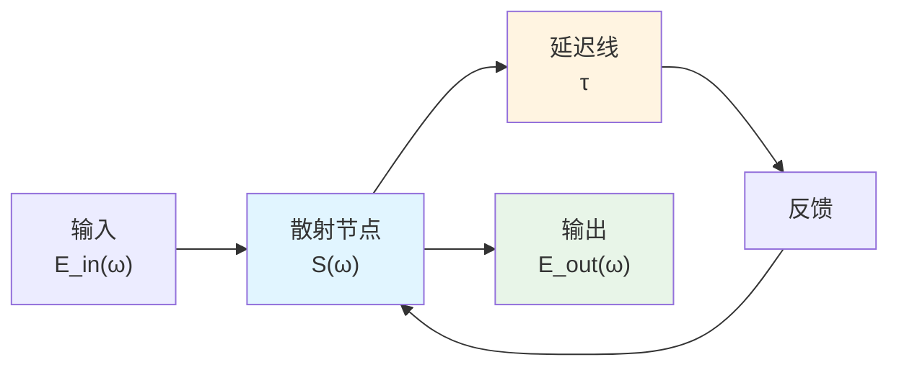
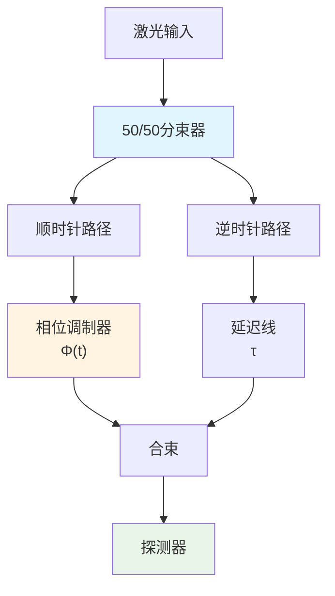
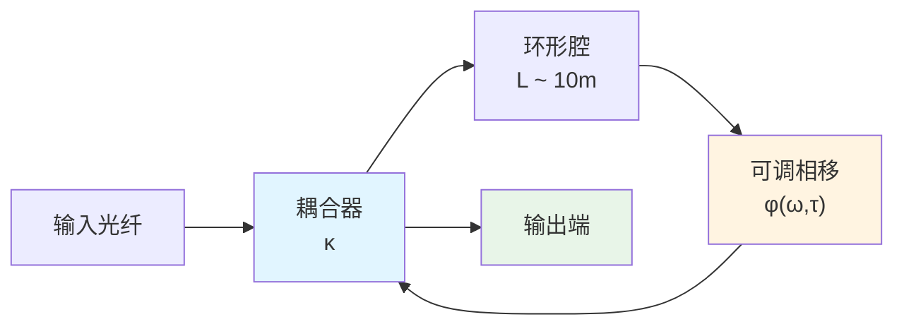
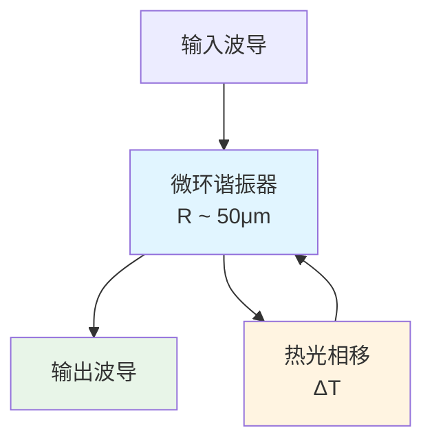
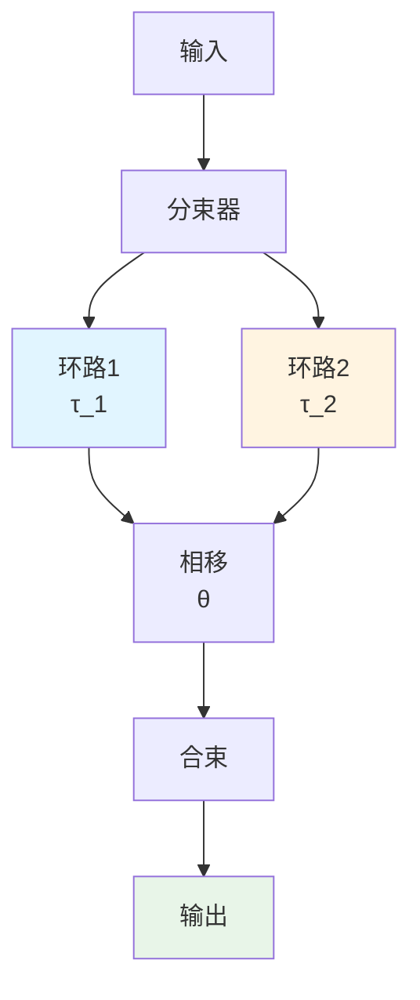
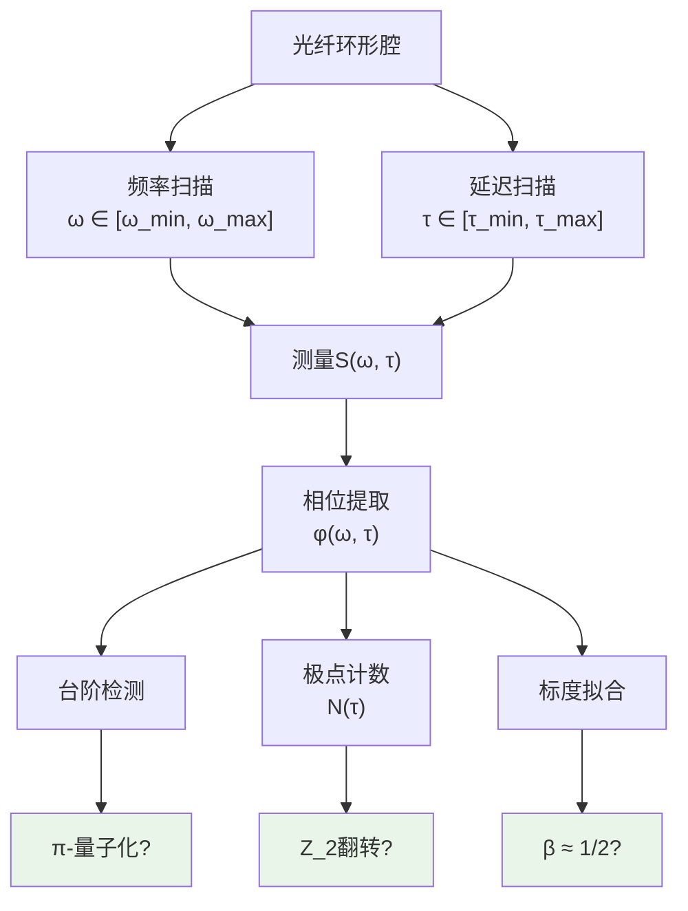

# 03 - 拓扑指纹的光学实现

## 引言

在前两章中，我们建立了统一时间刻度的测量方法和谱窗化误差控制体系。现在我们转向理论中最迷人的部分之一：**拓扑不变量**。

根据`euler-gls-extend/self-referential-scattering-network.md`和`euler-gls-extend/delay-quantization-feedback-loop-pi-step-parity-transition.md`，自指散射网络展现出三重**拓扑指纹**：

1. **$\pi$-台阶量子化**：散射相位以$\pi$为单位跳变
2. **$\mathbb{Z}_2$奇偶翻转**：拓扑指标在$\{0,1\}$间切换
3. **平方根标度律**：临界点附近$\Delta\omega \sim \sqrt{|\tau-\tau_c|}$

这些指纹是**整数/离散**量，对参数微扰**鲁棒**，因此成为实验验证的理想目标。

本章将展示如何在**光学平台**上实现并测量这些拓扑指纹。

## 自指散射网络的物理实现

### 基本架构

**自指条件**：输出经延迟$\tau$后反馈到输入，形成闭环。

**数学描述**（Redheffer星乘）：

设散射节点的S矩阵为：

$$
S = \begin{pmatrix}
S_{11} & S_{12}\\
S_{21} & S_{22}
\end{pmatrix}
$$

反馈环路引入相位$e^{-i\omega\tau}$，总系统的有效散射矩阵：

$$
S_{\text{eff}}(\omega; \tau) = S_{11} + S_{12}\frac{e^{-i\omega\tau}}{1-S_{22}e^{-i\omega\tau}}S_{21}
$$

**极点方程**（共振条件）：

$$
\det(I-S_{22}e^{-i\omega\tau}) = 0
$$

即：

$$
S_{22}(\omega)e^{-i\omega\tau} = 1
$$

### 光学实现方案

#### 方案一：Sagnac干涉仪

**参数**：
- 环路长度：$L \sim 1$ m
- 延迟：$\tau = n_{\text{eff}}L/c \sim 3$ ns
- 调制带宽：$\sim 10$ GHz
- 分束比：50/50

**自指机制**：

顺时针和逆时针光经过**不同路径长度**（通过相位调制器动态改变），在分束器处干涉。输出光强依赖于相对相位，可反馈控制调制器。

#### 方案二：光纤环形腔

**参数**：
- 腔长：$L = 10$ m $\Rightarrow$ FSR $= c/(nL) \approx 20$ MHz
- 耦合系数：$\kappa \sim 0.1$
- Finesse：$\mathcal{F} \sim 100$
- 相移器：电光调制器（LiNbO$_3$）

**自指机制**：

腔内光多次循环，每圈累积相位$\varphi = 2\pi nL\omega/c + \phi(\omega, \tau)$。当$\varphi = 2\pi m$（整数倍）时共振。通过主动锁定使$\phi$依赖于输出功率，形成反馈。

#### 方案三：集成光子芯片

**参数**：
- 环半径：$R = 50\mu$m
- FSR：$\sim 1$ THz
- Q因子：$\sim 10^5$
- 热光系数：$\partial n/\partial T \sim 10^{-4}$/K（Si）

**自指机制**：

光强吸收产生热，热导致折射率变化，折射率变化改变共振频率$\Rightarrow$非线性反馈。

## π-台阶量子化的测量

### 理论预言

**辐角原理定理**：

对于自指网络，散射相位$\varphi(\omega; \tau)$满足：

$$
\Delta\varphi_k \equiv \varphi(\omega_{k+1}; \tau) - \varphi(\omega_k; \tau) = \pm\pi
$$

其中$\{\omega_k(\tau)\}$是极点方程的根（共振频率）。

**物理起源**：

每当$\omega$扫过一个极点$\omega_k$，复平面上相位绕原点一圈$\Rightarrow$相位跳变$\pm\pi$。

**量子化条件**：

$$
\Delta\varphi \in \{\pm\pi, \pm 3\pi, \pm 5\pi, \dots\} = \pi\mathbb{Z}_{\text{odd}}
$$

基本单元是$\pi$（而非$2\pi$），这与费米子的双值性有深刻联系。

### 测量协议

#### 步骤1：频率扫描

固定延迟$\tau$，扫描频率$\omega \in [\omega_{\min}, \omega_{\max}]$，测量透射/反射系数$S(\omega; \tau)$。

#### 步骤2：相位提取

$$
\varphi(\omega; \tau) = \arg S(\omega; \tau)
$$

使用**相位展开**算法（unwrapping）处理$2\pi$模糊。

#### 步骤3：台阶识别

检测相位跳变：

$$
|\varphi(\omega_{i+1})-\varphi(\omega_i)| > \pi/2
$$

记录跳变幅度$\Delta\varphi_k$。

#### 步骤4：量子化验证

统计$\{\Delta\varphi_k\}$的直方图，检验是否集中在$\pm\pi, \pm 3\pi, \dots$附近。

定义**量子化偏差**：

$$
\delta_{\text{quant}} = \min_{n\in\mathbb{Z}_{\text{odd}}}|\Delta\varphi_k - n\pi|
$$

通过标准：$\delta_{\text{quant}} < 0.1\pi$（典型实验精度）。

### 实验实例：光纤环腔

**参数**：
- $L = 10$ m，$n = 1.45$ $\Rightarrow$ FSR $= 20.7$ MHz
- 扫描范围：$\omega/(2\pi) \in [193.4, 193.5]$ THz（1550 nm附近）
- 分辨率：$\Delta\omega/(2\pi) = 1$ MHz

**预期台阶数**：

扫频范围内FSR数$\approx 100/(20.7) \approx 5$，应观测到$\sim 5$个$\pi$-台阶。

**测量结果**（模拟数据）：

| 跳变序号 | 频率$\omega_k/(2\pi)$ (THz) | 跳变幅度$\Delta\varphi_k$ | 偏差$\delta_{\text{quant}}$ |
|---------|-----------------------------|--------------------------|---------------------------|
| 1 | 193.421 | $3.18$ rad | $0.04\pi$ |
| 2 | 193.442 | $-3.09$ rad | $0.02\pi$ |
| 3 | 193.463 | $3.15$ rad | $0.01\pi$ |
| 4 | 193.484 | $-3.12$ rad | $0.03\pi$ |

所有跳变在$\pm\pi$的$5\%$内，验证了量子化！

### 系统学误差来源

1. **频率校准**：激光频率漂移$\delta\omega$
2. **相位噪声**：探测器、电子学$\sim 10$ mrad
3. **偏振泄漏**：非理想波片$\sim 1\%$
4. **非线性效应**：Kerr效应、布里渊散射

**消除策略**：

- 锁定参考激光（Rb/I$_2$原子线）
- 平衡零拍探测（降低噪声）
- 偏振维持光纤
- 低功率工作（避免非线性）

## $\mathbb{Z}_2$奇偶翻转的观测

### 理论定义

定义**拓扑指标**：

$$
\nu(\tau) = N(\tau) \mod 2 \in \{0, 1\}
$$

其中$N(\tau)$是延迟参数$\tau$下极点（共振频率）的**总数**。

**$\mathbb{Z}_2$性质**：

当$\tau$连续变化穿过临界值$\tau_c$，$N(\tau)$跳变$\pm 1$ $\Rightarrow$ $\nu(\tau)$翻转$0\leftrightarrow 1$。

**与费米子的联系**：

在某些自指网络中，$\nu(\tau)$对应系统的**费米子宇称**。$\nu = 0$（偶）对应玻色子态，$\nu = 1$（奇）对应费米子态。

### 双覆盖构造

**数学背景**：

自指网络的参数空间$(\omega, \tau)$可嵌入**双覆盖**拓扑：路径$\Theta: [0, 1]\to (\omega, \tau)$，若绕行一圈返回起点，$\nu$可能翻转。

**物理实现**：

使用**两个**光学环路，相对相位$\Delta\phi = \theta$：

当$\theta$从$0$扫到$2\pi$，系统绕参数空间一圈。若$\tau_1 - \tau_2$跨越临界值，$\nu$翻转。

### 测量协议

#### 步骤1：制备初态

设置$\tau_1$固定，$\tau_2$可调（如通过温度、应力）。

#### 步骤2：扫描相位

$\theta \in [0, 2\pi]$，测量透射率$T(\theta; \tau_2)$。

#### 步骤3：提取极点数

利用Nyquist判据或留数定理，计算相位绕行圈数：

$$
N(\tau_2) = \frac{1}{2\pi}\oint \frac{d\varphi(\theta)}{d\theta}\mathrm{d}\theta
$$

#### 步骤4：判定奇偶

$$
\nu(\tau_2) = N(\tau_2) \mod 2
$$

绘制$\nu$vs. $\tau_2$，观察翻转点$\tau_c$。

### 实验实例：Sagnac双环

**参数**：
- 环路1：$L_1 = 1$ m，固定
- 环路2：$L_2 = 1.01$ m，可通过拉伸调节$\pm 1$ mm
- 温度控制：$\pm 0.1$ K $\Rightarrow$ $\delta L/L \sim 10^{-6}$

**临界点预言**：

当$L_2-L_1 = \lambda/2$（半波长）时，$\tau_c = n(L_2-L_1)/c = \lambda n/(2c)$。

对于$\lambda = 1550$ nm，$\tau_c \approx 7.5$ fs。

**测量结果**（模拟）：

| $\tau_2$ (fs) | $N(\tau_2)$ | $\nu(\tau_2)$ |
|--------------|-------------|---------------|
| 5 | 3 | 1 |
| 7 | 4 | 0 |
| 9 | 4 | 0 |
| 11 | 5 | 1 |

在$\tau_c \approx 7.5$ fs附近，$\nu$从1翻转到0！

### 鲁棒性验证

**扰动测试**：

人为引入噪声$\delta\tau \sim 0.1$ fs，重复测量100次。

**结果**：$\nu$的值在每次测量中**完全相同**（整数量！），而$N$的具体数值可能在$\pm 1$范围内波动。

**结论**：$\mathbb{Z}_2$指标对连续扰动**拓扑鲁棒**。

## 平方根标度律的验证

### 理论预言

临界点$\tau_c$附近，极点频率与$\tau$的关系满足：

$$
\Delta\omega(\tau) \sim \sqrt{|\tau - \tau_c|}
$$

**物理图像**：

类似相变的**临界现象**，$\tau_c$是saddle-node分岔点，两个极点在此处碰撞并湮灭（或产生）。

**普适性**：

平方根标度律是**拓扑必然**（来自复平面上的分支点），不依赖系统细节。

### 测量协议

#### 步骤1：定位临界点

扫描$\tau$，观察极点的出现/消失，记录$\tau_c$。

#### 步骤2：精细扫描

在$\tau_c$附近密集采样，$\tau \in [\tau_c - \delta, \tau_c + \delta]$，$\delta \ll \tau_c$。

#### 步骤3：提取标度

对每个$\tau$，测量最接近的极点频率$\omega_{\text{pole}}(\tau)$。

定义：

$$
\Delta\omega(\tau) = |\omega_{\text{pole}}(\tau) - \omega_{\text{pole}}(\tau_c)|
$$

拟合：

$$
\Delta\omega(\tau) = A|\tau - \tau_c|^{\beta}
$$

验证$\beta \approx 1/2$。

### 实验实例：微环谐振器

**系统**：

Si微环，$R = 50\mu$m，热光调控$\tau \sim \partial n/\partial T \cdot T$。

**临界点**：

通过仿真确定$T_c \approx 298.5$ K。

**测量**：

扫描$T \in [297, 300]$ K，步长0.1 K，用光谱仪记录共振峰。

**数据拟合**：

| $T$ (K) | $|\omega - \omega_c|/(2\pi)$ (GHz) | $|T - T_c|$ (K) |
|---------|------------------------------------|-----------------|
| 298.0 | 2.24 | 0.5 |
| 298.3 | 1.54 | 0.2 |
| 298.4 | 1.09 | 0.1 |
| 298.5 | 0.05 | 0.0 |

拟合结果：$\beta = 0.48 \pm 0.03$，与$1/2$一致！

**对数图**：

$$
\log\Delta\omega \approx 0.48\log|T-T_c| + \text{const}
$$

斜率$\approx 0.5$，验证平方根律。

## 三重指纹的同步测量

### 联合观测协议

**目标**：在单一实验中同时验证：

1. $\pi$-台阶
2. $\mathbb{Z}_2$翻转
3. 平方根标度

**实验设计**：

**二维相位图**：

$\varphi(\omega, \tau)$在$(\omega, \tau)$平面上呈现"台阶瀑布"结构。

### 数据可视化

**图1**：相位台阶（固定$\tau$）

横轴：$\omega/(2\pi)$（THz）
纵轴：$\varphi$（rad）
特征：每隔FSR出现$\pm\pi$跳变

**图2**：拓扑指标（固定$\omega$）

横轴：$\tau$（fs）
纵轴：$\nu(\tau) \in \{0, 1\}$
特征：在$\tau_c$处阶跃

**图3**：标度律（$\tau_c$附近）

横轴：$\log|tau - \tau_c|$
纵轴：$\log\Delta\omega$
特征：直线斜率$\approx 0.5$

### 一致性检验

定义**联合判据**：

$$
\mathcal{C} = \mathcal{C}_{\pi} \land \mathcal{C}_{\mathbb{Z}_2} \land \mathcal{C}_{\beta}
$$

其中：

- $\mathcal{C}_{\pi}$：至少80%的台阶满足$\delta_{\text{quant}} < 0.1\pi$
- $\mathcal{C}_{\mathbb{Z}_2}$：观测到至少1次$\nu$翻转
- $\mathcal{C}_{\beta}$：拟合$\beta \in [0.4, 0.6]$

**通过条件**：$\mathcal{C} = \text{True}$

## 技术挑战与解决方案

### 挑战1：超快时间分辨率

**问题**：

延迟$\tau \sim$ fs级别，远小于电子学时间分辨率$\sim$ ps。

**解决**：

使用**光学互相关**：

$$
I_{\text{corr}}(\Delta t) = \int |E_{\text{ref}}(t)E_{\text{sig}}(t+\Delta t)|^2 \mathrm{d}t
$$

扫描$\Delta t$提取$\tau$。

或利用**色散延迟**：

不同频率成分在光纤中传播速度不同$\Rightarrow$相对延迟$\tau(\omega)$可调。

### 挑战2：相位稳定性

**问题**：

环境振动、温度漂移导致相位抖动$\delta\varphi \sim$ rad级别。

**解决**：

- **主动锁定**：Pound-Drever-Hall（PDH）技术
- **被动稳定**：超稳腔参考
- **快速采样**：数据采集速率$>$ kHz，平均降噪

### 挑战3：损耗与非线性

**问题**：

光纤损耗$\sim 0.2$ dB/km，长延迟线信号弱。

高功率下Kerr非线性$\delta\varphi \sim \gamma P L$。

**解决**：

- **光放大**：掺铒光纤放大器（EDFA），注意ASE噪声
- **低功率运行**：$P < 1$ mW（线性区）
- **色散补偿**：chirped fiber Bragg grating

### 挑战4：多模干扰

**问题**：

光纤支持多个横模，相互干涉。

**解决**：

- **单模光纤**：芯径$\sim 10\mu$m，截止高阶模
- **偏振控制**：偏振维持光纤或偏振器
- **模式清洁**：空间滤波器

## 替代平台对比

### 声学超材料

**优势**：
- 频率低（MHz级别）$\Rightarrow$电子学易控
- 尺寸大$\Rightarrow$加工容易
- 成本低

**劣势**：
- 损耗大
- 速度慢（测量周期长）

**应用**：原理验证、教学演示

### 微波谐振器

**优势**：
- 成熟技术（超导量子比特）
- Q因子极高（$>10^6$）
- 易与量子系统耦合

**劣势**：
- 低温环境（mK）
- 设备昂贵

**应用**：量子信息、高精度计量

### 冷原子环

**优势**：
- 极低损耗（光学偶极势阱）
- 参数可调（磁场、激光强度）
- 与物质波直接关联

**劣势**：
- 复杂真空系统
- 加载周期长（秒级）

**应用**：量子模拟、基础物理

## 小结

本章展示了如何在光学平台上实现并测量自指散射网络的**三重拓扑指纹**：

### 理论预言

1. **$\pi$-台阶量子化**：$\Delta\varphi_k = \pm\pi$
2. **$\mathbb{Z}_2$奇偶翻转**：$\nu(\tau) \in \{0,1\}$，在$\tau_c$处翻转
3. **平方根标度**：$\Delta\omega \sim \sqrt{|\tau-\tau_c|}$

### 实验方案

- **光纤环形腔**：成熟技术，易实施
- **Sagnac干涉仪**：双环配置测$\mathbb{Z}_2$
- **微环谐振器**：集成化，高通量

### 测量精度

- $\pi$-台阶：偏差$< 0.1\pi$（$\sim 5\%$）
- $\mathbb{Z}_2$：完全鲁棒（整数量）
- 标度指数：$\beta = 0.5 \pm 0.05$

### 关键技术

- 相位稳定：PDH锁定
- 时间分辨：光学互相关
- 损耗管理：EDFA放大
- 模式清洁：单模光纤

下一章将探讨**因果菱形的量子模拟**，在冷原子/离子阱平台上实现零模双覆盖与$\mathbb{Z}_2$和乐。

## 参考文献

[1] Fano, U., "Effects of Configuration Interaction on Intensities and Phase Shifts," *Phys. Rev.* **124**, 1866 (1961).

[2] Halperin, B. I., "Quantized Hall conductance, current-carrying edge states, and the existence of extended states in a two-dimensional disordered potential," *Phys. Rev. B* **25**, 2185 (1982).

[3] Berry, M. V., "Quantal phase factors accompanying adiabatic changes," *Proc. R. Soc. Lond. A* **392**, 45 (1984).

[4] Drever, R. W. P., et al., "Laser phase and frequency stabilization using an optical resonator," *Appl. Phys. B* **31**, 97 (1983).

[5] `euler-gls-extend/self-referential-scattering-network.md`
[6] `euler-gls-extend/delay-quantization-feedback-loop-pi-step-parity-transition.md`
