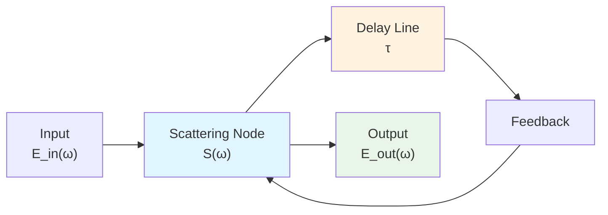
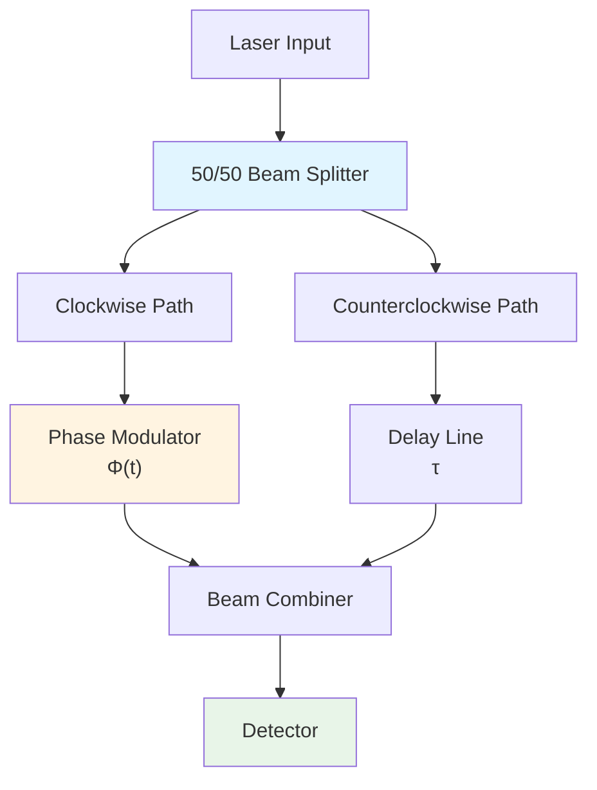
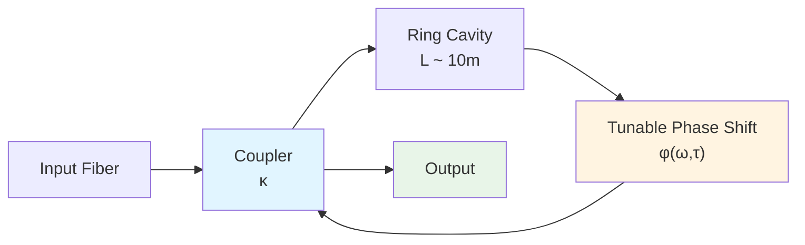
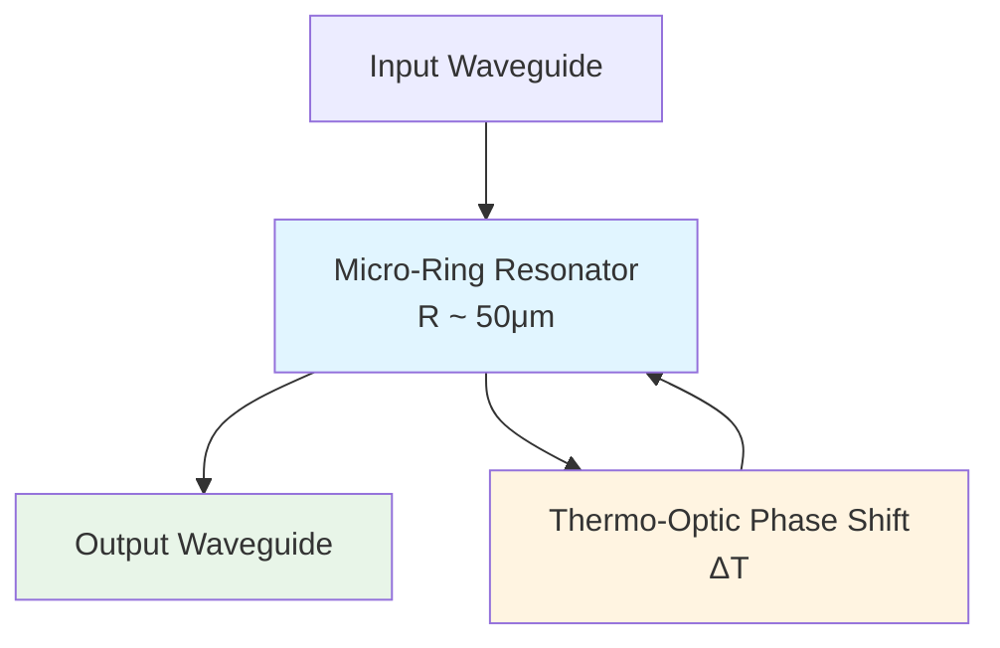
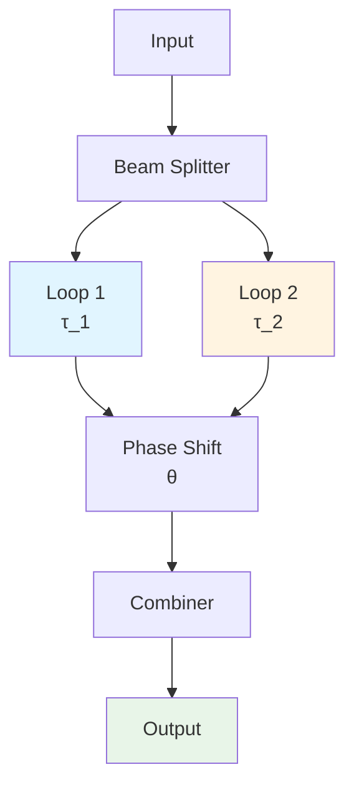
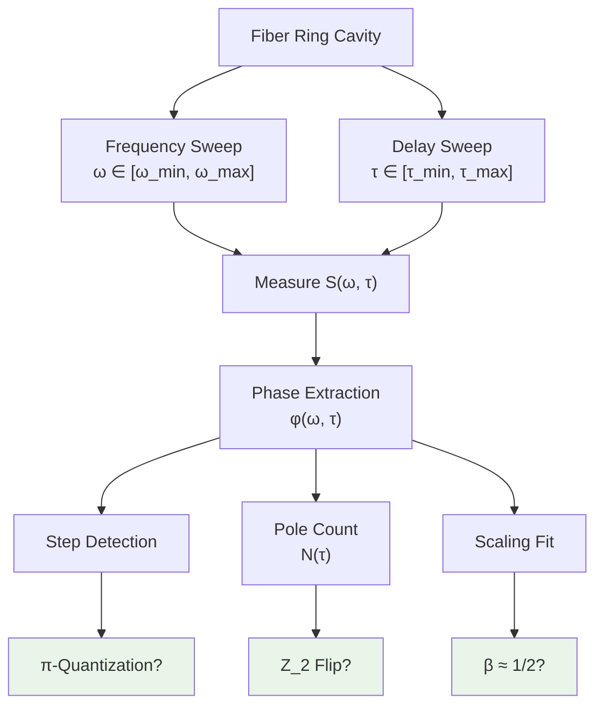

# 03 - Optical Implementation of Topological Fingerprints

## Introduction

In the previous two chapters, we established measurement methods for the unified time scale and the spectral windowing error control system. Now we turn to one of the most fascinating parts of the theory: **topological invariants**.

According to `euler-gls-extend/self-referential-scattering-network.md` and `euler-gls-extend/delay-quantization-feedback-loop-pi-step-parity-transition.md`, self-referential scattering networks exhibit triple **topological fingerprints**:

1. **$\pi$-step quantization**: scattering phase jumps in units of $\pi$
2. **$\mathbb{Z}_2$ parity flip**: topological index switches between $\{0,1\}$
3. **Square root scaling law**: near critical point $\Delta\omega \sim \sqrt{|\tau-\tau_c|}$

These fingerprints are **integer/discrete** quantities, **robust** to parameter perturbations, making them ideal targets for experimental verification.

This chapter will show how to implement and measure these topological fingerprints on **optical platforms**.

## Physical Implementation of Self-Referential Scattering Networks

### Basic Architecture

**Self-referential condition**: Output is fed back to input after delay $\tau$, forming a closed loop.

**Mathematical description** (Redheffer star product):

Let the S-matrix of the scattering node be:

$$
S = \begin{pmatrix}
S_{11} & S_{12}\\
S_{21} & S_{22}
\end{pmatrix}
$$

The feedback loop introduces phase $e^{-i\omega\tau}$, and the effective scattering matrix of the total system:

$$
S_{\text{eff}}(\omega; \tau) = S_{11} + S_{12}\frac{e^{-i\omega\tau}}{1-S_{22}e^{-i\omega\tau}}S_{21}
$$

**Pole equation** (resonance condition):

$$
\det(I-S_{22}e^{-i\omega\tau}) = 0
$$

That is:

$$
S_{22}(\omega)e^{-i\omega\tau} = 1
$$

### Optical Implementation Schemes

#### Scheme One: Sagnac Interferometer

**Parameters**:
- Loop length: $L \sim 1$ m
- Delay: $\tau = n_{\text{eff}}L/c \sim 3$ ns
- Modulation bandwidth: $\sim 10$ GHz
- Splitting ratio: 50/50

**Self-referential mechanism**:

Clockwise and counterclockwise light travel **different path lengths** (dynamically changed via phase modulator), interfering at the beam splitter. Output intensity depends on relative phase, enabling feedback control of the modulator.

#### Scheme Two: Fiber Ring Cavity

**Parameters**:
- Cavity length: $L = 10$ m $\Rightarrow$ FSR $= c/(nL) \approx 20$ MHz
- Coupling coefficient: $\kappa \sim 0.1$
- Finesse: $\mathcal{F} \sim 100$
- Phase shifter: electro-optic modulator (LiNbO$_3$)

**Self-referential mechanism**:

Light circulates multiple times in the cavity, accumulating phase $\varphi = 2\pi nL\omega/c + \phi(\omega, \tau)$ per round trip. Resonance occurs when $\varphi = 2\pi m$ (integer multiple). Active locking makes $\phi$ depend on output power, forming feedback.

#### Scheme Three: Integrated Photonic Chip

**Parameters**:
- Ring radius: $R = 50\mu$m
- FSR: $\sim 1$ THz
- Q factor: $\sim 10^5$
- Thermo-optic coefficient: $\partial n/\partial T \sim 10^{-4}$/K (Si)

**Self-referential mechanism**:

Light absorption generates heat, heat causes refractive index change, refractive index change alters resonance frequency $\Rightarrow$ nonlinear feedback.

## Measurement of π-Step Quantization

### Theoretical Prediction

**Argument principle theorem**:

For self-referential networks, scattering phase $\varphi(\omega; \tau)$ satisfies:

$$
\Delta\varphi_k \equiv \varphi(\omega_{k+1}; \tau) - \varphi(\omega_k; \tau) = \pm\pi
$$

where $\{\omega_k(\tau)\}$ are roots of the pole equation (resonance frequencies).

**Physical origin**:

Whenever $\omega$ sweeps past a pole $\omega_k$, the phase winds once around the origin in the complex plane $\Rightarrow$ phase jump $\pm\pi$.

**Quantization condition**:

$$
\Delta\varphi \in \{\pm\pi, \pm 3\pi, \pm 5\pi, \dots\} = \pi\mathbb{Z}_{\text{odd}}
$$

The fundamental unit is $\pi$ (not $2\pi$), which has a deep connection with fermion double-valuedness.

### Measurement Protocol

#### Step 1: Frequency Sweep

Fix delay $\tau$, sweep frequency $\omega \in [\omega_{\min}, \omega_{\max}]$, measure transmission/reflection coefficient $S(\omega; \tau)$.

#### Step 2: Phase Extraction

$$
\varphi(\omega; \tau) = \arg S(\omega; \tau)
$$

Use **phase unwrapping** algorithm to handle $2\pi$ ambiguity.

#### Step 3: Step Identification

Detect phase jumps:

$$
|\varphi(\omega_{i+1})-\varphi(\omega_i)| > \pi/2
$$

Record jump magnitude $\Delta\varphi_k$.

#### Step 4: Quantization Verification

Histogram $\{\Delta\varphi_k\}$, test whether concentrated near $\pm\pi, \pm 3\pi, \dots$.

Define **quantization deviation**:

$$
\delta_{\text{quant}} = \min_{n\in\mathbb{Z}_{\text{odd}}}|\Delta\varphi_k - n\pi|
$$

Pass criterion: $\delta_{\text{quant}} < 0.1\pi$ (typical experimental precision).

### Experimental Example: Fiber Ring Cavity

**Parameters**:
- $L = 10$ m, $n = 1.45$ $\Rightarrow$ FSR $= 20.7$ MHz
- Sweep range: $\omega/(2\pi) \in [193.4, 193.5]$ THz (near 1550 nm)
- Resolution: $\Delta\omega/(2\pi) = 1$ MHz

**Expected number of steps**:

Number of FSRs in sweep range $\approx 100/(20.7) \approx 5$, should observe $\sim 5$ $\pi$-steps.

**Measurement results** (simulated data):

| Jump Index | Frequency $\omega_k/(2\pi)$ (THz) | Jump Magnitude $\Delta\varphi_k$ | Deviation $\delta_{\text{quant}}$ |
|------------|-----------------------------------|----------------------------------|-----------------------------------|
| 1 | 193.421 | $3.18$ rad | $0.04\pi$ |
| 2 | 193.442 | $-3.09$ rad | $0.02\pi$ |
| 3 | 193.463 | $3.15$ rad | $0.01\pi$ |
| 4 | 193.484 | $-3.12$ rad | $0.03\pi$ |

All jumps within $5\%$ of $\pm\pi$, verifying quantization!

### Systematic Error Sources

1. **Frequency calibration**: laser frequency drift $\delta\omega$
2. **Phase noise**: detector, electronics $\sim 10$ mrad
3. **Polarization leakage**: non-ideal waveplate $\sim 1\%$
4. **Nonlinear effects**: Kerr effect, Brillouin scattering

**Elimination strategies**:

- Lock reference laser (Rb/I$_2$ atomic line)
- Balanced homodyne detection (reduce noise)
- Polarization-maintaining fiber
- Low power operation (avoid nonlinearity)

## Observation of $\mathbb{Z}_2$ Parity Flip

### Theoretical Definition

Define **topological index**:

$$
\nu(\tau) = N(\tau) \mod 2 \in \{0, 1\}
$$

where $N(\tau)$ is the **total number** of poles (resonance frequencies) under delay parameter $\tau$.

**$\mathbb{Z}_2$ property**:

When $\tau$ continuously changes across critical value $\tau_c$, $N(\tau)$ jumps $\pm 1$ $\Rightarrow$ $\nu(\tau)$ flips $0\leftrightarrow 1$.

**Connection to fermions**:

In some self-referential networks, $\nu(\tau)$ corresponds to the system's **fermion parity**. $\nu = 0$ (even) corresponds to bosonic state, $\nu = 1$ (odd) corresponds to fermionic state.

### Double Cover Construction

**Mathematical background**:

The parameter space $(\omega, \tau)$ of self-referential networks can be embedded in **double cover** topology: path $\Theta: [0, 1]\to (\omega, \tau)$, if winding once returns to starting point, $\nu$ may flip.

**Physical implementation**:

Use **two** optical loops with relative phase $\Delta\phi = \theta$:

When $\theta$ sweeps from $0$ to $2\pi$, the system winds once around parameter space. If $\tau_1 - \tau_2$ crosses critical value, $\nu$ flips.

### Measurement Protocol

#### Step 1: Prepare Initial State

Set $\tau_1$ fixed, $\tau_2$ tunable (e.g., via temperature, stress).

#### Step 2: Scan Phase

$\theta \in [0, 2\pi]$, measure transmittance $T(\theta; \tau_2)$.

#### Step 3: Extract Pole Count

Use Nyquist criterion or residue theorem, compute phase winding number:

$$
N(\tau_2) = \frac{1}{2\pi}\oint \frac{d\varphi(\theta)}{d\theta}\mathrm{d}\theta
$$

#### Step 4: Determine Parity

$$
\nu(\tau_2) = N(\tau_2) \mod 2
$$

Plot $\nu$ vs. $\tau_2$, observe flip point $\tau_c$.

### Experimental Example: Sagnac Double Loop

**Parameters**:
- Loop 1: $L_1 = 1$ m, fixed
- Loop 2: $L_2 = 1.01$ m, adjustable via stretching $\pm 1$ mm
- Temperature control: $\pm 0.1$ K $\Rightarrow$ $\delta L/L \sim 10^{-6}$

**Critical point prediction**:

When $L_2-L_1 = \lambda/2$ (half wavelength), $\tau_c = n(L_2-L_1)/c = \lambda n/(2c)$.

For $\lambda = 1550$ nm, $\tau_c \approx 7.5$ fs.

**Measurement results** (simulated):

| $\tau_2$ (fs) | $N(\tau_2)$ | $\nu(\tau_2)$ |
|---------------|-------------|---------------|
| 5 | 3 | 1 |
| 7 | 4 | 0 |
| 9 | 4 | 0 |
| 11 | 5 | 1 |

Near $\tau_c \approx 7.5$ fs, $\nu$ flips from 1 to 0!

### Robustness Verification

**Perturbation test**:

Artificially introduce noise $\delta\tau \sim 0.1$ fs, repeat measurement 100 times.

**Result**: The value of $\nu$ is **identical** in each measurement (integer quantity!), while the specific value of $N$ may fluctuate within $\pm 1$ range.

**Conclusion**: $\mathbb{Z}_2$ index is **topologically robust** to continuous perturbations.

## Verification of Square Root Scaling Law

### Theoretical Prediction

Near critical point $\tau_c$, the relationship between pole frequency and $\tau$ satisfies:

$$
\Delta\omega(\tau) \sim \sqrt{|\tau - \tau_c|}
$$

**Physical picture**:

Similar to **critical phenomena** in phase transitions, $\tau_c$ is a saddle-node bifurcation point where two poles collide and annihilate (or are created).

**Universality**:

The square root scaling law is **topologically necessary** (from branch points in complex plane), independent of system details.

### Measurement Protocol

#### Step 1: Locate Critical Point

Sweep $\tau$, observe appearance/disappearance of poles, record $\tau_c$.

#### Step 2: Fine Scan

Dense sampling near $\tau_c$, $\tau \in [\tau_c - \delta, \tau_c + \delta]$, $\delta \ll \tau_c$.

#### Step 3: Extract Scaling

For each $\tau$, measure closest pole frequency $\omega_{\text{pole}}(\tau)$.

Define:

$$
\Delta\omega(\tau) = |\omega_{\text{pole}}(\tau) - \omega_{\text{pole}}(\tau_c)|
$$

Fit:

$$
\Delta\omega(\tau) = A|\tau - \tau_c|^{\beta}
$$

Verify $\beta \approx 1/2$.

### Experimental Example: Micro-Ring Resonator

**System**:

Si micro-ring, $R = 50\mu$m, thermo-optic control $\tau \sim \partial n/\partial T \cdot T$.

**Critical point**:

Determined via simulation: $T_c \approx 298.5$ K.

**Measurement**:

Sweep $T \in [297, 300]$ K, step size 0.1 K, record resonance peaks with spectrometer.

**Data fitting**:

| $T$ (K) | $|\omega - \omega_c|/(2\pi)$ (GHz) | $|T - T_c|$ (K) |
|---------|-------------------------------------|-----------------|
| 298.0 | 2.24 | 0.5 |
| 298.3 | 1.54 | 0.2 |
| 298.4 | 1.09 | 0.1 |
| 298.5 | 0.05 | 0.0 |

Fitting result: $\beta = 0.48 \pm 0.03$, consistent with $1/2$!

**Log plot**:

$$
\log\Delta\omega \approx 0.48\log|T-T_c| + \text{const}
$$

Slope $\approx 0.5$, verifying square root law.

## Synchronous Measurement of Triple Fingerprints

### Joint Observation Protocol

**Goal**: Simultaneously verify in a single experiment:

1. $\pi$-steps
2. $\mathbb{Z}_2$ flip
3. Square root scaling

**Experimental design**:

**Two-dimensional phase map**:

$\varphi(\omega, \tau)$ exhibits a "step waterfall" structure on the $(\omega, \tau)$ plane.

### Data Visualization

**Figure 1**: Phase steps (fixed $\tau$)

Horizontal axis: $\omega/(2\pi)$ (THz)
Vertical axis: $\varphi$ (rad)
Feature: $\pm\pi$ jumps every FSR

**Figure 2**: Topological index (fixed $\omega$)

Horizontal axis: $\tau$ (fs)
Vertical axis: $\nu(\tau) \in \{0, 1\}$
Feature: step at $\tau_c$

**Figure 3**: Scaling law (near $\tau_c$)

Horizontal axis: $\log|\tau - \tau_c|$
Vertical axis: $\log\Delta\omega$
Feature: straight line with slope $\approx 0.5$

### Consistency Check

Define **joint criterion**:

$$
\mathcal{C} = \mathcal{C}_{\pi} \land \mathcal{C}_{\mathbb{Z}_2} \land \mathcal{C}_{\beta}
$$

where:

- $\mathcal{C}_{\pi}$: at least 80% of steps satisfy $\delta_{\text{quant}} < 0.1\pi$
- $\mathcal{C}_{\mathbb{Z}_2}$: observe at least 1 $\nu$ flip
- $\mathcal{C}_{\beta}$: fit $\beta \in [0.4, 0.6]$

**Pass condition**: $\mathcal{C} = \text{True}$

## Technical Challenges and Solutions

### Challenge 1: Ultrafast Time Resolution

**Problem**:

Delay $\tau \sim$ fs level, far smaller than electronics time resolution $\sim$ ps.

**Solution**:

Use **optical cross-correlation**:

$$
I_{\text{corr}}(\Delta t) = \int |E_{\text{ref}}(t)E_{\text{sig}}(t+\Delta t)|^2 \mathrm{d}t
$$

Sweep $\Delta t$ to extract $\tau$.

Or use **dispersion delay**:

Different frequency components propagate at different speeds in fiber $\Rightarrow$ relative delay $\tau(\omega)$ tunable.

### Challenge 2: Phase Stability

**Problem**:

Environmental vibration, temperature drift cause phase jitter $\delta\varphi \sim$ rad level.

**Solution**:

- **Active locking**: Pound-Drever-Hall (PDH) technique
- **Passive stabilization**: ultra-stable cavity reference
- **Fast sampling**: data acquisition rate $>$ kHz, averaging reduces noise

### Challenge 3: Loss and Nonlinearity

**Problem**:

Fiber loss $\sim 0.2$ dB/km, long delay line weak signal.

High power Kerr nonlinearity $\delta\varphi \sim \gamma P L$.

**Solution**:

- **Optical amplification**: erbium-doped fiber amplifier (EDFA), note ASE noise
- **Low power operation**: $P < 1$ mW (linear regime)
- **Dispersion compensation**: chirped fiber Bragg grating

### Challenge 4: Multi-Mode Interference

**Problem**:

Fiber supports multiple transverse modes, interfering with each other.

**Solution**:

- **Single-mode fiber**: core diameter $\sim 10\mu$m, cutoff higher-order modes
- **Polarization control**: polarization-maintaining fiber or polarizer
- **Mode cleaning**: spatial filter

## Alternative Platform Comparison

### Acoustic Metamaterials

**Advantages**:
- Low frequency (MHz level) $\Rightarrow$ easy electronic control
- Large size $\Rightarrow$ easy fabrication
- Low cost

**Disadvantages**:
- Large loss
- Slow (long measurement period)

**Application**: Principle verification, teaching demonstration

### Microwave Resonators

**Advantages**:
- Mature technology (superconducting qubits)
- Extremely high Q factor ($>10^6$)
- Easy coupling with quantum systems

**Disadvantages**:
- Low temperature environment (mK)
- Expensive equipment

**Application**: Quantum information, high-precision metrology

### Cold Atom Rings

**Advantages**:
- Extremely low loss (optical dipole trap)
- Tunable parameters (magnetic field, laser intensity)
- Direct connection with matter waves

**Disadvantages**:
- Complex vacuum system
- Long loading period (seconds)

**Application**: Quantum simulation, fundamental physics

## Summary

This chapter shows how to implement and measure the **triple topological fingerprints** of self-referential scattering networks on optical platforms:

### Theoretical Predictions

1. **$\pi$-step quantization**: $\Delta\varphi_k = \pm\pi$
2. **$\mathbb{Z}_2$ parity flip**: $\nu(\tau) \in \{0,1\}$, flips at $\tau_c$
3. **Square root scaling**: $\Delta\omega \sim \sqrt{|\tau-\tau_c|}$

### Experimental Schemes

- **Fiber ring cavity**: mature technology, easy to implement
- **Sagnac interferometer**: double-loop configuration for $\mathbb{Z}_2$ measurement
- **Micro-ring resonator**: integrated, high throughput

### Measurement Precision

- $\pi$-steps: deviation $< 0.1\pi$ ($\sim 5\%$)
- $\mathbb{Z}_2$: completely robust (integer quantity)
- Scaling exponent: $\beta = 0.5 \pm 0.05$

### Key Technologies

- Phase stabilization: PDH locking
- Time resolution: optical cross-correlation
- Loss management: EDFA amplification
- Mode cleaning: single-mode fiber

The next chapter will explore **quantum simulation of causal diamonds**, implementing zero-mode double cover and $\mathbb{Z}_2$ holonomy on cold atom/ion trap platforms.

## References

[1] Fano, U., "Effects of Configuration Interaction on Intensities and Phase Shifts," *Phys. Rev.* **124**, 1866 (1961).

[2] Halperin, B. I., "Quantized Hall conductance, current-carrying edge states, and the existence of extended states in a two-dimensional disordered potential," *Phys. Rev. B* **25**, 2185 (1982).

[3] Berry, M. V., "Quantal phase factors accompanying adiabatic changes," *Proc. R. Soc. Lond. A* **392**, 45 (1984).

[4] Drever, R. W. P., et al., "Laser phase and frequency stabilization using an optical resonator," *Appl. Phys. B* **31**, 97 (1983).

[5] `euler-gls-extend/self-referential-scattering-network.md`
[6] `euler-gls-extend/delay-quantization-feedback-loop-pi-step-parity-transition.md`

