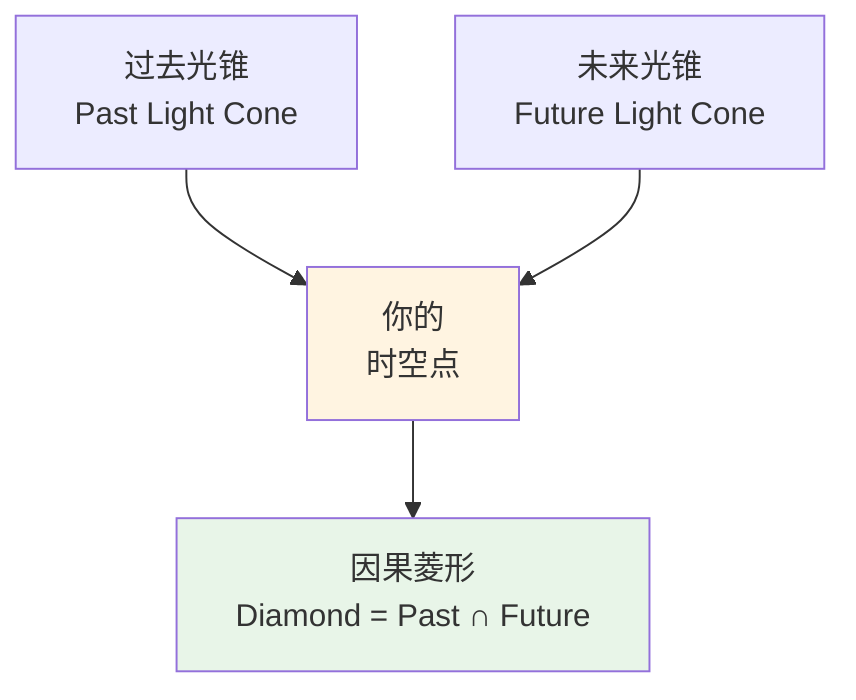
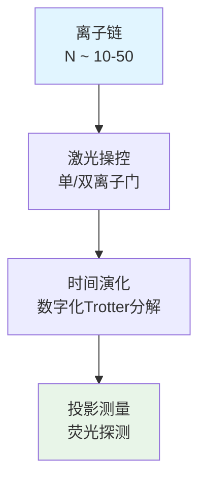
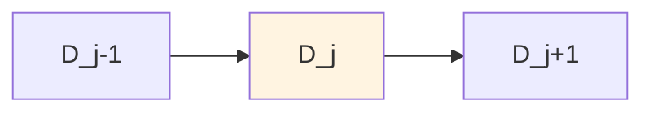

# 04 - 因果菱形的量子模拟

## 引言

想象一下你站在一个十字路口，你能影响的未来事件构成一个"光锥"——信息以光速传播，形成一个锥形区域。现在反过来想：过去所有能影响你的事件也形成一个向后的光锥。这两个光锥的**交集**，就是一个**因果菱形**（Causal Diamond）。

在统一时间刻度理论中，因果菱形不仅是时空几何的基本单元，更是**信息处理**和**量子纠缠**的自然舞台。本章将展示如何在实验室中**量子模拟**因果菱形，验证其中的拓扑结构和零模双覆盖。

**来源理论**：
- `euler-gls-extend/null-modular-double-cover-causal-diamond-chain.md`
- `euler-gls-info/14-causal-diamond-chain-null-modular-double-cover.md`

## 因果菱形的基本概念

### 几何定义

在闵可夫斯基时空$(t, x)$中（为简化讨论，取1+1维），一个因果菱形$D$由四条**零测度边界**（null boundary）围成：

$$
D = \{(t,x) : |t-t_0| + |x-x_0| \leq R\}
$$

其中$(t_0, x_0)$是中心点，$R$是"半径"。

**比喻**：

就像一颗钻石（菱形），有四个顶点：

- **顶点（未来）**：$(t_0+R, x_0)$
- **底点（过去）**：$(t_0-R, x_0)$
- **左右点**：$(t_0, x_0\pm R)$

四条边是**光线**（45度线），信息沿这些边以光速传播。

### 零测度边界的双层结构

每条边界可以分解为**两层**（double cover）：

$$
\widetilde{E} = E^+ \sqcup E^-
$$

- $E^+$：右行光线（$v$坐标，$v = t+x$）
- $E^-$：左行光线（$u$坐标，$u = t-x$）

**物理意义**：

这不是简单的几何分解，而是反映了**模理论**（modular theory）的深层结构：

- **模对合**$J$：交换$E^+ \leftrightarrow E^-$并反转方向
- **模群**$\Delta^{it}$：沿光线方向的"推进"

**公式**：

模哈密顿量（modular Hamiltonian）$K_D$可以写成两层的积分：

$$
K_D = 2\pi \sum_{\sigma=\pm} \int_{E^{\sigma}} g_{\sigma}(\lambda, x_{\perp}) T_{\sigma\sigma}(\lambda, x_{\perp}) \mathrm{d}\lambda \mathrm{d}^{d-2}x_{\perp}
$$

其中：
- $\lambda$：仿射参数（沿光线的"距离"）
- $T_{\sigma\sigma}$：能动张量的零分量（$T_{++} = T_{vv}$，$T_{--} = T_{uu}$）
- $g_{\sigma}$：几何权重函数

**CFT球形菱形**中，$g_{\sigma}(\lambda) = \lambda(1-\lambda)$（精确公式！）

## 为什么需要量子模拟？

### 实验室无法制造真正的因果菱形

理由很简单：

1. **时空几何固定**：我们生活在平直的闵可夫斯基时空（或弱引力场），无法任意"雕刻"时空形状
2. **光速限制**：信息传播速度$c$是固定的，无法调节
3. **尺度问题**：宇宙学尺度的因果菱形（如宇宙视界）无法在实验室实现

### 量子模拟的思路

**核心思想**：用**可控的量子系统**模拟因果菱形的**代数结构**和**纠缠性质**，而非直接复制时空几何。

**类比**：

就像用**电路**模拟**水流**：

- 电压$\leftrightarrow$水压
- 电流$\leftrightarrow$水流量
- 电阻$\leftrightarrow$管道摩擦

虽然物理实现完全不同，但**数学关系**相同！

### 模拟的目标

验证以下理论预言：

1. **双层纠缠结构**：$E^+$和$E^-$层的纠缠熵满足特定关系
2. **马尔可夫性**：菱形链的条件独立性$I(D_{j-1}:D_{j+1}|D_j) = 0$
3. **$\mathbb{Z}_2$奇偶不变量**：拓扑指标在参数变化下保持稳定
4. **零模寿命**：边界零模的指数衰减$\sim e^{-L/\xi}$

## 量子模拟平台

### 平台一：冷原子光晶格

**系统**：超冷原子（如$^{87}$Rb）囚禁在光学晶格中

**如何模拟因果菱形？**

**映射关系**：

| 时空因果菱形 | 冷原子系统 |
|-------------|-----------|
| 时间$t$ | 演化时间$t$ |
| 空间$x$ | 晶格格点$i$ |
| 光锥$E^+, E^-$ | 左右传播模式 |
| 模哈密顿量$K_D$ | 有效哈密顿量$H_{\text{eff}}$ |
| 纠缠熵$S(E^+)$ | 约化密度矩阵$\rho_A$的von Neumann熵 |

**Hamiltonian**：

Bose-Hubbard模型：

$$
H = -J\sum_{\langle i,j\rangle}(a_i^{\dagger}a_j + \text{h.c.}) + \frac{U}{2}\sum_i n_i(n_i-1) - \mu\sum_i n_i
$$

参数：
- $J$：跃迁强度（模拟"光速"）
- $U$：在位相互作用
- $\mu$：化学势

**协议**：

1. **制备初态**：Mott绝缘体态（每格点1个原子）
2. **淬火演化**：突然改变$J/U$比值，释放粒子
3. **时间切片**：在不同时刻$t_j$冻结系统
4. **测量**：局域密度$\langle n_i\rangle$、关联函数$\langle n_i n_j\rangle$
5. **重构**：计算约化密度矩阵$\rho_A$，提取纠缠熵$S(A) = -\text{Tr}(\rho_A\log\rho_A)$

### 平台二：离子阱量子计算机

**系统**：俘获离子（如$^{171}$Yb$^+$）线性阵列

**优势**：

- 高保真度门操作（$>99.9\%$）
- 长相干时间（$\sim$ 分钟）
- 任意长程相互作用（通过共振激光）

**如何实现？**

**数字化Hamiltonian**：

将连续演化$e^{-iHt}$分解为离散门序列：

$$
e^{-iHt} \approx \prod_{k=1}^{M}e^{-iH_k\delta t}
$$

每个$H_k$用1-2个离子门实现（如MS门、单离子旋转）。

**因果菱形编码**：

用离子链的**空间分布**编码菱形结构：

- 中心离子$i_0$：菱形中心
- 左右邻居$i_0\pm 1, i_0\pm 2, \dots$：菱形内部
- 演化时间$t$：对应菱形"扩张"

**纠缠测量**：

量子态层析（quantum state tomography）重构$\rho$，计算：

$$
S(A) = -\text{Tr}(\rho_A\log\rho_A)
$$

或用**SWAP测试**直接估算纠缠负性（entanglement negativity）。

### 平台三：超导量子比特

**系统**：约瑟夫森结超导电路（如transmon比特）

**架构**：

2D网格或1D链，最近邻耦合或可编程全连接。

**模拟策略**：

类似离子阱，但：

- 门速度更快（$\sim$ ns）
- 相干时间较短（$\sim \mu$s）
- 读出通过微波腔

**特殊优势**：

可实现**时间反演**（time-reversal）操作，验证模群$\Delta^{it}$和模对合$J$的性质。

**Loschmidt回声**：

$$
L(t) = |\langle\psi_0|e^{+iHt}e^{-iHt}|\psi_0\rangle|^2
$$

理想情况$L=1$，退相干导致$L<1$。可用于测试马尔可夫性。

## 验证双层纠缠结构

### 理论预言

因果菱形边界$E = E^+ \cup E^-$，纠缠熵满足：

$$
S(E) = S(E^+) + S(E^-) - I(E^+:E^-)
$$

其中$I(E^+:E^-)$是互信息：

$$
I(E^+:E^-) = S(E^+) + S(E^-) - S(E^+ \cup E^-)
$$

**双层性质**：

若模对合$J$完美对称，则$S(E^+) = S(E^-)$，且：

$$
I(E^+:E^-) = 2S(E^+) - S(E)
$$

### 实验测量

**冷原子方案**：

1. **定义子系统**：
   - $A^+ = \{i : i\in E^+\}$（右传播模式占据的格点）
   - $A^- = \{i : i\in E^-\}$（左传播模式占据的格点）

2. **测量纠缠熵**：
   - 用**副本技巧**（replica trick）或**张量网络**方法
   - 对于1D系统，可用**矩阵乘积态**（MPS）高效计算

3. **提取互信息**：
   - 分别测$S(A^+)$、$S(A^-)$、$S(A^+ \cup A^-)$
   - 计算$I = S(A^+)+S(A^-)-S(A^+ \cup A^-)$

**预期结果**（CFT）：

在临界点附近，纠缠熵标度为：

$$
S(A) = \frac{c}{3}\log\left(\frac{L}{\epsilon}\right) + s_0
$$

其中：
- $c$：中心荷（central charge）
- $L$：子系统大小
- $\epsilon$：短距离截断（晶格常数）
- $s_0$：非普适常数

**验证双层对称性**：

检验$|S(E^+)-S(E^-)| < \delta_{\text{tol}}$（典型$\sim 5\%$）

## 马尔可夫链的条件独立性

### 理论：菱形链的马尔可夫性

考虑三个相邻的因果菱形$D_{j-1}, D_j, D_{j+1}$：

**马尔可夫性**：

$$
I(D_{j-1}:D_{j+1}|D_j) = 0
$$

即：给定"中间"菱形$D_j$，"过去"$D_{j-1}$和"未来"$D_{j+1}$**条件独立**。

**模哈密顿量恒等式**：

$$
K_{D_{j-1}\cup D_j} + K_{D_j\cup D_{j+1}} - K_{D_j} - K_{D_{j-1}\cup D_j\cup D_{j+1}} = 0
$$

这是条件独立性的算子形式。

### 实验验证

**协议**：

1. **构造菱形链**：

   在冷原子或离子阱系统中，用**时间演化**自然生成链结构：

   - $t=0$：制备初态于格点$i_0$
   - $t=\tau$：演化形成菱形$D_1$（半径$\sim J\tau$）
   - $t=2\tau$：扩张为$D_2$
   - $t=3\tau$：形成$D_3$

2. **测量三体条件互信息**：

$$
I(A:C|B) = S(AB) + S(BC) - S(B) - S(ABC)
$$

   需要测量4个纠缠熵！

3. **简化方案**：Petz恢复映射

   理论保证：马尔可夫性$\Leftrightarrow$完美恢复

   $$
   (\text{id}_A \otimes \mathcal{R}_{B\to BC})(\rho_{AB}) = \rho_{ABC}
   $$

   可通过**保真度**$F$间接验证：

   $$
   F(\rho_{ABC}, \rho_{ABC}^{\text{rec}}) > 1-\varepsilon
   $$

   其中$\rho_{ABC}^{\text{rec}}$是恢复后的态。

**数值模拟预期**：

对于**自由费米子**系统（精确可解），马尔可夫性**严格成立**。

对于**相互作用系统**，存在小偏差$I(A:C|B) \sim e^{-L/\xi}$（$\xi$：关联长度）。

## $\mathbb{Z}_2$奇偶不变量的测量

### 理论：奇偶拓扑指标

对菱形链，定义$\mathbb{Z}_2$指标：

$$
\nu(\gamma) = \left\lfloor\frac{\Theta(\gamma)}{\pi}\right\rfloor \mod 2 \in \{0, 1\}
$$

其中$\Theta(\gamma)$是链的**相位累积**：

$$
\Theta(\gamma) = \frac{1}{2}\int_{\mathcal{I}(\gamma)} \text{tr }Q(E) h_{\ell}(E-E_0)\mathrm{d}E
$$

- $Q(E) = -iS^{\dagger}\partial_E S$：Wigner-Smith矩阵
- $h_{\ell}$：窗函数（如高斯）
- $\mathcal{I}(\gamma)$：能量窗口

**奇偶性质**：

当系统参数连续变化时，$\nu$可能**翻转**$0\leftrightarrow 1$，但只在**临界点**发生（类似拓扑相变）。

**$\mathbb{Z}_2$鲁棒性**：

对小扰动$\delta\Theta < \pi/2$，$\nu$保持不变！

### 实验方案

**离子阱实现**：

1. **制备菱形链**：

   用可编程Hamiltonian：

   $$
   H(\gamma) = \sum_{i}(\sigma_i^x\sigma_{i+1}^x + \gamma\sigma_i^z)
   $$

   参数$\gamma$可调（如通过磁场）。

2. **测量散射矩阵**：

   将链两端连接到"导线"（连续自由度），测量透射/反射。

   在离子阱中，用**边界离子**作为探测器。

3. **提取相位**：

   $$
   \varphi(\gamma) = \arg\det S(\gamma)
   $$

   利用**干涉测量**或**量子态层析**。

4. **扫描$\gamma$**：

   从$\gamma_0$到$\gamma_1$，记录$\varphi(\gamma)$的变化：

   $$
   \Delta\varphi = \varphi(\gamma_1) - \varphi(\gamma_0)
   $$

5. **判定奇偶**：

   $$
   \nu(\gamma_1) - \nu(\gamma_0) = \left\lfloor\frac{\Delta\varphi}{\pi}\right\rfloor \mod 2
   $$

   若$\Delta\varphi \approx \pi$（奇数倍），则$\nu$翻转！

**预期观测**：

在**拓扑相变点**$\gamma_c$，$\Delta\varphi$跳变$\pm\pi$，$\nu$翻转。

**实例**：

Kitaev链（拓扑超导体）：

- $\gamma < \gamma_c$：平庸相，$\nu=0$
- $\gamma > \gamma_c$：拓扑相，$\nu=1$

边界上出现**Majorana零模**！

## 零模寿命的测量

### 理论：双覆盖的零模

因果菱形的边界支持**零模**（zero modes）——能量为零的局域态。

**双覆盖结构**：

每个零模在$E^+$和$E^-$层各有一份"复制"，形成**纠缠对**。

**寿命公式**：

零模的空间分布：

$$
|\psi(x)|^2 \sim e^{-|x-x_0|/\xi}
$$

其中$\xi$是**局域长度**（localization length）。

对有限尺寸系统$L$，零模的**能量分裂**：

$$
\Delta E \sim e^{-L/\xi}
$$

### 冷原子测量

**系统**：1D Bose气，边界处施加势垒

**协议**：

1. **制备边界态**：

   用局域激光在晶格边缘创建势阱：

   $$
   V(x) = V_0 e^{-x^2/\sigma^2}
   $$

2. **演化测量**：

   监测边界原子数$N_{\text{edge}}(t)$的振荡：

   $$
   N_{\text{edge}}(t) \approx N_0 + A\cos(\Delta E \cdot t/\hbar)
   $$

3. **提取分裂**：

   傅里叶变换$N_{\text{edge}}(t)$，峰值频率$\omega_0 = \Delta E/\hbar$。

4. **拟合局域长度**：

   改变系统尺寸$L$，重复测量$\Delta E(L)$。

   拟合：

   $$
   \log\Delta E = -\frac{L}{\xi} + \text{const}
   $$

   斜率给出$\xi$！

**预期结果**：

对于**拓扑边界态**（如SSH模型），$\xi$发散$\Rightarrow$零模完美局域。

对于**非拓扑态**，$\xi$有限，零模"泄漏"到体内。

## 技术挑战与解决方案

### 挑战1：退相干

**问题**：

环境噪声（热涨落、激光抖动）破坏纠缠，时间尺度$\tau_{\text{dec}} \sim 10-100\mu$s（冷原子）。

**解决**：

- **动力学去耦**：周期性脉冲抵消噪声
- **量子纠错码**：编码保护（如表面码）
- **低温环境**：$<1\mu$K（光晶格），$<10$ mK（离子阱）

### 挑战2：有限尺寸效应

**问题**：

菱形链长度$L_{\text{chain}}$受限（冷原子$\sim 100$格点，离子阱$\sim 50$），远小于理论无穷链。

**解决**：

- **有限尺寸标度**：测量多个$L$，外推到$L\to\infty$
- **周期边界条件**：消除边界效应（牺牲开放系统性质）
- **矩阵乘积态**：数值模拟指导实验参数选择

### 挑战3：测量破坏

**问题**：

投影测量塌缩波函数，无法重复测同一态。

**解决**：

- **弱测量**：降低测量强度，减少扰动
- **量子非破坏测量**（QND）：仅测守恒量（如粒子数）
- **集成成像**：单次成像获取空间分布，重复制备测统计

### 挑战4：校准与系统学

**问题**：

Hamiltonian参数（$J, U, \mu$）漂移，导致演化偏差。

**解决**：

- **原位校准**：用已知能谱（如Mott态）标定参数
- **实时反馈**：监测特征信号（如干涉条纹），调节激光
- **盲分析**：隐藏参数真值，避免确认偏差

## 小结

本章展示了如何在量子平台上模拟因果菱形及其拓扑性质：

### 关键概念

1. **因果菱形**：时空中过去/未来光锥的交集
2. **双层边界**：$E = E^+ \cup E^-$，承载模理论结构
3. **马尔可夫链**：相邻菱形的条件独立性
4. **$\mathbb{Z}_2$指标**：拓扑不变量，对扰动鲁棒

### 实验平台

- **冷原子光晶格**：大系统，长演化时间
- **离子阱**：高保真度，任意连接
- **超导比特**：快速门，易于集成

### 测量目标

| 理论预言 | 实验观测量 | 平台 |
|---------|-----------|------|
| 双层纠缠 $S(E^+), S(E^-)$ | 约化密度矩阵熵 | 冷原子/离子阱 |
| 马尔可夫性 $I(A:C\|B)=0$ | 条件互信息/Petz恢复 | 离子阱 |
| $\mathbb{Z}_2$奇偶 $\nu$ | 散射相位$\varphi$ | 离子阱/超导 |
| 零模寿命 $\Delta E\sim e^{-L/\xi}$ | 能量分裂 | 冷原子 |

### 预期精度

- 纠缠熵：相对误差$\sim 10\%$
- 条件互信息：绝对误差$\sim 0.1$ bits
- $\mathbb{Z}_2$指标：完全鲁棒（整数量）
- 局域长度：$\Delta\xi/\xi \sim 20\%$

下一章将转向宇宙学尺度，探讨**快速射电暴**（FRB）观测如何验证统一时间刻度的真空极化效应。

## 参考文献

[1] Casini, H., Huerta, M., "Entanglement entropy in free quantum field theory," *J. Phys. A* **42**, 504007 (2009).

[2] Blanco, D. D., et al., "Relative entropy and holography," *JHEP* **08**, 060 (2013).

[3] Jafferis, D., et al., "Relative entropy equals bulk relative entropy," *JHEP* **06**, 004 (2016).

[4] Schollwöck, U., "The density-matrix renormalization group in the age of matrix product states," *Ann. Phys.* **326**, 96 (2011).

[5] Bloch, I., et al., "Many-body physics with ultracold gases," *Rev. Mod. Phys.* **80**, 885 (2008).

[6] `euler-gls-extend/null-modular-double-cover-causal-diamond-chain.md`
[7] `euler-gls-info/14-causal-diamond-chain-null-modular-double-cover.md`
