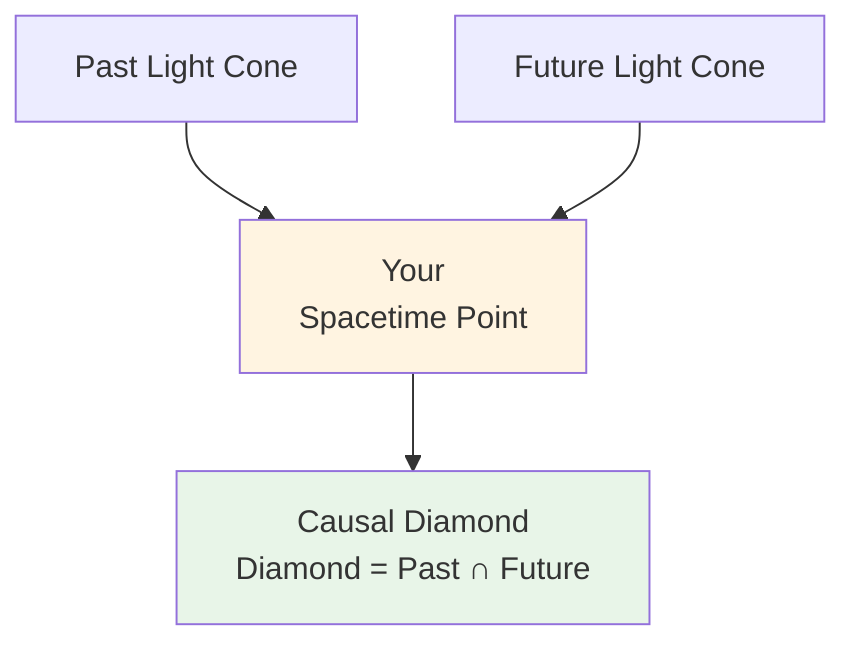
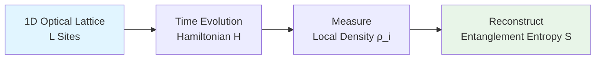
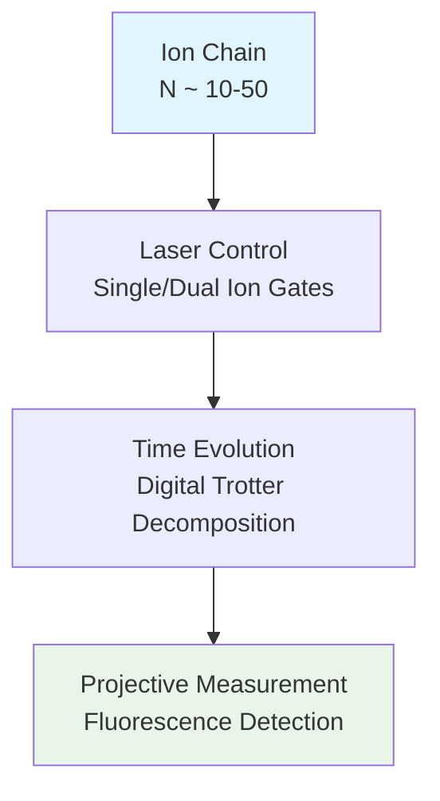
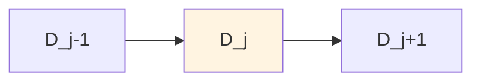

# 04 - Quantum Simulation of Causal Diamonds

## Introduction

Imagine standing at a crossroads: the future events you can influence form a "light cone"—information propagates at light speed, forming a conical region. Now think in reverse: all past events that can influence you also form a backward light cone. The **intersection** of these two light cones is a **Causal Diamond**.

In unified time scale theory, causal diamonds are not only fundamental units of spacetime geometry, but also natural stages for **information processing** and **quantum entanglement**. This chapter will show how to **quantum simulate** causal diamonds in the laboratory, verifying their topological structure and zero-mode double cover.

**Source theory**:
- `euler-gls-extend/null-modular-double-cover-causal-diamond-chain.md`
- `euler-gls-info/14-causal-diamond-chain-null-modular-double-cover.md`

## Basic Concepts of Causal Diamonds

### Geometric Definition

In Minkowski spacetime $(t, x)$ (for simplicity, take 1+1 dimensions), a causal diamond $D$ is bounded by four **null boundaries**:

$$
D = \{(t,x) : |t-t_0| + |x-x_0| \leq R\}
$$

where $(t_0, x_0)$ is the center point, $R$ is the "radius."

**Metaphor**:

Like a diamond (rhombus), with four vertices:

- **Top vertex (future)**: $(t_0+R, x_0)$
- **Bottom vertex (past)**: $(t_0-R, x_0)$
- **Left/right points**: $(t_0, x_0\pm R)$

The four edges are **light rays** (45-degree lines), information propagates along these edges at light speed.

### Double Cover Structure of Null Boundaries

Each boundary can be decomposed into **two layers** (double cover):

$$
\widetilde{E} = E^+ \sqcup E^-
$$

- $E^+$: right-moving light rays ($v$ coordinate, $v = t+x$)
- $E^-$: left-moving light rays ($u$ coordinate, $u = t-x$)

**Physical meaning**:

This is not a simple geometric decomposition, but reflects the deep structure of **modular theory**:

- **Modular involution** $J$: exchanges $E^+ \leftrightarrow E^-$ and reverses direction
- **Modular group** $\Delta^{it}$: "advancement" along light ray direction

**Formula**:

The modular Hamiltonian $K_D$ can be written as an integral over two layers:

$$
K_D = 2\pi \sum_{\sigma=\pm} \int_{E^{\sigma}} g_{\sigma}(\lambda, x_{\perp}) T_{\sigma\sigma}(\lambda, x_{\perp}) \mathrm{d}\lambda \mathrm{d}^{d-2}x_{\perp}
$$

where:
- $\lambda$: affine parameter ("distance" along light ray)
- $T_{\sigma\sigma}$: null components of stress-energy tensor ($T_{++} = T_{vv}$, $T_{--} = T_{uu}$)
- $g_{\sigma}$: geometric weight function

In **CFT spherical diamond**, $g_{\sigma}(\lambda) = \lambda(1-\lambda)$ (exact formula!)

## Why Quantum Simulation?

### Laboratory Cannot Create True Causal Diamonds

Reasons are simple:

1. **Spacetime geometry fixed**: We live in flat Minkowski spacetime (or weak gravitational field), cannot arbitrarily "sculpt" spacetime shape
2. **Light speed limit**: Information propagation speed $c$ is fixed, cannot adjust
3. **Scale problem**: Cosmological-scale causal diamonds (e.g., cosmic horizon) cannot be realized in laboratory

### Quantum Simulation Approach

**Core idea**: Use **controllable quantum systems** to simulate the **algebraic structure** and **entanglement properties** of causal diamonds, rather than directly copying spacetime geometry.

**Analogy**:

Like using **circuits** to simulate **water flow**:

- Voltage $\leftrightarrow$ water pressure
- Current $\leftrightarrow$ water flow rate
- Resistance $\leftrightarrow$ pipe friction

Although physical implementations are completely different, the **mathematical relations** are the same!

### Simulation Goals

Verify the following theoretical predictions:

1. **Double-layer entanglement structure**: entanglement entropies of $E^+$ and $E^-$ layers satisfy specific relations
2. **Markov property**: conditional independence of diamond chain $I(D_{j-1}:D_{j+1}|D_j) = 0$
3. **$\mathbb{Z}_2$ parity invariant**: topological index remains stable under parameter changes
4. **Zero-mode lifetime**: exponential decay of boundary zero modes $\sim e^{-L/\xi}$

## Quantum Simulation Platforms

### Platform One: Cold Atom Optical Lattice

**System**: Ultracold atoms (e.g., $^{87}$Rb) trapped in optical lattice

**How to simulate causal diamond?**

**Mapping relation**:

| Spacetime Causal Diamond | Cold Atom System |
|-------------------------|------------------|
| Time $t$ | Evolution time $t$ |
| Space $x$ | Lattice site $i$ |
| Light cones $E^+, E^-$ | Left/right propagating modes |
| Modular Hamiltonian $K_D$ | Effective Hamiltonian $H_{\text{eff}}$ |
| Entanglement entropy $S(E^+)$ | von Neumann entropy of reduced density matrix $\rho_A$ |

**Hamiltonian**:

Bose-Hubbard model:

$$
H = -J\sum_{\langle i,j\rangle}(a_i^{\dagger}a_j + \text{h.c.}) + \frac{U}{2}\sum_i n_i(n_i-1) - \mu\sum_i n_i
$$

Parameters:
- $J$: hopping strength (simulates "light speed")
- $U$: on-site interaction
- $\mu$: chemical potential

**Protocol**:

1. **Prepare initial state**: Mott insulator state (1 atom per site)
2. **Quench evolution**: suddenly change $J/U$ ratio, release particles
3. **Time slicing**: freeze system at different times $t_j$
4. **Measure**: local density $\langle n_i\rangle$, correlation functions $\langle n_i n_j\rangle$
5. **Reconstruct**: compute reduced density matrix $\rho_A$, extract entanglement entropy $S(A) = -\text{Tr}(\rho_A\log\rho_A)$

### Platform Two: Ion Trap Quantum Computer

**System**: Trapped ions (e.g., $^{171}$Yb$^+$) linear array

**Advantages**:

- High-fidelity gate operations ($>99.9\%$)
- Long coherence time ($\sim$ minutes)
- Arbitrary long-range interactions (via resonant lasers)

**How to implement?**

**Digitalized Hamiltonian**:

Decompose continuous evolution $e^{-iHt}$ into discrete gate sequence:

$$
e^{-iHt} \approx \prod_{k=1}^{M}e^{-iH_k\delta t}
$$

Each $H_k$ implemented with 1-2 ion gates (e.g., MS gate, single-ion rotation).

**Causal diamond encoding**:

Use **spatial distribution** of ion chain to encode diamond structure:

- Center ion $i_0$: diamond center
- Left/right neighbors $i_0\pm 1, i_0\pm 2, \dots$: diamond interior
- Evolution time $t$: corresponds to diamond "expansion"

**Entanglement measurement**:

Quantum state tomography reconstructs $\rho$, compute:

$$
S(A) = -\text{Tr}(\rho_A\log\rho_A)
$$

Or use **SWAP test** to directly estimate entanglement negativity.

### Platform Three: Superconducting Qubits

**System**: Josephson junction superconducting circuits (e.g., transmon qubits)

**Architecture**:

2D grid or 1D chain, nearest-neighbor coupling or programmable full connectivity.

**Simulation strategy**:

Similar to ion trap, but:

- Faster gates ($\sim$ ns)
- Shorter coherence time ($\sim \mu$s)
- Readout via microwave cavity

**Special advantage**:

Can implement **time-reversal** operations, verify properties of modular group $\Delta^{it}$ and modular involution $J$.

**Loschmidt echo**:

$$
L(t) = |\langle\psi_0|e^{+iHt}e^{-iHt}|\psi_0\rangle|^2
$$

Ideal case $L=1$, decoherence causes $L<1$. Can be used to test Markov property.

## Verifying Double-Layer Entanglement Structure

### Theoretical Prediction

Causal diamond boundary $E = E^+ \cup E^-$, entanglement entropy satisfies:

$$
S(E) = S(E^+) + S(E^-) - I(E^+:E^-)
$$

where $I(E^+:E^-)$ is mutual information:

$$
I(E^+:E^-) = S(E^+) + S(E^-) - S(E^+ \cup E^-)
$$

**Double-layer property**:

If modular involution $J$ is perfectly symmetric, then $S(E^+) = S(E^-)$, and:

$$
I(E^+:E^-) = 2S(E^+) - S(E)
$$

### Experimental Measurement

**Cold atom scheme**:

1. **Define subsystems**:
   - $A^+ = \{i : i\in E^+\}$ (sites occupied by right-propagating modes)
   - $A^- = \{i : i\in E^-\}$ (sites occupied by left-propagating modes)

2. **Measure entanglement entropy**:
   - Use **replica trick** or **tensor network** methods
   - For 1D systems, can efficiently compute using **matrix product states** (MPS)

3. **Extract mutual information**:
   - Separately measure $S(A^+)$, $S(A^-)$, $S(A^+ \cup A^-)$
   - Compute $I = S(A^+)+S(A^-)-S(A^+ \cup A^-)$

**Expected result** (CFT):

Near critical point, entanglement entropy scales as:

$$
S(A) = \frac{c}{3}\log\left(\frac{L}{\epsilon}\right) + s_0
$$

where:
- $c$: central charge
- $L$: subsystem size
- $\epsilon$: short-distance cutoff (lattice constant)
- $s_0$: non-universal constant

**Verify double-layer symmetry**:

Test $|S(E^+)-S(E^-)| < \delta_{\text{tol}}$ (typical $\sim 5\%$)

## Conditional Independence of Markov Chain

### Theory: Markov Property of Diamond Chain

Consider three adjacent causal diamonds $D_{j-1}, D_j, D_{j+1}$:

**Markov property**:

$$
I(D_{j-1}:D_{j+1}|D_j) = 0
$$

That is: given the "middle" diamond $D_j$, the "past" $D_{j-1}$ and "future" $D_{j+1}$ are **conditionally independent**.

**Modular Hamiltonian identity**:

$$
K_{D_{j-1}\cup D_j} + K_{D_j\cup D_{j+1}} - K_{D_j} - K_{D_{j-1}\cup D_j\cup D_{j+1}} = 0
$$

This is the operator form of conditional independence.

### Experimental Verification

**Protocol**:

1. **Construct diamond chain**:

   In cold atom or ion trap systems, use **time evolution** to naturally generate chain structure:

   - $t=0$: prepare initial state at site $i_0$
   - $t=\tau$: evolution forms diamond $D_1$ (radius $\sim J\tau$)
   - $t=2\tau$: expands to $D_2$
   - $t=3\tau$: forms $D_3$

2. **Measure three-body conditional mutual information**:

$$
I(A:C|B) = S(AB) + S(BC) - S(B) - S(ABC)
$$

   Requires measuring 4 entanglement entropies!

3. **Simplified scheme**: Petz recovery map

   Theoretical guarantee: Markov property $\Leftrightarrow$ perfect recovery

   $$
   (\text{id}_A \otimes \mathcal{R}_{B\to BC})(\rho_{AB}) = \rho_{ABC}
   $$

   Can indirectly verify via **fidelity** $F$:

   $$
   F(\rho_{ABC}, \rho_{ABC}^{\text{rec}}) > 1-\varepsilon
   $$

   where $\rho_{ABC}^{\text{rec}}$ is the recovered state.

**Numerical simulation expectation**:

For **free fermion** systems (exactly solvable), Markov property **strictly holds**.

For **interacting systems**, small deviation $I(A:C|B) \sim e^{-L/\xi}$ ($\xi$: correlation length).

## Measurement of $\mathbb{Z}_2$ Parity Invariant

### Theory: Parity Topological Index

For diamond chain, define $\mathbb{Z}_2$ index:

$$
\nu(\gamma) = \left\lfloor\frac{\Theta(\gamma)}{\pi}\right\rfloor \mod 2 \in \{0, 1\}
$$

where $\Theta(\gamma)$ is the chain's **phase accumulation**:

$$
\Theta(\gamma) = \frac{1}{2}\int_{\mathcal{I}(\gamma)} \text{tr }Q(E) h_{\ell}(E-E_0)\mathrm{d}E
$$

- $Q(E) = -iS^{\dagger}\partial_E S$: Wigner-Smith matrix
- $h_{\ell}$: window function (e.g., Gaussian)
- $\mathcal{I}(\gamma)$: energy window

**Parity property**:

When system parameters continuously change, $\nu$ may **flip** $0\leftrightarrow 1$, but only at **critical points** (similar to topological phase transition).

**$\mathbb{Z}_2$ robustness**:

For small perturbations $\delta\Theta < \pi/2$, $\nu$ remains unchanged!

### Experimental Scheme

**Ion trap implementation**:

1. **Prepare diamond chain**:

   Use programmable Hamiltonian:

   $$
   H(\gamma) = \sum_{i}(\sigma_i^x\sigma_{i+1}^x + \gamma\sigma_i^z)
   $$

   Parameter $\gamma$ tunable (e.g., via magnetic field).

2. **Measure scattering matrix**:

   Connect chain ends to "leads" (continuous degrees of freedom), measure transmission/reflection.

   In ion trap, use **boundary ions** as detectors.

3. **Extract phase**:

   $$
   \varphi(\gamma) = \arg\det S(\gamma)
   $$

   Use **interferometry** or **quantum state tomography**.

4. **Scan $\gamma$**:

   From $\gamma_0$ to $\gamma_1$, record change in $\varphi(\gamma)$:

   $$
   \Delta\varphi = \varphi(\gamma_1) - \varphi(\gamma_0)
   $$

5. **Determine parity**:

   $$
   \nu(\gamma_1) - \nu(\gamma_0) = \left\lfloor\frac{\Delta\varphi}{\pi}\right\rfloor \mod 2
   $$

   If $\Delta\varphi \approx \pi$ (odd multiple), then $\nu$ flips!

**Expected observation**:

At **topological phase transition point** $\gamma_c$, $\Delta\varphi$ jumps $\pm\pi$, $\nu$ flips.

**Example**:

Kitaev chain (topological superconductor):

- $\gamma < \gamma_c$: trivial phase, $\nu=0$
- $\gamma > \gamma_c$: topological phase, $\nu=1$

**Majorana zero modes** appear on boundaries!

## Measurement of Zero-Mode Lifetime

### Theory: Zero Modes of Double Cover

Causal diamond boundaries support **zero modes**—localized states with zero energy.

**Double cover structure**:

Each zero mode has a "copy" in both $E^+$ and $E^-$ layers, forming an **entangled pair**.

**Lifetime formula**:

Spatial distribution of zero mode:

$$
|\psi(x)|^2 \sim e^{-|x-x_0|/\xi}
$$

where $\xi$ is the **localization length**.

For finite-size system $L$, **energy splitting** of zero mode:

$$
\Delta E \sim e^{-L/\xi}
$$

### Cold Atom Measurement

**System**: 1D Bose gas, potential barrier applied at boundary

**Protocol**:

1. **Prepare boundary state**:

   Use local laser to create potential well at lattice edge:

   $$
   V(x) = V_0 e^{-x^2/\sigma^2}
   $$

2. **Evolution measurement**:

   Monitor oscillation of boundary atom number $N_{\text{edge}}(t)$:

   $$
   N_{\text{edge}}(t) \approx N_0 + A\cos(\Delta E \cdot t/\hbar)
   $$

3. **Extract splitting**:

   Fourier transform $N_{\text{edge}}(t)$, peak frequency $\omega_0 = \Delta E/\hbar$.

4. **Fit localization length**:

   Change system size $L$, repeat measurement of $\Delta E(L)$.

   Fit:

   $$
   \log\Delta E = -\frac{L}{\xi} + \text{const}
   $$

   Slope gives $\xi$!

**Expected result**:

For **topological boundary states** (e.g., SSH model), $\xi$ diverges $\Rightarrow$ zero modes perfectly localized.

For **non-topological states**, $\xi$ is finite, zero modes "leak" into bulk.

## Technical Challenges and Solutions

### Challenge 1: Decoherence

**Problem**:

Environmental noise (thermal fluctuations, laser jitter) destroys entanglement, time scale $\tau_{\text{dec}} \sim 10-100\mu$s (cold atoms).

**Solution**:

- **Dynamic decoupling**: periodic pulses cancel noise
- **Quantum error correction codes**: encoding protection (e.g., surface code)
- **Low temperature environment**: $<1\mu$K (optical lattice), $<10$ mK (ion trap)

### Challenge 2: Finite-Size Effects

**Problem**:

Diamond chain length $L_{\text{chain}}$ limited (cold atoms $\sim 100$ sites, ion trap $\sim 50$), far smaller than theoretical infinite chain.

**Solution**:

- **Finite-size scaling**: measure multiple $L$, extrapolate to $L\to\infty$
- **Periodic boundary conditions**: eliminate boundary effects (sacrifice open system properties)
- **Matrix product states**: numerical simulation guides experimental parameter selection

### Challenge 3: Measurement Destruction

**Problem**:

Projective measurements collapse wavefunction, cannot repeatedly measure same state.

**Solution**:

- **Weak measurement**: reduce measurement strength, minimize perturbation
- **Quantum non-demolition measurement** (QND): measure only conserved quantities (e.g., particle number)
- **Integrated imaging**: single-shot imaging obtains spatial distribution, repeat preparation for statistics

### Challenge 4: Calibration and Systematics

**Problem**:

Hamiltonian parameters ($J, U, \mu$) drift, causing evolution deviation.

**Solution**:

- **In-situ calibration**: use known energy spectrum (e.g., Mott state) to calibrate parameters
- **Real-time feedback**: monitor characteristic signals (e.g., interference fringes), adjust lasers
- **Blind analysis**: hide parameter true values, avoid confirmation bias

## Summary

This chapter shows how to simulate causal diamonds and their topological properties on quantum platforms:

### Key Concepts

1. **Causal diamond**: intersection of past/future light cones in spacetime
2. **Double-layer boundary**: $E = E^+ \cup E^-$, carrying modular theory structure
3. **Markov chain**: conditional independence of adjacent diamonds
4. **$\mathbb{Z}_2$ index**: topological invariant, robust to perturbations

### Experimental Platforms

- **Cold atom optical lattice**: large systems, long evolution time
- **Ion trap**: high fidelity, arbitrary connectivity
- **Superconducting qubits**: fast gates, easy integration

### Measurement Targets

| Theoretical Prediction | Experimental Observable | Platform |
|----------------------|------------------------|----------|
| Double-layer entanglement $S(E^+), S(E^-)$ | Reduced density matrix entropy | Cold atoms/ion trap |
| Markov property $I(A:C\|B)=0$ | Conditional mutual information/Petz recovery | Ion trap |
| $\mathbb{Z}_2$ parity $\nu$ | Scattering phase $\varphi$ | Ion trap/superconducting |
| Zero-mode lifetime $\Delta E\sim e^{-L/\xi}$ | Energy splitting | Cold atoms |

### Expected Precision

- Entanglement entropy: relative error $\sim 10\%$
- Conditional mutual information: absolute error $\sim 0.1$ bits
- $\mathbb{Z}_2$ index: completely robust (integer quantity)
- Localization length: $\Delta\xi/\xi \sim 20\%$

The next chapter will turn to cosmological scales, exploring how **Fast Radio Burst** (FRB) observations verify vacuum polarization effects of the unified time scale.

## References

[1] Casini, H., Huerta, M., "Entanglement entropy in free quantum field theory," *J. Phys. A* **42**, 504007 (2009).

[2] Blanco, D. D., et al., "Relative entropy and holography," *JHEP* **08**, 060 (2013).

[3] Jafferis, D., et al., "Relative entropy equals bulk relative entropy," *JHEP* **06**, 004 (2016).

[4] Schollwöck, U., "The density-matrix renormalization group in the age of matrix product states," *Ann. Phys.* **326**, 96 (2011).

[5] Bloch, I., et al., "Many-body physics with ultracold gases," *Rev. Mod. Phys.* **80**, 885 (2008).

[6] `euler-gls-extend/null-modular-double-cover-causal-diamond-chain.md`
[7] `euler-gls-info/14-causal-diamond-chain-null-modular-double-cover.md`

