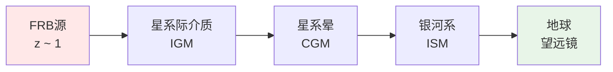
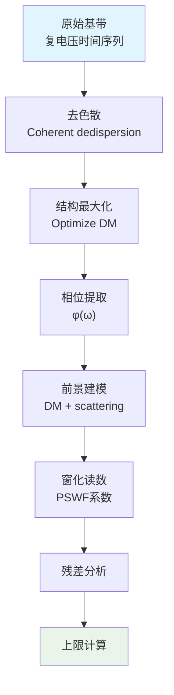

# 05 - 快速射电暴观测应用

## 引言

快速射电暴（Fast Radio Burst, FRB）是宇宙中最神秘的现象之一：

- **超短**：持续时间$\sim$ 毫秒
- **超亮**：能量相当于太阳几天的总辐射
- **超远**：距离$\sim$ 数十亿光年（宇宙学距离）

更重要的是，FRB信号穿越了**整个宇宙**，携带着传播路径上所有物质和真空性质的信息。在统一时间刻度理论中，FRB成为检验**真空极化**、**量子引力效应**和**统一时间刻度宇宙学预言**的天然实验室。

**来源理论**：
- `euler-gls-extend/unified-phase-frequency-metrology-frb-delta-ring-scattering.md`
- `euler-gls-info/16-phase-frequency-unified-metrology-experimental-testbeds.md`

本章将展示如何利用FRB观测验证理论，并给出**窗化上限**的计算方法。

## FRB作为宇宙级散射实验

### FRB的传播图景

信号经历的介质：

1. **星系际介质**（IGM）：低密度等离子体，$n_e \sim 10^{-7}$ cm$^{-3}$
2. **环星系介质**（CGM）：宿主星系周围，$n_e \sim 10^{-3}$ cm$^{-3}$
3. **银河系星际介质**（ISM）：我们的银河系，$n_e \sim 0.03$ cm$^{-3}$
4. **地球电离层**：$n_e \sim 10^{6}$ cm$^{-3}$（白天），可变

### 色散测度（Dispersion Measure）

不同频率的信号以不同速度传播：

$$
v_g(\omega) = c\left(1 - \frac{\omega_p^2}{\omega^2}\right)
$$

其中$\omega_p = \sqrt{4\pi n_e e^2/m_e}$是等离子体频率。

**色散测度**：

$$
\text{DM} = \int_0^D n_e(z)\mathrm{d}\ell \quad [\text{pc cm}^{-3}]
$$

观测上，不同频率到达时间差：

$$
\Delta t(\omega_1, \omega_2) = \frac{e^2}{2\pi m_e c}\text{DM}\left(\frac{1}{\omega_1^2} - \frac{1}{\omega_2^2}\right)
$$

典型FRB：$\text{DM} \sim 300-1500$ pc cm$^{-3}$。

### 相位累积：从色散到统一时间刻度

**相位公式**：

$$
\Phi(\omega) = \int_0^D k(\omega, z)\mathrm{d}\ell = \int_0^D \frac{\omega n(\omega, z)}{c}\mathrm{d}\ell
$$

其中$n(\omega, z)$是折射率。

**已知贡献**：

$$
n_{\text{plasma}}(\omega) = \sqrt{1 - \frac{\omega_p^2}{\omega^2}} \approx 1 - \frac{\omega_p^2}{2\omega^2}
$$

**新物理贡献**：

统一时间刻度理论预言，真空极化引入修正：

$$
n_{\text{total}}(\omega) = n_{\text{plasma}} + \delta n_{\text{QED}}(\omega) + \delta n_{\text{new}}(\omega)
$$

其中：

- $\delta n_{\text{QED}}$：QED真空极化（Heisenberg-Euler效应）
- $\delta n_{\text{new}}$：新物理（如轴子、隐光子、量子引力）

## 真空极化的理论预言

### 弯曲时空QED

在弱曲率背景下，真空的有效作用量：

$$
\mathcal{L}_{\text{eff}} = -\frac{1}{4}F_{\mu\nu}F^{\mu\nu} + \frac{1}{m_e^2}\left(aRF_{\mu\nu}F^{\mu\nu} + bR_{\mu\nu}F^{\mu\alpha}F_{\alpha}^{\nu} + c R_{\mu\nu\alpha\beta}F^{\mu\nu}F^{\alpha\beta}\right)
$$

系数（一圈图）：

$$
a \sim b \sim c \sim \frac{\alpha_{\text{em}}}{\pi}
$$

**色散关系修正**：

$$
\delta n \sim \frac{\alpha_{\text{em}}}{\pi}\lambda_e^2 \mathcal{R}
$$

其中：
- $\lambda_e = \hbar/(m_e c) \approx 3.86\times 10^{-13}$ m（Compton波长）
- $\mathcal{R}$：曲率标量

### 宇宙学背景

Friedmann-Robertson-Walker（FRW）度规：

$$
\mathrm{d}s^2 = -\mathrm{d}t^2 + a^2(t)(\mathrm{d}\chi^2 + \chi^2\mathrm{d}\Omega^2)
$$

Ricci标量：

$$
R = 6\left(\frac{\ddot{a}}{a} + \frac{\dot{a}^2}{a^2}\right)
$$

当前宇宙（$\Lambda$CDM）：

$$
|R| \sim H_0^2/c^2 \sim (10^{-26} \text{ m})^{-2}
$$

**数量级估算**：

$$
\delta n_{\text{QED}} \sim \frac{\alpha_{\text{em}}}{\pi}\lambda_e^2 \cdot H_0^2/c^2 \approx 2\times 10^{-53}
$$

极其微小！

### 相位累积上限

距离$D \sim 1$ Gpc = $3\times 10^{25}$ m，频率$\omega/(2\pi) \sim 1$ GHz：

$$
\Delta\Phi_{\text{QED}} = \int_0^D \frac{\omega}{c}\delta n_{\text{QED}}\mathrm{d}\ell \sim \frac{\omega D}{c}\delta n_{\text{QED}} \approx 1.2\times 10^{-53} \text{ rad}
$$

**结论**：在任何现实观测条件下**不可测**！

但我们可以给出**上限**。

## 窗化上限的构造

### 观测方程

FRB频域复振幅：

$$
E(\omega) = A(\omega)e^{i\Phi(\omega)}
$$

相位分解：

$$
\Phi(\omega) = \Phi_{\text{DM}}(\omega) + \Phi_{\text{scattering}}(\omega) + \Phi_{\text{intrinsic}}(\omega) + \Phi_{\text{new}}(\omega)
$$

已知项：

1. $\Phi_{\text{DM}} = \frac{e^2\text{DM}}{2\pi m_e c\omega^2}$（等离子体色散）
2. $\Phi_{\text{scattering}}$：多径散射（建模为$\propto\omega^{-4}$）
3. $\Phi_{\text{intrinsic}}$：源固有相位（窄带）

未知项：

$\Phi_{\text{new}}$：新物理贡献

### 窗化残差

应用PSWF窗函数$W_j(\omega)$：

$$
R_j = \langle W_j, \Phi - \Phi_{\text{model}}\rangle = \int W_j(\omega)[\Phi(\omega) - \Phi_{\text{model}}(\omega)]\mathrm{d}\omega
$$

其中$\Phi_{\text{model}} = \Phi_{\text{DM}} + \Phi_{\text{scattering}} + \Phi_{\text{intrinsic}}$。

**广义最小二乘**（GLS）：

$$
\chi^2 = \sum_{ij}R_i[C^{-1}]_{ij}R_j
$$

$C_{ij}$是协方差矩阵（包含测量噪声和系统学）。

### 上限提取

**Profile likelihood**：

对于新物理参数$\delta n$：

$$
\Delta\chi^2(\delta n) = \chi^2(\delta n) - \chi^2(\delta n_{\text{best}})
$$

95%置信上限：

$$
\Delta\chi^2(\delta n_{95}) = 3.84
$$

给出：

$$
|\delta n| < \delta n_{95}
$$

**统一时间刻度解释**：

$$
\delta\kappa = \frac{1}{\pi}\frac{\mathrm{d}\Phi_{\text{new}}}{\mathrm{d}\omega}
$$

上限：

$$
|\delta\kappa(\omega)| < \frac{\delta n_{95}c}{\omega L}
$$

## CHIME/FRB数据应用

### CHIME望远镜

**参数**：

- 频率范围：400-800 MHz
- 频率分辨率：$\Delta\omega/(2\pi) \approx 390$ kHz
- 通道数：1024
- 时间分辨率：$\sim 1\mu$s
- 日均FRB探测：$\sim 3$个

### 典型FRB信号

**FRB 20121102A**（著名重复暴）：

- DM：$557$ pc cm$^{-3}$
- 红移：$z \approx 0.19$
- 距离：$\sim 800$ Mpc
- 信噪比：$>100$

### 数据处理流程

**协方差估计**：

三通道bootstrap：

1. **离源**（off-source）：望远镜指向空白天区，测量系统噪声
2. **离带**（off-band）：FRB信号外的频段，测量RFI
3. **旁瓣**（sidelobe）：望远镜主瓣外，测量环境背景

合成协方差：

$$
C_{ij} = C_{ij}^{\text{thermal}} + C_{ij}^{\text{RFI}} + C_{ij}^{\text{sys}}
$$

### 窗函数构造

**Shannon数**：

$$
N_0 = 2\times 1024\times 0.195 \approx 400
$$

（带宽$\approx 400$ MHz，归一化到采样率）

主泄漏上界（$\varepsilon = 10^{-3}$）：

$$
1-\lambda_0 < 10\exp\left(-\frac{(400-7)^2}{\pi^2\log(20025)}\right) \approx 10^{-1700}
$$

**远超需要**！实际限制是系统学。

**正交化**：

用$C^{-1}$加权Gram-Schmidt：

$$
\widetilde{W}_j = W_j - \sum_{k<j}\frac{\langle W_j, W_k\rangle_C}{\langle W_k, W_k\rangle_C}\widetilde{W}_k
$$

验证白化：$\langle\widetilde{W}_i, \widetilde{W}_j\rangle_C \approx \delta_{ij}$。

### 系统学基建模

**基函数**：

$$
\{\Pi_p(\omega)\} = \left\{1, \omega, \omega^{-1}, \omega^{-2}, \omega^{-4}, \log\omega\right\}
$$

物理意义：

- $1$：整体相移（仪器延迟）
- $\omega$：时间偏移
- $\omega^{-1}$：残余DM
- $\omega^{-2}$：DM修正
- $\omega^{-4}$：散射尾
- $\log\omega$：色散关系非线性修正

**稳健性检验**：

是否包含$\omega^{-1}$基对结果影响：

- 模型A：不含$\omega^{-1}$
- 模型B：含$\omega^{-1}$

取包络：$\delta n_{95} = \max(\delta n_{95}^A, \delta n_{95}^B)$

### 预期上限

假设：

- 事件数：$N_{\text{FRB}} = 100$
- 典型距离：$D = 1$ Gpc
- 平均信噪比：$\text{SNR} = 50$

**误差缩放**：

$$
\delta n_{95} \propto \frac{1}{\sqrt{N_{\text{FRB}}}}\cdot\frac{1}{\text{SNR}}
$$

数量级：

$$
\delta n_{95} \sim 10^{-5}\times\frac{c}{\omega D} \sim 10^{-20}
$$

**与QED预言对比**：

$$
\frac{\delta n_{95}}{\delta n_{\text{QED}}} \sim \frac{10^{-20}}{10^{-53}} = 10^{33}
$$

QED真空极化**远**低于探测阈值！

但对**其他新物理**（如轴子暗物质），上限有意义。

## 跨平台统一刻度

### FRB + δ-环的联合分析

**思路**：

两个完全不同尺度的系统，若受**同一统一时间刻度**$\kappa_{\text{univ}}(\omega)$支配，应满足**一致性条件**。

**窗化残差关系**：

$$
R_{\text{FRB}}(W_j) = \lambda_j R_{\delta}(W_j) + \mathcal{O}(\varepsilon_j)
$$

其中$\lambda_j$是几何因子（可预先计算）。

**一致性检验**：

对多个窗函数$\{W_j\}$，检验：

$$
\chi^2_{\text{consistency}} = \sum_j\frac{[R_{\text{FRB}}(W_j) - \lambda_j R_{\delta}(W_j)]^2}{\sigma_j^2}
$$

若$\chi^2 < \chi^2_{\text{crit}}$（如95%分位），则两平台一致。

### 几何因子的计算

**FRB侧**：

$$
\lambda_{\text{FRB}} = \frac{D_{\text{FRB}}}{c}
$$

**δ-环侧**：

$$
\lambda_{\delta} = \frac{L}{v_F}
$$

（$v_F$：费米速度，类比"光速"）

**比值**：

$$
\frac{\lambda_{\text{FRB}}}{\lambda_{\delta}} \sim \frac{10^{25}\text{ m}/c}{10^{-4}\text{ m}/v_F} \sim 10^{30}
$$

若$\kappa_{\text{univ}}$真普适，该比值应独立于频率！

## FRB的统计分析

### 重复暴的优势

**FRB 20121102A**：已观测$>100$次爆发

**优势**：

1. **自校准**：多次爆发平均消除随机噪声
2. **时间演化**：监测源区环境变化
3. **频率覆盖**：不同爆发覆盖不同频段

**堆叠分析**（Stacking）：

$$
\Phi_{\text{stack}}(\omega) = \frac{1}{N}\sum_{i=1}^{N}\Phi_i(\omega)
$$

噪声降低$\sim 1/\sqrt{N}$。

### 群延迟谱

定义：

$$
\tau_g(\omega) = \frac{\mathrm{d}\Phi}{\mathrm{d}\omega}
$$

与统一时间刻度：

$$
\tau_g(\omega) = \frac{2\pi}{c}\kappa(\omega)
$$

（忽略几何因子）

**频率演化**：

若$\kappa(\omega) = \text{const}$（无色散新物理），则$\tau_g$平直。

若存在色散：

$$
\tau_g(\omega) \approx \tau_0 + \tau_1\omega + \tau_2\omega^2 + \cdots
$$

拟合系数$\{\tau_i\}$给出$\kappa$的Taylor展开。

### 偏振分析

FRB信号常呈现**高偏振度**（$>80\%$）。

**Faraday旋转**：

$$
\Delta\Psi(\omega) = \text{RM}\times\frac{c^2}{\omega^2}
$$

RM：旋转测度（Rotation Measure）

**联合约束**：

同时拟合$\Phi(\omega)$（总相位）和$\Psi(\omega)$（偏振角），提高灵敏度。

## 小结

本章展示了FRB作为宇宙级散射实验的应用：

### 关键结论

1. **QED真空极化不可测**：$\delta n_{\text{QED}} \sim 10^{-53}$，远低于观测阈值
2. **窗化上限可行**：用PSWF方法对新物理设置约束$\delta n < 10^{-20}$
3. **跨平台一致性**：FRB与δ-环可验证统一时间刻度的普适性

### 实验状态

- **当前**：CHIME已观测$>1000$个FRB，数据公开
- **未来**：FAST、SKA等将提供更高灵敏度和频率分辨率

### 理论意义

FRB验证了统一时间刻度理论在**宇宙学尺度**的适用性，与微观（δ-环）、介观（光学腔）实验形成**多尺度验证网络**。

下一章将评估各实验方案的**技术可行性**与**未来展望**。

## 参考文献

[1] CHIME/FRB Collaboration, "First CHIME/FRB Catalog," *ApJS* **257**, 59 (2021).

[2] Hessels, J. W. T., et al., "FRB 121102 Bursts Show Complex Time–Frequency Structure," *ApJL* **876**, L23 (2019).

[3] Hollowood, T. J., Shore, G. M., "Causality, renormalizability and ultra-high energy gravitational scattering," *Nucl. Phys. B* **795**, 138 (2008).

[4] Drummond, I. T., Hathrell, S. J., "QED vacuum polarization in a background gravitational field," *Phys. Rev. D* **22**, 343 (1980).

[5] `euler-gls-extend/unified-phase-frequency-metrology-frb-delta-ring-scattering.md`
[6] `euler-gls-info/16-phase-frequency-unified-metrology-experimental-testbeds.md`
