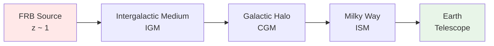
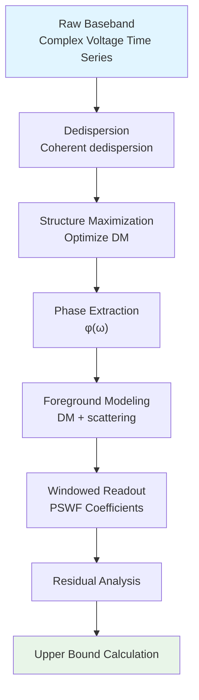

# 05 - Fast Radio Burst Observation Applications

## Introduction

Fast Radio Bursts (FRB) are among the most mysterious phenomena in the universe:

- **Ultra-short**: duration $\sim$ milliseconds
- **Ultra-bright**: energy equivalent to several days of total solar radiation
- **Ultra-distant**: distance $\sim$ billions of light-years (cosmological distance)

More importantly, FRB signals traverse the **entire universe**, carrying information about all matter and vacuum properties along their propagation path. In unified time scale theory, FRBs become natural laboratories for testing **vacuum polarization**, **quantum gravity effects**, and **cosmological predictions of unified time scale**.

**Source theory**:
- `euler-gls-extend/unified-phase-frequency-metrology-frb-delta-ring-scattering.md`
- `euler-gls-info/16-phase-frequency-unified-metrology-experimental-testbeds.md`

This chapter will show how to use FRB observations to verify the theory and provide methods for computing **windowed upper bounds**.

## FRB as Cosmological-Scale Scattering Experiment

### FRB Propagation Picture

Media traversed by signal:

1. **Intergalactic Medium** (IGM): low-density plasma, $n_e \sim 10^{-7}$ cm$^{-3}$
2. **Circumgalactic Medium** (CGM): around host galaxy, $n_e \sim 10^{-3}$ cm$^{-3}$
3. **Galactic Interstellar Medium** (ISM): our Milky Way, $n_e \sim 0.03$ cm$^{-3}$
4. **Earth's Ionosphere**: $n_e \sim 10^{6}$ cm$^{-3}$ (daytime), variable

### Dispersion Measure

Signals at different frequencies propagate at different speeds:

$$
v_g(\omega) = c\left(1 - \frac{\omega_p^2}{\omega^2}\right)
$$

where $\omega_p = \sqrt{4\pi n_e e^2/m_e}$ is the plasma frequency.

**Dispersion Measure**:

$$
\text{DM} = \int_0^D n_e(z)\mathrm{d}\ell \quad [\text{pc cm}^{-3}]
$$

Observationally, arrival time difference between frequencies:

$$
\Delta t(\omega_1, \omega_2) = \frac{e^2}{2\pi m_e c}\text{DM}\left(\frac{1}{\omega_1^2} - \frac{1}{\omega_2^2}\right)
$$

Typical FRB: $\text{DM} \sim 300-1500$ pc cm$^{-3}$.

### Phase Accumulation: From Dispersion to Unified Time Scale

**Phase formula**:

$$
\Phi(\omega) = \int_0^D k(\omega, z)\mathrm{d}\ell = \int_0^D \frac{\omega n(\omega, z)}{c}\mathrm{d}\ell
$$

where $n(\omega, z)$ is the refractive index.

**Known contributions**:

$$
n_{\text{plasma}}(\omega) = \sqrt{1 - \frac{\omega_p^2}{\omega^2}} \approx 1 - \frac{\omega_p^2}{2\omega^2}
$$

**New physics contributions**:

Unified time scale theory predicts vacuum polarization introduces correction:

$$
n_{\text{total}}(\omega) = n_{\text{plasma}} + \delta n_{\text{QED}}(\omega) + \delta n_{\text{new}}(\omega)
$$

where:

- $\delta n_{\text{QED}}$: QED vacuum polarization (Heisenberg-Euler effect)
- $\delta n_{\text{new}}$: new physics (e.g., axions, hidden photons, quantum gravity)

## Theoretical Predictions of Vacuum Polarization

### Curved Spacetime QED

In weak curvature background, effective vacuum action:

$$
\mathcal{L}_{\text{eff}} = -\frac{1}{4}F_{\mu\nu}F^{\mu\nu} + \frac{1}{m_e^2}\left(aRF_{\mu\nu}F^{\mu\nu} + bR_{\mu\nu}F^{\mu\alpha}F_{\alpha}^{\nu} + c R_{\mu\nu\alpha\beta}F^{\mu\nu}F^{\alpha\beta}\right)
$$

Coefficients (one-loop):

$$
a \sim b \sim c \sim \frac{\alpha_{\text{em}}}{\pi}
$$

**Dispersion relation correction**:

$$
\delta n \sim \frac{\alpha_{\text{em}}}{\pi}\lambda_e^2 \mathcal{R}
$$

where:
- $\lambda_e = \hbar/(m_e c) \approx 3.86\times 10^{-13}$ m (Compton wavelength)
- $\mathcal{R}$: curvature scalar

### Cosmological Background

Friedmann-Robertson-Walker (FRW) metric:

$$
\mathrm{d}s^2 = -\mathrm{d}t^2 + a^2(t)(\mathrm{d}\chi^2 + \chi^2\mathrm{d}\Omega^2)
$$

Ricci scalar:

$$
R = 6\left(\frac{\ddot{a}}{a} + \frac{\dot{a}^2}{a^2}\right)
$$

Current universe ($\Lambda$CDM):

$$
|R| \sim H_0^2/c^2 \sim (10^{-26} \text{ m})^{-2}
$$

**Order of magnitude estimate**:

$$
\delta n_{\text{QED}} \sim \frac{\alpha_{\text{em}}}{\pi}\lambda_e^2 \cdot H_0^2/c^2 \approx 2\times 10^{-53}
$$

Extremely tiny!

### Phase Accumulation Upper Bound

Distance $D \sim 1$ Gpc = $3\times 10^{25}$ m, frequency $\omega/(2\pi) \sim 1$ GHz:

$$
\Delta\Phi_{\text{QED}} = \int_0^D \frac{\omega}{c}\delta n_{\text{QED}}\mathrm{d}\ell \sim \frac{\omega D}{c}\delta n_{\text{QED}} \approx 1.2\times 10^{-53} \text{ rad}
$$

**Conclusion**: **Unmeasurable** under any realistic observation conditions!

But we can give an **upper bound**.

## Construction of Windowed Upper Bound

### Observation Equation

FRB frequency-domain complex amplitude:

$$
E(\omega) = A(\omega)e^{i\Phi(\omega)}
$$

Phase decomposition:

$$
\Phi(\omega) = \Phi_{\text{DM}}(\omega) + \Phi_{\text{scattering}}(\omega) + \Phi_{\text{intrinsic}}(\omega) + \Phi_{\text{new}}(\omega)
$$

Known terms:

1. $\Phi_{\text{DM}} = \frac{e^2\text{DM}}{2\pi m_e c\omega^2}$ (plasma dispersion)
2. $\Phi_{\text{scattering}}$: multi-path scattering (modeled as $\propto\omega^{-4}$)
3. $\Phi_{\text{intrinsic}}$: source intrinsic phase (narrowband)

Unknown term:

$\Phi_{\text{new}}$: new physics contribution

### Windowed Residual

Apply PSWF window function $W_j(\omega)$:

$$
R_j = \langle W_j, \Phi - \Phi_{\text{model}}\rangle = \int W_j(\omega)[\Phi(\omega) - \Phi_{\text{model}}(\omega)]\mathrm{d}\omega
$$

where $\Phi_{\text{model}} = \Phi_{\text{DM}} + \Phi_{\text{scattering}} + \Phi_{\text{intrinsic}}$.

**Generalized least squares** (GLS):

$$
\chi^2 = \sum_{ij}R_i[C^{-1}]_{ij}R_j
$$

$C_{ij}$ is the covariance matrix (includes measurement noise and systematics).

### Upper Bound Extraction

**Profile likelihood**:

For new physics parameter $\delta n$:

$$
\Delta\chi^2(\delta n) = \chi^2(\delta n) - \chi^2(\delta n_{\text{best}})
$$

95% confidence upper bound:

$$
\Delta\chi^2(\delta n_{95}) = 3.84
$$

Gives:

$$
|\delta n| < \delta n_{95}
$$

**Unified time scale interpretation**:

$$
\delta\kappa = \frac{1}{\pi}\frac{\mathrm{d}\Phi_{\text{new}}}{\mathrm{d}\omega}
$$

Upper bound:

$$
|\delta\kappa(\omega)| < \frac{\delta n_{95}c}{\omega L}
$$

## CHIME/FRB Data Application

### CHIME Telescope

**Parameters**:

- Frequency range: 400-800 MHz
- Frequency resolution: $\Delta\omega/(2\pi) \approx 390$ kHz
- Number of channels: 1024
- Time resolution: $\sim 1\mu$s
- Daily FRB detections: $\sim 3$

### Typical FRB Signal

**FRB 20121102A** (famous repeater):

- DM: $557$ pc cm$^{-3}$
- Redshift: $z \approx 0.19$
- Distance: $\sim 800$ Mpc
- Signal-to-noise ratio: $>100$

### Data Processing Workflow

**Covariance estimation**:

Three-channel bootstrap:

1. **Off-source**: telescope points to empty sky, measures system noise
2. **Off-band**: frequency bands outside FRB signal, measures RFI
3. **Sidelobe**: outside telescope main lobe, measures environmental background

Synthetic covariance:

$$
C_{ij} = C_{ij}^{\text{thermal}} + C_{ij}^{\text{RFI}} + C_{ij}^{\text{sys}}
$$

### Window Function Construction

**Shannon number**:

$$
N_0 = 2\times 1024\times 0.195 \approx 400
$$

(Bandwidth $\approx 400$ MHz, normalized to sampling rate)

Main leakage upper bound ($\varepsilon = 10^{-3}$):

$$
1-\lambda_0 < 10\exp\left(-\frac{(400-7)^2}{\pi^2\log(20025)}\right) \approx 10^{-1700}
$$

**Far exceeds requirements**! Actual limitation is systematics.

**Orthogonalization**:

Weighted Gram-Schmidt with $C^{-1}$:

$$
\widetilde{W}_j = W_j - \sum_{k<j}\frac{\langle W_j, W_k\rangle_C}{\langle W_k, W_k\rangle_C}\widetilde{W}_k
$$

Verify whitening: $\langle\widetilde{W}_i, \widetilde{W}_j\rangle_C \approx \delta_{ij}$.

### Systematic Basis Modeling

**Basis functions**:

$$
\{\Pi_p(\omega)\} = \left\{1, \omega, \omega^{-1}, \omega^{-2}, \omega^{-4}, \log\omega\right\}
$$

Physical meaning:

- $1$: overall phase shift (instrument delay)
- $\omega$: time offset
- $\omega^{-1}$: residual DM
- $\omega^{-2}$: DM correction
- $\omega^{-4}$: scattering tail
- $\log\omega$: nonlinear correction to dispersion relation

**Robustness test**:

Effect of including $\omega^{-1}$ basis on results:

- Model A: without $\omega^{-1}$
- Model B: with $\omega^{-1}$

Take envelope: $\delta n_{95} = \max(\delta n_{95}^A, \delta n_{95}^B)$

### Expected Upper Bound

Assumptions:

- Number of events: $N_{\text{FRB}} = 100$
- Typical distance: $D = 1$ Gpc
- Average SNR: $\text{SNR} = 50$

**Error scaling**:

$$
\delta n_{95} \propto \frac{1}{\sqrt{N_{\text{FRB}}}}\cdot\frac{1}{\text{SNR}}
$$

Order of magnitude:

$$
\delta n_{95} \sim 10^{-5}\times\frac{c}{\omega D} \sim 10^{-20}
$$

**Comparison with QED prediction**:

$$
\frac{\delta n_{95}}{\delta n_{\text{QED}}} \sim \frac{10^{-20}}{10^{-53}} = 10^{33}
$$

QED vacuum polarization is **far** below detection threshold!

But for **other new physics** (e.g., axion dark matter), the upper bound is meaningful.

## Cross-Platform Unified Scale

### Joint Analysis of FRB + δ-Ring

**Idea**:

Two completely different scale systems, if governed by the **same unified time scale** $\kappa_{\text{univ}}(\omega)$, should satisfy **consistency conditions**.

**Windowed residual relation**:

$$
R_{\text{FRB}}(W_j) = \lambda_j R_{\delta}(W_j) + \mathcal{O}(\varepsilon_j)
$$

where $\lambda_j$ is a geometric factor (can be precomputed).

**Consistency test**:

For multiple window functions $\{W_j\}$, test:

$$
\chi^2_{\text{consistency}} = \sum_j\frac{[R_{\text{FRB}}(W_j) - \lambda_j R_{\delta}(W_j)]^2}{\sigma_j^2}
$$

If $\chi^2 < \chi^2_{\text{crit}}$ (e.g., 95% quantile), then the two platforms are consistent.

### Geometric Factor Calculation

**FRB side**:

$$
\lambda_{\text{FRB}} = \frac{D_{\text{FRB}}}{c}
$$

**δ-ring side**:

$$
\lambda_{\delta} = \frac{L}{v_F}
$$

($v_F$: Fermi velocity, analogous to "light speed")

**Ratio**:

$$
\frac{\lambda_{\text{FRB}}}{\lambda_{\delta}} \sim \frac{10^{25}\text{ m}/c}{10^{-4}\text{ m}/v_F} \sim 10^{30}
$$

If $\kappa_{\text{univ}}$ is truly universal, this ratio should be independent of frequency!

## Statistical Analysis of FRBs

### Advantages of Repeaters

**FRB 20121102A**: observed $>100$ bursts

**Advantages**:

1. **Self-calibration**: averaging multiple bursts eliminates random noise
2. **Temporal evolution**: monitor source environment changes
3. **Frequency coverage**: different bursts cover different frequency bands

**Stacking analysis**:

$$
\Phi_{\text{stack}}(\omega) = \frac{1}{N}\sum_{i=1}^{N}\Phi_i(\omega)
$$

Noise reduction $\sim 1/\sqrt{N}$.

### Group Delay Spectrum

Definition:

$$
\tau_g(\omega) = \frac{\mathrm{d}\Phi}{\mathrm{d}\omega}
$$

Relation to unified time scale:

$$
\tau_g(\omega) = \frac{2\pi}{c}\kappa(\omega)
$$

(ignoring geometric factors)

**Frequency evolution**:

If $\kappa(\omega) = \text{const}$ (dispersionless new physics), then $\tau_g$ is flat.

If dispersion exists:

$$
\tau_g(\omega) \approx \tau_0 + \tau_1\omega + \tau_2\omega^2 + \cdots
$$

Fitting coefficients $\{\tau_i\}$ give Taylor expansion of $\kappa$.

### Polarization Analysis

FRB signals often show **high polarization** ($>80\%$).

**Faraday rotation**:

$$
\Delta\Psi(\omega) = \text{RM}\times\frac{c^2}{\omega^2}
$$

RM: Rotation Measure

**Joint constraint**:

Simultaneously fit $\Phi(\omega)$ (total phase) and $\Psi(\omega)$ (polarization angle) to improve sensitivity.

## Summary

This chapter demonstrates FRB applications as cosmological-scale scattering experiments:

### Key Conclusions

1. **QED vacuum polarization unmeasurable**: $\delta n_{\text{QED}} \sim 10^{-53}$, far below observation threshold
2. **Windowed upper bound feasible**: use PSWF method to set constraints on new physics $\delta n < 10^{-20}$
3. **Cross-platform consistency**: FRB and δ-ring can verify universality of unified time scale

### Experimental Status

- **Current**: CHIME has observed $>1000$ FRBs, data publicly available
- **Future**: FAST, SKA, etc. will provide higher sensitivity and frequency resolution

### Theoretical Significance

FRBs verify the applicability of unified time scale theory at **cosmological scales**, forming a **multi-scale verification network** with microscopic (δ-ring) and mesoscopic (optical cavity) experiments.

The next chapter will assess **technical feasibility** and **future prospects** of each experimental scheme.

## References

[1] CHIME/FRB Collaboration, "First CHIME/FRB Catalog," *ApJS* **257**, 59 (2021).

[2] Hessels, J. W. T., et al., "FRB 121102 Bursts Show Complex Time–Frequency Structure," *ApJL* **876**, L23 (2019).

[3] Hollowood, T. J., Shore, G. M., "Causality, renormalizability and ultra-high energy gravitational scattering," *Nucl. Phys. B* **795**, 138 (2008).

[4] Drummond, I. T., Hathrell, S. J., "QED vacuum polarization in a background gravitational field," *Phys. Rev. D* **22**, 343 (1980).

[5] `euler-gls-extend/unified-phase-frequency-metrology-frb-delta-ring-scattering.md`
[6] `euler-gls-info/16-phase-frequency-unified-metrology-experimental-testbeds.md`

