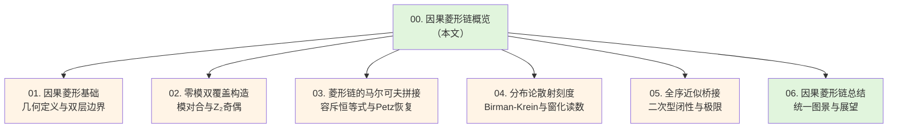
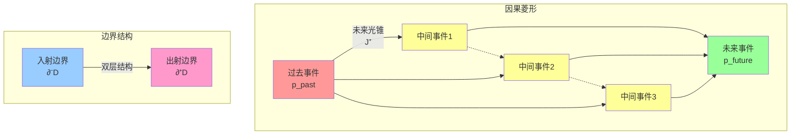
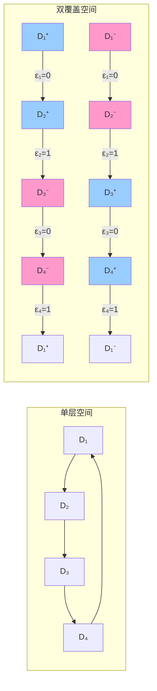
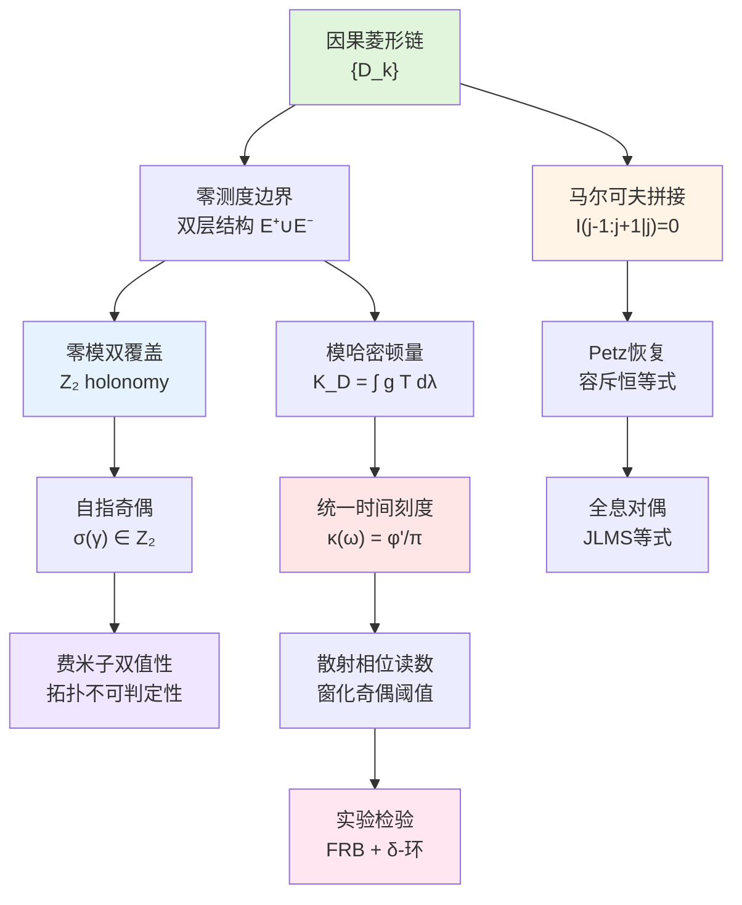

# 第21章 因果菱形链与零模双覆盖——概览

## 引言

在前面的章节中，我们已经建立了统一时间刻度、边界时间几何、观测者理论以及实验检验方案。现在，我们来到一个新的理论高度：**因果菱形链与零模双覆盖结构**。

想象一下，你在观察一个个因果事件，就像观察一串珍珠项链。每颗"珍珠"都是一个**因果菱形**（causal diamond），它包含了从一个初始事件到一个最终事件之间所有可能的因果路径。当这些因果菱形一个接一个地连接起来时，就形成了**因果菱形链**。

但这还不是全部。每个因果菱形的边界实际上有两层——就像一个橘子的内外皮。这两层边界被称为**零测度边界**（null boundary），它们承载着系统的全部时间、能量和信息。更神奇的是，这两层边界之间存在一种对称关系，叫做**模对合**（modular conjugation），它会把两层边界交换，并反转时间方向。这就是**零模双覆盖**（Null-Modular Double Cover）的核心思想。

在这一章中，我们将探讨：

1. 因果菱形的几何结构与物理意义
2. 零测度边界的双层分解
3. 零模双覆盖与 $\mathbb{Z}_2$ 奇偶阈值
4. 菱形链的马尔可夫拼接与容斥恒等式
5. 统一时间刻度在因果菱形链上的实现
6. 自指反馈网络与拓扑不可判定性

### 为什么因果菱形链如此重要？

因果菱形链不仅是时空几何的基本构件，更是连接以下三大理论框架的桥梁：

**1. 统一时间刻度理论**

在统一时间刻度框架中，时间不是外部参数，而是通过散射相位导数、谱移密度、群延迟迹三者的等价关系定义：

$$
\kappa(\omega) = \frac{\varphi'(\omega)}{\pi} = \rho_{\text{rel}}(\omega) = \frac{1}{2\pi}\text{tr}\,Q(\omega)
$$

因果菱形的边界恰好是这一刻度的"天然测量仪"——边界上的模哈密顿量直接关联群延迟，从而给出时间增量。

**2. 量子信息与纠缠结构**

因果菱形链的马尔可夫性质（相邻菱形条件独立）与纠缠结构直接相关：

$$
I(D_{j-1}:D_{j+1}|D_j) = 0
$$

这一条件在全息对偶中对应边界相对熵的饱和，在量子信息论中对应Petz恢复映射的完美性。而**非全序切割**导致的马尔可夫缺口则定量刻画了系统的"记忆结构"。

**3. 拓扑量子计算与自指结构**

零模双覆盖引入的 $\mathbb{Z}_2$ 奇偶不变量与拓扑量子计算中的逻辑操作、自指反馈网络中的费米子双值性、以及停机问题的不可判定性之间存在深刻联系。这一 $\mathbb{Z}_2$ 标签不是人为添加的，而是从散射相位的辐角原理严格导出的拓扑指纹。

### 本章结构

让我们从最简单的问题开始：什么是因果菱形？

---

## 1. 因果菱形的直观图景

### 1.1 日常类比：一段旅程的所有可能路径

假设你早上8点从家出发，晚上6点到达办公室。在这10小时内，你可能走过无数条路径：

- 直接坐地铁（最快路径）
- 先去咖啡馆，再去公园，最后到办公室
- 绕远路去超市买东西

所有这些可能路径，加上你在途中可能到达的所有地点，构成了一个"因果菱形"——它包含了从出发事件到到达事件之间所有因果可达的中间事件。

在时空几何中，因果菱形就是这样一个区域：

$$
D(p_{\text{past}}, p_{\text{future}}) = J^+(p_{\text{past}}) \cap J^-(p_{\text{future}})
$$

其中：
- $J^+(p_{\text{past}})$ 是从过去事件 $p_{\text{past}}$ 出发能到达的所有事件（未来光锥）
- $J^-(p_{\text{future}})$ 是能到达未来事件 $p_{\text{future}}$ 的所有事件（过去光锥）
- 两者交集就是因果菱形

### 1.2 零测度边界的双层结构

因果菱形的边界非常特殊——它是**零测度的**（null）。这意味着边界上的观测者以光速运动，时空间隔为零。想象边界是由无数条光线编织而成的"光网"。

更神奇的是，这个边界实际上有两层：

$$
\widetilde{E} = E^+ \sqcup E^-
$$

- $E^+$ 层：沿 $u=\text{常数}$ 的出射null超平面
- $E^-$ 层：沿 $v=\text{常数}$ 的入射null超平面

**日常类比：橘子的内外皮**

- 外皮（$E^+$）：信息从菱形内部向外传播的界面
- 内皮（$E^-$）：信息从外部进入菱形的界面
- 两层之间的关系由**模对合** $J$ 联系：$J(E^+) = E^-$，并且反转时间方向

### 1.3 模哈密顿量：边界上的能量流

在每一层边界上，都有一个局域能量流密度 $T_{\sigma\sigma}$（$\sigma=\pm$），它告诉我们能量如何沿着null方向流动。将这个能量流加权积分，就得到**模哈密顿量**：

$$
K_D = 2\pi\sum_{\sigma=\pm}\int_{E^\sigma} g_\sigma(\lambda,x_\perp) T_{\sigma\sigma}(\lambda,x_\perp)\,d\lambda\,d^{d-2}x_\perp
$$

其中：
- $\lambda$ 是仿射参数（类似于沿光线的"距离"）
- $x_\perp$ 是横向坐标
- $g_\sigma$ 是几何权重函数

**物理意义**：模哈密顿量 $K_D$ 刻画了在因果菱形边界上"锁住"的能量与信息总量。它与统一时间刻度的关联公式为：

$$
\langle K_D \rangle \sim \int \kappa(\omega)\,d\omega
$$

---

## 2. 零模双覆盖：橘子的"平方根分支"

### 2.1 为什么需要"双覆盖"？

在经典几何中，一个圆周 $S^1$ 只有一种画法。但在量子理论中，当我们考虑**散射矩阵的平方根**时，就会遇到一个问题：

$$
S(\lambda) = \begin{pmatrix} e^{i\varphi(\lambda)} & \cdots \\ \cdots & \cdots \end{pmatrix}
$$

如何定义 $\sqrt{S(\lambda)}$？

答案是：我们需要选择一个**分支**。但当 $\lambda$ 绕一圈回到起点时，$\varphi(\lambda)$ 可能增加 $2\pi$，导致 $\sqrt{S}$ **不闭合**——它在回到起点时**翻转了符号**（从 $+\sqrt{S}$ 变成 $-\sqrt{S}$）。

这就是 $\mathbb{Z}_2$ 双覆盖的来源：我们需要**两份拷贝**的边界空间，一份对应 $+$ 分支，一份对应 $-$ 分支。当沿着菱形链走一圈时，我们可能在两个分支之间跳跃，这个跳跃次数的奇偶性就是 $\mathbb{Z}_2$ holonomy。

### 2.2 双覆盖的构造

给定因果菱形链 $\{D_k\}_{k=1}^N$，我们构造双覆盖空间 $\widetilde{\mathfrak{D}}$：

1. 对每个菱形 $D_k$，引入两份拷贝 $\widetilde{D}_k^{(0)}, \widetilde{D}_k^{(1)}$
2. 对每条链边 $(D_k, D_{k+1})$，定义连接规则：
   - 若模二相位增量 $\epsilon_k = 0$，则 $\widetilde{D}_k^{(i)} \to \widetilde{D}_{k+1}^{(i)}$（同分支）
   - 若 $\epsilon_k = 1$，则 $\widetilde{D}_k^{(i)} \to \widetilde{D}_{k+1}^{(1-i)}$（跳分支）

**闭合环路的 $\mathbb{Z}_2$ holonomy**：

$$
\text{hol}_{\mathbb{Z}_2}(\gamma) = \sum_{k\in\gamma} \epsilon_k \mod 2
$$

- 若 $\text{hol}_{\mathbb{Z}_2}(\gamma) = 0$，环路在双覆盖上可以闭合
- 若 $\text{hol}_{\mathbb{Z}_2}(\gamma) = 1$，环路在双覆盖上不能闭合（翻转一次分支）

在这个例子中，$\epsilon_1=0, \epsilon_2=1, \epsilon_3=0, \epsilon_4=1$，所以：

$$
\text{hol}_{\mathbb{Z}_2} = (0+1+0+1) \mod 2 = 0
$$

环路可以闭合！

---

## 3. 马尔可夫拼接：信息的"无记忆性"

### 3.1 什么是马尔可夫性？

想象你在玩一个游戏，游戏规则是：

- 你现在在状态 $D_j$（中间菱形）
- 你刚刚从状态 $D_{j-1}$（前一个菱形）来
- 你即将去往状态 $D_{j+1}$（后一个菱形）

**问题**：知道你现在在 $D_j$，你还需要知道 $D_{j-1}$ 的信息才能预测 $D_{j+1}$ 吗？

如果答案是"不需要"，那么系统具有**马尔可夫性**：

$$
I(D_{j-1}:D_{j+1}|D_j) = 0
$$

这里 $I(A:C|B)$ 是条件互信息，它度量"在已知 $B$ 的前提下，$A$ 和 $C$ 还有多少相关性"。

### 3.2 菱形链的马尔可夫拼接

在因果菱形链中，**同一零测度面上的全序切割**保证马尔可夫性。这是因为：

1. 前一个菱形 $D_{j-1}$ 的未来边界
2. 当前菱形 $D_j$ 的内部
3. 后一个菱形 $D_{j+1}$ 的过去边界

三者在因果结构上形成了"屏蔽"关系——$D_j$ 完全屏蔽了 $D_{j-1}$ 对 $D_{j+1}$ 的影响。

**对应的能量-熵关系**：

$$
K_{D_{j-1}\cup D_j} + K_{D_j\cup D_{j+1}} - K_{D_j} - K_{D_{j-1}\cup D_j\cup D_{j+1}} = 0
$$

这被称为**容斥恒等式**，它是马尔可夫性的能量版本。

### 3.3 非全序切割与马尔可夫缺口

但如果切割不是全序的（例如在不同横向位置 $x_\perp$ 处切割高度不一致），马尔可夫性就会被破坏。此时引入**马尔可夫缺口线密度** $\iota(v,x_\perp)$：

$$
I(D_{j-1}:D_{j+1}|D_j) = \iint \iota(v,x_\perp)\,dv\,d^{d-2}x_\perp
$$

**物理意义**：马尔可夫缺口刻画了系统的"记忆深度"——如果缺口大，说明系统需要记住更远的过去才能预测未来。

---

## 4. 分布论散射刻度：窗化读数与奇偶阈值

### 4.1 从散射相位到统一时间刻度

在散射理论中，幺正散射矩阵 $S(E)$ 的相位 $\varphi(E) = \frac{1}{2}\arg\det S(E)$ 与统一时间刻度密度直接关联：

$$
\kappa(E) = \frac{\varphi'(E)}{\pi} = \rho_{\text{rel}}(E) = \frac{1}{2\pi}\text{tr}\,Q(E)
$$

其中 $Q(E) = -i S^\dagger \partial_E S$ 是群延迟矩阵。

### 4.2 窗化读数与门槛不等式

在实际测量中，我们不能对整个能带积分，而是用一个**窗函数** $h_\ell(E-E_0)$ 来局域化：

$$
\Theta_h(\gamma) = \frac{1}{2}\int_{\mathcal{I}(\gamma)} \text{tr}\,Q(E)\,h_\ell(E-E_0)\,dE
$$

**奇偶判定定理**：若窗化误差

$$
\mathcal{E}_h(\gamma) \le \delta_*(\gamma) = \min\{\pi/2, \delta_{\text{gap}}(\gamma)\} - \varepsilon
$$

则窗化读数的奇偶与无窗极限一致：

$$
\nu_{\text{chain}}(\gamma) = (-1)^{\lfloor \Theta_h(\gamma)/\pi \rfloor} = (-1)^{\lfloor \Theta_{\text{geom}}(\gamma)/\pi \rfloor}
$$

这一定理保证了 $\mathbb{Z}_2$ holonomy 在有限精度测量下的稳定性。

---

## 5. 统一图景：从几何到拓扑

让我们把所有概念串联起来，形成一幅完整的图景：

**核心洞察**：

1. **几何层面**：因果菱形链是时空的基本构件，其边界承载全部信息
2. **能量层面**：模哈密顿量与统一时间刻度通过散射相位–群延迟关系统一
3. **信息层面**：马尔可夫拼接保证因果结构的局域性与可分性
4. **拓扑层面**：零模双覆盖引入的 $\mathbb{Z}_2$ holonomy 是系统自指结构的拓扑指纹
5. **实验层面**：窗化散射读数提供有限精度下的鲁棒测量方案

---

## 6. 本章导览

在接下来的各节中，我们将逐步深入这些概念：

**第1节：因果菱形基础**
- 几何定义：从闵氏时空到CFT共形像
- 双层边界的精确分解
- 模哈密顿量的二次型构造
- QNEC真空饱和与BW性质

**第2节：零模双覆盖构造**
- 模对合 $J$ 与模群 $\Delta^{it}$
- 平方根分支与 $\mathbb{Z}_2$ 主丛
- 散射相位的辐角原理
- $\pi$-台阶量子化定理

**第3节：菱形链的马尔可夫拼接**
- 全序切割与容斥恒等式
- 马尔可夫缺口的定量界
- Petz恢复映射与保真度
- 半侧模包含（HSMI）代数

**第4节：分布论散射刻度**
- Birman-Krein相位–谱移同一
- Wigner-Smith群延迟–迹公式
- PSWF/DPSS窗化读数
- 奇偶阈值的显式门槛

**第5节：全序近似桥接**
- 二次型下半界与闭性
- 主控收敛与路径无关性
- Toeplitz/Berezin压缩
- Euler-Maclaurin与Poisson估计

**第6节：因果菱形链总结**
- 理论图景的整合
- 与统一时间刻度的接口
- 实验平台的映射
- 开放问题与未来方向

---

## 7. 本章的数学工具箱

为了理解因果菱形链理论，我们需要以下数学工具（将在后续章节详细展开）：

### 7.1 几何工具

- **洛伦兹几何**：闵氏时空、null超平面、仿射参数
- **共形几何**：共形变换、共形像、CFT对偶
- **因果结构**：未来/过去光锥 $J^\pm$、因果可达关系

### 7.2 算子代数工具

- **模理论**：Tomita-Takesaki模群 $\Delta^{it}$、模对合 $J$
- **冯诺依曼代数**：因子、KMS态、自然锥
- **半侧模包含**：Borchers三角关系、正能量表示

### 7.3 信息几何工具

- **量子相对熵**：$S(\rho||\sigma) = \text{tr}(\rho(\log\rho - \log\sigma))$
- **条件互信息**：$I(A:C|B) = S_{AB} + S_{BC} - S_B - S_{ABC}$
- **Petz恢复映射**：$\mathcal{R}(X) = \sigma^{1/2}(\sigma^{-1/2}X\sigma^{-1/2}\otimes I)\sigma^{1/2}$

### 7.4 散射理论工具

- **散射矩阵**：$S(E)$、相位 $\varphi(E) = \frac{1}{2}\arg\det S$
- **群延迟**：$Q(E) = -iS^\dagger\partial_E S$、$\tau_W = \text{tr}\,Q$
- **Birman-Krein公式**：$\int \varphi'(E)h(E)\,dE = \int \text{tr}\,Q(E)h(E)\,dE$

### 7.5 拓扑工具

- **覆盖空间**：纤维丛、分支点、holonomy
- **上同调理论**：相对上同调 $H^2(Y,\partial Y;\mathbb{Z}_2)$
- **示性类**：Stiefel-Whitney类 $w_2$、Chern类 $c_1$

这些工具将贯穿整个第21章，我们将在需要时给出详细的数学定义和物理解释。

---

## 8. 与前面章节的联系

因果菱形链理论是整个统一框架的"拱心石"，它将之前各章节的概念有机整合：

| 前章概念 | 因果菱形链中的体现 | 所在章节 |
|---------|------------------|---------|
| 统一时间刻度 $\kappa(\omega)$ | 模哈密顿量 $K_D$ 与群延迟 $\text{tr}\,Q$ | §4 |
| 边界时间几何 | 零测度边界的双层分解 $\widetilde{E} = E^+\sqcup E^-$ | §1 |
| 散射–相位–频率计量 | Birman-Krein公式与窗化读数 | §4 |
| 观测者世界截面 | 因果菱形作为观测者的"视界" | §3 |
| 自指散射网络 | 零模双覆盖的 $\mathbb{Z}_2$ holonomy | §2 |
| $\pi$-台阶量子化 | 模二相位增量 $\epsilon_k \in \mathbb{Z}_2$ | §2 |
| PSWF/DPSS窗化 | 奇偶阈值的误差控制 | §4 |
| 拓扑指纹测量 | 闭合环路的 holonomy 读数 | §2, §6 |

因果菱形链是这些概念的**公共实现平台**：

- 在**几何侧**，它是时空的基本构件
- 在**信息侧**，它是纠缠结构的度量单元
- 在**拓扑侧**，它是自指奇偶的载体
- 在**实验侧**，它是统一时间刻度的测量协议

---

## 小结

在这一章的引言中，我们建立了因果菱形链与零模双覆盖理论的基本图景：

1. **因果菱形**是从一个过去事件到一个未来事件之间所有因果可达的中间事件的集合
2. **零测度边界**具有双层结构 $\widetilde{E} = E^+\sqcup E^-$，两层由模对合 $J$ 联系
3. **模哈密顿量** $K_D$ 刻画边界上的能量流，与统一时间刻度密度 $\kappa(\omega)$ 关联
4. **零模双覆盖**引入 $\mathbb{Z}_2$ 拓扑不变量，对应散射相位的平方根分支
5. **马尔可夫拼接**刻画相邻菱形的条件独立性，对应容斥恒等式
6. **窗化散射读数**提供有限精度下的奇偶阈值判定

在接下来的章节中，我们将把这些直观图景严格化为数学定理，并展示它们在实验上的可测量性。

让我们开始深入因果菱形的几何基础！

---

## 参考文献

本章主要基于以下理论文献：

1. **Null-Modular双覆盖与重叠因果钻石链** - `euler-gls-extend/null-modular-double-cover-causal-diamond-chain.md`
2. **计算宇宙中的因果小钻石链** - `euler-gls-info/14-causal-diamond-chain-null-modular-double-cover.md`
3. **统一时间刻度理论** - 第5章 unified-time/
4. **边界时间几何** - 第6章 boundary-theory/
5. **自指散射网络** - 第18章 self-reference-topology/
6. **谱窗化技术** - 第20章 experimental-tests/

这些理论的详细推导将在后续各节中逐步展开。
