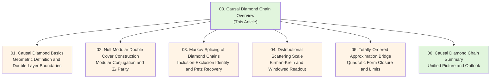
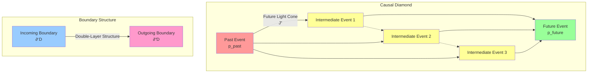
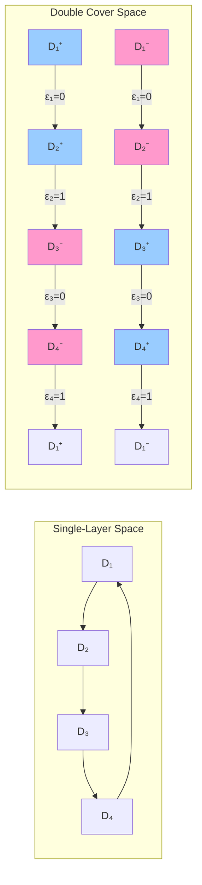
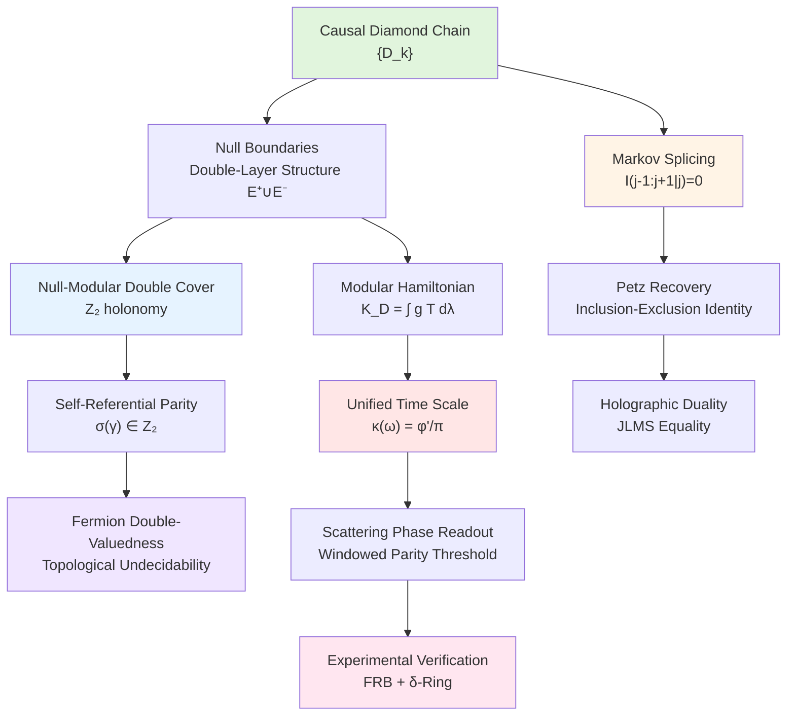

# Chapter 21: Causal Diamond Chain and Null-Modular Double Cover — Overview

## Introduction

In previous chapters, we have established unified time scale, boundary time geometry, observer theory, and experimental verification schemes. Now, we reach a new theoretical height: **Causal Diamond Chain and Null-Modular Double Cover Structure**.

Imagine observing causal events one by one, like observing a string of pearls. Each "pearl" is a **causal diamond**, containing all possible causal paths from an initial event to a final event. When these causal diamonds connect one after another, they form a **causal diamond chain**.

But that's not all. The boundary of each causal diamond actually has two layers—like the inner and outer peel of an orange. These two boundary layers are called **null boundaries**, carrying all the time, energy, and information of the system. More remarkably, there exists a symmetry relation between these two layers called **modular conjugation**, which exchanges the two layers and reverses the time direction. This is the core idea of the **Null-Modular Double Cover**.

In this chapter, we will explore:

1. Geometric structure and physical meaning of causal diamonds
2. Double-layer decomposition of null boundaries
3. Null-modular double cover and $\mathbb{Z}_2$ parity threshold
4. Markov splicing of diamond chains and inclusion-exclusion identities
5. Realization of unified time scale on causal diamond chains
6. Self-referential feedback networks and topological undecidability

### Why Are Causal Diamond Chains So Important?

Causal diamond chains are not only fundamental building blocks of spacetime geometry, but also bridges connecting three major theoretical frameworks:

**1. Unified Time Scale Theory**

In the unified time scale framework, time is not an external parameter, but defined through the equivalence relation of scattering phase derivative, spectral shift density, and group delay trace:

$$
\kappa(\omega) = \frac{\varphi'(\omega)}{\pi} = \rho_{\text{rel}}(\omega) = \frac{1}{2\pi}\text{tr}\,Q(\omega)
$$

The boundary of causal diamonds is precisely the "natural measuring instrument" for this scale—the modular Hamiltonian on the boundary directly relates to group delay, giving time increments.

**2. Quantum Information and Entanglement Structure**

The Markov property of causal diamond chains (conditional independence of adjacent diamonds) is directly related to entanglement structure:

$$
I(D_{j-1}:D_{j+1}|D_j) = 0
$$

This condition corresponds to saturation of boundary relative entropy in holographic duality, and to perfectness of Petz recovery maps in quantum information theory. The **Markov gap** caused by **non-totally-ordered cuts** quantitatively characterizes the system's "memory structure."

**3. Topological Quantum Computation and Self-Referential Structure**

The $\mathbb{Z}_2$ parity invariant introduced by null-modular double cover has deep connections with logical operations in topological quantum computation, fermion double-valuedness in self-referential feedback networks, and undecidability of the halting problem. This $\mathbb{Z}_2$ label is not artificially added, but strictly derived from the argument principle of scattering phase as a topological fingerprint.

### Chapter Structure

Let's start with the simplest question: What is a causal diamond?

---

## 1. Intuitive Picture of Causal Diamonds

### 1.1 Everyday Analogy: All Possible Paths of a Journey

Suppose you leave home at 8 AM and arrive at the office at 6 PM. During these 10 hours, you may have taken countless paths:

- Direct subway (fastest path)
- First to café, then to park, finally to office
- Detour to supermarket for shopping

All these possible paths, plus all locations you might reach along the way, form a "causal diamond"—it contains all causally reachable intermediate events between the departure event and the arrival event.

In spacetime geometry, a causal diamond is such a region:

$$
D(p_{\text{past}}, p_{\text{future}}) = J^+(p_{\text{past}}) \cap J^-(p_{\text{future}})
$$

where:
- $J^+(p_{\text{past}})$ is the set of all events reachable from past event $p_{\text{past}}$ (future light cone)
- $J^-(p_{\text{future}})$ is the set of all events that can reach future event $p_{\text{future}}$ (past light cone)
- Their intersection is the causal diamond

### 1.2 Double-Layer Structure of Null Boundaries

The boundary of a causal diamond is very special—it is **null** (zero measure). This means observers on the boundary move at light speed, with zero spacetime interval. Imagine the boundary as a "light web" woven from countless light rays.

More remarkably, this boundary actually has two layers:

$$
\widetilde{E} = E^+ \sqcup E^-
$$

- $E^+$ layer: Outgoing null hyperplane along $u=\text{constant}$
- $E^-$ layer: Incoming null hyperplane along $v=\text{constant}$

**Everyday Analogy: Inner and Outer Peel of an Orange**

- Outer peel ($E^+$): Interface where information propagates from inside the diamond outward
- Inner peel ($E^-$): Interface where information enters the diamond from outside
- The relationship between the two layers is connected by **modular conjugation** $J$: $J(E^+) = E^-$, and reverses time direction

### 1.3 Modular Hamiltonian: Energy Flow on Boundaries

On each boundary layer, there is a local energy flow density $T_{\sigma\sigma}$ ($\sigma=\pm$), telling us how energy flows along the null direction. Weighted integration of this energy flow gives the **modular Hamiltonian**:

$$
K_D = 2\pi\sum_{\sigma=\pm}\int_{E^\sigma} g_\sigma(\lambda,x_\perp) T_{\sigma\sigma}(\lambda,x_\perp)\,d\lambda\,d^{d-2}x_\perp
$$

where:
- $\lambda$ is the affine parameter (like "distance" along a light ray)
- $x_\perp$ are transverse coordinates
- $g_\sigma$ is the geometric weight function

**Physical Meaning**: The modular Hamiltonian $K_D$ characterizes the total energy and information "locked" on the causal diamond boundary. Its relation to unified time scale is:

$$
\langle K_D \rangle \sim \int \kappa(\omega)\,d\omega
$$

---

## 2. Null-Modular Double Cover: The "Square Root Branch" of the Orange

### 2.1 Why Do We Need "Double Cover"?

In classical geometry, a circle $S^1$ has only one way to draw it. But in quantum theory, when we consider the **square root of the scattering matrix**, we encounter a problem:

$$
S(\lambda) = \begin{pmatrix} e^{i\varphi(\lambda)} & \cdots \\ \cdots & \cdots \end{pmatrix}
$$

How to define $\sqrt{S(\lambda)}$?

The answer: We need to choose a **branch**. But when $\lambda$ goes around once and returns to the starting point, $\varphi(\lambda)$ may increase by $2\pi$, causing $\sqrt{S}$ to **not close**—it **flips sign** when returning to the starting point (from $+\sqrt{S}$ to $-\sqrt{S}$).

This is the origin of $\mathbb{Z}_2$ double cover: We need **two copies** of the boundary space, one corresponding to the $+$ branch, one to the $-$ branch. When traversing the diamond chain once, we may jump between the two branches, and the parity of the number of jumps is the $\mathbb{Z}_2$ holonomy.

### 2.2 Construction of Double Cover

Given a causal diamond chain $\{D_k\}_{k=1}^N$, we construct the double cover space $\widetilde{\mathfrak{D}}$:

1. For each diamond $D_k$, introduce two copies $\widetilde{D}_k^{(0)}, \widetilde{D}_k^{(1)}$
2. For each chain edge $(D_k, D_{k+1})$, define connection rules:
   - If mod-two phase increment $\epsilon_k = 0$, then $\widetilde{D}_k^{(i)} \to \widetilde{D}_{k+1}^{(i)}$ (same branch)
   - If $\epsilon_k = 1$, then $\widetilde{D}_k^{(i)} \to \widetilde{D}_{k+1}^{(1-i)}$ (branch jump)

**$\mathbb{Z}_2$ holonomy of closed loops**:

$$
\text{hol}_{\mathbb{Z}_2}(\gamma) = \sum_{k\in\gamma} \epsilon_k \mod 2
$$

- If $\text{hol}_{\mathbb{Z}_2}(\gamma) = 0$, the loop can close on the double cover
- If $\text{hol}_{\mathbb{Z}_2}(\gamma) = 1$, the loop cannot close on the double cover (flips branch once)

In this example, $\epsilon_1=0, \epsilon_2=1, \epsilon_3=0, \epsilon_4=1$, so:

$$
\text{hol}_{\mathbb{Z}_2} = (0+1+0+1) \mod 2 = 0
$$

The loop can close!

---

## 3. Markov Splicing: "Memorylessness" of Information

### 3.1 What Is Markovianity?

Imagine playing a game with rules:

- You are now in state $D_j$ (middle diamond)
- You just came from state $D_{j-1}$ (previous diamond)
- You are about to go to state $D_{j+1}$ (next diamond)

**Question**: Knowing you are now at $D_j$, do you still need information about $D_{j-1}$ to predict $D_{j+1}$?

If the answer is "no," then the system has **Markovianity**:

$$
I(D_{j-1}:D_{j+1}|D_j) = 0
$$

Here $I(A:C|B)$ is conditional mutual information, measuring "how much correlation remains between $A$ and $C$ given $B$."

### 3.2 Markov Splicing of Diamond Chains

In causal diamond chains, **totally-ordered cuts on the same null surface** guarantee Markovianity. This is because:

1. Future boundary of previous diamond $D_{j-1}$
2. Interior of current diamond $D_j$
3. Past boundary of next diamond $D_{j+1}$

These three form a "screening" relationship in causal structure—$D_j$ completely screens the influence of $D_{j-1}$ on $D_{j+1}$.

**Corresponding energy-entropy relation**:

$$
K_{D_{j-1}\cup D_j} + K_{D_j\cup D_{j+1}} - K_{D_j} - K_{D_{j-1}\cup D_j\cup D_{j+1}} = 0
$$

This is called the **inclusion-exclusion identity**, the energy version of Markovianity.

### 3.3 Non-Totally-Ordered Cuts and Markov Gap

But if the cut is not totally ordered (e.g., cut heights inconsistent at different transverse positions $x_\perp$), Markovianity is broken. We then introduce the **Markov gap line density** $\iota(v,x_\perp)$:

$$
I(D_{j-1}:D_{j+1}|D_j) = \iint \iota(v,x_\perp)\,dv\,d^{d-2}x_\perp
$$

**Physical Meaning**: The Markov gap characterizes the system's "memory depth"—if the gap is large, the system needs to remember more distant past to predict the future.

---

## 4. Distributional Scattering Scale: Windowed Readout and Parity Threshold

### 4.1 From Scattering Phase to Unified Time Scale

In scattering theory, the phase $\varphi(E) = \frac{1}{2}\arg\det S(E)$ of the unitary scattering matrix $S(E)$ is directly related to unified time scale density:

$$
\kappa(E) = \frac{\varphi'(E)}{\pi} = \rho_{\text{rel}}(E) = \frac{1}{2\pi}\text{tr}\,Q(E)
$$

where $Q(E) = -i S^\dagger \partial_E S$ is the group delay matrix.

### 4.2 Windowed Readout and Threshold Inequality

In actual measurements, we cannot integrate over the entire energy band, but use a **window function** $h_\ell(E-E_0)$ for localization:

$$
\Theta_h(\gamma) = \frac{1}{2}\int_{\mathcal{I}(\gamma)} \text{tr}\,Q(E)\,h_\ell(E-E_0)\,dE
$$

**Parity Determination Theorem**: If the windowing error

$$
\mathcal{E}_h(\gamma) \le \delta_*(\gamma) = \min\{\pi/2, \delta_{\text{gap}}(\gamma)\} - \varepsilon
$$

then the parity of windowed readout agrees with the windowless limit:

$$
\nu_{\text{chain}}(\gamma) = (-1)^{\lfloor \Theta_h(\gamma)/\pi \rfloor} = (-1)^{\lfloor \Theta_{\text{geom}}(\gamma)/\pi \rfloor}
$$

This theorem guarantees stability of $\mathbb{Z}_2$ holonomy under finite-precision measurements.

---

## 5. Unified Picture: From Geometry to Topology

Let's connect all concepts to form a complete picture:

**Core Insights**:

1. **Geometric Level**: Causal diamond chains are fundamental building blocks of spacetime, their boundaries carry all information
2. **Energy Level**: Modular Hamiltonian and unified time scale are unified through scattering phase–group delay relation
3. **Information Level**: Markov splicing guarantees locality and separability of causal structure
4. **Topological Level**: The $\mathbb{Z}_2$ holonomy introduced by null-modular double cover is the topological fingerprint of the system's self-referential structure
5. **Experimental Level**: Windowed scattering readout provides robust measurement schemes under finite precision

---

## 6. Chapter Guide

In the following sections, we will gradually deepen these concepts:

**Section 1: Causal Diamond Basics**
- Geometric definition: From Minkowski spacetime to CFT conformal image
- Precise decomposition of double-layer boundaries
- Quadratic form construction of modular Hamiltonian
- QNEC vacuum saturation and BW property

**Section 2: Null-Modular Double Cover Construction**
- Modular conjugation $J$ and modular group $\Delta^{it}$
- Square root branches and $\mathbb{Z}_2$ principal bundle
- Argument principle of scattering phase
- $\pi$-step quantization theorem

**Section 3: Markov Splicing of Diamond Chains**
- Totally-ordered cuts and inclusion-exclusion identity
- Quantitative bounds on Markov gap
- Petz recovery map and fidelity
- Half-sided modular inclusion (HSMI) algebra

**Section 4: Distributional Scattering Scale**
- Birman-Krein phase–spectral shift identity
- Wigner-Smith group delay–trace formula
- PSWF/DPSS windowed readout
- Explicit threshold for parity

**Section 5: Totally-Ordered Approximation Bridge**
- Lower bound and closure of quadratic forms
- Dominated convergence and path independence
- Toeplitz/Berezin compression
- Euler-Maclaurin and Poisson estimates

**Section 6: Causal Diamond Chain Summary**
- Integration of theoretical picture
- Interface with unified time scale
- Mapping to experimental platforms
- Open problems and future directions

---

## 7. Mathematical Toolbox for This Chapter

To understand causal diamond chain theory, we need the following mathematical tools (to be detailed in subsequent sections):

### 7.1 Geometric Tools

- **Lorentzian Geometry**: Minkowski spacetime, null hyperplanes, affine parameters
- **Conformal Geometry**: Conformal transformations, conformal images, CFT duality
- **Causal Structure**: Future/past light cones $J^\pm$, causally reachable relations

### 7.2 Operator Algebra Tools

- **Modular Theory**: Tomita-Takesaki modular group $\Delta^{it}$, modular conjugation $J$
- **Von Neumann Algebras**: Factors, KMS states, natural cone
- **Half-Sided Modular Inclusion**: Borchers triangle relation, positive energy representation

### 7.3 Information Geometry Tools

- **Quantum Relative Entropy**: $S(\rho||\sigma) = \text{tr}(\rho(\log\rho - \log\sigma))$
- **Conditional Mutual Information**: $I(A:C|B) = S_{AB} + S_{BC} - S_B - S_{ABC}$
- **Petz Recovery Map**: $\mathcal{R}(X) = \sigma^{1/2}(\sigma^{-1/2}X\sigma^{-1/2}\otimes I)\sigma^{1/2}$

### 7.4 Scattering Theory Tools

- **Scattering Matrix**: $S(E)$, phase $\varphi(E) = \frac{1}{2}\arg\det S$
- **Group Delay**: $Q(E) = -iS^\dagger\partial_E S$, $\tau_W = \text{tr}\,Q$
- **Birman-Krein Formula**: $\int \varphi'(E)h(E)\,dE = \int \text{tr}\,Q(E)h(E)\,dE$

### 7.5 Topological Tools

- **Covering Spaces**: Fiber bundles, branch points, holonomy
- **Cohomology Theory**: Relative cohomology $H^2(Y,\partial Y;\mathbb{Z}_2)$
- **Characteristic Classes**: Stiefel-Whitney class $w_2$, Chern class $c_1$

These tools will run through the entire Chapter 21, and we will provide detailed mathematical definitions and physical interpretations when needed.

---

## 8. Connections with Previous Chapters

Causal diamond chain theory is the "keystone" of the entire unified framework, organically integrating concepts from previous chapters:

| Previous Chapter Concept | Manifestation in Causal Diamond Chain | Section |
|--------------------------|--------------------------------------|---------|
| Unified time scale $\kappa(\omega)$ | Modular Hamiltonian $K_D$ and group delay $\text{tr}\,Q$ | §4 |
| Boundary time geometry | Double-layer decomposition of null boundaries $\widetilde{E} = E^+\sqcup E^-$ | §1 |
| Scattering–phase–frequency metrology | Birman-Krein formula and windowed readout | §4 |
| Observer world section | Causal diamond as observer's "horizon" | §3 |
| Self-referential scattering network | $\mathbb{Z}_2$ holonomy of null-modular double cover | §2 |
| $\pi$-step quantization | Mod-two phase increment $\epsilon_k \in \mathbb{Z}_2$ | §2 |
| PSWF/DPSS windowing | Error control of parity threshold | §4 |
| Topological fingerprint measurement | Holonomy readout of closed loops | §2, §6 |

Causal diamond chains are the **common implementation platform** for these concepts:

- On the **geometric side**, they are fundamental building blocks of spacetime
- On the **information side**, they are metric units of entanglement structure
- On the **topological side**, they are carriers of self-referential parity
- On the **experimental side**, they are measurement protocols for unified time scale

---

## Summary

In this chapter's introduction, we have established the basic picture of causal diamond chain and null-modular double cover theory:

1. **Causal diamond** is the set of all causally reachable intermediate events between a past event and a future event
2. **Null boundaries** have double-layer structure $\widetilde{E} = E^+\sqcup E^-$, the two layers connected by modular conjugation $J$
3. **Modular Hamiltonian** $K_D$ characterizes energy flow on boundaries, related to unified time scale density $\kappa(\omega)$
4. **Null-modular double cover** introduces $\mathbb{Z}_2$ topological invariant, corresponding to square root branches of scattering phase
5. **Markov splicing** characterizes conditional independence of adjacent diamonds, corresponding to inclusion-exclusion identity
6. **Windowed scattering readout** provides parity threshold determination under finite precision

In the following sections, we will rigorize these intuitive pictures into mathematical theorems and demonstrate their experimental measurability.

Let's begin delving into the geometric foundations of causal diamonds!

---

## References

This chapter is mainly based on the following theoretical literature:

1. **Null-Modular Double Cover and Overlapping Causal Diamond Chain** - `euler-gls-extend/null-modular-double-cover-causal-diamond-chain.md`
2. **Causal Small Diamond Chain in Computational Universe** - `euler-gls-info/14-causal-diamond-chain-null-modular-double-cover.md`
3. **Unified Time Scale Theory** - Chapter 5 unified-time/
4. **Boundary Time Geometry** - Chapter 6 boundary-theory/
5. **Self-Referential Scattering Network** - Chapter 18 self-reference-topology/
6. **Spectral Windowing Techniques** - Chapter 20 experimental-tests/

Detailed derivations of these theories will be gradually developed in subsequent sections.

