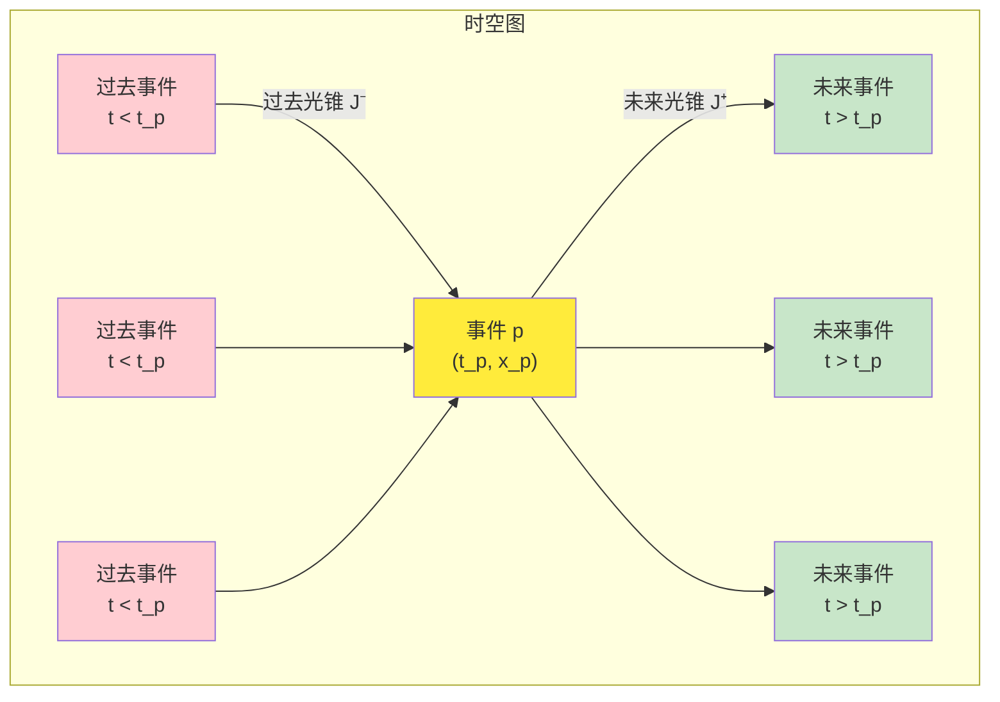
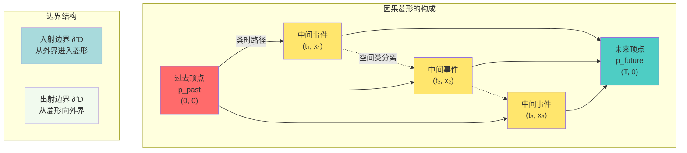
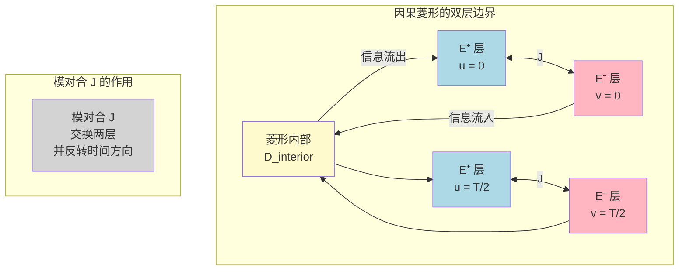
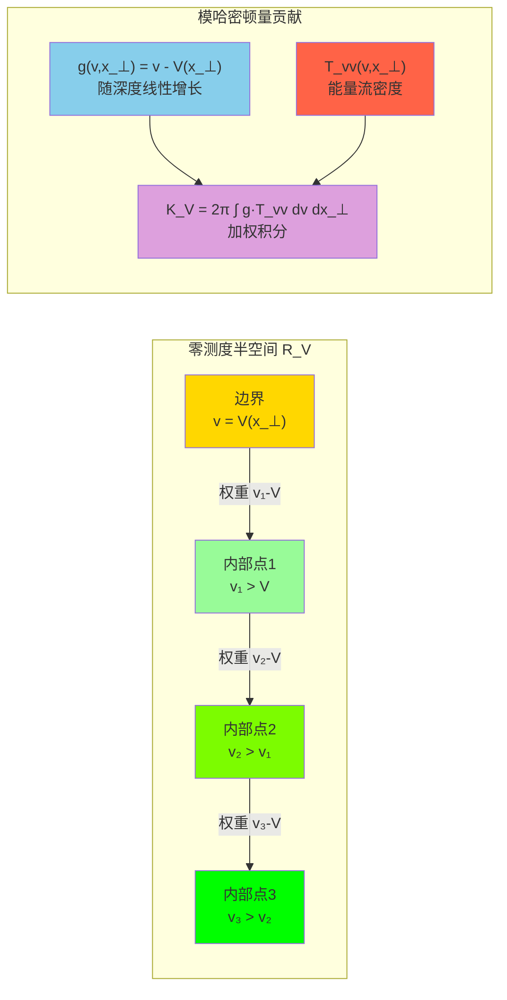

# 第21章第1节 因果菱形的几何基础

## 引言

在上一节的概览中，我们建立了因果菱形链与零模双覆盖理论的整体图景。现在，让我们深入第一个核心概念：**因果菱形的几何基础**。

想象你站在一个十字路口，看着红绿灯从红变绿。在这短短几秒钟内，从红灯亮起到绿灯亮起之间发生的所有可能事件，就形成了一个"因果菱形"。它包含了：

- 你可能看到的行人
- 可能经过的车辆
- 光线的传播路径
- 声音的传递轨迹

所有这些事件都被**因果关系**约束在一个有限的时空区域内——这就是因果菱形。

在本节中，我们将严格定义因果菱形的几何结构，并揭示它与统一时间刻度、边界时间几何、量子纠缠的深刻联系。

---

## 1. 闵氏时空中的因果结构

### 1.1 未来光锥与过去光锥

在狭义相对论的闵氏时空 $\mathbb{R}^{1,d-1}$ 中（$d\geq 2$，通常 $d=4$），度规为：

$$
ds^2 = -dt^2 + dx_1^2 + \cdots + dx_{d-1}^2
$$

对任意事件 $p\in\mathbb{R}^{1,d-1}$，定义：

**未来光锥**（future light cone）：

$$
J^+(p) = \{q : (q-p)^2 \leq 0,\ t_q \geq t_p\}
$$

**过去光锥**（past light cone）：

$$
J^-(p) = \{q : (q-p)^2 \leq 0,\ t_q \leq t_p\}
$$

其中 $(q-p)^2$ 是时空间隔的平方，负号表示类时或类光分离。

**日常类比：光的传播范围**

- 从 $p$ 点发出的光在时刻 $t$ 能到达的所有地点构成未来光锥
- 能在时刻 $t_p$ 到达 $p$ 点的所有光源位置构成过去光锥

### 1.2 因果菱形的定义

给定两个事件 $p_{\text{past}}, p_{\text{future}}$ 满足 $p_{\text{past}} \in J^-(p_{\text{future}})$（即 $p_{\text{past}}$ 在 $p_{\text{future}}$ 的过去光锥内），定义：

$$
D(p_{\text{past}}, p_{\text{future}}) = J^+(p_{\text{past}}) \cap J^-(p_{\text{future}})
$$

这就是**因果菱形**（causal diamond），也称为**因果钻石**或**亚历山德罗夫集**（Alexandrov set）。

**几何直观**：

- $J^+(p_{\text{past}})$：从 $p_{\text{past}}$ 出发能到达的所有事件
- $J^-(p_{\text{future}})$：能到达 $p_{\text{future}}$ 的所有事件
- 交集 $D$：既从 $p_{\text{past}}$ 出发可达，又能到达 $p_{\text{future}}$ 的所有中间事件

### 1.3 特例：球形与劈形因果菱形

在 $d$ 维闵氏时空中，最简单的两类因果菱形是：

**（1）球形因果菱形**（spherical causal diamond）

取 $p_{\text{past}} = (0, \vec{0})$，$p_{\text{future}} = (T, \vec{0})$，则：

$$
D_{\text{sphere}}(T) = \{(t, \vec{x}) : |\vec{x}| \leq t,\ |\vec{x}| \leq T-t,\ 0\leq t\leq T\}
$$

这是一个以原点为中心、"高度"为 $T$ 的双锥结构。

**（2）劈形因果菱形**（wedge causal diamond）

取半空间 $\{x_1 \geq 0\}$ 中的 Rindler 劈形：

$$
W = \{(t,x_1,\vec{x}_\perp) : |t| < x_1,\ x_1 > 0\}
$$

劈形是"无限延伸"的因果菱形，它与加速观测者的视界密切相关。

---

## 2. 零测度边界的双层分解

### 2.1 什么是"零测度边界"？

因果菱形的边界 $\partial D$ 非常特殊——它由**类光超平面**（null hypersurface）组成。类光超平面上的任意两点之间的时空间隔为零，即：

$$
ds^2|_{\partial D} = 0
$$

这意味着边界上的观测者以**光速运动**，他们的"固有时间"为零。因此，边界被称为**零测度边界**（null boundary）。

**日常类比：光的世界线**

想象一束光从过去顶点发出，沿着边界传播到未来顶点。对这束光来说，整个旅程的"自己的时间"为零——这就是"零测度"的含义。

### 2.2 双层结构 $\widetilde{E} = E^+ \sqcup E^-$

零测度边界实际上有**两层**：

$$
\widetilde{E} = E^+ \sqcup E^-
$$

其中：

- $E^+$：**出射层**（outgoing null surface），沿 $u=\text{const}$ 的类光超平面
- $E^-$：**入射层**（ingoing null surface），沿 $v=\text{const}$ 的类光超平面

这里 $(u,v)$ 是**null坐标**（null coordinates）：

$$
u = t - r, \quad v = t + r
$$

其中 $r = |\vec{x}|$ 是空间径向坐标。

**双层分解的物理意义**：

**关键洞察**：

1. $E^+$ 层是信息**离开**菱形的界面
2. $E^-$ 层是信息**进入**菱形的界面
3. 两层通过**模对合** $J$ 相互关联：$J(E^+) = E^-$
4. 模对合不仅交换两层，还**反转时间方向**

### 2.3 仿射参数与横向坐标

在每一层边界上，我们引入坐标：

$$
(\lambda, x_\perp) \in \mathbb{R}^+ \times \mathbb{R}^{d-2}
$$

其中：

- $\lambda$：**仿射参数**（affine parameter），类似于"沿光线的距离"
- $x_\perp = (x_2, \ldots, x_{d-1})$：**横向坐标**（transverse coordinates）

**例子：球形菱形的边界坐标**

对球形因果菱形 $D_{\text{sphere}}(T)$，出射层 $E^+$ 可参数化为：

$$
E^+ : \quad (t, r, \Omega) = (\lambda, \lambda, \Omega), \quad \lambda \in [0, T/2], \quad \Omega \in S^{d-2}
$$

其中 $\Omega$ 是 $(d-2)$ 维球面上的角坐标（横向坐标）。

---

## 3. 模哈密顿量：边界上的能量守恒

### 3.1 能量-动量张量的null分量

在量子场论中，能量-动量张量 $T_{ab}$ 刻画能量、动量和应力的分布。在null边界上，最重要的是**null-null分量**：

$$
T_{++} = T_{vv}, \quad T_{--} = T_{uu}
$$

它们刻画沿null方向的能量流密度。

**物理意义**：

- $T_{++}(\lambda, x_\perp)$：沿出射null方向 $\partial_v$ 的能量流
- $T_{--}(\lambda, x_\perp)$：沿入射null方向 $\partial_u$ 的能量流

### 3.2 模哈密顿量的几何分解

给定因果菱形 $D$，定义**模哈密顿量**（modular Hamiltonian）：

$$
K_D = 2\pi \sum_{\sigma=\pm} \int_{E^\sigma} g_\sigma(\lambda, x_\perp) T_{\sigma\sigma}(\lambda, x_\perp)\,d\lambda\,d^{d-2}x_\perp
$$

其中：

- $\sigma=+$ 对应出射层 $E^+$，$\sigma=-$ 对应入射层 $E^-$
- $g_\sigma(\lambda, x_\perp)$ 是**几何权重函数**
- 积分测度 $d\lambda\,d^{d-2}x_\perp$ 是边界上的标准测度

**定理（双层几何分解，CFT中的精确等式）**：

在共形场论（CFT）中，球形因果菱形的几何权重函数为：

$$
g_\sigma(\lambda) = \lambda(1 - \lambda/T)
$$

满足边界条件：$g_\sigma(0) = g_\sigma(T) = 0$。

**日常类比：边界能量的加权积分**

想象边界是一层薄膜，每一点都有能量流密度 $T_{\sigma\sigma}$。模哈密顿量就是对这个能量流进行**加权积分**，权重 $g_\sigma$ 反映了几何因素（比如距离顶点的"路程"）。

### 3.3 模哈密顿量与统一时间刻度的关联

回顾统一时间刻度母式：

$$
\kappa(\omega) = \frac{\varphi'(\omega)}{\pi} = \rho_{\text{rel}}(\omega) = \frac{1}{2\pi}\text{tr}\,Q(\omega)
$$

模哈密顿量 $K_D$ 与统一时间刻度密度 $\kappa(\omega)$ 的关联由**Wigner-Smith群延迟公式**给出：

$$
\langle K_D \rangle \sim \int_{\Omega_D} \kappa(\omega)\,\rho(\omega)\,d\omega
$$

其中 $\Omega_D$ 是因果菱形 $D$ 对应的频率窗口，$\rho(\omega)$ 是态密度。

**物理意义**：

- 模哈密顿量是边界上"锁住"的时间–能量总量
- 统一时间刻度密度是频域的时间流密度
- 两者通过散射相位–群延迟关系统一

---

## 4. 二次型框架与自然域

### 4.1 什么是"二次型"？

在量子力学中，可观测量对应厄米算子 $A$，其期望值为：

$$
\langle A \rangle_\psi = \langle \psi | A | \psi \rangle
$$

当 $A$ 不是有界算子时，上式并非对所有态 $|\psi\rangle$ 都有定义。我们需要引入**二次型**（quadratic form）的框架。

**定义**：二次型 $\mathfrak{k}$ 是一个映射：

$$
\mathfrak{k} : \mathcal{D}(\mathfrak{k}) \to \mathbb{R}, \quad \mathfrak{k}[\psi] = \langle \psi | K | \psi \rangle
$$

其中 $\mathcal{D}(\mathfrak{k})$ 是**形式域**（form domain），是全部希尔伯特空间 $\mathcal{H}$ 的稠密子空间。

### 4.2 模哈密顿量的二次型定义

对因果菱形 $D$，模哈密顿量的二次型为：

$$
\mathfrak{k}_D[\psi] = 2\pi \sum_{\sigma=\pm} \int_{E^\sigma} g_\sigma(\lambda, x_\perp) \langle \psi | T_{\sigma\sigma}(\lambda, x_\perp) | \psi \rangle\,d\lambda\,d^{d-2}x_\perp
$$

**假设（二次型下半界）**：

存在实数 $a_D \in \mathbb{R}$ 使得对所有 $|\psi\rangle \in \mathcal{D}(\mathfrak{k}_D)$：

$$
\mathfrak{k}_D[\psi] \geq a_D \|\psi\|^2
$$

这保证了模哈密顿量 $K_D$ 是下半有界的自伴算子。

### 4.3 移位图范数与完备性

为了讨论二次型的闭性，引入**移位图范数**（shifted graph norm）：

对任意 $c_D > -a_D$，定义：

$$
\|\psi\|_{\mathfrak{k}_D, c_D}^2 := \|\psi\|^2 + \big(\mathfrak{k}_D[\psi] + c_D \|\psi\|^2\big)
$$

**定理（形式域的完备性）**：

配备移位图范数 $\|\cdot\|_{\mathfrak{k}_D, c_D}$ 的形式域 $\mathcal{D}(\mathfrak{k}_D)$ 是完备的希尔伯特空间。

**物理意义**：

- 移位图范数同时控制态的"大小" $\|\psi\|^2$ 和"模能量" $\mathfrak{k}_D[\psi]$
- 完备性保证极限态仍在形式域内，这对定义容斥恒等式的闭性至关重要

---

## 5. 零测度局域化与QNEC真空饱和

### 5.1 QNEC（Quantum Null Energy Condition）

QNEC是一个关于能量密度的不等式，它在真空态下对null超平面成立。

**QNEC不等式**：

对零测度半空间 $R_V = \{u=0, v\geq V(x_\perp)\}$（其中 $V\in C^2$ 是光滑函数），有：

$$
\langle T_{vv}(v, x_\perp) \rangle \geq \frac{1}{4\pi} \frac{\partial^2 S_{\text{gen}}(R_V)}{\partial V^2}
$$

其中 $S_{\text{gen}}$ 是广义熵（包含量子纠缠熵和经典面积项）。

**真空饱和**：

在真空态 $|\Omega\rangle$ 中，QNEC取等号：

$$
\langle \Omega | T_{vv} | \Omega \rangle = \frac{1}{4\pi} \frac{\partial^2 S_{\text{vac}}}{\partial V^2}
$$

这一关系使得模哈密顿量可以精确表示为边界上的二次型积分。

### 5.2 零测度半空间的模哈密顿量

对零测度半空间 $R_V$，模哈密顿量的显式形式为：

$$
K_V = 2\pi \int d^{d-2}x_\perp \int_{V(x_\perp)}^\infty (v - V(x_\perp)) T_{vv}(v, x_\perp)\,dv
$$

**几何解释**：

- 权重 $(v - V(x_\perp))$ 表示距离边界 $v=V(x_\perp)$ 的"深度"
- 越深入区域内部，权重越大，对模哈密顿量的贡献越大

### 5.3 Bisognano-Wichmann性质

在量子场论中，**Bisognano-Wichmann性质**（BW性质）是因果菱形模理论的基石。

**BW性质（Rindler劈形）**：

对Rindler劈形 $W = \{|t| < x_1, x_1 > 0\}$，其模群 $\Delta_W^{it}$ 几何化为洛伦兹推变：

$$
\Delta_W^{it} \cdot (t, x_1, \vec{x}_\perp) = (e^{2\pi t}t, e^{2\pi t}x_1, \vec{x}_\perp)
$$

模对合 $J_W$ 对应反射 $t \to -t$ 加上CPT变换。

**物理意义**：

- 模群 $\Delta^{it}$ 描述系统在"模时间"$t$ 下的演化
- BW性质说明这种演化对应于**加速度**（boost）
- 这联系了量子纠缠与时空几何的深层统一

---

## 6. 共形场论中的精确结果

### 6.1 共形变换与共形像

在共形场论（CFT）中，因果菱形在共形变换下被映射到更简单的几何形状。

**共形变换**：

二维CFT中，共形变换由解析映射 $z\to w(z)$ 给出。在 $d>2$ 维，共形变换保持度规的形式：

$$
g_{ab} \to \Omega^2(x) g_{ab}
$$

其中 $\Omega(x)$ 是正的局部因子（称为Weyl因子）。

**例子：球形菱形的共形像**

在 $\mathbb{R}^{1,d-1}$ 中的球形因果菱形可以共形映射到**双曲空间** $\mathbb{H}^{d-1}$ 上的静态patch。此时，度规变为：

$$
ds^2 = -d\tau^2 + \sinh^2\tau\,d\Omega_{d-2}^2
$$

模哈密顿量在这一共形像中具有简单的形式。

### 6.2 CFT中的模哈密顿量

在二维CFT中，球形菱形（区间）$I=[u_1, u_2]\times[v_1, v_2]$ 的模哈密顿量为：

$$
K_I = \int_{I} \frac{(u-u_1)(u_2-u)}{u_2-u_1} T_{uu} + \frac{(v-v_1)(v_2-v)}{v_2-v_1} T_{vv}
$$

权重函数恰好是：

$$
g_+(u) = \frac{(u-u_1)(u_2-u)}{u_2-u_1}, \quad g_-(v) = \frac{(v-v_1)(v_2-v)}{v_2-v_1}
$$

**边界条件**：

- $g_+(u_1) = g_+(u_2) = 0$（边界端点权重为零）
- 权重在区间中点达到最大值：$g_+\big(\frac{u_1+u_2}{2}\big) = \frac{u_2-u_1}{4}$

### 6.3 CFT中的纠缠熵公式

在CFT中，球形菱形的纠缠熵有显式公式。二维CFT的结果为：

$$
S_I = \frac{c}{3}\log\frac{L}{\epsilon}
$$

其中：
- $c$ 是中心荷（central charge）
- $L$ 是区间长度
- $\epsilon$ 是短距离截断（正则化参数）

更高维CFT的结果涉及面积律：

$$
S_D = \frac{\text{Area}(\partial D)}{4G} + S_{\text{quantum}}
$$

其中第一项是经典Bekenstein-Hawking熵，第二项是量子修正。

---

## 7. 全序近似桥接：从一般菱形到半空间

### 7.1 为什么需要"近似"？

一般的因果菱形 $D$ 可能具有复杂的边界形状。为了严格定义其模哈密顿量，我们采用**全序近似桥接**的方法：

1. 用一族**零测度半空间** $\{R_{V_\alpha}^\pm\}_{\alpha}$ 逼近 $D$
2. 每个半空间的模哈密顿量 $K_{V_\alpha}$ 已由QNEC给出
3. 在极限 $\alpha\to\infty$ 下恢复 $K_D$

### 7.2 单调近似族的构造

**定义（单调近似族）**：

对每个横向坐标 $x_\perp$，构造单调函数族：

$$
V_\alpha^+(x_\perp) \downarrow V^+(x_\perp), \quad V_\alpha^-(x_\perp) \uparrow V^-(x_\perp)
$$

使得：

- $R_{V_\alpha^+} \supset R_{V_{\alpha+1}^+}$（单调收缩）
- $R_{V_\alpha^-} \subset R_{V_{\alpha+1}^-}$（单调扩张）
- $\lim_{\alpha\to\infty} R_{V_\alpha^\pm} = E^\pm$（极限等于菱形边界）

**日常类比：用阶梯近似曲线**

想象你要画一条光滑曲线，但只能用水平线段。你可以用越来越多、越来越短的线段来逼近曲线。全序近似桥接就是这个思想在时空几何中的应用。

### 7.3 主控收敛与路径无关性

**假设（null能流一致可积）**：

对任意 $|\psi\rangle \in \mathcal{D}_0$ 和几何上有界的单调近似族 $\{R_{V_\alpha}^\pm\}$，存在 $H_\sigma \in L^1_{\text{loc}}(E^\sigma \times \mathbb{R}^{d-2})$ 使得：

$$
\big|g_\sigma^{(\alpha)}(\lambda, x_\perp) \langle \psi | T_{\sigma\sigma}(\lambda, x_\perp) | \psi \rangle\big| \leq H_\sigma(\lambda, x_\perp)
$$

几乎处处成立，且：

$$
\sup_\alpha \int_{\mathcal{K}} H_\sigma < \infty
$$

对任意紧集 $\mathcal{K} \subset E^\sigma \times \mathbb{R}^{d-2}$。

**定理（全序近似桥接引理）**：

在上述假设下，存在单调半空间族 $\{R_{V_\alpha}^\pm\}$ 使得：

$$
\langle \psi | K_D | \psi \rangle = \lim_{\alpha\to\infty} \sum_{\sigma=\pm} 2\pi \int_{E^\sigma} g_\sigma^{(\alpha)} \langle \psi | T_{\sigma\sigma} | \psi \rangle
$$

且极限与选取的有序逼近**无关**。

**证明思路**：

1. 主控收敛定理保证逐点极限存在
2. 二次型闭性保证极限在形式域上连续
3. 几何单调性保证极限与路径无关

---

## 8. 与统一时间刻度的接口

### 8.1 散射相位–模哈密顿量对应

在散射理论框架中，模哈密顿量与散射矩阵的相位增量相关联。

**Birman-Krein公式**：

$$
\int \frac{\partial}{\partial E} \arg\det S(E)\,h(E)\,dE = -2\pi \int \xi'(E)\,h(E)\,dE
$$

其中 $\xi(E)$ 是**谱移函数**（spectral shift function），与态密度差相关。

结合Wigner-Smith公式：

$$
\text{tr}\,Q(E) = -i\,\text{tr}(S^\dagger \partial_E S) = 2\pi\,\xi'(E)
$$

我们得到统一时间刻度密度：

$$
\kappa(E) = \frac{1}{2\pi}\text{tr}\,Q(E) = \xi'(E)
$$

### 8.2 频域–时域对应

通过傅里叶变换，频域的统一时间刻度密度 $\kappa(\omega)$ 对应时域的"局域时间流"：

$$
\tau(t) = \int_{-\infty}^t \int \kappa(\omega) e^{-i\omega s}\,d\omega\,ds
$$

模哈密顿量 $K_D$ 可视为在因果菱形 $D$ 内"积累"的总时间–能量：

$$
\langle K_D \rangle \sim \int_{\Omega_D} \kappa(\omega)\,\rho_D(\omega)\,d\omega
$$

其中 $\rho_D(\omega)$ 是菱形内的态密度。

---

## 小结

在本节中，我们建立了因果菱形的严格几何基础：

1. **因果菱形定义**：$D(p_{\text{past}}, p_{\text{future}}) = J^+(p_{\text{past}}) \cap J^-(p_{\text{future}})$
2. **零测度边界双层分解**：$\widetilde{E} = E^+ \sqcup E^-$，两层由模对合 $J$ 联系
3. **模哈密顿量**：$K_D = 2\pi\sum_{\sigma=\pm}\int g_\sigma T_{\sigma\sigma}\,d\lambda\,dx_\perp$
4. **二次型框架**：通过移位图范数保证形式域完备性
5. **QNEC真空饱和**：零测度半空间的模哈密顿量精确公式
6. **全序近似桥接**：从半空间单调逼近到一般菱形
7. **统一时间刻度接口**：模哈密顿量与散射相位–群延迟的对应

在下一节中，我们将构造**零模双覆盖**，引入 $\mathbb{Z}_2$ 奇偶不变量，并揭示其与自指散射网络、费米子双值性的深刻联系。

---

## 参考文献

本节主要基于以下理论文献：

1. **Null-Modular双覆盖理论** - `euler-gls-extend/null-modular-double-cover-causal-diamond-chain.md`，§2.1-2.3, §3.1-3.2
2. **Bisognano-Wichmann定理** - 经典量子场论文献
3. **QNEC与模理论** - Faulkner et al. (2016), Casini-Teste-Torroba (2017)
4. **统一时间刻度** - 第5章 unified-time/，特别是散射相位–群延迟同一
5. **边界时间几何** - 第6章 boundary-theory/，零测度边界结构
6. **共形场论** - CFT经典教材，纠缠熵与模哈密顿量

下一节我们将深入**零模双覆盖的构造**与 $\mathbb{Z}_2$ holonomy的拓扑结构。
