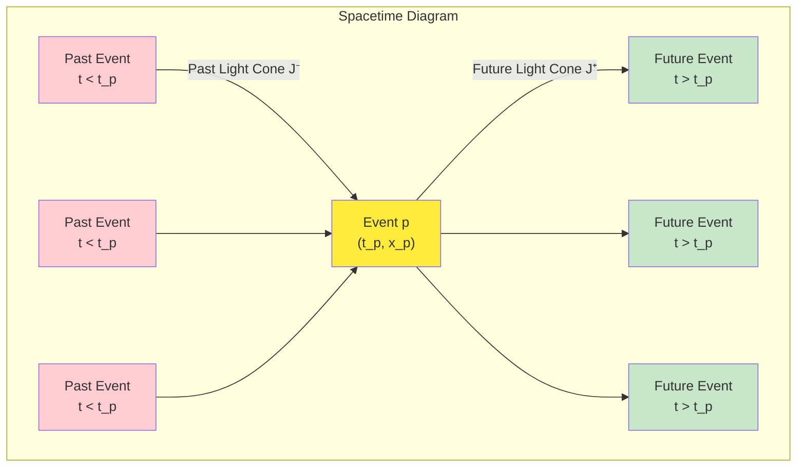
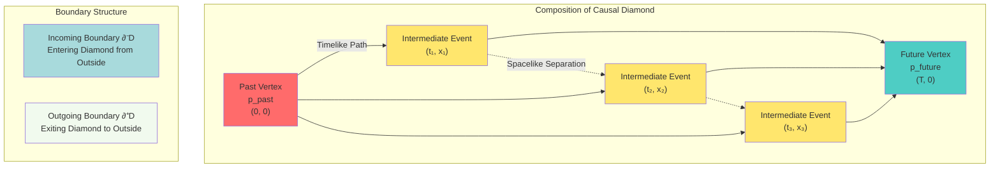
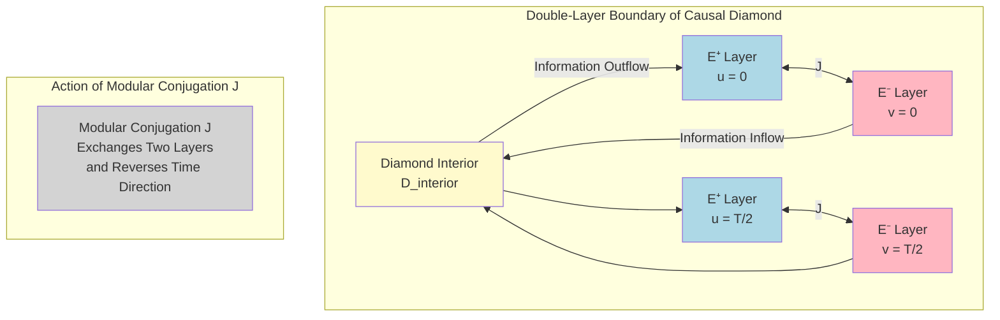
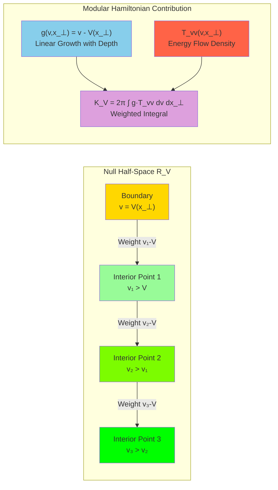

# Chapter 21 Section 1: Geometric Foundations of Causal Diamonds

## Introduction

In the overview of the previous section, we established the overall picture of causal diamond chain and null-modular double cover theory. Now, let's delve into the first core concept: **Geometric Foundations of Causal Diamonds**.

Imagine standing at a crossroads, watching the traffic light change from red to green. In those few seconds, all possible events between the red light turning on and the green light turning on form a "causal diamond." It contains:

- Pedestrians you might see
- Vehicles that might pass
- Light propagation paths
- Sound transmission trajectories

All these events are constrained by **causal relations** within a finite spacetime region—this is the causal diamond.

In this section, we will rigorously define the geometric structure of causal diamonds and reveal their deep connections with unified time scale, boundary time geometry, and quantum entanglement.

---

## 1. Causal Structure in Minkowski Spacetime

### 1.1 Future Light Cone and Past Light Cone

In Minkowski spacetime $\mathbb{R}^{1,d-1}$ of special relativity ($d\geq 2$, typically $d=4$), the metric is:

$$
ds^2 = -dt^2 + dx_1^2 + \cdots + dx_{d-1}^2
$$

For any event $p\in\mathbb{R}^{1,d-1}$, define:

**Future light cone**:

$$
J^+(p) = \{q : (q-p)^2 \leq 0,\ t_q \geq t_p\}
$$

**Past light cone**:

$$
J^-(p) = \{q : (q-p)^2 \leq 0,\ t_q \leq t_p\}
$$

where $(q-p)^2$ is the square of spacetime interval, with negative sign indicating timelike or null separation.

**Everyday Analogy: Range of Light Propagation**

- All locations that light emitted from point $p$ can reach at time $t$ form the future light cone
- All source positions that can reach point $p$ at time $t_p$ form the past light cone

### 1.2 Definition of Causal Diamond

Given two events $p_{\text{past}}, p_{\text{future}}$ satisfying $p_{\text{past}} \in J^-(p_{\text{future}})$ (i.e., $p_{\text{past}}$ is in the past light cone of $p_{\text{future}}$), define:

$$
D(p_{\text{past}}, p_{\text{future}}) = J^+(p_{\text{past}}) \cap J^-(p_{\text{future}})
$$

This is the **causal diamond**, also called **causal diamond** or **Alexandrov set**.

**Geometric Intuition**:

- $J^+(p_{\text{past}})$: All events reachable from $p_{\text{past}}$
- $J^-(p_{\text{future}})$: All events that can reach $p_{\text{future}}$
- Intersection $D$: All intermediate events that are both reachable from $p_{\text{past}}$ and can reach $p_{\text{future}}$

### 1.3 Special Cases: Spherical and Wedge Causal Diamonds

In $d$-dimensional Minkowski spacetime, the two simplest types of causal diamonds are:

**(1) Spherical Causal Diamond**

Take $p_{\text{past}} = (0, \vec{0})$, $p_{\text{future}} = (T, \vec{0})$, then:

$$
D_{\text{sphere}}(T) = \{(t, \vec{x}) : |\vec{x}| \leq t,\ |\vec{x}| \leq T-t,\ 0\leq t\leq T\}
$$

This is a double-cone structure centered at the origin with "height" $T$.

**(2) Wedge Causal Diamond**

Take the Rindler wedge in half-space $\{x_1 \geq 0\}$:

$$
W = \{(t,x_1,\vec{x}_\perp) : |t| < x_1,\ x_1 > 0\}
$$

The wedge is an "infinitely extended" causal diamond, closely related to the horizon of accelerated observers.

---

## 2. Double-Layer Decomposition of Null Boundaries

### 2.1 What Is a "Null Boundary"?

The boundary $\partial D$ of a causal diamond is very special—it consists of **null hypersurfaces**. The spacetime interval between any two points on a null hypersurface is zero, i.e.:

$$
ds^2|_{\partial D} = 0
$$

This means observers on the boundary move at **light speed**, their "proper time" is zero. Therefore, the boundary is called a **null boundary**.

**Everyday Analogy: Worldline of Light**

Imagine a beam of light emitted from the past vertex, propagating along the boundary to the future vertex. For this beam of light, the "own time" of the entire journey is zero—this is the meaning of "null."

### 2.2 Double-Layer Structure $\widetilde{E} = E^+ \sqcup E^-$

The null boundary actually has **two layers**:

$$
\widetilde{E} = E^+ \sqcup E^-
$$

where:

- $E^+$: **Outgoing layer** (outgoing null surface), null hyperplane along $u=\text{const}$
- $E^-$: **Incoming layer** (ingoing null surface), null hyperplane along $v=\text{const}$

Here $(u,v)$ are **null coordinates**:

$$
u = t - r, \quad v = t + r
$$

where $r = |\vec{x}|$ is the spatial radial coordinate.

**Physical Meaning of Double-Layer Decomposition**:

**Key Insights**:

1. $E^+$ layer is the interface where information **leaves** the diamond
2. $E^-$ layer is the interface where information **enters** the diamond
3. The two layers are related by **modular conjugation** $J$: $J(E^+) = E^-$
4. Modular conjugation not only exchanges the two layers but also **reverses time direction**

### 2.3 Affine Parameters and Transverse Coordinates

On each boundary layer, we introduce coordinates:

$$
(\lambda, x_\perp) \in \mathbb{R}^+ \times \mathbb{R}^{d-2}
$$

where:

- $\lambda$: **Affine parameter**, like "distance along a light ray"
- $x_\perp = (x_2, \ldots, x_{d-1})$: **Transverse coordinates**

**Example: Boundary Coordinates of Spherical Diamond**

For spherical causal diamond $D_{\text{sphere}}(T)$, the outgoing layer $E^+$ can be parameterized as:

$$
E^+ : \quad (t, r, \Omega) = (\lambda, \lambda, \Omega), \quad \lambda \in [0, T/2], \quad \Omega \in S^{d-2}
$$

where $\Omega$ are angular coordinates (transverse coordinates) on the $(d-2)$-dimensional sphere.

---

## 3. Modular Hamiltonian: Energy Conservation on Boundaries

### 3.1 Null Components of Energy-Momentum Tensor

In quantum field theory, the energy-momentum tensor $T_{ab}$ characterizes the distribution of energy, momentum, and stress. On null boundaries, the most important are the **null-null components**:

$$
T_{++} = T_{vv}, \quad T_{--} = T_{uu}
$$

They characterize energy flow density along null directions.

**Physical Meaning**:

- $T_{++}(\lambda, x_\perp)$: Energy flow along outgoing null direction $\partial_v$
- $T_{--}(\lambda, x_\perp)$: Energy flow along incoming null direction $\partial_u$

### 3.2 Geometric Decomposition of Modular Hamiltonian

Given causal diamond $D$, define the **modular Hamiltonian**:

$$
K_D = 2\pi \sum_{\sigma=\pm} \int_{E^\sigma} g_\sigma(\lambda, x_\perp) T_{\sigma\sigma}(\lambda, x_\perp)\,d\lambda\,d^{d-2}x_\perp
$$

where:

- $\sigma=+$ corresponds to outgoing layer $E^+$, $\sigma=-$ to incoming layer $E^-$
- $g_\sigma(\lambda, x_\perp)$ is the **geometric weight function**
- Integration measure $d\lambda\,d^{d-2}x_\perp$ is the standard measure on the boundary

**Theorem (Double-Layer Geometric Decomposition, Exact Equality in CFT)**:

In conformal field theory (CFT), the geometric weight function for spherical causal diamond is:

$$
g_\sigma(\lambda) = \lambda(1 - \lambda/T)
$$

satisfying boundary conditions: $g_\sigma(0) = g_\sigma(T) = 0$.

**Everyday Analogy: Weighted Integral of Boundary Energy**

Imagine the boundary as a thin film, with energy flow density $T_{\sigma\sigma}$ at each point. The modular Hamiltonian is a **weighted integral** of this energy flow, where the weight $g_\sigma$ reflects geometric factors (such as "distance" from the vertex).

### 3.3 Connection Between Modular Hamiltonian and Unified Time Scale

Recall the unified time scale master formula:

$$
\kappa(\omega) = \frac{\varphi'(\omega)}{\pi} = \rho_{\text{rel}}(\omega) = \frac{1}{2\pi}\text{tr}\,Q(\omega)
$$

The connection between modular Hamiltonian $K_D$ and unified time scale density $\kappa(\omega)$ is given by the **Wigner-Smith group delay formula**:

$$
\langle K_D \rangle \sim \int_{\Omega_D} \kappa(\omega)\,\rho(\omega)\,d\omega
$$

where $\Omega_D$ is the frequency window corresponding to causal diamond $D$, and $\rho(\omega)$ is the density of states.

**Physical Meaning**:

- Modular Hamiltonian is the total time-energy "locked" on the boundary
- Unified time scale density is the time flow density in frequency domain
- The two are unified through scattering phase–group delay relation

---

## 4. Quadratic Form Framework and Natural Domain

### 4.1 What Is a "Quadratic Form"?

In quantum mechanics, observables correspond to Hermitian operators $A$, with expectation values:

$$
\langle A \rangle_\psi = \langle \psi | A | \psi \rangle
$$

When $A$ is not a bounded operator, the above is not defined for all states $|\psi\rangle$. We need to introduce the framework of **quadratic forms**.

**Definition**: A quadratic form $\mathfrak{k}$ is a mapping:

$$
\mathfrak{k} : \mathcal{D}(\mathfrak{k}) \to \mathbb{R}, \quad \mathfrak{k}[\psi] = \langle \psi | K | \psi \rangle
$$

where $\mathcal{D}(\mathfrak{k})$ is the **form domain**, a dense subspace of the full Hilbert space $\mathcal{H}$.

### 4.2 Quadratic Form Definition of Modular Hamiltonian

For causal diamond $D$, the quadratic form of modular Hamiltonian is:

$$
\mathfrak{k}_D[\psi] = 2\pi \sum_{\sigma=\pm} \int_{E^\sigma} g_\sigma(\lambda, x_\perp) \langle \psi | T_{\sigma\sigma}(\lambda, x_\perp) | \psi \rangle\,d\lambda\,d^{d-2}x_\perp
$$

**Assumption (Lower Bound of Quadratic Form)**:

There exists a real number $a_D \in \mathbb{R}$ such that for all $|\psi\rangle \in \mathcal{D}(\mathfrak{k}_D)$:

$$
\mathfrak{k}_D[\psi] \geq a_D \|\psi\|^2
$$

This guarantees that modular Hamiltonian $K_D$ is a self-adjoint operator bounded below.

### 4.3 Shifted Graph Norm and Completeness

To discuss closure of quadratic forms, introduce the **shifted graph norm**:

For any $c_D > -a_D$, define:

$$
\|\psi\|_{\mathfrak{k}_D, c_D}^2 := \|\psi\|^2 + \big(\mathfrak{k}_D[\psi] + c_D \|\psi\|^2\big)
$$

**Theorem (Completeness of Form Domain)**:

The form domain $\mathcal{D}(\mathfrak{k}_D)$ equipped with shifted graph norm $\|\cdot\|_{\mathfrak{k}_D, c_D}$ is a complete Hilbert space.

**Physical Meaning**:

- Shifted graph norm simultaneously controls the "size" $\|\psi\|^2$ and "modular energy" $\mathfrak{k}_D[\psi]$ of states
- Completeness guarantees that limit states remain in the form domain, which is crucial for defining closure of inclusion-exclusion identity

---

## 5. Null Localization and QNEC Vacuum Saturation

### 5.1 QNEC (Quantum Null Energy Condition)

QNEC is an inequality about energy density, which holds for null hyperplanes in vacuum state.

**QNEC Inequality**:

For null half-space $R_V = \{u=0, v\geq V(x_\perp)\}$ (where $V\in C^2$ is a smooth function), we have:

$$
\langle T_{vv}(v, x_\perp) \rangle \geq \frac{1}{4\pi} \frac{\partial^2 S_{\text{gen}}(R_V)}{\partial V^2}
$$

where $S_{\text{gen}}$ is generalized entropy (including quantum entanglement entropy and classical area term).

**Vacuum Saturation**:

In vacuum state $|\Omega\rangle$, QNEC takes equality:

$$
\langle \Omega | T_{vv} | \Omega \rangle = \frac{1}{4\pi} \frac{\partial^2 S_{\text{vac}}}{\partial V^2}
$$

This relation allows the modular Hamiltonian to be precisely expressed as a quadratic form integral on the boundary.

### 5.2 Modular Hamiltonian of Null Half-Space

For null half-space $R_V$, the explicit form of modular Hamiltonian is:

$$
K_V = 2\pi \int d^{d-2}x_\perp \int_{V(x_\perp)}^\infty (v - V(x_\perp)) T_{vv}(v, x_\perp)\,dv
$$

**Geometric Interpretation**:

- Weight $(v - V(x_\perp))$ represents the "depth" from boundary $v=V(x_\perp)$
- The deeper into the interior, the larger the weight, the greater the contribution to modular Hamiltonian

### 5.3 Bisognano-Wichmann Property

In quantum field theory, the **Bisognano-Wichmann property** (BW property) is the cornerstone of modular theory for causal diamonds.

**BW Property (Rindler Wedge)**:

For Rindler wedge $W = \{|t| < x_1, x_1 > 0\}$, its modular group $\Delta_W^{it}$ geometrizes as Lorentz boost:

$$
\Delta_W^{it} \cdot (t, x_1, \vec{x}_\perp) = (e^{2\pi t}t, e^{2\pi t}x_1, \vec{x}_\perp)
$$

Modular conjugation $J_W$ corresponds to reflection $t \to -t$ plus CPT transformation.

**Physical Meaning**:

- Modular group $\Delta^{it}$ describes evolution of the system in "modular time" $t$
- BW property shows this evolution corresponds to **acceleration** (boost)
- This connects the deep unity between quantum entanglement and spacetime geometry

---

## 6. Exact Results in Conformal Field Theory

### 6.1 Conformal Transformations and Conformal Images

In conformal field theory (CFT), causal diamonds are mapped to simpler geometric shapes under conformal transformations.

**Conformal Transformation**:

In two-dimensional CFT, conformal transformations are given by analytic mappings $z\to w(z)$. In $d>2$ dimensions, conformal transformations preserve the form of the metric:

$$
g_{ab} \to \Omega^2(x) g_{ab}
$$

where $\Omega(x)$ is a positive local factor (called Weyl factor).

**Example: Conformal Image of Spherical Diamond**

Spherical causal diamond in $\mathbb{R}^{1,d-1}$ can be conformally mapped to a static patch on **hyperbolic space** $\mathbb{H}^{d-1}$. In this case, the metric becomes:

$$
ds^2 = -d\tau^2 + \sinh^2\tau\,d\Omega_{d-2}^2
$$

The modular Hamiltonian has a simple form in this conformal image.

### 6.2 Modular Hamiltonian in CFT

In two-dimensional CFT, the modular Hamiltonian of spherical diamond (interval) $I=[u_1, u_2]\times[v_1, v_2]$ is:

$$
K_I = \int_{I} \frac{(u-u_1)(u_2-u)}{u_2-u_1} T_{uu} + \frac{(v-v_1)(v_2-v)}{v_2-v_1} T_{vv}
$$

The weight functions are exactly:

$$
g_+(u) = \frac{(u-u_1)(u_2-u)}{u_2-u_1}, \quad g_-(v) = \frac{(v-v_1)(v_2-v)}{v_2-v_1}
$$

**Boundary Conditions**:

- $g_+(u_1) = g_+(u_2) = 0$ (weight zero at boundary endpoints)
- Weight reaches maximum at interval midpoint: $g_+\big(\frac{u_1+u_2}{2}\big) = \frac{u_2-u_1}{4}$

### 6.3 Entanglement Entropy Formula in CFT

In CFT, spherical diamonds have explicit entanglement entropy formulas. The result for two-dimensional CFT is:

$$
S_I = \frac{c}{3}\log\frac{L}{\epsilon}
$$

where:
- $c$ is the central charge
- $L$ is the interval length
- $\epsilon$ is the short-distance cutoff (regularization parameter)

Results for higher-dimensional CFT involve area law:

$$
S_D = \frac{\text{Area}(\partial D)}{4G} + S_{\text{quantum}}
$$

where the first term is classical Bekenstein-Hawking entropy, and the second term is quantum correction.

---

## 7. Totally-Ordered Approximation Bridge: From General Diamonds to Half-Spaces

### 7.1 Why Do We Need "Approximation"?

General causal diamonds $D$ may have complex boundary shapes. To rigorously define their modular Hamiltonian, we adopt the method of **totally-ordered approximation bridge**:

1. Approximate $D$ with a family of **null half-spaces** $\{R_{V_\alpha}^\pm\}_{\alpha}$
2. Modular Hamiltonian $K_{V_\alpha}$ of each half-space is given by QNEC
3. Recover $K_D$ in the limit $\alpha\to\infty$

### 7.2 Construction of Monotonic Approximation Family

**Definition (Monotonic Approximation Family)**:

For each transverse coordinate $x_\perp$, construct monotonic function families:

$$
V_\alpha^+(x_\perp) \downarrow V^+(x_\perp), \quad V_\alpha^-(x_\perp) \uparrow V^-(x_\perp)
$$

such that:

- $R_{V_\alpha^+} \supset R_{V_{\alpha+1}^+}$ (monotonic contraction)
- $R_{V_\alpha^-} \subset R_{V_{\alpha+1}^-}$ (monotonic expansion)
- $\lim_{\alpha\to\infty} R_{V_\alpha^\pm} = E^\pm$ (limit equals diamond boundary)

**Everyday Analogy: Approximating Curves with Steps**

Imagine drawing a smooth curve, but only using horizontal line segments. You can approximate the curve with more and more, shorter and shorter segments. Totally-ordered approximation bridge is this idea applied to spacetime geometry.

### 7.3 Dominated Convergence and Path Independence

**Assumption (Uniform Integrability of Null Energy Flow)**:

For any $|\psi\rangle \in \mathcal{D}_0$ and geometrically bounded monotonic approximation family $\{R_{V_\alpha}^\pm\}$, there exists $H_\sigma \in L^1_{\text{loc}}(E^\sigma \times \mathbb{R}^{d-2})$ such that:

$$
\big|g_\sigma^{(\alpha)}(\lambda, x_\perp) \langle \psi | T_{\sigma\sigma}(\lambda, x_\perp) | \psi \rangle\big| \leq H_\sigma(\lambda, x_\perp)
$$

holds almost everywhere, and:

$$
\sup_\alpha \int_{\mathcal{K}} H_\sigma < \infty
$$

for any compact set $\mathcal{K} \subset E^\sigma \times \mathbb{R}^{d-2}$.

**Theorem (Totally-Ordered Approximation Bridge Lemma)**:

Under the above assumption, there exists a monotonic half-space family $\{R_{V_\alpha}^\pm\}$ such that:

$$
\langle \psi | K_D | \psi \rangle = \lim_{\alpha\to\infty} \sum_{\sigma=\pm} 2\pi \int_{E^\sigma} g_\sigma^{(\alpha)} \langle \psi | T_{\sigma\sigma} | \psi \rangle
$$

and the limit is **independent** of the chosen ordered approximation.

**Proof Strategy**:

1. Dominated convergence theorem guarantees pointwise limit exists
2. Quadratic form closure guarantees limit is continuous on form domain
3. Geometric monotonicity guarantees limit is path-independent

---

## 8. Interface with Unified Time Scale

### 8.1 Scattering Phase–Modular Hamiltonian Correspondence

In the scattering theory framework, modular Hamiltonian is related to phase increments of scattering matrix.

**Birman-Krein Formula**:

$$
\int \frac{\partial}{\partial E} \arg\det S(E)\,h(E)\,dE = -2\pi \int \xi'(E)\,h(E)\,dE
$$

where $\xi(E)$ is the **spectral shift function**, related to density of states difference.

Combining with Wigner-Smith formula:

$$
\text{tr}\,Q(E) = -i\,\text{tr}(S^\dagger \partial_E S) = 2\pi\,\xi'(E)
$$

we obtain unified time scale density:

$$
\kappa(E) = \frac{1}{2\pi}\text{tr}\,Q(E) = \xi'(E)
$$

### 8.2 Frequency Domain–Time Domain Correspondence

Through Fourier transform, unified time scale density $\kappa(\omega)$ in frequency domain corresponds to "local time flow" in time domain:

$$
\tau(t) = \int_{-\infty}^t \int \kappa(\omega) e^{-i\omega s}\,d\omega\,ds
$$

Modular Hamiltonian $K_D$ can be viewed as total time-energy "accumulated" within causal diamond $D$:

$$
\langle K_D \rangle \sim \int_{\Omega_D} \kappa(\omega)\,\rho_D(\omega)\,d\omega
$$

where $\rho_D(\omega)$ is the density of states within the diamond.

---

## Summary

In this section, we established the rigorous geometric foundations of causal diamonds:

1. **Causal Diamond Definition**: $D(p_{\text{past}}, p_{\text{future}}) = J^+(p_{\text{past}}) \cap J^-(p_{\text{future}})$
2. **Double-Layer Decomposition of Null Boundaries**: $\widetilde{E} = E^+ \sqcup E^-$, the two layers connected by modular conjugation $J$
3. **Modular Hamiltonian**: $K_D = 2\pi\sum_{\sigma=\pm}\int g_\sigma T_{\sigma\sigma}\,d\lambda\,dx_\perp$
4. **Quadratic Form Framework**: Completeness of form domain guaranteed through shifted graph norm
5. **QNEC Vacuum Saturation**: Exact formula for modular Hamiltonian of null half-spaces
6. **Totally-Ordered Approximation Bridge**: Monotonic approximation from half-spaces to general diamonds
7. **Unified Time Scale Interface**: Correspondence between modular Hamiltonian and scattering phase–group delay

In the next section, we will construct the **null-modular double cover**, introduce $\mathbb{Z}_2$ parity invariants, and reveal their deep connections with self-referential scattering networks and fermion double-valuedness.

---

## References

This section is mainly based on the following theoretical literature:

1. **Null-Modular Double Cover Theory** - `euler-gls-extend/null-modular-double-cover-causal-diamond-chain.md`, §2.1-2.3, §3.1-3.2
2. **Bisognano-Wichmann Theorem** - Classical quantum field theory literature
3. **QNEC and Modular Theory** - Faulkner et al. (2016), Casini-Teste-Torroba (2017)
4. **Unified Time Scale** - Chapter 5 unified-time/, especially scattering phase–group delay identity
5. **Boundary Time Geometry** - Chapter 6 boundary-theory/, null boundary structure
6. **Conformal Field Theory** - CFT classical textbooks, entanglement entropy and modular Hamiltonian

In the next section, we will delve into the **construction of null-modular double cover** and the topological structure of $\mathbb{Z}_2$ holonomy.

