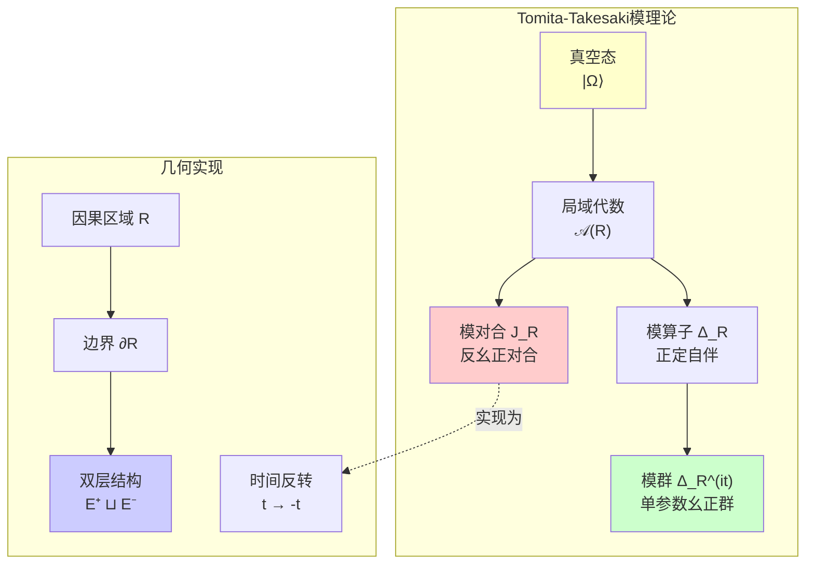
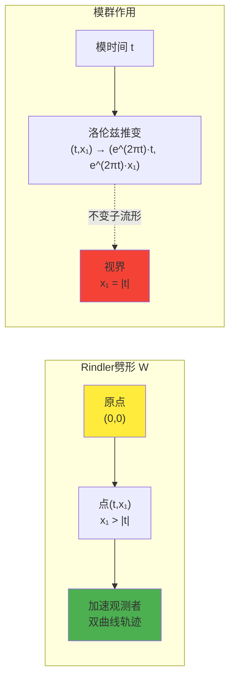
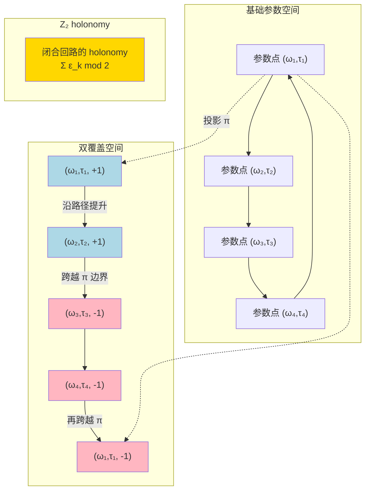
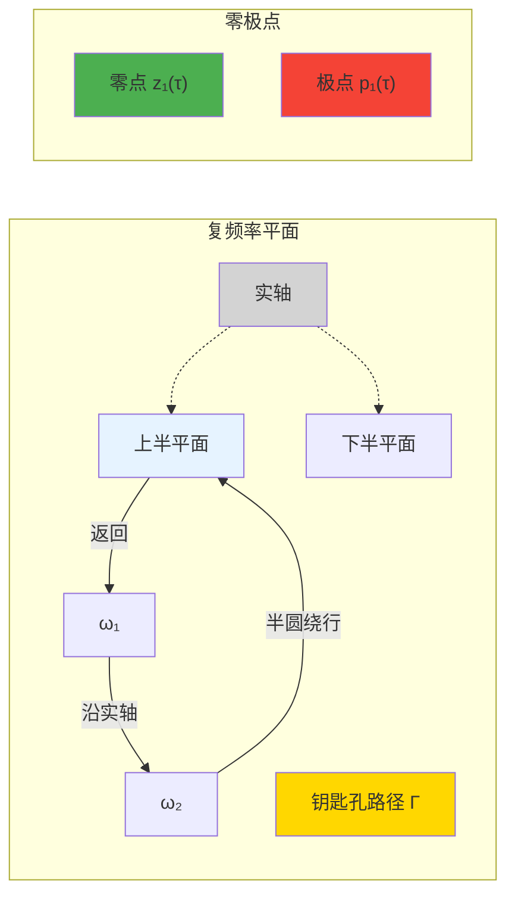
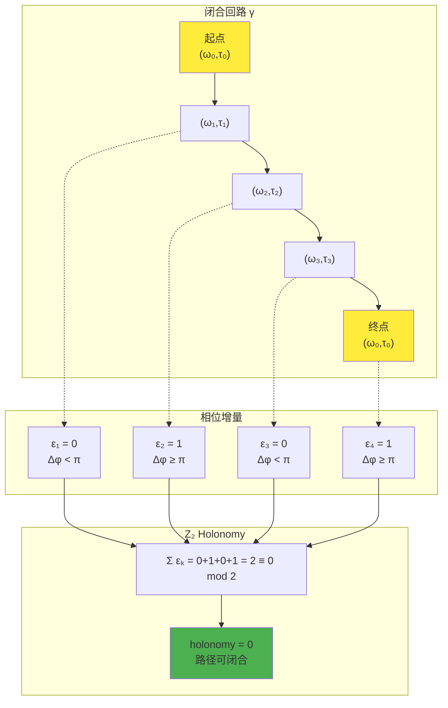
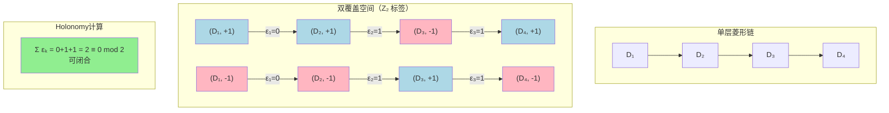

# 第21章第2节 零模双覆盖与 $\mathbb{Z}_2$ Holonomy

## 引言

在上一节中，我们建立了因果菱形的几何基础，特别是零测度边界的双层分解 $\widetilde{E} = E^+ \sqcup E^-$。现在，我们将深入这个双层结构的核心：**零模双覆盖**（Null-Modular Double Cover）。

想象你在看一面镜子。镜中的你和镜外的你是"对称"的，但又不完全相同——如果你举起右手，镜中的你举的是左手。**零模双覆盖**就是这样一种"镜像关系"，但它不是普通的空间镜像，而是一种深刻的**量子镜像**，涉及模理论（modular theory）、相位分支（phase branching）和拓扑不变量。

本节的核心问题是：

1. 什么是"模对合"（modular conjugation）$J$？它如何交换两层边界？
2. 什么是"平方根分支"？为什么散射相位的平方根会产生双覆盖？
3. 什么是 $\mathbb{Z}_2$ holonomy？它如何刻画闭合回路的"奇偶性"？
4. $\pi$-台阶量子化如何与辐角原理联系？

---

## 1. 模理论基础：Tomita-Takesaki理论简介

### 1.1 冯诺依曼代数与自然锥

在量子场论中，给定一个因果区域 $R$（如因果菱形），其对应的**局域代数** $\mathcal{A}(R)$ 是作用在全局希尔伯特空间 $\mathcal{H}$ 上的算子集合，满足某些代数性质（如封闭、自伴、幺正等）。

**真空态** $|\Omega\rangle \in \mathcal{H}$ 是全局平移不变的基态，满足：

$$
P^\mu |\Omega\rangle = 0
$$

其中 $P^\mu$ 是动量算子。

给定一对 $(\mathcal{A}(R), |\Omega\rangle)$，Tomita-Takesaki理论告诉我们存在两个核心算子：

**模对合** $J_R$（modular conjugation）：

$$
J_R : \mathcal{H} \to \mathcal{H}, \quad J_R^2 = \mathbb{I}, \quad J_R = J_R^\dagger
$$

**模算子** $\Delta_R$（modular operator）：

$$
\Delta_R : \mathcal{H} \to \mathcal{H}, \quad \Delta_R > 0, \quad \Delta_R^{it} |\Omega\rangle = |\Omega\rangle
$$

以及**模群**（modular flow）：

$$
\Delta_R^{it} : t \in \mathbb{R}
$$

**物理意义**：

### 1.2 模对合的作用：交换两层并反转时间

对因果菱形 $D$，模对合 $J_D$ 有一个美妙的几何实现：

$$
J_D(E^+) = E^-, \quad J_D(E^-) = E^+
$$

即：**模对合交换两层边界**。

但这还不是全部。模对合还**反转时间方向**。更精确地说，对null坐标 $(u,v)$：

$$
J_D : (u,v,x_\perp) \mapsto (v,u,x_\perp)
$$

并施加CPT变换（电荷共轭-宇称-时间反演的组合）。

**日常类比：镜子中的世界**

- 镜子交换左右（对应 $E^+ \leftrightarrow E^-$）
- 如果你向前走，镜中的你也向前走，但**相对于镜面**，时间方向好像"反转"了
- 模对合就是这样一种"时空镜像"

### 1.3 模群的几何化：Bisognano-Wichmann定理

**Bisognano-Wichmann定理**（BW定理）是模理论与时空几何的桥梁。

**定理（Rindler劈形的BW性质）**：

对Rindler劈形 $W = \{|t| < x_1, x_1 > 0\}$，模群 $\Delta_W^{it}$ 几何化为洛伦兹推变（boost）：

$$
\Delta_W^{it} \cdot (t, x_1, \vec{x}_\perp) = (e^{2\pi t}t, e^{2\pi t}x_1, \vec{x}_\perp)
$$

**物理意义**：

- 模群描述系统在"模时间"$t$ 下的演化
- 在Rindler劈形中，模时间对应**加速度坐标**
- 这联系了量子纠缠与Unruh效应（加速观测者看到热辐射）

---

## 2. 平方根分支与双覆盖结构

### 2.1 为什么需要"平方根"？

在零模双覆盖理论中，核心对象是散射矩阵的**平方根**：

$$
\sqrt{S(\omega)}
$$

但问题是：如何定义这个平方根？

对复数 $z \in \mathbb{C}$，其平方根 $\sqrt{z}$ 有**两个值**：

$$
\sqrt{z} = \pm |z|^{1/2} e^{i\theta/2}
$$

其中 $z = |z| e^{i\theta}$。

当 $z$ 沿着一个闭合回路变化时（例如绕原点一圈），$\theta$ 增加 $2\pi$，但 $\theta/2$ 只增加 $\pi$。这意味着：

$$
\sqrt{z} \to -\sqrt{z}
$$

平方根**翻转了符号**！

这就是**分支点**（branch point）的来源：$z=0$ 是平方根函数的分支点，绕它一圈会改变平方根的符号。

### 2.2 散射相位的平方根分支

对散射矩阵 $S(\omega)$，定义总相位：

$$
\varphi(\omega) = \frac{1}{2}\arg\det S(\omega)
$$

（注意因子 $1/2$——这正是"平方根"的来源！）

若 $\det S(\omega) = e^{2i\varphi(\omega)}$，则：

$$
\sqrt{\det S(\omega)} = e^{i\varphi(\omega)}
$$

但这个平方根有**两个分支**：

$$
\sqrt{\det S(\omega)} = \pm e^{i\varphi(\omega)}
$$

当 $\omega$ 或其他参数（如延迟 $\tau$）变化时，$\varphi(\omega)$ 可能跨越 $\pi$ 的整数倍。此时，平方根的两个分支会**互换**。

**定理（平方根分支的拓扑结构）**：

设 $\varphi(\omega;\tau)$ 是关于参数 $(\omega,\tau)$ 的连续函数。定义平方根覆盖空间：

$$
P_{\sqrt{S}} = \{(\omega,\tau,\sigma) : \sigma^2 = \det S(\omega;\tau)\}
$$

其中 $\sigma = \pm 1$ 标记两个分支。则 $P_{\sqrt{S}}$ 是参数空间的**双覆盖**，投影为：

$$
\pi : P_{\sqrt{S}} \to \{(\omega,\tau)\}, \quad (\omega,\tau,\sigma) \mapsto (\omega,\tau)
$$

**日常类比：莫比乌斯带**

- 普通纸带有两面：正面和反面
- 莫比乌斯带只有一面：沿着带走一圈后，你从正面回到了反面
- 平方根分支就像莫比乌斯带：绕一圈后，$+\sqrt{S}$ 变成了 $-\sqrt{S}$

### 2.3 $\mathbb{Z}_2$ 奇偶标签

在双覆盖空间中，我们为每个参数点 $(\omega,\tau)$ 赋予一个 $\mathbb{Z}_2$ 标签：

$$
\epsilon(\omega,\tau) \in \{0, 1\}
$$

定义为：

$$
\epsilon(\omega,\tau) = \left\lfloor \frac{\varphi(\omega,\tau)}{\pi} \right\rfloor \bmod 2
$$

**物理意义**：

- $\epsilon = 0$：相位 $\varphi$ 在 $[0,\pi)$、$[2\pi,3\pi)$、$[4\pi,5\pi)$、... 中
- $\epsilon = 1$：相位 $\varphi$ 在 $[\pi,2\pi)$、$[3\pi,4\pi)$、$[5\pi,6\pi)$、... 中

当相位跨越 $\pi$ 的奇数倍时，$\epsilon$ 翻转一次。

---

## 3. $\pi$-台阶量子化：辐角原理的拓扑表现

### 3.1 辐角原理回顾

**辐角原理**（Argument Principle）是复分析中的基本定理：

**定理（辐角原理）**：

设 $f(z)$ 在区域 $D$ 内亚纯（即除了有限个极点外处处解析），$\Gamma$ 是 $D$ 内一条不经过零点和极点的闭合曲线。则：

$$
\frac{1}{2\pi i}\oint_\Gamma \frac{f'(z)}{f(z)}\,dz = N - P
$$

其中 $N$ 是 $\Gamma$ 内零点个数（按重数计），$P$ 是极点个数。

等价地：

$$
\frac{1}{2\pi}\Delta_\Gamma \arg f(z) = N - P
$$

其中 $\Delta_\Gamma \arg f(z)$ 是 $\arg f(z)$ 沿 $\Gamma$ 的总变化。

### 3.2 散射相位的谱流计数

对散射矩阵 $S(\omega;\tau)$，取 $f(z) = \det S(z;\tau)$（将 $\omega$ 解析延拓到复频率 $z$）。

选取围绕实轴区间 $[\omega_1,\omega_2]$ 的"钥匙孔路径" $\Gamma$：

由辐角原理：

$$
\frac{1}{\pi}\big(\varphi(\omega_2;\tau) - \varphi(\omega_1;\tau)\big) = N(\tau) - P(\tau)
$$

其中 $N(\tau)$ 是 $\Gamma$ 内零点个数，$P(\tau)$ 是极点个数。

**关键洞察**：

当 $\tau$ 连续变化时，零极点轨迹 $\{z_j(\tau), p_k(\tau)\}$ 在复频率平面上连续移动。每当某个零点或极点**横过实轴**时，右侧计数 $N(\tau) - P(\tau)$ 改变 $\pm 1$，从而导致：

$$
\Delta\varphi = \pm\pi
$$

这就是 **$\pi$-台阶**！

### 3.3 延迟量子化台阶

在带延迟反馈的系统中，极点由方程决定：

$$
1 - r_{\text{fb}}(\omega) e^{i\omega\tau} = 0
$$

或在多通道情形：

$$
\det\big(\mathbb{I} - \mathsf{R}(\omega) e^{i\omega\tau}\big) = 0
$$

当 $\tau$ 增加时，相位 $\omega\tau$ 线性增长。极点位置 $\omega_{\text{pole}}(\tau)$ 满足：

$$
\omega_{\text{pole}}(\tau) \cdot \tau \approx \phi_0 + 2\pi n
$$

其中 $\phi_0 = \arg r_{\text{fb}}(\omega_{\text{pole}})$，$n$ 是整数。

解出：

$$
\tau_n = \frac{\phi_0 + 2\pi n}{\omega_{\text{pole}}}
$$

当 $\tau$ 跨越 $\tau_n$ 时，极点从上半平面移动到下半平面（或反之），横过实轴。这就是**延迟量子化台阶**的来源。

**定理（$\pi$-台阶定理）**：

在自然的解析性假设下，对每个延迟量子化台阶 $\tau_k$，存在频率 $\omega_k$ 使得：

1. 相位跃迁：$\varphi(\omega_k;\tau_k^+) - \varphi(\omega_k;\tau_k^-) = \pm\pi$
2. 群延迟脉冲：$\text{tr}\,Q(\omega_k;\tau) \sim \delta(\tau - \tau_k)$
3. 奇偶翻转：$\epsilon(\tau_{k+1}) = \epsilon(\tau_k) \oplus 1$

**源理论**：`euler-gls-extend/delay-quantization-feedback-loop-pi-step-parity-transition.md`，§3.1-3.3

---

## 4. $\mathbb{Z}_2$ Holonomy：闭合回路的奇偶不变量

### 4.1 什么是Holonomy？

**Holonomy**（和乐、完整性）是微分几何中描述"平行移动"的概念。想象你在球面上沿着一条闭合曲线移动一个向量，当你回到起点时，向量可能不再指向原来的方向——它**旋转**了。这个旋转角就是holonomy。

在我们的情形中，"向量"被替换为**平方根分支的标签** $\sigma = \pm 1$。沿着参数空间的闭合回路移动时，标签可能翻转奇数次，从 $+$ 变到 $-$，或保持不变。

### 4.2 双覆盖空间上的路径提升

给定参数空间中的闭合回路 $\gamma: [0,1] \to \{(\omega,\tau)\}$，满足 $\gamma(0) = \gamma(1) = (\omega_0,\tau_0)$。

在双覆盖空间 $P_{\sqrt{S}}$ 中，我们尝试**提升**这条路径：

$$
\widetilde{\gamma}: [0,1] \to P_{\sqrt{S}}, \quad \pi(\widetilde{\gamma}(t)) = \gamma(t)
$$

起点为 $\widetilde{\gamma}(0) = (\omega_0,\tau_0,\sigma_0)$，其中 $\sigma_0 = \pm 1$ 是初始分支选择。

**问题**：终点 $\widetilde{\gamma}(1)$ 是 $(\omega_0,\tau_0,\sigma_0)$ 还是 $(\omega_0,\tau_0,-\sigma_0)$？

答案取决于路径 $\gamma$ 在参数空间中的拓扑。

### 4.3 $\mathbb{Z}_2$ Holonomy的定义

定义闭合回路 $\gamma$ 的 **$\mathbb{Z}_2$ holonomy**：

$$
\text{hol}_{\mathbb{Z}_2}(\gamma) = \begin{cases}
0, & \text{若 } \widetilde{\gamma}(1) = (\omega_0,\tau_0,\sigma_0) \\
1, & \text{若 } \widetilde{\gamma}(1) = (\omega_0,\tau_0,-\sigma_0)
\end{cases}
$$

**计算公式**：

$$
\text{hol}_{\mathbb{Z}_2}(\gamma) = \sum_{k=1}^N \epsilon_k \bmod 2
$$

其中 $\epsilon_k$ 是沿路径每一段的模二相位增量：

$$
\epsilon_k = \left\lfloor \frac{\Delta\varphi_k}{\pi} \right\rfloor \bmod 2
$$

**定理（Holonomy与谱流）**：

$$
\text{hol}_{\mathbb{Z}_2}(\gamma) = \#\{\text{零极点横过实轴的次数}\} \bmod 2
$$

**物理意义**：

### 4.4 平凡与非平凡Holonomy的物理区别

**平凡holonomy（$\text{hol}_{\mathbb{Z}_2}(\gamma) = 0$）**：

- 闭合回路在双覆盖空间上可以闭合
- 平方根函数沿回路单值
- 对应"偶数次"跨越 $\pi$ 边界

**非平凡holonomy（$\text{hol}_{\mathbb{Z}_2}(\gamma) = 1$）**：

- 闭合回路在双覆盖空间上不能闭合（翻转分支）
- 平方根函数沿回路双值
- 对应"奇数次"跨越 $\pi$ 边界

这一区别在费米子统计、自旋双覆盖、时间晶体等多个物理系统中以不同形式出现。

---

## 5. 因果菱形链上的Null-Modular双覆盖

### 5.1 菱形链的参数化

考虑一列相邻的因果菱形 $\{D_k\}_{k\in\mathbb{Z}}$，每个菱形对应一个"时间片"。将其参数化为：

- 菱形索引 $k \in \mathbb{Z}$
- 每个菱形的局域散射相位 $\varphi_k$
- 模二奇偶标签 $\epsilon_k \in \{0,1\}$

链的边界上，定义连接规则：

$$
D_k \to D_{k+1}, \quad \epsilon_{\text{out}}(D_k) \to \epsilon_{\text{in}}(D_{k+1})
$$

### 5.2 双覆盖空间的构造

**定义（菱形链的Null-Modular双覆盖）**：

对菱形链 $\mathfrak{D} = \{D_k\}$，构造双覆盖空间 $\widetilde{\mathfrak{D}}$：

1. 顶点集合：$V(\widetilde{\mathfrak{D}}) = \{(D_k, \sigma) : \sigma \in \{+1, -1\}\}$
2. 边规则：若 $\epsilon_k = 0$（相位增量 $<\pi$），连接 $(D_k,\sigma) \to (D_{k+1},\sigma)$（同分支）
3. 边规则：若 $\epsilon_k = 1$（相位增量 $\geq\pi$），连接 $(D_k,\sigma) \to (D_{k+1},-\sigma)$（跳分支）

**闭合链的Holonomy**：

对闭合链 $\gamma = (D_1, D_2, \ldots, D_N, D_1)$：

$$
\text{hol}_{\mathbb{Z}_2}(\gamma) = \sum_{k=1}^N \epsilon_k \bmod 2
$$

### 5.3 模对合与Null边界的对称性

回顾模对合 $J_D$ 交换两层边界：

$$
J_D : E^+ \leftrightarrow E^-
$$

在双覆盖空间中，模对合作用为：

$$
J_D : (D, +1) \leftrightarrow (D, -1)
$$

这说明：**两个分支通过模对合相互关联**。

**物理意义**：

- $+1$ 分支对应出射边界 $E^+$ 的"正向"时间流
- $-1$ 分支对应入射边界 $E^-$ 的"反向"时间流
- 模对合是两者之间的"时空镜像"

---

## 6. 与自指散射网络的联系

### 6.1 自指奇偶不变量

在前面的章节（第18章 self-reference-topology/）中，我们定义了自指环路的奇偶不变量：

$$
\sigma(\gamma) \in \mathbb{Z}_2
$$

它刻画了自指反馈网络中环路的"拓扑自指度"。

**定理（自指奇偶与Null-Modular Holonomy的对应）**：

在适当的编码下，每条自指环路 $\gamma$ 对应一条菱形链闭合环路 $\gamma_{\Diamond}$，使得：

$$
\sigma(\gamma) = \text{hol}_{\mathbb{Z}_2}(\gamma_{\Diamond})
$$

即：**自指奇偶等于菱形链双覆盖上的 $\mathbb{Z}_2$ holonomy**。

**源理论**：`euler-gls-info/14-causal-diamond-chain-null-modular-double-cover.md`，§3.3

### 6.2 费米子双值性的拓扑起源

在量子场论中，费米子（如电子、夸克）具有**双值性**：

$$
|\psi_{\text{fermion}}\rangle \to -|\psi_{\text{fermion}}\rangle
$$

在空间旋转 $2\pi$ 后，费米子态获得一个负号。

这一双值性可以追溯到自旋群 $\text{Spin}(d)$ 是旋转群 $\text{SO}(d)$ 的**双覆盖**：

$$
\text{Spin}(d) \to \text{SO}(d), \quad 2:1
$$

**惊人的联系**：

费米子的双值性与Null-Modular双覆盖的 $\mathbb{Z}_2$ holonomy **数学同构**！

- 旋转 $2\pi$ 对应闭合回路
- 费米子相位 $-1$ 对应非平凡holonomy
- 自旋双覆盖 $\leftrightarrow$ Null-Modular双覆盖

这揭示了费米子统计与时空因果结构的深层联系。

---

## 7. 拓扑不可判定性：Null-Modular版停机问题

### 7.1 停机问题回顾

在计算理论中，**停机问题**（Halting Problem）问：给定一个程序和输入，能否判定它是否会停机（halt）？

图灵证明了：**不存在**通用算法解决停机问题——它是**不可判定的**（undecidable）。

### 7.2 Null-Modular停机判定问题

**问题（Null-Modular停机判定）**：

输入：菱形链复形 $\mathfrak{D}$ 的有限描述与一条闭合环路 $\gamma$。

问题：判定 $\gamma$ 在Null-Modular双覆盖 $\widetilde{\mathfrak{D}}$ 上是否具有闭合提升路径。

等价于：判定 $\text{hol}_{\mathbb{Z}_2}(\gamma) = 0$ 还是 $1$。

**定理（Null-Modular停机判定不可判定）**：

存在一族可构造的计算宇宙与菱形链复形 $\{\mathfrak{D}^\alpha\}$，使得在每个 $\mathfrak{D}^\alpha$ 上，判定输入环路 $\gamma$ 在Null-Modular双覆盖上是否具有闭合提升路径是**不可判定的**。

**证明思路**：

将停机问题编码为某类自指菱形链的闭合性与否，及其holonomy的奇偶，从而将停机归约到Null-Modular停机判定。

**源理论**：`euler-gls-info/14-causal-diamond-chain-null-modular-double-cover.md`，§6.1

**物理意义**：

- 拓扑不变量（holonomy）的计算在一般情形下无法完全算法化
- 这与哥德尔不完备性定理、停机问题具有深刻的逻辑联系
- 自指结构（自我引用）导致不可判定性

---

## 小结

在本节中，我们深入探讨了零模双覆盖的数学与物理结构：

1. **Tomita-Takesaki模理论**：模对合 $J$ 交换两层边界 $E^+ \leftrightarrow E^-$ 并反转时间
2. **平方根分支**：散射相位的平方根 $\sqrt{\det S}$ 产生双覆盖空间
3. **$\pi$-台阶量子化**：零极点横过实轴导致相位跃迁 $\Delta\varphi = \pm\pi$
4. **$\mathbb{Z}_2$ Holonomy**：闭合回路的奇偶不变量 $\text{hol}_{\mathbb{Z}_2}(\gamma) = \sum \epsilon_k \bmod 2$
5. **菱形链双覆盖**：构造 $\widetilde{\mathfrak{D}}$ 并定义提升路径
6. **自指奇偶对应**：$\sigma(\gamma) = \text{hol}_{\mathbb{Z}_2}(\gamma_{\Diamond})$
7. **费米子双值性**：与自旋双覆盖的拓扑同构
8. **拓扑不可判定性**：Null-Modular停机问题

在下一节中，我们将探讨**马尔可夫拼接**——相邻菱形如何通过容斥恒等式与Petz恢复映射拼接成链，以及非全序切割导致的马尔可夫缺口。

---

## 参考文献

本节主要基于以下理论文献：

1. **Null-Modular双覆盖理论** - `euler-gls-extend/null-modular-double-cover-causal-diamond-chain.md`，§2.3, §3.5-3.7
2. **延迟量子化与 $\pi$-台阶** - `euler-gls-extend/delay-quantization-feedback-loop-pi-step-parity-transition.md`，完整文档
3. **计算宇宙中的菱形链双覆盖** - `euler-gls-info/14-causal-diamond-chain-null-modular-double-cover.md`，§3-4
4. **自指散射网络** - 第18章 self-reference-topology/，拓扑奇偶不变量
5. **Tomita-Takesaki模理论** - 经典数学物理文献，Takesaki (1970), Bisognano-Wichmann (1975)
6. **辐角原理与谱流** - 复分析与算子理论经典教材

下一节我们将详细展开**马尔可夫拼接与容斥恒等式**的数学结构。
