# Chapter 21 Section 2: Null-Modular Double Cover and $\mathbb{Z}_2$ Holonomy

## Introduction

In the previous section, we established the geometric foundations of causal diamonds, particularly the double-layer decomposition of null boundaries $\widetilde{E} = E^+ \sqcup E^-$. Now, we will delve into the core of this double-layer structure: **Null-Modular Double Cover**.

Imagine looking at a mirror. The you in the mirror and the you outside are "symmetric," but not identical—if you raise your right hand, the mirror image raises its left hand. **Null-modular double cover** is such a "mirror relationship," but it's not an ordinary spatial mirror, but a profound **quantum mirror** involving modular theory, phase branching, and topological invariants.

The core questions of this section are:

1. What is "modular conjugation" $J$? How does it exchange the two boundary layers?
2. What is a "square root branch"? Why does the square root of scattering phase produce a double cover?
3. What is $\mathbb{Z}_2$ holonomy? How does it characterize the "parity" of closed loops?
4. How does $\pi$-step quantization relate to the argument principle?

---

## 1. Modular Theory Foundations: Brief Introduction to Tomita-Takesaki Theory

### 1.1 Von Neumann Algebras and Natural Cone

In quantum field theory, given a causal region $R$ (such as a causal diamond), its corresponding **local algebra** $\mathcal{A}(R)$ is a set of operators acting on the global Hilbert space $\mathcal{H}$, satisfying certain algebraic properties (such as closure, self-adjointness, unitarity, etc.).

**Vacuum state** $|\Omega\rangle \in \mathcal{H}$ is the translation-invariant ground state, satisfying:

$$
P^\mu |\Omega\rangle = 0
$$

where $P^\mu$ is the momentum operator.

Given a pair $(\mathcal{A}(R), |\Omega\rangle)$, Tomita-Takesaki theory tells us there exist two core operators:

**Modular conjugation** $J_R$:

$$
J_R : \mathcal{H} \to \mathcal{H}, \quad J_R^2 = \mathbb{I}, \quad J_R = J_R^\dagger
$$

**Modular operator** $\Delta_R$:

$$
\Delta_R : \mathcal{H} \to \mathcal{H}, \quad \Delta_R > 0, \quad \Delta_R^{it} |\Omega\rangle = |\Omega\rangle
$$

and the **modular flow**:

$$
\Delta_R^{it} : t \in \mathbb{R}
$$

**Physical Meaning**:

```mermaid
graph TB
    subgraph "Tomita-Takesaki Modular Theory"
        Vacuum["Vacuum State<br/>|Ω⟩"]
        Algebra["Local Algebra<br/>𝒜(R)"]
        ModConj["Modular Conjugation J_R<br/>Anti-Unitary Involution"]
        ModOp["Modular Operator Δ_R<br/>Positive Self-Adjoint"]
        ModFlow["Modular Flow Δ_R^(it)<br/>One-Parameter Unitary Group"]

        Vacuum --> Algebra
        Algebra --> ModConj
        Algebra --> ModOp
        ModOp --> ModFlow
    end

    subgraph "Geometric Realization"
        Geometry["Causal Region R"]
        Boundary["Boundary ∂R"]
        DoubleLayer["Double-Layer Structure<br/>E⁺ ⊔ E⁻"]
        TimeReverse["Time Reversal<br/>t → -t"]

        Geometry --> Boundary
        Boundary --> DoubleLayer
        ModConj -.->|"Realized as"| TimeReverse
    end

    style Vacuum fill:#ffffcc
    style ModConj fill:#ffcccc
    style ModFlow fill:#ccffcc
    style DoubleLayer fill:#ccccff
```

### 1.2 Action of Modular Conjugation: Exchanging Two Layers and Reversing Time

For causal diamond $D$, modular conjugation $J_D$ has a beautiful geometric realization:

$$
J_D(E^+) = E^-, \quad J_D(E^-) = E^+
$$

That is: **Modular conjugation exchanges the two boundary layers**.

But that's not all. Modular conjugation also **reverses time direction**. More precisely, for null coordinates $(u,v)$:

$$
J_D : (u,v,x_\perp) \mapsto (v,u,x_\perp)
$$

and applies CPT transformation (combination of charge conjugation, parity, and time reversal).

**Everyday Analogy: World in the Mirror**

- Mirror exchanges left and right (corresponding to $E^+ \leftrightarrow E^-$)
- If you walk forward, the mirror image also walks forward, but **relative to the mirror**, the time direction seems "reversed"
- Modular conjugation is such a "spacetime mirror"

### 1.3 Geometrization of Modular Flow: Bisognano-Wichmann Theorem

**Bisognano-Wichmann Theorem** (BW theorem) is the bridge between modular theory and spacetime geometry.

**Theorem (BW Property of Rindler Wedge)**:

For Rindler wedge $W = \{|t| < x_1, x_1 > 0\}$, modular flow $\Delta_W^{it}$ geometrizes as Lorentz boost:

$$
\Delta_W^{it} \cdot (t, x_1, \vec{x}_\perp) = (e^{2\pi t}t, e^{2\pi t}x_1, \vec{x}_\perp)
$$

**Physical Meaning**:

- Modular flow describes evolution of the system in "modular time" $t$
- In Rindler wedge, modular time corresponds to **acceleration coordinates**
- This connects quantum entanglement with Unruh effect (accelerated observers see thermal radiation)

```mermaid
graph LR
    subgraph "Rindler Wedge W"
        Origin["Origin<br/>(0,0)"]
        Point1["Point (t,x₁)<br/>x₁ > |t|"]
        Point2["Accelerated Observer<br/>Hyperbolic Trajectory"]

        Origin --> Point1
        Point1 --> Point2
    end

    subgraph "Modular Flow Action"
        ModTime["Modular Time t"]
        Boost["Lorentz Boost<br/>(t,x₁) → (e^(2πt)·t, e^(2πt)·x₁)"]
        Horizon["Horizon<br/>x₁ = |t|"]

        ModTime --> Boost
        Boost -.->|"Invariant Submanifold"| Horizon
    end

    style Origin fill:#ffeb3b
    style Point2 fill:#4caf50
    style Horizon fill:#f44336
```

---

## 2. Square Root Branch and Double Cover Structure

### 2.1 Why Do We Need "Square Root"?

In null-modular double cover theory, the core object is the **square root** of the scattering matrix:

$$
\sqrt{S(\omega)}
$$

But the question is: How to define this square root?

For a complex number $z \in \mathbb{C}$, its square root $\sqrt{z}$ has **two values**:

$$
\sqrt{z} = \pm |z|^{1/2} e^{i\theta/2}
$$

where $z = |z| e^{i\theta}$.

When $z$ varies along a closed loop (e.g., going around the origin once), $\theta$ increases by $2\pi$, but $\theta/2$ only increases by $\pi$. This means:

$$
\sqrt{z} \to -\sqrt{z}
$$

The square root **flips sign**!

This is the origin of **branch points**: $z=0$ is a branch point of the square root function, going around it once changes the sign of the square root.

### 2.2 Square Root Branch of Scattering Phase

For scattering matrix $S(\omega)$, define total phase:

$$
\varphi(\omega) = \frac{1}{2}\arg\det S(\omega)
$$

(Note the factor $1/2$—this is exactly the origin of "square root"!)

If $\det S(\omega) = e^{2i\varphi(\omega)}$, then:

$$
\sqrt{\det S(\omega)} = e^{i\varphi(\omega)}
$$

But this square root has **two branches**:

$$
\sqrt{\det S(\omega)} = \pm e^{i\varphi(\omega)}
$$

When $\omega$ or other parameters (such as delay $\tau$) vary, $\varphi(\omega)$ may cross integer multiples of $\pi$. At this point, the two branches of the square root **interchange**.

**Theorem (Topological Structure of Square Root Branch)**:

Let $\varphi(\omega;\tau)$ be a continuous function of parameters $(\omega,\tau)$. Define square root covering space:

$$
P_{\sqrt{S}} = \{(\omega,\tau,\sigma) : \sigma^2 = \det S(\omega;\tau)\}
$$

where $\sigma = \pm 1$ labels the two branches. Then $P_{\sqrt{S}}$ is a **double cover** of parameter space, with projection:

$$
\pi : P_{\sqrt{S}} \to \{(\omega,\tau)\}, \quad (\omega,\tau,\sigma) \mapsto (\omega,\tau)
$$

**Everyday Analogy: Möbius Strip**

- Ordinary paper strip has two sides: front and back
- Möbius strip has only one side: after going around once, you return from front to back
- Square root branch is like a Möbius strip: after going around once, $+\sqrt{S}$ becomes $-\sqrt{S}$

```mermaid
graph TB
    subgraph "Base Parameter Space"
        Param1["Parameter Point (ω₁,τ₁)"]
        Param2["Parameter Point (ω₂,τ₂)"]
        Param3["Parameter Point (ω₃,τ₃)"]
        Param4["Parameter Point (ω₄,τ₄)"]

        Param1 --> Param2 --> Param3 --> Param4 --> Param1
    end

    subgraph "Double Cover Space"
        Lift1p["(ω₁,τ₁, +1)"]
        Lift2p["(ω₂,τ₂, +1)"]
        Lift3m["(ω₃,τ₃, -1)"]
        Lift4m["(ω₄,τ₄, -1)"]
        Lift1m_end["(ω₁,τ₁, -1)"]

        Lift1p -->|"Lift Along Path"| Lift2p
        Lift2p -->|"Cross π Boundary"| Lift3m
        Lift3m --> Lift4m
        Lift4m -->|"Cross π Again"| Lift1m_end
    end

    subgraph "Z₂ Holonomy"
        Hol["Holonomy of Closed Loop<br/>Σ ε_k mod 2"]
    end

    Param1 -.->|"Projection π"| Lift1p
    Param1 -.-> Lift1m_end

    style Lift1p fill:#add8e6
    style Lift2p fill:#add8e6
    style Lift3m fill:#ffb6c1
    style Lift4m fill:#ffb6c1
    style Lift1m_end fill:#ffb6c1
    style Hol fill:#ffd700
```

### 2.3 $\mathbb{Z}_2$ Parity Label

In the double cover space, we assign a $\mathbb{Z}_2$ label to each parameter point $(\omega,\tau)$:

$$
\epsilon(\omega,\tau) \in \{0, 1\}
$$

defined as:

$$
\epsilon(\omega,\tau) = \left\lfloor \frac{\varphi(\omega,\tau)}{\pi} \right\rfloor \bmod 2
$$

**Physical Meaning**:

- $\epsilon = 0$: Phase $\varphi$ is in $[0,\pi)$, $[2\pi,3\pi)$, $[4\pi,5\pi)$, ...
- $\epsilon = 1$: Phase $\varphi$ is in $[\pi,2\pi)$, $[3\pi,4\pi)$, $[5\pi,6\pi)$, ...

When phase crosses odd multiples of $\pi$, $\epsilon$ flips once.

---

## 3. $\pi$-Step Quantization: Topological Manifestation of Argument Principle

### 3.1 Review of Argument Principle

**Argument Principle** is a fundamental theorem in complex analysis:

**Theorem (Argument Principle)**:

Let $f(z)$ be meromorphic in region $D$ (i.e., analytic except for finitely many poles), and $\Gamma$ be a closed curve in $D$ that does not pass through zeros or poles. Then:

$$
\frac{1}{2\pi i}\oint_\Gamma \frac{f'(z)}{f(z)}\,dz = N - P
$$

where $N$ is the number of zeros inside $\Gamma$ (counted with multiplicity), and $P$ is the number of poles.

Equivalently:

$$
\frac{1}{2\pi}\Delta_\Gamma \arg f(z) = N - P
$$

where $\Delta_\Gamma \arg f(z)$ is the total change of $\arg f(z)$ along $\Gamma$.

### 3.2 Spectral Flow Counting of Scattering Phase

For scattering matrix $S(\omega;\tau)$, take $f(z) = \det S(z;\tau)$ (analytically continuing $\omega$ to complex frequency $z$).

Choose a "keyhole path" $\Gamma$ around real axis interval $[\omega_1,\omega_2]$:

```mermaid
graph LR
    subgraph "Complex Frequency Plane"
        Real["Real Axis"]
        Upper["Upper Half-Plane"]
        Lower["Lower Half-Plane"]

        W1["ω₁"]
        W2["ω₂"]
        Contour["Keyhole Path Γ"]

        W1 -->|"Along Real Axis"| W2
        W2 -->|"Semicircle Detour"| Upper
        Upper -->|"Return"| W1

        Real -.-> Upper
        Real -.-> Lower
    end

    subgraph "Zeros and Poles"
        Zero1["Zero z₁(τ)"]
        Pole1["Pole p₁(τ)"]
    end

    style Real fill:#d3d3d3
    style Upper fill:#e6f3ff
    style Contour fill:#ffd700
    style Zero1 fill:#4caf50
    style Pole1 fill:#f44336
```

By argument principle:

$$
\frac{1}{\pi}\big(\varphi(\omega_2;\tau) - \varphi(\omega_1;\tau)\big) = N(\tau) - P(\tau)
$$

where $N(\tau)$ is the number of zeros inside $\Gamma$, and $P(\tau)$ is the number of poles.

**Key Insight**:

When $\tau$ varies continuously, zero-pole trajectories $\{z_j(\tau), p_k(\tau)\}$ move continuously in the complex frequency plane. Whenever a zero or pole **crosses the real axis**, the count $N(\tau) - P(\tau)$ changes by $\pm 1$, leading to:

$$
\Delta\varphi = \pm\pi
$$

This is the **$\pi$-step**!

### 3.3 Delay Quantization Steps

In systems with delayed feedback, poles are determined by the equation:

$$
1 - r_{\text{fb}}(\omega) e^{i\omega\tau} = 0
$$

or in multi-channel case:

$$
\det\big(\mathbb{I} - \mathsf{R}(\omega) e^{i\omega\tau}\big) = 0
$$

When $\tau$ increases, phase $\omega\tau$ grows linearly. Pole positions $\omega_{\text{pole}}(\tau)$ satisfy:

$$
\omega_{\text{pole}}(\tau) \cdot \tau \approx \phi_0 + 2\pi n
$$

where $\phi_0 = \arg r_{\text{fb}}(\omega_{\text{pole}})$, and $n$ is an integer.

Solving:

$$
\tau_n = \frac{\phi_0 + 2\pi n}{\omega_{\text{pole}}}
$$

When $\tau$ crosses $\tau_n$, the pole moves from upper half-plane to lower half-plane (or vice versa), crossing the real axis. This is the origin of **delay quantization steps**.

**Theorem ($\pi$-Step Theorem)**:

Under natural analyticity assumptions, for each delay quantization step $\tau_k$, there exists a frequency $\omega_k$ such that:

1. Phase jump: $\varphi(\omega_k;\tau_k^+) - \varphi(\omega_k;\tau_k^-) = \pm\pi$
2. Group delay pulse: $\text{tr}\,Q(\omega_k;\tau) \sim \delta(\tau - \tau_k)$
3. Parity flip: $\epsilon(\tau_{k+1}) = \epsilon(\tau_k) \oplus 1$

**Source Theory**: `euler-gls-extend/delay-quantization-feedback-loop-pi-step-parity-transition.md`, §3.1-3.3

---

## 4. $\mathbb{Z}_2$ Holonomy: Parity Invariant of Closed Loops

### 4.1 What Is Holonomy?

**Holonomy** (parallel transport) is a concept in differential geometry describing "parallel transport." Imagine moving a vector along a closed curve on a sphere; when you return to the starting point, the vector may no longer point in the original direction—it has **rotated**. This rotation angle is the holonomy.

In our case, the "vector" is replaced by the **label of square root branch** $\sigma = \pm 1$. When moving along a closed loop in parameter space, the label may flip an odd number of times, changing from $+$ to $-$, or remain unchanged.

### 4.2 Path Lifting on Double Cover Space

Given a closed loop $\gamma: [0,1] \to \{(\omega,\tau)\}$ in parameter space, satisfying $\gamma(0) = \gamma(1) = (\omega_0,\tau_0)$.

In double cover space $P_{\sqrt{S}}$, we try to **lift** this path:

$$
\widetilde{\gamma}: [0,1] \to P_{\sqrt{S}}, \quad \pi(\widetilde{\gamma}(t)) = \gamma(t)
$$

Starting point is $\widetilde{\gamma}(0) = (\omega_0,\tau_0,\sigma_0)$, where $\sigma_0 = \pm 1$ is the initial branch choice.

**Question**: Is the endpoint $\widetilde{\gamma}(1)$ equal to $(\omega_0,\tau_0,\sigma_0)$ or $(\omega_0,\tau_0,-\sigma_0)$?

The answer depends on the topology of path $\gamma$ in parameter space.

### 4.3 Definition of $\mathbb{Z}_2$ Holonomy

Define the **$\mathbb{Z}_2$ holonomy** of closed loop $\gamma$:

$$
\text{hol}_{\mathbb{Z}_2}(\gamma) = \begin{cases}
0, & \text{if } \widetilde{\gamma}(1) = (\omega_0,\tau_0,\sigma_0) \\
1, & \text{if } \widetilde{\gamma}(1) = (\omega_0,\tau_0,-\sigma_0)
\end{cases}
$$

**Calculation Formula**:

$$
\text{hol}_{\mathbb{Z}_2}(\gamma) = \sum_{k=1}^N \epsilon_k \bmod 2
$$

where $\epsilon_k$ is the mod-two phase increment along each segment of the path:

$$
\epsilon_k = \left\lfloor \frac{\Delta\varphi_k}{\pi} \right\rfloor \bmod 2
$$

**Theorem (Holonomy and Spectral Flow)**:

$$
\text{hol}_{\mathbb{Z}_2}(\gamma) = \#\{\text{times zeros/poles cross real axis}\} \bmod 2
$$

**Physical Meaning**:

```mermaid
graph TB
    subgraph "Closed Loop γ"
        Start["Starting Point<br/>(ω₀,τ₀)"]
        Point1["(ω₁,τ₁)"]
        Point2["(ω₂,τ₂)"]
        Point3["(ω₃,τ₃)"]
        End["Ending Point<br/>(ω₀,τ₀)"]

        Start --> Point1 --> Point2 --> Point3 --> End
    end

    subgraph "Phase Increments"
        Eps1["ε₁ = 0<br/>Δφ < π"]
        Eps2["ε₂ = 1<br/>Δφ ≥ π"]
        Eps3["ε₃ = 0<br/>Δφ < π"]
        Eps4["ε₄ = 1<br/>Δφ ≥ π"]

        Point1 -.-> Eps1
        Point2 -.-> Eps2
        Point3 -.-> Eps3
        End -.-> Eps4
    end

    subgraph "Z₂ Holonomy"
        Sum["Σ εₖ = 0+1+0+1 = 2 ≡ 0 mod 2"]
        Result["Holonomy = 0<br/>Path Can Close"]
    end

    Eps1 --> Sum
    Eps2 --> Sum
    Eps3 --> Sum
    Eps4 --> Sum
    Sum --> Result

    style Start fill:#ffeb3b
    style End fill:#ffeb3b
    style Result fill:#4caf50
```

### 4.4 Physical Difference Between Trivial and Non-Trivial Holonomy

**Trivial holonomy ($\text{hol}_{\mathbb{Z}_2}(\gamma) = 0$)**:

- Closed loop can close on double cover space
- Square root function is single-valued along the loop
- Corresponds to "even number" of crossings of $\pi$ boundary

**Non-trivial holonomy ($\text{hol}_{\mathbb{Z}_2}(\gamma) = 1$)**:

- Closed loop cannot close on double cover space (flips branch)
- Square root function is double-valued along the loop
- Corresponds to "odd number" of crossings of $\pi$ boundary

This difference appears in various forms in multiple physical systems: fermion statistics, spin double cover, time crystals, etc.

---

## 5. Null-Modular Double Cover on Causal Diamond Chains

### 5.1 Parameterization of Diamond Chain

Consider a sequence of adjacent causal diamonds $\{D_k\}_{k\in\mathbb{Z}}$, each corresponding to a "time slice." Parameterize as:

- Diamond index $k \in \mathbb{Z}$
- Local scattering phase $\varphi_k$ for each diamond
- Mod-two parity label $\epsilon_k \in \{0,1\}$

On the chain boundary, define connection rules:

$$
D_k \to D_{k+1}, \quad \epsilon_{\text{out}}(D_k) \to \epsilon_{\text{in}}(D_{k+1})
$$

### 5.2 Construction of Double Cover Space

**Definition (Null-Modular Double Cover of Diamond Chain)**:

For diamond chain $\mathfrak{D} = \{D_k\}$, construct double cover space $\widetilde{\mathfrak{D}}$:

1. Vertex set: $V(\widetilde{\mathfrak{D}}) = \{(D_k, \sigma) : \sigma \in \{+1, -1\}\}$
2. Edge rule: If $\epsilon_k = 0$ (phase increment $<\pi$), connect $(D_k,\sigma) \to (D_{k+1},\sigma)$ (same branch)
3. Edge rule: If $\epsilon_k = 1$ (phase increment $\geq\pi$), connect $(D_k,\sigma) \to (D_{k+1},-\sigma)$ (branch jump)

**Holonomy of Closed Chain**:

For closed chain $\gamma = (D_1, D_2, \ldots, D_N, D_1)$:

$$
\text{hol}_{\mathbb{Z}_2}(\gamma) = \sum_{k=1}^N \epsilon_k \bmod 2
$$

```mermaid
graph TB
    subgraph "Single-Layer Diamond Chain"
        D1["D₁"] --> D2["D₂"] --> D3["D₃"] --> D4["D₄"]
    end

    subgraph "Double Cover Space (Z₂ Labels)"
        D1p["(D₁, +1)"] -->|"ε₁=0"| D2p["(D₂, +1)"]
        D2p -->|"ε₂=1"| D3m["(D₃, -1)"]
        D3m -->|"ε₃=1"| D4p["(D₄, +1)"]

        D1m["(D₁, -1)"] -->|"ε₁=0"| D2m["(D₂, -1)"]
        D2m -->|"ε₂=1"| D3p["(D₃, +1)"]
        D3p -->|"ε₃=1"| D4m["(D₄, -1)"]
    end

    subgraph "Holonomy Calculation"
        Calc["Σ εₖ = 0+1+1 = 2 ≡ 0 mod 2<br/>Can Close"]
    end

    style D1p fill:#add8e6
    style D2p fill:#add8e6
    style D3m fill:#ffb6c1
    style D4p fill:#add8e6
    style D1m fill:#ffb6c1
    style D2m fill:#ffb6c1
    style D3p fill:#add8e6
    style D4m fill:#ffb6c1
    style Calc fill:#90ee90
```

### 5.3 Modular Conjugation and Symmetry of Null Boundaries

Recall that modular conjugation $J_D$ exchanges two boundary layers:

$$
J_D : E^+ \leftrightarrow E^-
$$

In double cover space, modular conjugation acts as:

$$
J_D : (D, +1) \leftrightarrow (D, -1)
$$

This shows: **The two branches are related by modular conjugation**.

**Physical Meaning**:

- $+1$ branch corresponds to "forward" time flow on outgoing boundary $E^+$
- $-1$ branch corresponds to "backward" time flow on incoming boundary $E^-$
- Modular conjugation is the "spacetime mirror" between them

---

## 6. Connection with Self-Referential Scattering Networks

### 6.1 Self-Referential Parity Invariant

In previous chapters (Chapter 18 self-reference-topology/), we defined the parity invariant of self-referential loops:

$$
\sigma(\gamma) \in \mathbb{Z}_2
$$

It characterizes the "topological self-referential degree" of loops in self-referential feedback networks.

**Theorem (Correspondence Between Self-Referential Parity and Null-Modular Holonomy)**:

Under appropriate encoding, each self-referential loop $\gamma$ corresponds to a closed loop $\gamma_{\Diamond}$ of diamond chain, such that:

$$
\sigma(\gamma) = \text{hol}_{\mathbb{Z}_2}(\gamma_{\Diamond})
$$

That is: **Self-referential parity equals $\mathbb{Z}_2$ holonomy on diamond chain double cover**.

**Source Theory**: `euler-gls-info/14-causal-diamond-chain-null-modular-double-cover.md`, §3.3

### 6.2 Topological Origin of Fermion Double-Valuedness

In quantum field theory, fermions (such as electrons, quarks) have **double-valuedness**:

$$
|\psi_{\text{fermion}}\rangle \to -|\psi_{\text{fermion}}\rangle
$$

After a $2\pi$ spatial rotation, fermion state acquires a minus sign.

This double-valuedness can be traced back to the fact that spin group $\text{Spin}(d)$ is a **double cover** of rotation group $\text{SO}(d)$:

$$
\text{Spin}(d) \to \text{SO}(d), \quad 2:1
$$

**Remarkable Connection**:

The double-valuedness of fermions is **mathematically isomorphic** to $\mathbb{Z}_2$ holonomy of Null-Modular double cover!

- $2\pi$ rotation corresponds to closed loop
- Fermion phase $-1$ corresponds to non-trivial holonomy
- Spin double cover $\leftrightarrow$ Null-Modular double cover

This reveals the deep connection between fermion statistics and spacetime causal structure.

---

## 7. Topological Undecidability: Null-Modular Version of Halting Problem

### 7.1 Review of Halting Problem

In computation theory, the **Halting Problem** asks: Given a program and input, can we determine whether it will halt?

Turing proved: **No** universal algorithm exists to solve the halting problem—it is **undecidable**.

### 7.2 Null-Modular Halting Decision Problem

**Problem (Null-Modular Halting Decision)**:

Input: Finite description of diamond chain complex $\mathfrak{D}$ and a closed loop $\gamma$.

Question: Determine whether $\gamma$ has a closed lift path on Null-Modular double cover $\widetilde{\mathfrak{D}}$.

Equivalent to: Determine whether $\text{hol}_{\mathbb{Z}_2}(\gamma) = 0$ or $1$.

**Theorem (Undecidability of Null-Modular Halting Decision)**:

There exists a family of constructible computational universes and diamond chain complexes $\{\mathfrak{D}^\alpha\}$, such that on each $\mathfrak{D}^\alpha$, determining whether an input loop $\gamma$ has a closed lift path on Null-Modular double cover is **undecidable**.

**Proof Strategy**:

Encode the halting problem as the closure property of certain self-referential diamond chains and the parity of their holonomy, thereby reducing halting to Null-Modular halting decision.

**Source Theory**: `euler-gls-info/14-causal-diamond-chain-null-modular-double-cover.md`, §6.1

**Physical Meaning**:

- Computation of topological invariants (holonomy) cannot be fully algorithmic in general
- This has deep logical connections with Gödel's incompleteness theorem and halting problem
- Self-referential structure (self-reference) leads to undecidability

---

## Summary

In this section, we delved into the mathematical and physical structure of null-modular double cover:

1. **Tomita-Takesaki Modular Theory**: Modular conjugation $J$ exchanges two boundary layers $E^+ \leftrightarrow E^-$ and reverses time
2. **Square Root Branch**: Square root of scattering phase $\sqrt{\det S}$ produces double cover space
3. **$\pi$-Step Quantization**: Zeros/poles crossing real axis lead to phase jump $\Delta\varphi = \pm\pi$
4. **$\mathbb{Z}_2$ Holonomy**: Parity invariant of closed loops $\text{hol}_{\mathbb{Z}_2}(\gamma) = \sum \epsilon_k \bmod 2$
5. **Diamond Chain Double Cover**: Construct $\widetilde{\mathfrak{D}}$ and define lift paths
6. **Self-Referential Parity Correspondence**: $\sigma(\gamma) = \text{hol}_{\mathbb{Z}_2}(\gamma_{\Diamond})$
7. **Fermion Double-Valuedness**: Topologically isomorphic to spin double cover
8. **Topological Undecidability**: Null-Modular halting problem

In the next section, we will explore **Markov Splicing**—how adjacent diamonds are spliced into chains through inclusion-exclusion identity and Petz recovery maps, and the Markov gap caused by non-totally-ordered cuts.

---

## References

This section is mainly based on the following theoretical literature:

1. **Null-Modular Double Cover Theory** - `euler-gls-extend/null-modular-double-cover-causal-diamond-chain.md`, §2.3, §3.5-3.7
2. **Delay Quantization and $\pi$-Steps** - `euler-gls-extend/delay-quantization-feedback-loop-pi-step-parity-transition.md`, complete document
3. **Diamond Chain Double Cover in Computational Universe** - `euler-gls-info/14-causal-diamond-chain-null-modular-double-cover.md`, §3-4
4. **Self-Referential Scattering Networks** - Chapter 18 self-reference-topology/, topological parity invariants
5. **Tomita-Takesaki Modular Theory** - Classical mathematical physics literature, Takesaki (1970), Bisognano-Wichmann (1975)
6. **Argument Principle and Spectral Flow** - Classical textbooks on complex analysis and operator theory

In the next section, we will detail the mathematical structure of **Markov Splicing and Inclusion-Exclusion Identity**.

