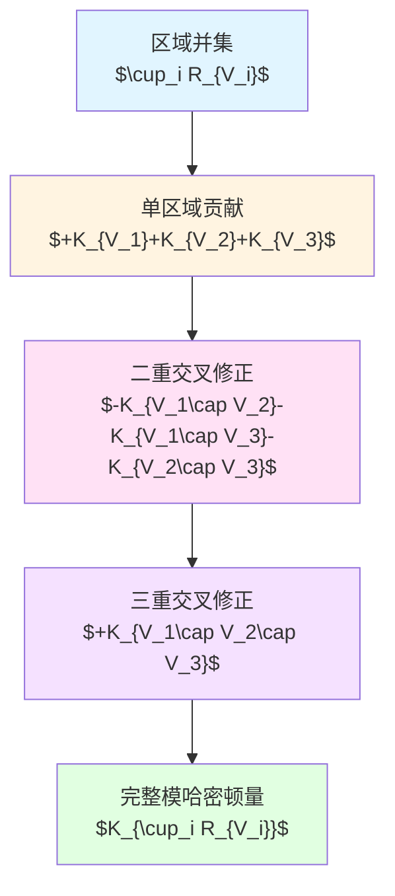
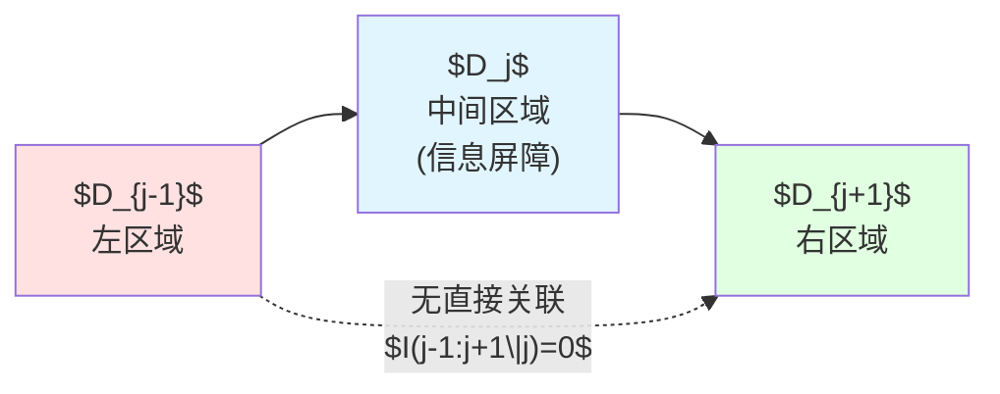
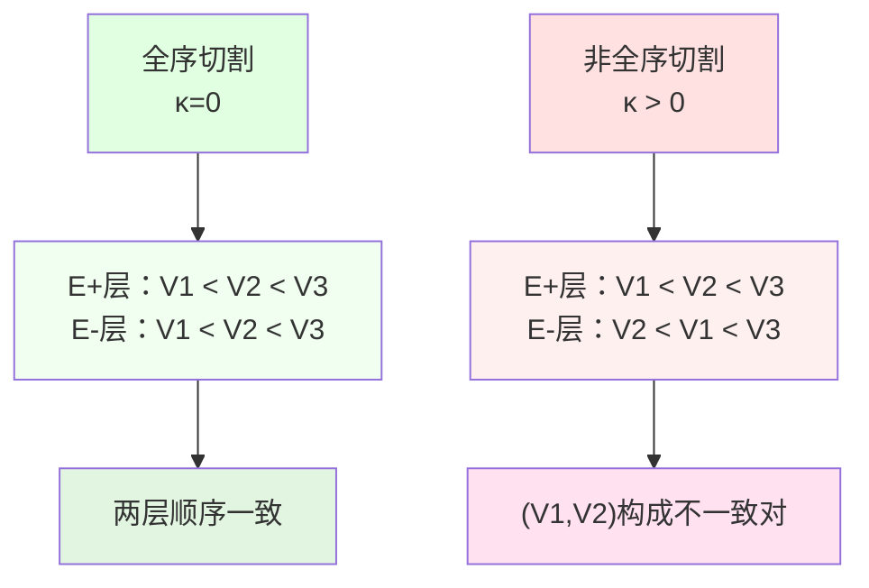
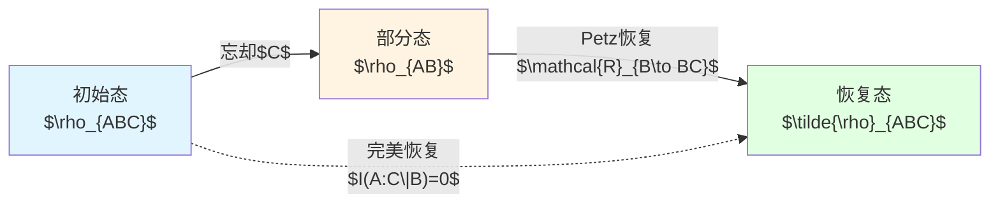
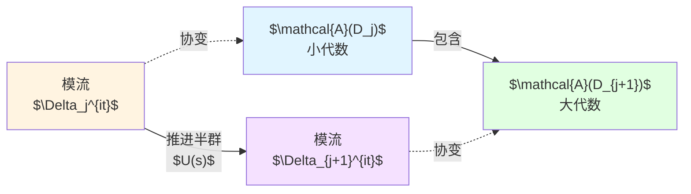
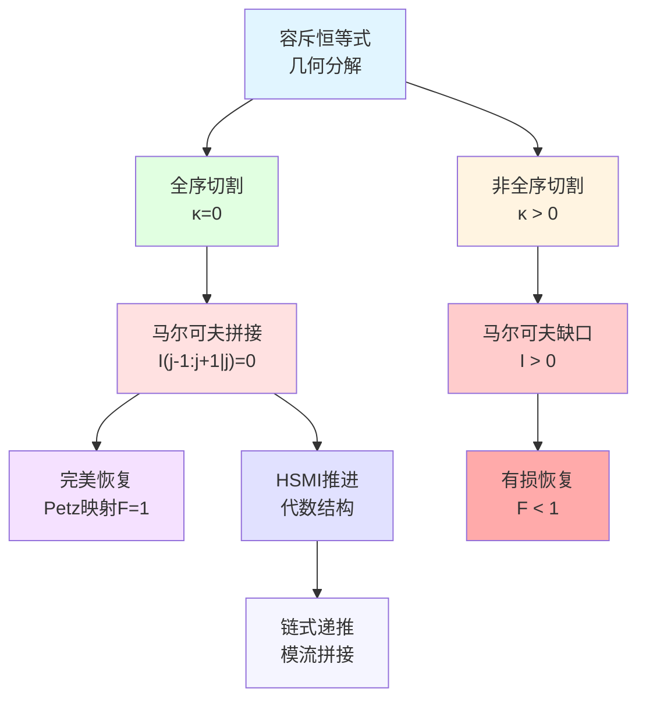

# 第三章：马尔可夫拼接与信息恢复

**源理论**：`euler-gls-extend/null-modular-double-cover-causal-diamond-chain.md`，§3.2-3.4

---

## 引言

在上一章中，我们建立了因果菱形链的Null-Modular双覆盖结构。现在面临关键问题：**如何将多个相邻的因果菱形"拼接"成更大的复合区域？**

这不是简单的几何拼图，而是涉及深刻的信息理论原理。本章将展示：
- **马尔可夫拼接**：在特定条件下，相邻区域的模哈密顿量可通过容斥原理无损拼接
- **容斥恒等式**：模哈密顿量的加法规则
- **信息恢复**：通过Petz映射从部分信息重构完整状态
- **非全序缺口**：违反理想条件时的信息损失定量刻画

**日常类比**：
想象你要拼接三段录音：A→B→C。如果B段包含了A与C之间的所有关联信息，那么你可以**无损拼接**A-B-C。但如果A和C之间存在B段丢失的"隐藏关联"，拼接就会产生**信息缺口**。

---

## 1. 容斥恒等式：模哈密顿量的加减法

### 1.1 单调半空间的容斥

考虑同一零测度超平面（如$E^+$）上的多个半空间区域$\{R_{V_i}\}_{i=1}^N$，其中$V_i(x_\perp)$为横向依赖的阈值函数。

**定理 B（容斥恒等式）**：
$$
K_{\cup_i R_{V_i}}
=\sum_{k=1}^N(-1)^{k-1}\!\!\sum_{1\le i_1<\cdots<i_k\le N}\!
K_{R_{V_{i_1}}\cap\cdots\cap R_{V_{i_k}}}
$$

**证明核心**：逐点几何恒等式
$$
(v-\min_i V_i)_+ = \sum_{k\ge1}(-1)^{k-1}\sum_{|I|=k}(v-\max_{i\in I}V_i)_+
$$

乘以二阶响应核$2\pi T_{vv}$并积分即得二次型容斥。

**Mermaid图解：容斥原理**



**日常类比**：
三个圆的面积：$S_{总} = S_1 + S_2 + S_3 - S_{12} - S_{13} - S_{23} + S_{123}$。
模哈密顿量的容斥遵循完全相同的逻辑！

### 1.2 分布式正则化与闭性

**技术要点**：指示函数$\mathbf{1}_{[a,\infty)}$不光滑，需平滑化：

$$
\mathbf{1}_{[a,\infty)}^\eta := \rho_\eta * \mathbf{1}_{[a,\infty)}
$$

其中$\rho_\eta$为标准平滑核。定义正部函数的平滑版本：

$$
(x)_+^\eta := \int_{-\infty}^{x}\mathbf{1}_{[0,\infty)}^\eta(t)\,dt
$$

**容斥恒等式的严格形式**：

1. **平滑化**：对每个$V_i$构造$V_i^\eta$
2. **容斥**：证明平滑版本的容斥恒等式
3. **极限**：令$\eta\to0^+$，用主控收敛定理交换极限与积分

**命题 B（闭性）**：
设$\mathfrak{k}:=\mathfrak{k}_{\cup_i R_{V_i}}$为容器域的闭二次型，下半界为$a\in\mathbb{R}$。取任意$c>-a$，定义**移位图范数**：

$$
|\psi|_{\mathfrak{k},c}^2 := |\psi|^2 + \big(\mathfrak{k}[\psi]+c|\psi|^2\big)
$$

若$\psi_n\to\psi$在移位图范数下收敛，则容斥恒等式两侧的二次型值同时收敛。

**日常类比**：
移位图范数就像"加权距离"：不仅考虑向量本身的长度，还考虑其"能量"（二次型值）。这保证了极限过程的数学稳定性。

---

## 2. 马尔可夫拼接：全序切割的完美拼接

### 2.1 三段马尔可夫性

考虑三个相邻因果菱形$D_{j-1}$、$D_j$、$D_{j+1}$，在**同一零测度超平面上全序切割**。

**定理 C（马尔可夫拼接）**：

真空态满足以下两个等价条件：

**(1) 条件互信息为零**：
$$
I(D_{j-1}:D_{j+1}\mid D_j) = 0
$$

**(2) 模哈密顿量恒等式**：
$$
K_{D_{j-1}\cup D_j} + K_{D_j\cup D_{j+1}} - K_{D_j} - K_{D_{j-1}\cup D_j\cup D_{j+1}} = 0
$$

**物理意义**：
- **条件互信息为零**意味着：给定中间区域$D_j$的信息后，左边$D_{j-1}$与右边$D_{j+1}$之间**没有额外关联**
- 这就是**马尔可夫性**：$D_j$"屏蔽"了$D_{j-1}$与$D_{j+1}$之间的关联

**Mermaid图解：马尔可夫拼接**



**日常类比**：
三人传话游戏A→B→C：
- 如果B完整记录了A的原话，C从B处获得的信息与直接从A获得的信息**完全相同**
- 此时$I(A:C|B)=0$，B起到"完美中介"作用
- 如果B漏掉了一些内容，则$I(A:C|B)>0$，出现**信息缺口**

### 2.2 容斥与马尔可夫的联立

**推导**：由容斥恒等式

$$
\begin{align}
K_{D_{j-1}\cup D_j\cup D_{j+1}} &= K_{D_{j-1}} + K_{D_j} + K_{D_{j+1}} \\
&\quad - K_{D_{j-1}\cap D_j} - K_{D_j\cap D_{j+1}} - K_{D_{j-1}\cap D_{j+1}} \\
&\quad + K_{D_{j-1}\cap D_j\cap D_{j+1}}
\end{align}
$$

在全序切割下，相邻区域的交集退化：
- $D_{j-1}\cap D_j$的边界收缩为零测度集
- $D_{j-1}\cap D_{j+1} = \emptyset$（不相邻）

结合**强次可加性**（split property）：边界项消失。

再利用相对熵恒等式：
$$
S(\rho_{ABC}\|\rho_A\otimes\rho_B\otimes\rho_C) = S_{AB} + S_{BC} - S_A - S_B - S_C - S_{ABC}
$$

与模哈密顿量通过一阶变分联系（$\delta K = 2\pi \delta S$），最终得到马尔可夫拼接。

### 2.3 相对熵的下半连续性

**命题 C.2**：
相对熵$S(\rho\|\sigma)$对弱$*$拓扑下半连续，且满足**数据处理不等式**：

$$
S(\rho\|\sigma) \ge S(\Phi\rho\|\Phi\sigma)
$$

对任意CPTP映射$\Phi$。

**应用**：
设有单调近似$R_{V_\alpha}\uparrow R_V$，令$\Phi_\alpha$为对$R_{V_\alpha}$的限制通道，则：

$$
\liminf_{\alpha\to\infty} I_{\alpha}(A:C\mid B) \ge I(A:C\mid B)
$$

这保证了马尔可夫性可以从离散近似**稳定传递**到连续极限。

---

## 3. 非全序缺口：层状度与信息损失

### 3.1 层状度定义

当切割**不是全序**时（例如不同横向点$x_\perp$处的切割顺序不同），马尔可夫性失效。

**定义（层状度）**：
令$V_i^\pm(x_\perp)$分别为$E^\pm$两层上的阈值函数，定义：

$$
\boxed{\kappa(x_\perp) := \#\{(a,b):a<b,\ (V_a^+-V_b^+)(V_a^--V_b^-)<0\}}
$$

**物理意义**：
- $\kappa(x_\perp)$统计在横向坐标$x_\perp$处，两层$E^+$与$E^-$上切割顺序的**不一致对**数量
- 全序时：$\kappa\equiv 0$（两层顺序完全一致）
- 非全序时：$\kappa>0$（出现"交叉"）

**Mermaid图解：层状度**



**日常类比**：
两条平行车道的车流：
- **全序**：两车道上车辆顺序完全一致（$\kappa=0$）
- **非全序**：两车道上车辆顺序不同（有超车），$\kappa$统计"顺序颠倒"的车对数量

### 3.2 马尔可夫缺口线密度

**定理 C'（非全序的马尔可夫缺口）**：

定义**马尔可夫缺口线密度**$\iota(v,x_\perp)\ge0$，满足：

$$
I(D_{j-1}:D_{j+1}\mid D_j) = \iint \iota(v,x_\perp)\,dv\,d^{d-2}x_\perp
$$

且$\iota$对$\kappa$**单调非降**。

**物理意义**：
- $\iota(v,x_\perp)$刻画在时空点$(v,x_\perp)$处的**局域信息泄漏率**
- 积分得到总的条件互信息$I(D_{j-1}:D_{j+1}\mid D_j)$
- 全序时$\kappa=0$，则$\iota=0$，$I=0$（完美马尔可夫）
- 非全序时$\kappa>0$，则$\iota>0$，$I>0$（出现缺口）

**引理 C.1（层状度—缺口比较）**：

设$V_i^\pm$分段$C^1$且交叉次数有限，则存在常数$c_*>0$使：

$$
\iota(v,x_\perp) \ge c_*\,\kappa(x_\perp)\,\mathbf{1}_{\{v\in[v_-(x_\perp),v_+(x_\perp)]\}}
$$

其中$v_-(x_\perp):=\min_i V_i^+(x_\perp)$，$v_+(x_\perp):=\max_i V_i^+(x_\perp)$。

**定量下界**：
结合Fawzi-Renner不等式：

$$
I(A:C\mid B) \ge -2\ln F(\rho_{ABC},\rho_A\otimes\rho_{BC})
$$

可得缺口的显式下界估计。

**日常类比**：
高速公路的交叉路段（非全序切割）：
- 车流交错点越多（$\kappa$越大）
- 交通管理难度越大（$\iota$越高）
- 总的交通延误（$I$）正比于交错复杂度

---

## 4. Petz恢复映射：信息的重构

### 4.1 问题设定

**量子恢复问题**：
- 初始态：$\rho_{ABC}$（三区域复合态）
- 操作：忘却$C$子系统，得到$\rho_{AB}=\operatorname{Tr}_C[\rho_{ABC}]$
- 问题：能否从$\rho_{AB}$**恢复**原始的$\rho_{ABC}$？

**定理 D（Petz恢复映射）**：

记$A=D_{j-1}$，$B=D_j$，$C=D_{j+1}$。定义忘却通道：

$$
\Phi_{BC\to B}(X_{BC}) = \operatorname{Tr}_C[X_{BC}]
$$

其伴随：
$$
\Phi^*(Y_B) = Y_B\otimes\mathbb{I}_C
$$

取参考态$\sigma_{BC}=\rho_{BC}$（自参照），**Petz恢复映射**定义为：

$$
\boxed{\mathcal{R}_{B\to BC}(X_B) = \sigma_{BC}^{1/2}\big(\sigma_B^{-1/2}X_B\,\sigma_B^{-1/2}\otimes\mathbb{I}_C\big)\sigma_{BC}^{1/2}}
$$

其中逆在$\mathrm{supp}(\sigma_B)$上取伪逆。

**完美恢复条件**：

$$
(\mathrm{id}_A\otimes \mathcal{R}_{B\to BC})(\rho_{AB}) = \rho_{ABC}
$$

**当且仅当**
$$
I(A:C\mid B) = 0
$$

**Mermaid图解：Petz恢复**



**日常类比**：
- **初始**：你有完整的视频文件（$\rho_{ABC}$）
- **丢失**：删除了音频轨道（忘却$C$），只剩画面（$\rho_{AB}$）
- **恢复**：Petz映射试图从画面重构音频
  - 如果画面包含字幕且$I(A:C|B)=0$，可以**完美恢复**对白
  - 如果画面缺少关键信息（$I(A:C|B)>0$），恢复不完美

### 4.2 旋转平均与稳定性

**技术要点**：未旋转的Petz映射可能不满足保真度不等式，需要**旋转平均**。

**旋转平均Petz映射**$\mathcal{R}^{\mathrm{rot}}_{B\to BC}$满足：

$$
I(A:C\mid B) \ge -2\ln F\left(\rho_{ABC},\ (\mathrm{id}_A\otimes \mathcal{R}^{\mathrm{rot}}_{B\to BC})(\rho_{AB})\right)
$$

等价地，**保真度下界**：

$$
F \ge e^{-I(A:C\mid B)/2}
$$

**物理意义**：
- 条件互信息$I(A:C\mid B)$越小，恢复保真度$F$越高
- 当$I=0$时，$F=1$（完美恢复）
- 当$I>0$时，$F<1$（有损恢复）

**约定（保真度定义）**：
本文采用**Uhlmann保真度**（未平方）：

$$
F(\rho,\sigma) := \big|\sqrt{\rho}\sqrt{\sigma}\big|_1 \in [0,1]
$$

**Fawzi-Renner不等式**：

$$
I(A:C\mid B) \ge -2\ln F
$$

提供了条件互信息的可操作下界。

### 4.3 恢复误差的几何图像

**直观理解**：

设态空间为高维希尔伯特空间，则：
- **马尔可夫态流形**：满足$I(A:C\mid B)=0$的态构成低维子流形
- **非马尔可夫态**：偏离该流形，偏离程度由$I(A:C\mid B)$度量
- **Petz恢复**：将$\rho_{AB}$"投影"回马尔可夫流形
- **保真度$F$**：度量投影前后的距离

**日常类比**：
GPS定位误差：
- 理想GPS信号（马尔可夫态）：三颗卫星信号$A,B,C$满足$I(A:C|B)=0$
- 实际信号（有误差）：信号间有噪声关联，$I(A:C|B)>0$
- 定位算法（Petz恢复）：尝试从$A,B$恢复$C$的信息
- 定位精度（保真度$F$）：取决于信号噪声水平$I(A:C|B)$

---

## 5. 半侧模包含：代数推进的骨架

### 5.1 HSMI的定义

**半侧模包含**（Half-Sided Modular Inclusion，HSMI）是代数量子场论中的核心概念。

**定义**：
设$\mathcal{A}(D_j)\subset\mathcal{A}(D_{j+1})$为两个冯·诺依曼代数的包含关系，真空态$\Omega$为循环分离矢量。称该包含为**右HSMI**，如果存在正能量一参数半群$\{U(s)\}_{s\ge0}$满足：

1. **协变性**：
$$
U(s)\mathcal{A}(D_j)U(s)^{-1} \subset \mathcal{A}(D_j),\quad \forall s\ge0
$$

2. **模流关系**：
$$
\Delta_{\mathcal{A}(D_{j+1})}^{\mathrm{i}t} = U(t)\Delta_{\mathcal{A}(D_j)}^{\mathrm{i}t}U(-t)
$$

其中$\Delta$为Tomita-Takesaki模算子。

**定理 E（HSMI推进）**：

若$(\mathcal{A}(D_j)\subset\mathcal{A}(D_{j+1}),\Omega)$为右HSMI，则存在正能量一参数半群与$\Delta_{\mathcal{A}(D_{j+1})}^{\mathrm{i}t}$协变，并把$\mathcal{A}(D_j)$内禀推进至$\mathcal{A}(D_{j+1})$。

**物理意义**：
- HSMI提供了因果菱形链的**代数递进结构**
- 模流$\Delta^{\mathrm{i}t}$沿链几何化为Lorentz推变（Bisognano-Wichmann性质）
- 正能量条件保证了量子场论的因果结构

**Mermaid图解：HSMI推进**



**日常类比**：
量子信息的"递推计算"：
- $\mathcal{A}(D_j)$：当前已知的观测量集合
- $\mathcal{A}(D_{j+1})$：扩展后的观测量集合
- HSMI：保证扩展过程保持代数结构
- 模流$\Delta^{\mathrm{i}t}$：观测量的"时间演化"规则
- 推进半群$U(s)$：从小集合到大集合的"演化算子"

### 5.2 Wiesbrock-Borchers结构定理

**Wiesbrock-Borchers定理**：
HSMI等价于存在一参数酉群$\{U(s)\}$满足：

1. **Borchers交换关系**：
$$
[U(s),\Delta_{\mathcal{A}(D_{j+1})}^{\mathrm{i}t}] = 0,\quad \forall s,t
$$

2. **正能量条件**：
$$
\langle\Omega,U(s)\Omega\rangle = e^{-Es},\quad E\ge0
$$

3. **推进性质**：
$$
U(s)\mathcal{A}(D_j)U(s)^{-1} \subseteq \mathcal{A}(D_j)
$$

**应用**：
在因果菱形链中，HSMI保证了链式推进的**代数一致性**：
- 容斥恒等式（几何层面）
- 模哈密顿量拼接（物理层面）
- 代数包含关系（算子层面）

三者**完全兼容**。

---

## 6. 应用：QNEC链式加强与纠缠楔拼接

### 6.1 QNEC链式加强

**量子零能条件**（Quantum Null Energy Condition，QNEC）：

$$
\langle T_{vv}\rangle \ge \frac{1}{2\pi}\frac{\partial^2 S}{\partial v^2}
$$

在真空态附近，QNEC饱和：
$$
\langle T_{vv}\rangle_{\rm vac} = \frac{1}{2\pi}\frac{\partial^2 S_{\rm vac}}{\partial v^2}
$$

**链式加强**：
结合容斥恒等式与QNEC，得到**联合区域能量-熵变分的容斥下界**：

$$
\langle T_{vv}\rangle_{\cup_i R_{V_i}} \ge \frac{1}{2\pi}\frac{\partial^2 S_{\cup_i R_{V_i}}}{\partial V_1\partial V_2\cdots\partial V_N}
$$

全序时该下界取等，等价于马尔可夫饱和。

### 6.2 纠缠楔拼接与角点荷

**全息对偶**（AdS/CFT）：
边界容斥/马尔可夫在体区对应：
- **极值面的法向模流拼接**
- **角点荷的可加性**

**JLMS等式**（Jafferis-Lewkowycz-Maldacena-Suh）：

$$
S_{\rm boundary}(R) = S_{\rm bulk}(EW[R]) + \frac{A(\partial EW[R])}{4G_N}
$$

其中$EW[R]$为纠缠楔（Entanglement Wedge）。

**拼接一致性**：
在弱回馈与光滑角点条件下，边界的容斥-马尔可夫**提升**为体区的模流拼接，账本一致性维持。

**日常类比**：
地图与地形的对应：
- 边界容斥：地图上区域的拼接
- 体区模流：地形的"演化规则"
- JLMS等式：地图面积$\leftrightarrow$地形熵
- 拼接一致性：地图拼接规则与地形演化规则兼容

---

## 7. 数值验证与实验方案

### 7.1 容斥验证

**二维CFT三块链**：
取三个因果菱形$D_1,D_2,D_3$，数值评估：

$$
\varepsilon_{\rm excl} := |K_{12}+K_{23}-K_2-K_{123}|
$$

**预期结果**：
- 全序切割：$\varepsilon_{\rm excl}\approx 0$（数值误差内）
- 非全序切割：$\varepsilon_{\rm excl}>0$，且正比于$\kappa$

**代码框架**（概念）：
```
输入：三个区域的边界参数 V1, V2, V3
输出：容斥误差 ε_excl

1. 计算单区域模哈密顿量：K1, K2, K3
2. 计算并集模哈密顿量：K12, K23, K123
3. 计算容斥误差：ε_excl = |K12 + K23 - K2 - K123|
4. 绘制误差条
```

### 7.2 马尔可夫拼接验证

**条件互信息测量**：

$$
I(1:3|2) = S_{12}+S_{23}-S_2-S_{123}
$$

**预期结果**：
- 全序：$I(1:3|2)\approx 0$
- 非全序：$I(1:3|2)>0$，且满足$I\ge c_*\int\kappa\,dx_\perp$

**与容斥的一致性**：
通过一阶变分关系$\delta K = 2\pi \delta S$，验证：

$$
\varepsilon_{\rm excl} \approx 2\pi\,I(1:3|2)
$$

### 7.3 Petz恢复保真度

**操作步骤**：
1. 准备初始态$\rho_{123}$（三区域真空）
2. 忘却$D_3$，得到$\rho_{12}$
3. 应用Petz恢复$\mathcal{R}_{2\to 23}$，得到$\tilde{\rho}_{123}$
4. 计算保真度$F(\rho_{123},\tilde{\rho}_{123})$

**预期结果**：
- 全序（$I(1:3|2)=0$）：$F\approx 1$
- 非全序（$I(1:3|2)>0$）：$F\approx e^{-I(1:3|2)/2}$

---

## 8. 本章总结

本章建立了因果菱形链的马尔可夫拼接理论，核心结果包括：

### 8.1 核心公式

**容斥恒等式**：
$$
K_{\cup_i R_{V_i}}
=\sum_{k=1}^N(-1)^{k-1}\!\!\sum_{1\le i_1<\cdots<i_k\le N}\!
K_{R_{V_{i_1}}\cap\cdots\cap R_{V_{i_k}}}
$$

**马尔可夫拼接**：
$$
I(D_{j-1}:D_{j+1}\mid D_j) = 0 \quad\Leftrightarrow\quad K_{12}+K_{23}-K_2-K_{123}=0
$$

**非全序缺口**：
$$
I(D_{j-1}:D_{j+1}\mid D_j) = \iint \iota(v,x_\perp)\,dv\,d^{d-2}x_\perp \ge c_*\int\kappa(x_\perp)\,d^{d-2}x_\perp
$$

**Petz恢复保真度**：
$$
F \ge e^{-I(A:C\mid B)/2}
$$

### 8.2 物理图像

**Mermaid总结图**



### 8.3 关键洞察

1. **容斥原理的普适性**：
   - 从集合论的容斥公式出发
   - 推广到二次型、模哈密顿量、相对熵
   - 统一的数学框架

2. **马尔可夫性的几何根源**：
   - 全序切割$\Leftrightarrow$层状度$\kappa=0$
   - 零测度边界的拓扑性质
   - 模流的几何实现

3. **信息恢复的量子极限**：
   - Petz映射达到最优恢复
   - 保真度由条件互信息决定
   - Fawzi-Renner不等式给出可操作下界

4. **代数与几何的双重结构**：
   - HSMI：代数推进
   - 模流：几何推进
   - 两者通过Bisognano-Wichmann性质统一

### 8.4 下一章预告

下一章将讨论**散射刻度与窗化读数**：
- 如何通过散射相位$\arg\det S$测量模哈密顿量？
- Birman-Krein公式与Wigner-Smith群延迟
- 窗化技术与奇偶阈值稳定性

---

**本章结束**

---

**源理论**：`euler-gls-extend/null-modular-double-cover-causal-diamond-chain.md`，§3.2-3.4
