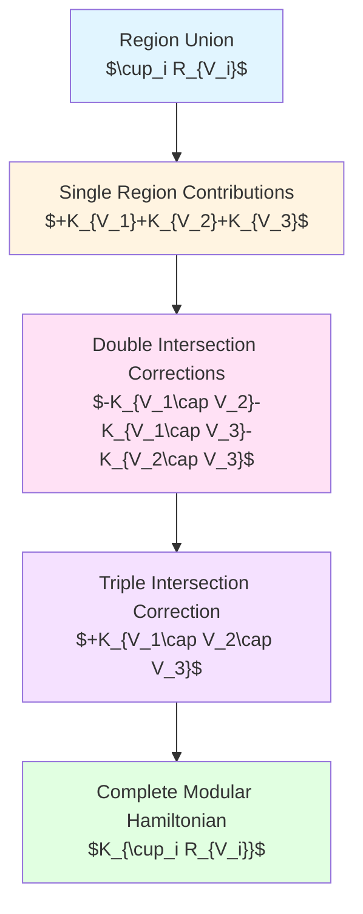
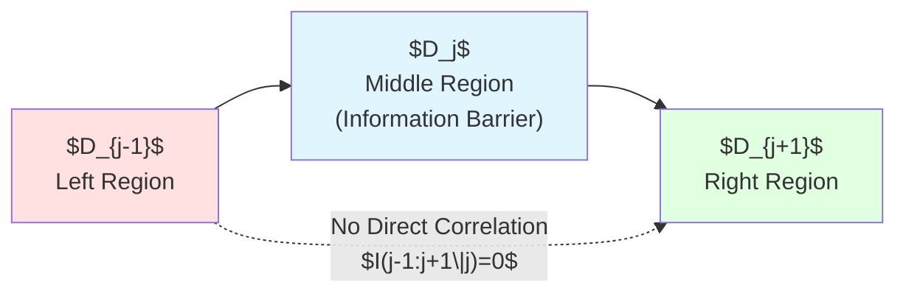
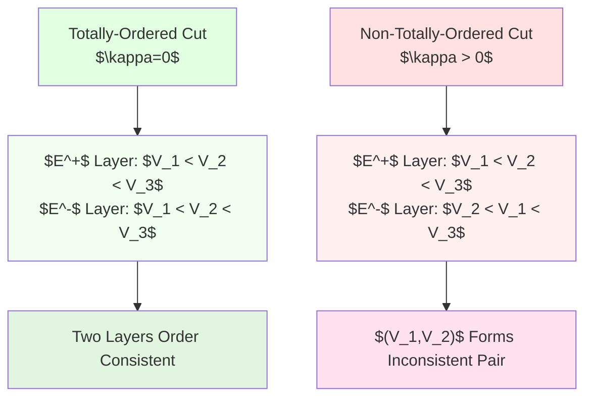
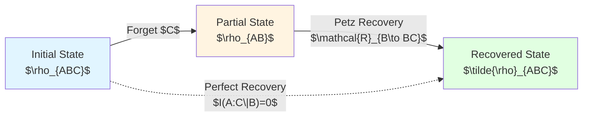
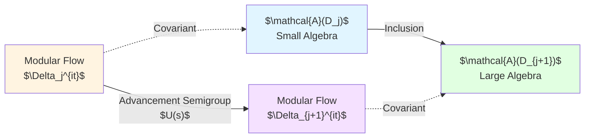
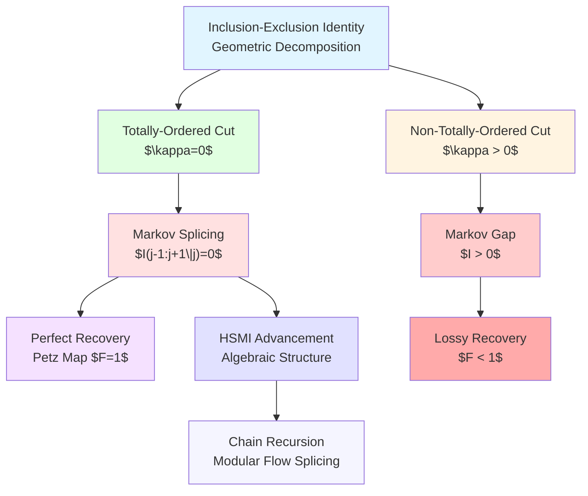

# Chapter 3: Markov Splicing and Information Recovery

**Source Theory**: `euler-gls-extend/null-modular-double-cover-causal-diamond-chain.md`, §3.2-3.4

---

## Introduction

In the previous chapter, we established the Null-Modular double cover structure of causal diamond chains. Now we face a key question: **How to "splice" multiple adjacent causal diamonds into larger composite regions?**

This is not simple geometric puzzle-solving, but involves profound information-theoretic principles. This chapter will demonstrate:
- **Markov Splicing**: Under specific conditions, modular Hamiltonians of adjacent regions can be losslessly spliced through inclusion-exclusion principle
- **Inclusion-Exclusion Identity**: Addition rules for modular Hamiltonians
- **Information Recovery**: Reconstructing complete states from partial information through Petz maps
- **Non-Totally-Ordered Gap**: Quantitative characterization of information loss when ideal conditions are violated

**Everyday Analogy**:
Imagine splicing three audio segments: A→B→C. If segment B contains all correlation information between A and C, then you can **losslessly splice** A-B-C. But if there exists "hidden correlation" between A and C that segment B lacks, splicing will produce an **information gap**.

---

## 1. Inclusion-Exclusion Identity: Addition and Subtraction of Modular Hamiltonians

### 1.1 Inclusion-Exclusion of Monotonic Half-Spaces

Consider multiple half-space regions $\{R_{V_i}\}_{i=1}^N$ on the same null hyperplane (e.g., $E^+$), where $V_i(x_\perp)$ are transversely dependent threshold functions.

**Theorem B (Inclusion-Exclusion Identity)**:
$$
K_{\cup_i R_{V_i}}
=\sum_{k=1}^N(-1)^{k-1}\!\!\sum_{1\le i_1<\cdots<i_k\le N}\!
K_{R_{V_{i_1}}\cap\cdots\cap R_{V_{i_k}}}
$$

**Proof Core**: Pointwise geometric identity
$$
(v-\min_i V_i)_+ = \sum_{k\ge1}(-1)^{k-1}\sum_{|I|=k}(v-\max_{i\in I}V_i)_+
$$

Multiplying by second-order response kernel $2\pi T_{vv}$ and integrating gives the quadratic form inclusion-exclusion.

**Mermaid Diagram: Inclusion-Exclusion Principle**



**Everyday Analogy**:
Area of three circles: $S_{\text{total}} = S_1 + S_2 + S_3 - S_{12} - S_{13} - S_{23} + S_{123}$.
Modular Hamiltonian inclusion-exclusion follows exactly the same logic!

### 1.2 Distributed Regularization and Closure

**Technical Point**: Indicator function $\mathbf{1}_{[a,\infty)}$ is not smooth, needs smoothing:

$$
\mathbf{1}_{[a,\infty)}^\eta := \rho_\eta * \mathbf{1}_{[a,\infty)}
$$

where $\rho_\eta$ is a standard smoothing kernel. Define smoothed version of positive part function:

$$
(x)_+^\eta := \int_{-\infty}^{x}\mathbf{1}_{[0,\infty)}^\eta(t)\,dt
$$

**Strict Form of Inclusion-Exclusion Identity**:

1. **Smoothing**: Construct $V_i^\eta$ for each $V_i$
2. **Inclusion-Exclusion**: Prove inclusion-exclusion identity for smoothed version
3. **Limit**: Let $\eta\to0^+$, exchange limit and integral using dominated convergence theorem

**Proposition B (Closure)**:
Let $\mathfrak{k}:=\mathfrak{k}_{\cup_i R_{V_i}}$ be the closed quadratic form of the union domain, with lower bound $a\in\mathbb{R}$. Take any $c>-a$, define **shifted graph norm**:

$$
||\psi|_{\mathfrak{k},c}^2 := |\psi|^2 + \big(\mathfrak{k}[\psi]+c|\psi|^2\big)
$$

If $\psi_n\to\psi$ converges in shifted graph norm, then quadratic form values on both sides of inclusion-exclusion identity converge simultaneously.

**Everyday Analogy**:
Shifted graph norm is like "weighted distance": not only considers the length of the vector itself, but also its "energy" (quadratic form value). This guarantees mathematical stability of the limit process.

---

## 2. Markov Splicing: Perfect Splicing of Totally-Ordered Cuts

### 2.1 Three-Segment Markovianity

Consider three adjacent causal diamonds $D_{j-1}$, $D_j$, $D_{j+1}$, with **totally-ordered cuts on the same null hyperplane**.

**Theorem C (Markov Splicing)**:

Vacuum state satisfies the following two equivalent conditions:

**(1) Conditional Mutual Information is Zero**:
$$
I(D_{j-1}:D_{j+1}\mid D_j) = 0
$$

**(2) Modular Hamiltonian Identity**:
$$
K_{D_{j-1}\cup D_j} + K_{D_j\cup D_{j+1}} - K_{D_j} - K_{D_{j-1}\cup D_j\cup D_{j+1}} = 0
$$

**Physical Meaning**:
- **Conditional mutual information zero** means: Given information about middle region $D_j$, there is **no additional correlation** between left $D_{j-1}$ and right $D_{j+1}$
- This is **Markovianity**: $D_j$ "screens" the correlation between $D_{j-1}$ and $D_{j+1}$

**Mermaid Diagram: Markov Splicing**



**Everyday Analogy**:
Three-person message relay game A→B→C:
- If B completely records A's original words, information C obtains from B is **exactly the same** as directly from A
- At this point $I(A:C|B)=0$, B serves as "perfect intermediary"
- If B misses some content, then $I(A:C|B)>0$, an **information gap** appears

### 2.2 Combining Inclusion-Exclusion and Markovianity

**Derivation**: From inclusion-exclusion identity

$$
\begin{align}
K_{D_{j-1}\cup D_j\cup D_{j+1}} &= K_{D_{j-1}} + K_{D_j} + K_{D_{j+1}} \\
&\quad - K_{D_{j-1}\cap D_j} - K_{D_j\cap D_{j+1}} - K_{D_{j-1}\cap D_{j+1}} \\
&\quad + K_{D_{j-1}\cap D_j\cap D_{j+1}}
\end{align}
$$

Under totally-ordered cuts, intersections of adjacent regions degenerate:
- Boundary of $D_{j-1}\cap D_j$ shrinks to null set
- $D_{j-1}\cap D_{j+1} = \emptyset$ (not adjacent)

Combined with **strong subadditivity** (split property): boundary terms vanish.

Using relative entropy identity:
$$
S(\rho_{ABC}\|\rho_A\otimes\rho_B\otimes\rho_C) = S_{AB} + S_{BC} - S_A - S_B - S_C - S_{ABC}
$$

Connected to modular Hamiltonian through first-order variation ($\delta K = 2\pi \delta S$), finally obtaining Markov splicing.

### 2.3 Lower Semicontinuity of Relative Entropy

**Proposition C.2**:
Relative entropy $S(\rho\|\sigma)$ is lower semicontinuous in weak$*$ topology, and satisfies **data processing inequality**:

$$
S(\rho\|\sigma) \ge S(\Phi\rho\|\Phi\sigma)
$$

for any CPTP map $\Phi$.

**Application**:
Given monotonic approximation $R_{V_\alpha}\uparrow R_V$, let $\Phi_\alpha$ be restriction channel to $R_{V_\alpha}$, then:

$$
\liminf_{\alpha\to\infty} I_{\alpha}(A:C\mid B) \ge I(A:C\mid B)
$$

This guarantees that Markovianity can be **stably transmitted** from discrete approximation to continuous limit.

---

## 3. Non-Totally-Ordered Gap: Stratification Degree and Information Loss

### 3.1 Definition of Stratification Degree

When cuts are **not totally ordered** (e.g., cut orders differ at different transverse points $x_\perp$), Markovianity fails.

**Definition (Stratification Degree)**:
Let $V_i^\pm(x_\perp)$ be threshold functions on layers $E^\pm$ respectively, define:

$$
\boxed{\kappa(x_\perp) := \#\{(a,b):a<b,\ (V_a^+-V_b^+)(V_a^--V_b^-)<0\}}
$$

**Physical Meaning**:
- $\kappa(x_\perp)$ counts the number of **inconsistent pairs** of cut orders on layers $E^+$ and $E^-$ at transverse coordinate $x_\perp$
- Totally ordered: $\kappa\equiv 0$ (orders on two layers completely consistent)
- Non-totally ordered: $\kappa>0$ (appearance of "crossing")

**Mermaid Diagram: Stratification Degree**



**Everyday Analogy**:
Traffic flow on two parallel lanes:
- **Totally ordered**: Vehicle orders on two lanes completely consistent ($\kappa=0$)
- **Non-totally ordered**: Vehicle orders on two lanes differ (overtaking), $\kappa$ counts number of "order-reversed" vehicle pairs

### 3.2 Markov Gap Line Density

**Theorem C' (Markov Gap for Non-Totally-Ordered)**:

Define **Markov gap line density** $\iota(v,x_\perp)\ge0$, satisfying:

$$
I(D_{j-1}:D_{j+1}\mid D_j) = \iint \iota(v,x_\perp)\,dv\,d^{d-2}x_\perp
$$

and $\iota$ is **monotone non-decreasing** in $\kappa$.

**Physical Meaning**:
- $\iota(v,x_\perp)$ characterizes **local information leakage rate** at spacetime point $(v,x_\perp)$
- Integration gives total conditional mutual information $I(D_{j-1}:D_{j+1}\mid D_j)$
- Totally ordered: $\kappa=0$, then $\iota=0$, $I=0$ (perfect Markov)
- Non-totally ordered: $\kappa>0$, then $\iota>0$, $I>0$ (gap appears)

**Lemma C.1 (Stratification Degree–Gap Comparison)**:

If $V_i^\pm$ are piecewise $C^1$ with finite crossing times, then there exists constant $c_*>0$ such that:

$$
\iota(v,x_\perp) \ge c_*\,\kappa(x_\perp)\,\mathbf{1}_{\{v\in[v_-(x_\perp),v_+(x_\perp)]\}}
$$

where $v_-(x_\perp):=\min_i V_i^+(x_\perp)$, $v_+(x_\perp):=\max_i V_i^+(x_\perp)$.

**Quantitative Lower Bound**:
Combining with Fawzi-Renner inequality:

$$
I(A:C\mid B) \ge -2\ln F(\rho_{ABC},\rho_A\otimes\rho_{BC})
$$

gives explicit lower bound estimate for the gap.

**Everyday Analogy**:
Highway intersection (non-totally-ordered cut):
- More intersection points (larger $\kappa$)
- Higher traffic management difficulty (higher $\iota$)
- Total traffic delay ($I$) proportional to intersection complexity

---

## 4. Petz Recovery Map: Information Reconstruction

### 4.1 Problem Setup

**Quantum Recovery Problem**:
- Initial state: $\rho_{ABC}$ (three-region composite state)
- Operation: Forget subsystem $C$, obtain $\rho_{AB}=\operatorname{Tr}_C[\rho_{ABC}]$
- Question: Can we **recover** original $\rho_{ABC}$ from $\rho_{AB}$?

**Theorem D (Petz Recovery Map)**:

Denote $A=D_{j-1}$, $B=D_j$, $C=D_{j+1}$. Define forget channel:

$$
\Phi_{BC\to B}(X_{BC}) = \operatorname{Tr}_C[X_{BC}]
$$

Its adjoint:
$$
\Phi^*(Y_B) = Y_B\otimes\mathbb{I}_C
$$

Take reference state $\sigma_{BC}=\rho_{BC}$ (self-reference), **Petz recovery map** is defined as:

$$
\boxed{\mathcal{R}_{B\to BC}(X_B) = \sigma_{BC}^{1/2}\big(\sigma_B^{-1/2}X_B\,\sigma_B^{-1/2}\otimes\mathbb{I}_C\big)\sigma_{BC}^{1/2}}
$$

where inverse is taken as pseudo-inverse on $\mathrm{supp}(\sigma_B)$.

**Perfect Recovery Condition**:

$$
(\mathrm{id}_A\otimes \mathcal{R}_{B\to BC})(\rho_{AB}) = \rho_{ABC}
$$

**If and only if**
$$
I(A:C\mid B) = 0
$$

**Mermaid Diagram: Petz Recovery**



**Everyday Analogy**:
- **Initial**: You have complete video file ($\rho_{ABC}$)
- **Loss**: Deleted audio track (forgot $C$), only picture remains ($\rho_{AB}$)
- **Recovery**: Petz map attempts to reconstruct audio from picture
  - If picture contains subtitles and $I(A:C|B)=0$, can **perfectly recover** dialogue
  - If picture lacks key information ($I(A:C|B)>0$), recovery is imperfect

### 4.2 Rotation Average and Stability

**Technical Point**: Unrotated Petz map may not satisfy fidelity inequality, needs **rotation average**.

**Rotation-Averaged Petz Map** $\mathcal{R}^{\mathrm{rot}}_{B\to BC}$ satisfies:

$$
I(A:C\mid B) \ge -2\ln F\left(\rho_{ABC},\ (\mathrm{id}_A\otimes \mathcal{R}^{\mathrm{rot}}_{B\to BC})(\rho_{AB})\right)
$$

Equivalently, **fidelity lower bound**:

$$
F \ge e^{-I(A:C\mid B)/2}
$$

**Physical Meaning**:
- Smaller conditional mutual information $I(A:C\mid B)$, higher recovery fidelity $F$
- When $I=0$, $F=1$ (perfect recovery)
- When $I>0$, $F<1$ (lossy recovery)

**Convention (Fidelity Definition)**:
This text uses **Uhlmann fidelity** (unsquared):

$$
F(\rho,\sigma) := \big|\sqrt{\rho}\sqrt{\sigma}\big|_1 \in [0,1]
$$

**Fawzi-Renner Inequality**:

$$
I(A:C\mid B) \ge -2\ln F
$$

provides an operational lower bound for conditional mutual information.

### 4.3 Geometric Picture of Recovery Error

**Intuitive Understanding**:

Let state space be high-dimensional Hilbert space, then:
- **Markov State Manifold**: States satisfying $I(A:C\mid B)=0$ form low-dimensional submanifold
- **Non-Markov States**: Deviate from this manifold, deviation measured by $I(A:C\mid B)$
- **Petz Recovery**: "Projects" $\rho_{AB}$ back to Markov manifold
- **Fidelity $F$**: Measures distance before and after projection

**Everyday Analogy**:
GPS positioning error:
- Ideal GPS signals (Markov states): Three satellite signals $A,B,C$ satisfy $I(A:C|B)=0$
- Actual signals (with error): Signals have noise correlation, $I(A:C|B)>0$
- Positioning algorithm (Petz recovery): Attempts to recover $C$ information from $A,B$
- Positioning accuracy (fidelity $F$): Depends on signal noise level $I(A:C|B)$

---

## 5. Half-Sided Modular Inclusion: Skeleton of Algebraic Advancement

### 5.1 Definition of HSMI

**Half-Sided Modular Inclusion** (HSMI) is a core concept in algebraic quantum field theory.

**Definition**:
Let $\mathcal{A}(D_j)\subset\mathcal{A}(D_{j+1})$ be inclusion relation of two von Neumann algebras, vacuum state $\Omega$ be cyclic separating vector. This inclusion is called **right HSMI** if there exists positive energy one-parameter semigroup $\{U(s)\}_{s\ge0}$ satisfying:

1. **Covariance**:
$$
U(s)\mathcal{A}(D_j)U(s)^{-1} \subset \mathcal{A}(D_j),\quad \forall s\ge0
$$

2. **Modular Flow Relation**:
$$
\Delta_{\mathcal{A}(D_{j+1})}^{\mathrm{i}t} = U(t)\Delta_{\mathcal{A}(D_j)}^{\mathrm{i}t}U(-t)
$$

where $\Delta$ is Tomita-Takesaki modular operator.

**Theorem E (HSMI Advancement)**:

If $(\mathcal{A}(D_j)\subset\mathcal{A}(D_{j+1}),\Omega)$ is right HSMI, then there exists positive energy one-parameter semigroup covariant with $\Delta_{\mathcal{A}(D_{j+1})}^{\mathrm{i}t}$, intrinsically advancing $\mathcal{A}(D_j)$ to $\mathcal{A}(D_{j+1})$.

**Physical Meaning**:
- HSMI provides **algebraic progressive structure** of causal diamond chains
- Modular flow $\Delta^{\mathrm{i}t}$ geometrizes along chain as Lorentz boost (Bisognano-Wichmann property)
- Positive energy condition guarantees causal structure of quantum field theory

**Mermaid Diagram: HSMI Advancement**



**Everyday Analogy**:
"Recursive computation" of quantum information:
- $\mathcal{A}(D_j)$: Currently known set of observables
- $\mathcal{A}(D_{j+1})$: Extended set of observables
- HSMI: Guarantees extension process preserves algebraic structure
- Modular flow $\Delta^{\mathrm{i}t}$: "Time evolution" rules for observables
- Advancement semigroup $U(s)$: "Evolution operator" from small set to large set

### 5.2 Wiesbrock-Borchers Structure Theorem

**Wiesbrock-Borchers Theorem**:
HSMI is equivalent to existence of one-parameter unitary group $\{U(s)\}$ satisfying:

1. **Borchers Commutation Relations**:
$$
[U(s),\Delta_{\mathcal{A}(D_{j+1})}^{\mathrm{i}t}] = 0,\quad \forall s,t
$$

2. **Positive Energy Condition**:
$$
\langle\Omega,U(s)\Omega\rangle = e^{-Es},\quad E\ge0
$$

3. **Advancement Property**:
$$
U(s)\mathcal{A}(D_j)U(s)^{-1} \subseteq \mathcal{A}(D_j)
$$

**Application**:
In causal diamond chains, HSMI guarantees **algebraic consistency** of chain advancement:
- Inclusion-exclusion identity (geometric level)
- Modular Hamiltonian splicing (physical level)
- Algebraic inclusion relations (operator level)

The three are **fully compatible**.

---

## 6. Applications: QNEC Chain Strengthening and Entanglement Wedge Splicing

### 6.1 QNEC Chain Strengthening

**Quantum Null Energy Condition** (QNEC):

$$
\langle T_{vv}\rangle \ge \frac{1}{2\pi}\frac{\partial^2 S}{\partial v^2}
$$

Near vacuum state, QNEC saturates:
$$
\langle T_{vv}\rangle_{\rm vac} = \frac{1}{2\pi}\frac{\partial^2 S_{\rm vac}}{\partial v^2}
$$

**Chain Strengthening**:
Combining inclusion-exclusion identity with QNEC, obtain **inclusion-exclusion lower bound for joint region energy-entropy variation**:

$$
\langle T_{vv}\rangle_{\cup_i R_{V_i}} \ge \frac{1}{2\pi}\frac{\partial^2 S_{\cup_i R_{V_i}}}{\partial V_1\partial V_2\cdots\partial V_N}
$$

When totally ordered, this lower bound takes equality, equivalent to Markov saturation.

### 6.2 Entanglement Wedge Splicing and Corner Charge

**Holographic Duality** (AdS/CFT):
Boundary inclusion-exclusion/Markov corresponds in bulk to:
- **Normal modular flow splicing of extremal surfaces**
- **Additivity of corner charges**

**JLMS Equality** (Jafferis-Lewkowycz-Maldacena-Suh):

$$
S_{\rm boundary}(R) = S_{\rm bulk}(EW[R]) + \frac{A(\partial EW[R])}{4G_N}
$$

where $EW[R]$ is the Entanglement Wedge.

**Splicing Consistency**:
Under weak feedback and smooth corner conditions, boundary inclusion-exclusion–Markov **lifts** to bulk modular flow splicing, maintaining ledger consistency.

**Everyday Analogy**:
Correspondence between map and terrain:
- Boundary inclusion-exclusion: Splicing of regions on map
- Bulk modular flow: "Evolution rules" of terrain
- JLMS equality: Map area $\leftrightarrow$ terrain entropy
- Splicing consistency: Map splicing rules compatible with terrain evolution rules

---

## 7. Numerical Verification and Experimental Schemes

### 7.1 Inclusion-Exclusion Verification

**Two-Dimensional CFT Three-Block Chain**:
Take three causal diamonds $D_1,D_2,D_3$, numerically evaluate:

$$
\varepsilon_{\rm excl} := |K_{12}+K_{23}-K_2-K_{123}|
$$

**Expected Results**:
- Totally-ordered cuts: $\varepsilon_{\rm excl}\approx 0$ (within numerical error)
- Non-totally-ordered cuts: $\varepsilon_{\rm excl}>0$, proportional to $\kappa$

**Code Framework** (conceptual):
```
Input: Boundary parameters V1, V2, V3 of three regions
Output: Inclusion-exclusion error ε_excl

1. Compute single-region modular Hamiltonians: K1, K2, K3
2. Compute union modular Hamiltonians: K12, K23, K123
3. Compute inclusion-exclusion error: ε_excl = |K12 + K23 - K2 - K123|
4. Plot error bars
```

### 7.2 Markov Splicing Verification

**Conditional Mutual Information Measurement**:

$$
I(1:3|2) = S_{12}+S_{23}-S_2-S_{123}
$$

**Expected Results**:
- Totally ordered: $I(1:3|2)\approx 0$
- Non-totally ordered: $I(1:3|2)>0$, satisfying $I\ge c_*\int\kappa\,dx_\perp$

**Consistency with Inclusion-Exclusion**:
Through first-order variation relation $\delta K = 2\pi \delta S$, verify:

$$
\varepsilon_{\rm excl} \approx 2\pi\,I(1:3|2)
$$

### 7.3 Petz Recovery Fidelity

**Operational Steps**:
1. Prepare initial state $\rho_{123}$ (three-region vacuum)
2. Forget $D_3$, obtain $\rho_{12}$
3. Apply Petz recovery $\mathcal{R}_{2\to 23}$, obtain $\tilde{\rho}_{123}$
4. Compute fidelity $F(\rho_{123},\tilde{\rho}_{123})$

**Expected Results**:
- Totally ordered ($I(1:3|2)=0$): $F\approx 1$
- Non-totally ordered ($I(1:3|2)>0$): $F\approx e^{-I(1:3|2)/2}$

---

## 8. Chapter Summary

This chapter established Markov splicing theory for causal diamond chains, core results include:

### 8.1 Core Formulas

**Inclusion-Exclusion Identity**:
$$
K_{\cup_i R_{V_i}}
=\sum_{k=1}^N(-1)^{k-1}\!\!\sum_{1\le i_1<\cdots<i_k\le N}\!
K_{R_{V_{i_1}}\cap\cdots\cap R_{V_{i_k}}}
$$

**Markov Splicing**:
$$
I(D_{j-1}:D_{j+1}\mid D_j) = 0 \quad\Leftrightarrow\quad K_{12}+K_{23}-K_2-K_{123}=0
$$

**Non-Totally-Ordered Gap**:
$$
I(D_{j-1}:D_{j+1}\mid D_j) = \iint \iota(v,x_\perp)\,dv\,d^{d-2}x_\perp \ge c_*\int\kappa(x_\perp)\,d^{d-2}x_\perp
$$

**Petz Recovery Fidelity**:
$$
F \ge e^{-I(A:C\mid B)/2}
$$

### 8.2 Physical Picture

**Mermaid Summary Diagram**



### 8.3 Key Insights

1. **Universality of Inclusion-Exclusion Principle**:
   - Starting from set-theoretic inclusion-exclusion formula
   - Generalizing to quadratic forms, modular Hamiltonians, relative entropy
   - Unified mathematical framework

2. **Geometric Root of Markovianity**:
   - Totally-ordered cuts $\Leftrightarrow$ stratification degree $\kappa=0$
   - Topological properties of null boundaries
   - Geometric realization of modular flow

3. **Quantum Limit of Information Recovery**:
   - Petz map achieves optimal recovery
   - Fidelity determined by conditional mutual information
   - Fawzi-Renner inequality provides operational lower bound

4. **Dual Structure of Algebra and Geometry**:
   - HSMI: Algebraic advancement
   - Modular flow: Geometric advancement
   - The two unified through Bisognano-Wichmann property

### 8.4 Preview of Next Chapter

Next chapter will discuss **Scattering Scale and Windowed Readout**:
- How to measure modular Hamiltonian through scattering phase $\arg\det S$?
- Birman-Krein formula and Wigner-Smith group delay
- Windowing techniques and parity threshold stability

---

**End of Chapter**

---

**Source Theory**: `euler-gls-extend/null-modular-double-cover-causal-diamond-chain.md`, §3.2-3.4

