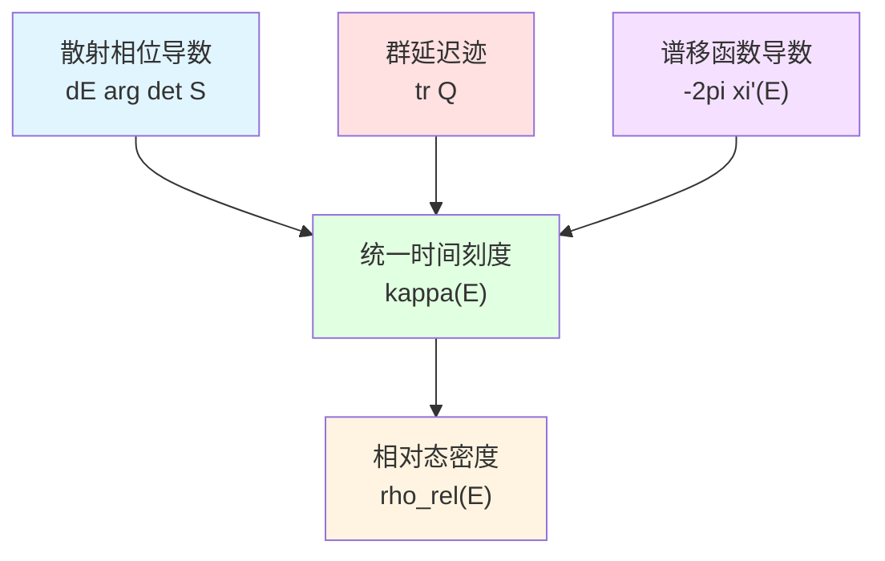
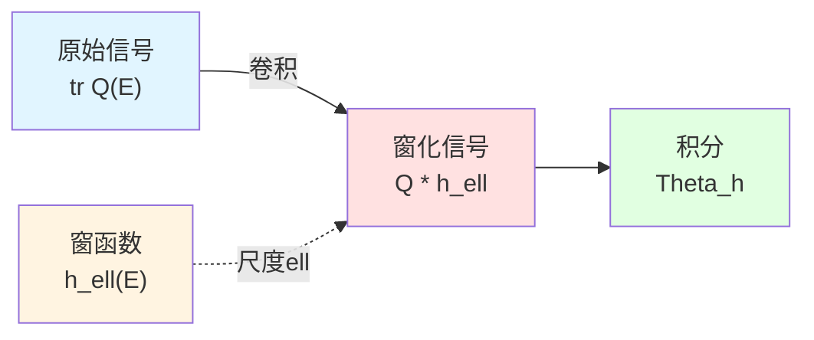
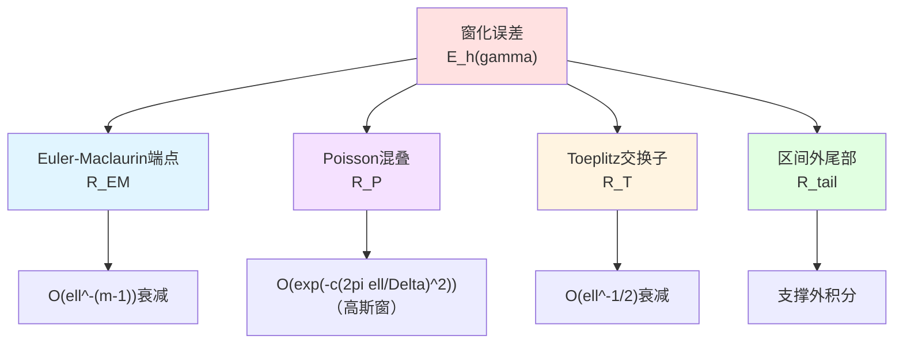
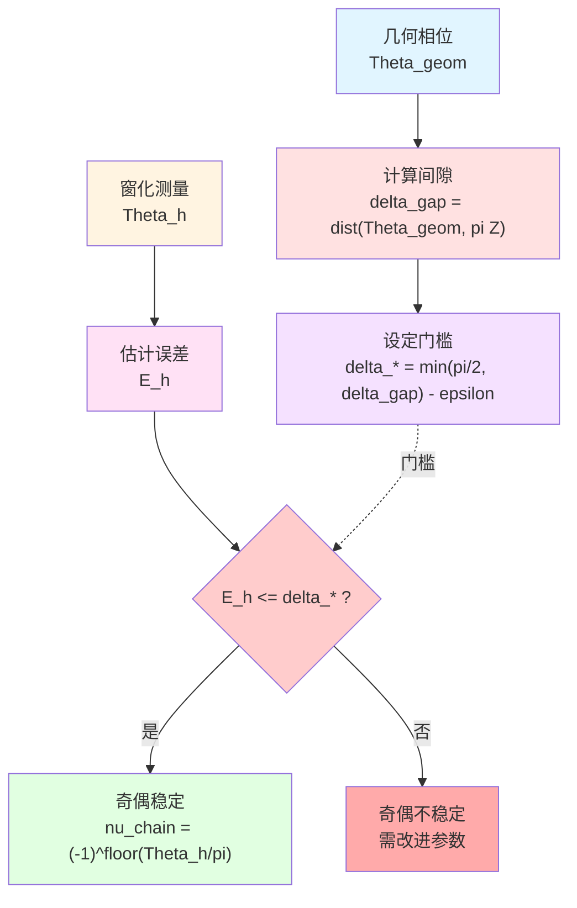
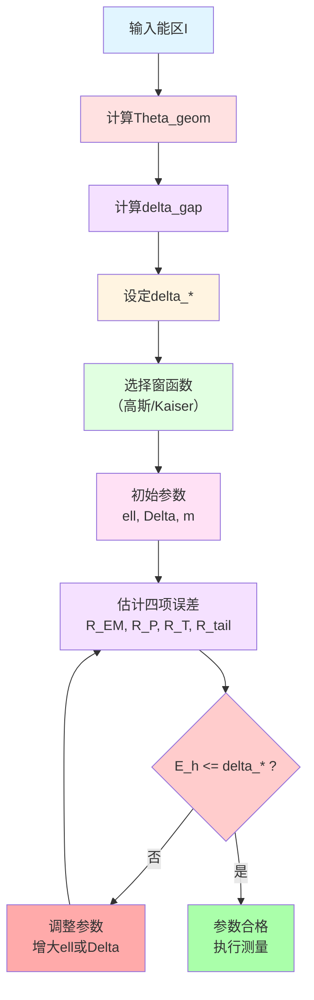
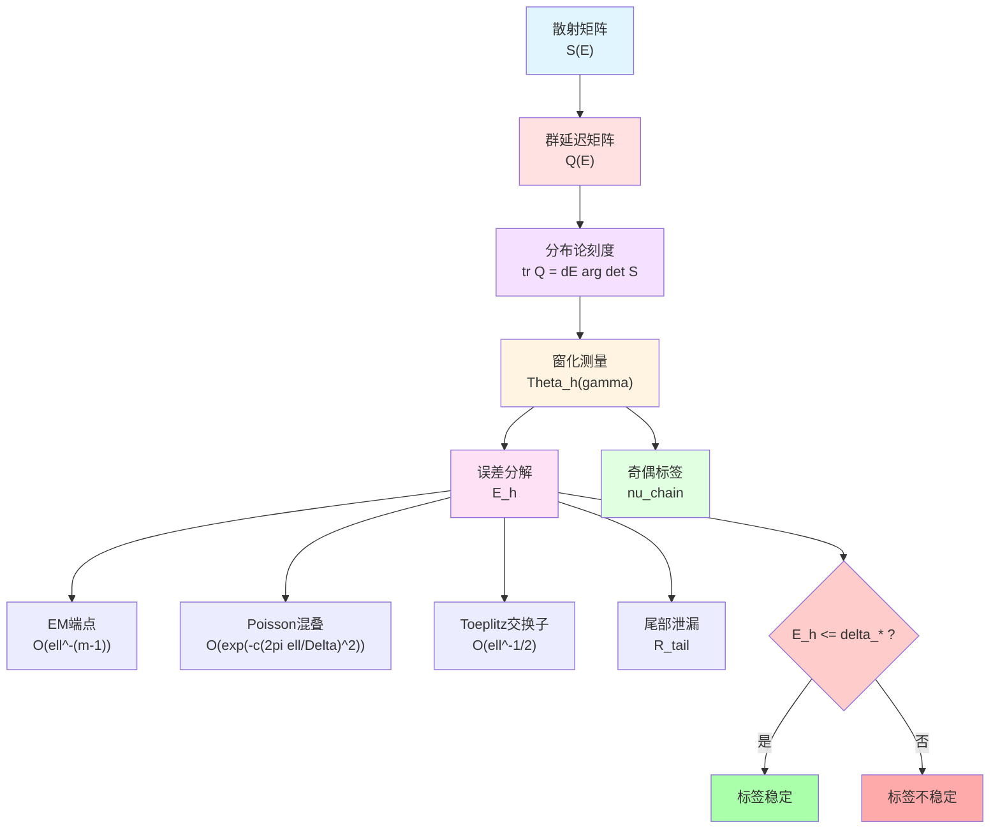

# 第四章：散射刻度与窗化读数

**源理论**：`euler-gls-extend/null-modular-double-cover-causal-diamond-chain.md`，§3.5-3.7

---

## 引言

前面章节讨论的模哈密顿量$K_D$是几何-信息论侧的物理量。但在实际测量中，我们需要通过**散射实验**来间接探测这些量。

本章建立散射理论与模理论的桥梁：
- **Birman-Krein公式**：散射相位$\leftrightarrow$谱移函数
- **Wigner-Smith公式**：群延迟$\leftrightarrow$态密度变化
- **窗化技术**：有限能量分辨率下的测量策略
- **奇偶阈值**：$\mathbb{Z}_2$标签的稳定性判据

**日常类比**：
- **几何侧**：建筑物的内部结构（模哈密顿量）
- **散射侧**：用声波探测建筑（散射矩阵）
- **窗化**：声波接收器的频率响应函数
- **奇偶阈值**：判断探测信号的"指纹"是否稳定

---

## 1. 分布论Birman-Krein-Friedel-Lloyd刻度

### 1.1 散射相位与谱移函数

**散射矩阵**$S(E)$（能量依赖的幺正矩阵）描述粒子散射过程。定义：

$$
Q(E) := -\mathrm{i}\,S^\dagger(E)\partial_E S(E)
$$

这是**群延迟矩阵**（Wigner-Smith时延），半相位定义为：

$$
\varphi(E) := \frac{1}{2}\arg\det S(E)
$$

相对态密度（与自由系统比较）：

$$
\rho_{\rm rel}(E) := \frac{1}{2\pi}\operatorname{tr}Q(E)
$$

**定理 F（分布论刻度同一）**：

对测试函数$h\in C_c^\infty(\mathbb{R})$（或$h\in\mathcal{S}(\mathbb{R})$），有

$$
\int \partial_E\arg\det S(E)\,h(E)\,dE
=\int \operatorname{tr}Q(E)\,h(E)\,dE
=-2\pi\!\int \xi'(E)\,h(E)\,dE
$$

其中$\xi(E)$为**谱移函数**（Spectral Shift Function）。

**Birman-Krein约定**：
$$
\det S(E) = e^{-2\pi\mathrm{i}\,\xi(E)}
$$

**Mermaid图解：三重等价**



**物理意义**：
- $\arg\det S(E)$：散射过程中相位累积
- $\operatorname{tr}Q(E)$：粒子在散射区停留的平均时间（群延迟）
- $\xi'(E)$：扰动系统与自由系统的态密度差

三者通过分布论意义下**严格相等**！

**日常类比**：
三种测量车速的等价方法：
- **相位累积**：计时通过固定距离所需时间
- **群延迟**：测量车辆在检查站停留时长
- **密度变化**：统计道路上车辆密度的增减

### 1.2 支路约定与连续化

**技术要点**：$\arg\det S$是多值函数（差$2\pi\mathbb{Z}$），需选择连续分支。

**支路约定**：
在能带内除去可数离散集后，取$\arg\det S$的连续分支。其分布导数$\partial_E\arg\det S$**不依赖**支路选择的$2\pi$跳跃，因为：

1. 测试函数$h\in C_c^\infty$将跳跃"消光"
2. 通过Helffer-Sjöstrand表示与$\operatorname{tr}Q$匹配

**处理阈值奇点**：
- 能带阈值（band edge）
- 嵌入本征态（embedded eigenstate）

通过选择$\operatorname{supp}h$避开，或经可去奇点处理。

### 1.3 相对口径与修正行列式

**命题 F'（相对/修正口径）**：

若$S_0(E)$为参考散射（在能带内同片解析、无零/极点），且

$$
U(E) := S(E)S_0(E)^{-1},\quad U(E)-\mathbb{I}\in\mathfrak{S}_2
$$

则**Carleman行列式**满足：

$$
\int \partial_E\arg\det_2 U(E)\,h(E)\,dE
=\int \operatorname{tr}\big(Q(E)-Q_0(E)\big)\,h(E)\,dE
$$

其中$\det_2$为二阶行列式（适用于$\mathbb{I}$加迹类算子）。

**应用场景**：
- $S$幺正但$S-\mathbb{I}$非迹类
- 相对散射$U=SS_0^{-1}$为"小扰动"，$U-\mathbb{I}\in\mathfrak{S}_2$
- 给出"非迹类但相对二阶可迹"的窗口下相位-群延迟一致性

**日常类比**：
测量建筑物变形：
- 直接测量绝对坐标（迹类条件）：要求极高精度
- 测量相对于参考点的位移（相对迹类）：精度要求降低

---

## 2. 窗化技术：有限分辨率测量

### 2.1 窗函数与尺度

实际测量**无法在单一能量点**进行，需在能量窗口内平均。引入**窗函数**$h(E)$：

$$
h_\ell(E) = \ell^{-1}h(E/\ell)
$$

其中$\ell>0$为窗尺度（能量分辨率），满足：
- $\int_{\mathbb{R}}h=1$（归一化）
- $h\ge0$（非负）
- $h\in C_c^\infty(\mathbb{R})$或$h\in\mathcal{S}(\mathbb{R})$（高斯）

**常用窗函数**：

1. **高斯窗**：
$$
h(E) = \frac{1}{\sqrt{2\pi}}e^{-E^2/2}
$$

2. **Kaiser-Bessel窗**（$\beta\ge6$）：
$$
h(E) = \frac{I_0(\beta\sqrt{1-(E/W)^2})}{I_0(\beta)}\cdot\mathbf{1}_{|E|\le W}
$$

其中$I_0$为零阶修正Bessel函数。

**窗化相位累积**：

$$
\Theta_h(\gamma) := \frac{1}{2}\int_{\mathcal{I}(\gamma)}\operatorname{tr}Q(E)\,h_\ell(E-E_0)\,dE
$$

其中$\mathcal{I}(\gamma)=[E_1,E_2]$为能区，$E_0$为窗中心。

**Mermaid图解：窗化过程**



**日常类比**：
照相机的光圈与快门：
- **原始信号**：瞬时光强$I(t)$
- **窗函数**：快门时间响应$h(t)$
- **窗化测量**：曝光积分$\int I(t)h(t)\,dt$
- **尺度$\ell$**：曝光时间（时间分辨率）

### 2.2 无窗极限与几何相位

**几何相位**（无窗极限）：

$$
\Theta_{\rm geom}(\gamma) := \frac{1}{2}\int_{\mathcal{I}(\gamma)}\operatorname{tr}Q(E)\,dE
=\int_{\mathcal{I}(\gamma)}\varphi'(E)\,dE
=\varphi(E_2)-\varphi(E_1)
$$

这是散射相位在能区$\mathcal{I}(\gamma)$上的总累积。

**间隙定义**：

$$
\delta_{\rm gap}(\gamma) := \operatorname{dist}\big(\Theta_{\rm geom}(\gamma),\pi\mathbb{Z}\big)
$$

这是$\Theta_{\rm geom}$到最近$\pi$整数倍的距离。

**物理意义**：
- $\delta_{\rm gap}$大：$\Theta_{\rm geom}$远离$\pi$整数倍，奇偶标签**稳定**
- $\delta_{\rm gap}$小：$\Theta_{\rm geom}$接近$\pi$整数倍，奇偶标签**敏感**

**日常类比**：
判断体重是否"明显超重"：
- **几何相位**$\Theta_{\rm geom}$：你的实际体重
- **标准线**$\pi\mathbb{Z}$：标准体重的整数倍（如50kg, 100kg）
- **间隙**$\delta_{\rm gap}$：你与最近标准线的距离
- 距离大→判断稳定；距离小→判断敏感（接近临界点）

---

## 3. 误差分解：EM-Poisson-Toeplitz三角不等式

### 3.1 总误差预算

窗化测量$\Theta_h$与几何极限$\Theta_{\rm geom}$之间存在误差：

$$
\boxed{\ \mathcal{E}_h(\gamma) := \underbrace{\int_{\mathcal{I}}|R_{\rm EM}|\,dE}_{\text{EM 端点}}
+\underbrace{\int_{\mathcal{I}}|R_{\rm P}|\,dE}_{\text{Poisson 混叠}}
+\underbrace{C_{\rm T}\,\ell^{-1/2}\!\int_{\mathcal{I}}\!|\partial_E S|_2\,dE}_{\text{Toeplitz 交换子}}
+\underbrace{R_{\rm tail}(\ell,\mathcal{I},E_0)}_{\text{区间外尾部}}\ }
$$

其中：

$$
R_{\rm tail}(\ell,\mathcal{I},E_0) := \int_{\mathbb{R}\setminus\mathcal{I}(\gamma)} |h_\ell(E-E_0)|\,dE \in [0,1]
$$

若$h\ge0$且$\int_{\mathbb{R}} h=1$，则$R_{\rm tail}=1-\int_{\mathcal{I}(\gamma)} h_\ell(E-E_0)\,dE$。

**Mermaid误差来源图**



**日常类比**：
照片的四种失真：
- **EM端点**：边缘模糊（离散采样截断）
- **Poisson混叠**：摩尔纹（频率混叠）
- **Toeplitz交换子**：运动模糊（时序不对易性）
- **尾部泄漏**：画框外物体的光线干扰

### 3.2 Euler-Maclaurin端点余项

**引理 P（Euler-Maclaurin）**：

若$h\in C_c^{2m+1}$且端点$\le 2m$阶喷气为零，则：

$$
\int_{\mathcal{I}}|R_{\rm EM}|\,dE \le C_m\,\ell^{-(m-1)}
$$

**物理意义**：
- 窗函数越光滑（$m$越大），端点余项越小
- 窗尺度$\ell$越大，余项越小（能量分辨率越低，离散化误差越小）

**Kaiser-Bessel窗的角点估计**：
Kaiser窗属于**紧支撑的分段$C^{2m}$窗**，端点为角点。其EM余项按**角点版**计入：

$$
\int_{\mathcal{I}}|R_{\rm EM}|\,dE \le C_{\rm KB}\,\ell^{-1}
$$

衰减阶从$O(\ell^{-(m-1)})$降至$O(\ell^{-1})$。

### 3.3 Poisson混叠项

**引理 P（Poisson求和）**：

定义能量采样步长$\Delta>0$（晶格间距），则：

$$
\int_{\mathcal{I}}|R_{\rm P}|\,dE \le C_h\sum_{|q|\ge1}\Bigl\lvert\widehat{h}\left(\tfrac{2\pi q\,\ell}{\Delta}\right)\Bigr\rvert
$$

其中$\widehat{h}$为$h$的Fourier变换。

**高斯窗的指数衰减**：
若$h(E)=\frac{1}{\sqrt{2\pi}}e^{-E^2/2}$，则$\widehat{h}(\omega)=e^{-\omega^2/2}$。上式和呈**指数平方衰减**：

$$
\sum_{|q|\ge1}e^{-c(2\pi q\,\ell/\Delta)^2} \sim e^{-c(2\pi\ell/\Delta)^2}
$$

当$2\pi\ell/\Delta\gg 1$时快速趋零。

**Kaiser窗的超多项式衰减**：
Kaiser窗已知Fourier尾界给出**指数或超多项式衰减**（具体阶依赖于$\beta$参数）。

**日常类比**：
采样定理与混叠：
- **Poisson求和**：离散采样引起的频率混叠
- **$\Delta$**：采样间隔
- **$2\pi\ell/\Delta$**：无量纲参数（窗尺度/采样间隔）
- 高斯窗：频域快速衰减，混叠几乎为零

### 3.4 Toeplitz交换子项

**引理 T（Toeplitz/Berezin压缩误差）**：

令$\mathsf{T}_\ell$为能量轴上的窗化压缩算子（核为$h_\ell(E-E')$的卷积），设$\partial_E S\in\mathfrak{S}_2$且$\int_{\mathcal{I}}|\partial_E S|_2\,dE<\infty$。则存在常数$C_T>0$使：

$$
\Big\lvert\operatorname{tr}\big(Q*h_\ell\big)-\int Q(E)\,h_\ell(E-E_0)\,dE\Big\rvert
\le C_T\,\ell^{-1/2}\!\int_{\mathcal{I}}|\partial_E S|_2\,dE
$$

**证明要点**：
- 压缩误差写成交换子$[\mathsf{T}_\ell,\cdot]$
- 对能量导数做平均值估计
- 用Hilbert-Schmidt Hölder与窗扩展尺度$\int (E-E_0)^2 h_\ell\sim\ell^{-1}$得到$\ell^{-1/2}$衰减

**物理意义**：
- 群延迟$Q(E)$与窗函数$h_\ell$不对易
- 交换子项$[\mathsf{T}_\ell,Q]$产生$O(\ell^{-1/2})$误差
- 窗尺度$\ell$越大，误差越小

**日常类比**：
相机的快门与被摄物体运动：
- **静态场景**：快门时间（窗函数）与物体位置（信号）对易，无误差
- **运动场景**：不对易，产生运动模糊（Toeplitz误差）
- 快门越长（$\ell$越大），相对模糊越小

### 3.5 区间外尾部泄漏

$$
R_{\rm tail}(\ell,\mathcal{I},E_0) := \int_{\mathbb{R}\setminus\mathcal{I}(\gamma)} |h_\ell(E-E_0)|\,dE
$$

**物理意义**：
- 窗函数支撑超出感兴趣能区$\mathcal{I}(\gamma)$
- 能区外信号"泄漏"到测量中

**紧支撑窗的优势**：
若窗函数紧支撑（如Kaiser），且$\operatorname{supp}h_\ell\subset\mathcal{I}(\gamma)$，则$R_{\rm tail}=0$。

**高斯窗的尾部**：
高斯窗无紧支撑，但尾部指数衰减。若$E_0$位于$\mathcal{I}(\gamma)$中心，$\ell$适当小，则$R_{\rm tail}\ll1$。

---

## 4. 奇偶阈值定理：$\mathbb{Z}_2$标签的稳定性

### 4.1 定理陈述

**定理 G（窗化奇偶阈值）**：

定义**窗化相位累积**：

$$
\Theta_h(\gamma) := \frac{1}{2}\int_{\mathcal{I}(\gamma)}\operatorname{tr}Q(E)\,h_\ell(E-E_0)\,dE
$$

**链式$\mathbb{Z}_2$标签**：

$$
\nu_{\rm chain}(\gamma) := (-1)^{\lfloor \Theta_h(\gamma)/\pi\rfloor}
$$

定义**门槛参数**：

$$
\delta_*(\gamma) := \min\big\{\tfrac{\pi}{2},\delta_{\rm gap}(\gamma)\big\}-\varepsilon
$$

其中$\varepsilon\in(0,\delta_{\rm gap}(\gamma))$为安全裕度。

**定理**：若存在$\ell>0,\Delta>0,m\in\mathbb{N}$使：

$$
\mathcal{E}_h(\gamma) \le \delta_*(\gamma)
$$

则对任一满足窗质量条件的窗中心$E_0$，有：

$$
\nu_{\rm chain}(\gamma) = (-1)^{\lfloor \Theta_h(\gamma)/\pi\rfloor}
= (-1)^{\lfloor \Theta_{\rm geom}(\gamma)/\pi\rfloor}
$$

即窗化测量的奇偶标签与几何极限一致。

**Mermaid逻辑图**



**物理意义**：
- **$\pi/2$缓冲**：$\Theta_h$在$\pm\pi/2$范围内波动不改变$\lfloor\Theta_h/\pi\rfloor$的奇偶
- **间隙门槛**：若$\delta_{\rm gap}<\pi/2$，则进一步收紧要求到$\delta_{\rm gap}-\varepsilon$
- **误差控制**：通过调节$\ell,\Delta,m$使总误差$\mathcal{E}_h$满足门槛

**日常类比**：
体重秤的读数稳定性：
- **真实体重**$\Theta_{\rm geom}$：70.3 kg
- **标准线**$\pi\mathbb{Z}$：50 kg, 100 kg
- **间隙**$\delta_{\rm gap}$：20.3 kg（离50kg）或29.7 kg（离100kg），取小者29.7
- **门槛**$\delta_*$：$\min\{25,29.7\}-0.5=24.5$ kg
- **测量误差**$\mathcal{E}_h$：体重秤精度$\pm0.2$ kg
- 若$\mathcal{E}_h=0.2 < 24.5$，则判断"不超重"（奇偶标签稳定）

### 4.2 π/2缓冲的来源

**注（π/2缓冲）**：

在奇偶判定中，$(-1)^{\lfloor\Theta/\pi\rfloor}$仅当$\Theta$穿越**奇数个$\pi$**时翻转。

- 若$\Theta$在某个$k\pi$附近波动$<\pi/2$，则：
  - $\lfloor(\Theta-\pi/2)/\pi\rfloor = k-1$或$k$
  - $\lfloor(\Theta+\pi/2)/\pi\rfloor = k$或$k+1$
  - 奇偶性**保持不变**

- 将扰动总量收敛至$<\pi/2$保证不会跨越最近的整数倍$\pi$

取$\delta_*(\gamma)=\min\{\pi/2,\delta_{\rm gap}(\gamma)\}-\varepsilon$即为该缓冲的显式化。

**几何直观**：

```
  ───────────┼─────────────┼─────────────┼─────────────
            0            π           2π           3π
             └──┬──┘        └──┬──┘        └──┬──┘
              π/2缓冲      π/2缓冲      π/2缓冲
```

若$\Theta$在某个$k\pi$附近$\pm\pi/2$范围内，$\lfloor\Theta/\pi\rfloor$保持为$k$或$k-1$，奇偶不变。

### 4.3 非平滑窗的过渡

**技术扩展**：
若窗$h\in C_c^0$且支撑内分段$C^{2m}$（端点允许角点），可通过平滑化过渡：

1. 取标准平滑核$\rho_\delta$
2. 定义$h_{\ell,\delta}:=h_\ell*\rho_\delta$
3. 对固定$\ell>0$，有$\|h_{\ell,\delta}-h_\ell\|_{L^1}=O(\delta)$
4. 将平滑化误差$R_{\rm smooth}(\delta):=\int_{\mathcal{I}}|h_{\ell,\delta}-h_\ell|\,dE$并入总误差预算

选取$\delta=\delta(\ell,m)$使$R_{\rm smooth}(\delta)\le \frac{1}{2}\delta_*(\gamma)$，保留同一奇偶阈值结论。

---

## 5. 弱非幺正扰动的鲁棒性

### 5.1 非幺正偏差

实际散射过程可能有**耗散**（能量损失），散射矩阵$S(E)$不再严格幺正。定义**非幺正偏差**：

$$
\Delta_{\rm nonU}(E) := |S^\dagger(E)S(E)-\mathbb{I}|_1
$$

这是$S$偏离幺正的迹范数度量。

**推论 G（弱非幺正稳定）**：

若：

$$
\int_{\mathcal{I}(\gamma)} \Delta_{\rm nonU}(E)\,dE \le \varepsilon
$$

且：

$$
\mathcal{E}_h(\gamma) \le \delta_*(\gamma) := \min\big\{\tfrac{\pi}{2},\delta_{\rm gap}(\gamma)\big\}-\varepsilon
$$

则$\nu_{\rm chain}(\gamma)=(-1)^{\lfloor\Theta_h(\gamma)/\pi\rfloor}$不变，且与无窗极限一致。

**物理意义**：
- 只要非幺正偏差的能量积分$\le\varepsilon$
- 且总误差预算满足门槛$\delta_*-\varepsilon$
- 奇偶标签依然稳定

**引理 N（弱非幺正相位差界）**：

写$S=U(\mathbb{I}-A)$的极分解，$U$幺正、$A\ge0$。若$\int_{\mathcal{I}}|S^\dagger S-\mathbb{I}|_1\,dE\le\varepsilon$，则：

$$
\Big|\int_{\mathcal{I}}\!\operatorname{tr}Q(S)\,h_\ell-\int_{\mathcal{I}}\!\operatorname{tr}Q(U)\,h_\ell\Big| \le C_N\,\varepsilon
$$

**证明要点**：
- $Q(S)=\mathrm{Im}\,\operatorname{tr}(S^{-1}\partial_E S)$
- 近幺正时$\|S^{-1}\|\le (1-\|A\|)^{-1}$
- 用$\|\partial_E S\|_1\le\|\partial_E U\|_1+\|\partial_E A\|_1$与$\|A\|_1\lesssim\|S^\dagger S-\mathbb{I}\|_1$控制差值

**日常类比**：
轮胎漏气对车速测量的影响：
- **理想轮胎**：幺正散射$S^\dagger S=\mathbb{I}$
- **漏气轮胎**：非幺正$\Delta_{\rm nonU}>0$
- 只要漏气量不太大（$\int\Delta_{\rm nonU}\le\varepsilon$）
- 车速测量依然可靠（奇偶标签稳定）

---

## 6. 推荐参数与工程门槛

### 6.1 参数表（满足定理G门槛）

**窗族**：
- 高斯窗：$h(E)=\frac{1}{\sqrt{2\pi}}e^{-E^2/2}$
- Kaiser窗：$\beta\ge6$

**平滑阶/EM端点余项**：
- 若$h\in C_c^\infty$或$h\in\mathcal{S}$：取$m\ge 6$，用$\int_{\mathcal{I}}|R_{\rm EM}|\le C_m\,\ell^{-(m-1)}$
- 若用Kaiser窗：按角点估计$\int_{\mathcal{I}}|R_{\rm EM}|\le C_{\rm KB}\,\ell^{-1}$

**步长与带宽**：
- 取$\Delta\le \ell/4$，并使$2\pi\ell/\Delta\ge 5$
- Poisson混叠：$R_{\rm P} \le C_h\sum_{|q|\ge1}\big|\widehat{h}\left(2\pi q\,\ell/\Delta\right)\big|$
  - **高斯窗**：指数平方衰减$\sim e^{-c(2\pi\ell/\Delta)^2}$
  - **Kaiser窗**：指数或超多项式衰减（具体依赖于$\beta$）

**Toeplitz交换子项**：
控制量$\ell^{-1/2}\int_{\mathcal{I}}|\partial_E S|_2$

**非幺正容限**：
$$
\int_{\mathcal{I}}\Delta_{\rm nonU} \le \varepsilon
$$

**Gap预检**：
计算$\delta_{\rm gap}(\gamma)=\operatorname{dist}(\Theta_{\rm geom}(\gamma),\pi\mathbb{Z})$

**误差预算总式**：

$$
\boxed{
\int|R_{\rm EM}|+\int|R_{\rm P}|+C_{\rm T}\,\ell^{-1/2}\!\int|\partial_E S|_2+R_{\rm tail} \le \delta_*(\gamma)
}
$$

其中$\delta_*(\gamma)=\min\big\{\tfrac{\pi}{2},\delta_{\rm gap}(\gamma)\big\}-\varepsilon$。

**Mermaid参数调节流程**



### 6.2 数值算例

**单道共振**：

$$
\delta(E) = \arctan\frac{\Gamma}{E-E_0}
$$

其中$\Gamma$为共振宽度。计算：

$$
\Theta_{\rm geom} = \delta(E_2)-\delta(E_1)
$$

估计$\Theta_h$与实际$\int (2\pi)^{-1}\operatorname{tr}Q$的差，并标注跨越$\pi$的翻转点。

**多道近幺正**：

$$
S(E) = U\operatorname{diag}(e^{2i\delta_1(E)},e^{-2i\delta_1(E)})U^\dagger
$$

考察$\epsilon_i$翻转与链式符号响应。

**预期结果**：
- 当$\ell,\Delta$满足门槛不等式时，窗化测量的奇偶标签与几何极限一致
- 当参数不满足时，出现"假翻转"（spurious flip）

---

## 7. 与统一时间刻度的联系

### 7.1 统一时间刻度回顾

在前面章节（20-experimental-tests/01-unified-time-measurement.md）中，我们建立了**统一时间刻度**：

$$
\kappa(\omega) = \frac{\varphi'(\omega)}{\pi} = \rho_{\rm rel}(\omega) = \frac{1}{2\pi}\operatorname{tr}Q(\omega)
$$

**三重等价**：
- $\varphi'(\omega)/\pi$：散射相位导数
- $\rho_{\rm rel}(\omega)$：相对谱密度
- $(2\pi)^{-1}\operatorname{tr}Q(\omega)$：Wigner-Smith群延迟

本章定理F正是该统一刻度的分布论版本！

### 7.2 与模哈密顿量的联系

**一阶变分关系**：

$$
\delta K_D = 2\pi \delta S_D
$$

其中$S_D$为纠缠熵。结合QNEC真空饱和：

$$
\langle T_{vv}\rangle = \frac{1}{2\pi}\frac{\partial^2 S}{\partial v^2}
$$

可得模哈密顿量与散射相位的间接联系：

$$
K_D \sim \int \varphi'(\omega)\,d\omega = \pi\int \kappa(\omega)\,d\omega
$$

**日常类比**：
- **几何侧**：建筑物内部应力分布（模哈密顿量$K_D$）
- **散射侧**：声波反射相位（$\varphi(\omega)$）
- **统一刻度**：通过声学探测推断应力（$\kappa(\omega)$）

### 7.3 窗化技术在实验中的应用

**20-experimental-tests章节的实验方案**依赖于本章的窗化技术：

1. **PSWF/DPSS光谱窗化**（02-spectral-windowing-technique.md）
   - 窗函数选择与本章推荐一致
   - Shannon数$N_0=2TW$对应能量-时间窗口参数$\ell,\Delta$

2. **FRB观测应用**（05-frb-observation-application.md）
   - FRB脉冲作为天然"窗函数"
   - 星际散射引入非幺正效应，需用推论G评估

3. **拓扑指纹光学实现**（03-topological-fingerprint-optics.md）
   - $\mathbb{Z}_2$奇偶标签的测量依赖定理G的稳定性判据
   - 实验参数设计需满足误差预算$\mathcal{E}_h\le\delta_*$

---

## 8. 本章总结

### 8.1 核心公式

**Birman-Krein-Friedel-Lloyd-Wigner-Smith刻度同一**：
$$
\partial_E\arg\det S = \operatorname{tr}Q = -2\pi\xi'
$$

**窗化相位累积**：
$$
\Theta_h(\gamma) = \frac{1}{2}\int_{\mathcal{I}(\gamma)}\operatorname{tr}Q(E)\,h_\ell(E-E_0)\,dE
$$

**奇偶阈值定理**：
若$\mathcal{E}_h(\gamma)\le\delta_*(\gamma)$，则
$$
\nu_{\rm chain}(\gamma) = (-1)^{\lfloor\Theta_h(\gamma)/\pi\rfloor} = (-1)^{\lfloor\Theta_{\rm geom}(\gamma)/\pi\rfloor}
$$

**总误差预算**：
$$
\mathcal{E}_h = \int|R_{\rm EM}|+\int|R_{\rm P}|+C_{\rm T}\ell^{-1/2}\int|\partial_E S|_2+R_{\rm tail}
$$

**门槛参数**：
$$
\delta_*(\gamma) = \min\big\{\tfrac{\pi}{2},\delta_{\rm gap}(\gamma)\big\}-\varepsilon
$$

### 8.2 物理图景

**Mermaid总结图**



### 8.3 关键洞察

1. **三重统一刻度**：
   - 散射相位$\leftrightarrow$群延迟$\leftrightarrow$谱移函数
   - 分布论意义下严格等价
   - 提供实验测量的多种路径

2. **窗化技术的必要性**：
   - 实际测量有限能量分辨率
   - 窗函数引入系统误差
   - 误差可通过参数调节控制

3. **奇偶阈值的鲁棒性**：
   - $\pi/2$缓冲机制
   - 间隙$\delta_{\rm gap}$决定稳定性
   - 弱非幺正扰动可容忍

4. **工程参数设计**：
   - 高斯窗：指数衰减，Poisson混叠极小
   - Kaiser窗：紧支撑，尾部泄漏为零
   - 参数选择需平衡四项误差源

### 8.4 下一章预告

下一章（**05-causal-diamond-summary.md**）将：
- 综合全章内容
- 与实验方案对接
- 讨论开放问题与未来方向

---

**本章结束**

---

**源理论**：`euler-gls-extend/null-modular-double-cover-causal-diamond-chain.md`，§3.5-3.7
