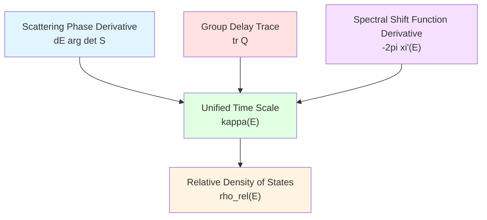
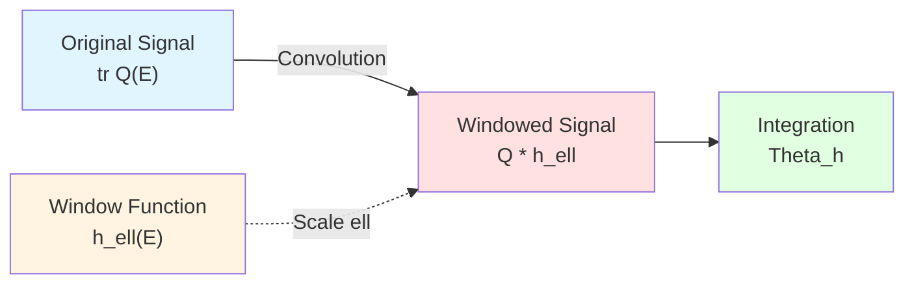
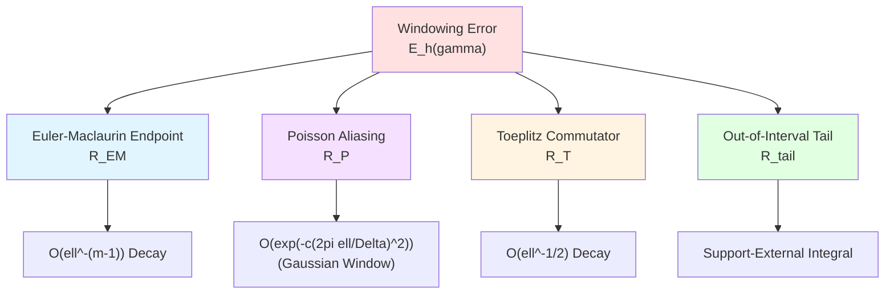
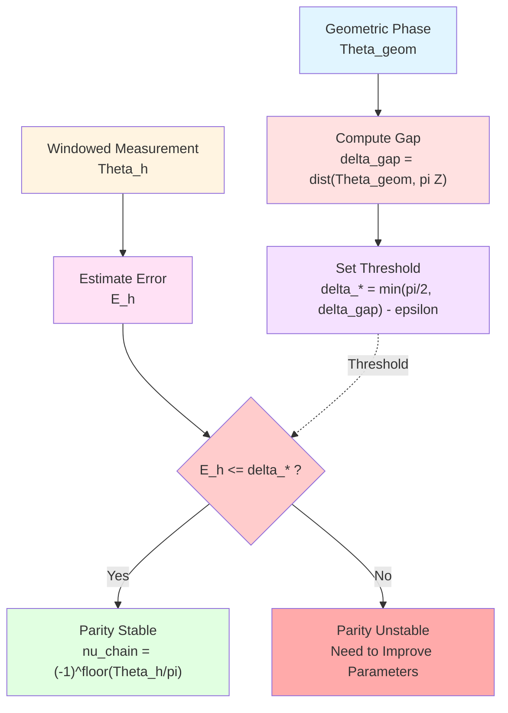
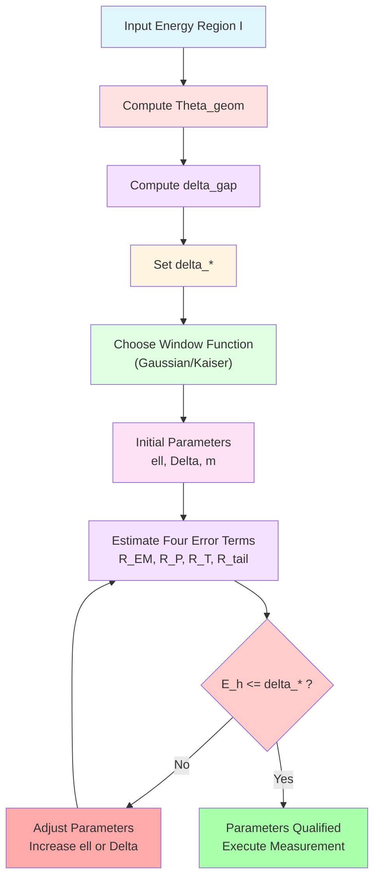
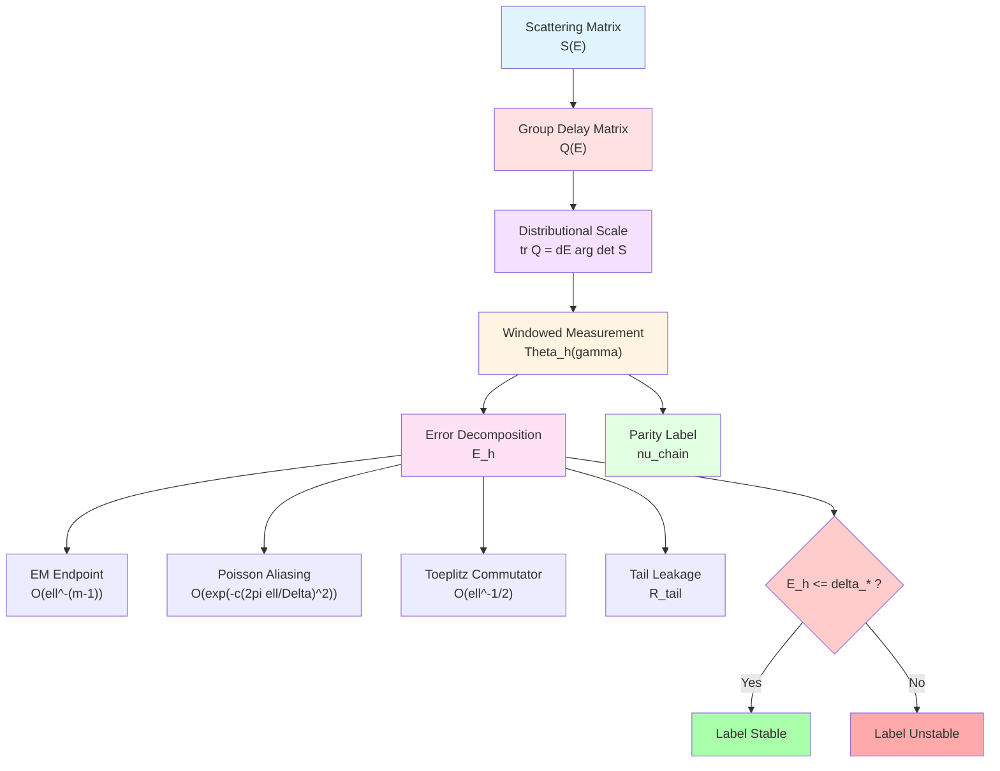

# Chapter 4: Scattering Scale and Windowed Readout

**Source Theory**: `euler-gls-extend/null-modular-double-cover-causal-diamond-chain.md`, §3.5-3.7

---

## Introduction

The modular Hamiltonian $K_D$ discussed in previous chapters is a physical quantity on the geometric-information-theoretic side. But in actual measurements, we need to indirectly probe these quantities through **scattering experiments**.

This chapter establishes a bridge between scattering theory and modular theory:
- **Birman-Krein Formula**: Scattering phase $\leftrightarrow$ spectral shift function
- **Wigner-Smith Formula**: Group delay $\leftrightarrow$ density of states change
- **Windowing Techniques**: Measurement strategies under finite energy resolution
- **Parity Threshold**: Stability criterion for $\mathbb{Z}_2$ labels

**Everyday Analogy**:
- **Geometric Side**: Internal structure of a building (modular Hamiltonian)
- **Scattering Side**: Probing building with sound waves (scattering matrix)
- **Windowing**: Frequency response function of sound wave receiver
- **Parity Threshold**: Judging whether the "fingerprint" of detected signal is stable

---

## 1. Distributional Birman-Krein-Friedel-Lloyd Scale

### 1.1 Scattering Phase and Spectral Shift Function

**Scattering matrix** $S(E)$ (energy-dependent unitary matrix) describes particle scattering process. Define:

$$
Q(E) := -\mathrm{i}\,S^\dagger(E)\partial_E S(E)
$$

This is the **group delay matrix** (Wigner-Smith time delay), semi-phase defined as:

$$
\varphi(E) := \frac{1}{2}\arg\det S(E)
$$

Relative density of states (compared to free system):

$$
\rho_{\rm rel}(E) := \frac{1}{2\pi}\operatorname{tr}Q(E)
$$

**Theorem F (Distributional Scale Identity)**:

For test function $h\in C_c^\infty(\mathbb{R})$ (or $h\in\mathcal{S}(\mathbb{R})$), we have

$$
\int \partial_E\arg\det S(E)\,h(E)\,dE
=\int \operatorname{tr}Q(E)\,h(E)\,dE
=-2\pi\!\int \xi'(E)\,h(E)\,dE
$$

where $\xi(E)$ is the **spectral shift function**.

**Birman-Krein Convention**:
$$
\det S(E) = e^{-2\pi\mathrm{i}\,\xi(E)}
$$

**Mermaid Diagram: Triple Equivalence**



**Physical Meaning**:
- $\arg\det S(E)$: Phase accumulation in scattering process
- $\operatorname{tr}Q(E)$: Average time particles stay in scattering region (group delay)
- $\xi'(E)$: Difference in density of states between perturbed and free systems

The three are **strictly equal** in distributional sense!

**Everyday Analogy**:
Three equivalent methods to measure vehicle speed:
- **Phase Accumulation**: Timing required to pass fixed distance
- **Group Delay**: Measuring vehicle stay time at checkpoint
- **Density Change**: Statistics of increase/decrease in vehicle density on road

### 1.2 Branch Convention and Continuation

**Technical Point**: $\arg\det S$ is multi-valued (differs by $2\pi\mathbb{Z}$), need to choose continuous branch.

**Branch Convention**:
After removing countable discrete set from energy band, take continuous branch of $\arg\det S$. Its distributional derivative $\partial_E\arg\det S$ **does not depend** on $2\pi$ jumps from branch choice, because:

1. Test function $h\in C_c^\infty$ "cancels" jumps
2. Matches $\operatorname{tr}Q$ through Helffer-Sjöstrand representation

**Handling Threshold Singularities**:
- Band edge (band threshold)
- Embedded eigenstate

Avoid by choosing $\operatorname{supp}h$, or handle as removable singularity.

### 1.3 Relative Aperture and Modified Determinant

**Proposition F' (Relative/Modified Aperture)**:

If $S_0(E)$ is reference scattering (same sheet analytic in band, no zeros/poles), and

$$
U(E) := S(E)S_0(E)^{-1},\quad U(E)-\mathbb{I}\in\mathfrak{S}_2
$$

then **Carleman determinant** satisfies:

$$
\int \partial_E\arg\det_2 U(E)\,h(E)\,dE
=\int \operatorname{tr}\big(Q(E)-Q_0(E)\big)\,h(E)\,dE
$$

where $\det_2$ is second-order determinant (applicable to $\mathbb{I}$ plus trace-class operators).

**Application Scenarios**:
- $S$ unitary but $S-\mathbb{I}$ not trace-class
- Relative scattering $U=SS_0^{-1}$ is "small perturbation", $U-\mathbb{I}\in\mathfrak{S}_2$
- Provides phase-group delay consistency under "non-trace-class but relatively second-order traceable" window

**Everyday Analogy**:
Measuring building deformation:
- Direct measurement of absolute coordinates (trace-class condition): Requires extremely high precision
- Measuring displacement relative to reference point (relative trace-class): Lower precision requirement

---

## 2. Windowing Techniques: Finite Resolution Measurement

### 2.1 Window Function and Scale

Actual measurements **cannot be performed at single energy point**, need averaging within energy window. Introduce **window function** $h(E)$:

$$
h_\ell(E) = \ell^{-1}h(E/\ell)
$$

where $\ell>0$ is window scale (energy resolution), satisfying:
- $\int_{\mathbb{R}}h=1$ (normalization)
- $h\ge0$ (non-negative)
- $h\in C_c^\infty(\mathbb{R})$ or $h\in\mathcal{S}(\mathbb{R})$ (Gaussian)

**Common Window Functions**:

1. **Gaussian Window**:
$$
h(E) = \frac{1}{\sqrt{2\pi}}e^{-E^2/2}
$$

2. **Kaiser-Bessel Window** ($\beta\ge6$):
$$
h(E) = \frac{I_0(\beta\sqrt{1-(E/W)^2})}{I_0(\beta)}\cdot\mathbf{1}_{|E|\le W}
$$

where $I_0$ is zeroth-order modified Bessel function.

**Windowed Phase Accumulation**:

$$
\Theta_h(\gamma) := \frac{1}{2}\int_{\mathcal{I}(\gamma)}\operatorname{tr}Q(E)\,h_\ell(E-E_0)\,dE
$$

where $\mathcal{I}(\gamma)=[E_1,E_2]$ is energy region, $E_0$ is window center.

**Mermaid Diagram: Windowing Process**



**Everyday Analogy**:
Camera aperture and shutter:
- **Original Signal**: Instantaneous light intensity $I(t)$
- **Window Function**: Shutter time response $h(t)$
- **Windowed Measurement**: Exposure integral $\int I(t)h(t)\,dt$
- **Scale $\ell$**: Exposure time (time resolution)

### 2.2 Windowless Limit and Geometric Phase

**Geometric Phase** (windowless limit):

$$
\Theta_{\rm geom}(\gamma) := \frac{1}{2}\int_{\mathcal{I}(\gamma)}\operatorname{tr}Q(E)\,dE
=\int_{\mathcal{I}(\gamma)}\varphi'(E)\,dE
=\varphi(E_2)-\varphi(E_1)
$$

This is total accumulation of scattering phase over energy region $\mathcal{I}(\gamma)$.

**Gap Definition**:

$$
\delta_{\rm gap}(\gamma) := \operatorname{dist}\big(\Theta_{\rm geom}(\gamma),\pi\mathbb{Z}\big)
$$

This is distance from $\Theta_{\rm geom}$ to nearest integer multiple of $\pi$.

**Physical Meaning**:
- Large $\delta_{\rm gap}$: $\Theta_{\rm geom}$ far from integer multiples of $\pi$, parity label **stable**
- Small $\delta_{\rm gap}$: $\Theta_{\rm geom}$ close to integer multiples of $\pi$, parity label **sensitive**

**Everyday Analogy**:
Judging whether weight is "significantly overweight":
- **Geometric Phase** $\Theta_{\rm geom}$: Your actual weight
- **Standard Line** $\pi\mathbb{Z}$: Integer multiples of standard weight (e.g., 50kg, 100kg)
- **Gap** $\delta_{\rm gap}$: Your distance from nearest standard line
- Large distance → judgment stable; small distance → judgment sensitive (near critical point)

---

## 3. Error Decomposition: EM-Poisson-Toeplitz Triangle Inequality

### 3.1 Total Error Budget

There is error between windowed measurement $\Theta_h$ and geometric limit $\Theta_{\rm geom}$:

$$
\boxed{\ \mathcal{E}_h(\gamma) := \underbrace{\int_{\mathcal{I}}|R_{\rm EM}|\,dE}_{\text{EM Endpoint}}
+\underbrace{\int_{\mathcal{I}}|R_{\rm P}|\,dE}_{\text{Poisson Aliasing}}
+\underbrace{C_{\rm T}\,\ell^{-1/2}\!\int_{\mathcal{I}}\!|\partial_E S|_2\,dE}_{\text{Toeplitz Commutator}}
+\underbrace{R_{\rm tail}(\ell,\mathcal{I},E_0)}_{\text{Out-of-Interval Tail}}\ }
$$

where:

$$
R_{\rm tail}(\ell,\mathcal{I},E_0) := \int_{\mathbb{R}\setminus\mathcal{I}(\gamma)} |h_\ell(E-E_0)|\,dE \in [0,1]
$$

If $h\ge0$ and $\int_{\mathbb{R}} h=1$, then $R_{\rm tail}=1-\int_{\mathcal{I}(\gamma)} h_\ell(E-E_0)\,dE$.

**Mermaid Error Source Diagram**



**Everyday Analogy**:
Four types of photo distortion:
- **EM Endpoint**: Edge blur (discrete sampling truncation)
- **Poisson Aliasing**: Moiré pattern (frequency aliasing)
- **Toeplitz Commutator**: Motion blur (temporal non-commutativity)
- **Tail Leakage**: Light interference from objects outside frame

### 3.2 Euler-Maclaurin Endpoint Remainder

**Lemma P (Euler-Maclaurin)**:

If $h\in C_c^{2m+1}$ and endpoints have vanishing jets up to order $\le 2m$, then:

$$
\int_{\mathcal{I}}|R_{\rm EM}|\,dE \le C_m\,\ell^{-(m-1)}
$$

**Physical Meaning**:
- Smoother window function (larger $m$), smaller endpoint remainder
- Larger window scale $\ell$, smaller remainder (lower energy resolution, smaller discretization error)

**Corner Estimate for Kaiser-Bessel Window**:
Kaiser window belongs to **compactly supported piecewise $C^{2m}$ window**, endpoints are corners. Its EM remainder is accounted by **corner version**:

$$
\int_{\mathcal{I}}|R_{\rm EM}|\,dE \le C_{\rm KB}\,\ell^{-1}
$$

Decay order reduced from $O(\ell^{-(m-1)})$ to $O(\ell^{-1})$.

### 3.3 Poisson Aliasing Term

**Lemma P (Poisson Summation)**:

Define energy sampling step size $\Delta>0$ (lattice spacing), then:

$$
\int_{\mathcal{I}}|R_{\rm P}|\,dE \le C_h\sum_{|q|\ge1}\Bigl\lvert\widehat{h}\left(\tfrac{2\pi q\,\ell}{\Delta}\right)\Bigr\rvert
$$

where $\widehat{h}$ is Fourier transform of $h$.

**Exponential Decay for Gaussian Window**:
If $h(E)=\frac{1}{\sqrt{2\pi}}e^{-E^2/2}$, then $\widehat{h}(\omega)=e^{-\omega^2/2}$. The above sum exhibits **exponential square decay**:

$$
\sum_{|q|\ge1}e^{-c(2\pi q\,\ell/\Delta)^2} \sim e^{-c(2\pi\ell/\Delta)^2}
$$

Rapidly approaches zero when $2\pi\ell/\Delta\gg 1$.

**Super-Polynomial Decay for Kaiser Window**:
Kaiser window has known Fourier tail bounds giving **exponential or super-polynomial decay** (specific order depends on $\beta$ parameter).

**Everyday Analogy**:
Sampling theorem and aliasing:
- **Poisson Summation**: Frequency aliasing caused by discrete sampling
- **$\Delta$**: Sampling interval
- **$2\pi\ell/\Delta$**: Dimensionless parameter (window scale/sampling interval)
- Gaussian window: Fast decay in frequency domain, aliasing nearly zero

### 3.4 Toeplitz Commutator Term

**Lemma T (Toeplitz/Berezin Compression Error)**:

Let $\mathsf{T}_\ell$ be windowed compression operator on energy axis (convolution with kernel $h_\ell(E-E')$), suppose $\partial_E S\in\mathfrak{S}_2$ and $\int_{\mathcal{I}}|\partial_E S|_2\,dE<\infty$. Then there exists constant $C_T>0$ such that:

$$
\Big\lvert\operatorname{tr}\big(Q*h_\ell\big)-\int Q(E)\,h_\ell(E-E_0)\,dE\Big\rvert
\le C_T\,\ell^{-1/2}\!\int_{\mathcal{I}}|\partial_E S|_2\,dE
$$

**Proof Points**:
- Compression error written as commutator $[\mathsf{T}_\ell,\cdot]$
- Average estimate for energy derivative
- Using Hilbert-Schmidt Hölder and window extension scale $\int (E-E_0)^2 h_\ell\sim\ell^{-1}$ gives $\ell^{-1/2}$ decay

**Physical Meaning**:
- Group delay $Q(E)$ and window function $h_\ell$ do not commute
- Commutator term $[\mathsf{T}_\ell,Q]$ produces $O(\ell^{-1/2})$ error
- Larger window scale $\ell$, smaller error

**Everyday Analogy**:
Camera shutter and moving subject:
- **Static Scene**: Shutter time (window function) commutes with object position (signal), no error
- **Moving Scene**: Non-commutative, produces motion blur (Toeplitz error)
- Longer shutter ($\ell$ larger), relatively smaller blur

### 3.5 Out-of-Interval Tail Leakage

$$
R_{\rm tail}(\ell,\mathcal{I},E_0) := \int_{\mathbb{R}\setminus\mathcal{I}(\gamma)} |h_\ell(E-E_0)|\,dE
$$

**Physical Meaning**:
- Window function support extends beyond interested energy region $\mathcal{I}(\gamma)$
- Signals outside energy region "leak" into measurement

**Advantage of Compact Support Window**:
If window function is compactly supported (e.g., Kaiser), and $\operatorname{supp}h_\ell\subset\mathcal{I}(\gamma)$, then $R_{\rm tail}=0$.

**Tail of Gaussian Window**:
Gaussian window has no compact support, but tail decays exponentially. If $E_0$ is at center of $\mathcal{I}(\gamma)$ and $\ell$ appropriately small, then $R_{\rm tail}\ll1$.

---

## 4. Parity Threshold Theorem: Stability of $\mathbb{Z}_2$ Labels

### 4.1 Theorem Statement

**Theorem G (Windowed Parity Threshold)**:

Define **windowed phase accumulation**:

$$
\Theta_h(\gamma) := \frac{1}{2}\int_{\mathcal{I}(\gamma)}\operatorname{tr}Q(E)\,h_\ell(E-E_0)\,dE
$$

**Chain $\mathbb{Z}_2$ Label**:

$$
\nu_{\rm chain}(\gamma) := (-1)^{\lfloor \Theta_h(\gamma)/\pi\rfloor}
$$

Define **threshold parameter**:

$$
\delta_*(\gamma) := \min\big\{\tfrac{\pi}{2},\delta_{\rm gap}(\gamma)\big\}-\varepsilon
$$

where $\varepsilon\in(0,\delta_{\rm gap}(\gamma))$ is safety margin.

**Theorem**: If there exist $\ell>0,\Delta>0,m\in\mathbb{N}$ such that:

$$
\mathcal{E}_h(\gamma) \le \delta_*(\gamma)
$$

then for any window center $E_0$ satisfying window quality conditions, we have:

$$
\nu_{\rm chain}(\gamma) = (-1)^{\lfloor \Theta_h(\gamma)/\pi\rfloor}
= (-1)^{\lfloor \Theta_{\rm geom}(\gamma)/\pi\rfloor}
$$

That is, parity label of windowed measurement agrees with geometric limit.

**Mermaid Logic Diagram**



**Physical Meaning**:
- **$\pi/2$ Buffer**: Fluctuations of $\Theta_h$ within $\pm\pi/2$ range do not change parity of $\lfloor\Theta_h/\pi\rfloor$
- **Gap Threshold**: If $\delta_{\rm gap}<\pi/2$, further tighten requirement to $\delta_{\rm gap}-\varepsilon$
- **Error Control**: Adjust $\ell,\Delta,m$ to make total error $\mathcal{E}_h$ satisfy threshold

**Everyday Analogy**:
Stability of scale reading:
- **True Weight** $\Theta_{\rm geom}$: 70.3 kg
- **Standard Line** $\pi\mathbb{Z}$: 50 kg, 100 kg
- **Gap** $\delta_{\rm gap}$: 20.3 kg (from 50kg) or 29.7 kg (from 100kg), take smaller 29.7
- **Threshold** $\delta_*$: $\min\{25,29.7\}-0.5=24.5$ kg
- **Measurement Error** $\mathcal{E}_h$: Scale precision $\pm0.2$ kg
- If $\mathcal{E}_h=0.2 < 24.5$, then judgment "not overweight" (parity label stable)

### 4.2 Origin of $\pi/2$ Buffer

**Note ($\pi/2$ Buffer)**:

In parity determination, $(-1)^{\lfloor\Theta/\pi\rfloor}$ flips only when $\Theta$ crosses **odd number of $\pi$**.

- If $\Theta$ fluctuates near some $k\pi$ by $<\pi/2$, then:
  - $\lfloor(\Theta-\pi/2)/\pi\rfloor = k-1$ or $k$
  - $\lfloor(\Theta+\pi/2)/\pi\rfloor = k$ or $k+1$
  - Parity **remains unchanged**

- Converging total perturbation to $<\pi/2$ guarantees not crossing nearest integer multiple of $\pi$

Taking $\delta_*(\gamma)=\min\{\pi/2,\delta_{\rm gap}(\gamma)\}-\varepsilon$ is explicit formulation of this buffer.

**Geometric Intuition**:

```
  ───────────┼─────────────┼─────────────┼─────────────
            0            π           2π           3π
             └──┬──┘        └──┬──┘        └──┬──┘
            π/2 Buffer    π/2 Buffer    π/2 Buffer
```

If $\Theta$ is within $\pm\pi/2$ range near some $k\pi$, $\lfloor\Theta/\pi\rfloor$ remains $k$ or $k-1$, parity unchanged.

### 4.3 Transition for Non-Smooth Windows

**Technical Extension**:
If window $h\in C_c^0$ and piecewise $C^{2m}$ within support (endpoints allow corners), can transition through smoothing:

1. Take standard smoothing kernel $\rho_\delta$
2. Define $h_{\ell,\delta}:=h_\ell*\rho_\delta$
3. For fixed $\ell>0$, have $\|h_{\ell,\delta}-h_\ell\|_{L^1}=O(\delta)$
4. Incorporate smoothing error $R_{\rm smooth}(\delta):=\int_{\mathcal{I}}|h_{\ell,\delta}-h_\ell|\,dE$ into total error budget

Choose $\delta=\delta(\ell,m)$ such that $R_{\rm smooth}(\delta)\le \frac{1}{2}\delta_*(\gamma)$, preserving same parity threshold conclusion.

---

## 5. Robustness Under Weak Non-Unitary Perturbations

### 5.1 Non-Unitary Deviation

Actual scattering processes may have **dissipation** (energy loss), scattering matrix $S(E)$ no longer strictly unitary. Define **non-unitary deviation**:

$$
\Delta_{\rm nonU}(E) := |S^\dagger(E)S(E)-\mathbb{I}|_1
$$

This is trace norm measure of $S$ deviating from unitarity.

**Corollary G (Weak Non-Unitary Stability)**:

If:

$$
\int_{\mathcal{I}(\gamma)} \Delta_{\rm nonU}(E)\,dE \le \varepsilon
$$

and:

$$
\mathcal{E}_h(\gamma) \le \delta_*(\gamma) := \min\big\{\tfrac{\pi}{2},\delta_{\rm gap}(\gamma)\big\}-\varepsilon
$$

then $\nu_{\rm chain}(\gamma)=(-1)^{\lfloor\Theta_h(\gamma)/\pi\rfloor}$ unchanged, and agrees with windowless limit.

**Physical Meaning**:
- As long as energy integral of non-unitary deviation $\le\varepsilon$
- And total error budget satisfies threshold $\delta_*-\varepsilon$
- Parity label remains stable

**Lemma N (Weak Non-Unitary Phase Difference Bound)**:

Write polar decomposition $S=U(\mathbb{I}-A)$, $U$ unitary, $A\ge0$. If $\int_{\mathcal{I}}|S^\dagger S-\mathbb{I}|_1\,dE\le\varepsilon$, then:

$$
\Big|\int_{\mathcal{I}}\!\operatorname{tr}Q(S)\,h_\ell-\int_{\mathcal{I}}\!\operatorname{tr}Q(U)\,h_\ell\Big| \le C_N\,\varepsilon
$$

**Proof Points**:
- $Q(S)=\mathrm{Im}\,\operatorname{tr}(S^{-1}\partial_E S)$
- Near unitarity $\|S^{-1}\|\le (1-\|A\|)^{-1}$
- Control difference using $\|\partial_E S\|_1\le\|\partial_E U\|_1+\|\partial_E A\|_1$ and $\|A\|_1\lesssim\|S^\dagger S-\mathbb{I}\|_1$

**Everyday Analogy**:
Effect of tire leak on speed measurement:
- **Ideal Tire**: Unitary scattering $S^\dagger S=\mathbb{I}$
- **Leaky Tire**: Non-unitary $\Delta_{\rm nonU}>0$
- As long as leak not too large ($\int\Delta_{\rm nonU}\le\varepsilon$)
- Speed measurement still reliable (parity label stable)

---

## 6. Recommended Parameters and Engineering Thresholds

### 6.1 Parameter Table (Satisfying Theorem G Threshold)

**Window Family**:
- Gaussian window: $h(E)=\frac{1}{\sqrt{2\pi}}e^{-E^2/2}$
- Kaiser window: $\beta\ge6$

**Smoothness Order/EM Endpoint Remainder**:
- If $h\in C_c^\infty$ or $h\in\mathcal{S}$: Take $m\ge 6$, use $\int_{\mathcal{I}}|R_{\rm EM}|\le C_m\,\ell^{-(m-1)}$
- If using Kaiser window: Use corner estimate $\int_{\mathcal{I}}|R_{\rm EM}|\le C_{\rm KB}\,\ell^{-1}$

**Step Size and Bandwidth**:
- Take $\Delta\le \ell/4$, and make $2\pi\ell/\Delta\ge 5$
- Poisson aliasing: $R_{\rm P} \le C_h\sum_{|q|\ge1}\big|\widehat{h}\left(2\pi q\,\ell/\Delta\right)\big|$
  - **Gaussian Window**: Exponential square decay $\sim e^{-c(2\pi\ell/\Delta)^2}$
  - **Kaiser Window**: Exponential or super-polynomial decay (specific depends on $\beta$)

**Toeplitz Commutator Term**:
Control quantity $\ell^{-1/2}\int_{\mathcal{I}}|\partial_E S|_2$

**Non-Unitary Tolerance**:
$$
\int_{\mathcal{I}}\Delta_{\rm nonU} \le \varepsilon
$$

**Gap Pre-Check**:
Compute $\delta_{\rm gap}(\gamma)=\operatorname{dist}(\Theta_{\rm geom}(\gamma),\pi\mathbb{Z})$

**Total Error Budget Formula**:

$$
\boxed{
\int|R_{\rm EM}|+\int|R_{\rm P}|+C_{\rm T}\,\ell^{-1/2}\!\int|\partial_E S|_2+R_{\rm tail} \le \delta_*(\gamma)
}
$$

where $\delta_*(\gamma)=\min\big\{\tfrac{\pi}{2},\delta_{\rm gap}(\gamma)\big\}-\varepsilon$.

**Mermaid Parameter Adjustment Flow**



### 6.2 Numerical Examples

**Single-Channel Resonance**:

$$
\delta(E) = \arctan\frac{\Gamma}{E-E_0}
$$

where $\Gamma$ is resonance width. Compute:

$$
\Theta_{\rm geom} = \delta(E_2)-\delta(E_1)
$$

Estimate difference between $\Theta_h$ and actual $\int (2\pi)^{-1}\operatorname{tr}Q$, and mark crossing points of $\pi$ flips.

**Multi-Channel Near-Unitary**:

$$
S(E) = U\operatorname{diag}(e^{2i\delta_1(E)},e^{-2i\delta_1(E)})U^\dagger
$$

Examine $\epsilon_i$ flips and chain sign response.

**Expected Results**:
- When $\ell,\Delta$ satisfy threshold inequality, parity label of windowed measurement agrees with geometric limit
- When parameters don't satisfy, "spurious flip" appears

---

## 7. Connection with Unified Time Scale

### 7.1 Review of Unified Time Scale

In previous chapters (20-experimental-tests/01-unified-time-measurement.md), we established **unified time scale**:

$$
\kappa(\omega) = \frac{\varphi'(\omega)}{\pi} = \rho_{\rm rel}(\omega) = \frac{1}{2\pi}\operatorname{tr}Q(\omega)
$$

**Triple Equivalence**:
- $\varphi'(\omega)/\pi$: Scattering phase derivative
- $\rho_{\rm rel}(\omega)$: Relative spectral density
- $(2\pi)^{-1}\operatorname{tr}Q(\omega)$: Wigner-Smith group delay

Theorem F of this chapter is exactly the distributional version of this unified scale!

### 7.2 Connection with Modular Hamiltonian

**First-Order Variation Relation**:

$$
\delta K_D = 2\pi \delta S_D
$$

where $S_D$ is entanglement entropy. Combined with QNEC vacuum saturation:

$$
\langle T_{vv}\rangle = \frac{1}{2\pi}\frac{\partial^2 S}{\partial v^2}
$$

obtains indirect connection between modular Hamiltonian and scattering phase:

$$
K_D \sim \int \varphi'(\omega)\,d\omega = \pi\int \kappa(\omega)\,d\omega
$$

**Everyday Analogy**:
- **Geometric Side**: Internal stress distribution of building (modular Hamiltonian $K_D$)
- **Scattering Side**: Sound wave reflection phase ($\varphi(\omega)$)
- **Unified Scale**: Inferring stress through acoustic probing ($\kappa(\omega)$)

### 7.3 Application of Windowing Techniques in Experiments

**Experimental schemes in 20-experimental-tests chapter** rely on windowing techniques of this chapter:

1. **PSWF/DPSS Spectral Windowing** (02-spectral-windowing-technique.md)
   - Window function selection consistent with recommendations of this chapter
   - Shannon number $N_0=2TW$ corresponds to energy-time window parameters $\ell,\Delta$

2. **FRB Observation Application** (05-frb-observation-application.md)
   - FRB pulse as natural "window function"
   - Interstellar scattering introduces non-unitary effects, need Corollary G for evaluation

3. **Topological Fingerprint Optical Implementation** (03-topological-fingerprint-optics.md)
   - Measurement of $\mathbb{Z}_2$ parity labels depends on stability criterion of Theorem G
   - Experimental parameter design must satisfy error budget $\mathcal{E}_h\le\delta_*$

---

## 8. Chapter Summary

### 8.1 Core Formulas

**Birman-Krein-Friedel-Lloyd-Wigner-Smith Scale Identity**:
$$
\partial_E\arg\det S = \operatorname{tr}Q = -2\pi\xi'
$$

**Windowed Phase Accumulation**:
$$
\Theta_h(\gamma) = \frac{1}{2}\int_{\mathcal{I}(\gamma)}\operatorname{tr}Q(E)\,h_\ell(E-E_0)\,dE
$$

**Parity Threshold Theorem**:
If $\mathcal{E}_h(\gamma)\le\delta_*(\gamma)$, then
$$
\nu_{\rm chain}(\gamma) = (-1)^{\lfloor\Theta_h(\gamma)/\pi\rfloor} = (-1)^{\lfloor\Theta_{\rm geom}(\gamma)/\pi\rfloor}
$$

**Total Error Budget**:
$$
\mathcal{E}_h = \int|R_{\rm EM}|+\int|R_{\rm P}|+C_{\rm T}\ell^{-1/2}\int|\partial_E S|_2+R_{\rm tail}
$$

**Threshold Parameter**:
$$
\delta_*(\gamma) = \min\big\{\tfrac{\pi}{2},\delta_{\rm gap}(\gamma)\big\}-\varepsilon
$$

### 8.2 Physical Picture

**Mermaid Summary Diagram**



### 8.3 Key Insights

1. **Triple Unified Scale**:
   - Scattering phase $\leftrightarrow$ group delay $\leftrightarrow$ spectral shift function
   - Strictly equivalent in distributional sense
   - Provides multiple paths for experimental measurement

2. **Necessity of Windowing Techniques**:
   - Actual measurements have finite energy resolution
   - Window functions introduce systematic errors
   - Errors can be controlled through parameter adjustment

3. **Robustness of Parity Threshold**:
   - $\pi/2$ buffer mechanism
   - Gap $\delta_{\rm gap}$ determines stability
   - Weak non-unitary perturbations tolerable

4. **Engineering Parameter Design**:
   - Gaussian window: Exponential decay, Poisson aliasing minimal
   - Kaiser window: Compact support, tail leakage zero
   - Parameter selection needs to balance four error sources

### 8.4 Preview of Next Chapter

Next chapter (**05-causal-diamond-summary.md**) will:
- Synthesize entire chapter content
- Interface with experimental schemes
- Discuss open problems and future directions

---

**End of Chapter**

---

**Source Theory**: `euler-gls-extend/null-modular-double-cover-causal-diamond-chain.md`, §3.5-3.7

