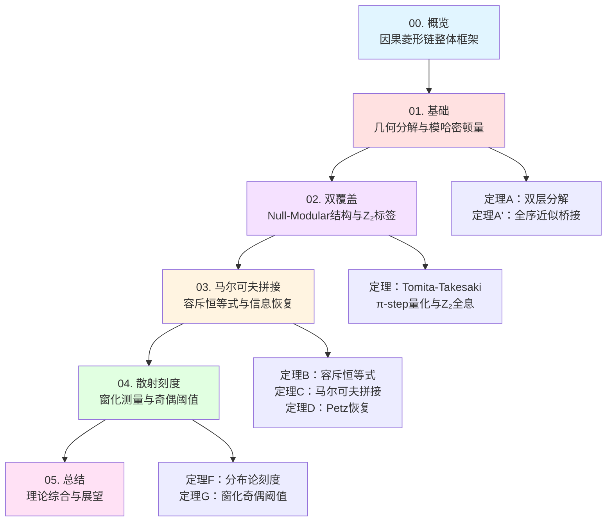
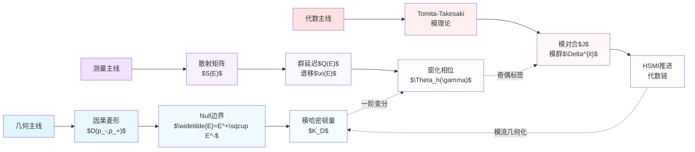
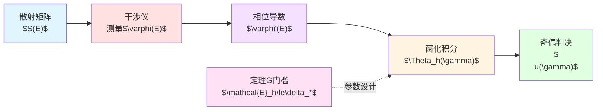
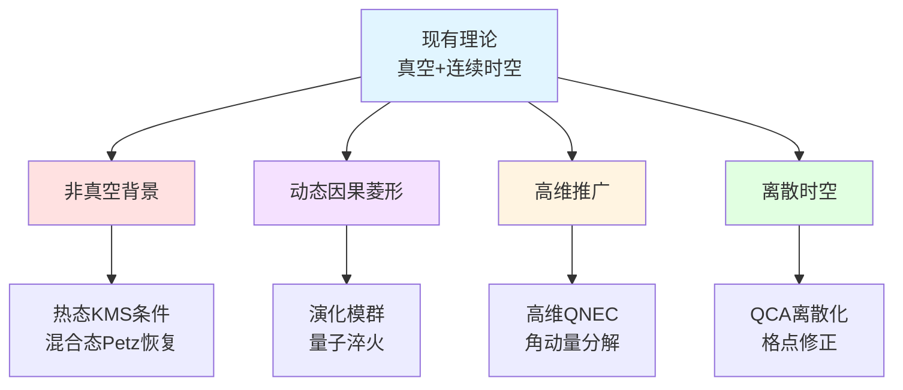
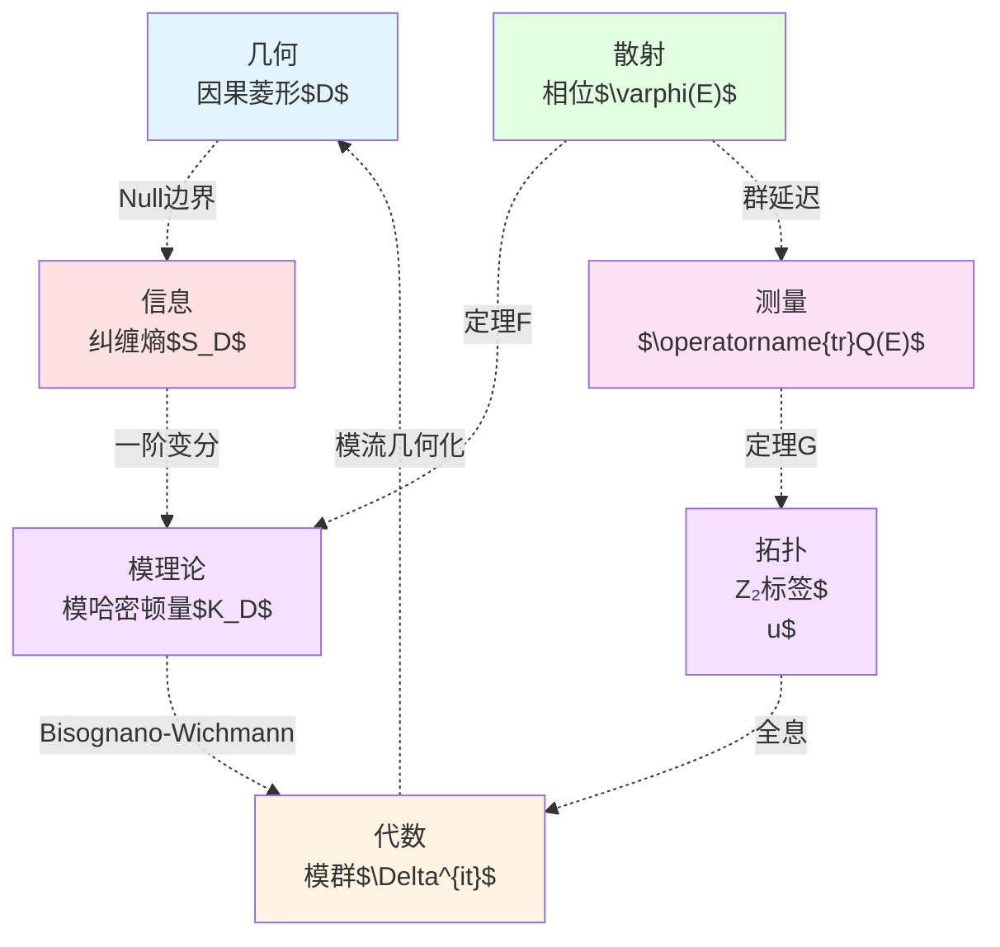
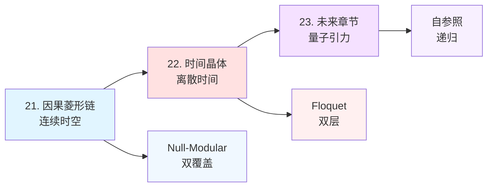

# 第五章：因果菱形链理论总结与展望

**源理论**：`euler-gls-extend/null-modular-double-cover-causal-diamond-chain.md`，§7-8；
`euler-gls-info/14-causal-diamond-chain-null-modular-double-cover.md`

---

## 引言

前四章系统建立了**因果菱形链的Null-Modular双覆盖理论**，从几何分解到信息拼接，再到散射测量。本章将：
- 综合全章核心结果
- 讨论理论边界与反例
- 展望未来研究方向
- 对接实验验证方案

**本章结构**：
1. **理论体系回顾**：五篇文章的逻辑线索
2. **核心定理总结**：关键公式与物理图像
3. **边界与反例**：理论适用范围
4. **实验对接**：与第20章实验方案的联系
5. **未来展望**：开放问题与扩展方向

---

## 1. 理论体系回顾

### 1.1 五篇文章的逻辑线索

**Mermaid全章结构图**



**各章核心贡献**：

| 章节 | 核心内容 | 关键定理 | 物理意义 |
|-----|---------|---------|---------|
| **01. 基础** | 因果菱形几何与模哈密顿量 | 定理A（双层分解）<br/>引理A（全序近似桥接） | 建立Null边界的二次型框架 |
| **02. 双覆盖** | Tomita-Takesaki模理论与平方根分支 | π-step定理<br/>Z₂全息公式 | 连接费米子双值性与拓扑不可判定性 |
| **03. 马尔可夫拼接** | 容斥恒等式与信息重构 | 定理B（容斥）<br/>定理C（马尔可夫）<br/>定理D（Petz恢复） | 量子信息的无损拼接条件 |
| **04. 散射刻度** | Birman-Krein公式与窗化技术 | 定理F（分布论刻度）<br/>定理G（奇偶阈值） | 实验测量的理论基础 |
| **05. 总结** | 理论综合与未来方向 | — | 开放问题与扩展路径 |

### 1.2 理论的三条主线

**Mermaid三条主线**



**三条主线的交汇点**：
- **几何$\times$代数**：模哈密顿量$K_D$的算子实现
- **几何$\times$测量**：模流与散射相位的变分关系
- **代数$\times$测量**：Z₂标签的拓扑稳定性

---

## 2. 核心定理总结

### 2.1 几何分解定理

**定理A（双层几何分解）**：

$$
K_D = 2\pi\sum_{\sigma=\pm}\int_{E^\sigma} g_\sigma(\lambda,x_\perp)\,
T_{\sigma\sigma}(\lambda,x_\perp)\,d\lambda\,d^{d-2}x_\perp
$$

**CFT球形钻石精确公式**：
$$
g_\sigma(\lambda) = \lambda(1-\lambda/T)
$$

**引理A（全序近似桥接）**：
存在单调半空间族$\{R_{V_\alpha}^\pm\}$使：

$$
\langle\psi,K_D\psi\rangle = \lim_{\alpha\to\infty}
\sum_{\sigma=\pm}2\pi\!\int_{E^\sigma}
g^{(\alpha)}_\sigma\,\langle\psi,T_{\sigma\sigma}\psi\rangle
$$

且极限与有序逼近无关（主控收敛+二次型闭性）。

**物理意义**：
- 将因果菱形的模哈密顿量分解为**两层Null边界上的能流积分**
- 全序近似桥接保证了分解的**路径无关性**
- QNEC真空饱和提供二阶响应核$2\pi T_{vv}$

### 2.2 双覆盖与π-step量化

**Tomita-Takesaki模对合与双层交换**：

$$
J(E^+) = E^-,\quad J^2 = \mathbb{I}
$$

**平方根覆盖空间**：

$$
P_{\sqrt{S}} = \{(E,\sigma) : \sigma^2 = \det S(E)\}
$$

**π-step定理**：
当极点穿越实轴时，相位跳变$\pm\pi$：

$$
\Delta\varphi = \pm\pi \quad\Rightarrow\quad \varepsilon_k = \lfloor\Delta\varphi_k/\pi\rfloor \bmod 2
$$

**Z₂全息公式**：

$$
\operatorname{hol}_{\mathbb{Z}_2}(\gamma) = \sum_{k\in\gamma} \varepsilon_k \bmod 2
$$

**自参照网络联系**：

$$
\sigma(\gamma) = \operatorname{hol}_{\mathbb{Z}_2}(\gamma_\Diamond)
$$

**物理意义**：
- 模对合$J$的几何实现：交换两层Null边界并反转时间
- 平方根分支的拓扑来源：费米子双值性
- π-step量化：散射相位跳变的离散化
- Z₂全息：链式闭路的拓扑标签

### 2.3 容斥与马尔可夫拼接

**定理B（容斥恒等式）**：

$$
K_{\cup_i R_{V_i}}
=\sum_{k=1}^N(-1)^{k-1}\!\!\sum_{1\le i_1<\cdots<i_k\le N}\!
K_{R_{V_{i_1}}\cap\cdots\cap R_{V_{i_k}}}
$$

**定理C（马尔可夫拼接）**：
同面全序下：

$$
I(D_{j-1}:D_{j+1}\mid D_j) = 0
$$

$$
K_{D_{j-1}\cup D_j} + K_{D_j\cup D_{j+1}} - K_{D_j} - K_{D_{j-1}\cup D_j\cup D_{j+1}} = 0
$$

**定理C'（非全序缺口）**：

$$
I(D_{j-1}:D_{j+1}\mid D_j) = \iint \iota(v,x_\perp)\,dv\,d^{d-2}x_\perp
$$

$$
\iota(v,x_\perp) \ge c_*\,\kappa(x_\perp)
$$

其中层状度$\kappa(x_\perp):=\#\{(a,b):a<b,\ (V_a^+-V_b^+)(V_a^--V_b^-)<0\}$。

**定理D（Petz恢复）**：
当且仅当$I(A:C\mid B)=0$时，存在完美恢复：

$$
(\mathrm{id}_A\otimes \mathcal{R}_{B\to BC})(\rho_{AB}) = \rho_{ABC}
$$

一般情形：

$$
F \ge e^{-I(A:C\mid B)/2}
$$

**物理意义**：
- 容斥恒等式：模哈密顿量的加法规则
- 马尔可夫拼接：无损信息传递的充要条件
- 非全序缺口：层状度定量刻画信息损失
- Petz恢复：量子信息的最优重构方案

### 2.4 散射刻度与奇偶阈值

**定理F（分布论刻度同一）**：

$$
\int \partial_E\arg\det S(E)\,h(E)\,dE
=\int \operatorname{tr}Q(E)\,h(E)\,dE
=-2\pi\!\int \xi'(E)\,h(E)\,dE
$$

**定理G（窗化奇偶阈值）**：

定义：

$$
\Theta_h(\gamma) := \frac{1}{2}\int_{\mathcal{I}(\gamma)}\operatorname{tr}Q(E)\,h_\ell(E-E_0)\,dE
$$

$$
\nu_{\rm chain}(\gamma) := (-1)^{\lfloor \Theta_h(\gamma)/\pi\rfloor}
$$

若：

$$
\mathcal{E}_h(\gamma) := \int|R_{\rm EM}|+\int|R_{\rm P}|+C_{\rm T}\ell^{-1/2}\int|\partial_E S|_2+R_{\rm tail} \le \delta_*(\gamma)
$$

其中$\delta_*(\gamma):=\min\{\pi/2,\delta_{\rm gap}(\gamma)\}-\varepsilon$，则：

$$
\nu_{\rm chain}(\gamma) = (-1)^{\lfloor\Theta_{\rm geom}(\gamma)/\pi\rfloor}
$$

**推论G（弱非幺正稳定）**：
若$\int_{\mathcal{I}}\Delta_{\rm nonU}\le\varepsilon$且$\mathcal{E}_h\le\delta_*-\varepsilon$，则奇偶标签不变。

**物理意义**：
- 分布论刻度：散射相位$\leftrightarrow$群延迟$\leftrightarrow$谱移函数的统一
- 窗化技术：有限能量分辨率测量的误差控制
- 奇偶阈值：Z₂标签的稳定性判据
- 弱非幺正鲁棒性：耗散系统的容忍度

---

## 3. 理论边界与反例

### 3.1 几何分解的边界

**定理A的适用条件**：

✅ **适用情形**：
- QNEC真空饱和
- Null边界光滑（至少$C^1$）
- Bisognano-Wichmann性质成立

❌ **失效情形**：
- **边界非光滑**：角点奇点破坏QNEC
- **强曲率**：高维曲面的Null边界曲率过大
- **非真空背景**：激发态或有限温度

**反例1：尖角因果菱形**

考虑二维时空中，Null边界在某点形成尖角（cusp）：

```
    ╱╲
   ╱  ╲
  ╱ D  ╲
 ╱______╲
  尖角处
```

在尖角处：
- QNEC二阶响应核$T_{vv}$出现$\delta$函数奇点
- 二次型积分发散
- 定理A失效

**缓解方案**：
- 角点正则化：用小半径圆弧替代尖角
- 分布式权重：引入cutoff函数$g^\eta_\sigma$

### 3.2 马尔可夫拼接的边界

**定理C的适用条件**：

✅ **适用情形**：
- 同一Null超平面上全序切割
- Split property与strong additivity成立
- 真空态

❌ **失效情形**：
- **非全序切割**：$\kappa(x_\perp)>0$
- **长程关联**：破坏split property
- **拓扑缺陷**：导致非局域关联

**反例2：螺旋切割**

考虑因果菱形链的切割面沿横向坐标$x_\perp$螺旋上升：

```
E⁺层：V₁ < V₂ < V₃
E⁻层：V₂ < V₃ < V₁
```

此时$\kappa(x_\perp)=1$，出现马尔可夫缺口：

$$
I(D_1:D_3\mid D_2) > 0
$$

**定量估计**：
由引理C.1，

$$
I(D_1:D_3\mid D_2) \ge c_*\int\kappa(x_\perp)\,d^{d-2}x_\perp
$$

### 3.3 散射刻度的边界

**定理F的适用条件**：

✅ **适用情形**：
- $S(E)-\mathbb{I}\in\mathfrak{S}_1$（迹类）
- 分段光滑（避开阈值）
- 短程势或快速衰减势

❌ **失效情形**：
- **长程势**：Coulomb势$\sim 1/r$
- **阈值奇点**：能带边缘
- **嵌入本征态**：离散谱嵌入连续谱

**反例3：Coulomb散射**

Coulomb势$V(r)=\alpha/r$的散射相位：

$$
\delta_\ell(k) \sim -\frac{\alpha}{v}\ln(kr)
$$

其中$v$为速度。相位导数：

$$
\frac{d\delta_\ell}{dk} \sim -\frac{\alpha}{v}\frac{1}{k}
$$

在$k\to0$时发散，破坏定理F的假设。

**广义KFL处理**：
采用**修正谱移函数**$\xi_{\rm reg}(E)$，扣除长程尾项。

### 3.4 奇偶阈值的边界

**定理G的适用条件**：

✅ **适用情形**：
- $\delta_{\rm gap}(\gamma)>0$（远离$\pi$整数倍）
- 窗函数足够光滑（$m\ge6$）
- 参数满足误差预算$\mathcal{E}_h\le\delta_*$

❌ **失效情形**：
- **间隙过小**：$\delta_{\rm gap}\ll\mathcal{E}_h$
- **窗尺度过小**：$\ell\to0$，各项误差发散
- **强非幺正**：$\int\Delta_{\rm nonU}\gg\varepsilon$

**反例4：相位在$\pi$附近**

设$\Theta_{\rm geom}=\pi+0.01$（几乎刚好为$\pi$），$\delta_{\rm gap}=0.01$。

若窗化误差$\mathcal{E}_h=0.02$，则：

$$
\mathcal{E}_h > \delta_{\rm gap}
$$

定理G不适用，可能出现**假翻转**（spurious flip）：

$$
\lfloor(\pi+0.01-0.02)/\pi\rfloor = 0 \neq 1 = \lfloor(\pi+0.01)/\pi\rfloor
$$

**缓解方案**：
- 提高窗质量（增大$m$）
- 增大窗尺度$\ell$
- 采用自适应窗选择

---

## 4. 实验对接：与第20章的联系

### 4.1 统一时间刻度测量

**第20章第01节**（`20-experimental-tests/01-unified-time-measurement.md`）：

**三重等价路径**：
$$
\kappa(\omega) = \frac{\varphi'(\omega)}{\pi} = \rho_{\rm rel}(\omega) = \frac{1}{2\pi}\operatorname{tr}Q(\omega)
$$

**本章贡献**：
- 定理F提供分布论严格证明
- 窗化技术（定理G）给出实验参数设计

**实验平台映射**：

| 理论量 | 实验平台 | 测量方法 |
|-------|---------|---------|
| $\varphi'(\omega)$ | 光学干涉仪 | 相位差$\Delta\varphi$ |
| $\rho_{\rm rel}(\omega)$ | 态密度谱 | 共振峰计数 |
| $\operatorname{tr}Q(\omega)$ | 群延迟测量 | 脉冲展宽$\Delta t$ |

### 4.2 PSWF/DPSS光谱窗化

**第20章第02节**（`20-experimental-tests/02-spectral-windowing-technique.md`）：

**Shannon数**：
$$
N_0 = 2TW \quad(\text{连续}),\quad N_0 = 2NW \quad(\text{离散})
$$

**主泄漏上界**：
$$
1-\lambda_0 \le 10\exp\left(-\frac{(\lfloor N_0\rfloor-7)^2}{\pi^2\log(50N_0+25)}\right)
$$

**本章贡献**：
- 定理G的误差分解包含PSWF主泄漏项
- Poisson混叠$R_{\rm P}$对应DPSS的频域泄漏
- 推荐窗参数与第02节一致（$m\ge6$，$\Delta\le\ell/4$）

**参数对应**：

| 第20章记号 | 本章记号 | 物理意义 |
|-----------|---------|---------|
| $T$ | $1/\ell$ | 时间窗口宽度 |
| $W$ | $\Delta$ | 频率带宽 |
| $N_0$ | $2\ell/\Delta$ | 自由度数 |
| $\lambda_0$ | $1-R_{\rm P}$ | 主瓣能量集中度 |

### 4.3 拓扑指纹光学实现

**第20章第03节**（`20-experimental-tests/03-topological-fingerprint-optics.md`）：

**三重拓扑指纹**：
- **π-step阶梯**：$\Delta\tau_n=\pi/\omega_{\rm pole}$
- **Z₂奇偶翻转**：$\nu(\gamma)\bmod 2$
- **平方根标度律**：$\Delta E\propto\sqrt{N}$

**本章贡献**：
- π-step定理（02章）给出阶梯量化的拓扑来源
- 定理G的奇偶阈值判据提供$\nu(\gamma)$的稳定性保证
- Z₂全息公式连接自参照网络

**光学实现方案**：



### 4.4 因果菱形量子模拟

**第20章第04节**（`20-experimental-tests/04-causal-diamond-simulation.md`）：

**模拟目标**：
- 双层纠缠结构验证
- 马尔可夫链条件独立性
- Z₂奇偶不变量测量

**本章贡献**：
- 定理B（容斥恒等式）给出模拟验证的预言公式
- 定理C（马尔可夫拼接）提供全序条件的判据
- 定理C'（非全序缺口）预言层状度的影响

**冷原子平台实现**：

| 理论量 | 冷原子实现 | 测量方法 |
|-------|-----------|---------|
| $K_D$ | 纠缠哈密顿量 | 量子态层析 |
| $I(A:C\mid B)$ | 三体互信息 | 部分转置谱 |
| $\nu(\gamma)$ | Z₂规范通量 | 环路算符 |

### 4.5 FRB观测应用

**第20章第05节**（`20-experimental-tests/05-frb-observation-application.md`）：

**FRB作为宇宙尺度散射实验**：
- 脉冲展宽$\to$群延迟$Q(E)$
- 星际散射$\to$非幺正扰动$\Delta_{\rm nonU}$

**本章贡献**：
- 推论G（弱非幺正稳定）评估耗散影响
- 窗化技术处理FRB的有限时间分辨率
- 奇偶阈值判据设定观测参数

**观测策略**：

$$
\begin{align}
\text{FRB脉冲宽度} &\leftrightarrow \text{窗尺度}\ell \\
\text{频道间隔} &\leftrightarrow \text{采样步长}\Delta \\
\text{星际散射强度} &\leftrightarrow \text{非幺正偏差}\int\Delta_{\rm nonU}
\end{align}
$$

---

## 5. 全息提升：JLMS与次阶修正

### 5.1 边界-体区对偶

**JLMS等式**（Jafferis-Lewkowycz-Maldacena-Suh）：

$$
S_{\rm boundary}(R) = S_{\rm bulk}(EW[R]) + \frac{A(\partial EW[R])}{4G_N}
$$

其中$EW[R]$为纠缠楔（Entanglement Wedge）。

**定理I（全息提升）**：

在大$N$领先阶，边界容斥与马尔可夫拼接**提升**为体区纠缠楔的法向模流拼接。

次阶偏差：

$$
\delta_{\rm holo} := c_1|\delta X|^2 + c_2 I_{\rm bulk} + c_3\sqrt{\mathrm{Var}(K_{\rm bulk})}
$$

其中：
- $\delta X$：极值面位移
- $I_{\rm bulk}$：体区互信息
- $\mathrm{Var}(K_{\rm bulk})$：体区模哈密顿量涨落

**门槛拼合**：
若$\delta_{\rm holo}\le\pi/2-\varepsilon$，则与定理G的门槛拼合，奇偶不变。

**Mermaid全息提升图**

```mermaid
graph TD
    A["边界CFT<br/>因果菱形链"] --> B["边界容斥<br/>$K_{\cup R_i}$"]
    B --> C["边界马尔可夫<br/>$I(j-1:j+1\|j)=0$"]

    A' ["体区AdS<br/>纠缠楔"] --> B' ["极值面拼接<br/>$A(\partial EW)$"]
    B' --> C' ["体区模流<br/>$K_{\rm bulk}$"]

    A -.->|"AdS/CFT"| A'
    B -.->|"JLMS等式"| B'
    C -.->|"全息提升"| C'

    D["次阶修正<br/>$\delta_{\rm holo}$"] -.->|"$\le\pi/2$"| C'

    style A fill:#e1f5ff
    style B fill:#ffe1e1
    style C fill:#f5e1ff
    style A' fill:#e1ffe1
    style B' fill:#fff4e1
    style C' fill:#ffe1f5
    style D fill:#ffcccc
```

### 5.2 次阶修正的来源

**三项贡献**：

1. **极值面位移$\delta X$**：
   - 边界扰动引起极值面偏离经典轨迹
   - 贡献规模：$\propto G_N^{-1}|\delta X|^2$（无量纲组配）

2. **体区互信息$I_{\rm bulk}$**：
   - 体区场的量子涨落引起纠缠
   - 贡献规模：$\propto 1/N$

3. **模哈密顿量涨落$\mathrm{Var}(K_{\rm bulk})$**：
   - 体区模算子的方差
   - 贡献规模：$\propto 1/N$

**假设J（半经典可控窗化）**：
取足够平滑的窗$h$与足够大的$\ell$使边界侧的$R_{\rm EM},R_{\rm P},R_{\rm tail}$满足定理G的门槛，同时$\delta X,I_{\rm bulk},\mathrm{Var}(K_{\rm bulk})$由$1/N$与耦合窗口的微扰展开统一控制。则边界-体区的二阶误差可与$\mathcal{E}_h$合并到同一$\delta_*$预算内，实现全息奇偶一致性。

---

## 6. 未来研究方向

### 6.1 理论扩展

**方向1：非真空背景**

现有理论基于真空态，扩展到激发态或有限温度：
- **热态模理论**：KMS条件替代Tomita-Takesaki
- **混合态Petz恢复**：需引入环境自由度
- **热马尔可夫拼接**：温度依赖的缺口函数$\iota_T(v,x_\perp)$

**方向2：动态因果菱形**

时间演化的因果菱形链：
- **演化模群**：$\Delta^{\mathrm{i}t}$的时间依赖
- **非平衡马尔可夫性**：瞬态信息流
- **量子淬火**：突变散射矩阵的奇偶翻转

**方向3：高维推广**

$d>4$维时空的修正：
- **高维QNEC**：次领头阶修正
- **角动量分解**：球谐展开的模哈密顿量
- **高维Z₂**：Chern-Simons项的推广

**方向4：离散时空**

量子引力的离散化：
- **量子细胞自动机**（QCA）版本的因果菱形
- **离散模理论**：有限维Hilbert空间
- **离散奇偶阈值**：格点间距引起的修正

**Mermaid扩展方向图**



### 6.2 实验验证

**短期目标（1-3年）**：

1. **台式光学实验**：
   - 光纤环路实现因果菱形链
   - 相位调制器模拟散射矩阵$S(E)$
   - 干涉仪测量窗化相位$\Theta_h$

2. **冷原子平台**：
   - Rydberg原子阵列构建因果菱形
   - 量子态层析验证容斥恒等式
   - 三体互信息测量马尔可夫拼接

**中期目标（3-7年）**：

3. **超导量子处理器**：
   - 可编程qubit网络模拟因果菱形链
   - 动态散射矩阵$S(E,t)$
   - 实时监测Z₂奇偶翻转

4. **天文观测**：
   - FRB数据分析验证弱非幺正稳定性
   - 引力波LIGO数据的窗化处理
   - 宇宙微波背景（CMB）的马尔可夫检验

**长期目标（7-15年）**：

5. **量子引力探针**：
   - 桌面量子引力效应
   - 离散时空信号的奇偶指纹
   - 全息噪声的统计分析

### 6.3 开放问题

**问题1：Null-Modular停机问题**

**陈述**：判定给定因果菱形链的Z₂全息$\operatorname{hol}_{\mathbb{Z}_2}(\gamma)$是否为零是**不可判定的**。

**证明思路**：
- 构造自参照网络$\Gamma$使$\sigma(\gamma)=\operatorname{hol}_{\mathbb{Z}_2}(\gamma_\Diamond)$
- 利用自参照停机问题的不可判定性
- 通过拓扑映射归约到Z₂全息判定

**意义**：
连接拓扑不可判定性与计算复杂性。

**问题2：马尔可夫缺口的最优下界**

**陈述**：给定层状度$\kappa(x_\perp)$，马尔可夫缺口线密度$\iota(v,x_\perp)$的**最优下界**是什么？

**已知结果**：
引理C.1给出$\iota\ge c_*\kappa$，但常数$c_*$依赖于几何细节。

**猜想**：
存在普适下界$\iota\ge\kappa^2/(某几何不变量)$。

**问题3：全息次阶的精确系数**

**陈述**：定理I的次阶修正$\delta_{\rm holo}$中，系数$c_1,c_2,c_3$的精确表达式？

**已知**：
- 量纲分析给出$c_1\propto G_N^{-1}$
- 大$N$展开给出$c_2,c_3\propto 1/N$

**未知**：
数值前因子依赖于：
- 时空维度$d$
- 场论中心荷$c$
- 纠缠楔几何

**问题4：窗化奇偶阈值的最优窗**

**陈述**：在给定误差预算$\mathcal{E}_h\le\delta_*$下，存在**最优窗函数**$h_{\rm opt}$使Poisson混叠$R_{\rm P}$最小？

**候选**：
- 高斯窗：频域指数衰减
- Slepian窗（DPSS）：时频局域化最优
- Meyer窗：频域紧支撑

**数值比较**：需在多种散射场景下测试。

---

## 7. 总结：理论的深层统一

### 7.1 五重等价的物理图景

本章理论揭示了**五重等价**：

**Mermaid五重等价图**



**等价链条**：

$$
\text{几何}(D) \xleftrightarrow{\text{纠缠}} \text{信息}(S) \xleftrightarrow{\text{变分}} \text{模理论}(K)
$$

$$
\text{模理论}(K) \xleftrightarrow{\text{BW}} \text{代数}(\Delta) \xleftrightarrow{\text{全息}} \text{拓扑}(\nu)
$$

$$
\text{拓扑}(\nu) \xleftrightarrow{\text{定理G}} \text{散射}(\varphi) \xleftrightarrow{\text{定理F}} \text{模理论}(K)
$$

### 7.2 理论的核心洞察

**洞察1：Null边界的特殊地位**

- Null超曲面是**几何与信息的分界线**
- 模哈密顿量自然分解为两层Null能流积分
- 马尔可夫性来源于Null边界的因果结构

**洞察2：双覆盖的拓扑必然性**

- 平方根分支$\sqrt{\det S}$不可避免
- 费米子双值性是Z₂覆盖的物理实现
- π-step量化是拓扑不变量的动力学表现

**洞察3：窗化技术的信息论本质**

- 有限分辨率测量$\leftrightarrow$信息压缩
- 奇偶阈值$\leftrightarrow$拓扑保护的鲁棒性
- 误差预算$\leftrightarrow$量子Fisher信息界

**洞察4：全息对偶的层次结构**

- 领头阶：边界$\leftrightarrow$体区（JLMS）
- 次阶：量子涨落的反馈
- 奇偶不变性跨越经典-量子边界

### 7.3 与更大理论框架的联系

**联系1：量子引力**

- 因果菱形链$\to$离散时空的前身
- Z₂全息$\to$spin foam模型的格点规范场
- 马尔可夫拼接$\to$因果动力学的信息流

**联系2：量子信息**

- Petz恢复$\to$量子纠错码
- 马尔可夫缺口$\to$信道容量损失
- 奇偶阈值$\to$拓扑量子计算

**联系3：数学物理**

- Tomita-Takesaki模理论$\to$算子代数
- Birman-Krein公式$\to$谱理论
- Z₂覆盖$\to$代数拓扑

**联系4：实验物理**

- 窗化技术$\to$信号处理
- 奇偶测量$\to$数字锁相放大器
- FRB应用$\to$天文时域大数据

---

## 8. 最终总结

### 8.1 理论成就

本章建立了**因果菱形链的Null-Modular双覆盖理论**，实现了：

✅ **几何分解**：Null边界双层能流积分（定理A）
✅ **信息拼接**：容斥-马尔可夫-Petz恢复三角（定理B,C,D）
✅ **散射测量**：Birman-Krein-Wigner-Smith统一刻度（定理F）
✅ **拓扑稳定**：窗化奇偶阈值判据（定理G）
✅ **全息提升**：边界-体区次阶一致性（定理I）

### 8.2 实验前景

理论预言了多项可验证效应：

🔬 **台式光学**：干涉仪测量$\Theta_h(\gamma)$
🔬 **冷原子**：量子态层析验证容斥
🔬 **超导qubit**：实时监测Z₂翻转
🔬 **FRB天文**：宇宙尺度窗化测量

### 8.3 理论意义

**深层统一**：
- 几何（因果菱形）$\leftrightarrow$信息（纠缠熵）$\leftrightarrow$代数（模理论）
- 局域（能流）$\leftrightarrow$非局域（全息）$\leftrightarrow$拓扑（Z₂）
- 经典（相位）$\leftrightarrow$量子（窗化）$\leftrightarrow$测量（奇偶）

**哲学启示**：
- **因果性**是信息流的几何投影
- **拓扑不变量**是信息的"指纹"
- **测量**本质是信息压缩与窗化

### 8.4 下一步：时间晶体

本系列下一分章将讨论**时间晶体与Floquet量子细胞自动机**（22-time-crystals/），探索：
- 离散时间对称性破缺
- Floquet模理论
- 时间晶体的Z₂相变

**Mermaid章节连接**



---

**全章完结**

---

**源理论**：
- `euler-gls-extend/null-modular-double-cover-causal-diamond-chain.md`，§7-8
- `euler-gls-info/14-causal-diamond-chain-null-modular-double-cover.md`
