# Chapter 5: Causal Diamond Chain Theory Summary and Outlook

**Source Theory**: `euler-gls-extend/null-modular-double-cover-causal-diamond-chain.md`, §7-8;
`euler-gls-info/14-causal-diamond-chain-null-modular-double-cover.md`

---

## Introduction

The previous four chapters systematically established **Null-Modular Double Cover Theory of Causal Diamond Chains**, from geometric decomposition to information splicing, to scattering measurement. This chapter will:
- Synthesize core results of entire chapter
- Discuss theoretical boundaries and counterexamples
- Look forward to future research directions
- Interface with experimental verification schemes

**Chapter Structure**:
1. **Theoretical System Review**: Logical thread of five articles
2. **Core Theorem Summary**: Key formulas and physical pictures
3. **Boundaries and Counterexamples**: Scope of theoretical applicability
4. **Experimental Interface**: Connections with Chapter 20 experimental schemes
5. **Future Outlook**: Open problems and extension directions

---

## 1. Theoretical System Review

### 1.1 Logical Thread of Five Articles

**Mermaid Full Chapter Structure Diagram**


**Core Contributions of Each Chapter**:

| Chapter | Core Content | Key Theorems | Physical Meaning |
|---------|--------------|--------------|------------------|
| **01. Basics** | Causal diamond geometry and modular Hamiltonian | Theorem A (Double-Layer Decomposition)<br/>Lemma A (Totally-Ordered Approximation Bridge) | Establish quadratic form framework for Null boundaries |
| **02. Double Cover** | Tomita-Takesaki modular theory and square root branches | π-Step Theorem<br/>Z₂ Holonomy Formula | Connect fermion double-valuedness and topological undecidability |
| **03. Markov Splicing** | Inclusion-exclusion identity and information reconstruction | Theorem B (Inclusion-Exclusion)<br/>Theorem C (Markov)<br/>Theorem D (Petz Recovery) | Lossless splicing conditions for quantum information |
| **04. Scattering Scale** | Birman-Krein formula and windowing techniques | Theorem F (Distributional Scale)<br/>Theorem G (Parity Threshold) | Theoretical foundation for experimental measurement |
| **05. Summary** | Theory synthesis and future directions | — | Open problems and extension paths |

### 1.2 Three Main Threads of Theory

**Mermaid Three Main Threads**


**Intersection Points of Three Threads**:
- **Geometry × Algebra**: Operator realization of modular Hamiltonian $K_D$
- **Geometry × Measurement**: Variation relation between modular flow and scattering phase
- **Algebra × Measurement**: Topological stability of Z₂ labels

---

## 2. Core Theorem Summary

### 2.1 Geometric Decomposition Theorems

**Theorem A (Double-Layer Geometric Decomposition)**:

$$
K_D = 2\pi\sum_{\sigma=\pm}\int_{E^\sigma} g_\sigma(\lambda,x_\perp)\,
T_{\sigma\sigma}(\lambda,x_\perp)\,d\lambda\,d^{d-2}x_\perp
$$

**Exact Formula for CFT Spherical Diamond**:
$$
g_\sigma(\lambda) = \lambda(1-\lambda/T)
$$

**Lemma A (Totally-Ordered Approximation Bridge)**:
There exists monotonic half-space family $\{R_{V_\alpha}^\pm\}$ such that:

$$
\langle\psi,K_D\psi\rangle = \lim_{\alpha\to\infty}
\sum_{\sigma=\pm}2\pi\!\int_{E^\sigma}
g^{(\alpha)}_\sigma\,\langle\psi,T_{\sigma\sigma}\psi\rangle
$$

and the limit is independent of ordered approximation (dominated convergence + quadratic form closure).

**Physical Meaning**:
- Decompose modular Hamiltonian of causal diamond into **energy flow integrals on two-layer Null boundaries**
- Totally-ordered approximation bridge guarantees **path independence** of decomposition
- QNEC vacuum saturation provides second-order response kernel $2\pi T_{vv}$

### 2.2 Double Cover and π-Step Quantization

**Tomita-Takesaki Modular Conjugation and Double-Layer Exchange**:

$$
J(E^+) = E^-,\quad J^2 = \mathbb{I}
$$

**Square Root Covering Space**:

$$
P_{\sqrt{S}} = \{(E,\sigma) : \sigma^2 = \det S(E)\}
$$

**π-Step Theorem**:
When pole crosses real axis, phase jump $\pm\pi$:

$$
\Delta\varphi = \pm\pi \quad\Rightarrow\quad \epsilon_k = \lfloor\Delta\varphi_k/\pi\rfloor \bmod 2
$$

**Z₂ Holonomy Formula**:

$$
\operatorname{hol}_{\mathbb{Z}_2}(\gamma) = \sum_{k\in\gamma} \epsilon_k \bmod 2
$$

**Self-Referential Network Connection**:

$$
\sigma(\gamma) = \operatorname{hol}_{\mathbb{Z}_2}(\gamma_\Diamond)
$$

**Physical Meaning**:
- Geometric realization of modular conjugation $J$: Exchanges two-layer Null boundaries and reverses time
- Topological origin of square root branch: Fermion double-valuedness
- π-Step quantization: Discretization of scattering phase jumps
- Z₂ holonomy: Topological label of chain closed loops

### 2.3 Inclusion-Exclusion and Markov Splicing

**Theorem B (Inclusion-Exclusion Identity)**:

$$
K_{\cup_i R_{V_i}}
=\sum_{k=1}^N(-1)^{k-1}\!\!\sum_{1\le i_1<\cdots<i_k\le N}\!
K_{R_{V_{i_1}}\cap\cdots\cap R_{V_{i_k}}}
$$

**Theorem C (Markov Splicing)**:
Under same-surface totally-ordered cuts:

$$
I(D_{j-1}:D_{j+1}\mid D_j) = 0
$$

$$
K_{D_{j-1}\cup D_j} + K_{D_j\cup D_{j+1}} - K_{D_j} - K_{D_{j-1}\cup D_j\cup D_{j+1}} = 0
$$

**Theorem C' (Non-Totally-Ordered Gap)**:

$$
I(D_{j-1}:D_{j+1}\mid D_j) = \iint \iota(v,x_\perp)\,dv\,d^{d-2}x_\perp
$$

$$
\iota(v,x_\perp) \ge c_*\,\kappa(x_\perp)
$$

where stratification degree $\kappa(x_\perp):=\#\{(a,b):a<b,\ (V_a^+-V_b^+)(V_a^--V_b^-)<0\}$.

**Theorem D (Petz Recovery)**:
If and only if $I(A:C\mid B)=0$, perfect recovery exists:

$$
(\mathrm{id}_A\otimes \mathcal{R}_{B\to BC})(\rho_{AB}) = \rho_{ABC}
$$

General case:

$$
F \ge e^{-I(A:C\mid B)/2}
$$

**Physical Meaning**:
- Inclusion-exclusion identity: Addition rules for modular Hamiltonians
- Markov splicing: Necessary and sufficient conditions for lossless information transfer
- Non-totally-ordered gap: Stratification degree quantitatively characterizes information loss
- Petz recovery: Optimal reconstruction scheme for quantum information

### 2.4 Scattering Scale and Parity Threshold

**Theorem F (Distributional Scale Identity)**:

$$
\int \partial_E\arg\det S(E)\,h(E)\,dE
=\int \operatorname{tr}Q(E)\,h(E)\,dE
=-2\pi\!\int \xi'(E)\,h(E)\,dE
$$

**Theorem G (Windowed Parity Threshold)**:

Define:

$$
\Theta_h(\gamma) := \frac{1}{2}\int_{\mathcal{I}(\gamma)}\operatorname{tr}Q(E)\,h_\ell(E-E_0)\,dE
$$

$$
\nu_{\rm chain}(\gamma) := (-1)^{\lfloor \Theta_h(\gamma)/\pi\rfloor}
$$

If:

$$
\mathcal{E}_h(\gamma) := \int|R_{\rm EM}|+\int|R_{\rm P}|+C_{\rm T}\ell^{-1/2}\int|\partial_E S|_2+R_{\rm tail} \le \delta_*(\gamma)
$$

where $\delta_*(\gamma):=\min\{\pi/2,\delta_{\rm gap}(\gamma)\}-\varepsilon$, then:

$$
\nu_{\rm chain}(\gamma) = (-1)^{\lfloor\Theta_{\rm geom}(\gamma)/\pi\rfloor}
$$

**Corollary G (Weak Non-Unitary Stability)**:
If $\int_{\mathcal{I}}\Delta_{\rm nonU}\le\varepsilon$ and $\mathcal{E}_h\le\delta_*-\varepsilon$, then parity label unchanged.

**Physical Meaning**:
- Distributional scale: Unification of scattering phase $\leftrightarrow$ group delay $\leftrightarrow$ spectral shift function
- Windowing techniques: Error control for finite energy resolution measurements
- Parity threshold: Stability criterion for Z₂ labels
- Weak non-unitary robustness: Tolerance for dissipative systems

---

## 3. Theoretical Boundaries and Counterexamples

### 3.1 Boundaries of Geometric Decomposition

**Applicability Conditions of Theorem A**:

✅ **Applicable Cases**:
- QNEC vacuum saturation
- Null boundaries smooth (at least $C^1$)
- Bisognano-Wichmann property holds

❌ **Failure Cases**:
- **Non-Smooth Boundaries**: Corner singularities break QNEC
- **Strong Curvature**: Null boundary curvature of high-dimensional surfaces too large
- **Non-Vacuum Background**: Excited states or finite temperature

**Counterexample 1: Cusp Causal Diamond**

Consider two-dimensional spacetime where Null boundary forms a cusp at some point:

```
    ╱╲
   ╱  ╲
  ╱ D  ╲
 ╱______╲
  Cusp Point
```

At cusp:
- QNEC second-order response kernel $T_{vv}$ has $\delta$ function singularity
- Quadratic form integral diverges
- Theorem A fails

**Mitigation**:
- Corner regularization: Replace cusp with small-radius circular arc
- Distributed weight: Introduce cutoff function $g^\eta_\sigma$

### 3.2 Boundaries of Markov Splicing

**Applicability Conditions of Theorem C**:

✅ **Applicable Cases**:
- Totally-ordered cuts on same Null hyperplane
- Split property and strong additivity hold
- Vacuum state

❌ **Failure Cases**:
- **Non-Totally-Ordered Cuts**: $\kappa(x_\perp)>0$
- **Long-Range Correlations**: Break split property
- **Topological Defects**: Lead to non-local correlations

**Counterexample 2: Spiral Cut**

Consider causal diamond chain cut surface spiraling upward along transverse coordinate $x_\perp$:

```
E⁺ Layer: V₁ < V₂ < V₃
E⁻ Layer: V₂ < V₃ < V₁
```

At this point $\kappa(x_\perp)=1$, Markov gap appears:

$$
I(D_1:D_3\mid D_2) > 0
$$

**Quantitative Estimate**:
By Lemma C.1,

$$
I(D_1:D_3\mid D_2) \ge c_*\int\kappa(x_\perp)\,d^{d-2}x_\perp
$$

### 3.3 Boundaries of Scattering Scale

**Applicability Conditions of Theorem F**:

✅ **Applicable Cases**:
- $S(E)-\mathbb{I}\in\mathfrak{S}_1$ (trace-class)
- Piecewise smooth (avoid thresholds)
- Short-range or fast-decaying potentials

❌ **Failure Cases**:
- **Long-Range Potentials**: Coulomb potential $\sim 1/r$
- **Threshold Singularities**: Band edges
- **Embedded Eigenstates**: Discrete spectrum embedded in continuous spectrum

**Counterexample 3: Coulomb Scattering**

Scattering phase of Coulomb potential $V(r)=\alpha/r$:

$$
\delta_\ell(k) \sim -\frac{\alpha}{v}\ln(kr)
$$

where $v$ is velocity. Phase derivative:

$$
\frac{d\delta_\ell}{dk} \sim -\frac{\alpha}{v}\frac{1}{k}
$$

Diverges as $k\to0$, violating assumptions of Theorem F.

**Generalized KFL Treatment**:
Use **modified spectral shift function** $\xi_{\rm reg}(E)$, subtracting long-range tail terms.

### 3.4 Boundaries of Parity Threshold

**Applicability Conditions of Theorem G**:

✅ **Applicable Cases**:
- $\delta_{\rm gap}(\gamma)>0$ (far from integer multiples of $\pi$)
- Window function sufficiently smooth ($m\ge6$)
- Parameters satisfy error budget $\mathcal{E}_h\le\delta_*$

❌ **Failure Cases**:
- **Gap Too Small**: $\delta_{\rm gap}\ll\mathcal{E}_h$
- **Window Scale Too Small**: $\ell\to0$, all error terms diverge
- **Strong Non-Unitarity**: $\int\Delta_{\rm nonU}\gg\varepsilon$

**Counterexample 4: Phase Near $\pi$**

Suppose $\Theta_{\rm geom}=\pi+0.01$ (almost exactly $\pi$), $\delta_{\rm gap}=0.01$.

If windowing error $\mathcal{E}_h=0.02$, then:

$$
\mathcal{E}_h > \delta_{\rm gap}
$$

Theorem G not applicable, **spurious flip** may occur:

$$
\lfloor(\pi+0.01-0.02)/\pi\rfloor = 0 \neq 1 = \lfloor(\pi+0.01)/\pi\rfloor
$$

**Mitigation**:
- Improve window quality (increase $m$)
- Increase window scale $\ell$
- Use adaptive window selection

---

## 4. Experimental Interface: Connections with Chapter 20

### 4.1 Unified Time Scale Measurement

**Chapter 20 Section 01** (`20-experimental-tests/01-unified-time-measurement.md`):

**Triple Equivalence Paths**:
$$
\kappa(\omega) = \frac{\varphi'(\omega)}{\pi} = \rho_{\rm rel}(\omega) = \frac{1}{2\pi}\operatorname{tr}Q(\omega)
$$

**This Chapter's Contribution**:
- Theorem F provides distributional rigorous proof
- Windowing techniques (Theorem G) give experimental parameter design

**Experimental Platform Mapping**:

| Theoretical Quantity | Experimental Platform | Measurement Method |
|---------------------|---------------------|-------------------|
| $\varphi'(\omega)$ | Optical interferometer | Phase difference $\Delta\varphi$ |
| $\rho_{\rm rel}(\omega)$ | Density of states spectrum | Resonance peak counting |
| $\operatorname{tr}Q(\omega)$ | Group delay measurement | Pulse broadening $\Delta t$ |

### 4.2 PSWF/DPSS Spectral Windowing

**Chapter 20 Section 02** (`20-experimental-tests/02-spectral-windowing-technique.md`):

**Shannon Number**:
$$
N_0 = 2TW \quad(\text{continuous}),\quad N_0 = 2NW \quad(\text{discrete})
$$

**Main Leakage Upper Bound**:
$$
1-\lambda_0 \le 10\exp\left(-\frac{(\lfloor N_0\rfloor-7)^2}{\pi^2\log(50N_0+25)}\right)
$$

**This Chapter's Contribution**:
- Error decomposition of Theorem G includes PSWF main leakage term
- Poisson aliasing $R_{\rm P}$ corresponds to frequency domain leakage of DPSS
- Recommended window parameters consistent with Section 02 ($m\ge6$, $\Delta\le\ell/4$)

**Parameter Correspondence**:

| Chapter 20 Notation | This Chapter Notation | Physical Meaning |
|-------------------|---------------------|-----------------|
| $T$ | $1/\ell$ | Time window width |
| $W$ | $\Delta$ | Frequency bandwidth |
| $N_0$ | $2\ell/\Delta$ | Number of degrees of freedom |
| $\lambda_0$ | $1-R_{\rm P}$ | Main lobe energy concentration |

### 4.3 Topological Fingerprint Optical Implementation

**Chapter 20 Section 03** (`20-experimental-tests/03-topological-fingerprint-optics.md`):

**Triple Topological Fingerprints**:
- **π-Step Ladder**: $\Delta\tau_n=\pi/\omega_{\rm pole}$
- **Z₂ Parity Flip**: $\nu(\gamma)\bmod 2$
- **Square-Root Scaling Law**: $\Delta E\propto\sqrt{N}$

**This Chapter's Contribution**:
- π-Step theorem (Chapter 02) gives topological origin of ladder quantization
- Parity threshold criterion of Theorem G provides stability guarantee for $\nu(\gamma)$
- Z₂ holonomy formula connects self-referential networks

**Optical Implementation Scheme**:


### 4.4 Causal Diamond Quantum Simulation

**Chapter 20 Section 04** (`20-experimental-tests/04-causal-diamond-simulation.md`):

**Simulation Goals**:
- Double-layer entanglement structure verification
- Markov chain conditional independence
- Z₂ parity invariant measurement

**This Chapter's Contribution**:
- Theorem B (Inclusion-Exclusion Identity) gives prediction formulas for simulation verification
- Theorem C (Markov Splicing) provides criterion for totally-ordered conditions
- Theorem C' (Non-Totally-Ordered Gap) predicts effect of stratification degree

**Cold Atom Platform Implementation**:

| Theoretical Quantity | Cold Atom Realization | Measurement Method |
|---------------------|---------------------|-------------------|
| $K_D$ | Entanglement Hamiltonian | Quantum state tomography |
| $I(A:C\mid B)$ | Three-body mutual information | Partial transpose spectrum |
| $\nu(\gamma)$ | Z₂ gauge flux | Loop operator |

### 4.5 FRB Observation Application

**Chapter 20 Section 05** (`20-experimental-tests/05-frb-observation-application.md`):

**FRB as Cosmological-Scale Scattering Experiment**:
- Pulse broadening $\to$ group delay $Q(E)$
- Interstellar scattering $\to$ non-unitary perturbation $\Delta_{\rm nonU}$

**This Chapter's Contribution**:
- Corollary G (Weak Non-Unitary Stability) evaluates dissipation effects
- Windowing techniques handle finite time resolution of FRB
- Parity threshold criterion sets observation parameters

**Observation Strategy**:

$$
\begin{align}
\text{FRB Pulse Width} &\leftrightarrow \text{Window Scale }\ell \\
\text{Channel Spacing} &\leftrightarrow \text{Sampling Step }\Delta \\
\text{Interstellar Scattering Strength} &\leftrightarrow \text{Non-Unitary Deviation }\int\Delta_{\rm nonU}
\end{align}
$$

---

## 5. Holographic Lift: JLMS and Subleading Corrections

### 5.1 Boundary-Bulk Duality

**JLMS Equality** (Jafferis-Lewkowycz-Maldacena-Suh):

$$
S_{\rm boundary}(R) = S_{\rm bulk}(EW[R]) + \frac{A(\partial EW[R])}{4G_N}
$$

where $EW[R]$ is the Entanglement Wedge.

**Theorem I (Holographic Lift)**:

At leading order in large $N$, boundary inclusion-exclusion and Markov splicing **lift** to normal modular flow splicing of bulk entanglement wedges.

Subleading deviation:

$$
\delta_{\rm holo} := c_1|\delta X|^2 + c_2 I_{\rm bulk} + c_3\sqrt{\mathrm{Var}(K_{\rm bulk})}
$$

where:
- $\delta X$: Extremal surface displacement
- $I_{\rm bulk}$: Bulk mutual information
- $\mathrm{Var}(K_{\rm bulk})$: Bulk modular Hamiltonian fluctuation

**Threshold Matching**:
If $\delta_{\rm holo}\le\pi/2-\varepsilon$, then matches threshold of Theorem G, parity unchanged.

**Mermaid Holographic Lift Diagram**

```mermaid
graph TD
    A["Boundary CFT<br/>Causal Diamond Chain"] --> B["Boundary Inclusion-Exclusion<br/>K_union R_i"]
    B --> C["Boundary Markov<br/>I(j-1:j+1|j)=0"]

    A' ["Bulk AdS<br/>Entanglement Wedge"] --> B' ["Extremal Surface Splicing<br/>A(partial EW)"]
    B' --> C' ["Bulk Modular Flow<br/>K_bulk"]

    A -.->|"AdS/CFT"| A'
    B -.->|"JLMS Equality"| B'
    C -.->|"Holographic Lift"| C'

    D["Subleading Correction<br/>delta_holo"] -.->|"<= pi/2"| C'

    style A fill:#e1f5ff
    style B fill:#ffe1e1
    style C fill:#f5e1ff
    style A' fill:#e1ffe1
    style B' fill:#fff4e1
    style C' fill:#ffe1f5
    style D fill:#ffcccc
```

### 5.2 Origin of Subleading Corrections

**Three Contributions**:

1. **Extremal Surface Displacement $\delta X$**:
   - Boundary perturbation causes extremal surface to deviate from classical trajectory
   - Contribution scale: $\propto G_N^{-1}|\delta X|^2$ (dimensionless combination)

2. **Bulk Mutual Information $I_{\rm bulk}$**:
   - Quantum fluctuations of bulk fields cause entanglement
   - Contribution scale: $\propto 1/N$

3. **Modular Hamiltonian Fluctuation $\mathrm{Var}(K_{\rm bulk})$**:
   - Variance of bulk modular operator
   - Contribution scale: $\propto 1/N$

**Assumption J (Semiclassical Controllable Windowing)**:
Take sufficiently smooth window $h$ and sufficiently large $\ell$ such that boundary-side $R_{\rm EM},R_{\rm P},R_{\rm tail}$ satisfy threshold of Theorem G, while $\delta X,I_{\rm bulk},\mathrm{Var}(K_{\rm bulk})$ are uniformly controlled by $1/N$ and perturbative expansion of coupling window. Then second-order errors of boundary-bulk can be merged with $\mathcal{E}_h$ into same $\delta_*$ budget, achieving holographic parity consistency.

---

## 6. Future Research Directions

### 6.1 Theoretical Extensions

**Direction 1: Non-Vacuum Background**

Current theory based on vacuum state, extend to excited states or finite temperature:
- **Thermal State Modular Theory**: KMS condition replaces Tomita-Takesaki
- **Mixed State Petz Recovery**: Need to introduce environmental degrees of freedom
- **Thermal Markov Splicing**: Temperature-dependent gap function $\iota_T(v,x_\perp)$

**Direction 2: Dynamic Causal Diamonds**

Time-evolving causal diamond chains:
- **Evolution Modular Flow**: Time dependence of $\Delta^{\mathrm{i}t}$
- **Non-Equilibrium Markovianity**: Transient information flow
- **Quantum Quench**: Parity flip of suddenly changing scattering matrix

**Direction 3: High-Dimensional Generalization**

Corrections for $d>4$ dimensional spacetime:
- **High-Dimensional QNEC**: Subleading corrections
- **Angular Momentum Decomposition**: Modular Hamiltonian in spherical harmonic expansion
- **High-Dimensional Z₂**: Generalization of Chern-Simons terms

**Direction 4: Discrete Spacetime**

Discretization of quantum gravity:
- **Quantum Cellular Automata** (QCA) version of causal diamonds
- **Discrete Modular Theory**: Finite-dimensional Hilbert space
- **Discrete Parity Threshold**: Corrections from lattice spacing

**Mermaid Extension Directions Diagram**


### 6.2 Experimental Verification

**Short-Term Goals (1-3 years)**:

1. **Tabletop Optical Experiments**:
   - Fiber loops realize causal diamond chains
   - Phase modulators simulate scattering matrix $S(E)$
   - Interferometers measure windowed phase $\Theta_h$

2. **Cold Atom Platform**:
   - Rydberg atom arrays construct causal diamonds
   - Quantum state tomography verifies inclusion-exclusion identity
   - Three-body mutual information measures Markov splicing

**Medium-Term Goals (3-7 years)**:

3. **Superconducting Quantum Processors**:
   - Programmable qubit networks simulate causal diamond chains
   - Dynamic scattering matrix $S(E,t)$
   - Real-time monitoring of Z₂ parity flips

4. **Astronomical Observations**:
   - FRB data analysis verifies weak non-unitary stability
   - Windowing processing of gravitational wave LIGO data
   - Markov test of cosmic microwave background (CMB)

**Long-Term Goals (7-15 years)**:

5. **Quantum Gravity Probes**:
   - Desktop quantum gravity effects
   - Parity fingerprints of discrete spacetime signals
   - Statistical analysis of holographic noise

### 6.3 Open Problems

**Problem 1: Null-Modular Halting Problem**

**Statement**: Determining whether Z₂ holonomy $\operatorname{hol}_{\mathbb{Z}_2}(\gamma)$ of given causal diamond chain is zero is **undecidable**.

**Proof Strategy**:
- Construct self-referential network $\Gamma$ such that $\sigma(\gamma)=\operatorname{hol}_{\mathbb{Z}_2}(\gamma_\Diamond)$
- Use undecidability of self-referential halting problem
- Reduce to Z₂ holonomy determination through topological mapping

**Significance**:
Connects topological undecidability with computational complexity.

**Problem 2: Optimal Lower Bound for Markov Gap**

**Statement**: Given stratification degree $\kappa(x_\perp)$, what is the **optimal lower bound** for Markov gap line density $\iota(v,x_\perp)$?

**Known Results**:
Lemma C.1 gives $\iota\ge c_*\kappa$, but constant $c_*$ depends on geometric details.

**Conjecture**:
There exists universal lower bound $\iota\ge\kappa^2/(\text{some geometric invariant})$.

**Problem 3: Exact Coefficients of Holographic Subleading Terms**

**Statement**: In subleading correction $\delta_{\rm holo}$ of Theorem I, what are exact expressions for coefficients $c_1,c_2,c_3$?

**Known**:
- Dimensional analysis gives $c_1\propto G_N^{-1}$
- Large $N$ expansion gives $c_2,c_3\propto 1/N$

**Unknown**:
Numerical prefactors depend on:
- Spacetime dimension $d$
- Field theory central charge $c$
- Entanglement wedge geometry

**Problem 4: Optimal Window for Windowed Parity Threshold**

**Statement**: Under given error budget $\mathcal{E}_h\le\delta_*$, does there exist **optimal window function** $h_{\rm opt}$ minimizing Poisson aliasing $R_{\rm P}$?

**Candidates**:
- Gaussian window: Exponential decay in frequency domain
- Slepian window (DPSS): Optimal time-frequency localization
- Meyer window: Compact support in frequency domain

**Numerical Comparison**: Need testing in various scattering scenarios.

---

## 7. Summary: Deep Unification of Theory

### 7.1 Physical Picture of Five-Fold Equivalence

This chapter's theory reveals **five-fold equivalence**:

**Mermaid Five-Fold Equivalence Diagram**

```mermaid
graph TD
    A["Geometry<br/>Causal Diamond D"] -.->|"Null Boundary"| B["Information<br/>Entanglement Entropy S_D"]
    B -.->|"First-Order Variation"| C["Modular Theory<br/>Modular Hamiltonian K_D"]
    C -.->|"Bisognano-Wichmann"| D["Algebra<br/>Modular Flow Delta^(it)"]
    D -.->|"Modular Flow Geometrization"| A

    E["Scattering<br/>Phase phi(E)"] -.->|"Theorem F"| C
    E -.->|"Group Delay"| F["Measurement<br/>tr Q(E)"]
    F -.->|"Theorem G"| G["Topology<br/>Z₂ Label nu"]
    G -.->|"Holographic"| D

    style A fill:#e1f5ff
    style B fill:#ffe1e1
    style C fill:#f5e1ff
    style D fill:#fff4e1
    style E fill:#e1ffe1
    style F fill:#ffe1f5
    style G fill:#f5e1ff
```



**Equivalence Chains**:

$$
\text{Geometry}(D) \xleftrightarrow{\text{Entanglement}} \text{Information}(S) \xleftrightarrow{\text{Variation}} \text{Modular Theory}(K)
$$

$$
\text{Modular Theory}(K) \xleftrightarrow{\text{BW}} \text{Algebra}(\Delta) \xleftrightarrow{\text{Holographic}} \text{Topology}(\nu)
$$

$$
\text{Topology}(\nu) \xleftrightarrow{\text{Theorem G}} \text{Scattering}(\varphi) \xleftrightarrow{\text{Theorem F}} \text{Modular Theory}(K)
$$

### 7.2 Core Insights of Theory

**Insight 1: Special Status of Null Boundaries**

- Null hypersurfaces are **boundary between geometry and information**
- Modular Hamiltonian naturally decomposes into two-layer Null energy flow integrals
- Markovianity originates from causal structure of Null boundaries

**Insight 2: Topological Necessity of Double Cover**

- Square root branch $\sqrt{\det S}$ is unavoidable
- Fermion double-valuedness is physical realization of Z₂ cover
- π-Step quantization is dynamical manifestation of topological invariants

**Insight 3: Information-Theoretic Essence of Windowing Techniques**

- Finite resolution measurement $\leftrightarrow$ information compression
- Parity threshold $\leftrightarrow$ robustness of topological protection
- Error budget $\leftrightarrow$ quantum Fisher information bound

**Insight 4: Hierarchical Structure of Holographic Duality**

- Leading order: Boundary $\leftrightarrow$ Bulk (JLMS)
- Subleading: Feedback of quantum fluctuations
- Parity invariance crosses classical-quantum boundary

### 7.3 Connections with Larger Theoretical Frameworks

**Connection 1: Quantum Gravity**

- Causal diamond chains $\to$ precursor of discrete spacetime
- Z₂ holonomy $\to$ lattice gauge fields of spin foam models
- Markov splicing $\to$ information flow of causal dynamics

**Connection 2: Quantum Information**

- Petz recovery $\to$ quantum error correction codes
- Markov gap $\to$ channel capacity loss
- Parity threshold $\to$ topological quantum computation

**Connection 3: Mathematical Physics**

- Tomita-Takesaki modular theory $\to$ operator algebras
- Birman-Krein formula $\to$ spectral theory
- Z₂ cover $\to$ algebraic topology

**Connection 4: Experimental Physics**

- Windowing techniques $\to$ signal processing
- Parity measurement $\to$ digital lock-in amplifiers
- FRB application $\to$ astronomical time-domain big data

---

## 8. Final Summary

### 8.1 Theoretical Achievements

This chapter established **Null-Modular Double Cover Theory of Causal Diamond Chains**, achieving:

✅ **Geometric Decomposition**: Two-layer Null boundary energy flow integrals (Theorem A)
✅ **Information Splicing**: Inclusion-exclusion–Markov–Petz recovery triangle (Theorems B,C,D)
✅ **Scattering Measurement**: Birman-Krein–Wigner-Smith unified scale (Theorem F)
✅ **Topological Stability**: Windowed parity threshold criterion (Theorem G)
✅ **Holographic Lift**: Boundary–bulk subleading consistency (Theorem I)

### 8.2 Experimental Prospects

Theory predicts multiple verifiable effects:

🔬 **Tabletop Optics**: Interferometer measurement of $\Theta_h(\gamma)$
🔬 **Cold Atoms**: Quantum state tomography verification of inclusion-exclusion
🔬 **Superconducting Qubits**: Real-time monitoring of Z₂ flips
🔬 **FRB Astronomy**: Cosmological-scale windowed measurement

### 8.3 Theoretical Significance

**Deep Unification**:
- Geometry (causal diamonds) $\leftrightarrow$ Information (entanglement entropy) $\leftrightarrow$ Algebra (modular theory)
- Local (energy flow) $\leftrightarrow$ Non-local (holographic) $\leftrightarrow$ Topology (Z₂)
- Classical (phase) $\leftrightarrow$ Quantum (windowing) $\leftrightarrow$ Measurement (parity)

**Philosophical Implications**:
- **Causality** is geometric projection of information flow
- **Topological invariants** are "fingerprints" of information
- **Measurement** is essentially information compression and windowing

### 8.4 Next Step: Time Crystals

Next subchapter of this series will discuss **Time Crystals and Floquet Quantum Cellular Automata** (22-time-crystals/), exploring:
- Discrete time symmetry breaking
- Floquet modular theory
- Z₂ phase transitions of time crystals

**Mermaid Chapter Connections**


---

**End of Chapter**

---

**Source Theory**:
- `euler-gls-extend/null-modular-double-cover-causal-diamond-chain.md`, §7-8
- `euler-gls-info/14-causal-diamond-chain-null-modular-double-cover.md`

