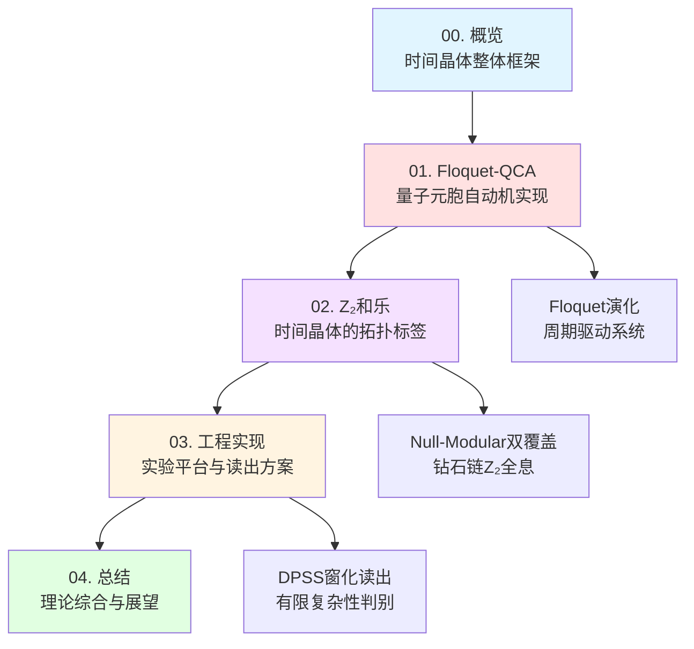
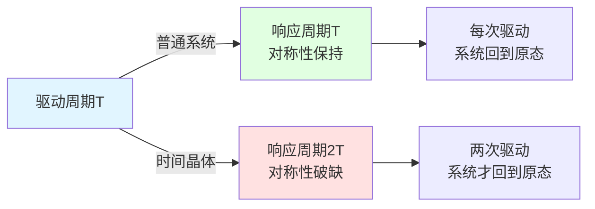
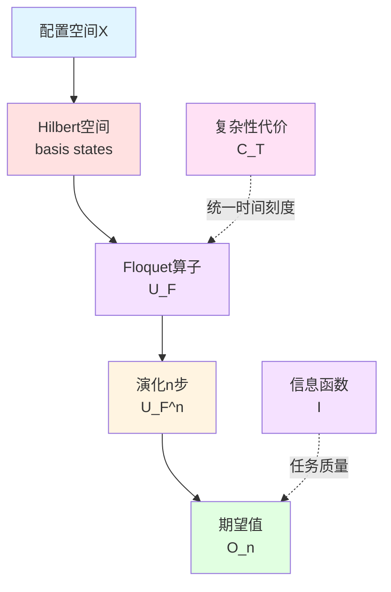
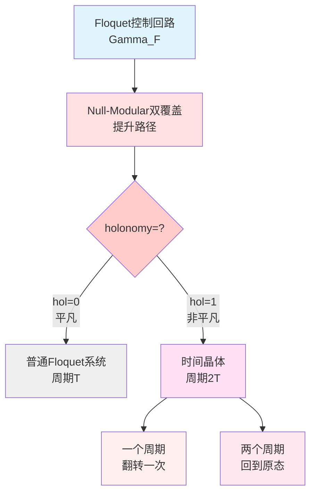
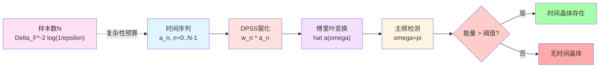
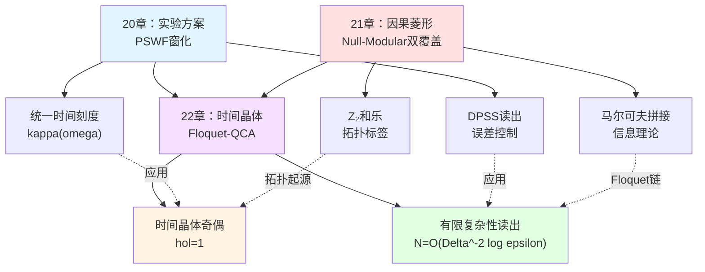
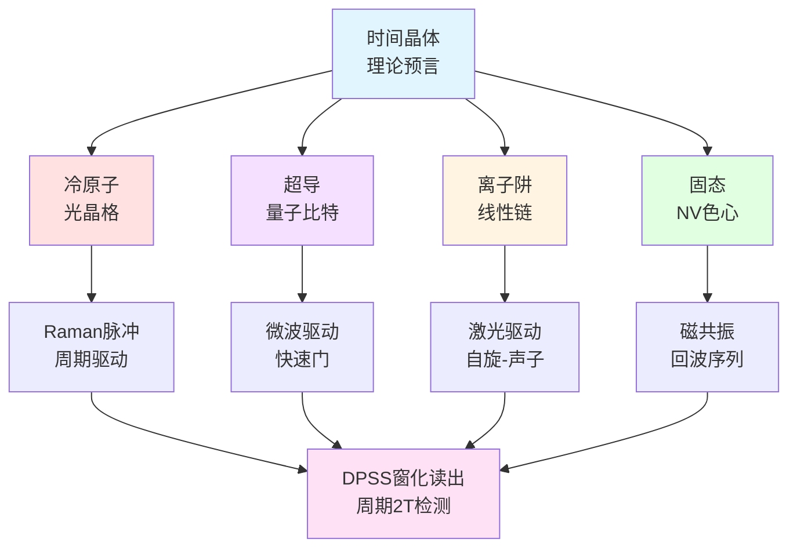

# 时间晶体理论概览

**源理论**：`euler-gls-info/17-time-crystals-null-modular-z2-holonomy.md`

---

## 引言

欢迎来到**时间晶体理论**章节！这是GLS统一理论通俗教程的第22章。

在前一章（21-causal-diamond-chain/）中，我们建立了因果菱形链的Null-Modular双覆盖理论，揭示了：
- Null边界的双层能流分解
- 马尔可夫拼接的信息理论
- 散射窗化测量与Z₂奇偶标签

现在，我们将这套理论应用到一个令人着迷的物理现象：**时间晶体**（Time Crystals）。

**什么是时间晶体？**

在日常生活中，晶体是空间上周期排列的结构（如食盐晶体）。时间晶体则是**时间上**周期振荡的系统——但它的振荡周期与驱动周期不同，形成"时间对称性破缺"。

**日常类比**：
想象一个摆钟：
- **普通驱动**：你每秒推一次钟摆，它每秒摆动一次
- **时间晶体**：你每秒推一次，但它每**两秒**才完成一次完整振荡！

这种"周期翻倍"现象违背了直觉，却在量子系统中真实存在。

本章将回答：
1. **时间晶体是什么**？（第01节）
2. **如何用Floquet-QCA描述它**？（第01-02节）
3. **Z₂和乐如何刻画时间晶体的拓扑性质**？（第02节）
4. **如何在实验中实现和测量时间晶体**？（第03节）

---

## 本章结构

本章共**5篇文章**，逻辑线索如下：

**Mermaid章节结构图**

### 各篇核心内容

| 篇名 | 核心主题 | 关键公式/概念 | 页数估计 |
|-----|---------|-------------|---------|
| **00. 概览** | 时间晶体整体框架 | 时间对称性破缺 | ~300行 |
| **01. Floquet-QCA** | 量子元胞自动机实现 | $U_{\rm FQCA}=(X,U_F,\mathsf{C}_T,\mathsf{I})$ | ~1200行 |
| **02. Z₂和乐** | 拓扑标签与Null-Modular | $\mathrm{hol}_{\mathbb{Z}_2}(\Gamma_F)$ | ~1300行 |
| **03. 工程实现** | 实验平台与读出 | DPSS窗化，$N=\mathcal{O}(\Delta^{-2}\log(1/\varepsilon))$ | ~1400行 |
| **04. 总结** | 理论综合与未来 | 统一时间刻度相位锁定 | ~800行 |

---

## 核心思想预览

### 1. 时间对称性破缺

**时间平移对称性**：物理定律在时间平移下不变。

**自发破缺**：系统的基态/稳态**不**具备完整的时间平移对称性。

对于周期驱动系统（Floquet系统），时间平移是**离散**的：
$$
t \to t + T \quad (\text{驱动周期})
$$

**时间晶体**：系统响应的周期为$mT$（$m\ge 2$），而非$T$。

**数学表达**：
设局域可观测量$O$，初态$\rho_0$，Floquet演化算子$U_F$。定义期望值序列：
$$
\langle O\rangle_n = \operatorname{tr}(\rho_0 U_F^{\dagger n} O U_F^n)
$$

**时间晶体条件**：
$$
\langle O\rangle_{n+m} = \langle O\rangle_n,\quad \forall n\gg 1
$$
且不存在$1\le m'<m$满足同样条件。

**Mermaid时间对称性图**

**日常类比**：
- **普通系统**：单摆，推一次摆一次
- **时间晶体**：跷跷板，推一次只翻到一半，推两次才完成一个完整周期

### 2. Floquet-QCA实现

**量子元胞自动机**（Quantum Cellular Automaton, QCA）：
- 格点集合$\Lambda$（如一维链、二维晶格）
- 每个格点上有有限维Hilbert空间$\mathcal{H}_x$
- 可逆局域酉算子$U:\mathcal{H}\to\mathcal{H}$

**Floquet驱动**：
周期哈密顿量$H(t+T)=H(t)$，演化算子：
$$
U_F = \mathcal{T}\exp\left(-\mathrm{i}\int_0^T H(t)\,\mathrm{d}t\right)
$$

**计算宇宙框架**：
$$
U_{\rm FQCA} = (X, U_F, \mathsf{C}_T, \mathsf{I})
$$
其中：
- $X$：配置集合
- $U_F$：Floquet演化算子
- $\mathsf{C}_T$：单周期复杂性代价
- $\mathsf{I}$：信息质量函数

**Mermaid Floquet-QCA结构**

### 3. Z₂和乐与拓扑不变量

**核心问题**：时间晶体的"周期翻倍"是否有深层的拓扑起源？

**答案**：是的！通过Null-Modular双覆盖理论。

**因果钻石链**：
将每个Floquet周期视为一颗因果菱形$\Diamond_{F,k}$，形成链：
$$
\{\Diamond_{F,k}\}_{k\in\mathbb{Z}}
$$

**模2时间相位标签**：
每个周期定义一个Z₂标签$\epsilon_k\in\{0,1\}$，由散射相位决定：
$$
\epsilon_F = \left\lfloor \frac{\arg\det U_F}{\pi} \right\rfloor \bmod 2
$$

**Z₂和乐**（holonomy）：
闭合Floquet控制回路$\Gamma_F$在Null-Modular双覆盖上的和乐：
$$
\mathrm{hol}_{\mathbb{Z}_2}(\Gamma_F) \in \{0, 1\}
$$

**关键定理**（定理4.1，源理论§4.3）：
$$
\boxed{
\text{周期翻倍时间晶体 (}m=2\text{)} \quad\Leftrightarrow\quad \mathrm{hol}_{\mathbb{Z}_2}(\Gamma_F) = 1
}
$$

**物理意义**：
- 和乐为$0$：平凡，无时间晶体
- 和乐为$1$：非平凡，存在周期翻倍时间晶体

**Mermaid Z₂和乐图**

**日常类比**：
- **Möbius带**：走一圈（$2\pi$）回到原位但上下翻转（和乐=1）
- **普通圆环**：走一圈回到原位且方向不变（和乐=0）
- 时间晶体的Floquet演化就像Möbius带：每走一圈翻转一次！

### 4. 有限复杂性读出

**实验挑战**：如何在**有限测量步数**$N$内判别时间晶体信号？

**DPSS窗化方案**：
使用离散prolate spheroidal序列（DPSS）作为窗函数$\{w_n\}$，构造加窗傅里叶谱：
$$
\widehat{a}(\omega) = \sum_{n=0}^{N-1} w_n a_n\,\mathrm{e}^{-\mathrm{i}\omega n}
$$

对于$m=2$时间晶体，主频在$\omega=\pi$（归一化频率）。

**样本复杂度**（定理5.1，源理论§5.3）：
为在错误概率$\varepsilon$下判别时间晶体，所需步数：
$$
\boxed{
N \ge C\Delta_{\rm F}^{-2}\log(1/\varepsilon)
}
$$
其中$\Delta_{\rm F}$为Floquet准能量带隙。

**物理意义**：
- 带隙$\Delta_{\rm F}$越大，信号越强，需要的样本越少
- 带隙小→信号弱→需要更多样本
- 误差要求$\varepsilon$越小，需要的样本越多（对数增长）

**Mermaid读出流程**

---

## 与前章的联系

本章是第21章（因果菱形链）理论的**直接应用**：

| 第21章概念 | 第22章应用 |
|-----------|-----------|
| 因果菱形$D$ | Floquet周期钻石$\Diamond_{F,k}$ |
| Null边界双层$\widetilde{E}=E^+\sqcup E^-$ | Floquet谱的双带结构 |
| 模哈密顿量$K_D$ | Floquet演化算子$U_F$ |
| Z₂全息$\mathrm{hol}_{\mathbb{Z}_2}$ | 时间晶体奇偶标签 |
| 散射窗化（定理G） | DPSS时间晶体读出 |
| 马尔可夫拼接 | Floquet链的信息传递 |

**统一时间刻度的核心地位**：
$$
\kappa(\omega) = \frac{\varphi'(\omega)}{\pi} = \rho_{\rm rel}(\omega) = \frac{1}{2\pi}\operatorname{tr}Q(\omega)
$$

在Floquet系统中：
$$
\kappa_F(\omega) = \frac{1}{2\pi}\operatorname{tr}Q_F(\omega),\quad Q_F = -\mathrm{i}U_F^\dagger\partial_\omega U_F
$$

**Mermaid理论继承图**

---

## 本章的独特贡献

相比经典的时间晶体文献，本章的创新点在于：

### 1. 计算宇宙视角

**传统理论**：
时间晶体通常在连续时空、连续哈密顿量框架下讨论。

**本章视角**：
- **离散化**：QCA框架，事件层$E=X\times\mathbb{Z}$
- **复杂性几何**：单步代价$\mathsf{C}_T$由统一时间刻度积分给出
- **计算可实现性**：明确算法复杂度$N=\mathcal{O}(\Delta^{-2}\log(1/\varepsilon))$

### 2. 拓扑不变量的显式构造

**传统理论**：
时间晶体的周期翻倍主要从准能量谱角度理解。

**本章贡献**：
- 将周期翻倍精确对应到$\mathbb{Z}_2$和乐$\mathrm{hol}_{\mathbb{Z}_2}(\Gamma_F)$
- 通过Null-Modular双覆盖给出拓扑不变量的几何实现
- 连接到自参照奇偶与拓扑复杂性理论

### 3. 统一时间刻度的统摄

**传统理论**：
时间晶体与散射理论、模理论、信息几何是分离的领域。

**本章统一**：
- **散射侧**：$Q_F(\omega)$群延迟与相位
- **模理论侧**：Floquet钻石的模哈密顿量
- **信息侧**：任务信息函数$\mathsf{I}$与复杂性代价
- **统一刻度**：$\kappa_F(\omega)$贯穿始终

### 4. 工程可实现性

**传统理论**：
时间晶体的观测方案通常是定性的。

**本章量化**：
- 明确样本复杂度$N=\mathcal{O}(\Delta^{-2}\log(1/\varepsilon))$
- DPSS窗化的最优性证明
- 噪声鲁棒性的显式界

---

## 实验平台展望

时间晶体可在多种量子平台实现：

### 1. 冷原子光晶格

**系统**：
- 一维/二维光晶格中的冷原子
- 周期性Raman脉冲驱动

**优势**：
- 长相干时间
- 可调控相互作用
- 单格点分辨成像

**时间晶体信号**：
测量局域自旋期望值$\langle\sigma_x^z\rangle_n$，观测周期$2T$振荡。

### 2. 超导量子比特

**系统**：
- 约瑟夫森结阵列
- 微波驱动

**优势**：
- 快速操控（纳秒级门）
- 高保真度测量
- 可编程架构

**时间晶体信号**：
通过量子态层析重构密度矩阵，验证周期翻倍。

### 3. 离子阱

**系统**：
- 线性离子链
- 激光驱动自旋-声子耦合

**优势**：
- 全连接相互作用
- 超长相干时间（秒级）
- 单离子寻址

**时间晶体信号**：
测量集体自旋算符，观测Floquet准能量谱。

### 4. 固态自旋系统

**系统**：
- 金刚石NV色心
- 磁共振驱动

**优势**：
- 室温操作
- 长退相干时间
- 集成化潜力

**时间晶体信号**：
电子自旋回波序列，检测周期性调制。

**Mermaid实验平台图**

---

## 本章学习路线图

**初学者路径**（着重直观理解）：
1. 阅读00概览（本篇）
2. 阅读01节Floquet-QCA的前半部分（§3.1-3.2）
3. 跳过技术细节，直接看03节工程实现
4. 阅读04总结

**深入学习路径**（完整技术细节）：
1. 00概览
2. 01 Floquet-QCA（完整）
3. 02 Z₂和乐（完整，需要第21章背景）
4. 03 工程实现（完整，需要第20章DPSS背景）
5. 04 总结

**实验物理学家路径**（侧重应用）：
1. 00概览
2. 01节§3.3 Floquet谱与带结构
3. 02节§4.3 时间晶体奇偶判据
4. 03 工程实现（重点！）
5. 查阅附录中的具体模型

**理论物理学家路径**（侧重数学）：
1. 00概览
2. 01 Floquet-QCA（重点§3.1定义）
3. 02 Z₂和乐（重点§4.2-4.3定理证明）
4. 阅读源理论`euler-gls-info/17-time-crystals-null-modular-z2-holonomy.md`附录

---

## 关键术语对照

| 中文术语 | 英文术语 | 数学记号 |
|---------|---------|---------|
| 时间晶体 | Time Crystal | — |
| 周期翻倍 | Period Doubling | $m=2$ |
| Floquet演化 | Floquet Evolution | $U_F$ |
| 量子元胞自动机 | Quantum Cellular Automaton | QCA |
| 准能量 | Quasienergy | $\varepsilon_\alpha$ |
| Z₂和乐 | Z₂ Holonomy | $\mathrm{hol}_{\mathbb{Z}_2}$ |
| 模2相位标签 | Mod-2 Phase Label | $\epsilon_F\in\{0,1\}$ |
| Null-Modular双覆盖 | Null-Modular Double Cover | $\widetilde{\mathfrak{D}}\to\mathfrak{D}$ |
| 统一时间刻度 | Unified Time Scale | $\kappa(\omega)$ |
| DPSS窗化 | DPSS Windowing | $\{w_n^{(0)}\}$ |
| 样本复杂度 | Sample Complexity | $N=\mathcal{O}(\Delta^{-2}\log(1/\varepsilon))$ |

---

## 全章核心公式一览

**Floquet-QCA对象**（定义3.1）：
$$
U_{\rm FQCA} = (X, U_F, \mathsf{C}_T, \mathsf{I})
$$

**时间晶体条件**（定义3.2）：
$$
\langle O\rangle_{n+m} = \langle O\rangle_n,\quad \forall n\ge n_0
$$

**准能量谱**：
$$
U_F\ket{\psi_\alpha} = \mathrm{e}^{-\mathrm{i}\varepsilon_\alpha T}\ket{\psi_\alpha}
$$

**模2相位标签**：
$$
\epsilon_F = \left\lfloor \frac{\arg\det U_F}{\pi} \right\rfloor \bmod 2
$$

**Z₂和乐-时间晶体对应**（定理4.1）：
$$
\text{周期翻倍时间晶体}\quad\Leftrightarrow\quad \mathrm{hol}_{\mathbb{Z}_2}(\Gamma_F) = 1
$$

**统一时间刻度**（Floquet版本）：
$$
\kappa_F(\omega) = \frac{1}{2\pi}\operatorname{tr}Q_F(\omega),\quad Q_F = -\mathrm{i}U_F^\dagger\partial_\omega U_F
$$

**DPSS读出样本复杂度**（定理5.1）：
$$
N \ge C\Delta_{\rm F}^{-2}\log(1/\varepsilon)
$$

---

## 下一篇预告

下一篇（**01-floquet-qca.md**）将详细展开：
- Floquet-QCA的数学定义
- 离散时间平移对称性的自发破缺
- 准能量谱与带结构
- 周期翻倍机制的微观起源
- 自旋链模型实例

---

**本篇完成！**

---

**源理论**：`euler-gls-info/17-time-crystals-null-modular-z2-holonomy.md`
