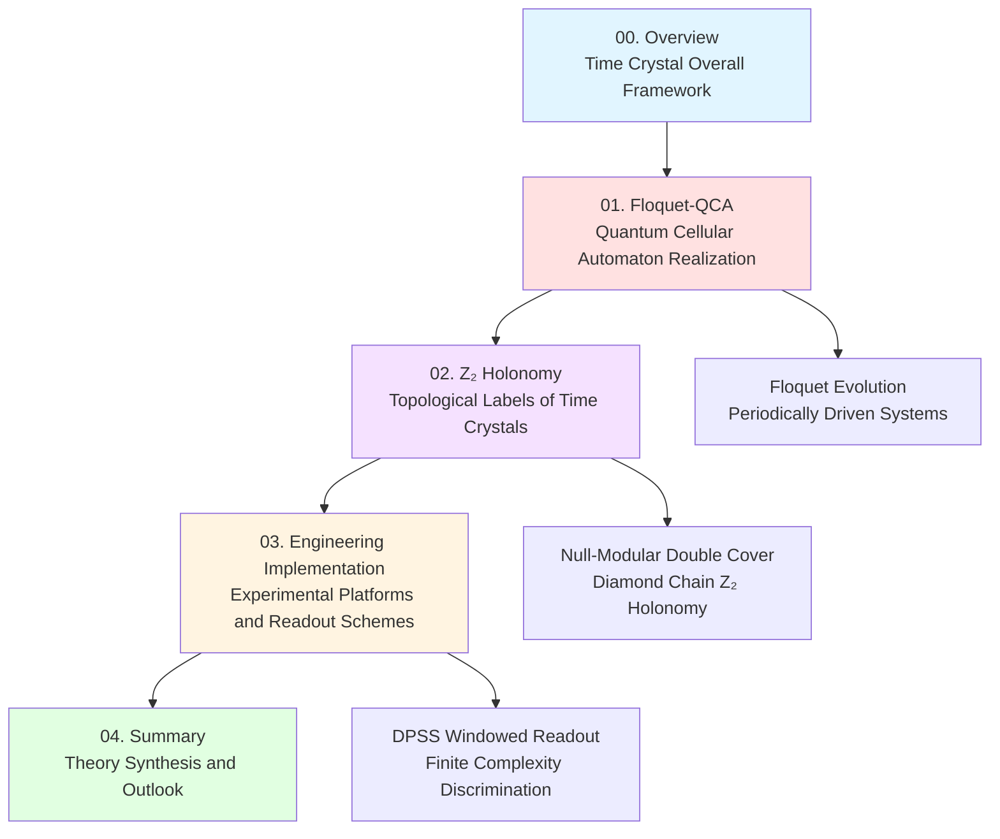
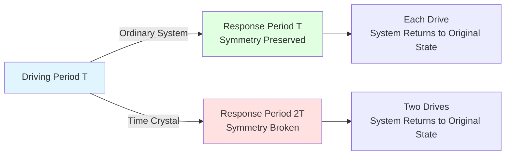
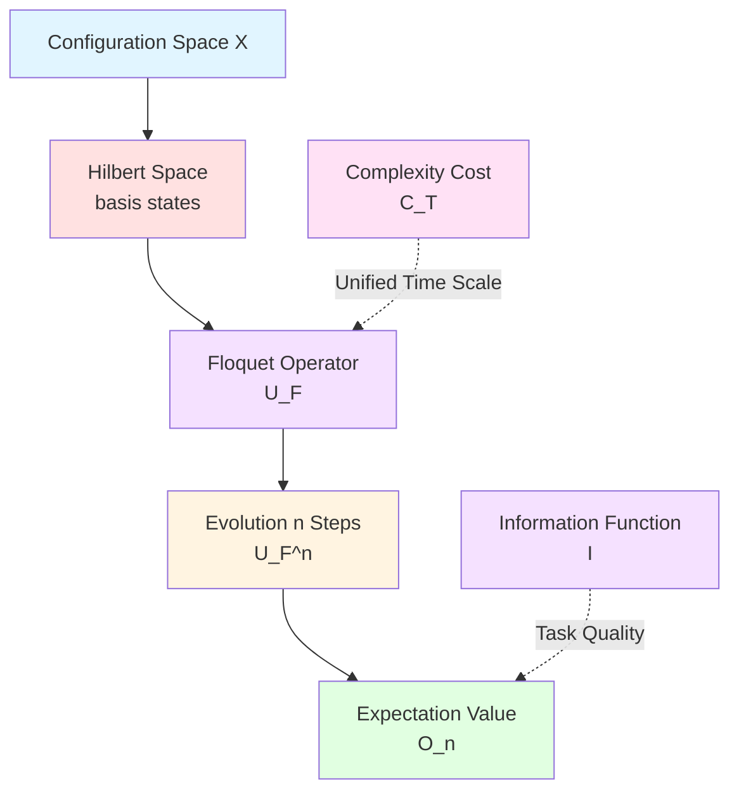
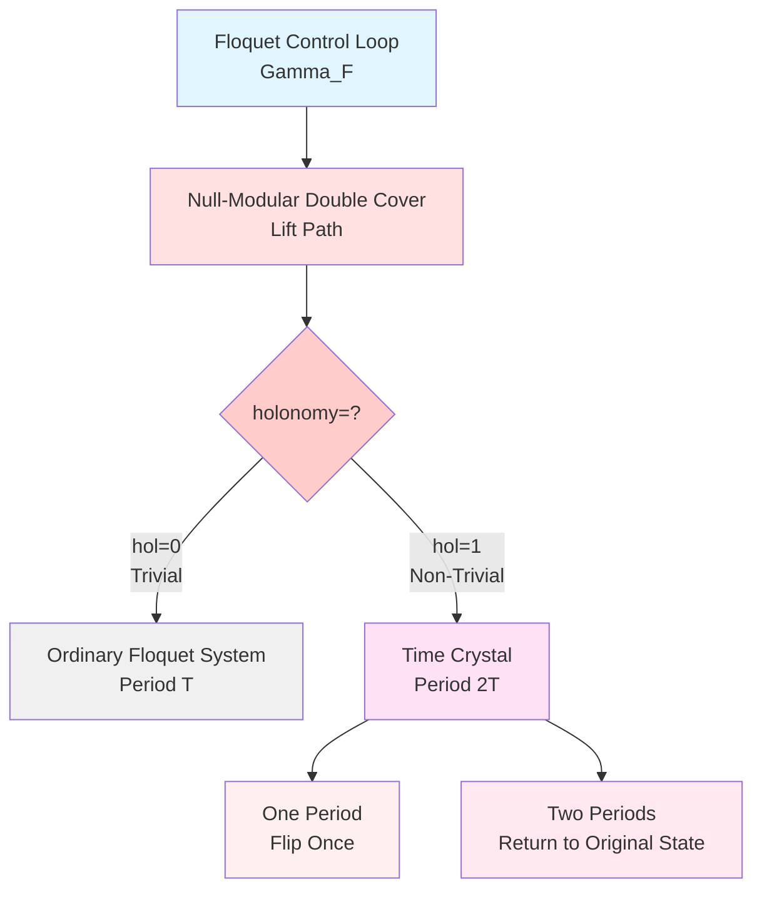
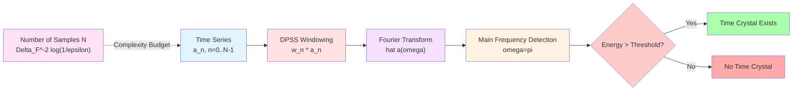
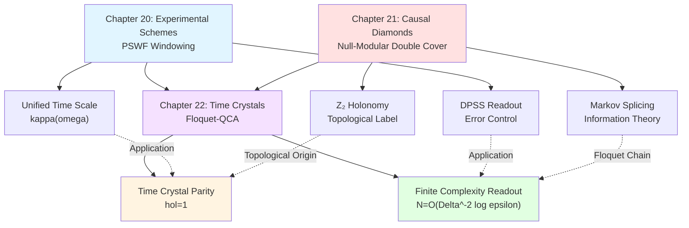
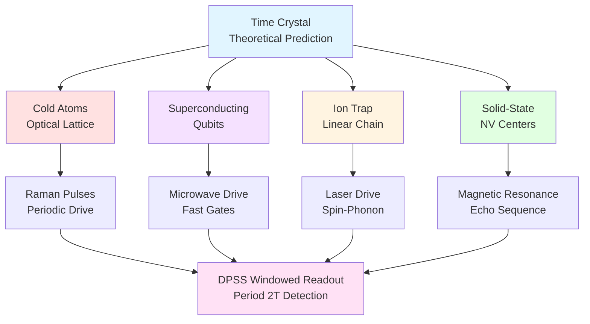

# Time Crystal Theory Overview

**Source Theory**: `euler-gls-info/17-time-crystals-null-modular-z2-holonomy.md`

---

## Introduction

Welcome to the **Time Crystal Theory** chapter! This is Chapter 22 of the GLS Unified Theory Popular Tutorial.

In the previous chapter (21-causal-diamond-chain/), we established the Null-Modular double cover theory of causal diamond chains, revealing:
- Double-layer energy flow decomposition of Null boundaries
- Information theory of Markov splicing
- Scattering windowed measurement and Z₂ parity labels

Now, we will apply this theory to a fascinating physical phenomenon: **Time Crystals**.

**What Are Time Crystals?**

In daily life, crystals are structures with periodic spatial arrangement (e.g., salt crystals). Time crystals are systems that oscillate periodically in **time**—but their oscillation period differs from the driving period, forming "time symmetry breaking."

**Everyday Analogy**:
Imagine a pendulum clock:
- **Ordinary Drive**: You push the pendulum once per second, it swings once per second
- **Time Crystal**: You push once per second, but it takes **two seconds** to complete one full oscillation!

This "period doubling" phenomenon defies intuition, yet exists in quantum systems.

This chapter will answer:
1. **What are time crystals**? (Section 01)
2. **How to describe them with Floquet-QCA**? (Sections 01-02)
3. **How does Z₂ holonomy characterize topological properties of time crystals**? (Section 02)
4. **How to realize and measure time crystals in experiments**? (Section 03)

---

## Chapter Structure

This chapter consists of **5 articles**, with logical thread as follows:

**Mermaid Chapter Structure Diagram**

### Core Content of Each Article

| Article | Core Theme | Key Formulas/Concepts | Estimated Lines |
|---------|------------|----------------------|-----------------|
| **00. Overview** | Time crystal overall framework | Time symmetry breaking | ~300 lines |
| **01. Floquet-QCA** | Quantum cellular automaton realization | $U_{\rm FQCA}=(X,U_F,\mathsf{C}_T,\mathsf{I})$ | ~1200 lines |
| **02. Z₂ Holonomy** | Topological labels and Null-Modular | $\mathrm{hol}_{\mathbb{Z}_2}(\Gamma_F)$ | ~1300 lines |
| **03. Engineering Implementation** | Experimental platforms and readout | DPSS windowing, $N=\mathcal{O}(\Delta^{-2}\log(1/\varepsilon))$ | ~1400 lines |
| **04. Summary** | Theory synthesis and future | Unified time scale phase locking | ~800 lines |

---

## Core Ideas Preview

### 1. Time Symmetry Breaking

**Time Translation Symmetry**: Physical laws are invariant under time translation.

**Spontaneous Breaking**: Ground state/steady state of system **does not** possess full time translation symmetry.

For periodically driven systems (Floquet systems), time translation is **discrete**:
$$
t \to t + T \quad (\text{driving period})
$$

**Time Crystal**: System response period is $mT$ ($m\ge 2$), not $T$.

**Mathematical Expression**:
Let local observable $O$, initial state $\rho_0$, Floquet evolution operator $U_F$. Define expectation value sequence:
$$
\langle O\rangle_n = \operatorname{tr}(\rho_0 U_F^{\dagger n} O U_F^n)
$$

**Time Crystal Condition**:
$$
\langle O\rangle_{n+m} = \langle O\rangle_n,\quad \forall n\gg 1
$$
and no $1\le m'<m$ satisfies the same condition.

**Mermaid Time Symmetry Diagram**

**Everyday Analogy**:
- **Ordinary System**: Simple pendulum, push once swing once
- **Time Crystal**: Seesaw, push once only flips halfway, two pushes complete one full period

### 2. Floquet-QCA Realization

**Quantum Cellular Automaton** (QCA):
- Lattice set $\Lambda$ (e.g., one-dimensional chain, two-dimensional lattice)
- Each lattice site has finite-dimensional Hilbert space $\mathcal{H}_x$
- Reversible local unitary operator $U:\mathcal{H}\to\mathcal{H}$

**Floquet Drive**:
Periodic Hamiltonian $H(t+T)=H(t)$, evolution operator:
$$
U_F = \mathcal{T}\exp\left(-\mathrm{i}\int_0^T H(t)\,\mathrm{d}t\right)
$$

**Computational Universe Framework**:
$$
U_{\rm FQCA} = (X, U_F, \mathsf{C}_T, \mathsf{I})
$$
where:
- $X$: Configuration set
- $U_F$: Floquet evolution operator
- $\mathsf{C}_T$: Single-period complexity cost
- $\mathsf{I}$: Information quality function

**Mermaid Floquet-QCA Structure**

### 3. Z₂ Holonomy and Topological Invariants

**Core Question**: Does the "period doubling" of time crystals have a deep topological origin?

**Answer**: Yes! Through Null-Modular double cover theory.

**Causal Diamond Chain**:
Treat each Floquet period as a causal diamond $\Diamond_{F,k}$, forming chain:
$$
\{\Diamond_{F,k}\}_{k\in\mathbb{Z}}
$$

**Mod-2 Time Phase Label**:
Each period defines a Z₂ label $\epsilon_k\in\{0,1\}$, determined by scattering phase:
$$
\epsilon_F = \left\lfloor \frac{\arg\det U_F}{\pi} \right\rfloor \bmod 2
$$

**Z₂ Holonomy**:
Holonomy of closed Floquet control loop $\Gamma_F$ on Null-Modular double cover:
$$
\mathrm{hol}_{\mathbb{Z}_2}(\Gamma_F) \in \{0, 1\}
$$

**Key Theorem** (Theorem 4.1, Source Theory §4.3):
$$
\boxed{
\text{Period-Doubling Time Crystal (}m=2\text{)} \quad\Leftrightarrow\quad \mathrm{hol}_{\mathbb{Z}_2}(\Gamma_F) = 1
}
$$

**Physical Meaning**:
- Holonomy $0$: Trivial, no time crystal
- Holonomy $1$: Non-trivial, period-doubling time crystal exists

**Mermaid Z₂ Holonomy Diagram**

**Everyday Analogy**:
- **Möbius Strip**: Go around once ($2\pi$) return to original position but flip upside down (holonomy=1)
- **Ordinary Ring**: Go around once return to original position with same orientation (holonomy=0)
- Floquet evolution of time crystal is like Möbius strip: flip once per round!

### 4. Finite Complexity Readout

**Experimental Challenge**: How to discriminate time crystal signal within **finite measurement steps** $N$?

**DPSS Windowing Scheme**:
Use discrete prolate spheroidal sequences (DPSS) as window functions $\{w_n\}$, construct windowed Fourier spectrum:
$$
\widehat{a}(\omega) = \sum_{n=0}^{N-1} w_n a_n\,\mathrm{e}^{-\mathrm{i}\omega n}
$$

For $m=2$ time crystal, main frequency is at $\omega=\pi$ (normalized frequency).

**Sample Complexity** (Theorem 5.1, Source Theory §5.3):
To discriminate time crystal with error probability $\varepsilon$, required steps:
$$
\boxed{
N \ge C\Delta_{\rm F}^{-2}\log(1/\varepsilon)
}
$$
where $\Delta_{\rm F}$ is Floquet quasienergy band gap.

**Physical Meaning**:
- Larger band gap $\Delta_{\rm F}$, stronger signal, fewer samples needed
- Small gap → weak signal → more samples needed
- Smaller error requirement $\varepsilon$, more samples needed (logarithmic growth)

**Mermaid Readout Flow**

---

## Connections with Previous Chapters

This chapter is a **direct application** of Chapter 21 (Causal Diamond Chain) theory:

| Chapter 21 Concept | Chapter 22 Application |
|-------------------|----------------------|
| Causal diamond $D$ | Floquet period diamond $\Diamond_{F,k}$ |
| Null boundary double-layer $\widetilde{E}=E^+\sqcup E^-$ | Double-band structure of Floquet spectrum |
| Modular Hamiltonian $K_D$ | Floquet evolution operator $U_F$ |
| Z₂ holonomy $\mathrm{hol}_{\mathbb{Z}_2}$ | Time crystal parity label |
| Scattering windowing (Theorem G) | DPSS time crystal readout |
| Markov splicing | Information transfer in Floquet chain |

**Central Position of Unified Time Scale**:
$$
\kappa(\omega) = \frac{\varphi'(\omega)}{\pi} = \rho_{\rm rel}(\omega) = \frac{1}{2\pi}\operatorname{tr}Q(\omega)
$$

In Floquet systems:
$$
\kappa_F(\omega) = \frac{1}{2\pi}\operatorname{tr}Q_F(\omega),\quad Q_F = -\mathrm{i}U_F^\dagger\partial_\omega U_F
$$

**Mermaid Theory Inheritance Diagram**

---

## Unique Contributions of This Chapter

Compared to classical time crystal literature, innovations of this chapter include:

### 1. Computational Universe Perspective

**Traditional Theory**:
Time crystals are usually discussed in continuous spacetime, continuous Hamiltonian framework.

**This Chapter's Perspective**:
- **Discretization**: QCA framework, event layer $E=X\times\mathbb{Z}$
- **Complexity Geometry**: Single-step cost $\mathsf{C}_T$ given by unified time scale integral
- **Computational Realizability**: Explicit algorithm complexity $N=\mathcal{O}(\Delta^{-2}\log(1/\varepsilon))$

### 2. Explicit Construction of Topological Invariants

**Traditional Theory**:
Period doubling of time crystals mainly understood from quasienergy spectrum perspective.

**This Chapter's Contribution**:
- Precisely correspond period doubling to $\mathbb{Z}_2$ holonomy $\mathrm{hol}_{\mathbb{Z}_2}(\Gamma_F)$
- Give geometric realization of topological invariants through Null-Modular double cover
- Connect to self-referential parity and topological complexity theory

### 3. Unification by Unified Time Scale

**Traditional Theory**:
Time crystals, scattering theory, modular theory, information geometry are separate fields.

**This Chapter's Unification**:
- **Scattering Side**: $Q_F(\omega)$ group delay and phase
- **Modular Theory Side**: Modular Hamiltonian of Floquet diamonds
- **Information Side**: Task information function $\mathsf{I}$ and complexity cost
- **Unified Scale**: $\kappa_F(\omega)$ runs throughout

### 4. Engineering Realizability

**Traditional Theory**:
Observation schemes for time crystals are usually qualitative.

**This Chapter's Quantification**:
- Explicit sample complexity $N=\mathcal{O}(\Delta^{-2}\log(1/\varepsilon))$
- Optimality proof of DPSS windowing
- Explicit bounds for noise robustness

---

## Experimental Platform Outlook

Time crystals can be realized on various quantum platforms:

### 1. Cold Atom Optical Lattices

**System**:
- Cold atoms in one/two-dimensional optical lattices
- Periodic Raman pulse driving

**Advantages**:
- Long coherence time
- Tunable interactions
- Single-site resolved imaging

**Time Crystal Signal**:
Measure local spin expectation value $\langle\sigma_x^z\rangle_n$, observe period $2T$ oscillation.

### 2. Superconducting Qubits

**System**:
- Josephson junction arrays
- Microwave driving

**Advantages**:
- Fast manipulation (nanosecond gates)
- High-fidelity measurement
- Programmable architecture

**Time Crystal Signal**:
Reconstruct density matrix through quantum state tomography, verify period doubling.

### 3. Ion Traps

**System**:
- Linear ion chains
- Laser-driven spin-phonon coupling

**Advantages**:
- All-to-all interactions
- Ultra-long coherence time (second scale)
- Single-ion addressing

**Time Crystal Signal**:
Measure collective spin operator, observe Floquet quasienergy spectrum.

### 4. Solid-State Spin Systems

**System**:
- Diamond NV centers
- Magnetic resonance driving

**Advantages**:
- Room temperature operation
- Long decoherence time
- Integration potential

**Time Crystal Signal**:
Electron spin echo sequence, detect periodic modulation.

**Mermaid Experimental Platform Diagram**

---

## Chapter Learning Roadmap

**Beginner Path** (focus on intuitive understanding):
1. Read 00 Overview (this article)
2. Read first half of Section 01 Floquet-QCA (§3.1-3.2)
3. Skip technical details, go directly to Section 03 Engineering Implementation
4. Read Section 04 Summary

**Deep Learning Path** (complete technical details):
1. 00 Overview
2. 01 Floquet-QCA (complete)
3. 02 Z₂ Holonomy (complete, requires Chapter 21 background)
4. 03 Engineering Implementation (complete, requires Chapter 20 DPSS background)
5. 04 Summary

**Experimental Physicist Path** (focus on applications):
1. 00 Overview
2. Section 01 §3.3 Floquet Spectrum and Band Structure
3. Section 02 §4.3 Time Crystal Parity Criterion
4. 03 Engineering Implementation (key!)
5. Consult specific models in appendices

**Theoretical Physicist Path** (focus on mathematics):
1. 00 Overview
2. 01 Floquet-QCA (focus §3.1 definitions)
3. 02 Z₂ Holonomy (focus §4.2-4.3 theorem proofs)
4. Read source theory `euler-gls-info/17-time-crystals-null-modular-z2-holonomy.md` appendices

---

## Key Term Glossary

| Chinese Term | English Term | Mathematical Notation |
|-------------|-------------|---------------------|
| 时间晶体 | Time Crystal | — |
| 周期翻倍 | Period Doubling | $m=2$ |
| Floquet演化 | Floquet Evolution | $U_F$ |
| 量子元胞自动机 | Quantum Cellular Automaton | QCA |
| 准能量 | Quasienergy | $\varepsilon_\alpha$ |
| Z₂和乐 | Z₂ Holonomy | $\mathrm{hol}_{\mathbb{Z}_2}$ |
| 模2相位标签 | Mod-2 Phase Label | $\epsilon_F\in\{0,1\}$ |
| Null-Modular双覆盖 | Null-Modular Double Cover | $\widetilde{\mathfrak{D}}\to\mathfrak{D}$ |
| 统一时间刻度 | Unified Time Scale | $\kappa(\omega)$ |
| DPSS窗化 | DPSS Windowing | $\{w_n^{(0)}\}$ |
| 样本复杂度 | Sample Complexity | $N=\mathcal{O}(\Delta^{-2}\log(1/\varepsilon))$ |

---

## Core Formulas of Entire Chapter

**Floquet-QCA Object** (Definition 3.1):
$$
U_{\rm FQCA} = (X, U_F, \mathsf{C}_T, \mathsf{I})
$$

**Time Crystal Condition** (Definition 3.2):
$$
\langle O\rangle_{n+m} = \langle O\rangle_n,\quad \forall n\ge n_0
$$

**Quasienergy Spectrum**:
$$
U_F\ket{\psi_\alpha} = \mathrm{e}^{-\mathrm{i}\varepsilon_\alpha T}\ket{\psi_\alpha}
$$

**Mod-2 Phase Label**:
$$
\epsilon_F = \left\lfloor \frac{\arg\det U_F}{\pi} \right\rfloor \bmod 2
$$

**Z₂ Holonomy–Time Crystal Correspondence** (Theorem 4.1):
$$
\text{Period-Doubling Time Crystal}\quad\Leftrightarrow\quad \mathrm{hol}_{\mathbb{Z}_2}(\Gamma_F) = 1
$$

**Unified Time Scale** (Floquet version):
$$
\kappa_F(\omega) = \frac{1}{2\pi}\operatorname{tr}Q_F(\omega),\quad Q_F = -\mathrm{i}U_F^\dagger\partial_\omega U_F
$$

**DPSS Readout Sample Complexity** (Theorem 5.1):
$$
N \ge C\Delta_{\rm F}^{-2}\log(1/\varepsilon)
$$

---

## Preview of Next Article

Next article (**01-floquet-qca.md**) will detail:
- Mathematical definition of Floquet-QCA
- Spontaneous breaking of discrete time translation symmetry
- Quasienergy spectrum and band structure
- Microscopic origin of period doubling mechanism
- Spin chain model examples

---

**This Article Complete!**

---

**Source Theory**: `euler-gls-info/17-time-crystals-null-modular-z2-holonomy.md`

