# 第一章：Floquet量子元胞自动机理论

**源理论**：`euler-gls-info/17-time-crystals-null-modular-z2-holonomy.md`，§2-3

---

## 引言

在上一篇概览中，我们初步认识了时间晶体——一种在时间维度上"周期翻倍"的奇异量子相。本章将深入探讨时间晶体的**微观机制**：如何用**Floquet量子元胞自动机**（Floquet-QCA）严格描述它。

**本章核心问题**：
1. 什么是量子元胞自动机（QCA）？
2. 如何在QCA中引入周期驱动（Floquet演化）？
3. 时间晶体的数学定义是什么？
4. 周期翻倍的微观机制是什么？

**日常类比**：
- **QCA**：棋盘上的量子国际象棋——每个格子有量子态，按规则更新
- **Floquet驱动**：定时器每秒响一次，每次响就按规则走一步
- **时间晶体**：棋局每**两步**才回到相似构型，而非每步

---

## 1. 计算宇宙与QCA基础

### 1.1 计算宇宙公理

回顾**计算宇宙公理系统**（源理论§2.1）：

$$
U_{\rm comp} = (X, \mathsf{T}, \mathsf{C}, \mathsf{I})
$$

**四元组含义**：

| 元素 | 名称 | 物理意义 |
|-----|------|---------|
| $X$ | 配置集合 | 所有可能的系统状态 |
| $\mathsf{T}\subset X\times X$ | 更新关系 | 允许的状态跃迁 |
| $\mathsf{C}:X\times X\to[0,\infty]$ | 代价函数 | 每次跃迁的"时间成本" |
| $\mathsf{I}:X\to\mathbb{R}$ | 信息函数 | 状态的"任务质量" |

**可逆性假设**：
$\mathsf{T}$是可逆的，即存在逆映射$\mathsf{T}^{-1}$，保证信息不丢失。

**Mermaid计算宇宙结构**

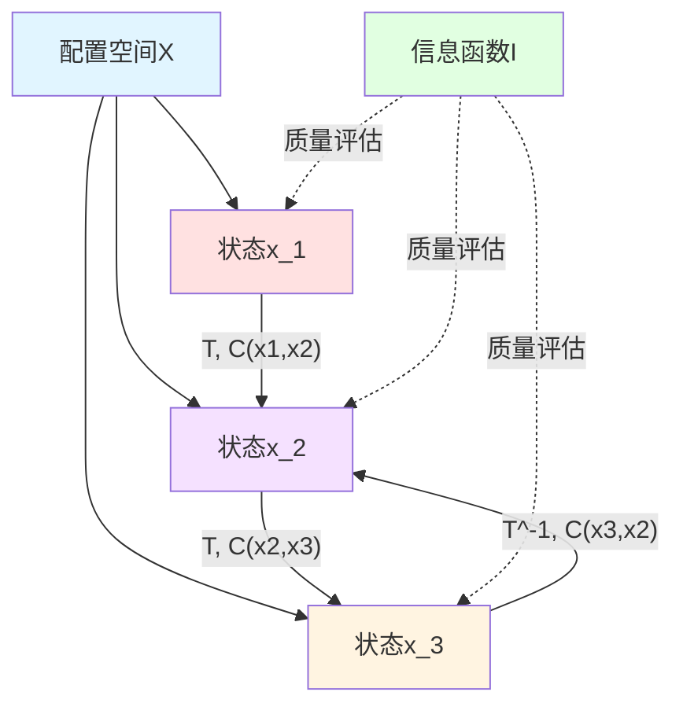

**日常类比**：
- **$X$**：所有可能的"棋局"
- **$\mathsf{T}$**：合法的"走子规则"
- **$\mathsf{C}$**：每步棋的"思考时间"
- **$\mathsf{I}$**：当前棋局的"优势评分"

### 1.2 量子元胞自动机（QCA）

**经典元胞自动机**（Cellular Automaton）：
- 格点集合$\Lambda$（如一维链$\mathbb{Z}$、二维网格$\mathbb{Z}^2$）
- 每个格点$x\in\Lambda$有有限状态集$S_x$
- 全局配置$s\in\prod_{x\in\Lambda}S_x$
- 局域更新规则$s\to s'$

**量子版本**（QCA）：
- 格点$x\in\Lambda$
- 每个格点有**有限维Hilbert空间**$\mathcal{H}_x$（如$\mathcal{H}_x\cong\mathbb{C}^2$为单个量子比特）
- 全局Hilbert空间$\mathcal{H}=\bigotimes_{x\in\Lambda}\mathcal{H}_x$
- **可逆酉算子**$U:\mathcal{H}\to\mathcal{H}$

**局域性条件**：
$U$可分解为有限深度的局域酉门序列，保证因果性。

**QCA与计算宇宙的对应**：
- 配置$x\in X$：规范化基矢$\ket{x}\in\mathcal{H}$
- 更新关系$(x,y)\in\mathsf{T}$：$\langle y|U|x\rangle\ne 0$
- 代价$\mathsf{C}(x,y)$：执行$U$所需的物理时间（由统一时间刻度给出）

**Mermaid QCA结构**

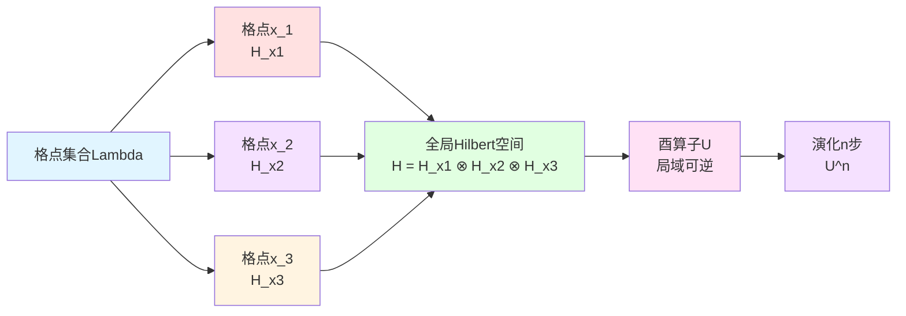

**日常类比**：
- **经典CA**：生命游戏（Conway's Game of Life）——细胞生死按规则更新
- **QCA**：量子生命游戏——每个细胞是量子比特，按量子门更新

### 1.3 统一时间刻度在QCA中的体现

在物理侧，QCA的一步演化对应某个物理时间增量$\Delta t$。在**统一时间刻度**框架中：

$$
\Delta t = \int \kappa(\omega)\,\mathrm{d}\omega
$$

其中$\kappa(\omega)$为统一时间刻度密度（回顾第20章）：

$$
\kappa(\omega) = \frac{\varphi'(\omega)}{\pi} = \rho_{\rm rel}(\omega) = \frac{1}{2\pi}\operatorname{tr}Q(\omega)
$$

对QCA，可定义**群延迟矩阵**（源理论§2.2）：

$$
Q(\omega) = -\mathrm{i}U(\omega)^\dagger\partial_\omega U(\omega)
$$

其中$U(\omega)$为频率依赖的演化算子（通过驱动谱与系统响应体现）。

**复杂性代价**$\mathsf{C}$：
单步QCA演化的复杂性代价可定义为：

$$
\mathsf{C}(x,y) = \int_{\Omega} w(\omega)\kappa(\omega)\,\mathrm{d}\omega
$$

其中$w(\omega)$为权重函数，$\Omega$为相关频段。

---

## 2. Floquet系统：周期驱动的量子动力学

### 2.1 时间依赖哈密顿量

**Floquet系统**：哈密顿量$H(t)$满足周期性

$$
H(t+T) = H(t),\quad \forall t
$$

其中$T$为驱动周期。

**经典例子**：
- 周期性激光脉冲驱动的原子
- 交流电驱动的超导回路
- 周期性调制的光晶格

**演化算子**：
在一个周期$[0,T]$内，系统演化为：

$$
U_F = \mathcal{T}\exp\left(-\mathrm{i}\int_0^T H(t)\,\mathrm{d}t\right)
$$

其中$\mathcal{T}$为时间排序算符。

**Floquet定理**：
$U_F$的本征态称为**Floquet态**$\ket{\psi_\alpha}$，对应本征值：

$$
U_F\ket{\psi_\alpha} = \mathrm{e}^{-\mathrm{i}\varepsilon_\alpha T}\ket{\psi_\alpha}
$$

其中$\varepsilon_\alpha\in(-\pi/T,\pi/T]$为**准能量**（quasienergy）。

**Mermaid Floquet演化**

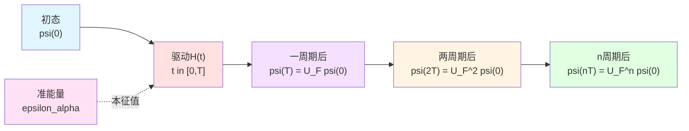

**日常类比**：
- **驱动周期$T$**：钟摆的摆动周期
- **Floquet算子$U_F$**：每个周期的"等效转动"
- **准能量$\varepsilon_\alpha$**：等效转动角除以周期

### 2.2 准能量谱与能带结构

准能量$\varepsilon_\alpha$模$2\pi/T$是等价的（类似布里渊区）：

$$
\varepsilon_\alpha \sim \varepsilon_\alpha + \frac{2\pi}{T}
$$

因此通常选择第一布里渊区$\varepsilon_\alpha\in(-\pi/T,\pi/T]$。

**能带结构**：
在晶格系统中，准能量随准动量$k$变化形成能带$\varepsilon_\alpha(k)$。

**能隙**：
相邻能带之间的能量差称为Floquet能隙：

$$
\Delta_{\rm F} = \min_k|\varepsilon_{\alpha+1}(k) - \varepsilon_\alpha(k)|
$$

**时间晶体与能带结构的关联**：
周期翻倍时间晶体通常出现在能带结构中存在"对称分裂"的情形：两条能带相差$\pi/T$。

**Mermaid准能量谱**

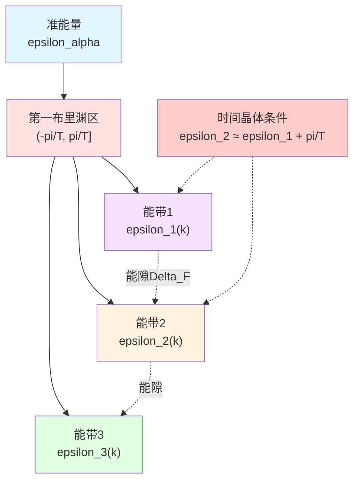

### 2.3 统一时间刻度的Floquet版本

对Floquet演化算子$U_F(\omega)$（频率依赖通过驱动谱体现），定义**群延迟矩阵**（源理论§2.2）：

$$
Q_F(\omega) = -\mathrm{i}U_F(\omega)^\dagger\partial_\omega U_F(\omega)
$$

**局域统一时间刻度密度增量**：

$$
\kappa_F(\omega) = \frac{1}{2\pi}\operatorname{tr}Q_F(\omega)
$$

**单周期时间增量**：

$$
\Delta\tau_F = \int_{\Omega_F} w_F(\omega)\kappa_F(\omega)\,\mathrm{d}\omega
$$

这将Floquet演化嵌入统一时间刻度框架，使其与散射理论（第20章）、因果菱形（第21章）一致。

---

## 3. Floquet-QCA对象：计算宇宙中的时间晶体

### 3.1 定义Floquet-QCA计算宇宙

**定义3.1**（源理论§3.1）：

一个**Floquet-QCA计算宇宙对象**是四元组

$$
\boxed{U_{\rm FQCA} = (X, U_F, \mathsf{C}_T, \mathsf{I})}
$$

**四元组含义**：

| 元素 | 名称 | 物理意义 |
|-----|------|---------|
| $X$ | 配置集合 | 全局Hilbert空间$\mathcal{H}$的规范化基矢标签 |
| $U_F:\mathcal{H}\to\mathcal{H}$ | Floquet演化算子 | 对应驱动周期$T$的局域酉算子 |
| $\mathsf{C}_T:X\times X\to[0,\infty]$ | 单周期复杂性代价 | 满足$\mathsf{C}_T(x,y)>0$若$\langle y\vert U_F\vert x\rangle\ne 0$ |
| $\mathsf{I}:X\to\mathbb{R}$ | 任务信息函数 | 状态的任务质量 |

**事件层表示**：
一次Floquet演化步骤在事件层$E=X\times\mathbb{Z}$上表示为：

$$
(x,n) \mapsto (y,n+1),\quad \langle y|U_F|x\rangle\ne 0
$$

其中$n$为离散时间标签（第几个周期）。

**Mermaid Floquet-QCA对象**

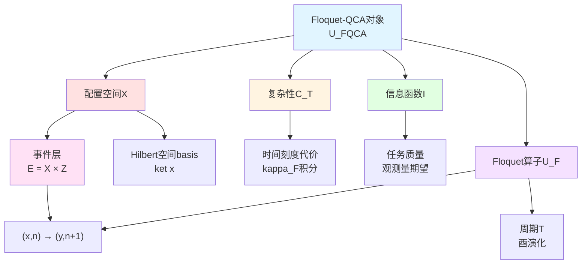

**日常类比**：
- **$X$**：所有可能的"量子棋局"配置
- **$U_F$**：每个"回合"的走子规则（包含驱动）
- **$\mathsf{C}_T$**：每回合的"计算时间"
- **$\mathsf{I}$**：当前棋局的"战略价值"

### 3.2 离散时间平移对称性

在Floquet-QCA中，时间平移是**离散**的，生成元为$U_F$：

$$
\text{时间平移：}\quad n \mapsto n+1
$$

对应演化：
$$
\ket{\psi_n} = U_F^n\ket{\psi_0}
$$

**时间平移群**：$\mathbb{Z}$（整数加法群），作用为$n\mapsto n+1$。

**对称性**：
若系统哈密顿量（或演化算子）对所有时间平移不变，称具有**时间平移对称性**。

**自发破缺**：
系统演化算子$U_F$具有对称性，但某些初态的演化轨迹**不**具有完整对称性。

**Mermaid时间平移对称性**

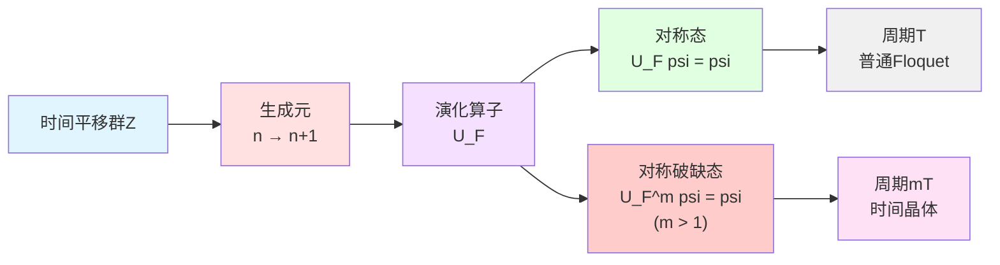

### 3.3 时间晶体的严格定义

**定义3.2**（源理论§3.2）：

在Floquet-QCA计算宇宙$U_{\rm FQCA}$中，若存在：
1. **局域可观测量**$O$（例如局域算符$O_x$只作用于有限区域）
2. **整数**$m\ge 2$
3. **初态族**$\mathcal{R}_0$（满足有限密度与有限相关长度条件）

使得：

**(条件1) 长期周期性**：
对几乎所有$\rho_0\in\mathcal{R}_0$，存在足够大的$n_0$使得对所有$n\ge n_0$有

$$
\boxed{\langle O\rangle_{n+m} = \langle O\rangle_n}
$$

其中
$$
\langle O\rangle_n = \operatorname{tr}(\rho_0 U_F^{\dagger n} O U_F^n)
$$

**(条件2) 极小周期性**：
不存在$1\le m'<m$使得同样条件成立。

则称$U_{\rm FQCA}$处于**周期$mT$的时间晶体相**。

**特别情形**：$m=2$称为**周期翻倍时间晶体**。

**Mermaid时间晶体定义**

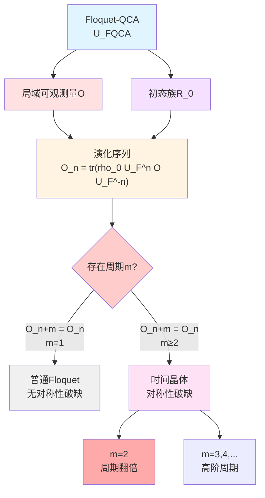

**日常类比**：
- **$O$**：某个局部区域的"测量仪"（如测量某个自旋）
- **$\langle O\rangle_n$**：第$n$个回合测量仪的读数
- **周期$m=2$**：读数每**两**个回合重复一次（而非每回合）

---

## 4. 周期翻倍机制：准能量带的对称分裂

### 4.1 两子空间模型

考虑最简单的周期翻倍时间晶体模型：Hilbert空间分解为两个子空间

$$
\mathcal{H} = \mathcal{H}_A \oplus \mathcal{H}_B
$$

**Floquet算子的作用**：

$$
U_F : \begin{cases}
\mathcal{H}_A \to \mathcal{H}_B \\
\mathcal{H}_B \to \mathcal{H}_A
\end{cases}
$$

因此：
- 一个周期：$U_F$将$\mathcal{H}_A$映射到$\mathcal{H}_B$
- 两个周期：$U_F^2$将$\mathcal{H}_A$映射回$\mathcal{H}_A$

**局域可观测量**：
选择$O$使得$\langle O\rangle_{\mathcal{H}_A} \ne \langle O\rangle_{\mathcal{H}_B}$。

**结果**：
$$
\langle O\rangle_n = \begin{cases}
\langle O\rangle_A, & n\ \text{偶数} \\
\langle O\rangle_B, & n\ \text{奇数}
\end{cases}
$$

周期为$2$！

**Mermaid两子空间交替**

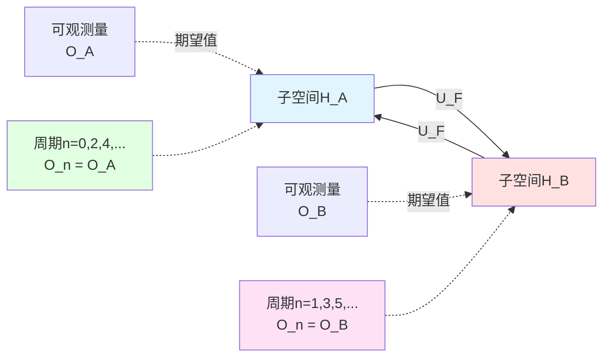

### 4.2 准能量带的π/T分裂

在更一般的模型中，两子空间对应准能量带的分裂。

**关键条件**（源理论§3.3）：
存在两条准能量带$\varepsilon_\alpha(k)$和$\varepsilon_\beta(k)$满足

$$
\varepsilon_\beta(k) \approx \varepsilon_\alpha(k) + \frac{\pi}{T}
$$

**物理意义**：
- 准能量差$\pi/T$对应相位差$\pi$（在周期$T$内）
- 两个周期后，相位差累积为$2\pi$（回到原位）

**准能量谱与时间晶体**：

$$
U_F = \sum_\alpha \mathrm{e}^{-\mathrm{i}\varepsilon_\alpha T}|\psi_\alpha\rangle\langle\psi_\alpha|
$$

若$\varepsilon_\beta = \varepsilon_\alpha + \pi/T$，则：

$$
\mathrm{e}^{-\mathrm{i}\varepsilon_\beta T} = \mathrm{e}^{-\mathrm{i}(\varepsilon_\alpha+\pi/T)T} = -\mathrm{e}^{-\mathrm{i}\varepsilon_\alpha T}
$$

一个周期后相位**反号**！

**Mermaid准能量分裂**

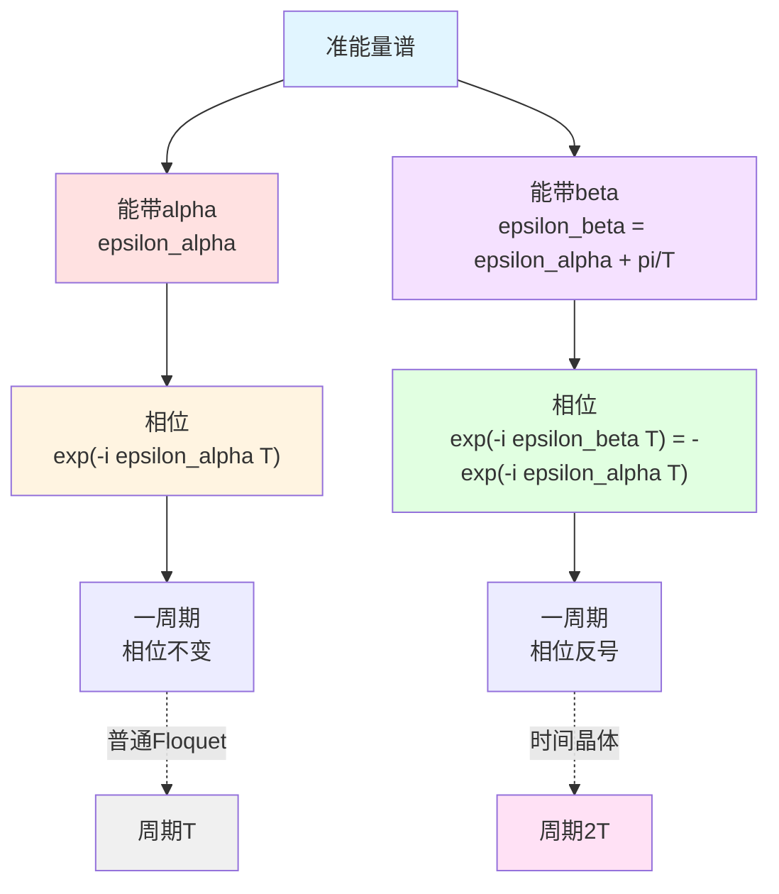

**日常类比**：
- **准能量**：摆钟的"等效频率"
- **$\pi/T$分裂**：两个摆钟频率相差半拍
- **相位反号**：每驱动一次，两钟相位关系翻转
- **周期翻倍**：需要两次驱动才让两钟同步回原位

### 4.3 自发对称性破缺的微观图像

**对称性算符**：
离散时间平移$\mathcal{T}_1:n\mapsto n+1$。

**对称态**：
$$
U_F\ket{\psi_{\rm sym}} = \ket{\psi_{\rm sym}}
$$
（准能量$\varepsilon=0$）

**对称性破缺态**：
$$
U_F\ket{\psi_{\rm SSB}} = -\ket{\psi_{\rm SSB}}
$$
（准能量$\varepsilon=\pi/T$）

两周期后：
$$
U_F^2\ket{\psi_{\rm SSB}} = \ket{\psi_{\rm SSB}}
$$

**基态简并**：
在理想情况下，两个对称性破缺态$\ket{\psi_+}$和$\ket{\psi_-}$能量相同（或准能量相差$\pi/T$），形成简并。

**初态制备**：
若初态为$\ket{\psi_+}$或$\ket{\psi_-}$的某个叠加，演化将呈现周期$2T$振荡。

---

## 5. 自旋链Floquet-QCA模型实例

### 5.1 模型定义

考虑**一维自旋链**（源理论附录A.1）：

**格点**：$\Lambda=\mathbb{Z}$（一维链）

**局域Hilbert空间**：$\mathcal{H}_x\cong\mathbb{C}^2$（每个格点一个自旋-1/2）

**全局Hilbert空间**：$\mathcal{H}=\bigotimes_{x\in\mathbb{Z}}\mathbb{C}^2$

**两步Floquet演化**：
$$
U_F = U_2 U_1
$$

其中：

**第一步**$U_1$：偶-奇格之间作用的成对自旋翻转门
$$
U_1 = \prod_{x\ \text{偶}} \exp\left(-\mathrm{i}J\sigma_x^z\sigma_{x+1}^z\right)
$$

**第二步**$U_2$：奇-偶格之间作用的类似门
$$
U_2 = \prod_{x\ \text{奇}} \exp\left(-\mathrm{i}J'\sigma_x^z\sigma_{x+1}^z\right)
$$

**参数**：$J,J'$为耦合强度。

**Mermaid自旋链Floquet演化**

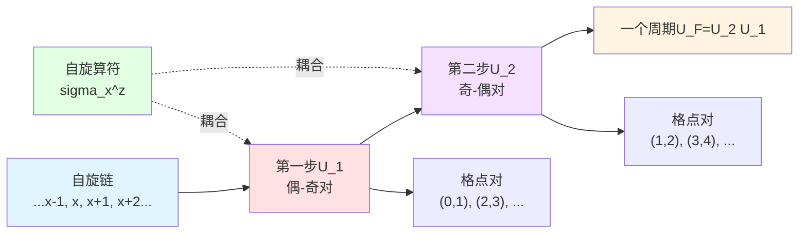

### 5.2 时间晶体相的存在性

**定理A.1**（源理论附录A.2）：

在上述自旋链Floquet-QCA模型中，**存在参数区域**$(J,J')$与初态族$\mathcal{R}_0$（例如自发对称破缺的反铁磁态混合），使得存在**局域可观测量**$O=\sigma_0^z$满足时间晶体条件，周期为$2T$。

**直观理解**：

1. **初态**：反铁磁序$\ket{\uparrow\downarrow\uparrow\downarrow\cdots}$
2. **第一步**$U_1$：翻转部分自旋对，形成$\ket{\downarrow\uparrow\downarrow\uparrow\cdots}$
3. **第二步**$U_2$：再次翻转，回到$\ket{\uparrow\downarrow\uparrow\downarrow\cdots}$
4. **可观测量**：$\langle\sigma_0^z\rangle$在奇偶周期交替取值

**稳定性**：
该时间晶体相在参数调节、局域噪声下是**鲁棒的**，只要满足：
- Floquet能隙$\Delta_{\rm F}>0$
- 噪声相关长度有限

### 5.3 数值验证方案

**步骤1：制备初态**
$$
\rho_0 = \ket{\uparrow\downarrow\uparrow\downarrow\cdots}\langle\uparrow\downarrow\uparrow\downarrow\cdots|
$$

**步骤2：Floquet演化**
$$
\rho_n = U_F^n\rho_0 U_F^{\dagger n}
$$

**步骤3：测量可观测量**
$$
\langle\sigma_0^z\rangle_n = \operatorname{tr}(\rho_n\sigma_0^z)
$$

**步骤4：检验周期性**
判断$\langle\sigma_0^z\rangle_n$是否满足：
$$
\langle\sigma_0^z\rangle_{n+2} = \langle\sigma_0^z\rangle_n
$$

**预期结果**：
- 对$n=0,2,4,\ldots$：$\langle\sigma_0^z\rangle_n=+1$
- 对$n=1,3,5,\ldots$：$\langle\sigma_0^z\rangle_n=-1$

**Mermaid数值验证流程**

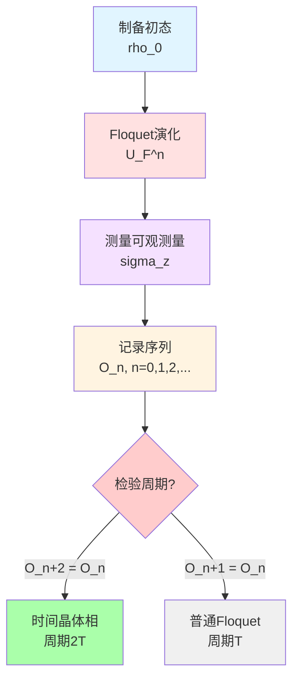

---

## 6. 计算宇宙视角的独特洞察

### 6.1 事件层的离散时间结构

在计算宇宙框架中，时间不是连续参数，而是**事件层**$E=X\times\mathbb{Z}$上的离散标签$n$。

**Floquet演化**：
$$
(x,n) \to (y,n+1),\quad \langle y|U_F|x\rangle\ne 0
$$

**时间晶体**：
事件层上的"超周期"结构——相隔$m$步的事件等价。

**Mermaid事件层结构**

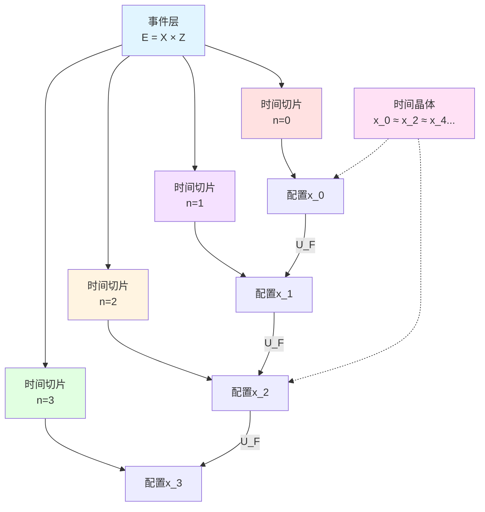

### 6.2 复杂性几何中的时间晶体

**复杂性代价**$\mathsf{C}_T$由统一时间刻度积分给出：

$$
\mathsf{C}_T = \int_{\Omega_F} w_F(\omega)\kappa_F(\omega)\,\mathrm{d}\omega
$$

**时间晶体的复杂性特征**：
- 单周期代价$\mathsf{C}_T$固定
- 但"有效周期"为$m\mathsf{C}_T$（$m=2$时为$2\mathsf{C}_T$）

**复杂性几何解释**：
时间晶体对应控制流形$(\mathcal{M},G)$上的特殊闭合回路，其**复杂性增量**与**时间增量**解耦。

### 6.3 与因果菱形链的联系

**每个Floquet周期$\leftrightarrow$一颗因果菱形**$\Diamond_{F,k}$

**钻石链**：
$$
\{\Diamond_{F,k}\}_{k\in\mathbb{Z}}
$$

**时间晶体**：
钻石链上的"马尔可夫非全序"结构——每隔$m$颗钻石形成一个完整周期。

这将在下一章（02-Z₂和乐）中详细展开。

---

## 7. 本章总结

### 7.1 核心概念回顾

**Floquet-QCA对象**：
$$
U_{\rm FQCA} = (X, U_F, \mathsf{C}_T, \mathsf{I})
$$

**时间晶体定义**：
$$
\langle O\rangle_{n+m} = \langle O\rangle_n,\quad m\ge 2
$$

**准能量谱条件**：
$$
\varepsilon_\beta \approx \varepsilon_\alpha + \frac{\pi}{T}
$$

**自旋链模型**：
$$
U_F = U_2 U_1,\quad U_1=\prod_{x\ \text{偶}}\mathrm{e}^{-\mathrm{i}J\sigma_x^z\sigma_{x+1}^z}
$$

### 7.2 关键洞察

1. **离散时间平移对称性破缺**：
   时间晶体是$\mathbb{Z}\to m\mathbb{Z}$的自发对称性破缺

2. **准能量带分裂是微观机制**：
   $\varepsilon_\beta-\varepsilon_\alpha=\pi/T$导致相位翻转

3. **计算宇宙提供离散化框架**：
   事件层$E=X\times\mathbb{Z}$，复杂性代价$\mathsf{C}_T$

4. **自旋链模型可实现**：
   两步Floquet演化$U_F=U_2 U_1$在适当参数下展现周期翻倍

### 7.3 下一章预告

下一章（**02-time-crystal-z2.md**）将讨论：
- Null-Modular双覆盖在Floquet链上的实现
- 模2相位标签$\epsilon_F$
- Z₂和乐与时间晶体奇偶的精确对应
- 定理4.1的证明

**核心公式预告**：
$$
\boxed{
\text{周期翻倍时间晶体}\quad\Leftrightarrow\quad \mathrm{hol}_{\mathbb{Z}_2}(\Gamma_F) = 1
}
$$

---

**本章结束**

---

**源理论**：`euler-gls-info/17-time-crystals-null-modular-z2-holonomy.md`，§2-3
