# Chapter 1: Floquet Quantum Cellular Automaton Theory

**Source Theory**: `euler-gls-info/17-time-crystals-null-modular-z2-holonomy.md`, §2-3

---

## Introduction

In the previous overview, we preliminarily understood time crystals—a strange quantum phase with "period doubling" in the time dimension. This chapter will delve into the **microscopic mechanism** of time crystals: how to rigorously describe them using **Floquet Quantum Cellular Automata** (Floquet-QCA).

**Core Questions of This Chapter**:
1. What is a Quantum Cellular Automaton (QCA)?
2. How to introduce periodic driving (Floquet evolution) in QCA?
3. What is the mathematical definition of time crystals?
4. What is the microscopic mechanism of period doubling?

**Everyday Analogy**:
- **QCA**: Quantum chess on a board—each cell has quantum state, updated by rules
- **Floquet Drive**: Timer rings once per second, each ring triggers one step according to rules
- **Time Crystal**: Game returns to similar configuration every **two steps**, not every step

---

## 1. Computational Universe and QCA Foundations

### 1.1 Computational Universe Axioms

Review **Computational Universe Axiom System** (Source Theory §2.1):

$$
U_{\rm comp} = (X, \mathsf{T}, \mathsf{C}, \mathsf{I})
$$

**Four-Tuple Meaning**:

| Element | Name | Physical Meaning |
|---------|------|-----------------|
| $X$ | Configuration Set | All possible system states |
| $\mathsf{T}\subset X\times X$ | Update Relation | Allowed state transitions |
| $\mathsf{C}:X\times X\to[0,\infty]$ | Cost Function | "Time cost" of each transition |
| $\mathsf{I}:X\to\mathbb{R}$ | Information Function | "Task quality" of state |

**Reversibility Assumption**:
$\mathsf{T}$ is reversible, i.e., there exists inverse mapping $\mathsf{T}^{-1}$, guaranteeing no information loss.

**Mermaid Computational Universe Structure**

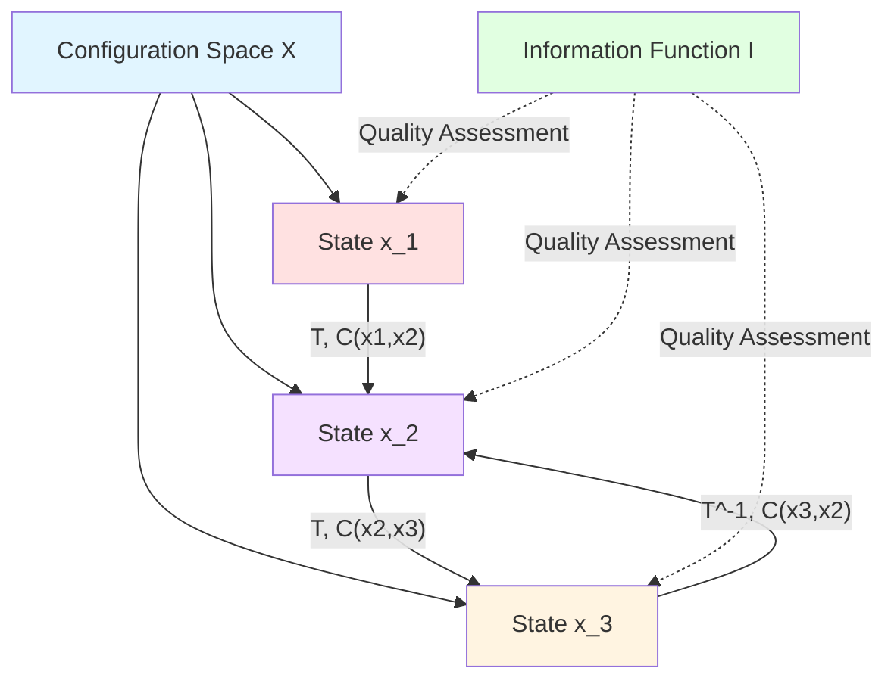

**Everyday Analogy**:
- **$X$**: All possible "chess positions"
- **$\mathsf{T}$**: Legal "move rules"
- **$\mathsf{C}$**: "Thinking time" for each move
- **$\mathsf{I}$**: "Advantage score" of current position

### 1.2 Quantum Cellular Automaton (QCA)

**Classical Cellular Automaton**:
- Lattice set $\Lambda$ (e.g., one-dimensional chain $\mathbb{Z}$, two-dimensional grid $\mathbb{Z}^2$)
- Each lattice site $x\in\Lambda$ has finite state set $S_x$
- Global configuration $s\in\prod_{x\in\Lambda}S_x$
- Local update rule $s\to s'$

**Quantum Version** (QCA):
- Lattice sites $x\in\Lambda$
- Each site has **finite-dimensional Hilbert space** $\mathcal{H}_x$ (e.g., $\mathcal{H}_x\cong\mathbb{C}^2$ for single qubit)
- Global Hilbert space $\mathcal{H}=\bigotimes_{x\in\Lambda}\mathcal{H}_x$
- **Reversible unitary operator** $U:\mathcal{H}\to\mathcal{H}$

**Locality Condition**:
$U$ can be decomposed into finite-depth local unitary gate sequences, guaranteeing causality.

**Correspondence Between QCA and Computational Universe**:
- Configuration $x\in X$: Normalized basis vector $\ket{x}\in\mathcal{H}$
- Update relation $(x,y)\in\mathsf{T}$: $\langle y|U|x\rangle\ne 0$
- Cost $\mathsf{C}(x,y)$: Physical time required to execute $U$ (given by unified time scale)

**Mermaid QCA Structure**

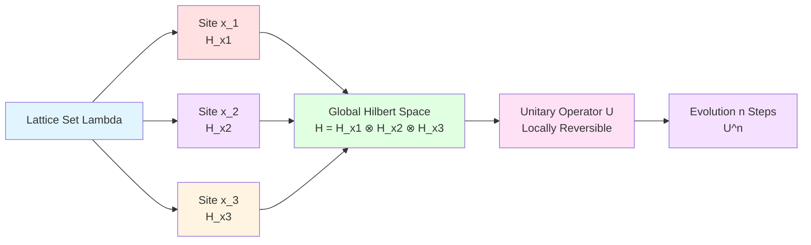

**Everyday Analogy**:
- **Classical CA**: Conway's Game of Life—cells live/die updated by rules
- **QCA**: Quantum Game of Life—each cell is a qubit, updated by quantum gates

### 1.3 Manifestation of Unified Time Scale in QCA

On the physical side, one step of QCA evolution corresponds to some physical time increment $\Delta t$. In the **unified time scale** framework:

$$
\Delta t = \int \kappa(\omega)\,\mathrm{d}\omega
$$

where $\kappa(\omega)$ is unified time scale density (review Chapter 20):

$$
\kappa(\omega) = \frac{\varphi'(\omega)}{\pi} = \rho_{\rm rel}(\omega) = \frac{1}{2\pi}\operatorname{tr}Q(\omega)
$$

For QCA, can define **group delay matrix** (Source Theory §2.2):

$$
Q(\omega) = -\mathrm{i}U(\omega)^\dagger\partial_\omega U(\omega)
$$

where $U(\omega)$ is frequency-dependent evolution operator (manifested through driving spectrum and system response).

**Complexity Cost** $\mathsf{C}$:
Complexity cost of single-step QCA evolution can be defined as:

$$
\mathsf{C}(x,y) = \int_{\Omega} w(\omega)\kappa(\omega)\,\mathrm{d}\omega
$$

where $w(\omega)$ is weight function, $\Omega$ is relevant frequency band.

---

## 2. Floquet Systems: Periodically Driven Quantum Dynamics

### 2.1 Time-Dependent Hamiltonian

**Floquet System**: Hamiltonian $H(t)$ satisfies periodicity

$$
H(t+T) = H(t),\quad \forall t
$$

where $T$ is driving period.

**Classical Examples**:
- Atoms driven by periodic laser pulses
- Superconducting circuits driven by alternating current
- Optical lattices with periodic modulation

**Evolution Operator**:
Within one period $[0,T]$, system evolves as:

$$
U_F = \mathcal{T}\exp\left(-\mathrm{i}\int_0^T H(t)\,\mathrm{d}t\right)
$$

where $\mathcal{T}$ is time-ordering operator.

**Floquet Theorem**:
Eigenstates of $U_F$ are called **Floquet states** $\ket{\psi_\alpha}$, with eigenvalues:

$$
U_F\ket{\psi_\alpha} = \mathrm{e}^{-\mathrm{i}\varepsilon_\alpha T}\ket{\psi_\alpha}
$$

where $\varepsilon_\alpha\in(-\pi/T,\pi/T]$ is **quasienergy**.

**Mermaid Floquet Evolution**

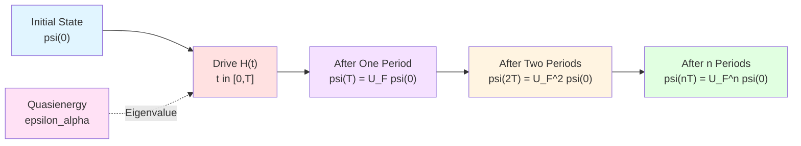

**Everyday Analogy**:
- **Driving Period $T$**: Swing period of pendulum
- **Floquet Operator $U_F$**: "Equivalent rotation" per period
- **Quasienergy $\varepsilon_\alpha$**: Equivalent rotation angle divided by period

### 2.2 Quasienergy Spectrum and Band Structure

Quasienergy $\varepsilon_\alpha$ modulo $2\pi/T$ is equivalent (similar to Brillouin zone):

$$
\varepsilon_\alpha \sim \varepsilon_\alpha + \frac{2\pi}{T}
$$

Therefore usually choose first Brillouin zone $\varepsilon_\alpha\in(-\pi/T,\pi/T]$.

**Band Structure**:
In lattice systems, quasienergy varies with quasimomentum $k$ forming bands $\varepsilon_\alpha(k)$.

**Band Gap**:
Energy difference between adjacent bands is called Floquet band gap:

$$
\Delta_{\rm F} = \min_k|\varepsilon_{\alpha+1}(k) - \varepsilon_\alpha(k)|
$$

**Connection Between Time Crystals and Band Structure**:
Period-doubling time crystals usually appear when band structure has "symmetric splitting": two bands differ by $\pi/T$.

**Mermaid Quasienergy Spectrum**

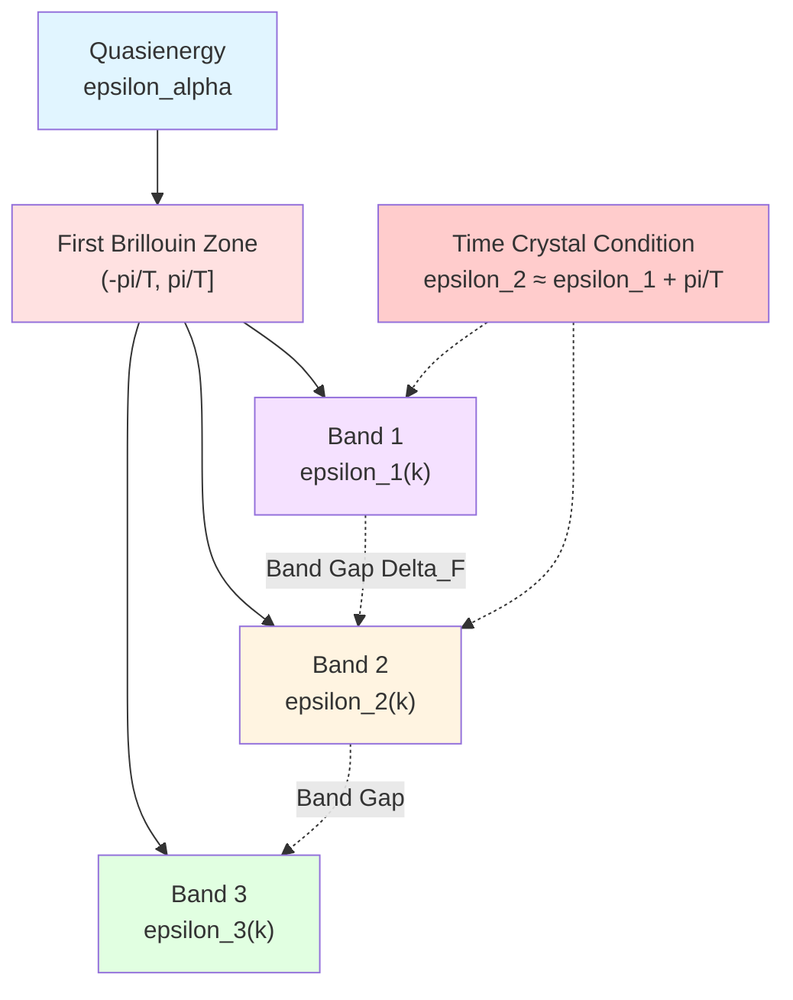

### 2.3 Floquet Version of Unified Time Scale

For Floquet evolution operator $U_F(\omega)$ (frequency dependence manifested through driving spectrum), define **group delay matrix** (Source Theory §2.2):

$$
Q_F(\omega) = -\mathrm{i}U_F(\omega)^\dagger\partial_\omega U_F(\omega)
$$

**Local Unified Time Scale Density Increment**:

$$
\kappa_F(\omega) = \frac{1}{2\pi}\operatorname{tr}Q_F(\omega)
$$

**Single-Period Time Increment**:

$$
\Delta\tau_F = \int_{\Omega_F} w_F(\omega)\kappa_F(\omega)\,\mathrm{d}\omega
$$

This embeds Floquet evolution into unified time scale framework, making it consistent with scattering theory (Chapter 20) and causal diamonds (Chapter 21).

---

## 3. Floquet-QCA Object: Time Crystals in Computational Universe

### 3.1 Defining Floquet-QCA Computational Universe

**Definition 3.1** (Source Theory §3.1):

A **Floquet-QCA Computational Universe Object** is a four-tuple

$$
\boxed{U_{\rm FQCA} = (X, U_F, \mathsf{C}_T, \mathsf{I})}
$$

**Four-Tuple Meaning**:

| Element | Name | Physical Meaning |
|---------|------|-----------------|
| $X$ | Configuration Set | Labels of normalized basis vectors of global Hilbert space $\mathcal{H}$ |
| $U_F:\mathcal{H}\to\mathcal{H}$ | Floquet Evolution Operator | Local unitary operator corresponding to driving period $T$ |
| $\mathsf{C}_T:X\times X\to[0,\infty]$ | Single-Period Complexity Cost | Satisfies $\mathsf{C}_T(x,y)>0$ if $\langle y\vert U_F\vert x\rangle\ne 0$ |
| $\mathsf{I}:X\to\mathbb{R}$ | Task Information Function | Task quality of state |

**Event Layer Representation**:
One Floquet evolution step is represented on event layer $E=X\times\mathbb{Z}$ as:

$$
(x,n) \mapsto (y,n+1),\quad \langle y|U_F|x\rangle\ne 0
$$

where $n$ is discrete time label (which period).

**Mermaid Floquet-QCA Object**

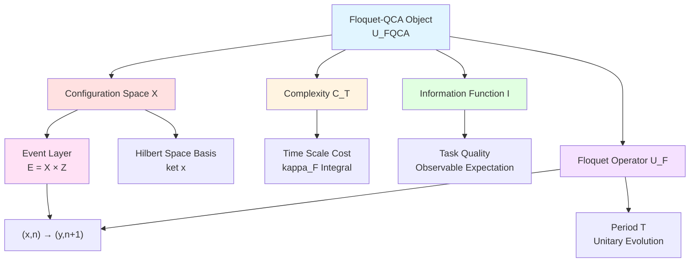

**Everyday Analogy**:
- **$X$**: All possible "quantum chess position" configurations
- **$U_F$**: Move rules for each "round" (including driving)
- **$\mathsf{C}_T$**: "Computation time" per round
- **$\mathsf{I}$**: "Strategic value" of current position

### 3.2 Discrete Time Translation Symmetry

In Floquet-QCA, time translation is **discrete**, generator is $U_F$:

$$
\text{Time Translation:}\quad n \mapsto n+1
$$

Corresponding evolution:
$$
\ket{\psi_n} = U_F^n\ket{\psi_0}
$$

**Time Translation Group**: $\mathbb{Z}$ (integer addition group), action is $n\mapsto n+1$.

**Symmetry**:
If system Hamiltonian (or evolution operator) is invariant under all time translations, it is said to have **time translation symmetry**.

**Spontaneous Breaking**:
System evolution operator $U_F$ has symmetry, but evolution trajectories of certain initial states **do not** have full symmetry.

**Mermaid Time Translation Symmetry**

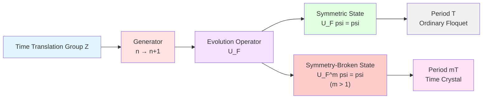

### 3.3 Rigorous Definition of Time Crystals

**Definition 3.2** (Source Theory §3.2):

In Floquet-QCA computational universe $U_{\rm FQCA}$, if there exist:
1. **Local Observable** $O$ (e.g., local operator $O_x$ acts only on finite region)
2. **Integer** $m\ge 2$
3. **Initial State Family** $\mathcal{R}_0$ (satisfying finite density and finite correlation length conditions)

such that:

**(Condition 1) Long-Term Periodicity**:
For almost all $\rho_0\in\mathcal{R}_0$, there exists sufficiently large $n_0$ such that for all $n\ge n_0$ we have

$$
\boxed{\langle O\rangle_{n+m} = \langle O\rangle_n}
$$

where
$$
\langle O\rangle_n = \operatorname{tr}(\rho_0 U_F^{\dagger n} O U_F^n)
$$

**(Condition 2) Minimal Periodicity**:
No $1\le m'<m$ satisfies the same condition.

Then $U_{\rm FQCA}$ is said to be in **period $mT$ time crystal phase**.

**Special Case**: $m=2$ is called **period-doubling time crystal**.

**Mermaid Time Crystal Definition**

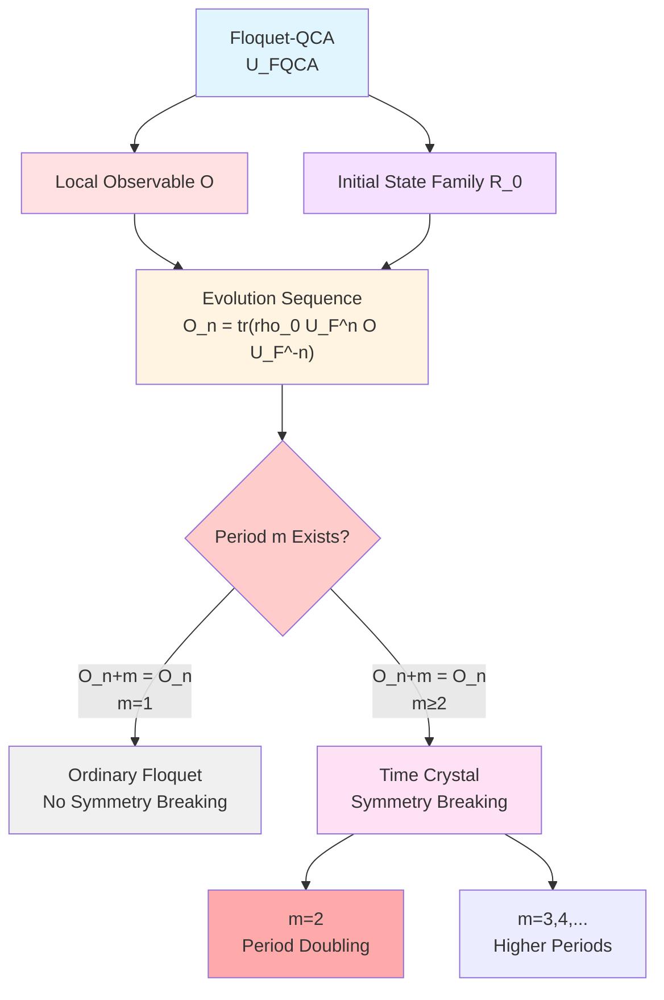

**Everyday Analogy**:
- **$O$**: "Measuring instrument" for some local region (e.g., measuring a spin)
- **$\langle O\rangle_n$**: Reading of measuring instrument at round $n$
- **Period $m=2$**: Reading repeats every **two** rounds (not every round)

---

## 4. Period Doubling Mechanism: Symmetric Splitting of Quasienergy Bands

### 4.1 Two-Subspace Model

Consider simplest period-doubling time crystal model: Hilbert space decomposes into two subspaces

$$
\mathcal{H} = \mathcal{H}_A \oplus \mathcal{H}_B
$$

**Action of Floquet Operator**:

$$
U_F : \begin{cases}
\mathcal{H}_A \to \mathcal{H}_B \\
\mathcal{H}_B \to \mathcal{H}_A
\end{cases}
$$

Therefore:
- One period: $U_F$ maps $\mathcal{H}_A$ to $\mathcal{H}_B$
- Two periods: $U_F^2$ maps $\mathcal{H}_A$ back to $\mathcal{H}_A$

**Local Observable**:
Choose $O$ such that $\langle O\rangle_{\mathcal{H}_A} \ne \langle O\rangle_{\mathcal{H}_B}$.

**Result**:
$$
\langle O\rangle_n = \begin{cases}
\langle O\rangle_A, & n\ \text{even} \\
\langle O\rangle_B, & n\ \text{odd}
\end{cases}
$$

Period is $2$!

**Mermaid Two-Subspace Alternation**

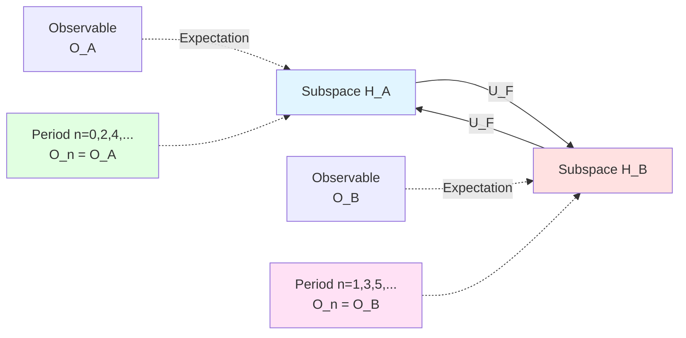

### 4.2 $\pi/T$ Splitting of Quasienergy Bands

In more general models, two subspaces correspond to splitting of quasienergy bands.

**Key Condition** (Source Theory §3.3):
There exist two quasienergy bands $\varepsilon_\alpha(k)$ and $\varepsilon_\beta(k)$ satisfying

$$
\varepsilon_\beta(k) \approx \varepsilon_\alpha(k) + \frac{\pi}{T}
$$

**Physical Meaning**:
- Quasienergy difference $\pi/T$ corresponds to phase difference $\pi$ (within period $T$)
- After two periods, phase difference accumulates to $2\pi$ (return to original position)

**Quasienergy Spectrum and Time Crystals**:

$$
U_F = \sum_\alpha \mathrm{e}^{-\mathrm{i}\varepsilon_\alpha T}|\psi_\alpha\rangle\langle\psi_\alpha|
$$

If $\varepsilon_\beta = \varepsilon_\alpha + \pi/T$, then:

$$
\mathrm{e}^{-\mathrm{i}\varepsilon_\beta T} = \mathrm{e}^{-\mathrm{i}(\varepsilon_\alpha+\pi/T)T} = -\mathrm{e}^{-\mathrm{i}\varepsilon_\alpha T}
$$

Phase **flips sign** after one period!

**Mermaid Quasienergy Splitting**

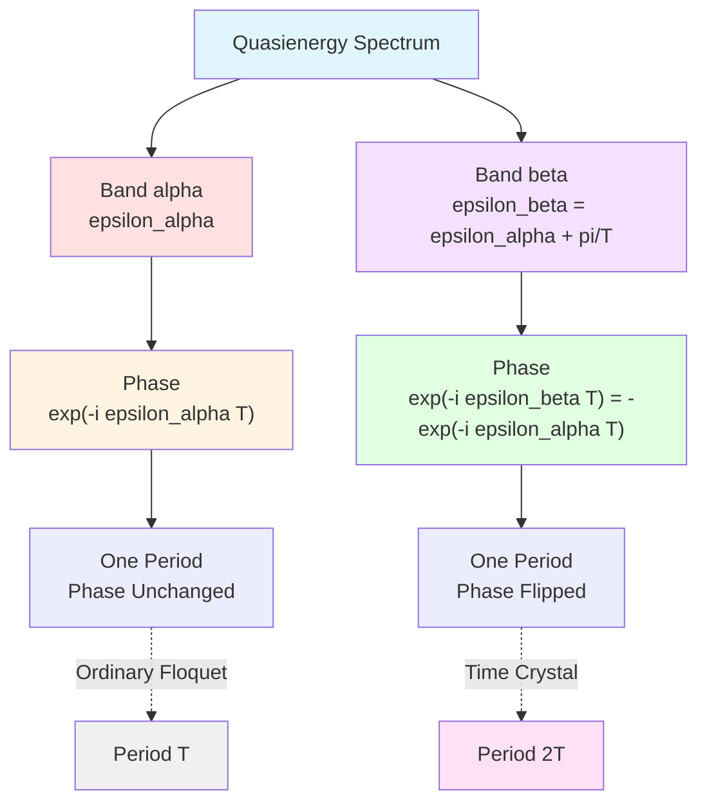

**Everyday Analogy**:
- **Quasienergy**: "Equivalent frequency" of pendulum clock
- **$\pi/T$ Splitting**: Two pendulum clocks differ by half beat
- **Phase Flip**: Each drive flips phase relationship between two clocks
- **Period Doubling**: Need two drives to synchronize two clocks back to original position

### 4.3 Microscopic Picture of Spontaneous Symmetry Breaking

**Symmetry Operator**:
Discrete time translation $\mathcal{T}_1:n\mapsto n+1$.

**Symmetric State**:
$$
U_F\ket{\psi_{\rm sym}} = \ket{\psi_{\rm sym}}
$$
(quasienergy $\varepsilon=0$)

**Symmetry-Broken State**:
$$
U_F\ket{\psi_{\rm SSB}} = -\ket{\psi_{\rm SSB}}
$$
(quasienergy $\varepsilon=\pi/T$)

After two periods:
$$
U_F^2\ket{\psi_{\rm SSB}} = \ket{\psi_{\rm SSB}}
$$

**Ground State Degeneracy**:
In ideal case, two symmetry-broken states $\ket{\psi_+}$ and $\ket{\psi_-}$ have same energy (or quasienergy differs by $\pi/T$), forming degeneracy.

**Initial State Preparation**:
If initial state is some superposition of $\ket{\psi_+}$ or $\ket{\psi_-}$, evolution will exhibit period $2T$ oscillation.

---

## 5. Spin Chain Floquet-QCA Model Example

### 5.1 Model Definition

Consider **one-dimensional spin chain** (Source Theory Appendix A.1):

**Lattice**: $\Lambda=\mathbb{Z}$ (one-dimensional chain)

**Local Hilbert Space**: $\mathcal{H}_x\cong\mathbb{C}^2$ (one spin-1/2 per site)

**Global Hilbert Space**: $\mathcal{H}=\bigotimes_{x\in\mathbb{Z}}\mathbb{C}^2$

**Two-Step Floquet Evolution**:
$$
U_F = U_2 U_1
$$

where:

**First Step** $U_1$: Pairwise spin-flip gates acting between even-odd sites
$$
U_1 = \prod_{x\ \text{even}} \exp\left(-\mathrm{i}J\sigma_x^z\sigma_{x+1}^z\right)
$$

**Second Step** $U_2$: Similar gates acting between odd-even sites
$$
U_2 = \prod_{x\ \text{odd}} \exp\left(-\mathrm{i}J'\sigma_x^z\sigma_{x+1}^z\right)
$$

**Parameters**: $J,J'$ are coupling strengths.

**Mermaid Spin Chain Floquet Evolution**

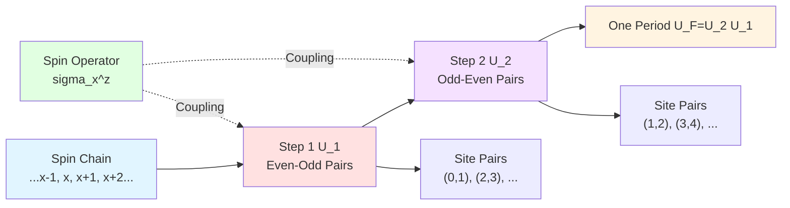

### 5.2 Existence of Time Crystal Phase

**Theorem A.1** (Source Theory Appendix A.2):

In the above spin chain Floquet-QCA model, **there exist parameter regions** $(J,J')$ and initial state families $\mathcal{R}_0$ (e.g., spontaneously symmetry-broken antiferromagnetic state mixtures), such that there exists **local observable** $O=\sigma_0^z$ satisfying time crystal condition, with period $2T$.

**Intuitive Understanding**:

1. **Initial State**: Antiferromagnetic order $\ket{\uparrow\downarrow\uparrow\downarrow\cdots}$
2. **First Step** $U_1$: Flips some spin pairs, forms $\ket{\downarrow\uparrow\downarrow\uparrow\cdots}$
3. **Second Step** $U_2$: Flips again, returns to $\ket{\uparrow\downarrow\uparrow\downarrow\cdots}$
4. **Observable**: $\langle\sigma_0^z\rangle$ alternates values at odd/even periods

**Stability**:
This time crystal phase is **robust** under parameter tuning and local noise, as long as:
- Floquet band gap $\Delta_{\rm F}>0$
- Noise correlation length finite

### 5.3 Numerical Verification Scheme

**Step 1: Prepare Initial State**
$$
\rho_0 = \ket{\uparrow\downarrow\uparrow\downarrow\cdots}\langle\uparrow\downarrow\uparrow\downarrow\cdots|
$$

**Step 2: Floquet Evolution**
$$
\rho_n = U_F^n\rho_0 U_F^{\dagger n}
$$

**Step 3: Measure Observable**
$$
\langle\sigma_0^z\rangle_n = \operatorname{tr}(\rho_n\sigma_0^z)
$$

**Step 4: Check Periodicity**
Determine whether $\langle\sigma_0^z\rangle_n$ satisfies:
$$
\langle\sigma_0^z\rangle_{n+2} = \langle\sigma_0^z\rangle_n
$$

**Expected Results**:
- For $n=0,2,4,\ldots$: $\langle\sigma_0^z\rangle_n=+1$
- For $n=1,3,5,\ldots$: $\langle\sigma_0^z\rangle_n=-1$

**Mermaid Numerical Verification Flow**

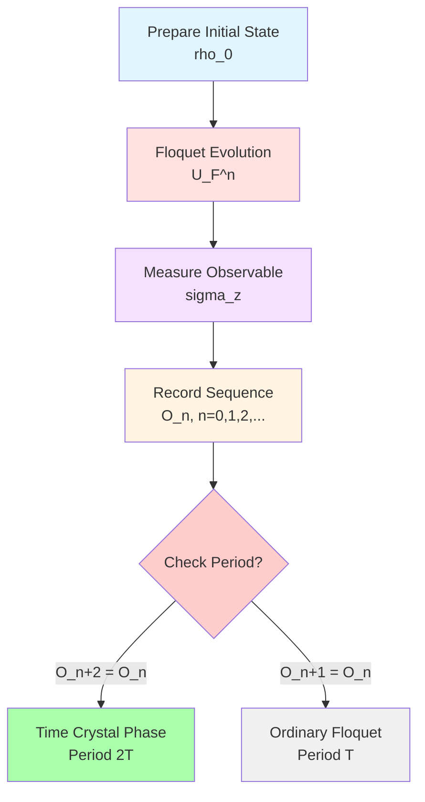

---

## 6. Unique Insights from Computational Universe Perspective

### 6.1 Discrete Time Structure of Event Layer

In computational universe framework, time is not a continuous parameter, but discrete label $n$ on **event layer** $E=X\times\mathbb{Z}$.

**Floquet Evolution**:
$$
(x,n) \to (y,n+1),\quad \langle y|U_F|x\rangle\ne 0
$$

**Time Crystal**:
"Super-periodic" structure on event layer—events separated by $m$ steps are equivalent.

**Mermaid Event Layer Structure**

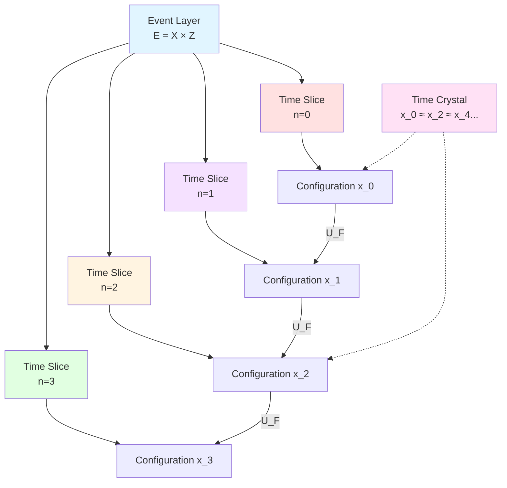

### 6.2 Time Crystals in Complexity Geometry

**Complexity Cost** $\mathsf{C}_T$ given by unified time scale integral:

$$
\mathsf{C}_T = \int_{\Omega_F} w_F(\omega)\kappa_F(\omega)\,\mathrm{d}\omega
$$

**Complexity Characteristics of Time Crystals**:
- Single-period cost $\mathsf{C}_T$ fixed
- But "effective period" is $m\mathsf{C}_T$ ($2\mathsf{C}_T$ when $m=2$)

**Complexity Geometry Interpretation**:
Time crystals correspond to special closed loops on control manifold $(\mathcal{M},G)$, where **complexity increment** and **time increment** decouple.

### 6.3 Connection with Causal Diamond Chains

**Each Floquet Period $\leftrightarrow$ One Causal Diamond** $\Diamond_{F,k}$

**Diamond Chain**:
$$
\{\Diamond_{F,k}\}_{k\in\mathbb{Z}}
$$

**Time Crystal**:
"Markov non-totally-ordered" structure on diamond chain—every $m$ diamonds form one complete period.

This will be detailed in next chapter (02-Z₂ Holonomy).

---

## 7. Chapter Summary

### 7.1 Core Concepts Review

**Floquet-QCA Object**:
$$
U_{\rm FQCA} = (X, U_F, \mathsf{C}_T, \mathsf{I})
$$

**Time Crystal Definition**:
$$
\langle O\rangle_{n+m} = \langle O\rangle_n,\quad m\ge 2
$$

**Quasienergy Spectrum Condition**:
$$
\varepsilon_\beta \approx \varepsilon_\alpha + \frac{\pi}{T}
$$

**Spin Chain Model**:
$$
U_F = U_2 U_1,\quad U_1=\prod_{x\ \text{even}}\mathrm{e}^{-\mathrm{i}J\sigma_x^z\sigma_{x+1}^z}
$$

### 7.2 Key Insights

1. **Discrete Time Translation Symmetry Breaking**:
   Time crystals are spontaneous symmetry breaking $\mathbb{Z}\to m\mathbb{Z}$

2. **Quasienergy Band Splitting is Microscopic Mechanism**:
   $\varepsilon_\beta-\varepsilon_\alpha=\pi/T$ causes phase flip

3. **Computational Universe Provides Discretization Framework**:
   Event layer $E=X\times\mathbb{Z}$, complexity cost $\mathsf{C}_T$

4. **Spin Chain Model is Realizable**:
   Two-step Floquet evolution $U_F=U_2 U_1$ exhibits period doubling at appropriate parameters

### 7.3 Preview of Next Chapter

Next chapter (**02-time-crystal-z2.md**) will discuss:
- Realization of Null-Modular double cover on Floquet chain
- Mod-2 phase label $\epsilon_F$
- Precise correspondence between Z₂ holonomy and time crystal parity
- Proof of Theorem 4.1

**Core Formula Preview**:
$$
\boxed{
\text{Period-Doubling Time Crystal}\quad\Leftrightarrow\quad \mathrm{hol}_{\mathbb{Z}_2}(\Gamma_F) = 1
}
$$

---

**End of Chapter**

---

**Source Theory**: `euler-gls-info/17-time-crystals-null-modular-z2-holonomy.md`, §2-3

