# 第二章：Z₂和乐与时间晶体奇偶标签

**源理论**：`euler-gls-info/17-time-crystals-null-modular-z2-holonomy.md`，§4；附录B-C

---

## 引言

在上一章中，我们建立了Floquet-QCA框架，并看到周期翻倍时间晶体源于准能量带的$\pi/T$分裂。但有一个深层问题尚未回答：

**这种"周期翻倍"有没有拓扑不变量来刻画？**

答案是肯定的！通过**Null-Modular双覆盖**与**Z₂和乐**（holonomy），我们可以将时间晶体的周期奇偶提升为一个**拓扑不变量**。

**本章核心内容**：
1. 将Floquet周期视为因果菱形链
2. 构造Null-Modular双覆盖空间
3. 定义Z₂和乐$\mathrm{hol}_{\mathbb{Z}_2}(\Gamma_F)$
4. 证明：周期翻倍$\Leftrightarrow$和乐非平凡

**日常类比**：
- **Möbius带**：走一圈回到原位但"上下翻转"（Z₂和乐=1）
- **普通圆环**：走一圈回到原位且方向不变（Z₂和乐=0）
- 时间晶体的Floquet演化就像Möbius带：每走一周期翻转一次！

---

## 1. Floquet周期作为因果菱形链

### 1.1 回顾：因果菱形的定义

在第21章（因果菱形链理论）中，我们定义了**因果菱形**（causal diamond）：

$$
D(p_{\rm past}, p_{\rm future}) = J^+(p_{\rm past}) \cap J^-(p_{\rm future})
$$

其中$J^+$为因果未来，$J^-$为因果过去。

**Null边界双层分解**：
$$
\widetilde{E} = E^+ \sqcup E^-
$$

**模哈密顿量**：
$$
K_D = 2\pi\sum_{\sigma=\pm}\int_{E^\sigma} g_\sigma(\lambda,x_\perp)\,T_{\sigma\sigma}(\lambda,x_\perp)\,\mathrm{d}\lambda\,\mathrm{d}^{d-2}x_\perp
$$

**Mermaid因果菱形回顾**

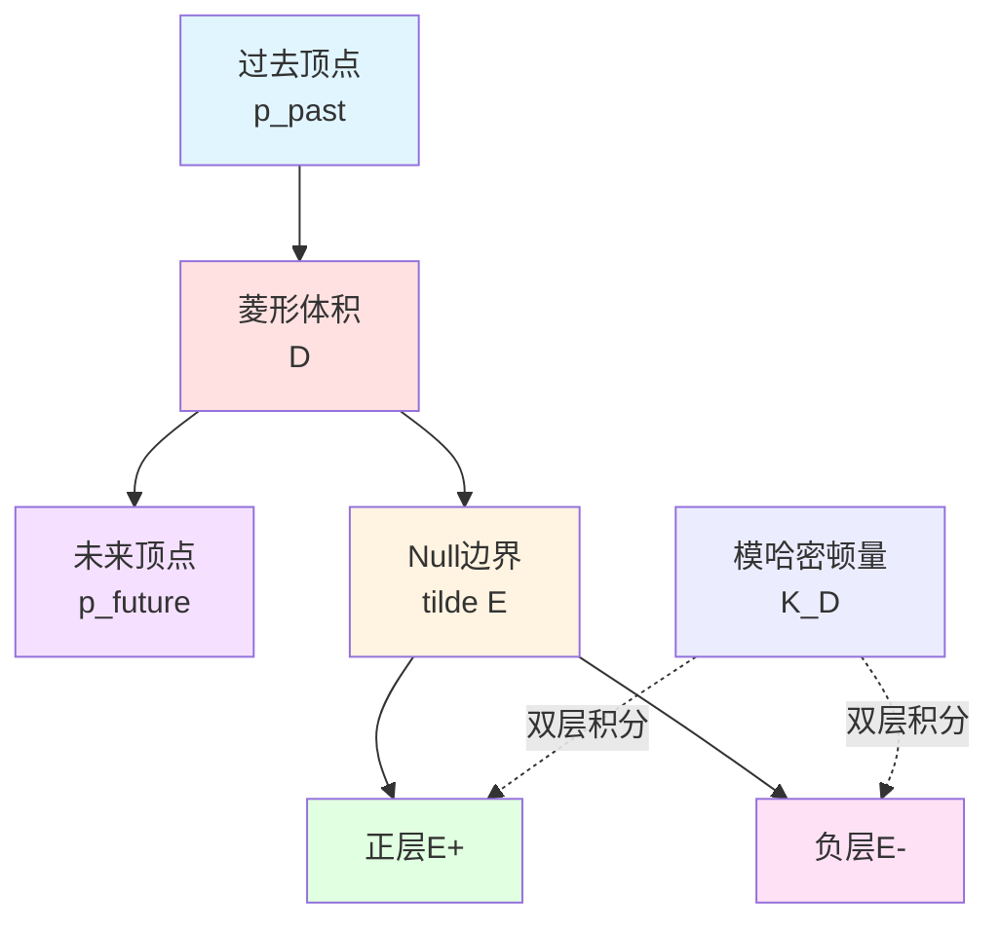

### 1.2 Floquet周期钻石

**核心想法**（源理论§4.1）：将**单个Floquet周期**视为一颗因果菱形。

**具体构造**：
- **钻石内部顶点**：在复杂性预算$T$内从某个初态层到下一层的事件集合
- **钻石边界**：周期初末事件
- **钻石体积演化**：由$U_F$的局域分解给出
- **边界算子**：$\mathsf{K}_{\Diamond_F}$与$U_F$在边界上的作用同构

**形式化定义**：
$$
\Diamond_F := \{(x,t) : x\in X,\ t\in[0,T]\}
$$

其边界为：
- **初边界**：$\partial_{\rm in}\Diamond_F = X\times\{0\}$
- **末边界**：$\partial_{\rm out}\Diamond_F = X\times\{T\}$

**Mermaid Floquet周期钻石**

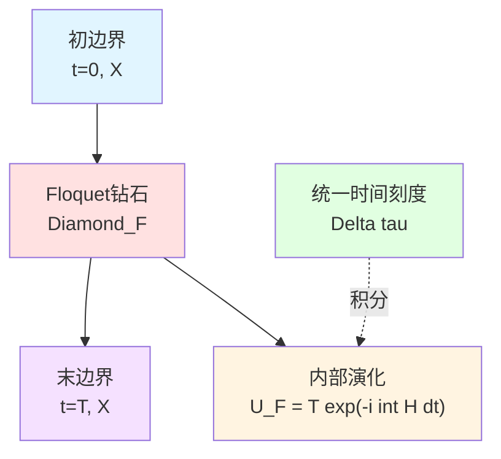

**日常类比**：
- **因果菱形**：从起点到终点的"可达区域"
- **Floquet周期钻石**：驱动一个周期内量子系统的"演化锥"
- **边界**：周期的开始和结束时刻

### 1.3 Floquet钻石链

若系统在时间上重复驱动，事件层上形成一条**Floquet钻石链**：

$$
\{\Diamond_{F,k}\}_{k\in\mathbb{Z}}
$$

其中$\Diamond_{F,k}$对应第$k$个Floquet周期（$k$为整数）。

**链的连接**：
- $\Diamond_{F,k}$的末边界 = $\Diamond_{F,k+1}$的初边界

**统一时间刻度增量**（源理论§4.1）：
对每个$\Diamond_{F,k}$，定义平均统一时间刻度增量：

$$
\Delta\tau_k = \int_{\Omega_F} w_F(\omega)\,\kappa_F(\omega)\,\mathrm{d}\omega
$$

在周期稳定情况下，$\Delta\tau_k\equiv\Delta\tau$与物理周期$T$成比例。

**Mermaid Floquet钻石链**

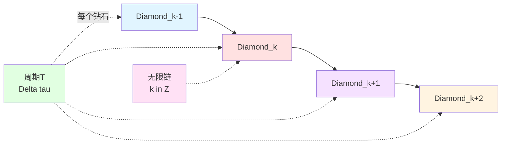

---

## 2. 模2时间相位标签

### 2.1 散射相位与模π约化

在第21章（21-causal-diamond-chain/02-null-modular-double-cover.md）中，我们引入了**π-step量化**：

当散射矩阵$S(\omega)$的极点穿越实轴时，相位跳变$\pm\pi$：

$$
\Delta\varphi = \pm\pi
$$

定义**模2标签**：
$$
\epsilon = \left\lfloor\frac{\Delta\varphi}{\pi}\right\rfloor \bmod 2 \in \{0,1\}
$$

**物理意义**：
- $\epsilon=0$：相位增量为$0$或$2\pi$的整数倍（偶数个$\pi$）
- $\epsilon=1$：相位增量为$\pi$的奇数倍

**Mermaid π-step量化回顾**

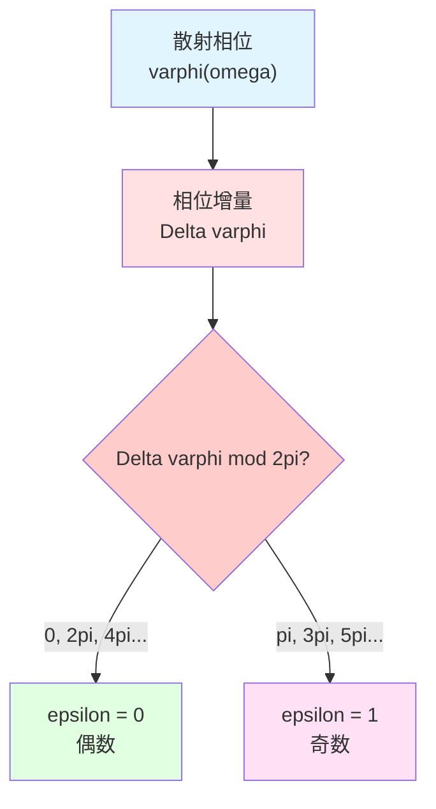

### 2.2 Floquet相位标签

对Floquet演化算子$U_F$，定义**有效相位增量**（源理论§4.2）：

$$
\Delta\varphi_F = \arg\det U_F
$$

**模2 Floquet标签**：
$$
\boxed{\epsilon_F = \left\lfloor\frac{\arg\det U_F}{\pi}\right\rfloor \bmod 2}
$$

**与准能量的关系**：
$$
\det U_F = \prod_\alpha \mathrm{e}^{-\mathrm{i}\varepsilon_\alpha T}
$$

因此：
$$
\arg\det U_F = -T\sum_\alpha \varepsilon_\alpha \bmod 2\pi
$$

**准能量带分裂的影响**：
若存在两条带满足$\varepsilon_\beta = \varepsilon_\alpha + \pi/T$，则：

$$
\varepsilon_\beta T = \varepsilon_\alpha T + \pi
$$

对行列式相位的贡献差$\pi$！

**Mermaid Floquet相位标签**

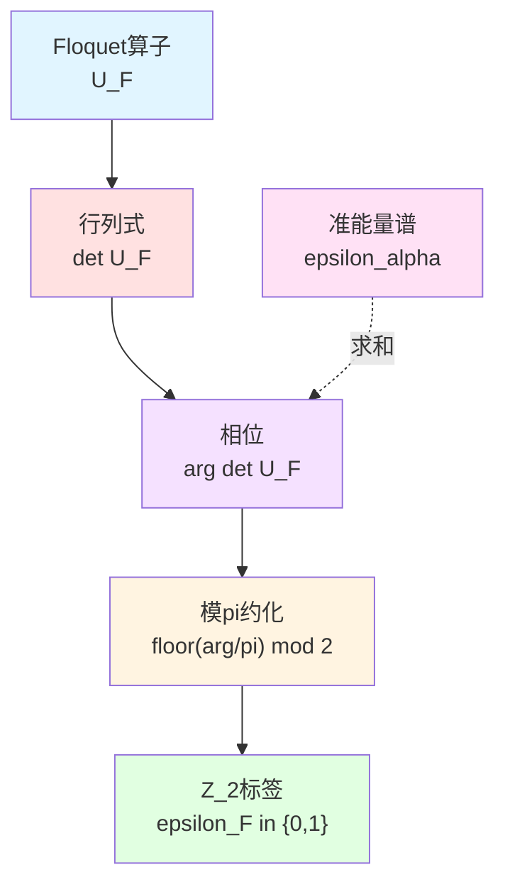

**日常类比**：
- **$\arg\det U_F$**：Floquet演化的"总转角"
- **模$\pi$约化**：判断转角是"偶数个半圈"还是"奇数个半圈"
- **$\epsilon_F$**：奇偶标签（0=偶，1=奇）

### 2.3 链上的总奇偶

对Floquet钻石链$\{\Diamond_{F,k}\}_{k=1}^N$（$N$个周期），定义**总奇偶**：

$$
\Sigma_N = \sum_{k=1}^N \epsilon_F \bmod 2 = N\epsilon_F \bmod 2
$$

**两种情况**：

**(1) $\epsilon_F=0$（平凡）**：
$$
\Sigma_N = 0,\quad \forall N
$$

**(2) $\epsilon_F=1$（非平凡）**：
$$
\Sigma_N = N \bmod 2 = \begin{cases}
0, & N\ \text{偶数} \\
1, & N\ \text{奇数}
\end{cases}
$$

**时间晶体的关联**：
$\epsilon_F=1$意味着每个周期奇偶翻转一次，**两个周期**才回到原奇偶——这正是周期翻倍的特征！

---

## 3. Null-Modular双覆盖空间

### 3.1 双覆盖的拓扑构造

**双覆盖定义**（回顾21章）：
设基空间$\mathfrak{D}$为Floquet钻石链。其**Null-Modular双覆盖**$\widetilde{\mathfrak{D}}_F$定义为：

$$
\widetilde{\mathfrak{D}}_F = \mathfrak{D} \times \{+,-\}
$$

**投影映射**：
$$
\pi : \widetilde{\mathfrak{D}}_F \to \mathfrak{D},\quad (\Diamond,\sigma) \mapsto \Diamond
$$

其中$\sigma\in\{+,-\}$为**覆盖索引**（layer index）。

**Z₂作用**：
$$
\mathbb{Z}_2 = \{e, \tau\},\quad \tau(\Diamond,\sigma) = (\Diamond,-\sigma)
$$

$\tau$交换两层。

**Mermaid双覆盖结构**

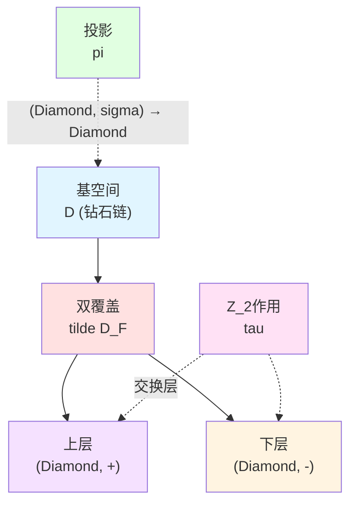

**日常类比**：
- **基空间**：楼梯
- **双覆盖**：楼梯两侧的扶手（左右两层）
- **Z₂作用**：从左扶手跳到右扶手

### 3.2 路径提升与连接规则

**基空间中的路径**：
设$\gamma:[0,1]\to\mathfrak{D}$为基空间中的连续路径（Floquet控制回路）。

**提升路径**：
双覆盖中的路径$\widetilde{\gamma}:[0,1]\to\widetilde{\mathfrak{D}}_F$满足：

$$
\pi\circ\widetilde{\gamma} = \gamma
$$

**连接规则**（源理论§4.2）：
从$(\Diamond_k,\sigma_k)$到$(\Diamond_{k+1},\sigma_{k+1})$的连接由$\epsilon_F$决定：

- **若$\epsilon_F=0$**：$\sigma_{k+1} = \sigma_k$（同层传播）
- **若$\epsilon_F=1$**：$\sigma_{k+1} = -\sigma_k$（换层传播）

**Mermaid路径提升**

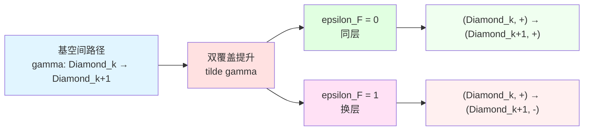

**日常类比**：
- **$\epsilon_F=0$**：楼梯一直在左扶手走
- **$\epsilon_F=1$**：每上一层楼切换一次左右扶手

### 3.3 闭合路径与和乐

**闭合路径**：
基空间中的闭合Floquet控制回路$\Gamma_F$满足$\gamma(0)=\gamma(1)$。

**提升路径的终点**：
双覆盖中，提升路径$\widetilde{\gamma}$的终点为：

$$
\widetilde{\gamma}(1) = (\gamma(1), \sigma_{\rm end})
$$

其中$\sigma_{\rm end}$依赖于路径。

**Z₂和乐定义**（源理论§4.2）：
$$
\boxed{\mathrm{hol}_{\mathbb{Z}_2}(\Gamma_F) := \begin{cases}
0, & \text{若}\sigma_{\rm end} = \sigma_{\rm start} \\
1, & \text{若}\sigma_{\rm end} = -\sigma_{\rm start}
\end{cases}}
$$

**计算公式**：
对$N$周期闭合回路：

$$
\mathrm{hol}_{\mathbb{Z}_2}(\Gamma_F) = \sum_{k=1}^N \epsilon_F \bmod 2 = N\epsilon_F \bmod 2
$$

**两种情况**：

| $\epsilon_F$ | $N$周期后 | 和乐 | 物理意义 |
|-------------|----------|-----|---------|
| 0 | 回到同层 | 0（平凡） | 普通Floquet |
| 1，$N$偶数 | 回到同层 | 0 | 周期$2T$ |
| 1，$N$奇数 | 切换到异层 | 1 | 非平凡 |

**Mermaid和乐计算**

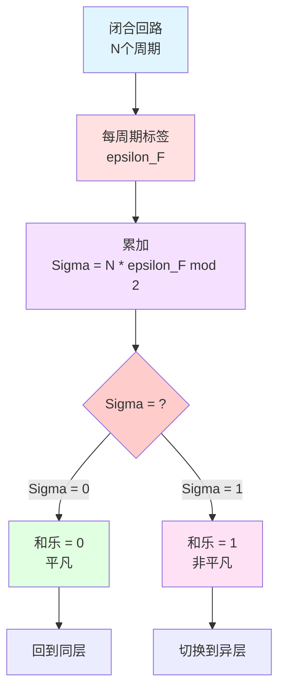

---

## 4. 时间晶体奇偶与Z₂和乐的对应

### 4.1 核心定理陈述

**定理4.1**（源理论§4.3）：

设$U_{\rm FQCA}$是满足以下条件的Floquet-QCA计算宇宙对象：

**(条件1) 均匀体积极限**：
存在均匀体积极限与有限相关长度的初态族$\mathcal{R}_0$。

**(条件2) Floquet能隙**：
准能量谱存在能隙$\Delta_{\rm F}>0$，并存在两个带$\varepsilon_\alpha,\varepsilon_\beta$满足：

$$
\varepsilon_\beta \approx \varepsilon_\alpha + \frac{\pi}{T}
$$

**(条件3) 非平凡和乐**：
在对应的控制流形闭合回路$\Gamma_F$上，Null-Modular双覆盖和乐非平凡：

$$
\mathrm{hol}_{\mathbb{Z}_2}(\Gamma_F) = 1
$$

**结论（"若"方向）**：
则$U_{\rm FQCA}$处于周期$2T$的时间晶体相。

**结论（"仅若"方向）**：
反之，在上述正则性条件下，若$U_{\rm FQCA}$处于稳健的周期$2T$时间晶体相，则相应Floquet控制闭回路的Null-Modular和乐为非平凡元。

**核心对应**：
$$
\boxed{
\text{周期翻倍时间晶体}\ (m=2) \quad\Leftrightarrow\quad \mathrm{hol}_{\mathbb{Z}_2}(\Gamma_F) = 1
}
$$

**Mermaid定理结构**

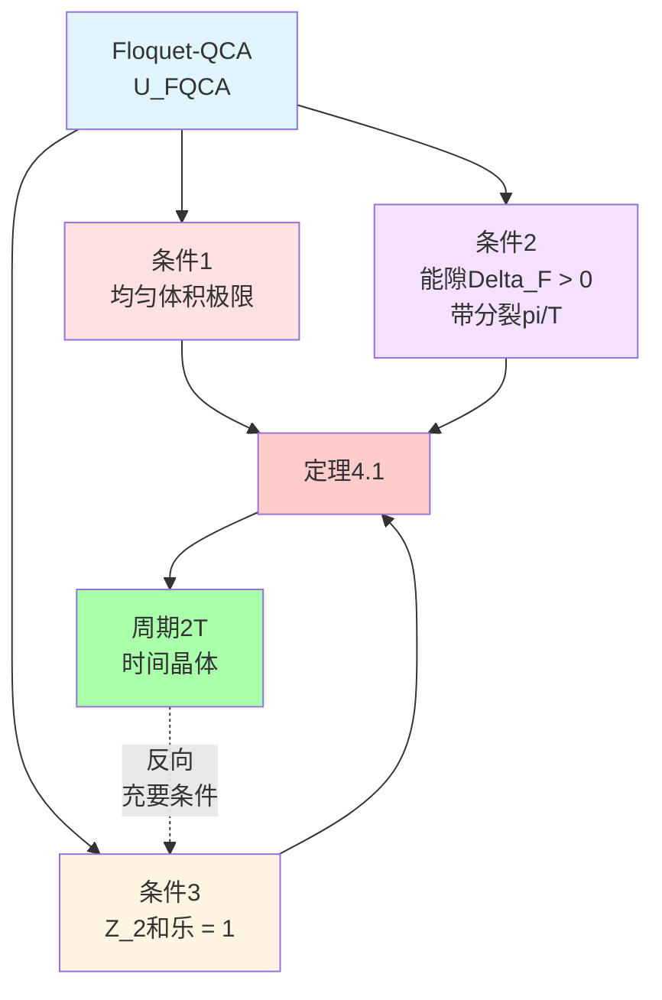

### 4.2 "若"方向证明思路

**证明纲要**（源理论附录C）：

**步骤1：非平凡和乐的代数意义**

$\mathrm{hol}_{\mathbb{Z}_2}(\Gamma_F)=1$意味着控制回路在双覆盖中翻转索引。

存在某个$\mathbb{Z}_2$标签在一周期中翻转一次，两周期中翻转两次回到原态。

**步骤2：准能量谱的对应**

能带分裂$\varepsilon_\beta = \varepsilon_\alpha + \pi/T$导致：

$$
\mathrm{e}^{-\mathrm{i}\varepsilon_\beta T} = -\mathrm{e}^{-\mathrm{i}\varepsilon_\alpha T}
$$

一个周期后相位**反号**。

**步骤3：构造局域可观测量**

取Floquet子空间$\mathcal{H}_\alpha$和$\mathcal{H}_\beta$对应两条带。

定义局域可观测量$O$使得：
$$
\langle O\rangle_{\mathcal{H}_\alpha} = +a,\quad \langle O\rangle_{\mathcal{H}_\beta} = -a
$$

**步骤4：演化轨迹**

初态$\rho_0$在两子空间的相干叠加下演化为：

$$
\rho_n = \frac{1}{2}(|\alpha\rangle\langle\alpha| + (-1)^n|\beta\rangle\langle\beta| + \text{交叉项})
$$

期望值：
$$
\langle O\rangle_n = a(-1)^n
$$

周期为$2$！

**Mermaid证明流程**

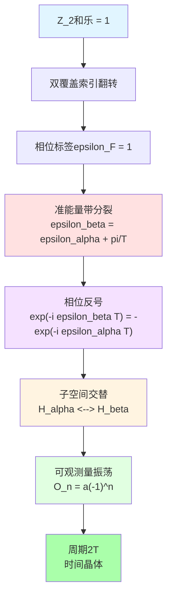

### 4.3 "仅若"方向证明思路

**步骤1：时间晶体的拓扑必然性**

周期翻倍意味着存在某个$\mathbb{Z}_2$结构在每周期翻转。

这要求Floquet-QCA动力学在拓扑上等价于双覆盖中的非平凡闭合路径。

**步骤2：反证法**

若$\mathrm{hol}_{\mathbb{Z}_2}(\Gamma_F)=0$（平凡），则不存在全局奇偶翻转结构。

任何局域可观测量在每周期后回到原值，不存在周期翻倍。

**步骤3：自参照与拓扑复杂性**

时间晶体的周期翻倍本质是一种**自参照反馈**：系统需要"记住"自己处于奇偶周期的哪一个。

这种自参照结构在双覆盖上表现为非平凡和乐。

**完整形式化**：
需要构造从Floquet谱到控制双覆盖的映射与相因子，限于篇幅不展开。

---

## 5. 与自参照网络的联系

### 5.1 自参照奇偶公式

在第21章（21-causal-diamond-chain/02-null-modular-double-cover.md§6）中，我们建立了**自参照网络奇偶**与**Z₂和乐**的对应：

$$
\sigma(\gamma) = \mathrm{hol}_{\mathbb{Z}_2}(\gamma_\Diamond)
$$

其中：
- $\sigma(\gamma)$：自参照网络$\Gamma$中回路$\gamma$的奇偶标签
- $\gamma_\Diamond$：对应的因果菱形链闭合回路

**在Floquet时间晶体中的体现**：

时间晶体的Floquet控制回路$\Gamma_F$可视为一个自参照网络：
- **节点**：每个Floquet周期
- **边**：周期间的演化$U_F$
- **自参照结构**：周期$n$的状态依赖于周期$n-1$，形成闭环

**奇偶标签**：
$$
\sigma(\Gamma_F) = \mathrm{hol}_{\mathbb{Z}_2}(\Gamma_F)
$$

**周期翻倍的自参照解释**：
- $\sigma=0$：系统无自参照反馈，每周期独立
- $\sigma=1$：系统有自参照反馈，需要两周期才"记住"初始状态

**Mermaid自参照网络**

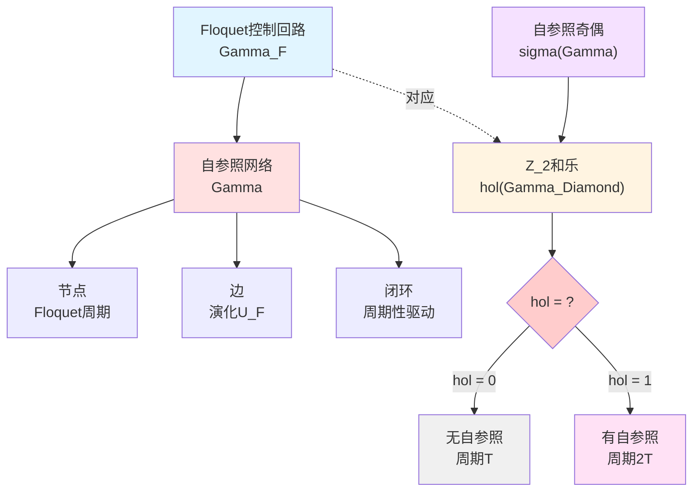

### 5.2 费米子双值性的类比

**费米子双值性**：
费米子波函数在旋转$2\pi$后获得相位$-1$（而非$+1$）：

$$
\psi(\theta+2\pi) = -\psi(\theta)
$$

需要旋转$4\pi$才回到原态！

**时间晶体类比**：
时间晶体在驱动一个周期$T$后获得"相位翻转"（子空间交换），需要驱动$2T$才回到原态。

**拓扑起源**：
两者都源于双覆盖空间的非平凡和乐：
- **费米子**：配置空间的**spin double cover**
- **时间晶体**：Floquet控制空间的**Null-Modular double cover**

**Mermaid费米子类比**

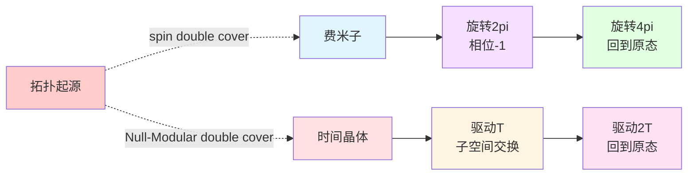

**日常类比**：
- **费米子**：Möbius带上的蚂蚁，爬一圈（$2\pi$）回到原位但"上下颠倒"
- **时间晶体**：Möbius时间轴，走一个周期回到"对面"，走两个周期才回原位

---

## 6. 拓扑不可判定性

### 6.1 Null-Modular停机问题

在第21章（21-causal-diamond-chain/02-null-modular-double-cover.md§7）中，我们讨论了**Null-Modular停机问题**：

**问题**：给定因果菱形链，判定其Z₂和乐$\mathrm{hol}_{\mathbb{Z}_2}(\gamma)$是否为零是**不可判定的**（undecidable）。

**在时间晶体中的体现**：

判定一个给定的Floquet系统是否处于时间晶体相，本质上等价于判定其Z₂和乐。

**不可判定性定理**：
存在Floquet-QCA模型，其时间晶体相的存在性问题是**算法不可判定的**。

**证明思路**：
- 构造自参照网络$\Gamma$使$\sigma(\gamma)=\mathrm{hol}_{\mathbb{Z}_2}(\gamma_\Diamond)$
- 利用自参照停机问题的不可判定性
- 通过拓扑映射归约到Z₂和乐判定

**实际意义**：
这**不**意味着所有时间晶体都无法判定！只是说存在"病态"模型无法算法判定。

实际物理模型（如自旋链）的时间晶体相可通过数值模拟、实验测量判定。

### 6.2 拓扑保护与鲁棒性

**拓扑不变量的优势**：

Z₂和乐作为拓扑不变量，对**局域扰动**是鲁棒的：
- 小幅度改变$U_F$不改变$\mathrm{hol}_{\mathbb{Z}_2}$
- 局域噪声不破坏时间晶体相（只要能隙$\Delta_{\rm F}$保持）

**相变条件**：

只有当扰动**闭合能隙**时，Z₂和乐才可能改变：

$$
\Delta_{\rm F} \to 0 \quad\Rightarrow\quad \text{可能发生相变}
$$

**Mermaid拓扑保护**

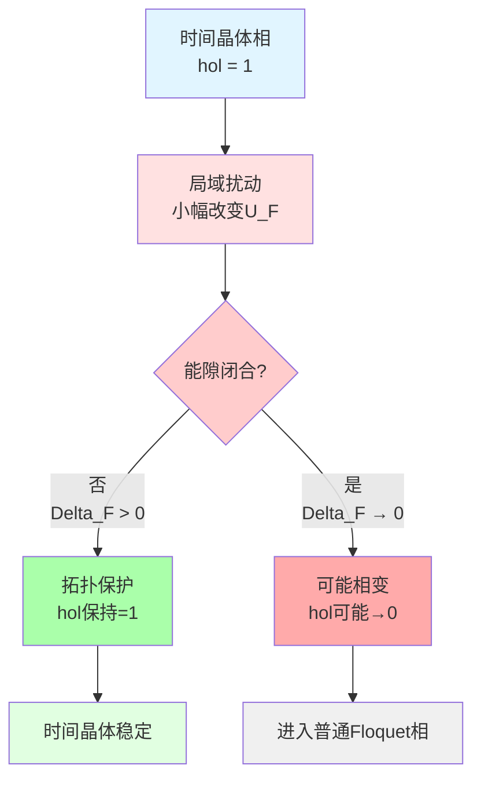

---

## 7. 本章总结

### 7.1 核心概念回顾

**Floquet周期钻石**：
$$
\Diamond_F := \{(x,t) : x\in X,\ t\in[0,T]\}
$$

**模2相位标签**：
$$
\epsilon_F = \left\lfloor\frac{\arg\det U_F}{\pi}\right\rfloor \bmod 2
$$

**Z₂和乐**：
$$
\mathrm{hol}_{\mathbb{Z}_2}(\Gamma_F) = N\epsilon_F \bmod 2
$$

**核心定理**：
$$
\boxed{
\text{周期翻倍时间晶体}\quad\Leftrightarrow\quad \mathrm{hol}_{\mathbb{Z}_2}(\Gamma_F) = 1
}
$$

### 7.2 关键洞察

1. **拓扑不变量的地位**：
   Z₂和乐提供了时间晶体周期奇偶的**拓扑刻画**，独立于微观细节。

2. **双覆盖的几何实现**：
   Null-Modular双覆盖将抽象的Z₂标签具象为几何空间的"两层"结构。

3. **自参照的深层联系**：
   时间晶体的周期翻倍本质是**自参照反馈**，体现为双覆盖的非平凡和乐。

4. **费米子统计的类比**：
   时间晶体的"两周期回原"与费米子的"旋转$4\pi$回原"有共同的拓扑起源。

5. **拓扑保护的鲁棒性**：
   只要能隙$\Delta_{\rm F}>0$保持，局域扰动不破坏时间晶体相。

### 7.3 下一章预告

下一章（**03-engineering-implementation.md**）将讨论：
- 实验平台（冷原子、超导qubit、离子阱）
- DPSS窗化读出方案
- 样本复杂度$N=\mathcal{O}(\Delta_{\rm F}^{-2}\log(1/\varepsilon))$
- 噪声鲁棒性与误差控制
- 实际实验参数设计

**核心公式预告**：
$$
N \ge C\Delta_{\rm F}^{-2}\log(1/\varepsilon)
$$

---

**本章结束**

---

**源理论**：`euler-gls-info/17-time-crystals-null-modular-z2-holonomy.md`，§4；附录B-C
