# Chapter 2: Z₂ Holonomy and Time Crystal Parity Labels

**Source Theory**: `euler-gls-info/17-time-crystals-null-modular-z2-holonomy.md`, §4; Appendices B-C

---

## Introduction

In the previous chapter, we established the Floquet-QCA framework and saw that period-doubling time crystals originate from $\pi/T$ splitting of quasienergy bands. But a deep question remains unanswered:

**Is there a topological invariant to characterize this "period doubling"?**

The answer is yes! Through **Null-Modular Double Cover** and **Z₂ Holonomy**, we can elevate the period parity of time crystals to a **topological invariant**.

**Core Content of This Chapter**:
1. Treat Floquet periods as causal diamond chains
2. Construct Null-Modular double cover space
3. Define Z₂ holonomy $\mathrm{hol}_{\mathbb{Z}_2}(\Gamma_F)$
4. Prove: Period doubling $\Leftrightarrow$ Non-trivial holonomy

**Everyday Analogy**:
- **Möbius Strip**: Go around once returns to original position but "flips upside down" (Z₂ holonomy=1)
- **Ordinary Ring**: Go around once returns to original position with same orientation (Z₂ holonomy=0)
- Floquet evolution of time crystal is like Möbius strip: flips once per round!

---

## 1. Floquet Periods as Causal Diamond Chains

### 1.1 Review: Definition of Causal Diamond

In Chapter 21 (Causal Diamond Chain Theory), we defined **causal diamond**:

$$
D(p_{\rm past}, p_{\rm future}) = J^+(p_{\rm past}) \cap J^-(p_{\rm future})
$$

where $J^+$ is causal future, $J^-$ is causal past.

**Null Boundary Double-Layer Decomposition**:
$$
\widetilde{E} = E^+ \sqcup E^-
$$

**Modular Hamiltonian**:
$$
K_D = 2\pi\sum_{\sigma=\pm}\int_{E^\sigma} g_\sigma(\lambda,x_\perp)\,T_{\sigma\sigma}(\lambda,x_\perp)\,\mathrm{d}\lambda\,\mathrm{d}^{d-2}x_\perp
$$

**Mermaid Causal Diamond Review**

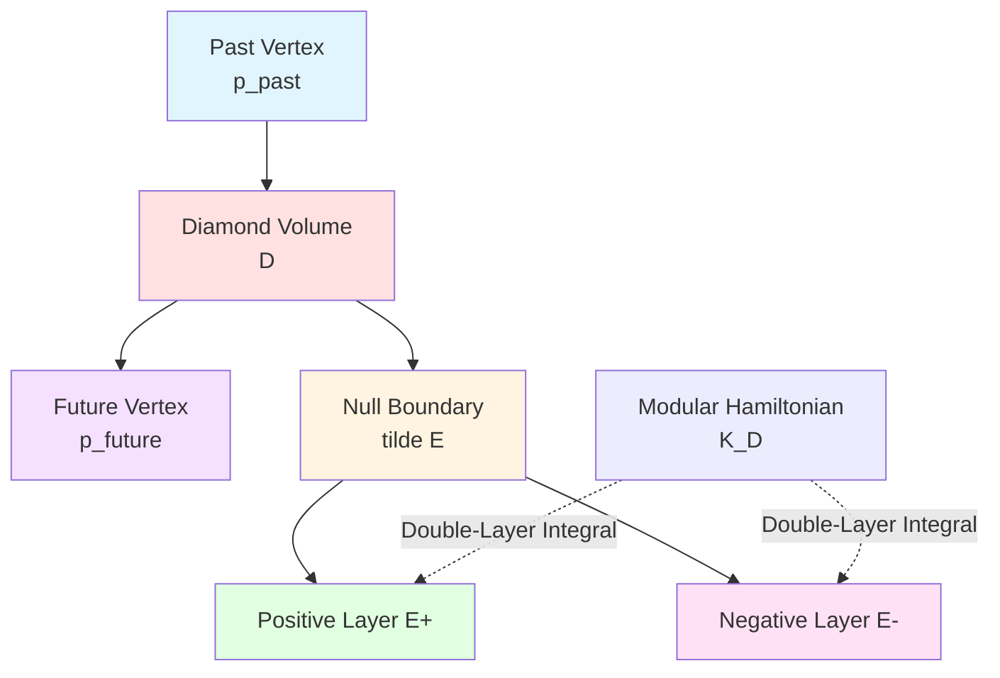

### 1.2 Floquet Period Diamond

**Core Idea** (Source Theory §4.1): Treat **single Floquet period** as a causal diamond.

**Specific Construction**:
- **Diamond Interior Vertices**: Set of events from some initial state layer to next layer within complexity budget $T$
- **Diamond Boundary**: Initial and final events of period
- **Diamond Volume Evolution**: Given by local decomposition of $U_F$
- **Boundary Operator**: $\mathsf{K}_{\Diamond_F}$ isomorphic to action of $U_F$ on boundary

**Formal Definition**:
$$
\Diamond_F := \{(x,t) : x\in X,\ t\in[0,T]\}
$$

Its boundary is:
- **Initial Boundary**: $\partial_{\rm in}\Diamond_F = X\times\{0\}$
- **Final Boundary**: $\partial_{\rm out}\Diamond_F = X\times\{T\}$

**Mermaid Floquet Period Diamond**

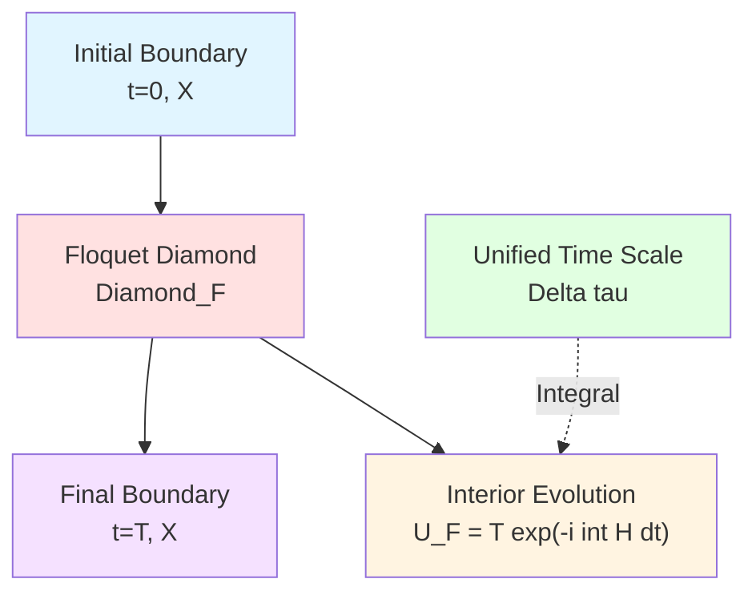

**Everyday Analogy**:
- **Causal Diamond**: "Reachable region" from start to end
- **Floquet Period Diamond**: "Evolution cone" of quantum system within one driving period
- **Boundary**: Start and end moments of period

### 1.3 Floquet Diamond Chain

If system is driven repeatedly in time, a **Floquet diamond chain** forms on event layer:

$$
\{\Diamond_{F,k}\}_{k\in\mathbb{Z}}
$$

where $\Diamond_{F,k}$ corresponds to $k$-th Floquet period ($k$ is integer).

**Chain Connection**:
- Final boundary of $\Diamond_{F,k}$ = Initial boundary of $\Diamond_{F,k+1}$

**Unified Time Scale Increment** (Source Theory §4.1):
For each $\Diamond_{F,k}$, define average unified time scale increment:

$$
\Delta\tau_k = \int_{\Omega_F} w_F(\omega)\,\kappa_F(\omega)\,\mathrm{d}\omega
$$

Under stable period conditions, $\Delta\tau_k\equiv\Delta\tau$ is proportional to physical period $T$.

**Mermaid Floquet Diamond Chain**

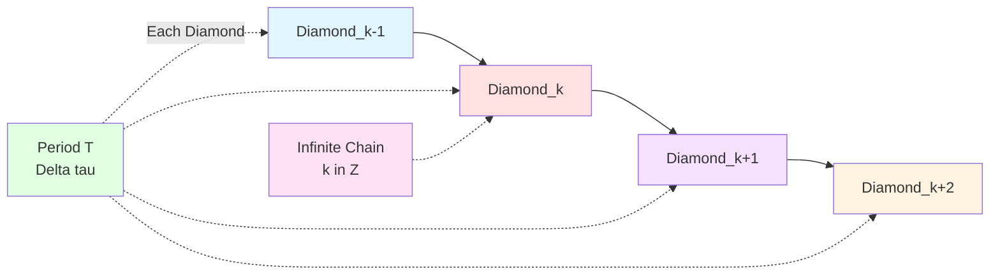

---

## 2. Mod-2 Time Phase Labels

### 2.1 Scattering Phase and Mod-π Reduction

In Chapter 21 (21-causal-diamond-chain/02-null-modular-double-cover.md), we introduced **π-step quantization**:

When pole of scattering matrix $S(\omega)$ crosses real axis, phase jumps $\pm\pi$:

$$
\Delta\varphi = \pm\pi
$$

Define **mod-2 label**:
$$
\epsilon = \left\lfloor\frac{\Delta\varphi}{\pi}\right\rfloor \bmod 2 \in \{0,1\}
$$

**Physical Meaning**:
- $\epsilon=0$: Phase increment is $0$ or integer multiples of $2\pi$ (even number of $\pi$)
- $\epsilon=1$: Phase increment is odd multiples of $\pi$

**Mermaid π-Step Quantization Review**

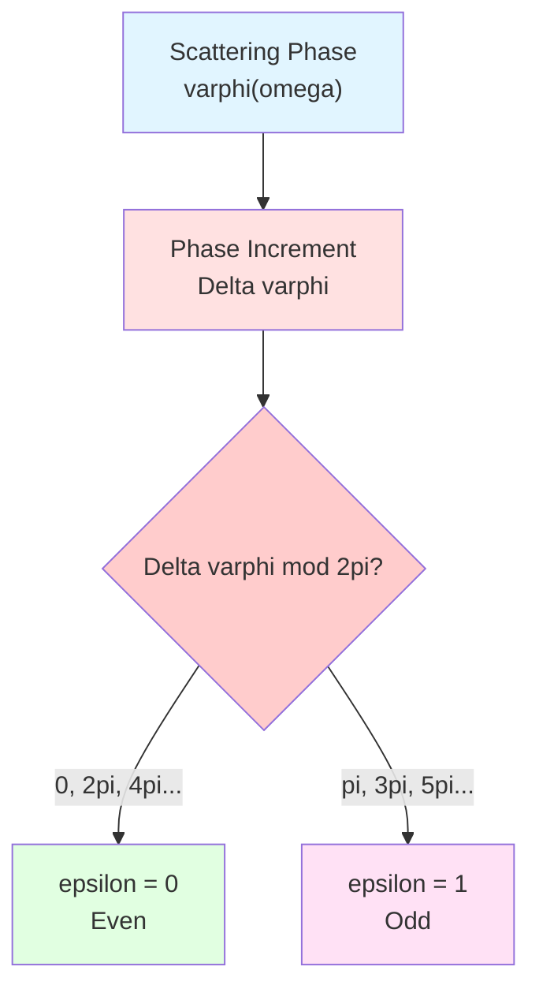

### 2.2 Floquet Phase Label

For Floquet evolution operator $U_F$, define **effective phase increment** (Source Theory §4.2):

$$
\Delta\varphi_F = \arg\det U_F
$$

**Mod-2 Floquet Label**:
$$
\boxed{\epsilon_F = \left\lfloor\frac{\arg\det U_F}{\pi}\right\rfloor \bmod 2}
$$

**Relation with Quasienergy**:
$$
\det U_F = \prod_\alpha \mathrm{e}^{-\mathrm{i}\varepsilon_\alpha T}
$$

Therefore:
$$
\arg\det U_F = -T\sum_\alpha \varepsilon_\alpha \bmod 2\pi
$$

**Effect of Quasienergy Band Splitting**:
If there exist two bands satisfying $\varepsilon_\beta = \varepsilon_\alpha + \pi/T$, then:

$$
\varepsilon_\beta T = \varepsilon_\alpha T + \pi
$$

Contribution difference to determinant phase is $\pi$!

**Mermaid Floquet Phase Label**

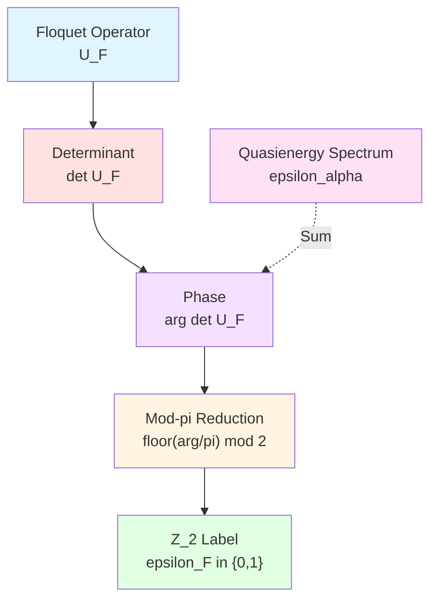

**Everyday Analogy**:
- **$\arg\det U_F$**: "Total rotation angle" of Floquet evolution
- **Mod-$\pi$ reduction**: Determine whether rotation angle is "even number of half-turns" or "odd number of half-turns"
- **$\epsilon_F$**: Parity label (0=even, 1=odd)

### 2.3 Total Parity on Chain

For Floquet diamond chain $\{\Diamond_{F,k}\}_{k=1}^N$ ($N$ periods), define **total parity**:

$$
\Sigma_N = \sum_{k=1}^N \epsilon_F \bmod 2 = N\epsilon_F \bmod 2
$$

**Two Cases**:

**(1) $\epsilon_F=0$ (Trivial)**:
$$
\Sigma_N = 0,\quad \forall N
$$

**(2) $\epsilon_F=1$ (Non-Trivial)**:
$$
\Sigma_N = N \bmod 2 = \begin{cases}
0, & N\ \text{even} \\
1, & N\ \text{odd}
\end{cases}
$$

**Connection with Time Crystals**:
$\epsilon_F=1$ means parity flips once per period, **two periods** return to original parity—this is exactly the characteristic of period doubling!

---

## 3. Null-Modular Double Cover Space

### 3.1 Topological Construction of Double Cover

**Double Cover Definition** (Review Chapter 21):
Let base space $\mathfrak{D}$ be Floquet diamond chain. Its **Null-Modular double cover** $\widetilde{\mathfrak{D}}_F$ is defined as:

$$
\widetilde{\mathfrak{D}}_F = \mathfrak{D} \times \{+,-\}
$$

**Projection Map**:
$$
\pi : \widetilde{\mathfrak{D}}_F \to \mathfrak{D},\quad (\Diamond,\sigma) \mapsto \Diamond
$$

where $\sigma\in\{+,-\}$ is **cover index** (layer index).

**Z₂ Action**:
$$
\mathbb{Z}_2 = \{e, \tau\},\quad \tau(\Diamond,\sigma) = (\Diamond,-\sigma)
$$

$\tau$ exchanges two layers.

**Mermaid Double Cover Structure**

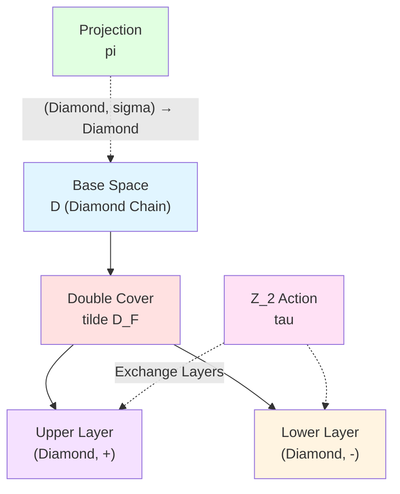

**Everyday Analogy**:
- **Base Space**: Stairs
- **Double Cover**: Handrails on both sides of stairs (left-right two layers)
- **Z₂ Action**: Jump from left handrail to right handrail

### 3.2 Path Lifting and Connection Rules

**Path in Base Space**:
Let $\gamma:[0,1]\to\mathfrak{D}$ be continuous path in base space (Floquet control loop).

**Lift Path**:
Path $\widetilde{\gamma}:[0,1]\to\widetilde{\mathfrak{D}}_F$ in double cover satisfying:

$$
\pi\circ\widetilde{\gamma} = \gamma
$$

**Connection Rules** (Source Theory §4.2):
Connection from $(\Diamond_k,\sigma_k)$ to $(\Diamond_{k+1},\sigma_{k+1})$ determined by $\epsilon_F$:

- **If $\epsilon_F=0$**: $\sigma_{k+1} = \sigma_k$ (same layer propagation)
- **If $\epsilon_F=1$**: $\sigma_{k+1} = -\sigma_k$ (layer-switching propagation)

**Mermaid Path Lifting**

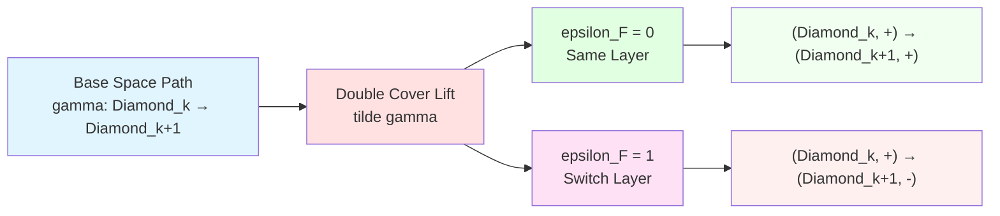

**Everyday Analogy**:
- **$\epsilon_F=0$**: Stairs always on left handrail
- **$\epsilon_F=1$**: Switch left-right handrail every floor

### 3.3 Closed Paths and Holonomy

**Closed Path**:
Closed Floquet control loop $\Gamma_F$ in base space satisfies $\gamma(0)=\gamma(1)$.

**Endpoint of Lift Path**:
In double cover, endpoint of lift path $\widetilde{\gamma}$ is:

$$
\widetilde{\gamma}(1) = (\gamma(1), \sigma_{\rm end})
$$

where $\sigma_{\rm end}$ depends on path.

**Z₂ Holonomy Definition** (Source Theory §4.2):
$$
\boxed{\mathrm{hol}_{\mathbb{Z}_2}(\Gamma_F) := \begin{cases}
0, & \text{if }\sigma_{\rm end} = \sigma_{\rm start} \\
1, & \text{if }\sigma_{\rm end} = -\sigma_{\rm start}
\end{cases}}
$$

**Calculation Formula**:
For $N$-period closed loop:

$$
\mathrm{hol}_{\mathbb{Z}_2}(\Gamma_F) = \sum_{k=1}^N \epsilon_F \bmod 2 = N\epsilon_F \bmod 2
$$

**Two Cases**:

| $\epsilon_F$ | After $N$ Periods | Holonomy | Physical Meaning |
|-------------|------------------|----------|-----------------|
| 0 | Return to same layer | 0 (trivial) | Ordinary Floquet |
| 1, $N$ even | Return to same layer | 0 | Period $2T$ |
| 1, $N$ odd | Switch to different layer | 1 | Non-trivial |

**Mermaid Holonomy Calculation**

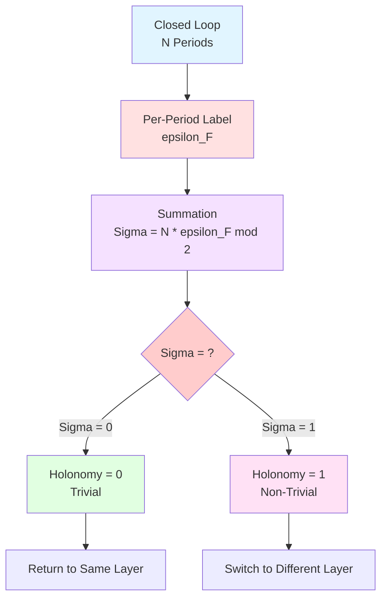

---

## 4. Correspondence Between Time Crystal Parity and Z₂ Holonomy

### 4.1 Core Theorem Statement

**Theorem 4.1** (Source Theory §4.3):

Let $U_{\rm FQCA}$ be a Floquet-QCA computational universe object satisfying:

**(Condition 1) Uniform Volume Limit**:
There exists initial state family $\mathcal{R}_0$ with uniform volume limit and finite correlation length.

**(Condition 2) Floquet Band Gap**:
Quasienergy spectrum has gap $\Delta_{\rm F}>0$, and there exist two bands $\varepsilon_\alpha,\varepsilon_\beta$ satisfying:

$$
\varepsilon_\beta \approx \varepsilon_\alpha + \frac{\pi}{T}
$$

**(Condition 3) Non-Trivial Holonomy**:
On corresponding control manifold closed loop $\Gamma_F$, Null-Modular double cover holonomy is non-trivial:

$$
\mathrm{hol}_{\mathbb{Z}_2}(\Gamma_F) = 1
$$

**Conclusion ("If" Direction)**:
Then $U_{\rm FQCA}$ is in period $2T$ time crystal phase.

**Conclusion ("Only If" Direction)**:
Conversely, under above regularity conditions, if $U_{\rm FQCA}$ is in robust period $2T$ time crystal phase, then Null-Modular holonomy of corresponding Floquet control closed loop is non-trivial element.

**Core Correspondence**:
$$
\boxed{
\text{Period-Doubling Time Crystal}\ (m=2) \quad\Leftrightarrow\quad \mathrm{hol}_{\mathbb{Z}_2}(\Gamma_F) = 1
}
$$

**Mermaid Theorem Structure**

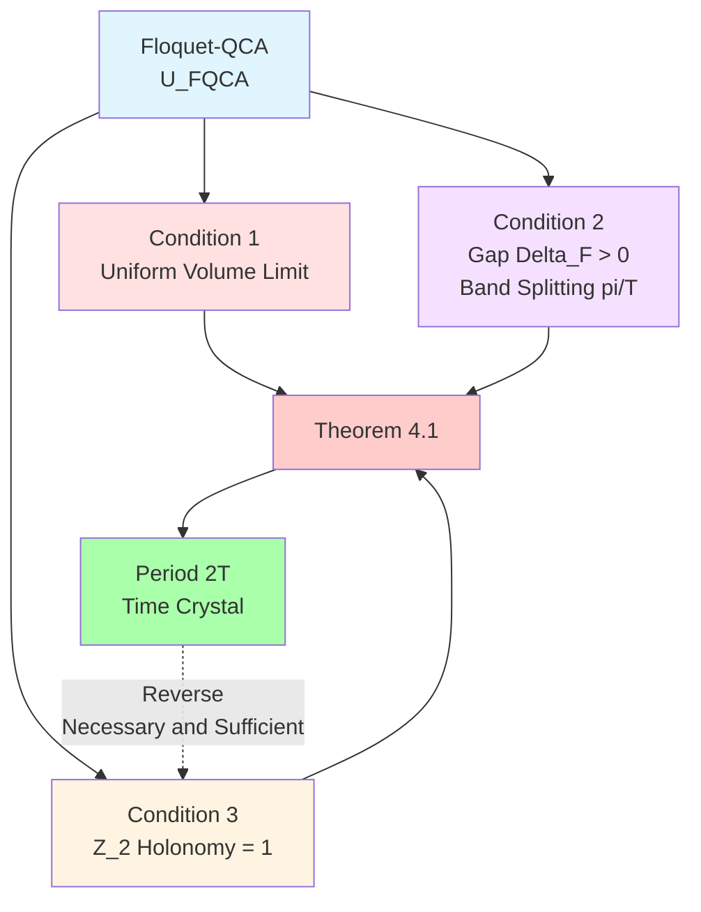

### 4.2 Proof Strategy for "If" Direction

**Proof Outline** (Source Theory Appendix C):

**Step 1: Algebraic Meaning of Non-Trivial Holonomy**

$\mathrm{hol}_{\mathbb{Z}_2}(\Gamma_F)=1$ means control loop flips index in double cover.

There exists some $\mathbb{Z}_2$ label that flips once per period, flips twice in two periods returning to original state.

**Step 2: Correspondence with Quasienergy Spectrum**

Band splitting $\varepsilon_\beta = \varepsilon_\alpha + \pi/T$ leads to:

$$
\mathrm{e}^{-\mathrm{i}\varepsilon_\beta T} = -\mathrm{e}^{-\mathrm{i}\varepsilon_\alpha T}
$$

Phase **flips sign** after one period.

**Step 3: Construct Local Observable**

Take Floquet subspaces $\mathcal{H}_\alpha$ and $\mathcal{H}_\beta$ corresponding to two bands.

Define local observable $O$ such that:
$$
\langle O\rangle_{\mathcal{H}_\alpha} = +a,\quad \langle O\rangle_{\mathcal{H}_\beta} = -a
$$

**Step 4: Evolution Trajectory**

Initial state $\rho_0$ evolves under coherent superposition of two subspaces as:

$$
\rho_n = \frac{1}{2}(|\alpha\rangle\langle\alpha| + (-1)^n|\beta\rangle\langle\beta| + \text{cross terms})
$$

Expectation value:
$$
\langle O\rangle_n = a(-1)^n
$$

Period is $2$!

**Mermaid Proof Flow**

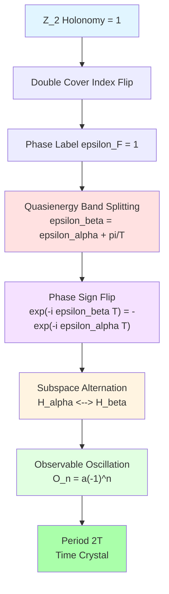

### 4.3 Proof Strategy for "Only If" Direction

**Step 1: Topological Necessity of Time Crystals**

Period doubling means there exists some $\mathbb{Z}_2$ structure that flips per period.

This requires Floquet-QCA dynamics to be topologically equivalent to non-trivial closed path in double cover.

**Step 2: Proof by Contradiction**

If $\mathrm{hol}_{\mathbb{Z}_2}(\Gamma_F)=0$ (trivial), then no global parity flip structure exists.

Any local observable returns to original value after each period, no period doubling.

**Step 3: Self-Reference and Topological Complexity**

Period doubling of time crystals is essentially a **self-referential feedback**: system needs to "remember" which parity period it is in.

This self-referential structure manifests as non-trivial holonomy on double cover.

**Complete Formalization**:
Need to construct mapping from Floquet spectrum to control double cover with phase factors, omitted for brevity.

---

## 5. Connection with Self-Referential Networks

### 5.1 Self-Referential Parity Formula

In Chapter 21 (21-causal-diamond-chain/02-null-modular-double-cover.md§6), we established correspondence between **self-referential network parity** and **Z₂ holonomy**:

$$
\sigma(\gamma) = \mathrm{hol}_{\mathbb{Z}_2}(\gamma_\Diamond)
$$

where:
- $\sigma(\gamma)$: Parity label of loop $\gamma$ in self-referential network $\Gamma$
- $\gamma_\Diamond$: Corresponding closed loop of causal diamond chain

**Manifestation in Floquet Time Crystals**:

Floquet control loop $\Gamma_F$ of time crystal can be viewed as a self-referential network:
- **Nodes**: Each Floquet period
- **Edges**: Evolution $U_F$ between periods
- **Self-Referential Structure**: State at period $n$ depends on period $n-1$, forming closed loop

**Parity Label**:
$$
\sigma(\Gamma_F) = \mathrm{hol}_{\mathbb{Z}_2}(\Gamma_F)
$$

**Self-Referential Interpretation of Period Doubling**:
- $\sigma=0$: System has no self-referential feedback, each period independent
- $\sigma=1$: System has self-referential feedback, needs two periods to "remember" initial state

**Mermaid Self-Referential Network**

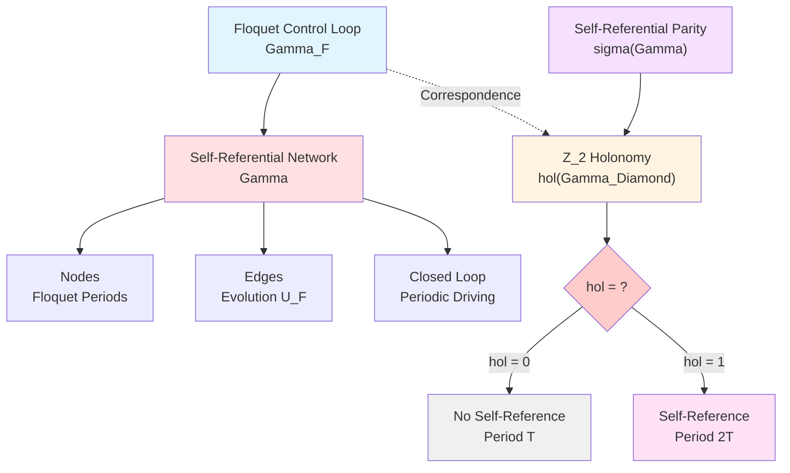

### 5.2 Analogy with Fermion Double-Valuedness

**Fermion Double-Valuedness**:
Fermion wave function acquires phase $-1$ (not $+1$) after $2\pi$ rotation:

$$
\psi(\theta+2\pi) = -\psi(\theta)
$$

Need $4\pi$ rotation to return to original state!

**Time Crystal Analogy**:
Time crystal acquires "phase flip" (subspace exchange) after one driving period $T$, needs $2T$ to return to original state.

**Topological Origin**:
Both originate from non-trivial holonomy of double cover space:
- **Fermions**: **Spin double cover** of configuration space
- **Time Crystals**: **Null-Modular double cover** of Floquet control space

**Mermaid Fermion Analogy**

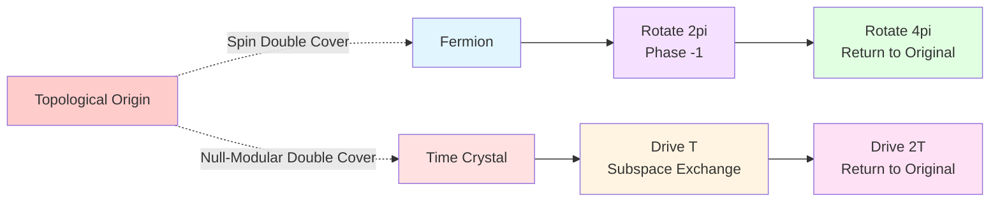

**Everyday Analogy**:
- **Fermion**: Ant on Möbius strip, crawl around once ($2\pi$) returns to original position but "upside down"
- **Time Crystal**: Möbius time axis, walk one period returns to "opposite side", need two periods to return to original position

---

## 6. Topological Undecidability

### 6.1 Null-Modular Halting Problem

In Chapter 21 (21-causal-diamond-chain/02-null-modular-double-cover.md§7), we discussed **Null-Modular Halting Problem**:

**Problem**: Given causal diamond chain, determining whether its Z₂ holonomy $\mathrm{hol}_{\mathbb{Z}_2}(\gamma)$ is zero is **undecidable**.

**Manifestation in Time Crystals**:

Determining whether a given Floquet system is in time crystal phase is essentially equivalent to determining its Z₂ holonomy.

**Undecidability Theorem**:
There exist Floquet-QCA models for which the existence problem of time crystal phase is **algorithmically undecidable**.

**Proof Strategy**:
- Construct self-referential network $\Gamma$ such that $\sigma(\gamma)=\mathrm{hol}_{\mathbb{Z}_2}(\gamma_\Diamond)$
- Use undecidability of self-referential halting problem
- Reduce to Z₂ holonomy determination through topological mapping

**Practical Significance**:
This does **not** mean all time crystals are undecidable! Only that there exist "pathological" models that cannot be algorithmically determined.

Time crystal phases of actual physical models (e.g., spin chains) can be determined through numerical simulation and experimental measurement.

### 6.2 Topological Protection and Robustness

**Advantage of Topological Invariants**:

Z₂ holonomy as topological invariant is robust to **local perturbations**:
- Small changes to $U_F$ do not change $\mathrm{hol}_{\mathbb{Z}_2}$
- Local noise does not destroy time crystal phase (as long as gap $\Delta_{\rm F}$ persists)

**Phase Transition Condition**:

Only when perturbation **closes gap** can Z₂ holonomy possibly change:

$$
\Delta_{\rm F} \to 0 \quad\Rightarrow\quad \text{phase transition may occur}
$$

**Mermaid Topological Protection**

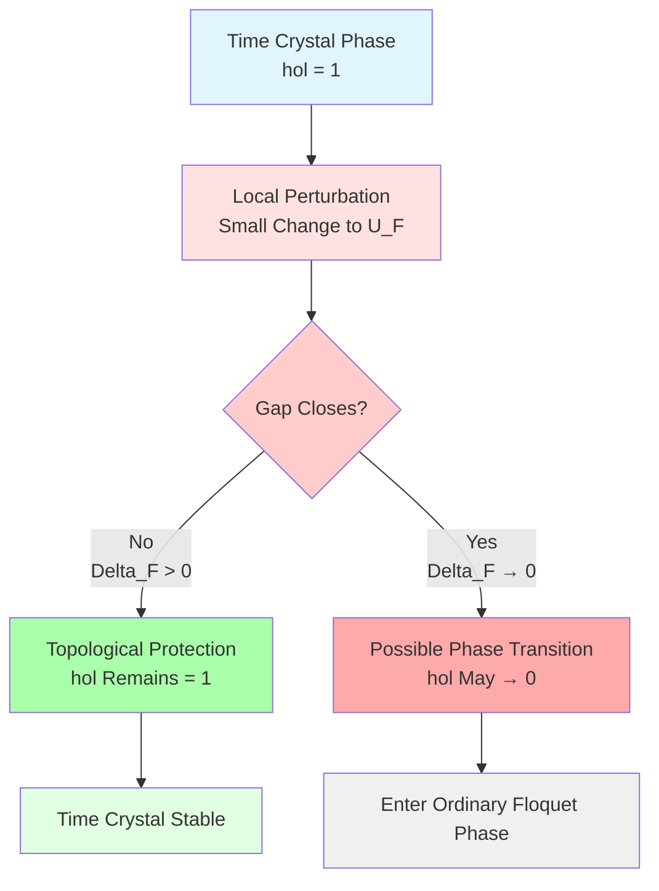

---

## 7. Chapter Summary

### 7.1 Core Concepts Review

**Floquet Period Diamond**:
$$
\Diamond_F := \{(x,t) : x\in X,\ t\in[0,T]\}
$$

**Mod-2 Phase Label**:
$$
\epsilon_F = \left\lfloor\frac{\arg\det U_F}{\pi}\right\rfloor \bmod 2
$$

**Z₂ Holonomy**:
$$
\mathrm{hol}_{\mathbb{Z}_2}(\Gamma_F) = N\epsilon_F \bmod 2
$$

**Core Theorem**:
$$
\boxed{
\text{Period-Doubling Time Crystal}\quad\Leftrightarrow\quad \mathrm{hol}_{\mathbb{Z}_2}(\Gamma_F) = 1
}
$$

### 7.2 Key Insights

1. **Status of Topological Invariants**:
   Z₂ holonomy provides **topological characterization** of time crystal period parity, independent of microscopic details.

2. **Geometric Realization of Double Cover**:
   Null-Modular double cover concretizes abstract Z₂ labels as "two-layer" structure of geometric space.

3. **Deep Connection with Self-Reference**:
   Period doubling of time crystals is essentially **self-referential feedback**, manifesting as non-trivial holonomy of double cover.

4. **Analogy with Fermion Statistics**:
   "Two periods return to original" of time crystals and "rotate $4\pi$ return to original" of fermions share common topological origin.

5. **Robustness of Topological Protection**:
   As long as gap $\Delta_{\rm F}>0$ persists, local perturbations do not destroy time crystal phase.

### 7.3 Preview of Next Chapter

Next chapter (**03-engineering-implementation.md**) will discuss:
- Experimental platforms (cold atoms, superconducting qubits, ion traps)
- DPSS windowed readout schemes
- Sample complexity $N=\mathcal{O}(\Delta_{\rm F}^{-2}\log(1/\varepsilon))$
- Noise robustness and error control
- Actual experimental parameter design

**Core Formula Preview**:
$$
N \ge C\Delta_{\rm F}^{-2}\log(1/\varepsilon)
$$

---

**End of Chapter**

---

**Source Theory**: `euler-gls-info/17-time-crystals-null-modular-z2-holonomy.md`, §4; Appendices B-C

