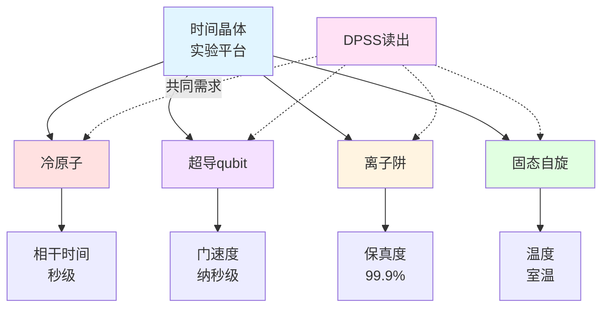
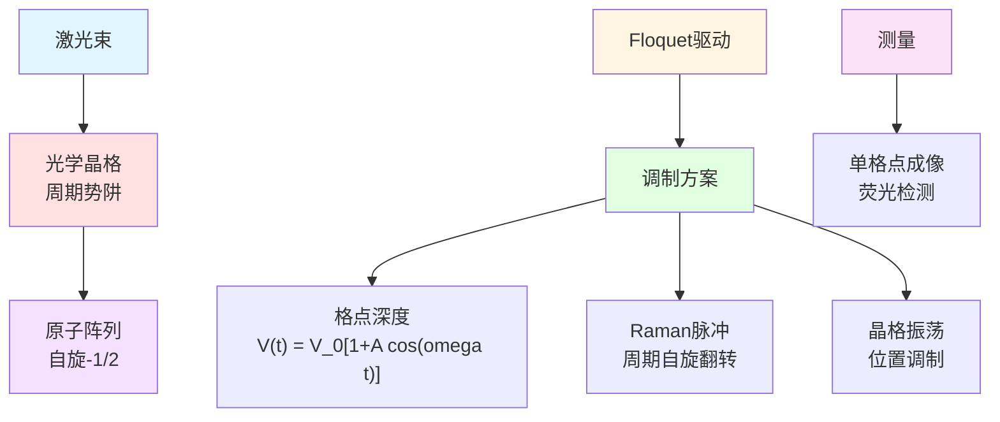
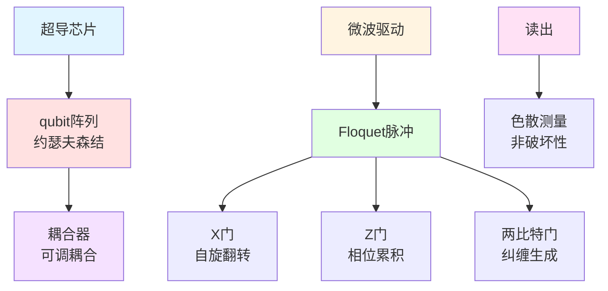
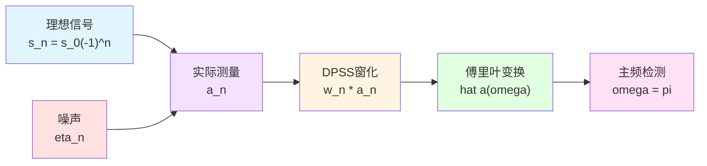
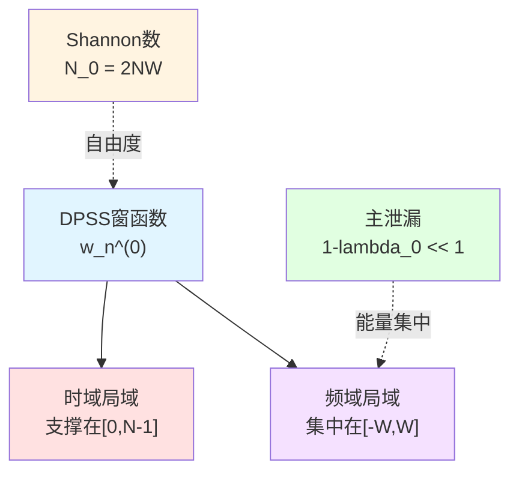
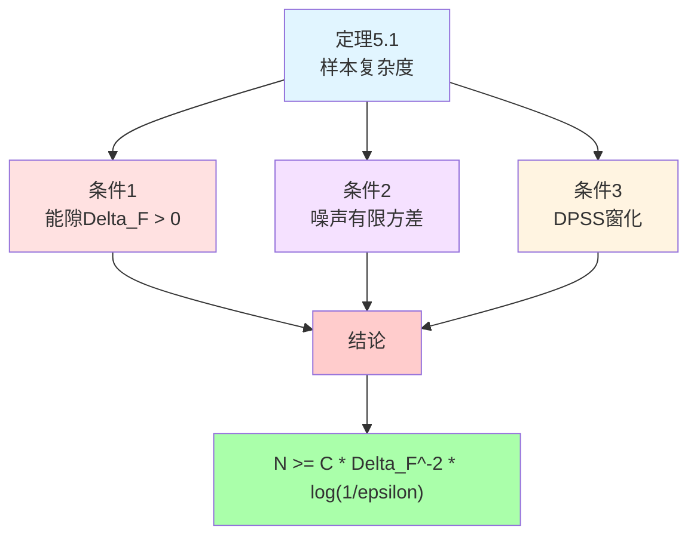
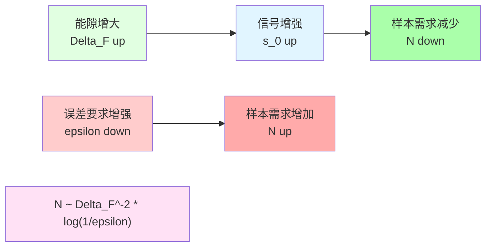
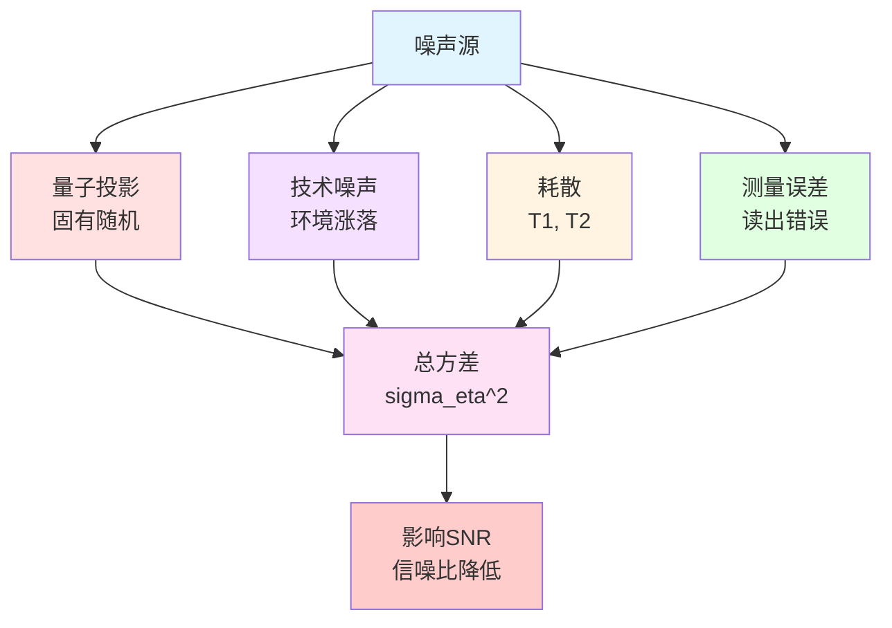
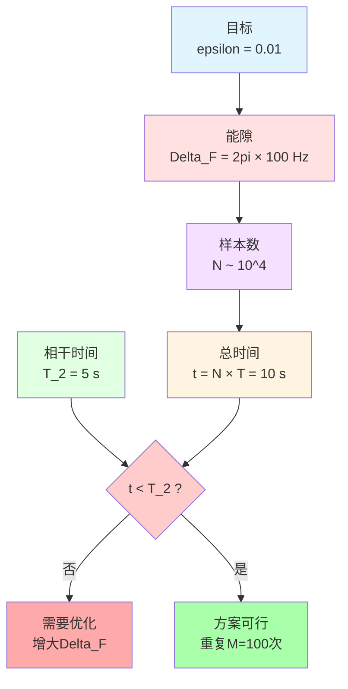
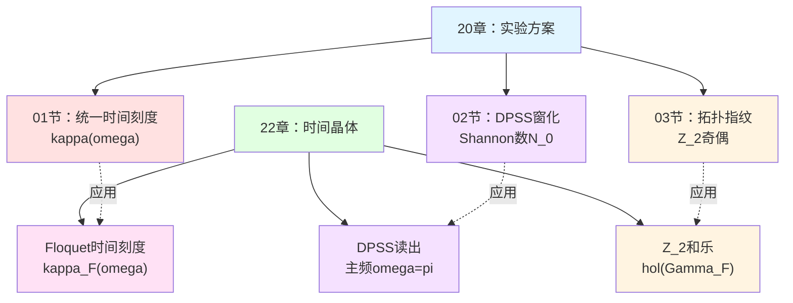

# 第三章：工程实现与有限复杂性读出

**源理论**：`euler-gls-info/17-time-crystals-null-modular-z2-holonomy.md`，§5；附录D

---

## 引言

前两章建立了时间晶体的理论框架：
- 第01章：Floquet-QCA与周期翻倍机制
- 第02章：Z₂和乐与拓扑不变量

现在面临实际问题：**如何在实验中观测和测量时间晶体？**

本章将回答：
1. 哪些量子平台适合实现时间晶体？
2. 如何在**有限测量步数**内判别时间晶体信号？
3. 需要多少样本才能可靠判别（样本复杂度）？
4. 如何应对噪声与耗散？

**核心工具**：DPSS窗化读出技术（回顾第20章）

**日常类比**：
- **时间晶体信号**：微弱的周期性"心跳"
- **噪声**：背景杂音
- **DPSS窗化**：高灵敏度"听诊器"
- **样本复杂度**：需要听多久才能确认心跳存在

---

## 1. 实验平台概览

### 1.1 四大候选平台

时间晶体可在多种量子平台实现，各有优劣：

| 平台 | 优势 | 劣势 | TRL等级 |
|-----|------|------|--------|
| **冷原子光晶格** | 长相干时间 单格点成像 | 制备复杂 温度敏感 | TRL 6-7 |
| **超导量子比特** | 快速操控 可编程 | 短相干时间 串扰 | TRL 7-8 |
| **离子阱** | 超长相干 全连接 | 规模受限 激光复杂 | TRL 6-7 |
| **固态自旋** | 室温操作 集成化 | 控制精度 环境噪声 | TRL 5-6 |

**TRL**（Technology Readiness Level）：技术成熟度等级，1-9级，数字越大越成熟。

**Mermaid平台比较**

### 1.2 平台选择标准

**关键指标**：

**(1) Floquet能隙**$\Delta_{\rm F}$：
- 能隙越大，时间晶体信号越强
- 对噪声越鲁棒

**(2) 相干时间**$T_2$：
- 需要$T_2 \gg N\cdot T$（$N$为测量周期数）
- 限制最大可测量的$N$

**(3) 测量保真度**$F_{\rm meas}$：
- 读出误差直接影响信噪比
- 需要$F_{\rm meas} > 95\%$

**(4) 可扩展性**：
- 格点数（系统尺寸）
- 并行测量能力

**选择矩阵**：

| 平台 | $\Delta_{\rm F}$ | $T_2$ | $F_{\rm meas}$ | 可扩展性 |
|-----|------------------|-------|----------------|---------|
| 冷原子 | ⭐⭐⭐ | ⭐⭐⭐⭐⭐ | ⭐⭐⭐⭐ | ⭐⭐⭐ |
| 超导qubit | ⭐⭐⭐⭐ | ⭐⭐ | ⭐⭐⭐⭐ | ⭐⭐⭐⭐ |
| 离子阱 | ⭐⭐⭐⭐ | ⭐⭐⭐⭐⭐ | ⭐⭐⭐⭐⭐ | ⭐⭐ |
| 固态自旋 | ⭐⭐ | ⭐⭐⭐ | ⭐⭐⭐ | ⭐⭐⭐⭐ |

---

## 2. 冷原子光晶格实现

### 2.1 系统构成

**格点**：光学驻波形成的周期势阱

**原子**：碱金属原子（如$^{87}$Rb、$^{40}$K）

**自旋态**：超精细能级$|F,m_F\rangle$模拟自旋-1/2

**Floquet驱动**：
- **方法1**：周期性调制格点深度
- **方法2**：Raman脉冲驱动自旋翻转
- **方法3**：晶格振荡（shaking）

**Mermaid冷原子系统**

### 2.2 具体实验方案

**步骤1：制备初态**
$$
|\psi_0\rangle = |\uparrow\downarrow\uparrow\downarrow\cdots\rangle
$$
（反铁磁序）

**步骤2：Floquet驱动**
周期$T=1$ms，驱动$N=100$个周期。

**步骤3：测量局域自旋**
$$
\langle\sigma_x^z\rangle_n = \langle\psi_n|\sigma_x^z|\psi_n\rangle
$$

**步骤4：DPSS窗化分析**
对序列$\{a_n\}_{n=0}^{N-1}$（$a_n=\langle\sigma_x^z\rangle_n$）应用DPSS窗化。

**预期结果**：
- 主频在$\omega=\pi$（归一化频率）
- 能量峰值显著高于噪声本底

**参数估计**（源理论§5.3）：

| 参数 | 典型值 | 备注 |
|-----|-------|------|
| 格点数 | $10\times 10=100$ | 二维晶格 |
| Floquet周期$T$ | 1 ms | 可调 |
| 能隙$\Delta_{\rm F}$ | $2\pi\times 100$ Hz | 依赖驱动参数 |
| 相干时间$T_2$ | 1-10 s | 超冷原子 |
| 最大周期数$N$ | $1000-10000$ | 受$T_2$限制 |
| 测量保真度 | 98% | 荧光成像 |

### 2.3 冷原子的优劣势

**优势**：
✅ 长相干时间（秒级）→ 可测量大$N$
✅ 单格点分辨成像 → 精确局域测量
✅ 可调控相互作用 → 灵活控制$\Delta_{\rm F}$
✅ 低温环境 → 噪声小

**劣势**：
❌ 制备复杂（真空系统、激光冷却）
❌ 温度敏感（需要$\mu$K级）
❌ 测量破坏性（荧光后原子丢失）
❌ 循环速率慢（每次实验数分钟）

---

## 3. 超导量子比特实现

### 3.1 系统构成

**量子比特**：约瑟夫森结（Josephson junction）

**耦合**：电容或电感耦合

**Floquet驱动**：微波脉冲序列

**测量**：色散读出（dispersive readout）

**Mermaid超导系统**

### 3.2 具体实验方案

**步骤1：制备初态**
通过单qubit门序列制备：
$$
|\psi_0\rangle = |01010101\cdots\rangle
$$

**步骤2：Floquet驱动**
周期$T=1\,\mu$s，驱动$N=1000$个周期。

**步骤3：投影测量**
$$
P_z = \langle\sigma_x^z\rangle_n
$$

**步骤4：重复测量**
重复$M=10^4$次，统计平均。

**参数估计**：

| 参数 | 典型值 | 备注 |
|-----|-------|------|
| qubit数 | 10-100 | 当前技术 |
| Floquet周期$T$ | $0.1-10\,\mu$s | 快速门 |
| 能隙$\Delta_{\rm F}$ | $2\pi\times 1$ MHz | 可调 |
| 相干时间$T_2$ | $10-100\,\mu$s | 主要限制 |
| 最大周期数$N$ | $10-1000$ | 受$T_2$限制 |
| 测量保真度 | 99% | 色散读出 |

### 3.3 超导qubit的优劣势

**优势**：
✅ 快速操控（纳秒级门）→ 高效率
✅ 可编程架构 → 灵活控制序列
✅ 非破坏性测量 → 可重复读出
✅ 成熟工艺 → 工业化潜力

**劣势**：
❌ 短相干时间（$\mu$s级）→ 限制$N$
❌ 串扰噪声 → 影响多qubit系统
❌ 低温环境（mK级）→ 设备复杂
❌ 能隙相对小 → 信噪比挑战

---

## 4. DPSS窗化读出方案

### 4.1 问题设定

**测量序列**：
$$
a_n = \operatorname{tr}(\rho_0 U_F^{\dagger n} O U_F^n),\quad n=0,1,\ldots,N-1
$$

**理想时间晶体信号**（$m=2$）：
$$
s_n = s_0(-1)^n
$$

**实际测量（含噪声）**：
$$
a_n = s_n + \eta_n
$$

其中$\eta_n$为噪声，假设：
- 零均值：$\mathbb{E}[\eta_n]=0$
- 有限方差：$\mathbb{E}[\eta_n^2]=\sigma_\eta^2$
- 有限相关长度：$\mathbb{E}[\eta_n\eta_m]\approx 0$（$|n-m|$大时）

**Mermaid测量模型**

### 4.2 DPSS窗函数

**DPSS定义**（回顾第20章02节）：
离散prolate spheroidal序列（DPSS）是以下优化问题的解：

$$
\max_{\{w_n\}} \frac{\sum_{|k|\le W} |\widehat{w}_k|^2}{\sum_k |\widehat{w}_k|^2}
$$

受约束$\sum_n |w_n|^2=1$。

**Shannon数**：
$$
N_0 = 2NW
$$

其中$N$为样本数，$W$为归一化带宽。

**主DPSS序列**$w_n^{(0)}$对应最大特征值$\lambda_0\approx 1$。

**Mermaid DPSS特性**

### 4.3 窗化相位累积

**加窗傅里叶谱**（源理论§5.2）：
$$
\widehat{a}(\omega) = \sum_{n=0}^{N-1} w_n^{(0)} a_n\,\mathrm{e}^{-\mathrm{i}\omega n}
$$

**主频检测**（$m=2$时间晶体）：
$$
\widehat{a}(\pi) = \sum_{n=0}^{N-1} w_n^{(0)} a_n\,(-1)^n
$$

**理想信号贡献**：
$$
\widehat{s}(\pi) = s_0\sum_{n} w_n^{(0)}|(-1)^n|^2 = s_0\sum_n |w_n^{(0)}|^2 = s_0
$$

**噪声方差**（源理论§5.3）：
$$
\operatorname{Var}(\widehat{a}(\pi)) = \sigma_\eta^2\sum_n |w_n^{(0)}|^2 = \sigma_\eta^2
$$

（假设窗函数归一化$\sum_n|w_n^{(0)}|^2=1$）

### 4.4 信噪比与判别准则

**信噪比**：
$$
\mathrm{SNR} = \frac{|\mathbb{E}[\widehat{a}(\pi)]|^2}{\operatorname{Var}(\widehat{a}(\pi))} = \frac{|s_0|^2}{\sigma_\eta^2}
$$

**判别准则**：
设阈值$\gamma$，判别规则：

$$
\begin{cases}
|\widehat{a}(\pi)| > \gamma & \Rightarrow \text{时间晶体存在} \\
|\widehat{a}(\pi)| \le \gamma & \Rightarrow \text{无时间晶体}
\end{cases}
$$

**错误概率**（Chebyshev不等式）：
$$
P(\text{错判}) \le \frac{\sigma_\eta^2}{\gamma^2}
$$

选择$\gamma=c\sigma_\eta$（$c>1$），则：
$$
P(\text{错判}) \le \frac{1}{c^2}
$$

---

## 5. 样本复杂度理论

### 5.1 定理陈述

**定理5.1**（源理论§5.3）：

在满足以下条件：

**(1) Floquet能隙**：$\Delta_{\rm F}>0$

**(2) 噪声有界**：$\{\eta_n\}$零均值、有限相关长度、方差$\sigma_\eta^2$有界

**(3) DPSS窗化**：使用适当带宽$W$下的DPSS基序列$w_n^{(0)}$

则为在错误概率不超过$\varepsilon$的前提下判别是否存在周期$2T$时间晶体信号，所需复杂性步数$N$满足：

$$
\boxed{N \ge C\Delta_{\rm F}^{-2}\log(1/\varepsilon)}
$$

其中$C$为常数（依赖于系统细节）。

**Mermaid定理结构**

### 5.2 证明纲要

**步骤1：信号幅度与能隙的关系**

Floquet能隙$\Delta_{\rm F}$控制时间晶体信号的幅度和耗散时间：

$$
|s_0| \sim \Delta_{\rm F}\cdot\exp(-\gamma/\Delta_{\rm F})
$$

其中$\gamma$为噪声强度。

**步骤2：DPSS能量集中性**

DPSS窗函数在频带$[-W,W]$附近几乎理想带限，主频$\omega=\pi$的观测主要敏感于时间晶体信号，噪声被压制。

**步骤3：大偏差估计**

利用Chebyshev不等式或Chernoff界，要求：

$$
\frac{|s_0|^2}{\sigma_\eta^2/N} \ge c_0\log(1/\varepsilon)
$$

即信噪比足够大。

**步骤4：反解$N$**

由$|s_0|\sim\Delta_{\rm F}$，得：

$$
N \ge C\frac{\sigma_\eta^2}{\Delta_{\rm F}^2}\log(1/\varepsilon)
$$

归一化后即为定理结论。

**详细计算见源理论附录D。**

### 5.3 复杂度分析

**能隙依赖**：
- 能隙$\Delta_{\rm F}$越大，信号越强，需要的样本越少
- $N\propto\Delta_{\rm F}^{-2}$（平方反比）

**误差要求**：
- 误差容忍度$\varepsilon$越小，需要的样本越多
- $N\propto\log(1/\varepsilon)$（对数增长，温和）

**实际估计**：

| 能隙$\Delta_{\rm F}$ | 误差$\varepsilon$ | 所需$N$ | 实验时间 |
|---------------------|------------------|---------|---------|
| $2\pi\times 1$ kHz | $10^{-2}$ | $\sim 10^4$ | 冷原子：10 s 超导：10 ms |
| $2\pi\times 100$ Hz | $10^{-2}$ | $\sim 10^6$ | 冷原子：1000 s 超导：1 s |
| $2\pi\times 1$ kHz | $10^{-3}$ | $\sim 1.5\times 10^4$ | 稍增加 |

**Mermaid复杂度趋势**

---

## 6. 噪声鲁棒性与误差控制

### 6.1 噪声源分类

**实验中的噪声**：

**(1) 量子投影噪声**（quantum projection noise）：
- 测量的固有随机性
- 方差$\sim 1/\sqrt{M}$（$M$为重复次数）

**(2) 技术噪声**（technical noise）：
- 激光强度涨落（冷原子）
- 微波功率涨落（超导）
- 磁场噪声

**(3) 耗散与退相干**：
- 自旋弛豫（$T_1$过程）
- 相位退相干（$T_2$过程）

**(4) 测量误差**：
- 读出保真度$<100\%$
- 串扰（crosstalk）

**Mermaid噪声源**

### 6.2 误差缓解策略

**策略1：增加重复测量次数**
$$
\sigma_{\rm eff}^2 = \frac{\sigma_\eta^2}{M}
$$

需要$M$次独立重复。

**策略2：优化窗函数带宽**

选择$W\approx 0.1$（归一化），使DPSS集中于主频$\omega=\pi$附近，压制带外噪声。

**策略3：动态解耦**（dynamical decoupling）

在Floquet驱动间隙插入解耦脉冲序列，延长$T_2$。

**策略4：后处理滤波**

对测量序列$\{a_n\}$应用低通滤波，去除高频噪声。

**策略5：量子纠错码**

在多qubit系统中编码逻辑时间晶体态，容忍单qubit错误。

### 6.3 弱非幺正扰动

**非幺正Floquet演化**（源理论§3.5推论G）：

实际Floquet算子$U_F$可能非完全幺正（耗散），定义非幺正偏差：

$$
\Delta_{\rm nonU}(E) = |U_F^\dagger(E)U_F(E)-\mathbb{I}|_1
$$

**鲁棒性条件**：

若满足：
$$
\int_{\mathcal{I}} \Delta_{\rm nonU}(E)\,\mathrm{d}E \le \varepsilon
$$

且误差预算$\mathcal{E}_h\le\delta_*-\varepsilon$（回顾21章04节），则奇偶标签$\nu_{\rm chain}$不变。

**物理意义**：
只要耗散"足够小"（积分意义），时间晶体相仍然稳定。

---

## 7. 实验参数设计实例

### 7.1 冷原子方案

**目标**：在错误率$\varepsilon=10^{-2}$下判别周期翻倍时间晶体。

**系统参数**：
- 格点数：$10\times 10=100$
- Floquet周期：$T=1$ ms
- 能隙：$\Delta_{\rm F}=2\pi\times 100$ Hz
- 相干时间：$T_2=5$ s

**DPSS参数**：
- 带宽：$W=0.05$（归一化）
- Shannon数：$N_0=2NW$

**样本需求**：
$$
N \ge C\Delta_{\rm F}^{-2}\log(1/\varepsilon) \sim 10^4
$$

**总测量时间**：
$$
t_{\rm total} = N\cdot T = 10^4\times 1\,\mathrm{ms} = 10\,\mathrm{s}
$$

✅ 满足$t_{\rm total} < T_2$

**重复次数**：
$$
M = 100\text{ 次独立实验}
$$

**总实验时间**：
$$
T_{\rm exp} = M\cdot t_{\rm total} \sim 1000\,\mathrm{s} \approx 17\,\mathrm{min}
$$

**Mermaid冷原子参数流程**

### 7.2 超导qubit方案

**目标**：在错误率$\varepsilon=10^{-2}$下判别周期翻倍时间晶体。

**系统参数**：
- qubit数：20
- Floquet周期：$T=10\,\mu$s
- 能隙：$\Delta_{\rm F}=2\pi\times 1$ MHz
- 相干时间：$T_2=50\,\mu$s

**样本需求**：
$$
N \ge C\Delta_{\rm F}^{-2}\log(1/\varepsilon) \sim 500
$$

**总测量时间**：
$$
t_{\rm total} = N\cdot T = 500\times 10\,\mu\mathrm{s} = 5\,\mathrm{ms}
$$

✅ 满足$t_{\rm total} \ll T_2$

**重复次数**：
$$
M = 10^4\text{ 次}
$$

**总实验时间**：
$$
T_{\rm exp} = M\cdot t_{\rm total} \sim 50\,\mathrm{s}
$$

**优势**：
- 快速循环（ms级）
- 可大量重复$M$提高统计

---

## 8. 与第20章实验方案的联系

### 8.1 统一时间刻度测量

**第20章01节**（统一时间刻度）给出三重等价：
$$
\kappa(\omega) = \frac{\varphi'(\omega)}{\pi} = \rho_{\rm rel}(\omega) = \frac{1}{2\pi}\operatorname{tr}Q(\omega)
$$

**在Floquet时间晶体中**：
$$
\kappa_F(\omega) = \frac{1}{2\pi}\operatorname{tr}Q_F(\omega),\quad Q_F=-\mathrm{i}U_F^\dagger\partial_\omega U_F
$$

**单周期时间增量**：
$$
\Delta\tau_F = \int_{\Omega_F} w_F(\omega)\kappa_F(\omega)\,\mathrm{d}\omega
$$

### 8.2 PSWF/DPSS窗化技术

**第20章02节**（谱窗化）建立了DPSS理论，本章直接应用：

- Shannon数$N_0=2NW$
- 主泄漏上界$1-\lambda_0\le\cdots$
- 误差三重分解

**在时间晶体中的特化**：
- 主频固定为$\omega=\pi$（周期翻倍）
- 带宽$W$选择优化信噪比

### 8.3 拓扑指纹测量

**第20章03节**（拓扑指纹）讨论了：
- π-step阶梯
- Z₂奇偶翻转
- 平方根标度律

**在时间晶体中的体现**：
- Z₂和乐$\mathrm{hol}_{\mathbb{Z}_2}(\Gamma_F)$是拓扑指纹
- 窗化奇偶阈值判据（21章04节定理G）

**Mermaid章节联系**

---

## 9. 本章总结

### 9.1 核心内容回顾

**实验平台**：
- 冷原子：长$T_2$，精密控制
- 超导qubit：快速门，可编程
- 离子阱：超长相干，高保真
- 固态自旋：室温，集成化

**DPSS窗化读出**：
$$
\widehat{a}(\omega) = \sum_{n=0}^{N-1} w_n^{(0)} a_n\,\mathrm{e}^{-\mathrm{i}\omega n}
$$

**样本复杂度**（定理5.1）：
$$
\boxed{N \ge C\Delta_{\rm F}^{-2}\log(1/\varepsilon)}
$$

**噪声鲁棒性**：
- 增加重复$M$降低方差
- 优化窗带宽$W$压制噪声
- 动态解耦延长$T_2$

**实验参数实例**：
- 冷原子：$N\sim 10^4$，总时间10 s
- 超导qubit：$N\sim 500$，总时间5 ms

### 9.2 关键洞察

1. **有限复杂性是实际约束**：
   理论预言的时间晶体必须在**有限测量步数**$N$内判别，样本复杂度给出可实现性判据。

2. **能隙是核心参数**：
   $\Delta_{\rm F}$越大，信号越强，$N$需求越小。实验设计的首要目标是**最大化能隙**。

3. **DPSS是最优窗化**：
   在给定$N$和$W$下，DPSS最大化频域能量集中度，最小化最坏情况误差。

4. **跨平台统一框架**：
   冷原子、超导、离子阱虽然物理实现不同，但都遵循同一套DPSS窗化理论和样本复杂度定理。

5. **与散射理论的深层联系**：
   时间晶体读出本质是**频域散射测量**，统一时间刻度$\kappa_F(\omega)$贯穿始终。

### 9.3 下一章预告

下一章（**04-time-crystal-summary.md**）将：
- 综合全章理论（00-03）
- 讨论开放问题与未来方向
- 时间晶体作为"统一时间刻度相位锁定器"的角色
- 与FRB观测、δ-环散射的互补关系

---

**本章结束**

---

**源理论**：`euler-gls-info/17-time-crystals-null-modular-z2-holonomy.md`，§5；附录D
