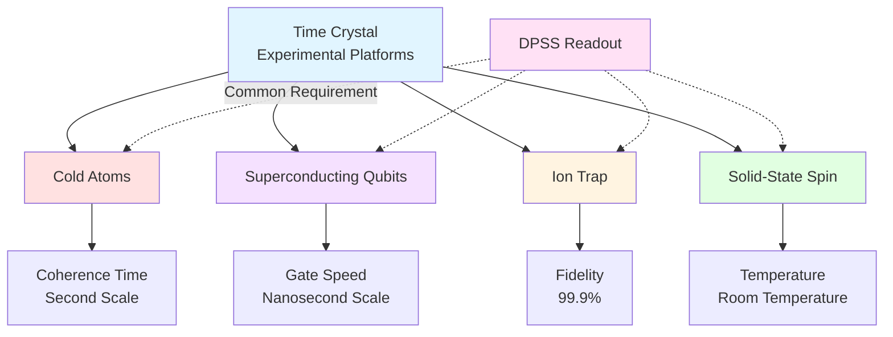
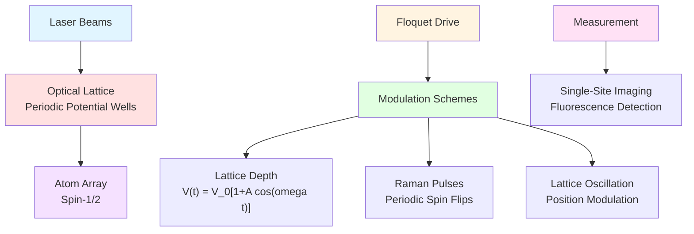
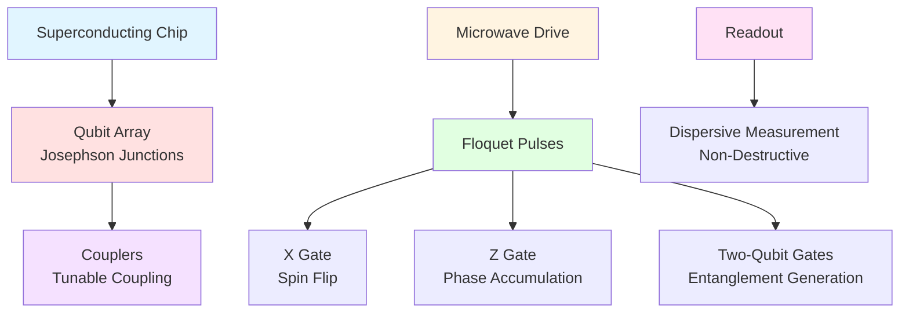
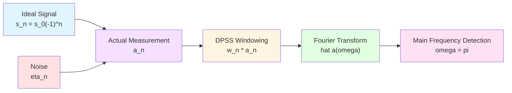
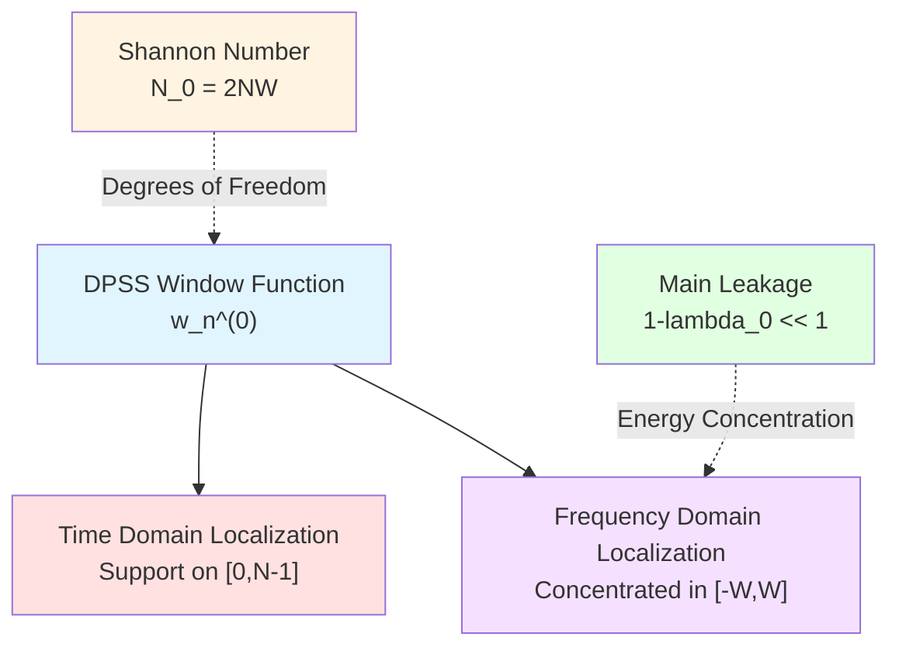
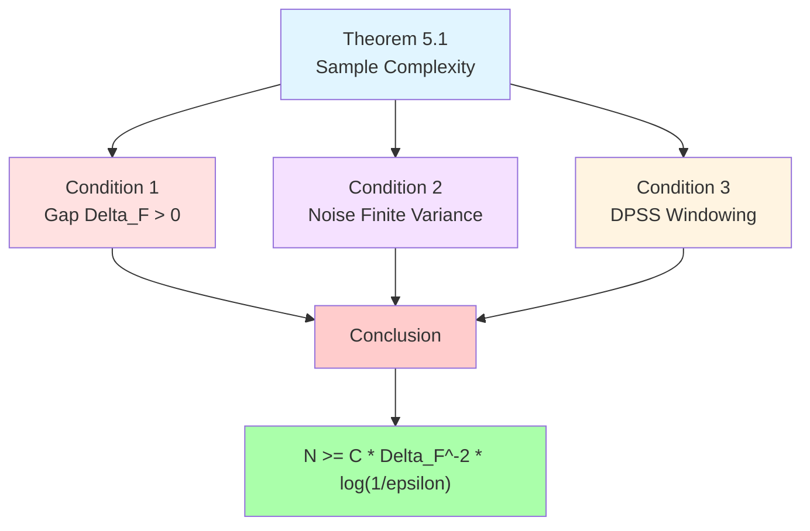
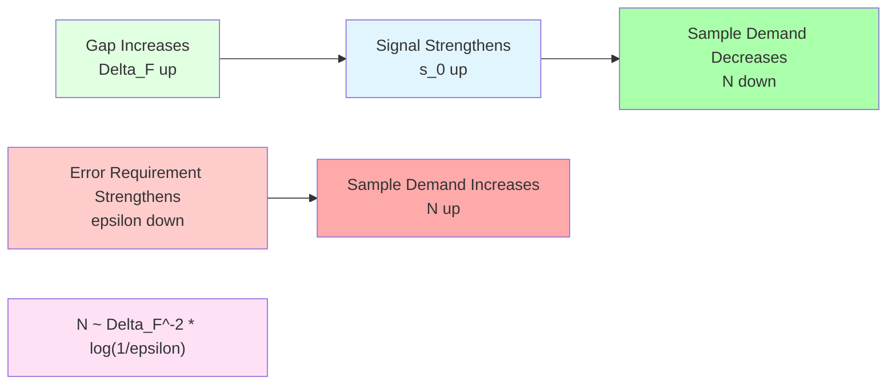
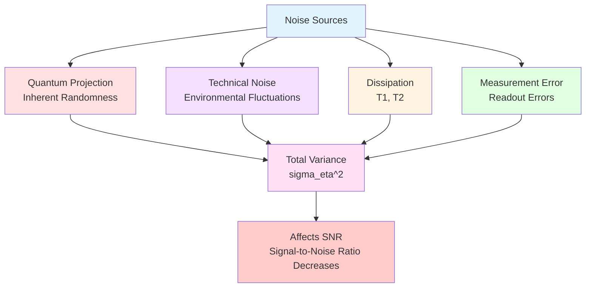
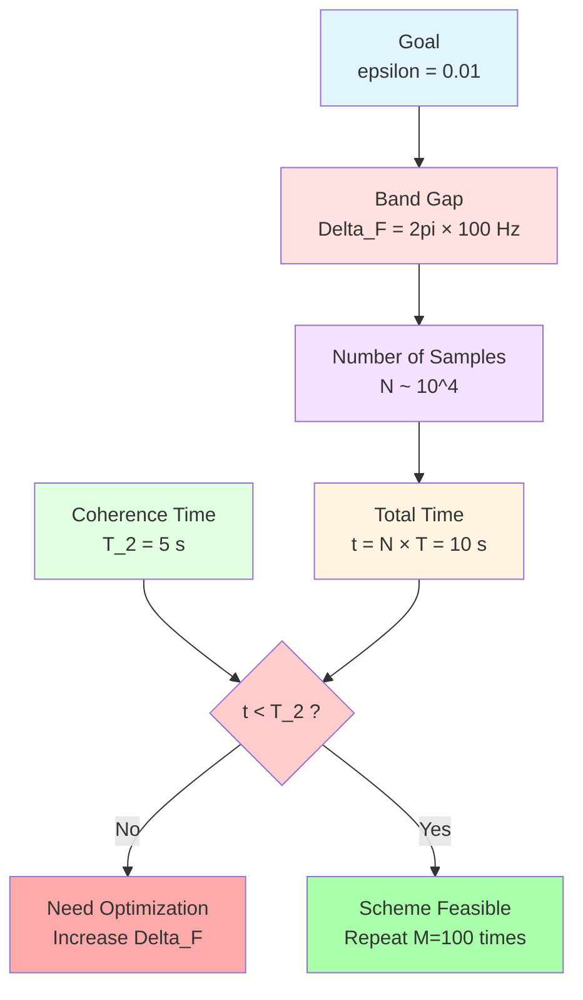
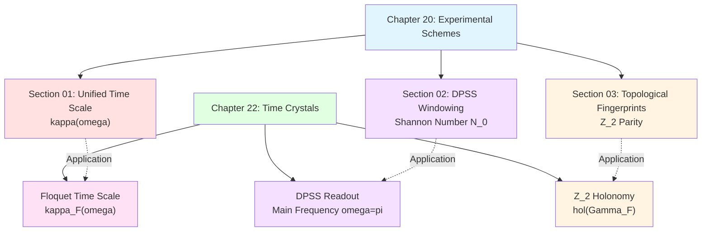

# Chapter 3: Engineering Implementation and Finite Complexity Readout

**Source Theory**: `euler-gls-info/17-time-crystals-null-modular-z2-holonomy.md`, §5; Appendix D

---

## Introduction

The previous two chapters established the theoretical framework for time crystals:
- Chapter 01: Floquet-QCA and period doubling mechanism
- Chapter 02: Z₂ holonomy and topological invariants

Now we face practical questions: **How to observe and measure time crystals in experiments?**

This chapter will answer:
1. Which quantum platforms are suitable for realizing time crystals?
2. How to discriminate time crystal signals within **finite measurement steps**?
3. How many samples are needed for reliable discrimination (sample complexity)?
4. How to handle noise and dissipation?

**Core Tool**: DPSS windowed readout technique (review Chapter 20)

**Everyday Analogy**:
- **Time Crystal Signal**: Weak periodic "heartbeat"
- **Noise**: Background noise
- **DPSS Windowing**: High-sensitivity "stethoscope"
- **Sample Complexity**: How long to listen to confirm heartbeat exists

---

## 1. Experimental Platform Overview

### 1.1 Four Candidate Platforms

Time crystals can be realized on various quantum platforms, each with advantages and disadvantages:

| Platform | Advantages | Disadvantages | TRL Level |
|----------|------------|---------------|-----------|
| **Cold Atom Optical Lattice** | Long coherence time Single-site imaging | Complex preparation Temperature sensitive | TRL 6-7 |
| **Superconducting Qubits** | Fast manipulation Programmable | Short coherence time Crosstalk | TRL 7-8 |
| **Ion Trap** | Ultra-long coherence All-to-all | Scale limited Laser complexity | TRL 6-7 |
| **Solid-State Spin** | Room temperature Integration | Control precision Environmental noise | TRL 5-6 |

**TRL** (Technology Readiness Level): Technology maturity level, 1-9 scale, higher numbers indicate greater maturity.

**Mermaid Platform Comparison**

### 1.2 Platform Selection Criteria

**Key Metrics**:

**(1) Floquet Band Gap** $\Delta_{\rm F}$:
- Larger gap, stronger time crystal signal
- More robust to noise

**(2) Coherence Time** $T_2$:
- Need $T_2 \gg N\cdot T$ ($N$ is number of measurement periods)
- Limits maximum measurable $N$

**(3) Measurement Fidelity** $F_{\rm meas}$:
- Readout error directly affects signal-to-noise ratio
- Need $F_{\rm meas} > 95\%$

**(4) Scalability**:
- Number of lattice sites (system size)
- Parallel measurement capability

**Selection Matrix**:

| Platform | $\Delta_{\rm F}$ | $T_2$ | $F_{\rm meas}$ | Scalability |
|----------|------------------|-------|----------------|-------------|
| Cold Atoms | ⭐⭐⭐ | ⭐⭐⭐⭐⭐ | ⭐⭐⭐⭐ | ⭐⭐⭐ |
| Superconducting Qubits | ⭐⭐⭐⭐ | ⭐⭐ | ⭐⭐⭐⭐ | ⭐⭐⭐⭐ |
| Ion Trap | ⭐⭐⭐⭐ | ⭐⭐⭐⭐⭐ | ⭐⭐⭐⭐⭐ | ⭐⭐ |
| Solid-State Spin | ⭐⭐ | ⭐⭐⭐ | ⭐⭐⭐ | ⭐⭐⭐⭐ |

---

## 2. Cold Atom Optical Lattice Realization

### 2.1 System Composition

**Lattice**: Periodic potential wells formed by optical standing waves

**Atoms**: Alkali metal atoms (e.g., $^{87}$Rb, $^{40}$K)

**Spin States**: Hyperfine levels $|F,m_F\rangle$ simulate spin-1/2

**Floquet Drive**:
- **Method 1**: Periodic modulation of lattice depth
- **Method 2**: Raman pulse driving spin flips
- **Method 3**: Lattice oscillation (shaking)

**Mermaid Cold Atom System**

### 2.2 Specific Experimental Scheme

**Step 1: Prepare Initial State**
$$
|\psi_0\rangle = |\uparrow\downarrow\uparrow\downarrow\cdots\rangle
$$
(antiferromagnetic order)

**Step 2: Floquet Drive**
Period $T=1$ ms, drive $N=100$ periods.

**Step 3: Measure Local Spin**
$$
\langle\sigma_x^z\rangle_n = \langle\psi_n|\sigma_x^z|\psi_n\rangle
$$

**Step 4: DPSS Windowing Analysis**
Apply DPSS windowing to sequence $\{a_n\}_{n=0}^{N-1}$ ($a_n=\langle\sigma_x^z\rangle_n$).

**Expected Results**:
- Main frequency at $\omega=\pi$ (normalized frequency)
- Energy peak significantly above noise floor

**Parameter Estimates** (Source Theory §5.3):

| Parameter | Typical Value | Notes |
|-----------|---------------|-------|
| Number of Lattice Sites | $10\times 10=100$ | Two-dimensional lattice |
| Floquet Period $T$ | 1 ms | Adjustable |
| Band Gap $\Delta_{\rm F}$ | $2\pi\times 100$ Hz | Depends on driving parameters |
| Coherence Time $T_2$ | 1-10 s | Ultracold atoms |
| Maximum Periods $N$ | $1000-10000$ | Limited by $T_2$ |
| Measurement Fidelity | 98% | Fluorescence imaging |

### 2.3 Advantages and Disadvantages of Cold Atoms

**Advantages**:
✅ Long coherence time (second scale) → Can measure large $N$
✅ Single-site resolved imaging → Precise local measurement
✅ Tunable interactions → Flexible control of $\Delta_{\rm F}$
✅ Low temperature environment → Low noise

**Disadvantages**:
❌ Complex preparation (vacuum system, laser cooling)
❌ Temperature sensitive (need $\mu$K level)
❌ Destructive measurement (atoms lost after fluorescence)
❌ Slow cycle rate (minutes per experiment)

---

## 3. Superconducting Qubit Realization

### 3.1 System Composition

**Qubits**: Josephson junctions

**Coupling**: Capacitive or inductive coupling

**Floquet Drive**: Microwave pulse sequences

**Measurement**: Dispersive readout

**Mermaid Superconducting System**

### 3.2 Specific Experimental Scheme

**Step 1: Prepare Initial State**
Prepare via single-qubit gate sequences:
$$
|\psi_0\rangle = |01010101\cdots\rangle
$$

**Step 2: Floquet Drive**
Period $T=1\,\mu$s, drive $N=1000$ periods.

**Step 3: Projective Measurement**
$$
P_z = \langle\sigma_x^z\rangle_n
$$

**Step 4: Repeat Measurement**
Repeat $M=10^4$ times, statistical average.

**Parameter Estimates**:

| Parameter | Typical Value | Notes |
|-----------|---------------|-------|
| Number of Qubits | 10-100 | Current technology |
| Floquet Period $T$ | $0.1-10\,\mu$s | Fast gates |
| Band Gap $\Delta_{\rm F}$ | $2\pi\times 1$ MHz | Adjustable |
| Coherence Time $T_2$ | $10-100\,\mu$s | Main limitation |
| Maximum Periods $N$ | $10-1000$ | Limited by $T_2$ |
| Measurement Fidelity | 99% | Dispersive readout |

### 3.3 Advantages and Disadvantages of Superconducting Qubits

**Advantages**:
✅ Fast manipulation (nanosecond gates) → High efficiency
✅ Programmable architecture → Flexible control sequences
✅ Non-destructive measurement → Repeatable readout
✅ Mature technology → Industrialization potential

**Disadvantages**:
❌ Short coherence time ($\mu$s scale) → Limits $N$
❌ Crosstalk noise → Affects multi-qubit systems
❌ Low temperature environment (mK level) → Complex equipment
❌ Relatively small gap → Signal-to-noise ratio challenge

---

## 4. DPSS Windowed Readout Scheme

### 4.1 Problem Setup

**Measurement Sequence**:
$$
a_n = \operatorname{tr}(\rho_0 U_F^{\dagger n} O U_F^n),\quad n=0,1,\ldots,N-1
$$

**Ideal Time Crystal Signal** ($m=2$):
$$
s_n = s_0(-1)^n
$$

**Actual Measurement (with noise)**:
$$
a_n = s_n + \eta_n
$$

where $\eta_n$ is noise, assumed:
- Zero mean: $\mathbb{E}[\eta_n]=0$
- Finite variance: $\mathbb{E}[\eta_n^2]=\sigma_\eta^2$
- Finite correlation length: $\mathbb{E}[\eta_n\eta_m]\approx 0$ (when $|n-m|$ large)

**Mermaid Measurement Model**

### 4.2 DPSS Window Function

**DPSS Definition** (Review Chapter 20 Section 02):
Discrete prolate spheroidal sequences (DPSS) are solutions to the following optimization problem:

$$
\max_{\{w_n\}} \frac{\sum_{|k|\le W} |\widehat{w}_k|^2}{\sum_k |\widehat{w}_k|^2}
$$

subject to constraint $\sum_n |w_n|^2=1$.

**Shannon Number**:
$$
N_0 = 2NW
$$

where $N$ is number of samples, $W$ is normalized bandwidth.

**Principal DPSS Sequence** $w_n^{(0)}$ corresponds to largest eigenvalue $\lambda_0\approx 1$.

**Mermaid DPSS Properties**

### 4.3 Windowed Phase Accumulation

**Windowed Fourier Spectrum** (Source Theory §5.2):
$$
\widehat{a}(\omega) = \sum_{n=0}^{N-1} w_n^{(0)} a_n\,\mathrm{e}^{-\mathrm{i}\omega n}
$$

**Main Frequency Detection** ($m=2$ time crystal):
$$
\widehat{a}(\pi) = \sum_{n=0}^{N-1} w_n^{(0)} a_n\,(-1)^n
$$

**Ideal Signal Contribution**:
$$
\widehat{s}(\pi) = s_0\sum_{n} w_n^{(0)}|(-1)^n|^2 = s_0\sum_n |w_n^{(0)}|^2 = s_0
$$

**Noise Variance** (Source Theory §5.3):
$$
\operatorname{Var}(\widehat{a}(\pi)) = \sigma_\eta^2\sum_n |w_n^{(0)}|^2 = \sigma_\eta^2
$$

(assuming window function normalized $\sum_n|w_n^{(0)}|^2=1$)

### 4.4 Signal-to-Noise Ratio and Discrimination Criterion

**Signal-to-Noise Ratio**:
$$
\mathrm{SNR} = \frac{|\mathbb{E}[\widehat{a}(\pi)]|^2}{\operatorname{Var}(\widehat{a}(\pi))} = \frac{|s_0|^2}{\sigma_\eta^2}
$$

**Discrimination Criterion**:
Set threshold $\gamma$, discrimination rule:

$$
\begin{cases}
|\widehat{a}(\pi)| > \gamma & \Rightarrow \text{Time crystal exists} \\
|\widehat{a}(\pi)| \le \gamma & \Rightarrow \text{No time crystal}
\end{cases}
$$

**Error Probability** (Chebyshev inequality):
$$
P(\text{error}) \le \frac{\sigma_\eta^2}{\gamma^2}
$$

Choose $\gamma=c\sigma_\eta$ ($c>1$), then:
$$
P(\text{error}) \le \frac{1}{c^2}
$$

---

## 5. Sample Complexity Theory

### 5.1 Theorem Statement

**Theorem 5.1** (Source Theory §5.3):

Under the following conditions:

**(1) Floquet Band Gap**: $\Delta_{\rm F}>0$

**(2) Bounded Noise**: $\{\eta_n\}$ zero mean, finite correlation length, variance $\sigma_\eta^2$ bounded

**(3) DPSS Windowing**: Use DPSS basis sequence $w_n^{(0)}$ with appropriate bandwidth $W$

Then to discriminate whether period $2T$ time crystal signal exists with error probability at most $\varepsilon$, required complexity steps $N$ satisfy:

$$
\boxed{N \ge C\Delta_{\rm F}^{-2}\log(1/\varepsilon)}
$$

where $C$ is a constant (depends on system details).

**Mermaid Theorem Structure**

### 5.2 Proof Outline

**Step 1: Relationship Between Signal Amplitude and Band Gap**

Floquet band gap $\Delta_{\rm F}$ controls amplitude and dissipation time of time crystal signal:

$$
|s_0| \sim \Delta_{\rm F}\cdot\exp(-\gamma/\Delta_{\rm F})
$$

where $\gamma$ is noise strength.

**Step 2: DPSS Energy Concentration**

DPSS window function is nearly ideal band-limited near frequency band $[-W,W]$, observation at main frequency $\omega=\pi$ is mainly sensitive to time crystal signal, noise is suppressed.

**Step 3: Large Deviation Estimate**

Using Chebyshev inequality or Chernoff bound, require:

$$
\frac{|s_0|^2}{\sigma_\eta^2/N} \ge c_0\log(1/\varepsilon)
$$

i.e., signal-to-noise ratio sufficiently large.

**Step 4: Solve for $N$**

From $|s_0|\sim\Delta_{\rm F}$, get:

$$
N \ge C\frac{\sigma_\eta^2}{\Delta_{\rm F}^2}\log(1/\varepsilon)
$$

After normalization, this is the theorem conclusion.

**Detailed calculations see Source Theory Appendix D.**

### 5.3 Complexity Analysis

**Band Gap Dependence**:
- Larger gap $\Delta_{\rm F}$, stronger signal, fewer samples needed
- $N\propto\Delta_{\rm F}^{-2}$ (inverse square)

**Error Requirement**:
- Smaller error tolerance $\varepsilon$, more samples needed
- $N\propto\log(1/\varepsilon)$ (logarithmic growth, mild)

**Practical Estimates**:

| Band Gap $\Delta_{\rm F}$ | Error $\varepsilon$ | Required $N$ | Experiment Time |
|---------------------------|---------------------|--------------|-----------------|
| $2\pi\times 1$ kHz | $10^{-2}$ | $\sim 10^4$ | Cold atoms: 10 s Superconducting: 10 ms |
| $2\pi\times 100$ Hz | $10^{-2}$ | $\sim 10^6$ | Cold atoms: 1000 s Superconducting: 1 s |
| $2\pi\times 1$ kHz | $10^{-3}$ | $\sim 1.5\times 10^4$ | Slightly increased |

**Mermaid Complexity Trends**

---

## 6. Noise Robustness and Error Control

### 6.1 Noise Source Classification

**Noise in Experiments**:

**(1) Quantum Projection Noise**:
- Inherent randomness of measurement
- Variance $\sim 1/\sqrt{M}$ ($M$ is number of repetitions)

**(2) Technical Noise**:
- Laser intensity fluctuations (cold atoms)
- Microwave power fluctuations (superconducting)
- Magnetic field noise

**(3) Dissipation and Decoherence**:
- Spin relaxation ($T_1$ process)
- Phase decoherence ($T_2$ process)

**(4) Measurement Error**:
- Readout fidelity $<100\%$
- Crosstalk

**Mermaid Noise Sources**

### 6.2 Error Mitigation Strategies

**Strategy 1: Increase Repetition Count**
$$
\sigma_{\rm eff}^2 = \frac{\sigma_\eta^2}{M}
$$

Requires $M$ independent repetitions.

**Strategy 2: Optimize Window Function Bandwidth**

Choose $W\approx 0.1$ (normalized), so DPSS concentrates near main frequency $\omega=\pi$, suppressing out-of-band noise.

**Strategy 3: Dynamical Decoupling**

Insert decoupling pulse sequences in Floquet drive gaps to extend $T_2$.

**Strategy 4: Post-Processing Filtering**

Apply low-pass filtering to measurement sequence $\{a_n\}$ to remove high-frequency noise.

**Strategy 5: Quantum Error Correction Codes**

Encode logical time crystal states in multi-qubit systems, tolerate single-qubit errors.

### 6.3 Weak Non-Unitary Perturbation

**Non-Unitary Floquet Evolution** (Source Theory §3.5 Corollary G):

Actual Floquet operator $U_F$ may not be completely unitary (dissipation), define non-unitary deviation:

$$
\Delta_{\rm nonU}(E) = |U_F^\dagger(E)U_F(E)-\mathbb{I}|_1
$$

**Robustness Condition**:

If satisfied:
$$
\int_{\mathcal{I}} \Delta_{\rm nonU}(E)\,\mathrm{d}E \le \varepsilon
$$

and error budget $\mathcal{E}_h\le\delta_*-\varepsilon$ (review Chapter 21 Section 04), then parity label $\nu_{\rm chain}$ unchanged.

**Physical Meaning**:
As long as dissipation is "sufficiently small" (in integral sense), time crystal phase remains stable.

---

## 7. Experimental Parameter Design Examples

### 7.1 Cold Atom Scheme

**Goal**: Discriminate period-doubling time crystal with error rate $\varepsilon=10^{-2}$.

**System Parameters**:
- Number of lattice sites: $10\times 10=100$
- Floquet period: $T=1$ ms
- Band gap: $\Delta_{\rm F}=2\pi\times 100$ Hz
- Coherence time: $T_2=5$ s

**DPSS Parameters**:
- Bandwidth: $W=0.05$ (normalized)
- Shannon number: $N_0=2NW$

**Sample Requirement**:
$$
N \ge C\Delta_{\rm F}^{-2}\log(1/\varepsilon) \sim 10^4
$$

**Total Measurement Time**:
$$
t_{\rm total} = N\cdot T = 10^4\times 1\,\mathrm{ms} = 10\,\mathrm{s}
$$

✅ Satisfies $t_{\rm total} < T_2$

**Repetition Count**:
$$
M = 100\text{ independent experiments}
$$

**Total Experiment Time**:
$$
T_{\rm exp} = M\cdot t_{\rm total} \sim 1000\,\mathrm{s} \approx 17\,\mathrm{min}
$$

**Mermaid Cold Atom Parameter Flow**

### 7.2 Superconducting Qubit Scheme

**Goal**: Discriminate period-doubling time crystal with error rate $\varepsilon=10^{-2}$.

**System Parameters**:
- Number of qubits: 20
- Floquet period: $T=10\,\mu$s
- Band gap: $\Delta_{\rm F}=2\pi\times 1$ MHz
- Coherence time: $T_2=50\,\mu$s

**Sample Requirement**:
$$
N \ge C\Delta_{\rm F}^{-2}\log(1/\varepsilon) \sim 500
$$

**Total Measurement Time**:
$$
t_{\rm total} = N\cdot T = 500\times 10\,\mu\mathrm{s} = 5\,\mathrm{ms}
$$

✅ Satisfies $t_{\rm total} \ll T_2$

**Repetition Count**:
$$
M = 10^4\text{ times}
$$

**Total Experiment Time**:
$$
T_{\rm exp} = M\cdot t_{\rm total} \sim 50\,\mathrm{s}
$$

**Advantages**:
- Fast cycling (ms scale)
- Can repeat $M$ many times to improve statistics

---

## 8. Connection with Chapter 20 Experimental Schemes

### 8.1 Unified Time Scale Measurement

**Chapter 20 Section 01** (Unified Time Scale) gives triple equivalence:
$$
\kappa(\omega) = \frac{\varphi'(\omega)}{\pi} = \rho_{\rm rel}(\omega) = \frac{1}{2\pi}\operatorname{tr}Q(\omega)
$$

**In Floquet Time Crystals**:
$$
\kappa_F(\omega) = \frac{1}{2\pi}\operatorname{tr}Q_F(\omega),\quad Q_F=-\mathrm{i}U_F^\dagger\partial_\omega U_F
$$

**Single-Period Time Increment**:
$$
\Delta\tau_F = \int_{\Omega_F} w_F(\omega)\kappa_F(\omega)\,\mathrm{d}\omega
$$

### 8.2 PSWF/DPSS Windowing Technique

**Chapter 20 Section 02** (Spectral Windowing) established DPSS theory, directly applied in this chapter:

- Shannon number $N_0=2NW$
- Main leakage upper bound $1-\lambda_0\le\cdots$
- Triple error decomposition

**Specialization in Time Crystals**:
- Main frequency fixed at $\omega=\pi$ (period doubling)
- Bandwidth $W$ chosen to optimize signal-to-noise ratio

### 8.3 Topological Fingerprint Measurement

**Chapter 20 Section 03** (Topological Fingerprints) discussed:
- π-step ladder
- Z₂ parity flip
- Square-root scaling law

**Manifestation in Time Crystals**:
- Z₂ holonomy $\mathrm{hol}_{\mathbb{Z}_2}(\Gamma_F)$ is topological fingerprint
- Windowed parity threshold criterion (Chapter 21 Section 04 Theorem G)

**Mermaid Chapter Connections**

---

## 9. Chapter Summary

### 9.1 Core Content Review

**Experimental Platforms**:
- Cold atoms: Long $T_2$, precise control
- Superconducting qubits: Fast gates, programmable
- Ion traps: Ultra-long coherence, high fidelity
- Solid-state spin: Room temperature, integration

**DPSS Windowed Readout**:
$$
\widehat{a}(\omega) = \sum_{n=0}^{N-1} w_n^{(0)} a_n\,\mathrm{e}^{-\mathrm{i}\omega n}
$$

**Sample Complexity** (Theorem 5.1):
$$
\boxed{N \ge C\Delta_{\rm F}^{-2}\log(1/\varepsilon)}
$$

**Noise Robustness**:
- Increase repetition $M$ to reduce variance
- Optimize window bandwidth $W$ to suppress noise
- Dynamical decoupling to extend $T_2$

**Experimental Parameter Examples**:
- Cold atoms: $N\sim 10^4$, total time 10 s
- Superconducting qubits: $N\sim 500$, total time 5 ms

### 9.2 Key Insights

1. **Finite Complexity is Practical Constraint**:
   Theoretically predicted time crystals must be discriminated within **finite measurement steps** $N$, sample complexity gives realizability criterion.

2. **Band Gap is Core Parameter**:
   Larger $\Delta_{\rm F}$, stronger signal, smaller $N$ requirement. Primary goal of experimental design is to **maximize band gap**.

3. **DPSS is Optimal Windowing**:
   Under given $N$ and $W$, DPSS maximizes frequency domain energy concentration, minimizes worst-case error.

4. **Cross-Platform Unified Framework**:
   Cold atoms, superconducting, ion traps, though physically different, all follow same DPSS windowing theory and sample complexity theorem.

5. **Deep Connection with Scattering Theory**:
   Time crystal readout is essentially **frequency domain scattering measurement**, unified time scale $\kappa_F(\omega)$ runs throughout.

### 9.3 Preview of Next Chapter

Next chapter (**04-time-crystal-summary.md**) will:
- Synthesize entire chapter theory (00-03)
- Discuss open problems and future directions
- Role of time crystals as "unified time scale phase lockers"
- Complementary relationship with FRB observations and δ-ring scattering

---

**End of Chapter**

---

**Source Theory**: `euler-gls-info/17-time-crystals-null-modular-z2-holonomy.md`, §5; Appendix D

