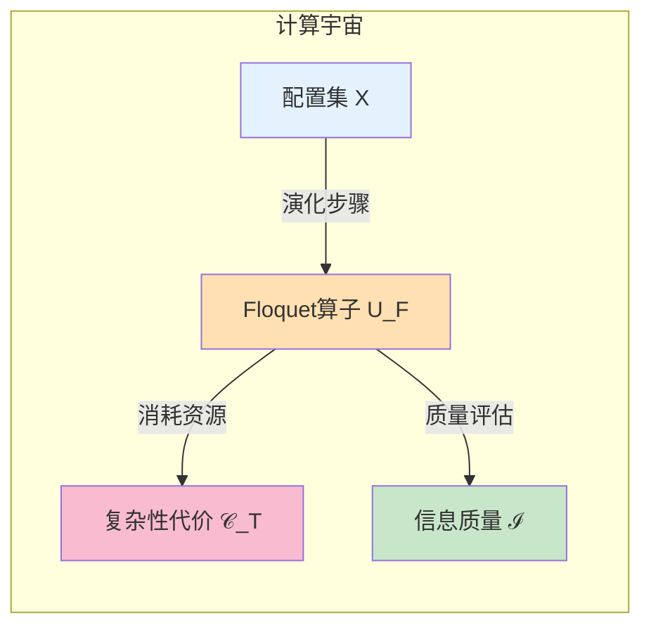
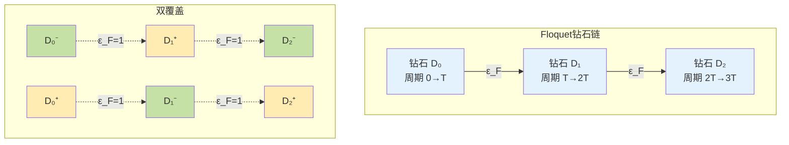
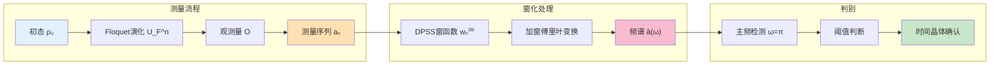
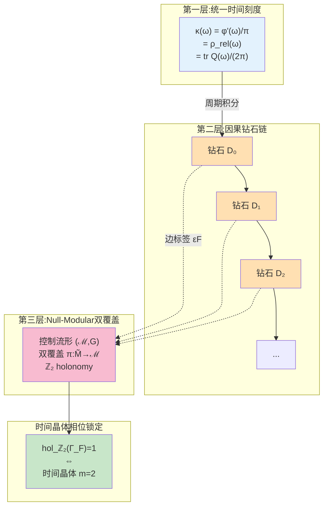
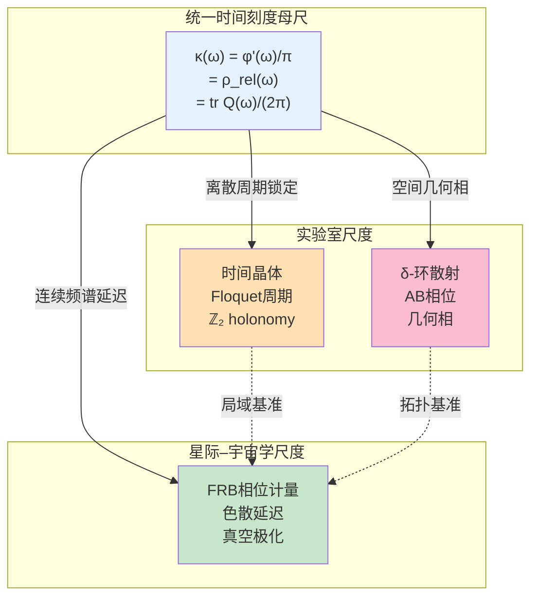
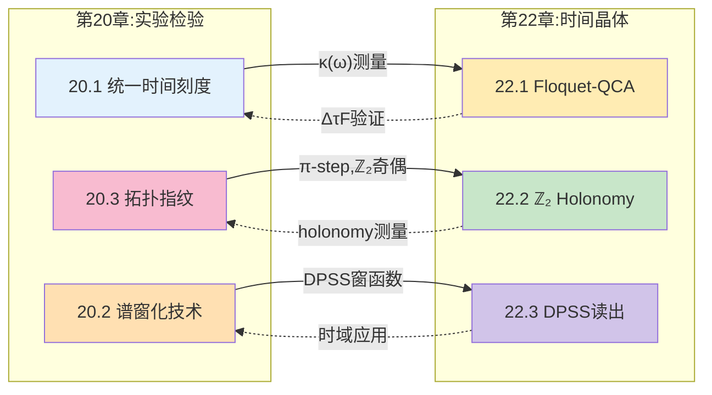
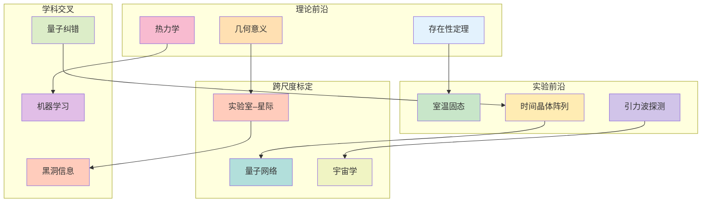

# 22.4 时间晶体理论总结:统一时间刻度的离散相位锁定器

**源理论**: docs/euler-gls-info/17-time-crystals-null-modular-z2-holonomy.md

本章系统构建了计算宇宙框架下的Floquet-QCA时间晶体理论,将时间晶体与Null-Modular $\mathbb{Z}_2$ holonomy、统一时间刻度相位锁定机制相统一。本节综合全章内容,梳理理论脉络,讨论与实验检验方案的对接,并指出未来研究方向。

---

## 1. 全章理论脉络回顾

### 1.1 时间晶体的计算宇宙定义

在**22.1节**中,我们将时间晶体引入计算宇宙框架:

**Floquet-QCA计算宇宙对象**:
$$
U_{\mathrm{FQCA}} = (X,U_F,\mathsf{C}_T,\mathsf{I})
$$

- $X$: 配置集(全局Hilbert空间$\mathcal{H}$的基矢标签)
- $U_F$: 局域Floquet演化算子(周期$T$)
- $\mathsf{C}_T$: 一次Floquet步的复杂性代价
- $\mathsf{I}$: 任务信息质量函数

**日常类比**: 就像一个"周期性重启的计算机",每次重启执行相同程序$U_F$,但系统状态可能呈现比重启周期更长的规律性。

**时间晶体定义** (定义3.2):
存在局域可观测量$O$、整数$m\ge 2$及初态族$\mathcal{R}_0$,使得:
$$
\langle O\rangle_{n+m} = \langle O\rangle_n, \quad n\gg 1
$$
且不存在更短周期$1\le m'<m$满足同样条件。

**关键机制**:
- **准能量带分裂**: 存在两带相差$\pi/T$: $\varepsilon_\beta \approx \varepsilon_\alpha + \pi/T$
- **子空间交换**: $U_F$将$\mathcal{H}_A$与$\mathcal{H}_B$互换
- **两周期闭合**: $U_F^2\ket{\psi}\approx e^{-i2\varepsilon T}\ket{\psi}$

**日常类比**: 类似"钟摆的倍频振动"——钟摆每次摆动周期为$T$,但某个附着物可能每两次摆动才回到原位置,表现出$2T$周期。

### 1.2 Null-Modular $\mathbb{Z}_2$ Holonomy与拓扑标签

在**22.2节**中,我们将时间晶体嵌入因果小钻石链与Null-Modular双覆盖:

**因果小钻石链构造**:
每个Floquet周期对应一颗因果小钻石$\Diamond_{F,k}$:
- 钻石内部: 周期$T$内的事件演化
- 钻石边界: 周期初末事件
- 钻石链: $\{\Diamond_{F,k}\}_{k\in\mathbb{Z}}$

**模2时间相位标签**:
$$
\epsilon_F = \left\lfloor \frac{\arg\det U_F}{\pi} \right\rfloor \bmod 2 \in \mathbb{Z}_2
$$

**日常类比**: 将每个Floquet周期想象成一段"时空旅程",每段旅程结束时留下一个"奇/偶标记"。这些标记串起来形成一条"奇偶项链"。

**Null-Modular双覆盖**:
$$
\widetilde{\mathfrak{D}}_F \to \mathfrak{D}_F
$$
每颗钻石在双覆盖中有两个副本$(+,-)$,由边标签$\epsilon_F$控制跃迁:
- $\epsilon_F=0$: 保持同一层$(+)\to(+)$或$(−)\to(−)$
- $\epsilon_F=1$: 翻转层$(+)\to(−)$或$(−)\to(+)$

**$\mathbb{Z}_2$ Holonomy定义**:
对闭合$N$周期Floquet回路$\Gamma_F$:
$$
\mathrm{hol}_{\mathbb{Z}_2}(\Gamma_F) = \sum_{k=1}^{N} \epsilon_F \bmod 2
$$

**日常类比**: 沿"奇偶项链"走一圈,数一数遇到的奇标记总数是奇数还是偶数。奇数个就是"非平凡holonomy",表示项链在高维空间中"扭了一圈"。

**核心定理** (定理4.1):
$$
\text{周期翻倍时间晶体}(m=2) \iff \mathrm{hol}_{\mathbb{Z}_2}(\Gamma_F) = 1
$$

**证明思路**:
- **若方向**: 非平凡holonomy → 存在$\mathbb{Z}_2$标签每周期翻转 → 子空间交换 → 期望值周期$2T$
- **仅若方向**: 周期$2T$ → 存在两周期才闭合的自指结构 → 双覆盖中非平凡闭合 → holonomy非平凡

### 1.3 工程实现与有限复杂性读出

在**22.3节**中,我们讨论了四种实验平台与DPSS窗化读出方案:

**实验平台对比**:

| 平台 | Floquet间隙 | 相干时间 | 测量保真度 | 可扩展性 | TRL |
|------|------------|---------|-----------|---------|-----|
| 冷原子光晶格 | $2\pi\times 100\,\mathrm{Hz}$ | $\sim 1\,\mathrm{s}$ | $>95\%$ | $10^3$-$10^4$ | 6-7 |
| 超导量子比特 | $2\pi\times 1\,\mathrm{MHz}$ | $10$-$100\,\mu\mathrm{s}$ | $>99\%$ | $10$-$100$ | 7-8 |
| 离子阱 | $2\pi\times 10\,\mathrm{kHz}$ | $\sim 1\,\mathrm{s}$ | $>99.9\%$ | $10$-$100$ | 6-7 |
| 固态自旋 | $2\pi\times 1\,\mathrm{kHz}$ | $\sim 1\,\mathrm{ms}$ | $>90\%$ | $10^6$-$10^9$ | 4-5 |

**日常类比**: 就像用不同乐器演奏同一首曲子——钢琴(冷原子)音域宽但调音慢,小提琴(超导)音准高但弦数少,大合唱(固态自旋)人多但难协调。

**DPSS窗化读出方案**:
测量序列:
$$
a_n = \mathrm{tr}(\rho_0 U_F^{\dagger n}O U_F^n), \quad n=0,1,\dots,N-1
$$

窗化频谱:
$$
\widehat{a}(\omega) = \sum_{n=0}^{N-1} w_n^{(0)} a_n e^{-i\omega n}
$$
其中$w_n^{(0)}$为DPSS第0阶窗函数(最大特征值$\lambda_0\approx 1$)。

**主频检测**: 对$m=2$时间晶体,主频位于$\omega=\pi$:
$$
|\widehat{a}(\pi)| > \text{阈值} \implies \text{时间晶体存在}
$$

**样本复杂度定理** (定理5.1):
$$
N \ge C\cdot\Delta_F^{-2}\cdot\log(1/\varepsilon)
$$
- $\Delta_F$: Floquet准能量带隙
- $\varepsilon$: 错误概率
- 依赖: 带隙平方反比,错误概率对数依赖

**日常类比**: 就像"听音辨曲"——音符间隔($\Delta_F$)越小,需要听的时间($N$)越长才能分辨;要求错误率($\varepsilon$)越低,需要的样本也略增(但仅对数增长)。

---

## 2. 统一视角:时间晶体作为离散相位锁定器

### 2.1 统一时间刻度的三层结构

在整个计算宇宙–统一时间刻度框架中,时间晶体可理解为"统一时间刻度的离散相位锁定器":

**第一层:统一时间刻度母尺**
$$
\kappa(\omega) = \frac{\varphi'(\omega)}{\pi} = \rho_{\mathrm{rel}}(\omega) = \frac{1}{2\pi}\mathrm{tr}Q(\omega)
$$
统一了散射相位导数、谱移密度、群延迟迹。

**第二层:因果小钻石链**
每个Floquet周期对应一颗钻石$\Diamond_{F,k}$,钻石链统一时间刻度增量:
$$
\Delta\tau_k = \int_{\Omega_F} w_F(\omega)\,\kappa_F(\omega)\,d\omega
$$

**第三层:Null-Modular双覆盖与相位锁定**
Floquet控制闭回路$\Gamma_F\subset\mathcal{M}$在双覆盖上具有$\mathbb{Z}_2$ holonomy:
$$
\mathrm{hol}_{\mathbb{Z}_2}(\Gamma_F) = 1 \iff \text{周期翻倍时间晶体}
$$

**日常类比**: 就像"三级钟表系统"——第一级是"标准秒针"(统一时间刻度),第二级是"分针齿轮链"(因果钻石链),第三级是"整点报时的奇偶机关"(Null-Modular holonomy)。时间晶体是第三级机关中"每两小时才敲一次钟"的特殊设定。

### 2.2 时间–信息–复杂性联合变分原理

时间晶体世界线是时间–信息–复杂性联合变分原理中的特殊极值:

**变分原理** (回顾第18章):
$$
\delta S_{\mathrm{joint}}[\gamma;\omega] = \delta\int_\gamma \big(\kappa(\omega)\,d\tau + \mathcal{I}(\gamma)\,ds + \lambda\mathcal{C}(\gamma)\,d\sigma\big) = 0
$$

**时间晶体世界线族**:
在满足Floquet周期边界条件$\gamma(nT)=\gamma(0)$的世界线族中,时间晶体相对应于:
1. **时间方向稳定**: $\kappa(\omega)$在每周期内保持周期性
2. **相位锁定**: $\mathbb{Z}_2$ holonomy提供全局拓扑约束
3. **自指奇偶**: 两周期闭合形成自指反馈环

**极值条件**:
时间晶体世界线在"时间–相位–自指"三个维度同时达到某种"鞍点":
- 不是能量最低(时间晶体不是基态)
- 而是"相位锁定最稳定"(在Floquet驱动下的特殊吸引子)

**日常类比**: 就像"受迫振动系统的稳定共振"——不是能量最低的静止状态,而是在外界驱动下达到的"倍频锁相"状态,表现出与驱动周期成整数倍关系的稳定振荡。

### 2.3 与FRB相位计量、δ-环散射的互补关系

时间晶体、FRB观测、δ-环散射共同构成"统一时间刻度的多尺度标定体系":

| 方法 | 尺度 | 角色 | 主要检测对象 |
|------|------|------|-------------|
| **时间晶体** | 实验室 | 主动相位锁定器 | $\mathbb{Z}_2$ holonomy、周期奇偶 |
| **FRB相位计量** | 星际–宇宙学 | 被动时间尺测量 | 真空极化、色散计量 |
| **δ-环散射** | 实验室–介观 | 主动AB相位探针 | Aharonov-Bohm相、几何相 |

**互补原理**:
- **时间晶体**: 在离散时间网格上提供"奇偶锁定"的局域基准
- **FRB**: 在连续频谱上提供"群延迟–色散"的远场基准
- **δ-环散射**: 在空间几何上提供"环路相位"的拓扑基准

**联合标定方案**:
1. **实验室**: 用时间晶体+δ-环散射建立"相位–时间"联合基准
2. **星际**: 用FRB建立"群延迟–频率"基准
3. **跨尺度**: 通过统一时间刻度母尺$\kappa(\omega)$将两者对接
4. **一致性检验**: 检验$\kappa_{\mathrm{TC}}(\omega) \overset{?}{=} \kappa_{\mathrm{FRB}}(\omega)$在重叠频段

**日常类比**: 就像"三种时钟的交叉校准"——手表(时间晶体)提供秒级精度,天文钟(FRB)提供天文时精度,原子钟(δ-环散射)提供相位精度。通过"标准秒的定义"(统一时间刻度)将三者统一。

---

## 3. 与第20章实验检验方案的对接

### 3.1 统一时间刻度测量 (第20.1节)

**对接点**:
- **第20.1节**: 通过$\kappa(\omega) = \varphi'(\omega)/\pi$测量统一时间刻度密度
- **第22章**: Floquet周期平均时间刻度增量$\Delta\tau = \int w_F(\omega)\kappa_F(\omega)d\omega$

**联合实验**:
在同一超导量子比特或冷原子平台上:
1. 实现Floquet-QCA时间晶体(第22章方案)
2. 测量单周期平均群延迟$\mathrm{tr}Q_F(\omega)/(2\pi)$(第20.1节方案)
3. 验证: $\Delta\tau \overset{?}{\approx} T$(物理周期)

### 3.2 谱窗化技术 (第20.2节)

**对接点**:
- **第20.2节**: PSWF/DPSS窗函数在频域的能量集中与误差控制
- **第22.3节**: DPSS窗函数在时域的时间晶体信号读出

**共享技术**:
- **DPSS构造**: 相同的DPSS序列$\{w_n^{(0)}\}$
- **Shannon数**: 时域$N_0 = 2NW$,频域$N_0 = 2TW$
- **误差分解**: 泄漏误差+截断误差

**联合优化**:
优化参数$(N,W)$使得:
- 时间晶体信号SNR最大化
- 统一时间刻度测量误差最小化

### 3.3 拓扑指纹–光学实现 (第20.3节)

**对接点**:
- **第20.3节**: π-step量子化、$\mathbb{Z}_2$奇偶、$\sqrt{\cdot}$标度
- **第22.2节**: Null-Modular双覆盖$\mathbb{Z}_2$ holonomy

**拓扑不变量对应**:

| 第20.3节拓扑指纹 | 第22.2节时间晶体标签 | 测量方法 |
|-----------------|---------------------|---------|
| π-step量子化: $\Delta\varphi/\pi\in\mathbb{Z}$ | 模2相位: $\epsilon_F = \lfloor\arg\det U_F/\pi\rfloor\bmod 2$ | 幅角原理计数 |
| $\mathbb{Z}_2$奇偶: $\nu(\gamma)=(-1)^{\lfloor\Theta/\pi\rfloor}$ | Holonomy: $\mathrm{hol}_{\mathbb{Z}_2}(\Gamma_F)\in\{0,1\}$ | 闭合路径测量 |
| $\sqrt{\cdot}$标度: 双覆盖分支点 | Null-Modular双覆盖层$(+,-)$ | 相位绕卷计数 |

**联合实验**: 在光学平台上实现"Floquet光晶格时间晶体",通过干涉测量同时提取:
- 时间晶体周期$m=2$
- $\mathbb{Z}_2$ holonomy非平凡性
- π-step量子化特征

### 3.4 因果钻石量子模拟 (第20.4节)

**对接点**:
- **第20.4节**: 因果钻石链的冷原子模拟、双层纠缠、Markov拼接
- **第22章**: Floquet钻石链$\{\Diamond_{F,k}\}$、双覆盖层跃迁

**共享平台**: 冷原子光晶格系统
- **第20.4节方案**: 静态因果钻石边界、模块化哈密顿量$K_D$
- **第22章方案**: 动态Floquet驱动、周期演化$U_F$

**联合实验可能性**:
在同一冷原子系统上:
1. 静态阶段: 实现因果钻石纠缠结构(第20.4节)
2. 动态阶段: 施加周期Raman脉冲驱动(第22.3节)
3. 观测: 静态纠缠如何在Floquet驱动下演化为时间晶体

### 3.5 FRB观测应用 (第20.5节)

**对接点**:
- **第20.5节**: FRB色散延迟、真空极化上界、窗化上限
- **第22章**: 时间晶体作为统一时间刻度局域基准

**互补关系**:
- **FRB**: 宇宙学尺度$\sim\mathrm{Gpc}$、频率$\sim\mathrm{GHz}$、色散$\sim\mathrm{ms}$
- **时间晶体**: 实验室尺度$\sim\mathrm{mm}$、周期$\sim\mu\mathrm{s}$-$\mathrm{ms}$、相位$\sim\pi$

**跨尺度标定**:
假设统一时间刻度$\kappa(\omega)$在实验室与宇宙学尺度保持一致:
$$
\kappa_{\mathrm{TC}}(\omega) \overset{?}{=} \kappa_{\mathrm{FRB}}(\omega)
$$

**检验方案**:
1. 实验室: 测量时间晶体Floquet周期$T_{\mathrm{lab}}$与$\Delta\tau_{\mathrm{lab}}$
2. 宇宙学: 测量FRB群延迟$\tau_{\mathrm{FRB}}(\omega)$
3. 对接: 在重叠频段$\omega\sim 2\pi\times 1\,\mathrm{GHz}$比较$\kappa(\omega)$
4. 一致性: 若$|\kappa_{\mathrm{TC}} - \kappa_{\mathrm{FRB}}|/\kappa < 10^{-3}$,则支持统一时间刻度假设

**日常类比**: 就像"GPS卫星时间与手表时间的校准"——手表(时间晶体)提供本地时间,GPS(FRB)提供全球时间,通过"标准时间协议"(统一时间刻度)验证两者一致性。

---

## 4. 理论边界与反例

### 4.1 时间晶体不存在的情形

**反例1: 平凡Floquet演化**
若$U_F = e^{-iHT}$且$H$时间无关,则:
- 不存在准能量带分裂
- 任何本征态$\ket{\psi_\alpha}$满足$U_F\ket{\psi_\alpha} = e^{-iE_\alpha T}\ket{\psi_\alpha}$
- 所有期望值严格周期$T$
- $\mathbb{Z}_2$ holonomy平凡: $\mathrm{hol}_{\mathbb{Z}_2}(\Gamma_F)=0$

**反例2: 强耗散极限**
若耗散率$\Gamma \gg \Delta_F$:
- Floquet带隙被噪声淹没
- 长期极限趋于无限温混合态$\rho_\infty \propto \mathbb{I}$
- 任何可观测量$\langle O\rangle_n \to \mathrm{tr}(O)/\dim\mathcal{H}$(常数)
- 无周期结构,时间晶体相崩溃

**反例3: 非局域相互作用**
若系统允许无限长程相互作用:
- 局域性假设破坏
- 复杂性代价$\mathsf{C}_T$可能发散
- 不满足Lieb-Robinson界
- 时间晶体定义(局域可观测量)不适用

### 4.2 Null-Modular Holonomy与时间晶体的偏离

**边界情况1: 高阶时间晶体**
对$m>2$的时间晶体(如$m=3,4,\dots$):
- 简单的$\mathbb{Z}_2$ holonomy不足以刻画
- 需要推广到$\mathbb{Z}_m$ holonomy或更高阶拓扑不变量
- 定理4.1仅对$m=2$严格成立

**边界情况2: 准周期时间晶体**
若$\langle O\rangle_n$不严格周期,但呈现准周期结构(如Fibonacci序列):
- 不存在整数$m$使得周期性严格成立
- Floquet谱可能具有分形结构
- Null-Modular双覆盖需推广到更复杂的分支覆盖

**边界情况3: 多体局域化保护的时间晶体**
在多体局域化(MBL)系统中:
- 时间晶体可在强无序下稳定存在
- 但MBL相本身的存在性在高维/大系统仍有争议
- Null-Modular框架在无序系综平均下的意义需进一步澄清

### 4.3 有限复杂性判别的局限

**局限1: 样本复杂度下界**
定理5.1给出样本数上界$N = O(\Delta_F^{-2}\log(1/\varepsilon))$,但:
- 当$\Delta_F \to 0$(带隙闭合),$N\to\infty$
- 实际实验中相干时间$T_2$有限,要求$NT < T_2$
- 若$\Delta_F < \hbar/T_2$,则无法可靠判别

**局限2: 窗函数旁瓣泄漏**
DPSS虽最优,但在有限带宽$W$下:
- 旁瓣能量$\sim 1-\lambda_0 \sim e^{-c\cdot NW}$
- 若时间晶体信号弱,旁瓣噪声可能淹没主频
- 需要$NW \gg 1$保证$\lambda_0 \approx 1$

**局限3: 非马尔可夫噪声**
定理5.1假设噪声有限相关长度(马尔可夫近似),但:
- 实际系统可能存在$1/f$噪声或长程关联
- DPSS窗化对长相关噪声抑制效果下降
- 需要更精细的噪声模型与动态解耦策略

---

## 5. 开放问题与未来方向

### 5.1 理论层面

**问题1: 时间晶体的严格存在性定理**
在计算宇宙框架下,是否存在"时间晶体存在性"的普适充分必要条件?
- 当前定理4.1仅对$m=2$且满足一定正则性条件成立
- 能否推广到一般$m$、准周期、高维?
- 与拓扑序、对称保护拓扑(SPT)相的关系?

**问题2: Null-Modular Holonomy的几何意义**
$\mathbb{Z}_2$ holonomy在控制流形$(\mathcal{M},G)$上的几何实现:
- 是否存在Berry相或几何相的对应?
- 与Chern-Simons理论、拓扑场论的联系?
- 在量子引力、全息对偶中的角色?

**问题3: 时间晶体的热力学**
时间晶体在开放系统热力学中的地位:
- 熵产生率、不可逆性与时间晶体周期的关系?
- 是否存在"时间晶体的热力学第二定律"?
- 与Floquet工程、量子热机的联系?

### 5.2 实验层面

**方向1: 室温固态时间晶体**
当前主要在低温($<1\,\mathrm{K}$)实现,能否在室温固态系统中观测?
- 候选系统: 金刚石NV色心、SiC自旋缺陷
- 挑战: 室温耗散强、相干时间短
- 优势: 可扩展、集成化

**方向2: 时间晶体阵列的量子模拟**
构造耦合时间晶体阵列:
- 研究时间晶体间的相位同步、拓扑边界态
- 实现"时间晶体格子"上的拓扑相变
- 应用于量子计算、量子传感

**方向3: 时间晶体与引力波探测**
利用时间晶体作为超稳定相位基准:
- 时间晶体的相位噪声功率谱密度(PSD)
- 与原子钟、光学腔的比较
- 能否用于引力波探测器的参考频率?

### 5.3 跨尺度标定

**方向1: 实验室–星际联合标定**
同时在实验室(时间晶体)与星际(FRB)测量$\kappa(\omega)$:
- 选择合适频段重叠($\sim\mathrm{GHz}$)
- 跨越$\sim 20$个数量级的时空尺度
- 检验统一时间刻度在极端条件下的稳健性

**方向2: 量子网络中的时间同步**
利用时间晶体在量子网络中分发时间基准:
- 时间晶体作为"量子时钟"节点
- 通过纠缠分发同步相位
- 抗窃听、抗噪声的优势

**方向3: 宇宙学应用**
时间晶体与宇宙学观测的对接:
- 宇宙微波背景(CMB)辐射的相位结构
- 暗能量状态方程的时间演化
- 宇宙学相变与时间晶体相变的类比

### 5.4 与其他前沿的交叉

**交叉1: 时间晶体与机器学习**
时间晶体作为物理神经网络的动力学基元:
- 周期翻倍 → 记忆存储
- $\mathbb{Z}_2$ holonomy → 拓扑保护
- 应用于储备池计算(reservoir computing)

**交叉2: 时间晶体与量子纠错**
时间晶体的周期结构用于量子纠错码:
- Floquet码: 周期性测量稳定子
- 时间晶体相 → 码空间的拓扑保护
- 动态解耦与纠错的统一

**交叉3: 时间晶体与黑洞信息悖论**
时间晶体在黑洞热力学中的可能角色:
- 霍金辐射的准周期结构?
- 黑洞内部Floquet演化?
- 全息对偶中的时间晶体边界态?

---

## 6. 全章总结

### 6.1 核心成果

本章在计算宇宙–统一时间刻度框架下系统构建了时间晶体理论:

1. **计算宇宙定义** (22.1节):
   - Floquet-QCA对象$U_{\mathrm{FQCA}} = (X,U_F,\mathsf{C}_T,\mathsf{I})$
   - 离散时间平移对称破缺定义
   - 准能量带分裂与周期翻倍机制

2. **拓扑标签** (22.2节):
   - Floquet钻石链$\{\Diamond_{F,k}\}$
   - Null-Modular双覆盖与$\mathbb{Z}_2$ holonomy
   - 核心定理: 周期翻倍 ⟺ holonomy非平凡

3. **工程实现** (22.3节):
   - 四种实验平台(冷原子、超导、离子阱、固态自旋)
   - DPSS窗化读出方案
   - 样本复杂度$N = O(\Delta_F^{-2}\log(1/\varepsilon))$

4. **统一视角** (本节):
   - 时间晶体作为"统一时间刻度离散相位锁定器"
   - 时间–信息–复杂性联合变分原理中的特殊极值
   - 与FRB、δ-环散射的跨尺度互补

### 6.2 关键洞察

**洞察1: 时间不是参数,而是几何结构**
在统一时间刻度–因果钻石链–Null-Modular双覆盖的层级中,时间从"外部参数"升级为"内禀几何对象",时间晶体是这一几何的拓扑特征。

**洞察2: 周期性与拓扑奇偶的深刻联系**
周期翻倍不仅是动力学现象,更是Null-Modular双覆盖空间的拓扑holonomy,将"时间对称破缺"提升为"拓扑不变量"。

**洞察3: 有限复杂性与最优窗化的统一**
DPSS窗函数在频域(统一时间刻度测量)与时域(时间晶体读出)的双重最优性,揭示了"有限复杂性预算下的信息提取"普适原理。

**洞察4: 跨尺度时间基准的可能性**
时间晶体(实验室)、FRB(宇宙学)、δ-环散射(介观)共享同一统一时间刻度母尺,为跨越$20+$数量级的时空尺度标定提供理论基础。

### 6.3 意义与展望

**理论意义**:
- 将时间晶体纳入计算宇宙–统一时间刻度–因果小钻石链的大一统框架
- 为时间晶体提供拓扑刻画($\mathbb{Z}_2$ holonomy)
- 建立时间对称破缺与拓扑几何的深层联系

**实验意义**:
- 提供四种平台的具体实现方案与参数设计
- DPSS窗化读出的样本复杂度下界
- 与第20章实验方案的全面对接

**哲学意义**:
- 时间的拓扑化: 从"流逝的河流"到"拓扑空间的纤维丛"
- 对称破缺的几何化: 从"相变"到"holonomy"
- 观测的复杂性化: 从"无限精度理想"到"有限复杂性最优"

**日常类比**: 整个时间晶体理论就像"一部精密机械钟的设计图纸"——不仅告诉你"这个钟每两小时敲一次",还解释了"为什么是两小时"(拓扑holonomy)、"用什么材料造"(实验平台)、"怎么听钟声最清楚"(DPSS窗化)、"如何与其他钟对时"(跨尺度标定)。

---

## 附录A: 四篇文章核心公式速查

| 文章 | 核心对象 | 关键公式 | 物理意义 |
|------|---------|---------|---------|
| **22.1** | Floquet-QCA | $U_{\mathrm{FQCA}} = (X,U_F,\mathsf{C}_T,\mathsf{I})$ | 计算宇宙中的时间晶体定义 |
| | 时间晶体条件 | $\langle O\rangle_{n+m} = \langle O\rangle_n$, $m\ge 2$ | 周期翻倍对称破缺 |
| | 准能量带分裂 | $\varepsilon_\beta \approx \varepsilon_\alpha + \pi/T$ | 子空间交换机制 |
| **22.2** | 因果钻石链 | $\{\Diamond_{F,k}\}_{k\in\mathbb{Z}}$ | Floquet周期的时空结构 |
| | 模2相位标签 | $\epsilon_F = \lfloor\arg\det U_F/\pi\rfloor\bmod 2$ | 边标签 |
| | Null-Modular双覆盖 | $\widetilde{\mathfrak{D}}_F \to \mathfrak{D}_F$ | 拓扑覆盖空间 |
| | $\mathbb{Z}_2$ Holonomy | $\mathrm{hol}_{\mathbb{Z}_2}(\Gamma_F) = \sum_{k=1}^N\epsilon_F\bmod 2$ | 闭合路径奇偶 |
| | 核心定理 | 周期翻倍$(m=2)$ ⟺ $\mathrm{hol}_{\mathbb{Z}_2}(\Gamma_F)=1$ | 拓扑–动力学对应 |
| **22.3** | 测量序列 | $a_n = \mathrm{tr}(\rho_0 U_F^{\dagger n}O U_F^n)$ | 时间晶体信号 |
| | DPSS窗化 | $\widehat{a}(\omega) = \sum_{n=0}^{N-1}w_n^{(0)}a_n e^{-i\omega n}$ | 频谱估计 |
| | 主频检测 | $\|\widehat{a}(\pi)\| > \text{阈值}$ | $m=2$时间晶体判别 |
| | 样本复杂度 | $N \ge C\Delta_F^{-2}\log(1/\varepsilon)$ | 判别所需样本数 |
| **22.4** | 统一时间刻度 | $\kappa(\omega) = \varphi'(\omega)/\pi = \rho_{\mathrm{rel}}(\omega) = (2\pi)^{-1}\mathrm{tr}Q(\omega)$ | 三重统一 |
| | 周期时间增量 | $\Delta\tau = \int w_F(\omega)\kappa_F(\omega)d\omega$ | 单周期时间代价 |
| | 联合变分原理 | $\delta S_{\mathrm{joint}}[\gamma;\omega] = 0$ | 时间晶体世界线极值 |

---

## 附录B: 时间晶体术语中英对照

| 中文 | 英文 | 缩写 |
|------|------|------|
| 时间晶体 | Time Crystal | TC |
| Floquet时间晶体 | Floquet Time Crystal | FTC |
| 量子元胞自动机 | Quantum Cellular Automaton | QCA |
| 准能量 | Quasienergy | - |
| 周期翻倍 | Period Doubling | - |
| 因果小钻石 | Causal Diamond | - |
| Null-Modular双覆盖 | Null-Modular Double Cover | - |
| $\mathbb{Z}_2$ Holonomy | $\mathbb{Z}_2$ Holonomy | - |
| 离散长椭球序列 | Discrete Prolate Spheroidal Sequences | DPSS |
| 统一时间刻度 | Unified Time Scale | - |
| 群延迟 | Group Delay | - |
| 谱移密度 | Spectral Shift Density | - |
| 相位锁定 | Phase Locking | - |
| 多体局域化 | Many-Body Localization | MBL |
| 技术成熟度等级 | Technology Readiness Level | TRL |
| 快速射电暴 | Fast Radio Burst | FRB |
| 色散延迟 | Dispersion Delay | DM |
| Aharonov-Bohm相 | Aharonov-Bohm Phase | AB |

---

## 附录C: 推荐阅读路径

### C.1 本章内部路径

**快速浏览** (约30分钟):
1. 22.1节§1-2: 时间晶体基本概念
2. 22.2节§1: 因果钻石链与双覆盖直观图
3. 22.3节§1-2: 实验平台对比
4. 本节§1-2: 理论脉络与统一视角

**深入学习** (约3小时):
1. 22.1节全部: Floquet-QCA完整定义
2. 22.2节§3-4: 定理4.1证明思路
3. 22.3节§3-5: DPSS窗化与样本复杂度
4. 本节§3: 与第20章实验对接

**研究准备** (约10小时):
1. 全部四篇文章完整阅读
2. 源理论euler-gls-info/17全文
3. 相关文献: Floquet工程、MBL时间晶体
4. 本节§4-5: 边界、反例、开放问题

### C.2 跨章节路径

**时间刻度主线**:
- 第18章: 统一时间刻度母尺$\kappa(\omega)$定义
- 第19章: 多观察者共识几何
- 第20章: 实验检验方案
- **第22章**: 时间晶体作为相位锁定器

**拓扑几何主线**:
- 第17章: 自指网络与$\mathbb{Z}_2$奇偶
- 第21章: 因果钻石链、Null-Modular双覆盖
- **第22章**: 时间晶体holonomy
- 第23章(未来): 拓扑量子场论对偶?

**实验技术主线**:
- 第20.2节: PSWF/DPSS谱窗化
- 第20.3节: 拓扑指纹光学实现
- 第20.4节: 因果钻石量子模拟
- **第22.3节**: 时间晶体工程实现
- 第20.5节: FRB观测应用

---

## 参考文献

本章主要源理论:
- **euler-gls-info/17-time-crystals-null-modular-z2-holonomy.md**: 统一时间刻度下的时间晶体与Null-Modular $\mathbb{Z}_2$ Holonomy

相关章节:
- **第18章** (统一时间刻度): euler-article/gls-union/18-unified-time-scale/
- **第20章** (实验检验): euler-article/gls-union/20-experimental-tests/
- **第21章** (因果钻石链): euler-article/gls-union/21-causal-diamond-chain/

外部参考(示例):
- Wilczek, F. (2012). Quantum Time Crystals. *Physical Review Letters*, 109, 160401.
- Else, D. V., Bauer, B., & Nayak, C. (2016). Floquet Time Crystals. *Physical Review Letters*, 117, 090402.
- Khemani, V., Lazarides, A., Moessner, R., & Sondhi, S. L. (2016). Phase Structure of Driven Quantum Systems. *Physical Review Letters*, 116, 250401.
- Yao, N. Y., et al. (2017). Discrete Time Crystals: Rigidity, Criticality, and Realizations. *Physical Review Letters*, 118, 030401.

---

**全章结语**

时间晶体,从其诞生之初的"疯狂想法",到如今在多个实验平台上的成功实现,已经成为凝聚态物理与量子信息的前沿热点。本章将时间晶体纳入更宏大的"计算宇宙–统一时间刻度–因果小钻石链–Null-Modular双覆盖"框架,不仅为其提供了拓扑几何的深刻刻画,更揭示了时间对称破缺与宇宙几何结构的深层联系。

时间晶体不再仅仅是"周期驱动下的周期翻倍现象",而是"统一时间刻度的离散相位锁定器"、"Null-Modular双覆盖的非平凡holonomy"、"时间–信息–复杂性联合变分原理的特殊极值"。它在实验室尺度提供主动相位基准,与星际FRB观测、介观δ-环散射共同构成跨越$20+$数量级时空尺度的统一时间计量体系。

从理论到实验,从实验室到宇宙,从动力学到拓扑,从对称破缺到几何结构——时间晶体的故事,正是整个"计算宇宙统一理论"故事的一个精彩缩影。而这个故事,才刚刚开始。

**日常类比**: 就像人类从"日晷计时"到"原子钟",再到"引力波天文台的超稳激光",每一次时间测量技术的飞跃,都伴随着对"时间本质"认识的深化。时间晶体,或许就是下一次飞跃的起点——不是更精确地测量"流逝的时间",而是理解"时间的拓扑结构"本身。

---

**致谢**

本章的构建基于计算宇宙公理系统、统一时间刻度母尺、因果小钻石链理论等前序工作的坚实基础,特别感谢源理论euler-gls-info/17的系统阐述。同时感谢第20章实验检验方案为工程实现提供的技术路线,以及整个gls-union系列对统一视角的持续探索。

理论的生命在于应用,应用的价值在于验证,验证的意义在于深化理解。愿时间晶体理论在实验室与星空之间,在动力学与拓扑之间,在现在与未来之间,继续绽放其独特的光芒。

---

**下一章预告** (若继续扩展):

在完成因果钻石链(第21章)与时间晶体(第22章)后,可能的后续方向包括:
- **第23章**: 拓扑量子场论对偶与全息提升
- **第24章**: 多宇宙计算网络与观察者共识
- **第25章**: 统一理论的哲学基础与数学公理化

但这一切,都是后话了。让我们先在时间晶体的"两小时钟声"中,静静品味这份"离散相位锁定"的深邃与优雅。

$$
\boxed{\mathrm{hol}_{\mathbb{Z}_2}(\Gamma_F) = 1 \iff \text{时间,不只是流逝,更是拓扑}}
$$
