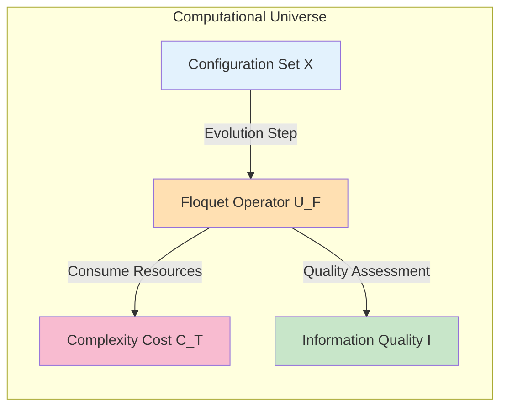
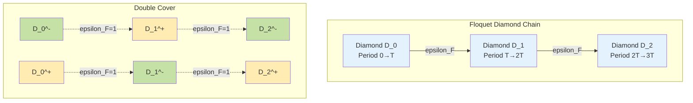
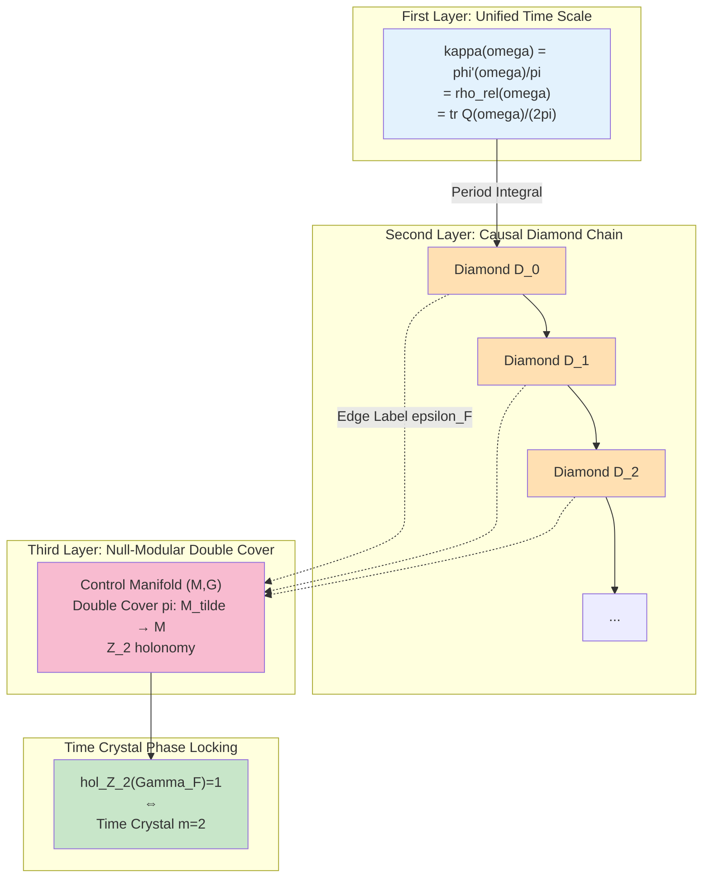
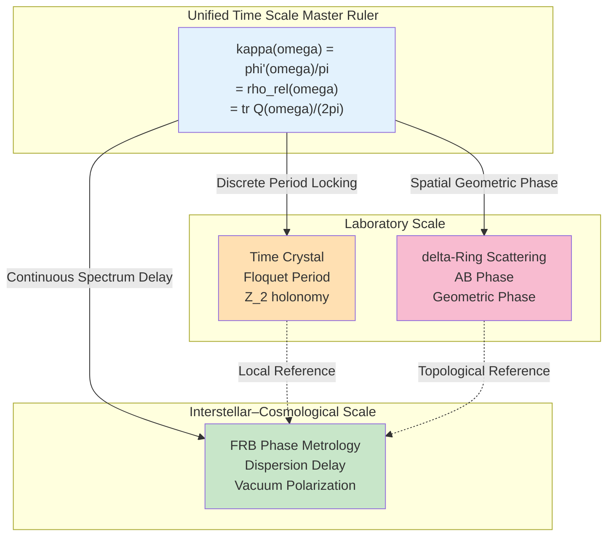
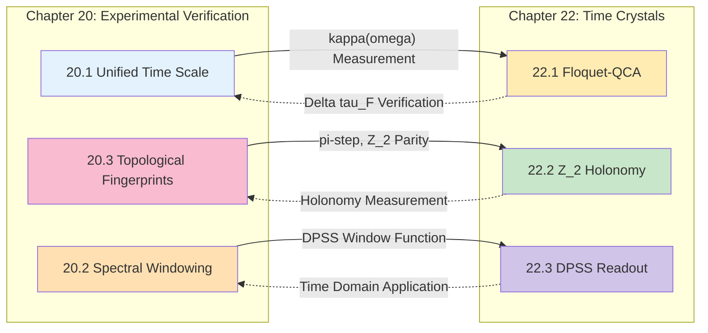
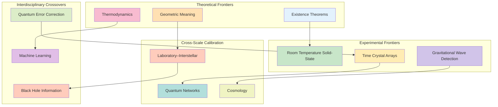

# 22.4 Time Crystal Theory Summary: Discrete Phase Lockers of Unified Time Scale

**Source Theory**: docs/euler-gls-info/17-time-crystals-null-modular-z2-holonomy.md

This chapter systematically constructs Floquet-QCA time crystal theory within the computational universe framework, unifying time crystals with Null-Modular $\mathbb{Z}_2$ holonomy and unified time scale phase locking mechanisms. This section synthesizes the entire chapter, organizes theoretical threads, discusses interfaces with experimental verification schemes, and points out future research directions.

---

## 1. Review of Entire Chapter Theoretical Threads

### 1.1 Computational Universe Definition of Time Crystals

In **Section 22.1**, we introduced time crystals into the computational universe framework:

**Floquet-QCA Computational Universe Object**:
$$
U_{\mathrm{FQCA}} = (X,U_F,\mathsf{C}_T,\mathsf{I})
$$

- $X$: Configuration set (labels of basis vectors of global Hilbert space $\mathcal{H}$)
- $U_F$: Local Floquet evolution operator (period $T$)
- $\mathsf{C}_T$: Complexity cost of one Floquet step
- $\mathsf{I}$: Task information quality function

**Everyday Analogy**: Like a "periodically restarted computer", each restart executes the same program $U_F$, but system state may exhibit regularity longer than restart period.

**Time Crystal Definition** (Definition 3.2):
There exist local observable $O$, integer $m\ge 2$, and initial state family $\mathcal{R}_0$, such that:
$$
\langle O\rangle_{n+m} = \langle O\rangle_n, \quad n\gg 1
$$
and no shorter period $1\le m'<m$ satisfies the same condition.

**Key Mechanism**:
- **Quasienergy Band Splitting**: Two bands differ by $\pi/T$: $\varepsilon_\beta \approx \varepsilon_\alpha + \pi/T$
- **Subspace Exchange**: $U_F$ swaps $\mathcal{H}_A$ and $\mathcal{H}_B$
- **Two-Period Closure**: $U_F^2\ket{\psi}\approx e^{-i2\varepsilon T}\ket{\psi}$

**Everyday Analogy**: Like "frequency doubling vibration of pendulum"—pendulum swings with period $T$, but some attached object may return to original position only every two swings, exhibiting $2T$ period.

### 1.2 Null-Modular $\mathbb{Z}_2$ Holonomy and Topological Labels

In **Section 22.2**, we embedded time crystals into causal diamond chains and Null-Modular double cover:

**Causal Diamond Chain Construction**:
Each Floquet period corresponds to a causal diamond $\Diamond_{F,k}$:
- Diamond interior: Event evolution within period $T$
- Diamond boundary: Initial and final events of period
- Diamond chain: $\{\Diamond_{F,k}\}_{k\in\mathbb{Z}}$

**Mod-2 Time Phase Label**:
$$
\epsilon_F = \left\lfloor \frac{\arg\det U_F}{\pi} \right\rfloor \bmod 2 \in \mathbb{Z}_2
$$

**Everyday Analogy**: Imagine each Floquet period as a "spacetime journey", each journey ends leaving an "odd/even mark". These marks string together forming an "odd-even necklace".

**Null-Modular Double Cover**:
$$
\widetilde{\mathfrak{D}}_F \to \mathfrak{D}_F
$$
Each diamond has two copies $(+,-)$ in double cover, transitions controlled by edge label $\epsilon_F$:
- $\epsilon_F=0$: Stay on same layer $(+)\to(+)$ or $(−)\to(−)$
- $\epsilon_F=1$: Flip layer $(+)\to(−)$ or $(−)\to(+)$

**$\mathbb{Z}_2$ Holonomy Definition**:
For closed $N$-period Floquet loop $\Gamma_F$:
$$
\mathrm{hol}_{\mathbb{Z}_2}(\Gamma_F) = \sum_{k=1}^{N} \epsilon_F \bmod 2
$$

**Everyday Analogy**: Walk around "odd-even necklace", count whether total number of odd marks is odd or even. Odd number means "non-trivial holonomy", indicating necklace "twists once" in higher-dimensional space.

**Core Theorem** (Theorem 4.1):
$$
\text{Period-Doubling Time Crystal}(m=2) \iff \mathrm{hol}_{\mathbb{Z}_2}(\Gamma_F) = 1
$$

**Proof Strategy**:
- **If Direction**: Non-trivial holonomy → Exists $\mathbb{Z}_2$ label flipping per period → Subspace exchange → Expectation value period $2T$
- **Only If Direction**: Period $2T$ → Exists self-referential structure closing in two periods → Non-trivial closure in double cover → Holonomy non-trivial

### 1.3 Engineering Implementation and Finite Complexity Readout

In **Section 22.3**, we discussed four experimental platforms and DPSS windowed readout schemes:

**Experimental Platform Comparison**:

| Platform | Floquet Gap | Coherence Time | Measurement Fidelity | Scalability | TRL |
|----------|-------------|----------------|---------------------|-------------|-----|
| Cold Atom Optical Lattice | $2\pi\times 100\,\mathrm{Hz}$ | $\sim 1\,\mathrm{s}$ | $>95\%$ | $10^3$-$10^4$ | 6-7 |
| Superconducting Qubits | $2\pi\times 1\,\mathrm{MHz}$ | $10$-$100\,\mu\mathrm{s}$ | $>99\%$ | $10$-$100$ | 7-8 |
| Ion Trap | $2\pi\times 10\,\mathrm{kHz}$ | $\sim 1\,\mathrm{s}$ | $>99.9\%$ | $10$-$100$ | 6-7 |
| Solid-State Spin | $2\pi\times 1\,\mathrm{kHz}$ | $\sim 1\,\mathrm{ms}$ | $>90\%$ | $10^6$-$10^9$ | 4-5 |

**Everyday Analogy**: Like playing same piece with different instruments—piano (cold atoms) has wide range but slow tuning, violin (superconducting) has high precision but few strings, chorus (solid-state spin) has many people but hard to coordinate.

**DPSS Windowed Readout Scheme**:
Measurement sequence:
$$
a_n = \mathrm{tr}(\rho_0 U_F^{\dagger n}O U_F^n), \quad n=0,1,\dots,N-1
$$

Windowed spectrum:
$$
\widehat{a}(\omega) = \sum_{n=0}^{N-1} w_n^{(0)} a_n e^{-i\omega n}
$$
where $w_n^{(0)}$ is DPSS 0th-order window function (largest eigenvalue $\lambda_0\approx 1$).

**Main Frequency Detection**: For $m=2$ time crystal, main frequency at $\omega=\pi$:
$$
|\widehat{a}(\pi)| > \text{threshold} \implies \text{Time crystal exists}
$$

```mermaid
graph LR
    subgraph "Measurement Flow"
        M1["Initial State rho_0"]
        M2["Floquet Evolution U_F^n"]
        M3["Observable O"]
        M4["Measurement Sequence a_n"]
    end

    M1 --> M2
    M2 --> M3
    M3 --> M4

    subgraph "Windowing Processing"
        W1["DPSS Window Function w_n^(0)"]
        W2["Windowed Fourier Transform"]
        W3["Spectrum hat a(omega)"]
    end

    M4 --> W1
    W1 --> W2
    W2 --> W3

    subgraph "Discrimination"
        D1["Main Frequency Detection omega=pi"]
        D2["Threshold Judgment"]
        D3["Time Crystal Confirmation"]
    end

    W3 --> D1
    D1 --> D2
    D2 --> D3

    style M1 fill:#E3F2FD
    style M4 fill:#FFE0B2
    style W3 fill:#F8BBD0
    style D3 fill:#C8E6C9
```

**Sample Complexity Theorem** (Theorem 5.1):
$$
N \ge C\cdot\Delta_F^{-2}\cdot\log(1/\varepsilon)
$$
- $\Delta_F$: Floquet quasienergy band gap
- $\varepsilon$: Error probability
- Dependence: Inverse square of gap, logarithmic dependence on error probability

**Everyday Analogy**: Like "listening to identify music"—smaller note intervals ($\Delta_F$), longer listening time ($N$) needed to distinguish; lower error rate ($\varepsilon$) requirement, slightly more samples needed (but only logarithmic growth).

---

## 2. Unified Perspective: Time Crystals as Discrete Phase Lockers

### 2.1 Three-Layer Structure of Unified Time Scale

In the entire computational universe–unified time scale framework, time crystals can be understood as "discrete phase lockers of unified time scale":

**First Layer: Unified Time Scale Master Ruler**
$$
\kappa(\omega) = \frac{\varphi'(\omega)}{\pi} = \rho_{\mathrm{rel}}(\omega) = \frac{1}{2\pi}\mathrm{tr}Q(\omega)
$$
Unifies scattering phase derivative, spectral shift density, group delay trace.

**Second Layer: Causal Diamond Chain**
Each Floquet period corresponds to a diamond $\Diamond_{F,k}$, diamond chain unified time scale increment:
$$
\Delta\tau_k = \int_{\Omega_F} w_F(\omega)\,\kappa_F(\omega)\,d\omega
$$

**Third Layer: Null-Modular Double Cover and Phase Locking**
Floquet control closed loop $\Gamma_F\subset\mathcal{M}$ has $\mathbb{Z}_2$ holonomy on double cover:
$$
\mathrm{hol}_{\mathbb{Z}_2}(\Gamma_F) = 1 \iff \text{Period-doubling time crystal}
$$

**Everyday Analogy**: Like "three-level clock system"—first level is "standard second hand" (unified time scale), second level is "minute hand gear chain" (causal diamond chain), third level is "hour-striking odd-even mechanism" (Null-Modular holonomy). Time crystal is special setting in third level mechanism that "strikes bell only every two hours".

### 2.2 Joint Variational Principle of Time–Information–Complexity

Time crystal worldlines are special extrema in time–information–complexity joint variational principle:

**Variational Principle** (Review Chapter 18):
$$
\delta S_{\mathrm{joint}}[\gamma;\omega] = \delta\int_\gamma \big(\kappa(\omega)\,d\tau + \mathcal{I}(\gamma)\,ds + \lambda\mathcal{C}(\gamma)\,d\sigma\big) = 0
$$

**Time Crystal Worldline Family**:
Among worldline families satisfying Floquet periodic boundary conditions $\gamma(nT)=\gamma(0)$, time crystal phase corresponds to:
1. **Time Direction Stability**: $\kappa(\omega)$ maintains periodicity within each period
2. **Phase Locking**: $\mathbb{Z}_2$ holonomy provides global topological constraint
3. **Self-Referential Parity**: Two-period closure forms self-referential feedback loop

**Extremum Condition**:
Time crystal worldlines simultaneously reach some "saddle point" in three dimensions of "time–phase–self-reference":
- Not energy minimum (time crystals are not ground states)
- But "most stable phase locking" (special attractor under Floquet drive)

**Everyday Analogy**: Like "stable resonance of forced vibration system"—not energy-minimum static state, but "frequency-doubling phase-locked" state under external drive, exhibiting stable oscillation with integer multiple relationship to drive period.

### 2.3 Complementary Relationship with FRB Phase Metrology and δ-Ring Scattering

Time crystals, FRB observations, and δ-ring scattering together constitute "multi-scale calibration system of unified time scale":

| Method | Scale | Role | Main Detection Object |
|--------|-------|------|---------------------|
| **Time Crystals** | Laboratory | Active Phase Locker | $\mathbb{Z}_2$ holonomy, period parity |
| **FRB Phase Metrology** | Interstellar–Cosmological | Passive Time Scale Measurement | Vacuum polarization, dispersion metrology |
| **δ-Ring Scattering** | Laboratory–Mesoscopic | Active AB Phase Probe | Aharonov-Bohm phase, geometric phase |

**Complementary Principle**:
- **Time Crystals**: Provide local reference of "parity locking" on discrete time grid
- **FRB**: Provide far-field reference of "group delay–dispersion" on continuous spectrum
- **δ-Ring Scattering**: Provide topological reference of "loop phase" on spatial geometry

**Joint Calibration Scheme**:
1. **Laboratory**: Use time crystals + δ-ring scattering to establish "phase–time" joint reference
2. **Interstellar**: Use FRB to establish "group delay–frequency" reference
3. **Cross-Scale**: Connect both through unified time scale master ruler $\kappa(\omega)$
4. **Consistency Check**: Verify $\kappa_{\mathrm{TC}}(\omega) \overset{?}{=} \kappa_{\mathrm{FRB}}(\omega)$ in overlapping frequency bands

**Everyday Analogy**: Like "cross-calibration of three clocks"—watch (time crystal) provides second-level precision, astronomical clock (FRB) provides astronomical time precision, atomic clock (δ-ring scattering) provides phase precision. Unify all three through "definition of standard second" (unified time scale).

---

## 3. Interface with Chapter 20 Experimental Verification Schemes

### 3.1 Unified Time Scale Measurement (Section 20.1)

**Interface Point**:
- **Section 20.1**: Measure unified time scale density through $\kappa(\omega) = \varphi'(\omega)/\pi$
- **Chapter 22**: Floquet period average time scale increment $\Delta\tau = \int w_F(\omega)\kappa_F(\omega)d\omega$

**Joint Experiment**:
On same superconducting qubit or cold atom platform:
1. Realize Floquet-QCA time crystal (Chapter 22 scheme)
2. Measure single-period average group delay $\mathrm{tr}Q_F(\omega)/(2\pi)$ (Section 20.1 scheme)
3. Verify: $\Delta\tau \overset{?}{\approx} T$ (physical period)

### 3.2 Spectral Windowing Technique (Section 20.2)

**Interface Point**:
- **Section 20.2**: PSWF/DPSS window function energy concentration and error control in frequency domain
- **Section 22.3**: DPSS window function time crystal signal readout in time domain

**Shared Technology**:
- **DPSS Construction**: Same DPSS sequence $\{w_n^{(0)}\}$
- **Shannon Number**: Time domain $N_0 = 2NW$, frequency domain $N_0 = 2TW$
- **Error Decomposition**: Leakage error + truncation error

**Joint Optimization**:
Optimize parameters $(N,W)$ such that:
- Time crystal signal SNR maximized
- Unified time scale measurement error minimized

### 3.3 Topological Fingerprint–Optical Implementation (Section 20.3)

**Interface Point**:
- **Section 20.3**: π-step quantization, $\mathbb{Z}_2$ parity, $\sqrt{\cdot}$ scaling
- **Section 22.2**: Null-Modular double cover $\mathbb{Z}_2$ holonomy

**Topological Invariant Correspondence**:

| Section 20.3 Topological Fingerprint | Section 22.2 Time Crystal Label | Measurement Method |
|-------------------------------------|-------------------------------|-------------------|
| π-Step Quantization: $\Delta\varphi/\pi\in\mathbb{Z}$ | Mod-2 Phase: $\epsilon_F = \lfloor\arg\det U_F/\pi\rfloor\bmod 2$ | Argument principle counting |
| $\mathbb{Z}_2$ Parity: $\nu(\gamma)=(-1)^{\lfloor\Theta/\pi\rfloor}$ | Holonomy: $\mathrm{hol}_{\mathbb{Z}_2}(\Gamma_F)\in\{0,1\}$ | Closed path measurement |
| $\sqrt{\cdot}$ Scaling: Double cover branch point | Null-Modular double cover layers $(+,-)$ | Phase winding counting |

**Joint Experiment**: Realize "Floquet optical lattice time crystal" on optical platform, simultaneously extract through interference measurement:
- Time crystal period $m=2$
- $\mathbb{Z}_2$ holonomy non-triviality
- π-step quantization features

### 3.4 Causal Diamond Quantum Simulation (Section 20.4)

**Interface Point**:
- **Section 20.4**: Cold atom simulation of causal diamond chains, double-layer entanglement, Markov splicing
- **Chapter 22**: Floquet diamond chain $\{\Diamond_{F,k}\}$, double cover layer transitions

**Shared Platform**: Cold atom optical lattice system
- **Section 20.4 Scheme**: Static causal diamond boundaries, modular Hamiltonian $K_D$
- **Chapter 22 Scheme**: Dynamic Floquet drive, periodic evolution $U_F$

**Joint Experiment Possibility**:
On same cold atom system:
1. Static phase: Realize causal diamond entanglement structure (Section 20.4)
2. Dynamic phase: Apply periodic Raman pulse drive (Section 22.3)
3. Observation: How static entanglement evolves into time crystal under Floquet drive

### 3.5 FRB Observation Application (Section 20.5)

**Interface Point**:
- **Section 20.5**: FRB dispersion delay, vacuum polarization upper bound, windowing upper bound
- **Chapter 22**: Time crystal as unified time scale local reference

**Complementary Relationship**:
- **FRB**: Cosmological scale $\sim\mathrm{Gpc}$, frequency $\sim\mathrm{GHz}$, dispersion $\sim\mathrm{ms}$
- **Time Crystal**: Laboratory scale $\sim\mathrm{mm}$, period $\sim\mu\mathrm{s}$-$\mathrm{ms}$, phase $\sim\pi$

**Cross-Scale Calibration**:
Assume unified time scale $\kappa(\omega)$ consistent between laboratory and cosmological scales:
$$
\kappa_{\mathrm{TC}}(\omega) \overset{?}{=} \kappa_{\mathrm{FRB}}(\omega)
$$

**Verification Scheme**:
1. Laboratory: Measure time crystal Floquet period $T_{\mathrm{lab}}$ and $\Delta\tau_{\mathrm{lab}}$
2. Cosmological: Measure FRB group delay $\tau_{\mathrm{FRB}}(\omega)$
3. Interface: Compare $\kappa(\omega)$ in overlapping frequency band $\omega\sim 2\pi\times 1\,\mathrm{GHz}$
4. Consistency: If $|\kappa_{\mathrm{TC}} - \kappa_{\mathrm{FRB}}|/\kappa < 10^{-3}$, supports unified time scale hypothesis

**Everyday Analogy**: Like "calibration of GPS satellite time and watch time"—watch (time crystal) provides local time, GPS (FRB) provides global time, verify consistency through "standard time protocol" (unified time scale).

---

## 4. Theoretical Boundaries and Counterexamples

### 4.1 Cases Where Time Crystals Do Not Exist

**Counterexample 1: Trivial Floquet Evolution**
If $U_F = e^{-iHT}$ and $H$ is time-independent, then:
- No quasienergy band splitting
- Any eigenstate $\ket{\psi_\alpha}$ satisfies $U_F\ket{\psi_\alpha} = e^{-iE_\alpha T}\ket{\psi_\alpha}$
- All expectation values strictly periodic $T$
- $\mathbb{Z}_2$ holonomy trivial: $\mathrm{hol}_{\mathbb{Z}_2}(\Gamma_F)=0$

**Counterexample 2: Strong Dissipation Limit**
If dissipation rate $\Gamma \gg \Delta_F$:
- Floquet band gap drowned by noise
- Long-term limit tends to infinite temperature mixed state $\rho_\infty \propto \mathbb{I}$
- Any observable $\langle O\rangle_n \to \mathrm{tr}(O)/\dim\mathcal{H}$ (constant)
- No periodic structure, time crystal phase collapses

**Counterexample 3: Non-Local Interactions**
If system allows infinite long-range interactions:
- Locality assumption broken
- Complexity cost $\mathsf{C}_T$ may diverge
- Does not satisfy Lieb-Robinson bound
- Time crystal definition (local observable) not applicable

### 4.2 Deviations Between Null-Modular Holonomy and Time Crystals

**Boundary Case 1: Higher-Order Time Crystals**
For $m>2$ time crystals (e.g., $m=3,4,\dots$):
- Simple $\mathbb{Z}_2$ holonomy insufficient to characterize
- Need generalization to $\mathbb{Z}_m$ holonomy or higher-order topological invariants
- Theorem 4.1 strictly holds only for $m=2$

**Boundary Case 2: Quasi-Periodic Time Crystals**
If $\langle O\rangle_n$ not strictly periodic, but exhibits quasi-periodic structure (e.g., Fibonacci sequence):
- No integer $m$ such that periodicity strictly holds
- Floquet spectrum may have fractal structure
- Null-Modular double cover needs generalization to more complex branched covers

**Boundary Case 3: Many-Body Localization Protected Time Crystals**
In many-body localization (MBL) systems:
- Time crystals can stably exist under strong disorder
- But existence of MBL phase itself still controversial in high dimensions/large systems
- Meaning of Null-Modular framework under disorder ensemble average needs further clarification

### 4.3 Limitations of Finite Complexity Discrimination

**Limitation 1: Sample Complexity Lower Bound**
Theorem 5.1 gives sample number upper bound $N = O(\Delta_F^{-2}\log(1/\varepsilon))$, but:
- When $\Delta_F \to 0$ (gap closes), $N\to\infty$
- Actual experiments have finite coherence time $T_2$, require $NT < T_2$
- If $\Delta_F < \hbar/T_2$, cannot reliably discriminate

**Limitation 2: Window Function Sidelobe Leakage**
DPSS is optimal, but under finite bandwidth $W$:
- Sidelobe energy $\sim 1-\lambda_0 \sim e^{-c\cdot NW}$
- If time crystal signal weak, sidelobe noise may drown main frequency
- Need $NW \gg 1$ to guarantee $\lambda_0 \approx 1$

**Limitation 3: Non-Markovian Noise**
Theorem 5.1 assumes noise finite correlation length (Markov approximation), but:
- Actual systems may have $1/f$ noise or long-range correlations
- DPSS windowing suppression effect decreases for long-correlated noise
- Need finer noise models and dynamical decoupling strategies

---

## 5. Open Problems and Future Directions

### 5.1 Theoretical Level

**Problem 1: Strict Existence Theorem for Time Crystals**
Under computational universe framework, does there exist universal necessary and sufficient conditions for "time crystal existence"?
- Current Theorem 4.1 holds only for $m=2$ under certain regularity conditions
- Can it generalize to general $m$, quasi-periodic, high dimensions?
- Relationship with topological order, symmetry-protected topological (SPT) phases?

**Problem 2: Geometric Meaning of Null-Modular Holonomy**
Geometric realization of $\mathbb{Z}_2$ holonomy on control manifold $(\mathcal{M},G)$:
- Does there exist correspondence with Berry phase or geometric phase?
- Connection with Chern-Simons theory, topological field theory?
- Role in quantum gravity, holographic duality?

**Problem 3: Thermodynamics of Time Crystals**
Status of time crystals in open system thermodynamics:
- Relationship between entropy production rate, irreversibility, and time crystal period?
- Does there exist "second law of thermodynamics for time crystals"?
- Connection with Floquet engineering, quantum heat engines?

### 5.2 Experimental Level

**Direction 1: Room Temperature Solid-State Time Crystals**
Currently mainly realized at low temperature ($<1\,\mathrm{K}$), can they be observed in room temperature solid-state systems?
- Candidate systems: Diamond NV centers, SiC spin defects
- Challenges: Strong dissipation at room temperature, short coherence time
- Advantages: Scalable, integrable

**Direction 2: Quantum Simulation of Time Crystal Arrays**
Construct coupled time crystal arrays:
- Study phase synchronization between time crystals, topological boundary states
- Realize topological phase transitions on "time crystal lattices"
- Applications to quantum computing, quantum sensing

**Direction 3: Time Crystals and Gravitational Wave Detection**
Use time crystals as ultra-stable phase references:
- Phase noise power spectral density (PSD) of time crystals
- Comparison with atomic clocks, optical cavities
- Can they be used for reference frequency of gravitational wave detectors?

### 5.3 Cross-Scale Calibration

**Direction 1: Laboratory–Interstellar Joint Calibration**
Simultaneously measure $\kappa(\omega)$ in laboratory (time crystals) and interstellar (FRB):
- Choose appropriate frequency band overlap ($\sim\mathrm{GHz}$)
- Span $\sim 20$ orders of magnitude in spacetime scale
- Test robustness of unified time scale under extreme conditions

**Direction 2: Time Synchronization in Quantum Networks**
Use time crystals to distribute time references in quantum networks:
- Time crystals as "quantum clock" nodes
- Synchronize phases through entanglement distribution
- Advantages: Anti-eavesdropping, anti-noise

**Direction 3: Cosmological Applications**
Interface time crystals with cosmological observations:
- Phase structure of cosmic microwave background (CMB) radiation
- Time evolution of dark energy equation of state
- Analogy between cosmological phase transitions and time crystal phase transitions

### 5.4 Crossovers with Other Frontiers

**Crossover 1: Time Crystals and Machine Learning**
Time crystals as dynamical primitives of physical neural networks:
- Period doubling → Memory storage
- $\mathbb{Z}_2$ holonomy → Topological protection
- Applications to reservoir computing

**Crossover 2: Time Crystals and Quantum Error Correction**
Periodic structure of time crystals for quantum error correction codes:
- Floquet codes: Periodic measurement of stabilizers
- Time crystal phase → Topological protection of code space
- Unification of dynamical decoupling and error correction

**Crossover 3: Time Crystals and Black Hole Information Paradox**
Possible role of time crystals in black hole thermodynamics:
- Quasi-periodic structure of Hawking radiation?
- Floquet evolution inside black holes?
- Time crystal boundary states in holographic duality?

---

## 6. Entire Chapter Summary

### 6.1 Core Achievements

This chapter systematically constructs time crystal theory under computational universe–unified time scale framework:

1. **Computational Universe Definition** (Section 22.1):
   - Floquet-QCA object $U_{\mathrm{FQCA}} = (X,U_F,\mathsf{C}_T,\mathsf{I})$
   - Discrete time translation symmetry breaking definition
   - Quasienergy band splitting and period doubling mechanism

2. **Topological Labels** (Section 22.2):
   - Floquet diamond chain $\{\Diamond_{F,k}\}$
   - Null-Modular double cover and $\mathbb{Z}_2$ holonomy
   - Core theorem: Period doubling ⟺ Holonomy non-trivial

3. **Engineering Implementation** (Section 22.3):
   - Four experimental platforms (cold atoms, superconducting, ion traps, solid-state spin)
   - DPSS windowed readout scheme
   - Sample complexity $N = O(\Delta_F^{-2}\log(1/\varepsilon))$

4. **Unified Perspective** (This Section):
   - Time crystals as "discrete phase lockers of unified time scale"
   - Special extrema in time–information–complexity joint variational principle
   - Cross-scale complementarity with FRB, δ-ring scattering

### 6.2 Key Insights

**Insight 1: Time is Not a Parameter, But a Geometric Structure**
In the hierarchy of unified time scale–causal diamond chain–Null-Modular double cover, time upgrades from "external parameter" to "intrinsic geometric object", time crystals are topological features of this geometry.

**Insight 2: Deep Connection Between Periodicity and Topological Parity**
Period doubling is not only a dynamical phenomenon, but also topological holonomy of Null-Modular double cover space, elevating "time symmetry breaking" to "topological invariant".

**Insight 3: Unification of Finite Complexity and Optimal Windowing**
DPSS window function's dual optimality in frequency domain (unified time scale measurement) and time domain (time crystal readout) reveals universal principle of "information extraction under finite complexity budget".

**Insight 4: Possibility of Cross-Scale Time References**
Time crystals (laboratory), FRB (cosmological), δ-ring scattering (mesoscopic) share same unified time scale master ruler, providing theoretical foundation for calibration spanning $20+$ orders of magnitude in spacetime scale.

### 6.3 Significance and Outlook

**Theoretical Significance**:
- Incorporate time crystals into grand unified framework of computational universe–unified time scale–causal diamond chains
- Provide topological characterization ($\mathbb{Z}_2$ holonomy) for time crystals
- Establish deep connection between time symmetry breaking and topological geometry

**Experimental Significance**:
- Provide specific implementation schemes and parameter design for four platforms
- Sample complexity lower bound for DPSS windowed readout
- Comprehensive interface with Chapter 20 experimental schemes

**Philosophical Significance**:
- Topologization of time: From "flowing river" to "fiber bundle of topological space"
- Geometrization of symmetry breaking: From "phase transition" to "holonomy"
- Complexification of observation: From "infinite precision ideal" to "finite complexity optimal"

**Everyday Analogy**: The entire time crystal theory is like "design blueprint of a precision mechanical clock"—not only tells you "this clock strikes every two hours", but also explains "why two hours" (topological holonomy), "what materials to build" (experimental platforms), "how to hear clock sound most clearly" (DPSS windowing), "how to synchronize with other clocks" (cross-scale calibration).

---

## Appendix A: Quick Reference of Core Formulas from Four Articles

| Article | Core Object | Key Formula | Physical Meaning |
|---------|-------------|-------------|-----------------|
| **22.1** | Floquet-QCA | $U_{\mathrm{FQCA}} = (X,U_F,\mathsf{C}_T,\mathsf{I})$ | Time crystal definition in computational universe |
| | Time Crystal Condition | $\langle O\rangle_{n+m} = \langle O\rangle_n$, $m\ge 2$ | Period doubling symmetry breaking |
| | Quasienergy Band Splitting | $\varepsilon_\beta \approx \varepsilon_\alpha + \pi/T$ | Subspace exchange mechanism |
| **22.2** | Causal Diamond Chain | $\{\Diamond_{F,k}\}_{k\in\mathbb{Z}}$ | Spacetime structure of Floquet periods |
| | Mod-2 Phase Label | $\epsilon_F = \lfloor\arg\det U_F/\pi\rfloor\bmod 2$ | Edge label |
| | Null-Modular Double Cover | $\widetilde{\mathfrak{D}}_F \to \mathfrak{D}_F$ | Topological covering space |
| | $\mathbb{Z}_2$ Holonomy | $\mathrm{hol}_{\mathbb{Z}_2}(\Gamma_F) = \sum_{k=1}^N\epsilon_F\bmod 2$ | Closed path parity |
| | Core Theorem | Period doubling$(m=2)$ ⟺ $\mathrm{hol}_{\mathbb{Z}_2}(\Gamma_F)=1$ | Topology–dynamics correspondence |
| **22.3** | Measurement Sequence | $a_n = \mathrm{tr}(\rho_0 U_F^{\dagger n}O U_F^n)$ | Time crystal signal |
| | DPSS Windowing | $\widehat{a}(\omega) = \sum_{n=0}^{N-1}w_n^{(0)}a_n e^{-i\omega n}$ | Spectrum estimation |
| | Main Frequency Detection | $\|\widehat{a}(\pi)\| > \text{threshold}$ | $m=2$ time crystal discrimination |
| | Sample Complexity | $N \ge C\Delta_F^{-2}\log(1/\varepsilon)$ | Required number of samples |
| **22.4** | Unified Time Scale | $\kappa(\omega) = \varphi'(\omega)/\pi = \rho_{\mathrm{rel}}(\omega) = (2\pi)^{-1}\mathrm{tr}Q(\omega)$ | Triple unification |
| | Period Time Increment | $\Delta\tau = \int w_F(\omega)\kappa_F(\omega)d\omega$ | Single-period time cost |
| | Joint Variational Principle | $\delta S_{\mathrm{joint}}[\gamma;\omega] = 0$ | Time crystal worldline extremum |

---

## Appendix B: Time Crystal Terminology Chinese–English Glossary

| Chinese | English | Abbreviation |
|---------|---------|--------------|
| 时间晶体 | Time Crystal | TC |
| Floquet时间晶体 | Floquet Time Crystal | FTC |
| 量子元胞自动机 | Quantum Cellular Automaton | QCA |
| 准能量 | Quasienergy | - |
| 周期翻倍 | Period Doubling | - |
| 因果小钻石 | Causal Diamond | - |
| Null-Modular双覆盖 | Null-Modular Double Cover | - |
| $\mathbb{Z}_2$ Holonomy | $\mathbb{Z}_2$ Holonomy | - |
| 离散长椭球序列 | Discrete Prolate Spheroidal Sequences | DPSS |
| 统一时间刻度 | Unified Time Scale | - |
| 群延迟 | Group Delay | - |
| 谱移密度 | Spectral Shift Density | - |
| 相位锁定 | Phase Locking | - |
| 多体局域化 | Many-Body Localization | MBL |
| 技术成熟度等级 | Technology Readiness Level | TRL |
| 快速射电暴 | Fast Radio Burst | FRB |
| 色散延迟 | Dispersion Delay | DM |
| Aharonov-Bohm相 | Aharonov-Bohm Phase | AB |

---

## Appendix C: Recommended Reading Paths

### C.1 Internal Chapter Paths

**Quick Browse** (~30 minutes):
1. Section 22.1 §1-2: Basic concepts of time crystals
2. Section 22.2 §1: Intuitive diagrams of causal diamond chains and double cover
3. Section 22.3 §1-2: Experimental platform comparison
4. This section §1-2: Theoretical threads and unified perspective

**Deep Learning** (~3 hours):
1. Section 22.1 complete: Full definition of Floquet-QCA
2. Section 22.2 §3-4: Proof strategy of Theorem 4.1
3. Section 22.3 §3-5: DPSS windowing and sample complexity
4. This section §3: Interface with Chapter 20 experiments

**Research Preparation** (~10 hours):
1. Complete reading of all four articles
2. Source theory euler-gls-info/17 full text
3. Related literature: Floquet engineering, MBL time crystals
4. This section §4-5: Boundaries, counterexamples, open problems

### C.2 Cross-Chapter Paths

**Time Scale Main Thread**:
- Chapter 18: Definition of unified time scale master ruler $\kappa(\omega)$
- Chapter 19: Multi-observer consensus geometry
- Chapter 20: Experimental verification schemes
- **Chapter 22**: Time crystals as phase lockers

**Topological Geometry Main Thread**:
- Chapter 17: Self-referential networks and $\mathbb{Z}_2$ parity
- Chapter 21: Causal diamond chains, Null-Modular double cover
- **Chapter 22**: Time crystal holonomy
- Chapter 23 (Future): Topological quantum field theory duality?

**Experimental Technology Main Thread**:
- Section 20.2: PSWF/DPSS spectral windowing
- Section 20.3: Topological fingerprint optical implementation
- Section 20.4: Causal diamond quantum simulation
- **Section 22.3**: Time crystal engineering implementation
- Section 20.5: FRB observation application

---

## References

Main source theory of this chapter:
- **euler-gls-info/17-time-crystals-null-modular-z2-holonomy.md**: Time crystals and Null-Modular $\mathbb{Z}_2$ Holonomy under unified time scale

Related chapters:
- **Chapter 18** (Unified Time Scale): euler-article/gls-union/18-unified-time-scale/
- **Chapter 20** (Experimental Verification): euler-article/gls-union/20-experimental-tests/
- **Chapter 21** (Causal Diamond Chains): euler-article/gls-union/21-causal-diamond-chain/

External References (Examples):
- Wilczek, F. (2012). Quantum Time Crystals. *Physical Review Letters*, 109, 160401.
- Else, D. V., Bauer, B., & Nayak, C. (2016). Floquet Time Crystals. *Physical Review Letters*, 117, 090402.
- Khemani, V., Lazarides, A., Moessner, R., & Sondhi, S. L. (2016). Phase Structure of Driven Quantum Systems. *Physical Review Letters*, 116, 250401.
- Yao, N. Y., et al. (2017). Discrete Time Crystals: Rigidity, Criticality, and Realizations. *Physical Review Letters*, 118, 030401.

---

**Entire Chapter Conclusion**

Time crystals, from their birth as a "crazy idea", to successful realizations on multiple experimental platforms today, have become a frontier hotspot in condensed matter physics and quantum information. This chapter incorporates time crystals into the grander framework of "computational universe–unified time scale–causal diamond chains–Null-Modular double cover", not only providing profound topological geometric characterization, but also revealing deep connections between time symmetry breaking and cosmic geometric structure.

Time crystals are no longer merely "period doubling phenomena under periodic drive", but "discrete phase lockers of unified time scale", "non-trivial holonomy of Null-Modular double cover", "special extrema of time–information–complexity joint variational principle". They provide active phase references at laboratory scale, together with interstellar FRB observations and mesoscopic δ-ring scattering, constituting a unified time metrology system spanning $20+$ orders of magnitude in spacetime scale.

From theory to experiment, from laboratory to cosmos, from dynamics to topology, from symmetry breaking to geometric structure—the story of time crystals is precisely a brilliant microcosm of the entire "computational universe unified theory" story. And this story has just begun.

**Everyday Analogy**: Like humanity's progression from "sundial timekeeping" to "atomic clocks", to "ultra-stable lasers of gravitational wave observatories", each leap in time measurement technology accompanies deepening understanding of "essence of time". Time crystals may be the starting point of the next leap—not more precisely measuring "flowing time", but understanding the "topological structure of time" itself.

---

**Acknowledgments**

This chapter's construction is based on solid foundations of previous work including computational universe axiom system, unified time scale master ruler, causal diamond chain theory, etc. Special thanks to source theory euler-gls-info/17 for systematic exposition. Also thanks to Chapter 20 experimental verification schemes for providing technical routes for engineering implementation, and the entire gls-union series for continuous exploration of unified perspectives.

Life of theory lies in application, value of application lies in verification, meaning of verification lies in deepening understanding. May time crystal theory continue to shine its unique light between laboratory and stars, between dynamics and topology, between present and future.

---

**Preview of Next Chapter** (If continuing expansion):

After completing causal diamond chains (Chapter 21) and time crystals (Chapter 22), possible follow-up directions include:
- **Chapter 23**: Topological quantum field theory duality and holographic lift
- **Chapter 24**: Multi-universe computational networks and observer consensus
- **Chapter 25**: Philosophical foundations and mathematical axiomatization of unified theory

But all this is for later. Let us first quietly savor the depth and elegance of this "discrete phase locking" in the "two-hour chimes" of time crystals.

$$
\boxed{\mathrm{hol}_{\mathbb{Z}_2}(\Gamma_F) = 1 \iff \text{Time is not just flowing, but topology}}
$$

