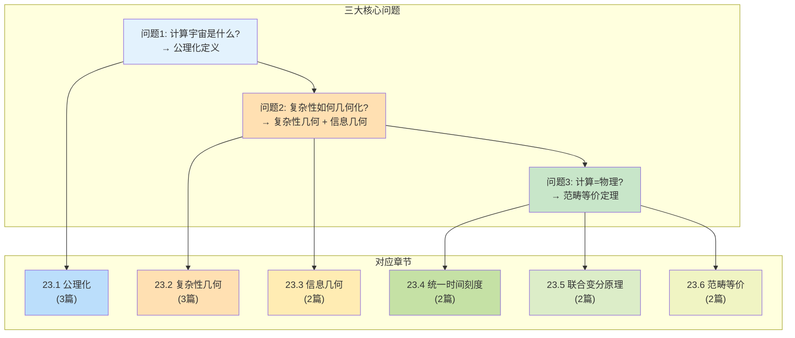
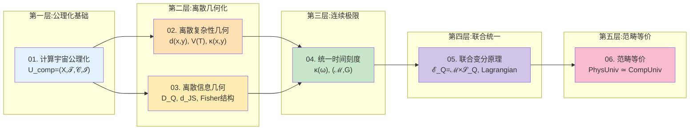
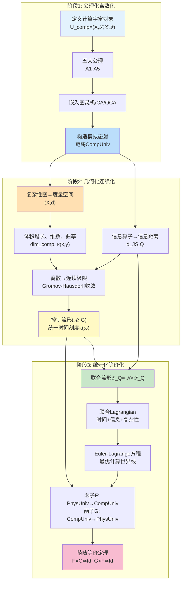
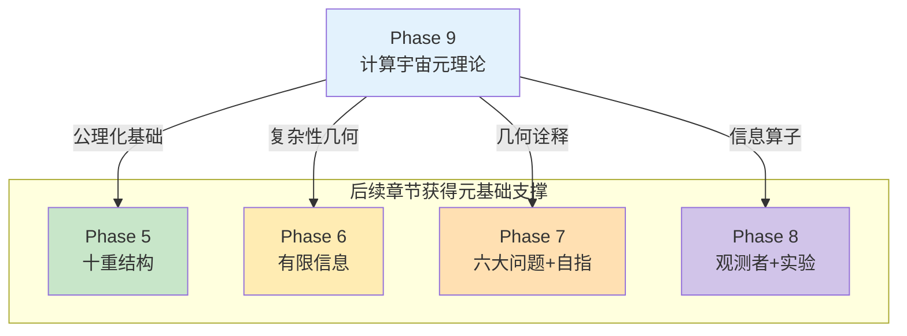

# 23.0 计算宇宙元理论概览:宇宙作为计算的严格数学基础

**源理论**:
- docs/euler-gls-info/01-computational-universe-axiomatics.md
- docs/euler-gls-info/02-discrete-complexity-geometry.md
- docs/euler-gls-info/03-discrete-information-geometry.md
- docs/euler-gls-info/04-unified-time-scale-continuous-complexity-geometry.md
- docs/euler-gls-info/05-time-information-complexity-variational-principle.md
- docs/euler-gls-info/06-categorical-equivalence-computational-physical-universes.md

本章是整个GLS统一理论的**元基础**,回答一个最基本的问题:**为什么宇宙可以被视为计算系统?** 这不是科普式的比喻,而是严格的数学构造——从公理化定义出发,经过几何化,最终证明"计算宇宙范畴"与"物理宇宙范畴"在数学上完全等价。

---

## 1. 为什么需要元基础?

### 1.1 当前教程的"地基缺失"问题

在前面的章节中,我们已经完成了丰富的理论体系:

- **Phase 5** (第15章): 宇宙的十重结构$\mathfrak{U}=(U_{\text{evt}},U_{\text{geo}},\dots,U_{\text{comp}})$
- **Phase 6** (第16章): 有限信息参数宇宙QCA
- **Phase 7-8** (第17-22章): 六大物理问题、自指拓扑、观测者意识、实验检验、时间晶体

但存在一个关键问题:**这些理论都假设"宇宙可以被视为某种计算系统",但从未严格证明过这一假设。**

**日常类比**: 就像建造摩天大楼——Phase 5-8已经建好了50层高楼,但地基(为什么建筑材料可以承重?为什么钢筋混凝土有这样的力学性质?)还没有严格论证。Phase 9就是要**补上这个地基**。

### 1.2 三个核心问题

本章将回答三个递进的问题:

**问题1**: 什么是"计算宇宙"的严格数学定义?
- 不是比喻("宇宙像一台计算机")
- 而是公理化对象: $U_{\mathrm{comp}}=(X,\mathsf{T},\mathsf{C},\mathsf{I})$
- 包括图灵机、元胞自动机、量子细胞自动机等所有计算模型

**问题2**: 如何将"计算复杂性"几何化?
- 传统复杂性理论: $P$、$NP$、$BQP$等复杂度类
- 几何化: 用"曲率"、"体积增长"、"维数"等几何不变量刻画
- 为什么有些问题"难"? 答案藏在复杂性空间的几何中

**问题3**: 为什么"计算宇宙=物理宇宙"?
- 不是类比,而是**范畴等价**: $\mathbf{PhysUniv}^{\mathrm{QCA}} \simeq \mathbf{CompUniv}^{\mathrm{phys}}$
- 存在双向函子$F,G$使得$F\circ G\simeq \mathrm{Id}$,$G\circ F\simeq \mathrm{Id}$
- 这意味着两者在数学结构上**完全一样**,只是"语言"不同

---

## 2. 六篇源理论的依赖关系

本章基于euler-gls-info/目录下的6篇核心理论文件,它们构成一个完整的理论链条:

### 2.1 理论链条概览

### 2.2 六篇理论简介

#### 理论01: 计算宇宙的公理化结构

**核心对象**: $U_{\mathrm{comp}}=(X,\mathsf{T},\mathsf{C},\mathsf{I})$

- $X$: 配置集合(例如:图灵机的纸带状态、元胞自动机的格点状态)
- $\mathsf{T}\subset X\times X$: 一步更新关系(哪个状态可以跳到哪个状态)
- $\mathsf{C}:X\times X\to[0,\infty]$: 单步代价(执行一次更新需要多少"时间")
- $\mathsf{I}:X\to\mathbb{R}$: 信息质量函数(当前状态离"目标"有多远)

**五大公理**:
1. **A1** (有限信息密度): 每个局部区域只能存储有限比特
2. **A2** (局域更新): 每一步更新只影响有限范围
3. **A3** (广义可逆性): 时间可以"倒放"(在物理相关子空间)
4. **A4** (代价加性): 走两步的代价=第一步+第二步
5. **A5** (信息单调性): 计算过程中信息质量不减

**日常类比**: 就像"棋盘游戏"——$X$是所有可能的棋局,$\mathsf{T}$是合法走法,$\mathsf{C}$是走一步需要的思考时间,$\mathsf{I}$是当前局面的"优势评分"。五大公理保证这个游戏是"物理可实现的"。

#### 理论02: 计算宇宙的离散复杂性几何

**核心构造**: 将配置空间$X$变成"度量空间"

- **复杂性图**: $G_{\mathrm{comp}}=(X,E,w)$,边权$w(x,y)=\mathsf{C}(x,y)$
- **复杂性距离**: $d(x,y)=\inf_{\gamma:x\to y}\mathsf{C}(\gamma)$(从$x$到$y$最省资源的路径)
- **可达域**: $B_T(x_0)=\{x:d(x_0,x)\le T\}$(资源预算$T$内能到达的状态)
- **体积增长**: $V_{x_0}(T)=|B_T(x_0)|$(可达状态的个数)

**关键发现**:
- **复杂性维数**: $\dim_{\mathrm{comp}}=\lim(\log V/\log T)$
  - $P$类问题: $\dim_{\mathrm{comp}}=O(1)$(多项式增长)
  - $NP$难问题: $\dim_{\mathrm{comp}}=\infty$(指数增长)

- **离散Ricci曲率**: $\kappa(x,y)=1-W_1(m_x,m_y)/d(x,y)$
  - 非负曲率($\kappa\ge 0$) → 多项式复杂度
  - 负曲率($\kappa<0$) → 指数复杂度

**日常类比**: 就像"城市交通网"——$X$是所有地点,$d(x,y)$是最短行驶时间,$B_T(x_0)$是"$T$小时内能到达的地方"。$\dim_{\mathrm{comp}}$衡量"这个城市有多大",$\kappa(x,y)$衡量"这条路有多拥堵"。

#### 理论03: 计算宇宙的离散信息几何

**核心思想**: 除了"复杂性"(资源消耗),还有"信息"(任务完成度)

- **观察算子族**: $\mathcal{O}=\{O_j:X\to\Delta(Y_j)\}$(在状态$x$执行观察$O_j$,得到概率分布)
- **任务感知相对熵**: $D_Q(x\|y)=\sum_z p_x^{(Q)}(z)\log(p_x^{(Q)}/p_y^{(Q)})$(状态$x,y$对任务$Q$的区分度)
- **信息距离**: $d_{\mathrm{JS},Q}(x,y)=\sqrt{2\mathrm{JS}_Q(x,y)}$(两个状态在信息空间中的距离)

**关键定理**:
- **信息-复杂性不等式**: $\dim_{\mathrm{info},Q}\le\dim_{\mathrm{comp}}$
  - 信息空间的维数不能超过复杂性空间
  - 直观: "你能看到的东西,不能比你能计算的更多"

- **Fisher结构**: 局部上,$d_{\mathrm{JS},Q}\approx\sqrt{\theta^\top g_Q\theta}$(二次型)
  - 信息空间局部是Riemann流形

**日常类比**: 就像"寻宝游戏"——$X$是所有可能的位置,$D_Q(x\|y)$是"在$x$处看到的线索与在$y$处看到的有多不同"。信息几何告诉你"这些线索在逻辑上的距离",而不是物理距离。

#### 理论04: 统一时间刻度与连续复杂性几何

**核心桥梁**: 从离散计算到连续物理时空

- **统一时间刻度密度**:
$$
\kappa(\omega)=\frac{\varphi'(\omega)}{\pi}=\rho_{\mathrm{rel}}(\omega)=\frac{1}{2\pi}\mathrm{tr}Q(\omega)
$$
  - 这是"散射相位导数"="谱移密度"="群延迟迹"的三位一体
  - 单步代价可写为: $\mathsf{C}(x,y)=\int\kappa(\omega)d\mu_{x,y}(\omega)$

- **控制流形**: $(\mathcal{M},G)$
  - $\mathcal{M}$: 控制参数空间(例如:散射矩阵族的参数)
  - $G_{ab}(\theta)=\int w(\omega)\mathrm{tr}(\partial_aQ\partial_bQ)d\omega$: 度量
  - 这个度量是"复杂性距离"在连续极限下的Riemann版本

- **Gromov-Hausdorff收敛**: $(X^{(h)},d^{(h)})\xrightarrow{GH}(\mathcal{M},d_G)$
  - 当离散步长$h\to 0$时,离散复杂性图收敛到连续流形

**日常类比**: 就像"像素到连续画面"——离散的像素网格$(X,d)$在分辨率提高时,逐渐变成连续的画布$(\mathcal{M},G)$。$\kappa(\omega)$是"每个频率对应的时间密度",就像"每种颜色对应的亮度"。

#### 理论05: 时间-信息-复杂性联合变分原理

**核心统一**: 将"时间"、"信息"、"复杂性"三者用一个Lagrangian统一

- **联合流形**: $\mathcal{E}_Q=\mathcal{M}\times\mathcal{S}_Q$
  - $\mathcal{M}$: 控制流形(复杂性几何)
  - $\mathcal{S}_Q$: 信息流形(信息几何)

- **Lagrangian**:
$$
L(\theta,\dot\theta;\phi,\dot\phi)=\frac{1}{2}\alpha^2G_{ab}\dot\theta^a\dot\theta^b+\frac{1}{2}\beta^2g_{ij}\dot\phi^i\dot\phi^j-\gamma U_Q(\phi)
$$
  - 第一项: 控制部分的动能(复杂性代价)
  - 第二项: 信息部分的动能(信息流动)
  - 第三项: 信息势能(任务目标)

- **Euler-Lagrange方程**:
  - 控制部分: $\ddot\theta^a+\Gamma^a_{bc}\dot\theta^b\dot\theta^c=0$(测地线)
  - 信息部分: $\ddot\phi^i+\Gamma^i_{jk}\dot\phi^j\dot\phi^k=-(\gamma/\beta^2)g^{ij}\partial_jU_Q$(势驱动)

**关键洞察**: **最优计算路径=联合流形上的测地线**(在势场作用下)

**日常类比**: 就像"登山路线"——$\theta$是地理位置(复杂性),$\phi$是高度(信息)。最优路线要同时考虑"走得快"(复杂性最小)和"爬得高"(信息最大),还要受到"地形"(势场$U_Q$)的约束。Euler-Lagrange方程就是"最省力的登山路径"。

#### 理论06: 计算宇宙与物理宇宙的范畴等价

**终极定理**: $\mathbf{PhysUniv}^{\mathrm{QCA}}\simeq\mathbf{CompUniv}^{\mathrm{phys}}$

- **物理宇宙对象**: $U_{\mathrm{phys}}=(M,g,\mathcal{F},\kappa,\mathsf{S})$
  - $(M,g)$: 时空流形与度量
  - $\mathcal{F}$: 物质场内容(电磁场、费米子等)
  - $\kappa(\omega)$: 统一时间刻度密度
  - $\mathsf{S}(\omega)$: 散射数据

- **函子$F$**: 从物理宇宙到计算宇宙
  - 将QCA演化算子$U$离散化为$(X,\mathsf{T},\mathsf{C},\mathsf{I})$
  - $X$=QCA基态集合,$\mathsf{T}=\{(x,y):\langle y|U|x\rangle\ne 0\}$
  - $\mathsf{C}$由$\kappa(\omega)$给出

- **函子$G$**: 从计算宇宙到物理宇宙
  - 将离散配置图$(X,d)$通过Gromov-Hausdorff收敛重建为流形$(M,g)$
  - 通过Lieb-Robinson光锥重建因果结构

- **等价性**: $F\circ G\simeq\mathrm{Id}$, $G\circ F\simeq\mathrm{Id}$
  - 存在自然同构$\eta,\epsilon$使得往返一圈后"几乎回到原点"
  - 不变量: 复杂性几何($d_G$)、信息几何($g_Q$)、统一时间刻度($\kappa(\omega)$)

**日常类比**: 就像"中文与英文的完美翻译"——如果存在两个函子$F$(中→英)和$G$(英→中),使得$F\circ G$(中→英→中)="恒等映射",$G\circ F$(英→中→英)="恒等映射",那么中文和英文在"信息结构"上完全等价,只是"表达形式"不同。

---

## 3. 整体路线图:从公理到等价

### 3.1 三大阶段

整个理论分为三个递进阶段:

### 3.2 关键里程碑

| 阶段 | 里程碑 | 意义 | 对应章节 |
|------|--------|------|---------|
| **阶段1** | 公理化定义$U_{\mathrm{comp}}$ | 严格定义"宇宙作为计算" | 23.01-02 |
| | 范畴$\mathbf{CompUniv}$ | 不同计算模型的等价性 | 23.02 |
| **阶段2** | 复杂性几何$(X,d,V,\dim,\kappa)$ | 复杂度类的几何刻画 | 23.03-05 |
| | 信息几何$(\mathcal{S}_Q,d_{\mathrm{JS}},g_Q)$ | 任务感知的信息结构 | 23.06-07 |
| | Gromov-Hausdorff收敛 | 离散→连续的严格桥梁 | 23.08-09 |
| | 统一时间刻度$\kappa(\omega)$ | 计算时间=物理时间 | 23.08 |
| **阶段3** | 联合流形$\mathcal{E}_Q$ | 时间/信息/复杂性统一 | 23.10 |
| | Euler-Lagrange方程 | 最优计算=测地线 | 23.11 |
| | 范畴等价$\mathbf{PhysUniv}\simeq\mathbf{CompUniv}$ | "宇宙即计算"的严格表述 | 23.12 |

---

## 4. 与已完成章节的对接

### 4.1 Phase 5 (宇宙十重结构)的元基础

**Phase 5构造**: $\mathfrak{U}=(U_{\text{evt}},U_{\text{geo}},\dots,U_{\text{comp}})$

**Phase 9补充**:
- $U_{\text{comp}}=(X,\mathsf{T},\mathsf{C},\mathsf{I})$的公理化定义(23.01)
- 为什么$U_{\text{comp}}$可以作为宇宙的第10个组成部分?(23.12范畴等价)
- 十重结构的兼容性条件如何从公理推导?(23.06信息-复杂性不等式)

### 4.2 Phase 6 (有限信息宇宙)的复杂性基础

**Phase 6核心**: $I_{\text{param}}(\Theta)+S_{\max}(\Theta)\le I_{\max}$

**Phase 9补充**:
- 信息容量$I_{\max}$如何从配置空间$X$的体积增长估计?(23.04复杂性维数)
- 参数向量$\Theta$的复杂性几何是什么?(23.05 Ricci曲率)
- 为什么有限信息蕴含局域性?(23.01公理A1)

### 4.3 Phase 7-8 (物理问题与实验)的计算诠释

**Phase 7.1 (六大物理问题)**:
- 黑洞熵$S_{\mathrm{BH}}$与元胞数$d_{\text{eff}}$的关系 → 23.04体积增长
- 宇宙学常数$\Lambda$与谱移密度$\rho_{\mathrm{rel}}$ → 23.08统一时间刻度
- 中微子质量与参数复杂性 → 23.06信息几何

**Phase 7.2 (自指拓扑)**:
- $\pi$-台阶量子化 → 23.05 Ricci曲率的离散版本
- $\mathbb{Z}_2$奇偶 → 23.02模拟态射的对称性

**Phase 8 (观测者、实验、时间晶体)**:
- 观测者的注意力算子 → 23.06观察算子族$\mathcal{O}$
- DPSS窗化读出 → 23.07 Fisher结构
- Floquet-QCA时间晶体 → 23.01 QCA嵌入

---

## 5. 核心公式速查

### 5.1 公理化与范畴

| 对象/概念 | 公式 | 含义 |
|----------|------|------|
| 计算宇宙对象 | $U_{\mathrm{comp}}=(X,\mathsf{T},\mathsf{C},\mathsf{I})$ | 配置+更新+代价+信息 |
| 复杂性距离 | $d(x,y)=\inf_{\gamma:x\to y}\mathsf{C}(\gamma)$ | 最优路径的代价 |
| 可达域 | $B_T(x_0)=\{x:d(x_0,x)\le T\}$ | 预算$T$内可达状态 |
| 模拟映射 | $f:X\to X'$满足$\mathsf{C}'(\gamma')\le\alpha\mathsf{C}(\gamma)+\beta$ | 代价控制的态射 |
| 计算宇宙范畴 | $\mathbf{CompUniv}$ | 对象=计算宇宙,态射=模拟 |

### 5.2 复杂性几何

| 对象/概念 | 公式 | 含义 |
|----------|------|------|
| 体积函数 | $V_{x_0}(T)=\|B_T(x_0)\|$ | 可达状态个数 |
| 复杂性维数 | $\dim_{\mathrm{comp}}=\limsup(\log V/\log T)$ | 空间的"维度" |
| 离散Ricci曲率 | $\kappa(x,y)=1-W_1(m_x,m_y)/d(x,y)$ | 空间的"弯曲程度" |
| 非负曲率蕴含 | $\kappa\ge 0\Rightarrow V(T)\le CT^{d_*}$ | 多项式增长(P类) |
| 负曲率蕴含 | $\kappa<0\Rightarrow V(nT_0)\ge c\lambda^n$ | 指数增长(NP难) |

### 5.3 信息几何

| 对象/概念 | 公式 | 含义 |
|----------|------|------|
| 观察算子 | $O_j:X\to\Delta(Y_j)$ | 配置→概率分布 |
| 任务相对熵 | $D_Q(x\|y)=\sum_z p_x^{(Q)}(z)\log(p_x^{(Q)}/p_y^{(Q)})$ | 信息区分度 |
| JS距离 | $d_{\mathrm{JS},Q}(x,y)=\sqrt{2\mathrm{JS}_Q(x,y)}$ | 信息度量 |
| Fisher矩阵 | $g_{ij}^{(Q)}(\theta)=\sum_z p(\theta,z)\partial_i\log p\partial_j\log p$ | 信息流形的度量 |
| 信息-复杂性不等式 | $\dim_{\mathrm{info},Q}\le\dim_{\mathrm{comp}}$ | 信息不能超过计算 |

### 5.4 统一时间刻度与联合原理

| 对象/概念 | 公式 | 含义 |
|----------|------|------|
| 统一时间刻度 | $\kappa(\omega)=\varphi'(\omega)/\pi=\rho_{\mathrm{rel}}(\omega)=(2\pi)^{-1}\mathrm{tr}Q(\omega)$ | 三位一体母尺 |
| 控制流形度量 | $G_{ab}(\theta)=\int w(\omega)\mathrm{tr}(\partial_aQ\partial_bQ)d\omega$ | 复杂性的Riemann版本 |
| Gromov-Hausdorff收敛 | $(X^{(h)},d^{(h)})\xrightarrow{GH}(\mathcal{M},d_G)$ | 离散→连续 |
| 联合流形 | $\mathcal{E}_Q=\mathcal{M}\times\mathcal{S}_Q$ | 控制×信息 |
| Lagrangian | $L=\frac{1}{2}\alpha^2G_{ab}\dot\theta^a\dot\theta^b+\frac{1}{2}\beta^2g_{ij}\dot\phi^i\dot\phi^j-\gamma U_Q(\phi)$ | 时间+信息+复杂性 |

### 5.5 范畴等价

| 对象/概念 | 公式 | 含义 |
|----------|------|------|
| 物理宇宙对象 | $U_{\mathrm{phys}}=(M,g,\mathcal{F},\kappa,\mathsf{S})$ | 时空+场+时间刻度+散射 |
| 函子$F$ | $F:\mathbf{PhysUniv}^{\mathrm{QCA}}\to\mathbf{CompUniv}^{\mathrm{phys}}$ | QCA离散化 |
| 函子$G$ | $G:\mathbf{CompUniv}^{\mathrm{phys}}\to\mathbf{PhysUniv}^{\mathrm{QCA}}$ | 连续极限重建 |
| 范畴等价 | $F\circ G\simeq\mathrm{Id}$, $G\circ F\simeq\mathrm{Id}$ | 双向可逆 |

---

## 6. 日常类比总览

为了帮助理解这些抽象概念,我们提供一个"平行宇宙类比系统":

| 数学概念 | 日常类比 | 关键映射 |
|---------|---------|---------|
| 配置集合$X$ | 棋盘上所有可能的棋局 | 每个棋局=一个配置 |
| 更新关系$\mathsf{T}$ | 合法的走棋规则 | $(x,y)\in\mathsf{T}$=从棋局$x$可以走到$y$ |
| 代价函数$\mathsf{C}$ | 每步棋需要的思考时间 | $\mathsf{C}(x,y)$=思考这一步的秒数 |
| 信息质量$\mathsf{I}$ | 当前局面的优势评分 | $\mathsf{I}(x)$=局面好坏 |
| 复杂性距离$d(x,y)$ | 从棋局$x$到$y$的最短步数(加权) | $d(x,y)$=最优走法的总思考时间 |
| 可达域$B_T(x_0)$ | 时间$T$内能走到的所有棋局 | $B_T$=时间预算内的搜索空间 |
| 体积增长$V(T)$ | 搜索空间随时间的增长速度 | 围棋:指数增长;井字棋:多项式增长 |
| Ricci曲率$\kappa$ | 棋局空间的"拥挤程度" | 开局:负曲率(选择爆炸);残局:非负曲率(选择收敛) |
| 观察算子$O_j$ | 观察棋局的某个特征(如"黑子数量") | $O_j(x)$=特征的概率分布 |
| 信息距离$d_{\mathrm{JS}}$ | 两个棋局在"特征空间"的距离 | 即使物理棋盘相似,特征可能很不同 |
| 统一时间刻度$\kappa(\omega)$ | 不同"思考频率"对应的时间密度 | 快棋(高频):$\kappa$大;慢棋(低频):$\kappa$小 |
| 控制流形$(\mathcal{M},G)$ | 所有可能的"下棋策略"构成的空间 | $\theta\in\mathcal{M}$=一种策略,$ G$=策略之间的"距离" |
| 联合Lagrangian$L$ | 最优策略的"能量函数" | 平衡"快速走棋"(复杂性)+"准确判断"(信息) |
| 范畴等价 | 围棋规则≃国际象棋规则(在某种翻译下) | 本质相同,只是"表达方式"不同 |

**总类比**: 整个计算宇宙元理论就像"研究所有棋类游戏的统一数学结构"——不管是围棋、象棋还是五子棋,它们都满足某些公理(有限信息、局域更新、可逆性等),都可以几何化(复杂性空间、信息空间),最终都可以用同一套数学框架描述(范畴等价)。

---

## 7. 章节导览

本章共14篇文章,建议按以下顺序阅读:

### 快速浏览路径 (约2小时)

适合想快速了解框架的读者:

1. **23.00** (本文) - 概览与路线图
2. **23.01** - 计算宇宙公理化(重点关注四元组定义与五大公理)
3. **23.03** - 复杂性图与度量(重点关注距离与可达域)
4. **23.08** - 统一时间刻度(重点关注$\kappa(\omega)$的三位一体)
5. **23.12** - 范畴等价(重点关注函子$F,G$与等价定理)
6. **23.13** - 总结与开放问题

### 深入学习路径 (约8-10小时)

适合想系统掌握理论的读者:

**第一部分:公理化基础** (3篇,约3小时)
- 23.01 - 宇宙作为计算:四元组公理化
- 23.02 - 模拟态射与计算宇宙范畴

**第二部分:几何化** (5篇,约4小时)
- 23.03 - 复杂性图与度量
- 23.04 - 体积增长与复杂性维数
- 23.05 - 离散Ricci曲率
- 23.06 - 任务感知信息几何
- 23.07 - Fisher结构与信息-复杂性不等式

**第三部分:连续化与统一** (4篇,约3小时)
- 23.08 - 统一时间刻度与散射母尺
- 23.09 - 控制流形与Gromov-Hausdorff收敛
- 23.10 - 联合流形与时间-信息-复杂性作用量
- 23.11 - Euler-Lagrange方程与计算世界线

**第四部分:等价定理** (2篇,约2小时)
- 23.12 - 物理宇宙↔计算宇宙:范畴等价定理
- 23.13 - 计算宇宙元理论总结

### 研究深化路径 (约20-30小时)

适合想做原创研究的读者:

1. 完整阅读全部14篇文章
2. 对照阅读euler-gls-info/01-06原始理论文件
3. 研究附录中的详细证明
4. 尝试将理论应用到具体问题(如:量子计算复杂度、AI可解释性、黑洞信息悖论等)
5. 探索开放问题(见23.13)

---

## 8. 关键洞察预告

在深入各章节之前,这里预告几个最重要的洞察,作为阅读时的"灯塔":

### 洞察1: 计算宇宙不是比喻,而是数学对象

**传统观点**: "宇宙像一台计算机"是科普式的类比

**本章观点**: 宇宙$U_{\mathrm{phys}}$与计算系统$U_{\mathrm{comp}}$在范畴意义下**严格等价**,即存在保持所有结构的双向可逆映射

**关键**: 统一时间刻度$\kappa(\omega)$是桥梁,它同时是:
- 物理侧: 散射相位导数$\varphi'(\omega)/\pi$
- 计算侧: 单步代价的频域表示

### 洞察2: 复杂度类有几何意义

**传统观点**: $P$、$NP$等复杂度类是"算法跑多久"的分类

**本章观点**: 复杂度类对应复杂性空间的**几何不变量**:
- $P$类 ↔ 非负Ricci曲率 ↔ 多项式体积增长
- $NP$难 ↔ 严格负Ricci曲率 ↔ 指数体积增长
- $BQP$ ↔ 量子Ricci曲率的特殊上界

**关键**: "问题为什么难?"的答案在几何中——负曲率使得可达域爆炸式增长

### 洞察3: 信息维数受复杂性维数约束

**定理**: $\dim_{\mathrm{info},Q}\le\dim_{\mathrm{comp}}$

**直观**: 你能"观察到的"信息,不能比你能"计算到的"更多

**深层**: 这揭示了**知识的计算边界**——即使有无限观察能力,如果计算资源有限,可学习的模式空间也有限

**应用**: AI可解释性、黑洞信息悖论、量子测量理论

### 洞察4: 时间不是参数,而是几何结构

**传统观点**: 时间$t$是外部给定的参数,出现在薛定谔方程等中

**本章观点**: 时间是**内禀几何对象**——统一时间刻度$\kappa(\omega)$是控制流形$(\mathcal{M},G)$上的一个微分几何结构

**关键**: 物理时间=复杂性几何的测地距离,这解释了:
- 为什么时间有"箭头"(复杂性单调递增)
- 为什么时间"均匀流逝"($\kappa(\omega)$在典型频段近似常数)
- 为什么时空可以"弯曲"(控制流形的曲率)

### 洞察5: 最优计算=测地线

**Euler-Lagrange方程**:
$$
\ddot\theta^a+\Gamma^a_{bc}\dot\theta^b\dot\theta^c=0 \quad(\text{控制部分})
$$
$$
\ddot\phi^i+\Gamma^i_{jk}\dot\phi^j\dot\phi^k=-\frac{\gamma}{\beta^2}g^{ij}\partial_jU_Q(\phi) \quad(\text{信息部分})
$$

**含义**: 最优计算路径是联合流形$\mathcal{E}_Q=\mathcal{M}\times\mathcal{S}_Q$上的**测地线**(在势场$U_Q$作用下)

**类比**: 就像光在弯曲时空中走测地线(费马原理),计算在联合流形上也走测地线(最小作用量原理)

**应用**: 量子算法优化、神经网络训练、自然语言处理

### 洞察6: 范畴等价揭示本质相同性

**范畴等价**: $\mathbf{PhysUniv}^{\mathrm{QCA}}\simeq\mathbf{CompUniv}^{\mathrm{phys}}$

**不是**: 物理宇宙"可以用计算模拟"(这只是单向的近似)

**而是**: 物理宇宙与计算宇宙在数学结构上**完全一样**,只是"语言"不同

**类比**: 就像"复数的代数形式$a+bi$"与"复数的极坐标形式$re^{i\theta}$"——本质相同,表达不同

**哲学**: 这颠覆了"物理第一,计算第二"的传统观念,揭示了**物理与计算的对等地位**

---

## 9. 开放问题预览

虽然本章构建了完整的元理论框架,但仍有许多开放问题(详见23.13):

1. **复杂性几何的精细分类**:
   - 能否用Ricci曲率精确刻画$\mathbf{NP}\cap\mathbf{coNP}$等中间复杂度类?
   - 量子Ricci曲率的定义是否唯一?

2. **信息-复杂性不等式的最优常数**:
   - $\dim_{\mathrm{info},Q}\le C\dim_{\mathrm{comp}}$中最小的$C$是多少?
   - 能否构造达到等号的例子?

3. **Gromov-Hausdorff收敛的速率**:
   - 离散到连续的收敛速度是$O(h)$还是$O(h^2)$?
   - 能否给出显式误差界?

4. **联合变分原理的量子版本**:
   - 如何推广到量子信息几何(纯态流形、混合态凸集)?
   - 量子Fisher信息与经典Fisher信息的关系?

5. **范畴等价的物理验证**:
   - 能否设计实验区分"等价"与"近似"?
   - 黑洞内部是否提供反例?

---

## 10. 与后续可能扩展的关系

如果继续扩展本系列教程,Phase 9将成为以下可能章节的基础:

**Phase 10** (几何复杂性分层与AI安全):
- 基于23.04-05的复杂性维数与曲率理论
- P/NP/BQP的几何刻画
- 灾难安全性不可判定定理

**Phase 11** (终对象理论):
- 基于23.02的范畴框架
- 统一计算宇宙终对象$\mathfrak{U}_{\mathrm{comp}}^{\mathrm{term}}$的完整构造
- 与23.12范畴等价的联系

**Phase 12** (因果结构高级专题):
- 基于23.09的Gromov-Hausdorff收敛
- 因果结构几何化:时空作为最小无损压缩
- 与21-causal-diamond-chain的深化

---

## 总结

本章(第23章)补充了整个GLS理论体系的**元基础**——从"宇宙可以被视为计算系统"的直观想法,到严格的公理化定义、几何化构造、范畴等价证明,形成了一个完整的数学框架。

**核心成果**:
1. 计算宇宙对象$U_{\mathrm{comp}}=(X,\mathsf{T},\mathsf{C},\mathsf{I})$的公理化
2. 复杂性几何$(X,d,V,\dim,\kappa)$与信息几何$(\mathcal{S}_Q,d_{\mathrm{JS}},g_Q)$的构造
3. 统一时间刻度$\kappa(\omega)$作为离散-连续桥梁
4. 联合变分原理:时间+信息+复杂性的Lagrangian统一
5. 范畴等价定理:$\mathbf{PhysUniv}^{\mathrm{QCA}}\simeq\mathbf{CompUniv}^{\mathrm{phys}}$

**意义**:
- 为Phase 5-8的所有理论提供了严格的数学地基
- 揭示了"宇宙即计算"不是比喻,而是数学事实
- 为后续可能的扩展(几何复杂度类、终对象理论、因果几何)铺平道路

**下一章**(**23.01 宇宙作为计算:四元组公理化**)将正式开始这段激动人心的旅程,从最基本的定义$U_{\mathrm{comp}}=(X,\mathsf{T},\mathsf{C},\mathsf{I})$出发,逐步构建起整个元理论大厦。

准备好了吗?让我们开始吧!

$$
\boxed{\text{宇宙即计算,计算即几何,几何即等价}}
$$
